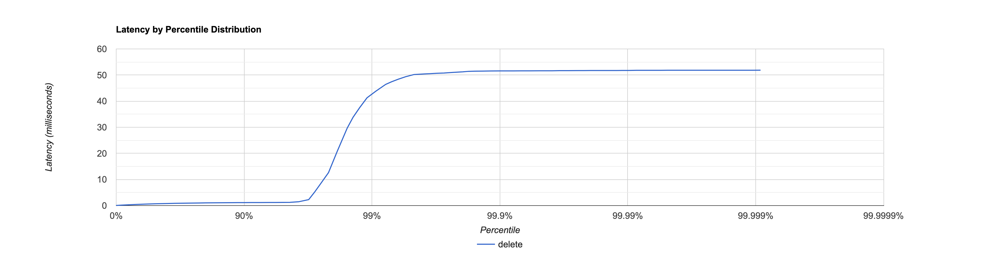
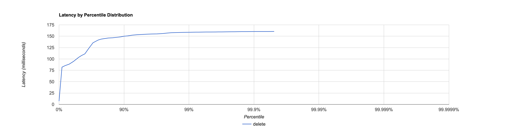
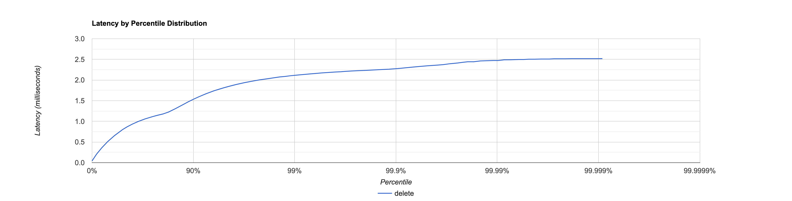
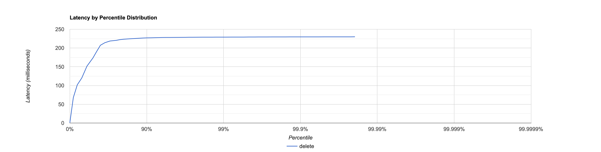

# Отчёт для `flushThresholdBytes = 1_000_000`

# PUT

Для `PUT` запросов был написан [скрипт](scripts/put.lua)

```lua
id = 0
wrk.method = "PUT"
request = function()
    wrk.path = "/v0/entity?id=" .. id
    wrk.body = "№ " .. id
    id = id + 1
    return wrk.format(nil)
end
```

## 10000 запросов

Запускаем команду `wrk2 -t 1 -c 1 -d 10s -R 10000 -L http://localhost:19234 -s reports/HW1/scripts/put.lua`

Получаем следующий результат

```
  1 threads and 1 connections
  Thread Stats   Avg      Stdev     Max   +/- Stdev
    Latency     1.52ms    5.75ms  51.84ms   97.40%
    Req/Sec        nan       nan   0.00      0.00%
  Latency Distribution (HdrHistogram - Recorded Latency)
 50.000%  674.00us
 75.000%    0.97ms
 90.000%    1.14ms
 99.000%   42.94ms
 99.900%   51.55ms
 99.990%   51.78ms
 99.999%   51.84ms
100.000%   51.87ms      
----------------------------------------------------------
  99986 requests in 10.00s, 6.39MB read
Requests/sec:   9998.55
Transfer/sec:    654.20KB
```



**Итог:**
1. Сервер справляется с нагрузкой
2. Среднее latency = 1.52 ms. 
3. Количество запросов в секнду 9998.55 из 10000

## 20000 запросов

Запрос: `wrk2 -t 1 -c 1 -d 10s -R 20000 -L http://localhost:19234 -s reports/HW1/scripts/put.lua`

Результат работы:

```
  1 threads and 1 connections
  Thread Stats   Avg      Stdev     Max   +/- Stdev
    Latency   111.02ms   27.14ms 160.38ms   58.08%
    Req/Sec        nan       nan   0.00      0.00%
  Latency Distribution (HdrHistogram - Recorded Latency)
 50.000%  103.42ms
 75.000%  141.57ms
 90.000%  150.01ms
 99.000%  158.72ms
 99.900%  160.38ms
 99.990%  160.51ms
 99.999%  160.51ms
100.000%  160.51ms

----------------------------------------------------------
  197065 requests in 10.00s, 12.59MB read
Requests/sec:  19706.83
Transfer/sec:      1.26MB
```



**Итог:**

1. Сервер перестаёт справляться со своей работой, начинает пропускать много запросов
2. Среднее latency = 111 ms
3. Количество запросов в секунду 19706 из 20000

## Анализ async-profiler

### CPU

Как видно из отчёта async-profiler [put_cpu_10000](analysis/put_cpu_10000.html)
и [put_cpu_20000](analysis/put_cpu_20000.html)
время распределенно следующим образом:

1. Большая часть времени тратится на обработку запроса (`HttpServer.handleRequest`) 27.5 %. Но гораздо интереснее как
   распределенно время там.
   1. Самой долгой операцией является работа с сетью, а имеено создание отправка ответа от нашего
      сервера (`HttpSession.sendResponse`) 21.54%
   2. На обработку запроса и работу с базой данных (`ServiceImpl.put`) тратится всего 5.43 %, что для меня стало
      неажиданностью (я думал что будет больше).
2. Следующей по длительности была операция принятия самого запроса из сети (`Session.read`) 22.28 %, что в целом не
   удивительно, зная как долго в нашей модели происходит работа с сетью
3. Последней по продолжительности из крупных событий в нашей системе стала работа селекторов с
   сокетами (`JavaSelector.select`) 18.32 %.

Как можно видеть основной bottle neck - работа сети.
Возможными оптимизациями могли быть ленивые ответы на запрос (что не всегда удовлетворяет бизнес логике).
А также распраллеливание задачи, так как видно, что база данных не начинает просадку при увеличении количества запросов
в секунду

### ALLOC

Рассматривая результат представленный в [put_alloc_10000](analysis/put_alloc_10000.html)
и [put_alloc_20000](analysis/put_alloc_20000.html)
можно заметить следующее

1. Большая часть как и в cpu тратится на ответ на запрос (`HttpSession.handleRequest`) 46.10 %.
   Там же память распределена следующим образом:
   1. Большая часть памяти аллоцируется когда сервис получает команду положить в базу (`ServiceImpl.put`) 25.37 %.
      При чём забавно, что на то чтобы действительно положить в базу (`MemorySegmentDao.upsert`) тратится всего 3.66 %
      памяти,
      похоже, что нужно учиться использовать базу менее жадно)).
   2. Посылка ответа (`HttpSession.sendResponse`) ест меньше памяти, но всё же значительную часть 11.22 %.
2. Помимо ответа на запрос, его parse (`HttpSession.parseRequest`) также потребляет много памяти 13.41 %.
3. На прочтение буфера с запросами мы тратим 10.98 % памяти.
4. Так же как и в случае с cpu работа селекторов (`JavaSelector.select`) занимает одну из лидирующих позиций - 11.46 %

В данном случае возможно провести оптимизации в `ServiceImpl`, аллоцируя меньше памяти на промежуточные операции.
В будущей высоко нагруженной системе это имеет смысл.

# GET

Предварительно база была заполнена 20000 различными значениями. Так же как и с `PUT` будем тестировать на 10000 и на
20000 запросах.

Для `GET` был написан следующий [скрипт](scripts/get.lua)

```lua
id = 0
wrk.method = "GET"
request = function()
   wrk.path = "/v0/entity?id=" .. id
   id = id + 1
   return wrk.format(nil)
end
```

## 10000 запросов

Запускаем команду `wrk2 -t 1 -c 1 -d 10s -R 10000 -L http://localhost:19234 -s reports/HW1/scripts/get.lua`

Получаем следующий результат:

```
Running 10s test @ http://localhost:19234
  1 threads and 1 connections
  Thread Stats   Avg      Stdev     Max   +/- Stdev
    Latency   830.71us  494.27us   2.52ms   67.10%
    Req/Sec        nan       nan   0.00      0.00%
  Latency Distribution (HdrHistogram - Recorded Latency)
 50.000%  800.00us
 75.000%    1.12ms
 90.000%    1.53ms
 99.000%    2.12ms
 99.900%    2.28ms
 99.990%    2.47ms
 99.999%    2.52ms
100.000%    2.52ms

----------------------------------------------------------
  99985 requests in 10.00s, 6.76MB read
Requests/sec:   9998.60
Transfer/sec:    692.18KB
```



**Итоги:**
1. Сервер вполне справляется с нагрузкой
2. Среднее latency 830.71 us
3. Запросов 9998.60 в секунду из 10000

## 20000 запросов

Предварительно база была пересоздана во избежание попадания данных в кэш

Запускаем командой `wrk2 -t 1 -c 1 -d 10s -R 20000 -L http://localhost:19234 -s reports/HW1/scripts/get.lua`

Получаем результат:

```
Running 10s test @ http://localhost:19234
  1 threads and 1 connections
  Thread Stats   Avg      Stdev     Max   +/- Stdev
    Latency   161.08ms   63.16ms 229.89ms   62.97%
    Req/Sec        nan       nan   0.00      0.00%
  Latency Distribution (HdrHistogram - Recorded Latency)
 50.000%  173.70ms
 75.000%  220.41ms
 90.000%  227.07ms
 99.000%  229.12ms
 99.900%  229.76ms
 99.990%  230.01ms
 99.999%  230.01ms
100.000%  230.01ms

----------------------------------------------------------
  195539 requests in 10.00s, 13.41MB read
Requests/sec:  19554.25
Transfer/sec:      1.34MB
```



**Итоги:**
1. Сервер начинает проседать, теряет значимую часть запросов.
2. Среднее latency 161.08 ms
3. Количество запросов 19554 в секунду из 20000

## Анализ async-profiler

### CPU 

На основании [get_cpu_10000](analysis/get_cpu_10000.html) и [get_cpu_20000](analysis/get_cpu_20000.html),
можно выделить следующие важные составляющие:

1. Наибольшее время как и в случае с `PUT` занимает ответ (`HttpServer.handleRequest`) 38.75 %.
Аналогично его можно поделить на 2 весомые части:
   1. Отправка ответа (`HttpSession.sendResponse`) 26.28 %.
   2. Приготовление к поиску и поиск по базе (`ServiceImpl.get`) 11.58 %. Основное время работы - сам поиск (`MemorySegmentDao.get`).
2. Прочтение самого запроса (`Session.read`) 26.28 %.
3. Работа селектора (`JavaSelector.select`) 24.28 %.

В данном случае помимо оптимизаций работы с сетью имеет смысл и ускорение получение данных из базы.
Добиться этого можно различными оптимизациями над данными: построением структур над данными, блочным кешированием запрошенных данных...

### ALLOC

Рассмотрим [get_alloc_10000](analysis/get_alloc_10000.html) и [get_alloc_20000](analysis/get_alloc_20000.html),
здесь ситуация гораздо интереснее:

1. Безоговорочным лидером по поеданию памяти является ответ на запрос (`HttpServer.handleRequest`) 85.6 %.
   При чём основным потребителем памяти является сама база данных (`MemorySegmentDao.get`), видимо слабое место
   найдено)).
2. Справедливо было бы заметить, что parse запроса (`HttpSession.parseRequest`) также имеет некоторый вес - 6.35 %.

Возможными оптимизациями могут быть:

1. Смена бд (нет бд нет проблем))
2. Как можно меньше вызывать `MemorySegmentDao.get`. Возможно некоторое кэширование помогло бы с этой проблемой.

# Отчёт для `flushThresholdBytes = 1 << 26`

После изменения значения `flushThresholdBytes` и повторных замеров были получены значения сильно отличающиеся от
предыдущей части отчёта.
Сравнение будет проводиться на основе того какую долю занимает `HttpSession.sendResponse`, так как

1. `flushThresholdBytes` не влияет на скорость работы и поедание памяти данной функции
2. Практически во всех *подведениях итогов* оно имело значимую роль.

Таким образом cpu и alloc `HttpSession.sendResponse` можно принять за константу, неизменную для обоих отчётов.

# PUT

## CPU

Сравнивая [put_cpu_new](analysis/put_cpu_new.html) и [put_cpu_20000](analysis/put_cpu_20000.html)
можно увидеть, что `HttpSession.sendResponse` занимает 25.88 % и 21.54 % всего времени, `ServiceImpl.put` занимает
5.45 % и 5.43 %. Таким образом `ServiceImpl.put` = 21.05 % и 25.21 % от `HttpSession.sendResponse`

## ALLOC

[put_alloc_new](analysis/put_alloc_new.html) и [put_alloc_20000](analysis/put_alloc_20000.html)

- `HttpSession.sendResponse` - 17.04 % и 11.22 % от всех аллокаций
- `ServiceImpl.put` - 26.57 % и 25.37 % от всех аллокаций
- `ServiceImpl.put` = 155.92 % и 226.11 % от аллокаций `HttpSession.sendResponse`

Исходя из полученных данных можно сделать вывод, что увеличения лимита после которого данного привело к росту
производительности (незначительно),
и уменьшению потребления памяти (значительно). Наиболее вероятными причинами такого поведения можно назвать создание
файлов и аллокация памяти
под вспомогательные величины при его создании. Так как мы повысили лимит, то эта операция происходит реже -> создаётся
меньше файлов ->
меньше аллокаций памяти -> повышается производительность.

# GET

## CPU

[get_cpu_new](analysis/get_cpu_new.html) и [get_cpu_20000](analysis/get_cpu_20000.html)

- `HttpSession.sendResponse` - 31.67 % и 26.28 % всего времени
- `ServiceImpl.get` - 5.88 % и 11.58 %
- `ServiceImpl.get` = 18.56 % и 44.06 % от `HttpSession.sendResponse`

## ALLOC

[get_alloc_new](analysis/get_alloc_new.html) и [get_alloc_20000](analysis/get_alloc_20000.html)

- `HttpSession.sendResponse` - 15.29 % и 4.20 % от всех аллокаций
- `ServiceImpl.get` - 28.10 % и 78.46 % от всех аллокаций
- `ServiceImpl.get` ~ 183 % и 1868 % от `HttpSession.sendResponse` (сам в шоке)
- Интересно, что если `MaoSegmentDao.get` - основная часть alloc `ServiceImpl.get` в `get_alloc_20000`, то
  в `get_alloc_new` эта функция вообще не аллоцирует память.

Вероятнее всего такая **ГИГАНСКАЯ** разница в работоспособности вызвана тем,
что при `flushThresholdBytes = 1 << 26` мы ищем значение в оперативной памяти,
тогда как при `flushThresholdBytes = 1_000_000` мы не находим значения в оперативке и отправляемся искать его на диск,
перебираем файлы и аллоцируем их для последующего прочтения.

Возможные оптимизации:

1. Больше памяти! Храните все данные в оперативке, в чём проблема?
2. Меньше аллокаций. Присмотревшись к коду `Storage.get`, можно заметить, что мы каждый раз проходимся по файлам ->
   запихай все ключи в первый файл
   (или попроси ключ, которого в базе нет) - долгий поиск тебе обеспечен. Хорошим решением было бы в свободное время (
   или во время обходов) хешировать данные, и чтобы каждый файл соответствовал своему хеш-ренджу, в таком случае нам
   нужно было бы процессить всего один файл (вместо обхода всего скопа).
