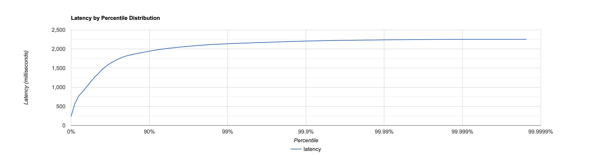
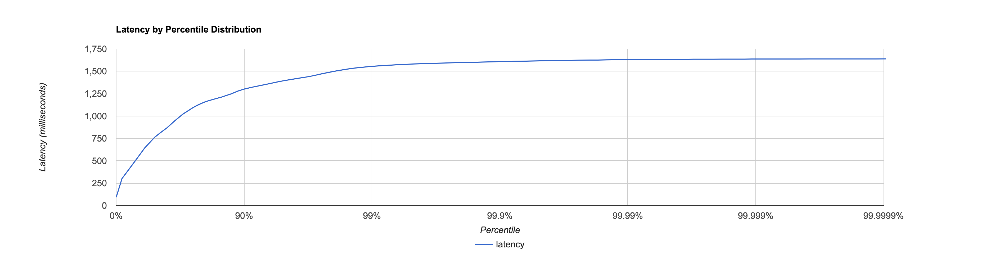
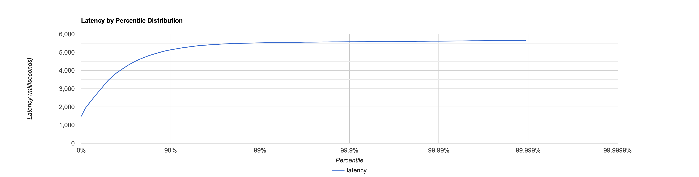
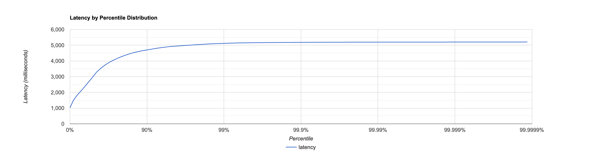
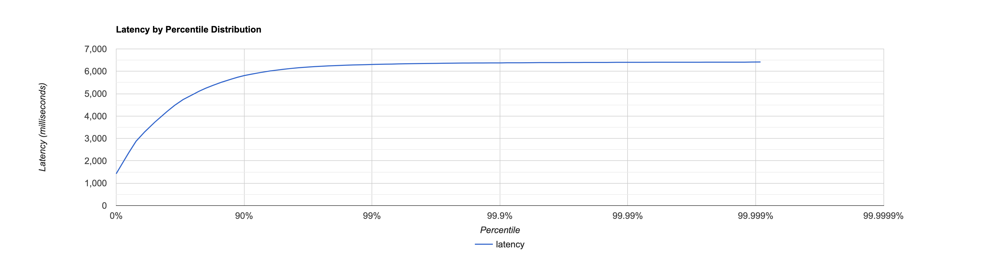
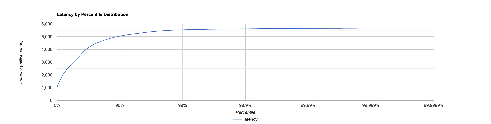

# Отчёт

Все тестирования проводятся при помощи скриптов [get](scripts/get.lua) и [put](scripts/put.lua).

**Get:**

```lua
id = 0
wrk.method = "GET"
request = function()
    wrk.path = "/v0/entity?id=" .. math.random(0, 1000000)
    id = id + 1
    return wrk.format(nil)
end
```

**Put:**

```lua
id = 0
wrk.method = "PUT"
request = function()
    wrk.path = "/v0/entity?id=" .. math.random(0, 1000000)
    wrk.body = "№ " .. id
    id = id + 1
    return wrk.format(nil)
end
```

А также `wrk` команд:

1. `wrk2 -t 8 -c 64 -d 30s -R 100000 -L http://localhost:19234 -s reports/HW2/scripts/put.lua`
2. `wrk2 -t 8 -c 64 -d 30s -R 100000 -L http://localhost:19234 -s reports/HW2/scripts/get.lua`

# Без вспомогательных `workers`

## PUT

```
Running 30s test @ http://localhost:19234
  8 threads and 64 connections
  Thread Stats   Avg      Stdev     Max   +/- Stdev
    Latency     1.27s   514.64ms   2.25s    58.89%
    Req/Sec    11.35k   322.29    12.02k    61.84%
  Latency Distribution (HdrHistogram - Recorded Latency)
 50.000%    1.27s 
 75.000%    1.74s 
 90.000%    1.94s 
 99.000%    2.14s 
 99.900%    2.21s 
 99.990%    2.24s 
 99.999%    2.25s 
100.000%    2.25s 

#[Mean    =     1266.760, StdDeviation   =      514.641]
#[Max     =     2252.800, Total count    =      1809353]
#[Buckets =           27, SubBuckets     =         2048]
----------------------------------------------------------
  2781797 requests in 30.00s, 177.75MB read
Requests/sec:  92730.05
Transfer/sec:      5.93MB
```



## GET

```
Running 30s test @ http://localhost:19234
  8 threads and 64 connections
  Thread Stats   Avg      Stdev     Max   +/- Stdev
    Latency   777.11ms  376.38ms   1.64s    59.00%
    Req/Sec    11.60k   487.60    12.54k    82.81%
  Latency Distribution (HdrHistogram - Recorded Latency)
 50.000%  763.39ms
 75.000%    1.10s 
 90.000%    1.30s 
 99.000%    1.56s 
 99.900%    1.61s 
 99.990%    1.63s 
 99.999%    1.64s 
100.000%    1.64s 

#[Mean    =      777.106, StdDeviation   =      376.380]
#[Max     =     1638.400, Total count    =      1845209]
#[Buckets =           27, SubBuckets     =         2048]
----------------------------------------------------------
  2837573 requests in 30.00s, 197.45MB read
  Non-2xx or 3xx responses: 38289
Requests/sec:  94589.57
Transfer/sec:      6.58MB
```



# Обычный `ExecutorService`

## PUT

```
Running 30s test @ http://localhost:19234
  8 threads and 64 connections
  Thread Stats   Avg      Stdev     Max   +/- Stdev
    Latency     3.48s     1.18s    5.64s    57.24%
    Req/Sec     9.98k   173.04    10.32k    71.43%
  Latency Distribution (HdrHistogram - Recorded Latency)
 50.000%    3.45s 
 75.000%    4.50s 
 90.000%    5.14s 
 99.000%    5.52s 
 99.900%    5.58s 
 99.990%    5.61s 
 99.999%    5.64s 
100.000%    5.64s 

#[Mean    =     3476.062, StdDeviation   =     1176.200]
#[Max     =     5640.192, Total count    =      1589904]
#[Buckets =           27, SubBuckets     =         2048]
----------------------------------------------------------
  2441256 requests in 30.00s, 155.99MB read
Requests/sec:  81377.95
Transfer/sec:      5.20MB
```



## GET

```
Running 30s test @ http://localhost:19234
  8 threads and 64 connections
  Thread Stats   Avg      Stdev     Max   +/- Stdev
    Latency     3.06s     1.19s    5.20s    57.20%
    Req/Sec     9.90k   342.19    10.41k    63.46%
  Latency Distribution (HdrHistogram - Recorded Latency)
 50.000%    3.01s 
 75.000%    4.13s 
 90.000%    4.70s 
 99.000%    5.12s 
 99.900%    5.18s 
 99.990%    5.19s 
 99.999%    5.20s 
100.000%    5.21s 

#[Mean    =     3064.426, StdDeviation   =     1193.119]
#[Max     =     5201.920, Total count    =      1579627]
#[Buckets =           27, SubBuckets     =         2048]
----------------------------------------------------------
  2479613 requests in 30.00s, 172.15MB read
  Non-2xx or 3xx responses: 27568
Requests/sec:  82656.83
Transfer/sec:      5.74MB
```



# `LIFO`

## PUT

```
Running 30s test @ http://localhost:19234
  8 threads and 64 connections
  Thread Stats   Avg      Stdev     Max   +/- Stdev
    Latency     3.80s     1.40s    6.41s    58.32%
    Req/Sec     9.48k   294.97     9.98k    71.43%
  Latency Distribution (HdrHistogram - Recorded Latency)
 50.000%    3.72s 
 75.000%    4.97s 
 90.000%    5.81s 
 99.000%    6.31s 
 99.900%    6.38s 
 99.990%    6.40s 
 99.999%    6.41s 
100.000%    6.42s 

#[Mean    =     3797.264, StdDeviation   =     1402.948]
#[Max     =     6414.336, Total count    =      1508887]
#[Buckets =           27, SubBuckets     =         2048]
----------------------------------------------------------
  2361346 requests in 30.00s, 150.88MB read
Requests/sec:  78714.86
Transfer/sec:      5.03MB
```



## GET

```
Running 30s test @ http://localhost:19234
  8 threads and 64 connections
  Thread Stats   Avg      Stdev     Max   +/- Stdev
    Latency     3.29s     1.27s    5.67s    58.51%
    Req/Sec     9.69k   321.36    10.12k    61.05%
  Latency Distribution (HdrHistogram - Recorded Latency)
 50.000%    3.19s 
 75.000%    4.43s 
 90.000%    5.04s 
 99.000%    5.53s 
 99.900%    5.62s 
 99.990%    5.65s 
 99.999%    5.67s 
100.000%    5.67s 

#[Mean    =     3291.421, StdDeviation   =     1265.312]
#[Max     =     5668.864, Total count    =      1541662]
#[Buckets =           27, SubBuckets     =         2048]
----------------------------------------------------------
  2425386 requests in 30.00s, 169.03MB read
  Non-2xx or 3xx responses: 49738
Requests/sec:  80849.41
Transfer/sec:      5.63MB
```

