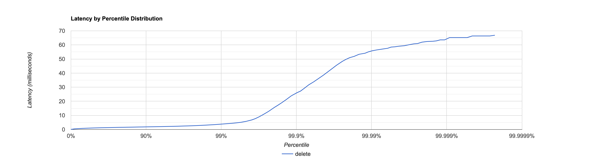
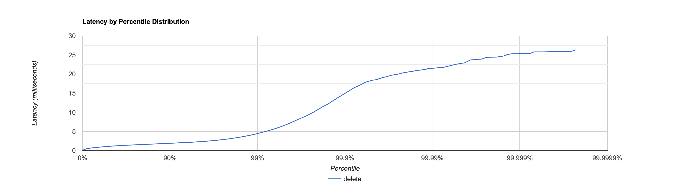

# Отчёт

Заметим, что в реализации данного решения были произведены лишь улучшения повышающие надёжность, а не производительность.
Поэтому в первую очередь стоит смотреть на то как изменилось поведение при "заболевании ноды".

**План тестирования:**
1. Узнать какую нагрузку выдерживает текущая система в случае, если какая-то часть нод "болеет".
2. Протестировать то же самое на предыдущей системе.
3. Сравнить показатели.
4. Сделать замеры и понять причины улучшения / ухудшения перфоманса.
5. Сделать выводы.

# Тестирование и нахождение оптимального количества запросов для новой системы с болеющей нодой

Тестирование проводится при помощи скриптов [put](scripts/put.lua)

```lua
id = 0
wrk.method = "PUT"
request = function()
    wrk.path = "/v0/entity?id=" .. math.random(0, 1000000) .. "&from=2&ack=1"
    wrk.body = "№ " .. id
    id = id + 1
    return wrk.format(nil)
end
```

и [get](scripts/get.lua)

```lua
id = 0
wrk.method = "GET"
request = function()
    wrk.path = "/v0/entity?id=" .. math.random(0, 1000000) .. "&from=2&ack=1"
    return wrk.format(nil)
end
```

## PUT

```
  Thread Stats   Avg      Stdev     Max   +/- Stdev
    Latency     1.22ms    1.58ms  66.82ms   97.91%
    Req/Sec     2.64k   233.43     9.33k    75.01%
  Latency Distribution (HdrHistogram - Recorded Latency)
 50.000%    1.08ms
 75.000%    1.47ms
 90.000%    1.87ms
 99.000%    3.82ms
 99.900%   25.82ms
 99.990%   55.71ms
 99.999%   63.58ms
100.000%   66.88ms

#[Mean    =        1.220, StdDeviation   =        1.577]
#[Max     =       66.816, Total count    =       399187]
#[Buckets =           27, SubBuckets     =         2048]
----------------------------------------------------------
  599648 requests in 30.00s, 38.32MB read
Requests/sec:  19988.56
Transfer/sec:      1.28MB
```



## GET

```
  Thread Stats   Avg      Stdev     Max   +/- Stdev
    Latency     1.83ms    5.47ms 186.50ms   98.21%
    Req/Sec     2.51k   354.26     7.22k    84.20%
  Latency Distribution (HdrHistogram - Recorded Latency)
 50.000%    1.21ms
 75.000%    1.68ms
 90.000%    2.40ms
 99.000%   12.41ms
 99.900%   95.74ms
 99.990%  154.11ms
 99.999%  184.06ms
100.000%  186.62ms

#[Mean    =        1.833, StdDeviation   =        5.467]
#[Max     =      186.496, Total count    =       379244]
#[Buckets =           27, SubBuckets     =         2048]
----------------------------------------------------------
  569672 requests in 30.00s, 38.49MB read
Requests/sec:  18989.48
Transfer/sec:      1.28MB
```


Таким образом, даже при отключении одного шарда система справляется с 20000 `put` и 19000 `get` запросами.
Посмотрим сколько запросов потеряются при той же нагрузке в старой системе

# Старое шардирование с "болеющей нодой".

Достаточно заметить, что решение для шардирования это решение для реплик с
`from = 1`, `ack = 1`.

Тестирование проводится при помощи скриптов

```lua
id = 0
wrk.method = "PUT"
request = function()
    wrk.path = "/v0/entity?id=" .. math.random(0, 1000000) .. "&from=1&ack=1"
    wrk.body = "№ " .. id
    id = id + 1
    return wrk.format(nil)
end
```

и

```lua
id = 0
wrk.method = "GET"
request = function()
    wrk.path = "/v0/entity?id=" .. math.random(0, 1000000) .. "&from=1&ack=1"
    return wrk.format(nil)
end
```

Как мы видели по предыдущим профилированиям,
накладные расходы в коде не являются такой проблемой,
как общение по сети и походы в базу данных (при операции `get`).
Поэтому значения полученные здесь достаточно близки к тем,
что можно получить на предыдущей реализации шардирования.

## PUT

```
  Thread Stats   Avg      Stdev     Max   +/- Stdev
    Latency     1.23ms    1.01ms  26.32ms   93.92%
    Req/Sec     2.64k   225.14     5.22k    76.98%
  Latency Distribution (HdrHistogram - Recorded Latency)
 50.000%    1.10ms
 75.000%    1.49ms
 90.000%    1.90ms
 99.000%    4.45ms
 99.900%   14.92ms
 99.990%   21.53ms
 99.999%   25.33ms
100.000%   26.33ms

#[Mean    =        1.226, StdDeviation   =        1.008]
#[Max     =       26.320, Total count    =       399182]
#[Buckets =           27, SubBuckets     =         2048]
----------------------------------------------------------
  599648 requests in 30.00s, 39.86MB read
  Non-2xx or 3xx responses: 202447
Requests/sec:  19988.77
Transfer/sec:      1.33MB
```



## GET

```
  Thread Stats   Avg      Stdev     Max   +/- Stdev
    Latency     1.07ms  484.88us   7.28ms   66.12%
    Req/Sec     2.50k   151.64     3.44k    62.00%
  Latency Distribution (HdrHistogram - Recorded Latency)
 50.000%    1.04ms
 75.000%    1.40ms
 90.000%    1.71ms
 99.000%    2.27ms
 99.900%    2.91ms
 99.990%    4.54ms
 99.999%    6.11ms
100.000%    7.28ms

#[Mean    =        1.070, StdDeviation   =        0.485]
#[Max     =        7.276, Total count    =       379233]
#[Buckets =           27, SubBuckets     =         2048]
----------------------------------------------------------
  569674 requests in 30.00s, 39.26MB read
  Non-2xx or 3xx responses: 192432
Requests/sec:  18988.60
Transfer/sec:      1.31MB
```


# Выводы

Как видно из результатов. Решение без репликации теряет порядка трети своих запросов (удивительно, особенно когда болеет одна нода из 3 :-)).
Однако это показывает, что идея с реплицированием действительно работает и повышает надёжность всей системы,
что действительно важно в распределённой системе. 

Несмотря на все оптимизации наша база данных имеет достаточное число уязвимостей

МЫ не застрахована от сценария перезатирания новых данных старыми.

*Пример:* 
1. Данные с `timestamp` 1 достаточно долго обрабатываются. 
2. В это время успевают записаться данные c `timestamp` 2.
3. Данные с `timestamp` 1 заканчивают обрабатываться и пишутся в базу, перезатирая тем самым актуальные данные.

Во избежание подобного сценария нужно:
1. Всегда проверять какие данные сейчас лежат по данному ключу. В случае, если, лежащие там данные актуальны, то и вносить изменения не нужно.
2. Атомарно менять данные по ключу. Добиться этого можно:
 * Меняя данные в транзакции, всё или ничего
 * Брать локи на ключи, которые меняются в данный момент.
Например, ключи, которые мы в данный момент обрабатываем можно закидывать в сет,
и в случае, если твой ключ в этом сете, подождать (благо ключе, которые в данный момент находятся в обработке = количеству потоков, что достаточно легко умещается в память компьютера).

Немаловажно, что мы никак не откатываем данные в случае неудачного изменения.

*Пример:*

1. На всех 3 репликах по ключу `key` хранится `value1` с `timestamp` равной 1.
2. User1 пытается поменять это значения на `value2`, но у него получается поменять только на одной. По какой-то причине две другие оказались в этот момент недоступны.
3. Все реплики выздоровели. User2 читает значение по ключу `key`, видит, что `value2` наиболее актуальное, хотя User1 считает, что эта операция провалилась и никто не знает про `value2`.

Подобное решается при помощи лидера, который будет коммитить изменения, когда операция по записи произошла удачно и выдавать только те значения, которые есть у большинства реплик.
Он может быть назначен изначально (координатор), либо же выбран (алгоритмы поиска лидера).


