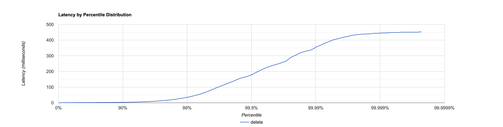
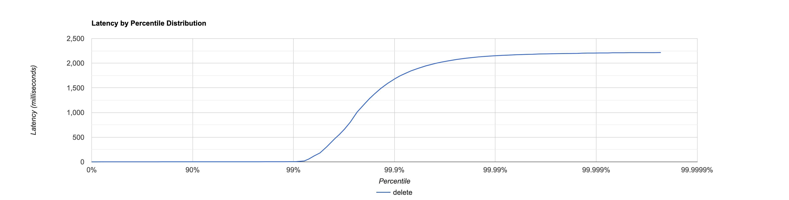
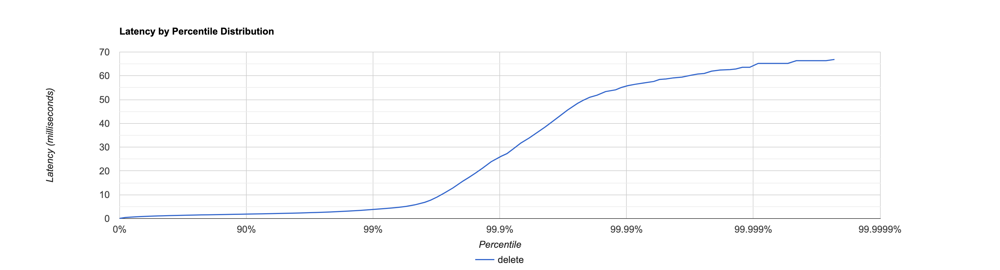
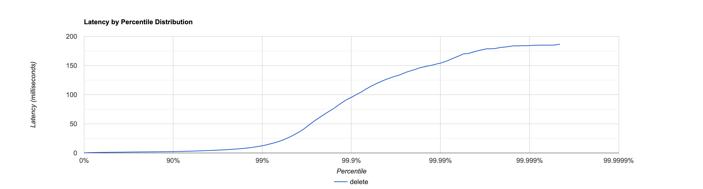
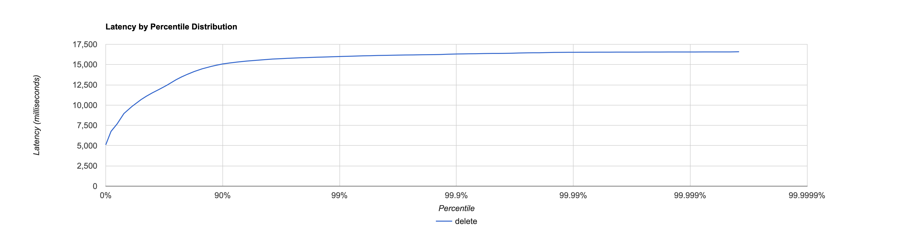
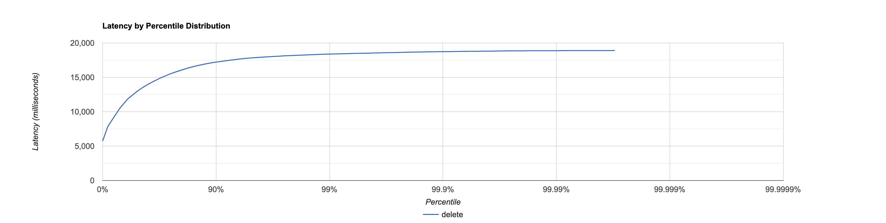

# Отчёт

Основной целью задания было получение ускорения
за счёт асинхронного исполнения запросов и взятия данных из базы.
Однако не стоит забывать, что предыдущие улучшения не должны страдать (ну или значительно страдать) от новых.
Поэтому составляя отчёт нужно проверить.

1. Скорость работы приложения.
2. Скорость работы в случае 'больной' ноды.
3. Количество неудачных запросов в случае больной ноды.

Тестирование проводится при помощи скриптов [put](scripts/put.lua)

```lua
id = 0
wrk.method = "PUT"
request = function()
    wrk.path = "/v0/entity?id=" .. math.random(0, 1000000) .. "&from=2&ack=1"
    wrk.body = "№ " .. id
    id = id + 1
    return wrk.format(nil)
end
```

и [get](scripts/get.lua)

```lua
id = 0
wrk.method = "GET"
request = function()
    wrk.path = "/v0/entity?id=" .. math.random(0, 1000000) .. "&from=2&ack=1"
    return wrk.format(nil)
end
```

# Синхронная реализация

## Все ноды рабочие

### PUT

```
  Thread Stats   Avg      Stdev     Max   +/- Stdev
    Latency     2.82ms   11.76ms 453.12ms   97.74%
    Req/Sec     2.64k   428.28     8.78k    82.16%
  Latency Distribution (HdrHistogram - Recorded Latency)
 50.000%    1.30ms
 75.000%    1.84ms
 90.000%    3.08ms
 99.000%   34.94ms
 99.900%  177.41ms
 99.990%  351.74ms
 99.999%  443.90ms
100.000%  453.38ms

#[Mean    =        2.825, StdDeviation   =       11.758]
#[Max     =      453.120, Total count    =       399008]
#[Buckets =           27, SubBuckets     =         2048]
----------------------------------------------------------
  597006 requests in 30.00s, 38.15MB read
Requests/sec:  19900.53
Transfer/sec:      1.27MB
```



### GET

```
  Thread Stats   Avg      Stdev     Max   +/- Stdev
    Latency     6.66ms   84.51ms   2.21s    99.34%
    Req/Sec     2.62k   234.81     7.89k    89.33%
  Latency Distribution (HdrHistogram - Recorded Latency)
 50.000%    1.12ms
 75.000%    1.50ms
 90.000%    1.84ms
 99.000%    4.28ms
 99.900%    1.68s 
 99.990%    2.15s 
 99.999%    2.21s 
100.000%    2.22s 

#[Mean    =        6.663, StdDeviation   =       84.510]
#[Max     =     2213.888, Total count    =       401264]
#[Buckets =           27, SubBuckets     =         2048]
----------------------------------------------------------
  599641 requests in 30.00s, 40.52MB read
Requests/sec:  19988.16
Transfer/sec:      1.35MB
```



## Есть больные ноды

Здесь можно вспомнить результат, который мы получили в 4-ом домашнем задании.

### PUT

```
  Thread Stats   Avg      Stdev     Max   +/- Stdev
    Latency     1.22ms    1.58ms  66.82ms   97.91%
    Req/Sec     2.64k   233.43     9.33k    75.01%
  Latency Distribution (HdrHistogram - Recorded Latency)
 50.000%    1.08ms
 75.000%    1.47ms
 90.000%    1.87ms
 99.000%    3.82ms
 99.900%   25.82ms
 99.990%   55.71ms
 99.999%   63.58ms
100.000%   66.88ms

#[Mean    =        1.220, StdDeviation   =        1.577]
#[Max     =       66.816, Total count    =       399187]
#[Buckets =           27, SubBuckets     =         2048]
----------------------------------------------------------
  599648 requests in 30.00s, 38.32MB read
Requests/sec:  19988.56
Transfer/sec:      1.28MB
```



### GET

```
  Thread Stats   Avg      Stdev     Max   +/- Stdev
    Latency     1.83ms    5.47ms 186.50ms   98.21%
    Req/Sec     2.51k   354.26     7.22k    84.20%
  Latency Distribution (HdrHistogram - Recorded Latency)
 50.000%    1.21ms
 75.000%    1.68ms
 90.000%    2.40ms
 99.000%   12.41ms
 99.900%   95.74ms
 99.990%  154.11ms
 99.999%  184.06ms
100.000%  186.62ms

#[Mean    =        1.833, StdDeviation   =        5.467]
#[Max     =      186.496, Total count    =       379244]
#[Buckets =           27, SubBuckets     =         2048]
----------------------------------------------------------
  569672 requests in 30.00s, 38.49MB read
Requests/sec:  18989.48
Transfer/sec:      1.28MB
```



# Асинхронная реализация

## Все ноды рабочие

### PUT

```
  Thread Stats   Avg      Stdev     Max   +/- Stdev
    Latency    10.74s     2.96s   16.57s    58.02%
    Req/Sec     1.41k     8.18     1.43k    62.50%
  Latency Distribution (HdrHistogram - Recorded Latency)
 50.000%   10.67s 
 75.000%   13.13s 
 90.000%   15.07s 
 99.000%   15.99s 
 99.900%   16.31s 
 99.990%   16.52s 
 99.999%   16.56s 
100.000%   16.58s 

#[Mean    =    10739.067, StdDeviation   =     2956.206]
#[Max     =    16572.416, Total count    =       226645]
#[Buckets =           27, SubBuckets     =         2048]
----------------------------------------------------------
  336155 requests in 30.00s, 21.48MB read
Requests/sec:  11204.89
Transfer/sec:    733.13KB
```



### GET

```
  Thread Stats   Avg      Stdev     Max   +/- Stdev
    Latency    12.72s     3.36s   18.89s    58.24%
    Req/Sec     0.98k     5.94     0.99k    87.50%
  Latency Distribution (HdrHistogram - Recorded Latency)
 50.000%   12.93s 
 75.000%   15.55s 
 90.000%   17.22s 
 99.000%   18.38s 
 99.900%   18.73s 
 99.990%   18.87s 
 99.999%   18.91s 
100.000%   18.91s 

#[Mean    =    12717.245, StdDeviation   =     3360.675]
#[Max     =    18890.752, Total count    =       162364]
#[Buckets =           27, SubBuckets     =         2048]
----------------------------------------------------------
  229628 requests in 30.01s, 15.47MB read
Requests/sec:   7652.92
Transfer/sec:    527.83KB
```



## Есть больная вершина

### PUT

```
  Thread Stats   Avg      Stdev     Max   +/- Stdev
    Latency     4.64s   825.14ms   6.37s    64.65%
    Req/Sec     2.20k   105.50     2.36k    36.00%
  Latency Distribution (HdrHistogram - Recorded Latency)
 50.000%    4.73s 
 75.000%    5.28s 
 90.000%    5.66s 
 99.000%    6.19s 
 99.900%    6.30s 
 99.990%    6.34s 
 99.999%    6.36s 
100.000%    6.37s 

#[Mean    =     4641.486, StdDeviation   =      825.142]
#[Max     =     6369.280, Total count    =       352531]
#[Buckets =           27, SubBuckets     =         2048]
----------------------------------------------------------
  487090 requests in 30.00s, 31.12MB read
Requests/sec:  16236.11
Transfer/sec:      1.04MB
```

# Итог:

Желаемого улучшения не произошло! ~~Параллелизм не работает!!!!!~~ Давайте попробуем разобраться в причинах

## PUT

Проанализируем [cpu старого put](profile/hw4/put/cpu.html) и [нового](profile/hw5/put/cpu.html),
[alloc старого put](profile/hw4/put/alloc.html) и [allock hw5](profile/hw5/put/alloc.html),
а также [lock которые брались в hw4](profile/hw4/put/cpu.html) и [в hw5](profile/hw5/put/cpu.html)

Заметны некоторые изменения:

1. Появилась дополнительная нагрузка в виде `ForkJoinWorkerThread`,
   съевшего 21 % от процессорного времени. Но при этом совсем небравший блокировок.
2. `HighLoadHttpServer.handleRequest`, имевший 25 % cpu и 19 % alloc сдал позиции до 3 % cpu и 11.5 % alloc,
   однако появилась `CompletableFuture` из `ThreadPoolExecutor`, взявшая 19.5 % cpu и 13.5 % alloc.
3. Расширилась роль `SequentialScheduler` с 17 % до 27 % cpu.

Давайте разберёмся со всем по порядку

### `ForkJoinWorkerThread`

Это процесс, который работает с теми `ComplitableFuture`,
которые не находятся под руководством `HttpClient`, а именно `ComplitableFuture`,
создающаяся на поход в базу данных и `ComplitableFuture`, обрабатывающая прешедшие результаты.
Сами процессы не долгие, put никогда не был проблемой, так как сохранял всё в памяти,
а `Session.sendResponse` вызывался только по завершении опроса кворума реплик и не дожидался ответа (а в целом зачем он ему),
поэтому количество блокировок и нулевое. 

Однако так как сами задачи - простые, то overhead, который они создают - гигантский.
В случае, если у `ForkJoinWorkerThread`, есть незавершённые задачи,
он берёт первую из них, передаёт на исполнение, а после чего делает `awaitWork`,
вследствие чего из-за наличия большого количества мелких задачек, делающихся быстрее, чем `park` (утрирую, я не профилировал),
накладные расходы просто огромны.

### `HighLoadHttpServer` и `CompletableFuture`

Здесь ситуация достаточно простая, если раньше `HighLoadHttpServer` отправлял запрос и сразу же требовал на него запрос,
то сейчас это перешло к `CompletableFuture` и исполняется уже в других потоках.
Самым правильным решением в данном случае будет занять чем-то `HighLoadHttpServer`,
в противном случае мы начинаем тратить время на переключение контекста, что явно не несёт пользу производительности.

### `SequentialScheduler`

В связи с большим количеством потоков потребовалось и большее переключение контекста.
Уменьшить это время может решение пункта (`HighLoadHttpServer` и `CompletableFuture`)

## GET

Смотря на 
cpu [hw4](profile/hw4/get/cpu.html) и [hw5](profile/hw5/get/cpu.html),
alloc [hw4](profile/hw4/get/alloc.html) и [hw5](profile/hw5/get/alloc.html),
lock [hw4](profile/hw4/get/lock.html) и [hw5](profile/hw5/get/lock.html)

Видны схожие изменения, однако стоит заметить,
что в `ForkJoinWorkerThread` большую часть и работа с базой данных: 
1. `UtilsClass.segmentToValue` - чтение вернувшегося от других реплик.
2. `MemorySegmentDao.get` - взятие данных из базы

Это может натолкнуть на интересные выводы.

## Оптимизации:

1. `ForkJoinWorkerThread` потребляет массу ресурсов на сон, 
в то время как `HighLoadHttpServer.handleRequest` становится абсолютно бесполезным после раздачи задач
и заставляет `SequentialScheduler` делать лишнюю работу. Всё это можно решить отдав какую-то работу лично `HighLoadHttpServer`.
В первую очередь это работа с базой данных, такое изменение позволит уменьшить количество задач в очередь на `ForkJoinWorkerThread`,
однако стоит это делать только после того как сделал все `CompletableFuture`, ведь get как мы видим всё также весомый.
2. Хоть это и не было сказано в самом отчёте, однако `HttpClient` всё также потребляет много ресурсов,
поэтому достаточно хорошей идей будет `cancel` запросы и `ComplitableFuture` в случае, если мы набрали кворум.
3. На `HighLoadHttpServer` можно возлагать не только поход в базу данных, но и посылку запросов,
(в случае если делается put запрос или если от данной реплики не требуются данные) однако после того как, были отданы команды `sendAsync` на другие ноды.