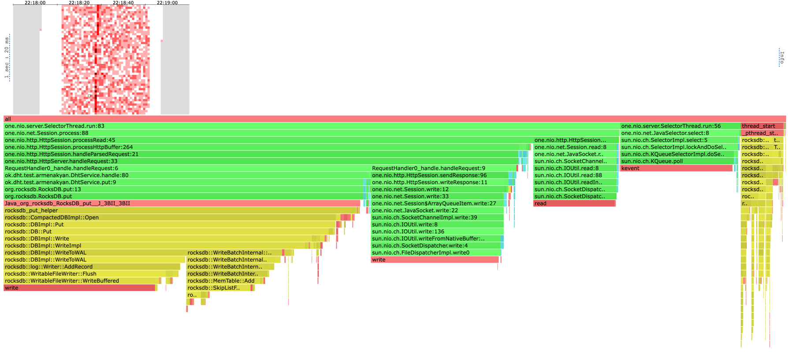
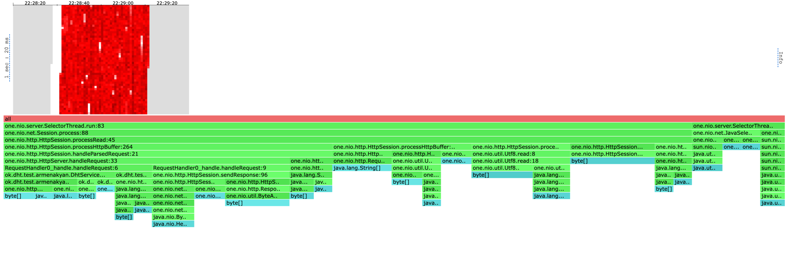
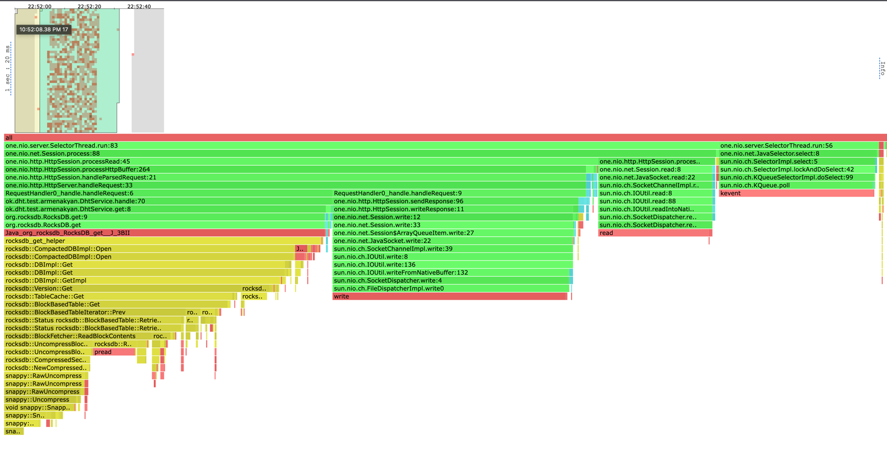
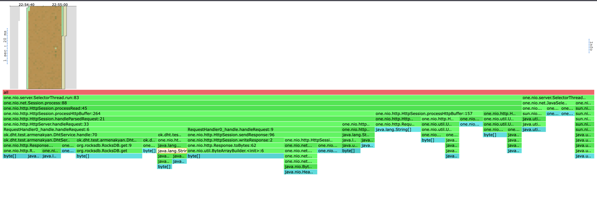

# Report
В качестве бд использовалось RocksDb.

Для начала наполним базу, профилировать на пустой не очень 
интересно, тк скорее всего мы не увидим компактизаций в профиле.


База была наполнена с ключами в диапозоне от 1 до 5000000. Ее размер составил 1.5 GB.

## PUT
lua script for PUT:
```lua
request = function()
    key = math.random(1, 5000000)
    url = '/v0/entity?id=' .. key
    value = 'some value that is value and indeed is value and is very handsome almost like the author of this script'
    return wrk.format("PUT", url, {}, value)
end
```

С помощью wrk2 определим стабильную нагрузку на PUT нашего сервера: 
```shell
kar-arm@i109817075 ~/u/h/2/scripts (stage-1)> wrk2 -c1 -t1 -d 20s -R 10000 -s put.lua "http://localhost:54321"
Running 20s test @ http://localhost:54321
  1 threads and 1 connections
  Thread calibration: mean lat.: 2.928ms, rate sampling interval: 10ms
  Thread Stats   Avg      Stdev     Max   +/- Stdev
    Latency     1.11ms    3.31ms  39.07ms   97.92%
    Req/Sec    10.52k     1.13k   17.11k    90.66%
  199991 requests in 20.00s, 12.78MB read
Requests/sec:   9999.67
Transfer/sec:    654.28KB
```
С рейтом в 10000 сервер выдерживает нагрузку выдавая среднее latency в 1ms и держа 10000rps.

Поднимем рейт до 20к:
```shell
kar-arm@i109817075 ~/u/h/2/scripts (stage-1)> wrk2 -c1 -t1 -d 20s -R 20000  -s  put.lua "http://localhost:54321"
Running 20s test @ http://localhost:54321
1 threads and 1 connections
Thread calibration: mean lat.: 1651.318ms, rate sampling interval: 5816ms
Thread Stats   Avg      Stdev     Max   +/- Stdev
Latency     4.68s   867.53ms   6.09s    53.46%
Req/Sec    14.18k     0.00    14.18k     0.00%
278157 requests in 20.00s, 17.77MB read
Requests/sec:  13907.98
Transfer/sec:      0.89MB
```
Здесь сервер уже захлебнулся и смог обеспечить только 13к rps.

Попробуем с рейтом 12к и флагом -L, чтобы увидеть перцентили:
```shell
kar-arm@i109817075 ~/u/h/2/scripts (stage-1)> wrk2 -c1 -t1 -d 20s -R 12000 -L -s  put.lua "http://localhost:54321"
Running 20s test @ http://localhost:54321
  1 threads and 1 connections
  Thread calibration: mean lat.: 2.173ms, rate sampling interval: 10ms
  Thread Stats   Avg      Stdev     Max   +/- Stdev
    Latency     7.35ms   16.35ms  87.94ms   89.05%
    Req/Sec    12.69k     2.47k   18.67k    86.24%
  Latency Distribution (HdrHistogram - Recorded Latency)
 50.000%    0.98ms
 75.000%    2.29ms
 90.000%   25.38ms
 99.000%   81.66ms
 99.900%   87.81ms
 99.990%   87.93ms
 99.999%   88.00ms
100.000%   88.00ms

  Detailed Percentile spectrum:
       Value   Percentile   TotalCount 1/(1-Percentile)

       0.054     0.000000            1         1.00
       0.270     0.100000        12024         1.11
       0.459     0.200000        24012         1.25
       0.643     0.300000        36017         1.43
       0.814     0.400000        48037         1.67
       0.976     0.500000        60020         2.00
       1.054     0.550000        65996         2.22
       1.131     0.600000        72004         2.50
       1.207     0.650000        78015         2.86
       1.367     0.700000        83963         3.33
       2.293     0.750000        89949         4.00
       3.755     0.775000        92949         4.44
       5.863     0.800000        95946         5.00
      10.871     0.825000        98946         5.71
      15.823     0.850000       101946         6.67
      20.783     0.875000       104945         8.00
      23.327     0.887500       106453         8.89
      25.375     0.900000       107940        10.00
      26.895     0.912500       109440        11.43
      30.031     0.925000       110941        13.33
      35.487     0.937500       112438        16.00
      43.263     0.943750       113188        17.78
      47.903     0.950000       113937        20.00
      50.207     0.956250       114689        22.86
      53.279     0.962500       115436        26.67
      61.439     0.968750       116185        32.00
      64.575     0.971875       116570        35.56
      68.415     0.975000       116939        40.00
      72.383     0.978125       117311        45.71
      74.879     0.981250       117702        53.33
      76.991     0.984375       118060        64.00
      78.719     0.985938       118247        71.11
      79.615     0.987500       118445        80.00
      81.151     0.989062       118630        91.43
      82.111     0.990625       118810       106.67
      83.135     0.992188       118997       128.00
      83.583     0.992969       119097       142.22
      84.159     0.993750       119189       160.00
      84.735     0.994531       119283       182.86
      85.119     0.995313       119380       213.33
      86.015     0.996094       119469       256.00
      86.335     0.996484       119516       284.44
      86.591     0.996875       119565       320.00
      86.783     0.997266       119613       365.71
      87.103     0.997656       119653       426.67
      87.487     0.998047       119704       512.00
      87.615     0.998242       119732       568.89
      87.679     0.998437       119746       640.00
      87.743     0.998633       119797       731.43
      87.743     0.998828       119797       853.33
      87.807     0.999023       119834      1024.00
      87.807     0.999121       119834      1137.78
      87.871     0.999219       119868      1280.00
      87.871     0.999316       119868      1462.86
      87.871     0.999414       119868      1706.67
      87.935     0.999512       119930      2048.00
      87.935     0.999561       119930      2275.56
      87.935     0.999609       119930      2560.00
      87.935     0.999658       119930      2925.71
      87.935     0.999707       119930      3413.33
      87.935     0.999756       119930      4096.00
      87.935     0.999780       119930      4551.11
      87.935     0.999805       119930      5120.00
      87.935     0.999829       119930      5851.43
      87.935     0.999854       119930      6826.67
      87.935     0.999878       119930      8192.00
      87.935     0.999890       119930      9102.22
      87.935     0.999902       119930     10240.00
      87.935     0.999915       119930     11702.86
      87.935     0.999927       119930     13653.33
      87.935     0.999939       119930     16384.00
      87.935     0.999945       119930     18204.44
      87.935     0.999951       119930     20480.00
      87.935     0.999957       119930     23405.71
      87.935     0.999963       119930     27306.67
      87.935     0.999969       119930     32768.00
      87.935     0.999973       119930     36408.89
      87.935     0.999976       119930     40960.00
      87.935     0.999979       119930     46811.43
      87.935     0.999982       119930     54613.33
      87.999     0.999985       119932     65536.00
      87.999     1.000000       119932          inf
#[Mean    =        7.352, StdDeviation   =       16.351]
#[Max     =       87.936, Total count    =       119932]
#[Buckets =           27, SubBuckets     =         2048]
----------------------------------------------------------
  239983 requests in 20.00s, 15.33MB read
Requests/sec:  11999.29
Transfer/sec:    785.11KB
```
Будем считать эту нагрузку стабильной, тк здесь сервер осилил 12000rps, 
и 99 перцентиль задержки - 88ms что не очень много.

Скачен в latency в 80+ персентилях обусловлен тем, что в 
случае 99 персентиля некоторая часть запросов 
(а именно 1 процент наиболее долгих по времени выполнения) попала в 
промежуток времени, когда сервер был более нагружен. Как видно из профиля, 
таким моментом могла стать компактизация или флаши на диск, 
либо же часть запросов просто ждала своей обработки селекторами, 
а они не успевали, из-за раздутой очереди и своего текущего устройства в целом. 
Введение отдельного тредпула для обработки логики запросов должно смягчить эту проблему и
освободить селекторы от лишней работы.

#### PUT CPU
Отпрофилиурем CPU с этой нагрузкой:





На хитмапе видно отдельный временной регион, когда cpu нагружалось больше. 
В этот момент асинхронно происходила компактизация.

##### Если рассмотреть весь временной промежуток:
Обработка запросов занимает 78% процессорного времени (далле X% = X% процессорного времени).
Из них 18% ушло на формирование http ответов и их отправку, чтение запросов заняло 10%, здесь оптимизировать можно сменой протокола, формировать http response 
может быть дорого и долго.

Put в бд занял 46% процессорного времени (далле X% = X% процессорного времени),
при этом из 23% уходило на запись в WAL лог на диске, 12% на запись в in-memory табличку. 
Последнее расхождение в процентах понятно, писать в память намного быстрее чем на диск.
RocksDb поддерживает параллельные записи, таким образом это место можно ускорить.

Компактизация заняла 4%, мало но она происходит в RocksDb асинхронно и в нашем случае длилась секунду из 40 секунд нагрузки.
Flush занял меньше процента. В RockDb он также асинхронный и делит тредпул с тредами для компактизации. 


#### PUT ALLOC
Отпрофилиурем аллокации:



Так как RocksDb написана на плюсах и в жаве используется только его апи. 
Здесь мы видим только аллокации нашего сервера.

Обработка запросов занимает 85% аллокаций. Из них около 20% на уходит на аллокации при парсинге запроса.


## GET
lua script for GET:
```lua
request = function()
    key = math.random(1, 5000000)
    url = '/v0/entity?id=' .. key
    return wrk.format(nil, url)
end
```

Определим оптимальную нагрузку для GET:
```shell

kar-arm@i109817075 ~/u/h/2/scripts (stage-1)> wrk2 -c1 -t1 -d 20s -R 20000 -s get.lua "http://localhost:54321"
Running 20s test @ http://localhost:54321
  1 threads and 1 connections
  Thread calibration: mean lat.: 1125.181ms, rate sampling interval: 3942ms
  Thread Stats   Avg      Stdev     Max   +/- Stdev
    Latency     2.65s   145.85ms   2.84s    71.94%
    Req/Sec    18.79k     1.98k   20.78k    50.00%
  348375 requests in 20.00s, 55.48MB read
Requests/sec:  17418.92
Transfer/sec:      2.77MB
```
Сервер захлебывается, возьмем 13к:
```shell
kar-arm@i109817075 ~/u/h/2/scripts (stage-1)> wrk2 -c1 -t1 -d 20s -R 10000 -L -s get.lua "http://localhost:54321"
Running 20s test @ http://localhost:54321
  1 threads and 1 connections
  Thread calibration: mean lat.: 14.441ms, rate sampling interval: 89ms
  Thread Stats   Avg      Stdev     Max   +/- Stdev
    Latency     2.98ms    8.02ms  48.64ms   92.07%
    Req/Sec    10.05k   595.03    12.90k    88.39%
  Latency Distribution (HdrHistogram - Recorded Latency)
 50.000%  770.00us
 75.000%    1.09ms
 90.000%    3.91ms
 99.000%   46.94ms
 99.900%   48.48ms
 99.990%   48.64ms
 99.999%   48.67ms
100.000%   48.67ms

  Detailed Percentile spectrum:
       Value   Percentile   TotalCount 1/(1-Percentile)

       0.045     0.000000            1         1.00
       0.216     0.100000        10042         1.11
       0.361     0.200000        20052         1.25
       0.505     0.300000        30058         1.43
       0.640     0.400000        40040         1.67
       0.770     0.500000        50040         2.00
       0.833     0.550000        55020         2.22
       0.896     0.600000        60010         2.50
       0.959     0.650000        65027         2.86
       1.024     0.700000        70011         3.33
       1.089     0.750000        75018         4.00
       1.120     0.775000        77457         4.44
       1.152     0.800000        79998         5.00
       1.182     0.825000        82498         5.71
       1.214     0.850000        84966         6.67
       1.291     0.875000        87454         8.00
       1.467     0.887500        88701         8.89
       3.913     0.900000        89950        10.00
       7.695     0.912500        91201        11.43
      12.671     0.925000        92449        13.33
      16.703     0.937500        93701        16.00
      19.359     0.943750        94324        17.78
      22.319     0.950000        94952        20.00
      24.223     0.956250        95578        22.86
      26.335     0.962500        96200        26.67
      28.127     0.968750        96833        32.00
      28.511     0.971875        97136        35.56
      28.959     0.975000        97447        40.00
      32.655     0.978125        97759        45.71
      38.207     0.981250        98072        53.33
      41.951     0.984375        98386        64.00
      44.031     0.985938        98543        71.11
      45.247     0.987500        98696        80.00
      46.015     0.989062        98861        91.43
      47.263     0.990625        99012       106.67
      47.615     0.992188        99183       128.00
      47.711     0.992969        99257       142.22
      47.807     0.993750        99334       160.00
      47.903     0.994531        99433       182.86
      47.967     0.995313        99492       213.33
      48.095     0.996094        99564       256.00
      48.127     0.996484        99597       284.44
      48.159     0.996875        99635       320.00
      48.255     0.997266        99686       365.71
      48.287     0.997656        99711       426.67
      48.351     0.998047        99764       512.00
      48.383     0.998242        99790       568.89
      48.383     0.998437        99790       640.00
      48.415     0.998633        99826       731.43
      48.447     0.998828        99835       853.33
      48.511     0.999023        99861      1024.00
      48.511     0.999121        99861      1137.78
      48.543     0.999219        99882      1280.00
      48.543     0.999316        99882      1462.86
      48.575     0.999414        99914      1706.67
      48.575     0.999512        99914      2048.00
      48.575     0.999561        99914      2275.56
      48.575     0.999609        99914      2560.00
      48.575     0.999658        99914      2925.71
      48.607     0.999707        99920      3413.33
      48.607     0.999756        99920      4096.00
      48.639     0.999780        99939      4551.11
      48.639     0.999805        99939      5120.00
      48.639     0.999829        99939      5851.43
      48.639     0.999854        99939      6826.67
      48.639     0.999878        99939      8192.00
      48.639     0.999890        99939      9102.22
      48.639     0.999902        99939     10240.00
      48.639     0.999915        99939     11702.86
      48.639     0.999927        99939     13653.33
      48.639     0.999939        99939     16384.00
      48.639     0.999945        99939     18204.44
      48.671     0.999951        99944     20480.00
      48.671     1.000000        99944          inf
#[Mean    =        2.980, StdDeviation   =        8.015]
#[Max     =       48.640, Total count    =        99944]
#[Buckets =           27, SubBuckets     =         2048]
----------------------------------------------------------
  199985 requests in 20.00s, 31.85MB read
Requests/sec:   9999.37
Transfer/sec:      1.59MB
```
Сервер выдержал, средняя задержка 3ms, 99 персентиль 50ms.

Так как здесь уже GET запросы, которые не изменяют и не увеличивают 
размер базы, то компактизаций и флашов быть не должно, в том числе поэтому 99
перcентиль получился меньше чем в случае с PUT. Но сказанное выше про долгое 
ожидание в некоторых запросах, раздутой очереди, и селекторов выполняющих обработку логики, все еще остается в силе.
Также часть ключей еще могла лежать в in-memory табличкe, GET в таком случае пройдет намного быстрее без чтения из диска. 
Но таких случаев не могло быть много, тк in-memory табличка имеет размер 2MB, а база была наполнена на 1,5GB.


#### GET CPU
Отпрофилиурем CPU с этой нагрузкой:




Здесь хитмапа аналогична случию PUT запросов, за исключением того что во время GET компактизаций не происходит.

Чтение из базы занимает 36%. Так как я читаю по случайным большим ключам, это кажется нормальным результатом.
Чтобы ускорить GET запросы, в общем случае можно подрубить in-memory кеш, который кстати в RocksDb присутствует, но выключен по дефолту. Но так как GET запросы проводились по рандомным ключам, кеш не особо поможет.
В нашем случае должно помочь добавление отдельного тредпула для обработки запросов, чтобы не блокировать селекторы на лишней работе.
Обработка запросов 28%. 

Также в профилирование попал GC, но он занял всего пол процента CPU.

#### GET ALLOC
Отпрофилиурем аллокации:




Здесь ситуация полностью аналогично случаю ALLOC профилирования в PUT запросах.