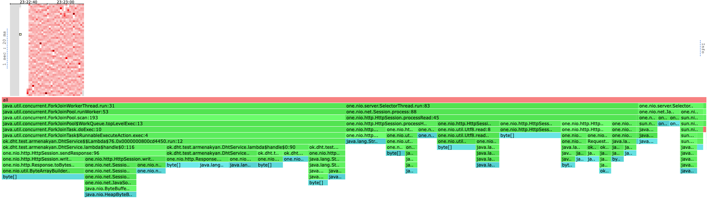
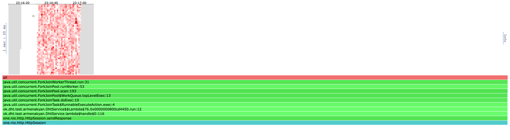
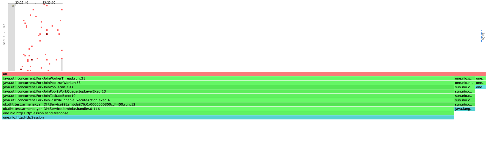
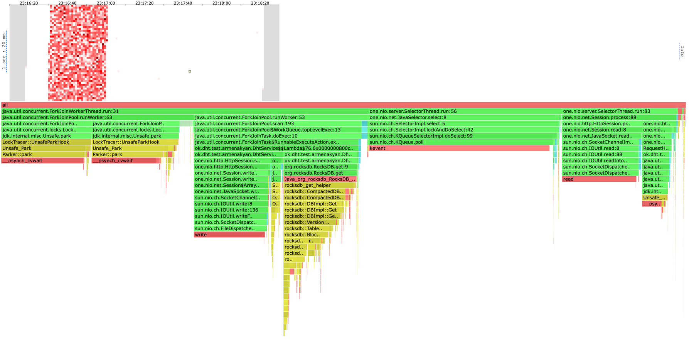
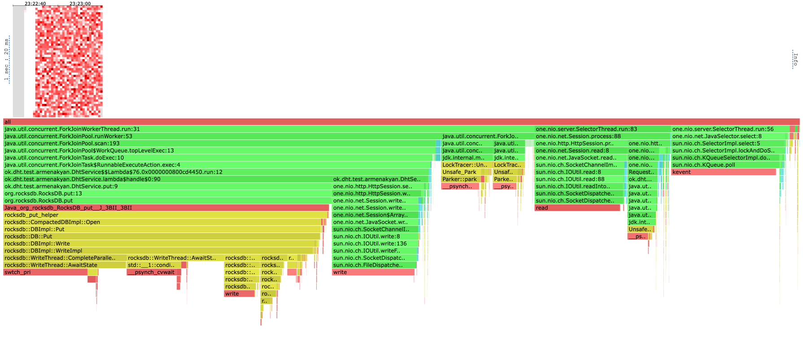

# Report
В качестве бд использовалось RocksDb.

База была наполнена с ключами в диапозоне от 1 до 5000000. Ее размер составил 1.5 GB.

Сначала определим, какую нагрузку выдерживает сервер из первого этапа для каждого из методов: 
#### Synchronous GET
```shell
kar-arm@i109817075 ~/u/h/2/scripts (stage-1)> wrk2 -c80 -t4 -d 30s -R 40000 -L -s get.lua "http://localhost:54321"
Running 30s test @ http://localhost:54321
  4 threads and 80 connections
  Thread calibration: mean lat.: 1.507ms, rate sampling interval: 10ms
  Thread calibration: mean lat.: 1.517ms, rate sampling interval: 10ms
  Thread calibration: mean lat.: 1.496ms, rate sampling interval: 10ms
  Thread calibration: mean lat.: 1.505ms, rate sampling interval: 10ms
  Thread Stats   Avg      Stdev     Max   +/- Stdev
    Latency    21.96ms   45.00ms 207.36ms   82.94%
    Req/Sec    13.15k     1.15k   17.44k    76.12%
  Latency Distribution (HdrHistogram - Recorded Latency)
 50.000%    1.77ms
 75.000%    2.72ms
 90.000%  105.41ms
 99.000%  173.57ms
 99.900%  192.90ms
 99.990%  202.62ms
 99.999%  207.10ms
100.000%  207.49ms

  1494393 requests in 30.00s, 8.44GB read
Requests/sec:  49814.69
Transfer/sec:    288.13MB
```
Как видим, с 80ю соединениями на 40к RPS старый сервер уже начинает захлебываться с 99 персентилем 200ms.

На 60к рейта старый сервер захлебнулся окончательно, со средней задержкой в полсекунды:
```shell
kar-arm@i109817075 ~/u/h/2/scripts (stage-1)> wrk2 -c80 -t4 -d 30s -R 60000 -L -s get.lua "http://localhost:54321"
Running 30s test @ http://localhost:54321
  4 threads and 80 connections
  Thread calibration: mean lat.: 448.943ms, rate sampling interval: 1248ms
  Thread calibration: mean lat.: 384.080ms, rate sampling interval: 1181ms
  Thread calibration: mean lat.: 384.174ms, rate sampling interval: 1177ms
  Thread calibration: mean lat.: 384.232ms, rate sampling interval: 1182ms
  Thread Stats   Avg      Stdev     Max   +/- Stdev
    Latency   462.98ms  432.28ms   2.35s    84.31%
    Req/Sec    14.05k     1.76k   16.35k    60.32%
  Latency Distribution (HdrHistogram - Recorded Latency)
 50.000%  313.86ms
 75.000%  504.58ms
 90.000%    1.16s 
 99.000%    1.90s 
 99.900%    2.12s 
 99.990%    2.28s 
 99.999%    2.34s 
100.000%    2.36s 
```
#### Synchronous PUT 
На put запросах с рейтом 60к и 80 соединениями старый сервер также не справляется.
```shell
kar-arm@i109817075 ~/u/h/2/scripts (stage-1)> wrk2 -c80 -t4 -d 30s -R 60000 -L -s put.lua "http://localhost:54321"
Running 30s test @ http://localhost:54321
  4 threads and 80 connections
  Thread calibration: mean lat.: 431.676ms, rate sampling interval: 1479ms
  Thread calibration: mean lat.: 429.761ms, rate sampling interval: 1491ms
  Thread calibration: mean lat.: 438.322ms, rate sampling interval: 1501ms
  Thread calibration: mean lat.: 423.971ms, rate sampling interval: 1464ms
  Thread Stats   Avg      Stdev     Max   +/- Stdev
    Latency     1.52s   680.01ms   3.42s    62.56%
    Req/Sec    13.50k     0.99k   15.10k    69.23%
  Latency Distribution (HdrHistogram - Recorded Latency)
 50.000%    1.31s 
 75.000%    2.10s 
 90.000%    2.52s 
 99.000%    3.01s 
 99.900%    3.23s 
 99.990%    3.41s 
 99.999%    3.42s 
100.000%    3.42s 
```

На 40к рейта синхронный сервер показывает среднюю задержку 11ms и 99 персентиль 150ms, то есть тоже начинает не справляться.
```shell
kar-arm@i109817075 ~/u/h/2/scripts (stage-1)> wrk2 -c80 -t4 -d 30s -R 40000 -L -s put.lua "http://localhost:54321"
Running 30s test @ http://localhost:54321
  4 threads and 80 connections
  Thread calibration: mean lat.: 7.167ms, rate sampling interval: 48ms
  Thread calibration: mean lat.: 6.985ms, rate sampling interval: 46ms
  Thread calibration: mean lat.: 7.282ms, rate sampling interval: 49ms
  Thread calibration: mean lat.: 7.410ms, rate sampling interval: 50ms
  Thread Stats   Avg      Stdev     Max   +/- Stdev
    Latency    11.51ms   23.77ms 152.58ms   89.34%
    Req/Sec    13.14k     1.17k   17.59k    81.14%
  Latency Distribution (HdrHistogram - Recorded Latency)
 50.000%    1.81ms
 75.000%    6.28ms
 90.000%   37.95ms
 99.000%  123.71ms
 99.900%  145.02ms
 99.990%  149.76ms
 99.999%  152.19ms
100.000%  152.70ms
```
Установим значение в 40к rps как точку сравнения между синхронным и асинхронным серверами.

#### Asynchronous GET
Перейдем к асинхронному серверу.

Подадим нагрузку 40к rps на наш асинхронный сервер:
```shell
kar-arm@i109817075 ~/u/h/2/scripts (stage-2)> wrk2 -c80 -t4 -d 30s -R 40000 -L -s get.lua "http://localhost:54321"
Running 30s test @ http://localhost:54321
8 threads and 80 connections
Thread calibration: mean lat.: 1.081ms, rate sampling interval: 10ms
Thread calibration: mean lat.: 1.103ms, rate sampling interval: 10ms
Thread calibration: mean lat.: 1.106ms, rate sampling interval: 10ms
Thread calibration: mean lat.: 1.105ms, rate sampling interval: 10ms
Thread Stats   Avg      Stdev     Max   +/- Stdev
Latency     1.59ms    2.54ms  44.83ms   96.30%
Req/Sec     5.28k     702.77  12.78k    88.90%
Latency Distribution (HdrHistogram - Recorded Latency)
50.000%    1.16ms
75.000%    1.66ms
90.000%    2.41ms
99.000%   10.85ms
99.900%   35.87ms
99.990%   40.99ms
99.999%   44.16ms
100.000%   44.86ms
```

Как видим, результат асинхронного сервера в разы лучше. Это связано с тем что наши селекторы не блокируются
на выполнение обработки нашей логики, а кладут задачи в отдельный пул, в моем случае ForkJoinPool.


#### Asynchronous PUT
Выполним под той же нагрузкой PUT запросы:
```shell
kar-arm@i109817075 ~/u/h/2/scripts (stage-2)> wrk2 -c80 -t8 -d 30s -R 40000 -L -s put.lua "http://localhost:54321"
Running 30s test @ http://localhost:54321
8 threads and 80 connections
Thread calibration: mean lat.: 1.259ms, rate sampling interval: 10ms
Thread calibration: mean lat.: 1.120ms, rate sampling interval: 10ms
Thread calibration: mean lat.: 1.217ms, rate sampling interval: 10ms
Thread calibration: mean lat.: 1.135ms, rate sampling interval: 10ms
Thread calibration: mean lat.: 1.187ms, rate sampling interval: 10ms
Thread calibration: mean lat.: 1.220ms, rate sampling interval: 10ms
Thread calibration: mean lat.: 1.161ms, rate sampling interval: 10ms
Thread calibration: mean lat.: 1.192ms, rate sampling interval: 10ms
Thread Stats   Avg      Stdev     Max   +/- Stdev
Latency     1.54ms    4.25ms  78.91ms   97.77%
Req/Sec     5.27k     750.02  13.67k    93.67%
Latency Distribution (HdrHistogram - Recorded Latency)
50.000%    1.00ms
75.000%    1.38ms
90.000%    1.74ms
99.000%   18.42ms
99.900%   61.73ms
99.990%   74.43ms
99.999%   78.53ms
100.000%   78.97ms
```
Здесь мы видим 99 персентиль 74ms, что уже многовато, но все еще в разы лучше чем в случае первого сервера.


#### PROFILING
##### ALLOC
Теперь посмотрим на профили. Профили по аллокациям я не буду рассматривать в отчете, так как использую RocksDB,
который написан на плюсах и сам владеет объектами, поэтому в прошлом отчете было видно плоский
и неинтересный профиль выделений только серверной части one.nio, там особо нечего оптимизировать:


##### GET/PUT LOCK

Посмотрим на профиль локов в случе get и put соответственно:



Как мы видим, в случае get профиль блокировок совершенно плоский и приложение блокируется в основном на запись сокет.
В случае get 4% тратится метод селект в KQueue, 2% на метод process в сессии.

Я использовал ForkJoinPool, который полностью неблокирующий, с глобальной lock free очередью, и тредлокальной очередью 
на каждый тред. Также в FJP есть work-stealing. 
Здесь пул отрабатывает отлично и мы совершенно не упираемся в лишние блокировки и получаем 
около-максимальную утилизацию наших тредов, обрабатывающих бизнес-логику.

##### GET CPU
Теперь посмотрим на профиль CPU:


Сразу заметно, что мы достаточно сильно разгрузили потоки селекторов, теперь они занимают 17% cpu на обработку
запроса, из них 11% на чтение запроса из сокета, 5% на ожидание записи в сокет. Теперь селекторы только читают и
ждут записи в сокет, и не блокируются на выполнении логики самих запросов.

Select cокета занял 28% cpu, здесь мы упираемся в системный вызов KPoll, поэтому оптимизировать это место скорее всего 
получится.

Оставшееся время занял уже ForkJoinPool, из них обработка запросов заняла 25%, с 13% на отправку запроса, 10% на get
из базы. Остальное время потоки в пуле ждали в parke. Так как FJP не блокирует потоки во время работы пула, только 
паркует их при неактивности, большое время нахождения в parke может говорить о том, что в пул было выделено слишком
много потоков, им не доставалось работы, в то время как остальные потоки справлялись со своей. 
Здесь можно снизить количество выделяемых потоков для пула.

В остальном, если не считать время на park, кажется, мы достаточно сильно оптимизировали работу нашего сервера, и 
теперь он справляется даже с 40к rps.

##### PUT CPU
Посмотрим на профиль CPU во время put запросов:


Здесь ситуация аналогична случаю с GET CPU, только теперь значительное время занимает запись в базу - 41% (что все
еще меньше чем на первой стадии, там было 46%). 
Можно заметить что профиль записи в базу изменился, теперь мы стали писать сильно параллельней, и база тратит около
27% на ожидание выбора лидера в параллельных транзакциях. Это место можно оптимизировать, 
если ввести очередь ключей значений 
put запросов, и вставлять в базу сразу 
несколько ключей батчами.