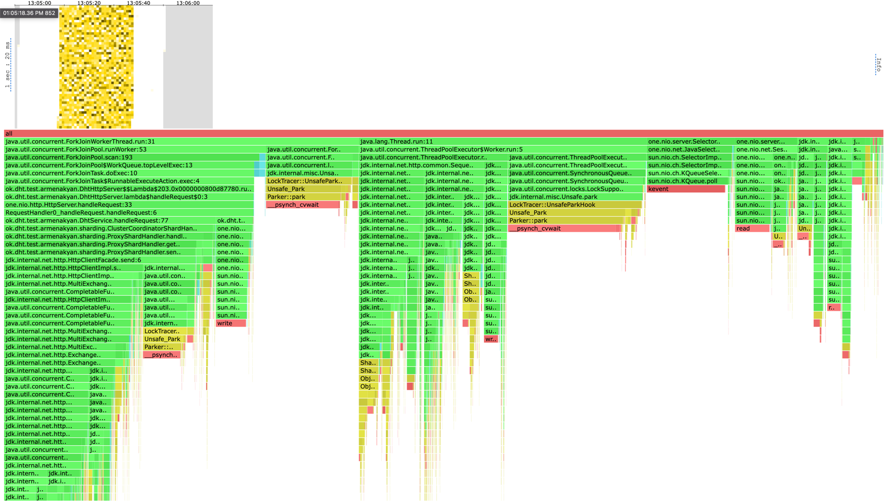
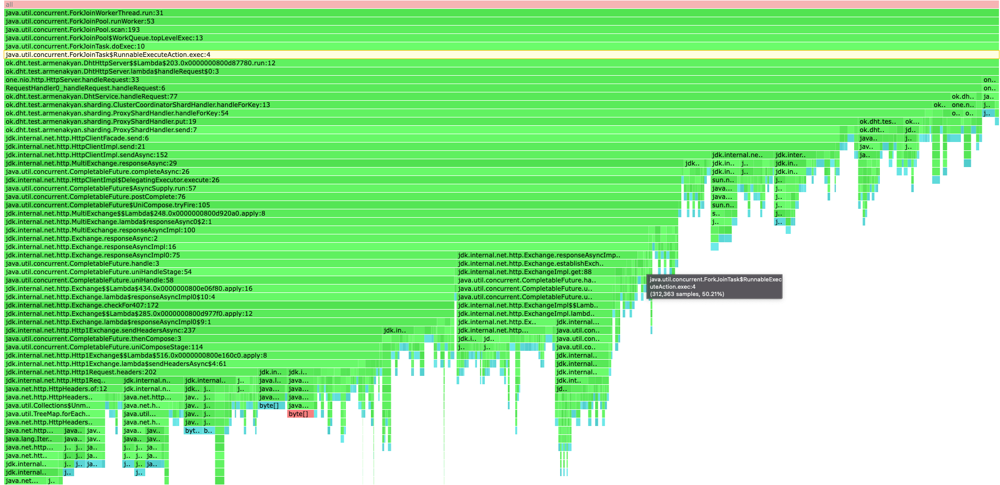

# Report
В качестве бд использовалось RocksDb.

Запускалось 3 шарда.

Базы всех трех шардов были преднаполнены ключами, по 1 500 000 ключа на каждую. Общий дапазон хранимых ключей от 1 до 4 500 000. 
Общий размер трех баз составил ~2.4GB, примерно по 800Mb на каждую (равномерно настолько, насколько 
смог обеспечить consistent hashing c 5 виртуальными шардами на шард).

Сначала определим, какую нагрузку выдерживает наш координатор для каждого из методов, 
для этого будем обстреливать по рандомным ключам в хранимом диапазоне. 
Использовать не проверять отдельно случаи с запросами на ключи храниными только в координаторе, и ключами хранимыми
только в других шардах не вижу смысла, так как первый случай будет аналогичен серверу с предыдущего этапа,
а во втором мы будем измерять только проксирование запросов в другие шарды. Рандомные ключи это хороший 
компромисс для анализа всей системы в целом.

### WRK
#### GET
```shell
kar-arm@i109817075 ~/u/h/2/scripts (stage-3)> wrk2 -c80 -t4 -d 30s -R 20000 -L -s get.lua "http://localhost:2001"
Running 30s test @ http://localhost:2001
  4 threads and 80 connections
  Thread calibration: mean lat.: 721.999ms, rate sampling interval: 1971ms
  Thread calibration: mean lat.: 743.495ms, rate sampling interval: 2061ms
  Thread calibration: mean lat.: 720.549ms, rate sampling interval: 1995ms
  Thread calibration: mean lat.: 720.189ms, rate sampling interval: 1980ms
  Thread Stats   Avg      Stdev     Max   +/- Stdev
    Latency     8.44ms   43.20ms 652.80ms   96.91%
    Req/Sec     5.06k   168.65     5.57k    89.47%
  Latency Distribution (HdrHistogram - Recorded Latency)
 50.000%    1.44ms
 75.000%    2.01ms
 90.000%    2.70ms
 99.000%  255.62ms
 99.900%  500.22ms
 99.990%  627.71ms
 99.999%  649.22ms
100.000%  653.31ms

  599018 requests in 30.00s, 4.77GB read
Requests/sec:  19967.93
Transfer/sec:    162.99MB
```
Как видим, с 80ю соединениями на 20к RPS сервер захлебывается, 99 персентиль 649ms, что долго. 
Стоит отметить, что нагрузка на сеть у нас большая, гоняются 160MB данных в секунду.


Попробуем запустить с рейтом 18к:
```shell
kar-arm@i109817075 ~/u/h/2/scripts (stage-3)> wrk2 -c80 -t4 -d 30s -R 18000 -L -s get.lua "http://localhost:2001"
Running 30s test @ http://localhost:2001
  4 threads and 80 connections
  Thread calibration: mean lat.: 3.123ms, rate sampling interval: 10ms
  Thread calibration: mean lat.: 2.936ms, rate sampling interval: 10ms
  Thread calibration: mean lat.: 2.924ms, rate sampling interval: 10ms
  Thread calibration: mean lat.: 2.938ms, rate sampling interval: 10ms
  Thread Stats   Avg      Stdev     Max   +/- Stdev
    Latency     6.59ms   17.00ms 175.23ms   94.04%
    Req/Sec     4.76k   768.32     9.22k    79.04%
  Latency Distribution (HdrHistogram - Recorded Latency)
 50.000%    1.91ms
 75.000%    3.50ms
 90.000%   10.88ms
 99.000%   99.90ms
 99.900%  145.92ms
 99.990%  166.53ms
 99.999%  172.16ms
100.000%  175.36ms

  534863 requests in 30.00s, 4.26GB read
Requests/sec:  17828.50
Transfer/sec:    145.52MB
```
На 18к рпс сервер выдает задержку 175ms на 99.999 персентиле. Все еще долго.


Попробуем 17500 rps:
```shell
kar-arm@i109817075 ~/u/h/2/scripts (stage-3)> wrk2 -c80 -t4 -d 30s -R 17500 -L -s get.lua "http://localhost:2001"
Running 30s test @ http://localhost:2001
4 threads and 80 connections
Thread calibration: mean lat.: 2.491ms, rate sampling interval: 10ms
Thread calibration: mean lat.: 2.493ms, rate sampling interval: 10ms
Thread calibration: mean lat.: 4.183ms, rate sampling interval: 10ms
Thread calibration: mean lat.: 2.405ms, rate sampling interval: 10ms
Thread Stats   Avg      Stdev     Max   +/- Stdev
Latency     2.40ms    3.37ms  58.62ms   92.82%
Req/Sec     4.62k   554.60    10.78k    82.00%
Latency Distribution (HdrHistogram - Recorded Latency)
50.000%    1.53ms
75.000%    2.24ms
90.000%    3.94ms
99.000%   19.36ms
99.900%   30.11ms
99.990%   39.71ms
99.999%   54.91ms
100.000%   58.65ms

Detailed Percentile spectrum:
Value   Percentile   TotalCount 1/(1-Percentile)

       0.095     0.000000            1         1.00
       0.676     0.100000        34970         1.11
       0.915     0.200000        69702         1.25
       1.119     0.300000       104573         1.43
       1.316     0.400000       139444         1.67
       1.527     0.500000       174205         2.00
       1.641     0.550000       191569         2.22
       1.765     0.600000       209016         2.50
       1.902     0.650000       226390         2.86
       2.057     0.700000       243909         3.33
       2.241     0.750000       261196         4.00
       2.351     0.775000       269974         4.44
       2.479     0.800000       278629         5.00
       2.641     0.825000       287354         5.71
       2.871     0.850000       296057         6.67
       3.229     0.875000       304740         8.00
       3.513     0.887500       309070         8.89
       3.945     0.900000       313433        10.00
       4.619     0.912500       317790        11.43
       5.483     0.925000       322134        13.33
       6.655     0.937500       326477        16.00
       7.403     0.943750       328659        17.78
       8.287     0.950000       330841        20.00
       9.263     0.956250       333014        22.86
      10.415     0.962500       335192        26.67
      11.703     0.968750       337362        32.00
      12.479     0.971875       338453        35.56
      13.327     0.975000       339540        40.00
      14.247     0.978125       340629        45.71
      15.319     0.981250       341715        53.33
      16.575     0.984375       342810        64.00
      17.263     0.985938       343350        71.11
      17.999     0.987500       343895        80.00
      18.815     0.989062       344441        91.43
      19.727     0.990625       344990       106.67
      20.751     0.992188       345529       128.00
      21.375     0.992969       345795       142.22
      22.047     0.993750       346066       160.00
      22.719     0.994531       346342       182.86
      23.519     0.995313       346613       213.33
      24.415     0.996094       346884       256.00
      24.879     0.996484       347023       284.44
      25.439     0.996875       347157       320.00
      26.063     0.997266       347290       365.71
      26.719     0.997656       347427       426.67
      27.551     0.998047       347563       512.00
      27.983     0.998242       347631       568.89
      28.463     0.998437       347699       640.00
      28.991     0.998633       347766       731.43
      29.487     0.998828       347834       853.33
      30.191     0.999023       347902      1024.00
      30.607     0.999121       347936      1137.78
      31.023     0.999219       347970      1280.00
      31.535     0.999316       348004      1462.86
      32.111     0.999414       348038      1706.67
      32.863     0.999512       348072      2048.00
      33.343     0.999561       348090      2275.56
      33.727     0.999609       348106      2560.00
      34.367     0.999658       348123      2925.71
      34.911     0.999707       348140      3413.33
      35.519     0.999756       348157      4096.00
      36.159     0.999780       348166      4551.11
      36.895     0.999805       348174      5120.00
      37.343     0.999829       348183      5851.43
      38.239     0.999854       348191      6826.67
      39.135     0.999878       348200      8192.00
      39.455     0.999890       348204      9102.22
      39.839     0.999902       348208     10240.00
      40.607     0.999915       348213     11702.86
      41.183     0.999927       348217     13653.33
      42.687     0.999939       348221     16384.00
      43.423     0.999945       348223     18204.44
      43.935     0.999951       348225     20480.00
      45.727     0.999957       348228     23405.71
      46.815     0.999963       348230     27306.67
      47.039     0.999969       348232     32768.00
      47.295     0.999973       348233     36408.89
      48.031     0.999976       348234     40960.00
      49.055     0.999979       348235     46811.43
      51.199     0.999982       348236     54613.33
      52.543     0.999985       348237     65536.00
      52.767     0.999986       348238     72817.78
      52.767     0.999988       348238     81920.00
      54.911     0.999989       348239     93622.86
      54.911     0.999991       348239    109226.67
      55.167     0.999992       348240    131072.00
      55.167     0.999993       348240    145635.56
      55.167     0.999994       348240    163840.00
      56.991     0.999995       348241    187245.71
      56.991     0.999995       348241    218453.33
      56.991     0.999996       348241    262144.00
      56.991     0.999997       348241    291271.11
      56.991     0.999997       348241    327680.00
      58.655     0.999997       348242    374491.43
      58.655     1.000000       348242          inf
#[Mean    =        2.403, StdDeviation   =        3.367]
#[Max     =       58.624, Total count    =       348242]
#[Buckets =           27, SubBuckets     =         2048]
----------------------------------------------------------
524172 requests in 30.00s, 4.18GB read
Requests/sec:  17472.34
Transfer/sec:    142.61MB
```
Возьмем этот рейт как значение оптимальной нагрузки для случая GET. Здесь сервер выдерживает 17.5к rps со
средней задержкой 2.40ms и 99.999 персентилем 54.91ms.

#### PUT 
Попробуем нагрузить на PUT запросах с 17.5к rps:
```shell
kar-arm@i109817075 ~/u/h/2/scripts (stage-3)> wrk2 -c80 -t4 -d 30s -R 17500 -L -s put.lua "http://localhost:2001"
Running 30s test @ http://localhost:2001
  4 threads and 80 connections
  Thread calibration: mean lat.: 2.814ms, rate sampling interval: 10ms
  Thread calibration: mean lat.: 2.948ms, rate sampling interval: 10ms
  Thread calibration: mean lat.: 2.750ms, rate sampling interval: 10ms
  Thread calibration: mean lat.: 2.734ms, rate sampling interval: 10ms
  Thread Stats   Avg      Stdev     Max   +/- Stdev
    Latency     3.05ms    8.71ms 179.20ms   96.12%
    Req/Sec     4.61k   719.25     9.40k    91.51%
  Latency Distribution (HdrHistogram - Recorded Latency)
 50.000%    1.47ms
 75.000%    2.08ms
 90.000%    2.85ms
 99.000%   53.95ms
 99.900%   98.56ms
 99.990%  144.38ms
 99.999%  172.67ms
100.000%  179.33ms

  524156 requests in 30.00s, 30.99MB read
Requests/sec:  17472.12
Transfer/sec:      1.03MB
```
При такой нагрузке сервер снова не справляется с большой задержкой в 99 персентиле 53ms, максимальной в 179ms, 
и средней в 3ms. 
Тот факт, что при фиксированном рейте в случае PUT запросов сервер ведет себя хуже, чем в случае GET,
является вполне ожидаемым, так как база заполнена и происходят флаши на диск и компактизации. 

Попробуем с нагрузкой 15к rps:
```shell
kar-arm@i109817075 ~/u/h/2/scripts (stage-3)> wrk2 -c80 -t4 -d 30s -R 15000 -L -s put.lua "http://localhost:2001"
Running 30s test @ http://localhost:2001
  4 threads and 80 connections
  Thread calibration: mean lat.: 3.998ms, rate sampling interval: 10ms
  Thread calibration: mean lat.: 3.937ms, rate sampling interval: 11ms
  Thread calibration: mean lat.: 4.012ms, rate sampling interval: 11ms
  Thread calibration: mean lat.: 4.019ms, rate sampling interval: 11ms
  Thread Stats   Avg      Stdev     Max   +/- Stdev
    Latency     2.61ms    5.16ms  70.72ms   95.22%
    Req/Sec     3.94k   677.01     7.70k    91.09%
  Latency Distribution (HdrHistogram - Recorded Latency)
 50.000%    1.51ms
 75.000%    2.14ms
 90.000%    3.04ms
 99.000%   30.45ms
 99.900%   51.81ms
 99.990%   59.68ms
 99.999%   68.42ms
100.000%   70.78ms

  Detailed Percentile spectrum:
       Value   Percentile   TotalCount 1/(1-Percentile)

       0.111     0.000000            1         1.00
       0.688     0.100000        29946         1.11
       0.920     0.200000        59732         1.25
       1.120     0.300000        89666         1.43
       1.312     0.400000       119470         1.67
       1.513     0.500000       149357         2.00
       1.619     0.550000       164346         2.22
       1.730     0.600000       179142         2.50
       1.852     0.650000       194136         2.86
       1.986     0.700000       208959         3.33
       2.143     0.750000       223962         4.00
       2.235     0.775000       231484         4.44
       2.331     0.800000       238831         5.00
       2.447     0.825000       246322         5.71
       2.585     0.850000       253745         6.67
       2.767     0.875000       261223         8.00
       2.887     0.887500       264952         8.89
       3.041     0.900000       268668        10.00
       3.249     0.912500       272385        11.43
       3.567     0.925000       276115        13.33
       4.267     0.937500       279839        16.00
       5.223     0.943750       281700        17.78
       6.991     0.950000       283565        20.00
       9.655     0.956250       285433        22.86
      12.919     0.962500       287297        26.67
      16.263     0.968750       289166        32.00
      17.967     0.971875       290098        35.56
      19.551     0.975000       291033        40.00
      21.247     0.978125       291965        45.71
      23.231     0.981250       292897        53.33
      25.359     0.984375       293835        64.00
      26.415     0.985938       294293        71.11
      27.807     0.987500       294758        80.00
      29.439     0.989062       295231        91.43
      31.215     0.990625       295695       106.67
      33.279     0.992188       296158       128.00
      34.495     0.992969       296393       142.22
      35.711     0.993750       296630       160.00
      37.375     0.994531       296857       182.86
      39.039     0.995313       297090       213.33
      41.119     0.996094       297327       256.00
      42.271     0.996484       297441       284.44
      43.551     0.996875       297560       320.00
      44.863     0.997266       297676       365.71
      46.207     0.997656       297792       426.67
      47.775     0.998047       297908       512.00
      48.479     0.998242       297966       568.89
      49.311     0.998437       298024       640.00
      50.015     0.998633       298082       731.43
      50.943     0.998828       298142       853.33
      51.999     0.999023       298198      1024.00
      52.383     0.999121       298231      1137.78
      52.959     0.999219       298256      1280.00
      53.631     0.999316       298287      1462.86
      54.367     0.999414       298319      1706.67
      54.815     0.999512       298346      2048.00
      55.135     0.999561       298358      2275.56
      55.487     0.999609       298373      2560.00
      55.807     0.999658       298387      2925.71
      56.383     0.999707       298402      3413.33
      57.151     0.999756       298417      4096.00
      57.407     0.999780       298424      4551.11
      57.759     0.999805       298431      5120.00
      58.175     0.999829       298438      5851.43
      58.751     0.999854       298447      6826.67
      59.231     0.999878       298453      8192.00
      59.583     0.999890       298457      9102.22
      59.711     0.999902       298460     10240.00
      60.031     0.999915       298464     11702.86
      60.287     0.999927       298468     13653.33
      60.735     0.999939       298472     16384.00
      60.895     0.999945       298473     18204.44
      61.823     0.999951       298475     20480.00
      62.399     0.999957       298477     23405.71
      63.743     0.999963       298479     27306.67
      64.671     0.999969       298480     32768.00
      65.023     0.999973       298481     36408.89
      65.055     0.999976       298483     40960.00
      65.055     0.999979       298483     46811.43
      66.111     0.999982       298484     54613.33
      66.751     0.999985       298485     65536.00
      66.751     0.999986       298485     72817.78
      68.415     0.999988       298486     81920.00
      68.415     0.999989       298486     93622.86
      69.695     0.999991       298487    109226.67
      69.695     0.999992       298487    131072.00
      69.695     0.999993       298487    145635.56
      69.759     0.999994       298488    163840.00
      69.759     0.999995       298488    187245.71
      69.759     0.999995       298488    218453.33
      69.759     0.999996       298488    262144.00
      69.759     0.999997       298488    291271.11
      70.783     0.999997       298489    327680.00
      70.783     1.000000       298489          inf
#[Mean    =        2.610, StdDeviation   =        5.165]
#[Max     =       70.720, Total count    =       298489]
#[Buckets =           27, SubBuckets     =         2048]
----------------------------------------------------------
  449292 requests in 30.00s, 26.56MB read
Requests/sec:  14976.02
Transfer/sec:      0.89MB
```
Здесь мы кажется нашли контрольную точку, в которой сервер начинает замедляться 
на 99 персентиле, с задержкой 30ms, максимальной задержкой 70ms, и средней 2.5ms.
Возьмем это значение рейта как оптимальную нагрузку в случае PUT и перейдем к 
профилированию.


#### PROFILING
##### GET CPU
Посмотрим на профиль CPU при GET запросах:


Сразу заметен отдельный профиль с ThreadPoolExecutor, занимающий 32% cpu, здесь выполняется асинхронная работа
java.net.HttpClient, который использует свой собственный тредпул для сетевых вызовов. Из этого профиля
15% времени треды в пуле просто ждали в park'e poll на SynchronousQueue, то есть треды, сделавшие 
запрос ждут на синхронной очереди, пока не получат ответ.

Select cокета с системным KPoll заняли 10%.
Чтение из сокета и обработка запроса серверными селекторами 7%.

Основная часть процессорного времени ушла на бизнес логику обработку запросов в нашем ForkJoinPool - 
40.35 процентов. Из них 10% потоки ждали в parke, что говорит о том, что можно выделять меньше потоков пулу, 
он справляется и так.

Посмотрим подробнее на профиль метода handleRequest в нашем сервисе:

Запись в сокет занимает 4%, здесь все ОК.
Теперь рассмотрим метод ClusterCoordinatorShardHandler#handleForKey, который выполняет основную логику.
Работа ConsistentHashing заняла смешные 0.14%, ее почти нет на флеймграфе, тут все оптимизировано, 
потому что я храню виртуальные шарды в массиве, нахожу шард бинпоиском, а хеширую с помощью быстрого
и поддержанного на уровне системы MD5.

Но вот время на проксирование запросов на другие шарды заняло 23% против 1% на выполнение get из базы. 
Это плохо и говорит о том, что нужно разделить пулы, тк проксирование запросов это долгий сетевой IO вызов, в то 
время как чтение из базы, хоть и тоже IO, происходит судя по профилю на порядок быстрее. С одним пулом мы 
увеличиваем задержку нашего сервера в целом, тк долгие запросы на проксирование забивают очередь и не дают
выполняться быстрым запросам на поход в базу.

Профили, принадлежащие java.net.http.HttpClient получились очень уж огромными, и кажется, что мы можем
сильно сэкономить, используя более легковесный и оптимизированный клиент. Нам даже не нужно чтобы клиент 
был асинхронным под капотом, мы можем сами честно класть блокирующие клиентские вызовы в собственный пул
потоков, и контролировать весь процесс самим.

##### PUT CPU


Здесь все аналогично случаю GET, только теперь соотношение проксирования и похода в базу
в методе ClusterCoordinatorShardHandler#handleForKey изменилось до 19.17% на проксирование против 9% на запись в базу.
Почему запись в базу заняла больше времени, чем чтение опять же понятно, нам нужно записать в лог на диске.
Все еще в два раза больше времени мы тратили на проксирование, утверждение про разделение пулов в этом случае также
справедливо.

##### ALLOC
Профили по аллокациям по сравнению с предыдущими этапами сильно разрослись из-за 
использования java.net.http.HttpClient, здесь огромная часть аллокаций принадлежит ему,



Случай put отличается от случая с get тем, что для первого клиент не вычитывает и не аллоцирует Response, так как
он пустой.

Здесь опять же, кажется что нам нужно использовать более легковесный клиент. 

java.net.http.HttpClient слишком 
большой для нашего высоконагруженного приложения.

##### GET/PUT LOCK
Посмотрим на профиль локов в случе get и put соответственно:


Здесь снова, в обоих случае, мы видим в основном блокировки java.net.http.HttpClient и его SelectorManager'а.

Я использовал ForkJoinPool, который полностью неблокирующий, поэтому его блокировок здесь нет.

И в профиле блокировок java.net.http.HttpClient показал себя не в лучшем ключе. Множество блокировок 
говорит о плохой утилизации тредов в клиенте, более оптимизированный клиент мог бы решить эту проблему.