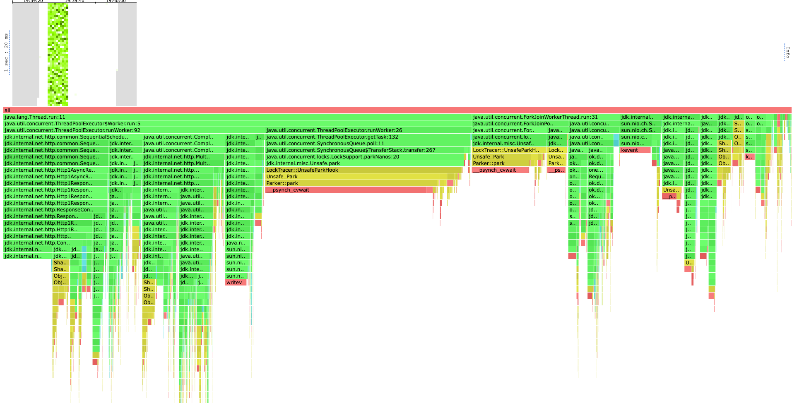
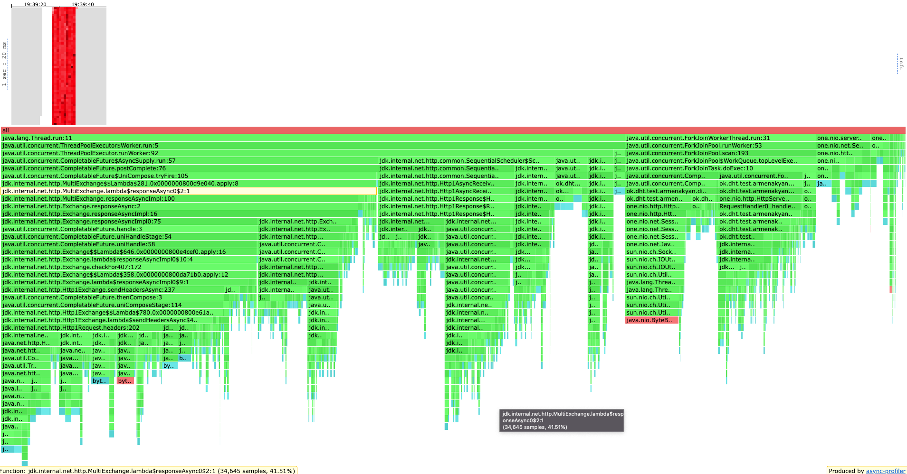

# Report
В качестве бд использовалось RocksDb.

В отличие от предыдущего этапа теперь мы с помощью консистентного хеширования детерминированною выбираем from 
реплик, асинхронно проксируем на них запросы, и также асинхронно дожидаемся ack ответов. Тред, доставивший
последний из ack ответов соединяет результаты, и возвращает ответ клиенту. 
Плюс асинхронности заключается в том, что мы никак не блокируем наши серверные селекторы, а наш пул для 
бизнес логики занимается только выбором нод для проксирования (что быстро реализовано с помощью консистентного хеширования)
а также взаимодействием с базой.

Запускалось 3 ноды.

Базы всех трех нод были преднаполнены ключами, по 1 500 000 ключа на каждую. 
Общий дапазон хранимых ключей от 1 до 4 500 000. 
Общий размер трех баз составил ~3,6gb, примерно по 1.19gb на каждую.

Сначала определим, какую нагрузку выдерживает наш координатор для каждого из методов, 
для этого будем обстреливать по рандомным ключам в хранимом диапазоне. 

### WRK
#### GET
```shell
kar-arm@i109817075 ~/u/h/2/scripts (stage-4)> wrk2 -c80 -t4 -d 10s -R 6000 -L -s get.lua "http://localhost:2001"
Running 10s test @ http://localhost:2001
  4 threads and 80 connections
  Thread Stats   Avg      Stdev     Max   +/- Stdev
    Latency     2.19ms    3.05ms  44.48ms   96.88%
    Req/Sec        nan       nan   0.00      0.00%
  Latency Distribution (HdrHistogram - Recorded Latency)
 50.000%    1.68ms
 75.000%    2.17ms
 90.000%    2.86ms
 99.000%   21.07ms
 99.900%   35.29ms
 99.990%   40.90ms
 99.999%   42.21ms
100.000%   44.51ms

  Detailed Percentile spectrum:
       Value   Percentile   TotalCount 1/(1-Percentile)

       0.331     0.000000            1         1.00
       0.988     0.100000         5980         1.11
       1.195     0.200000        11951         1.25
       1.365     0.300000        17938         1.43
       1.524     0.400000        23894         1.67
       1.685     0.500000        29897         2.00
       1.766     0.550000        32873         2.22
       1.853     0.600000        35875         2.50
       1.945     0.650000        38841         2.86
       2.051     0.700000        41832         3.33
       2.173     0.750000        44842         4.00
       2.243     0.775000        46343         4.44
       2.319     0.800000        47788         5.00
       2.411     0.825000        49291         5.71
       2.525     0.850000        50780         6.67
       2.669     0.875000        52284         8.00
       2.757     0.887500        53026         8.89
       2.863     0.900000        53762        10.00
       3.011     0.912500        54510        11.43
       3.205     0.925000        55256        13.33
       3.489     0.937500        56005        16.00
       3.711     0.943750        56375        17.78
       3.981     0.950000        56754        20.00
       4.291     0.956250        57122        22.86
       4.711     0.962500        57495        26.67
       5.235     0.968750        57869        32.00
       5.615     0.971875        58055        35.56
       6.047     0.975000        58242        40.00
       6.743     0.978125        58431        45.71
       7.599     0.981250        58615        53.33
      10.175     0.984375        58802        64.00
      12.583     0.985938        58895        71.11
      15.535     0.987500        58989        80.00
      18.815     0.989062        59082        91.43
      22.047     0.990625        59175       106.67
      24.463     0.992188        59269       128.00
      25.583     0.992969        59315       142.22
      26.527     0.993750        59362       160.00
      27.535     0.994531        59409       182.86
      28.639     0.995313        59455       213.33
      29.775     0.996094        59502       256.00
      30.175     0.996484        59525       284.44
      30.671     0.996875        59549       320.00
      31.295     0.997266        59572       365.71
      31.935     0.997656        59595       426.67
      32.687     0.998047        59619       512.00
      32.959     0.998242        59630       568.89
      33.407     0.998437        59642       640.00
      34.111     0.998633        59654       731.43
      34.623     0.998828        59666       853.33
      35.519     0.999023        59677      1024.00
      36.031     0.999121        59683      1137.78
      36.415     0.999219        59689      1280.00
      37.119     0.999316        59697      1462.86
      37.407     0.999414        59700      1706.67
      38.143     0.999512        59706      2048.00
      38.591     0.999561        59709      2275.56
      38.815     0.999609        59712      2560.00
      39.263     0.999658        59715      2925.71
      39.615     0.999707        59718      3413.33
      39.807     0.999756        59721      4096.00
      39.839     0.999780        59722      4551.11
      39.935     0.999805        59724      5120.00
      40.127     0.999829        59725      5851.43
      40.415     0.999854        59727      6826.67
      40.831     0.999878        59728      8192.00
      40.895     0.999890        59729      9102.22
      41.023     0.999902        59730     10240.00
      41.023     0.999915        59730     11702.86
      41.311     0.999927        59731     13653.33
      41.343     0.999939        59732     16384.00
      41.343     0.999945        59732     18204.44
      41.823     0.999951        59733     20480.00
      41.823     0.999957        59733     23405.71
      41.823     0.999963        59733     27306.67
      42.207     0.999969        59734     32768.00
      42.207     0.999973        59734     36408.89
      42.207     0.999976        59734     40960.00
      42.207     0.999979        59734     46811.43
      42.207     0.999982        59734     54613.33
      44.511     0.999985        59735     65536.00
      44.511     1.000000        59735          inf
#[Mean    =        2.193, StdDeviation   =        3.047]
#[Max     =       44.480, Total count    =        59735]
#[Buckets =           27, SubBuckets     =         2048]
----------------------------------------------------------
  59739 requests in 10.00s, 214.50MB read
Requests/sec:   5973.97
Transfer/sec:     21.45MB

```
Как видим, с 80ю соединениями на 6к RPS сервер начинает захлёбываться, 99 персентиль 40ms; 
Стоит отметить, что нагрузка на сеть у нас большая, гоняются 214.50MB данных в секунду.

#### PUT
```shell
kar-arm@i109817075 ~/u/h/2/scripts (stage-4)> wrk2 -c80 -t4 -d 10s -R 6000 -L -s put.lua "http://localhost:2001"
Running 10s test @ http://localhost:2001
  4 threads and 80 connections
  Thread Stats   Avg      Stdev     Max   +/- Stdev
    Latency     3.76ms    6.86ms  74.75ms   91.41%
    Req/Sec        nan       nan   0.00      0.00%
  Latency Distribution (HdrHistogram - Recorded Latency)
 50.000%    1.68ms
 75.000%    2.35ms
 90.000%    8.29ms
 99.000%   37.28ms
 99.900%   53.41ms
 99.990%   62.24ms
 99.999%   70.53ms
100.000%   74.82ms

  Detailed Percentile spectrum:
       Value   Percentile   TotalCount 1/(1-Percentile)

       0.271     0.000000            1         1.00
       0.916     0.100000         5981         1.11
       1.124     0.200000        11962         1.25
       1.310     0.300000        17925         1.43
       1.487     0.400000        23910         1.67
       1.676     0.500000        29884         2.00
       1.779     0.550000        32869         2.22
       1.893     0.600000        35860         2.50
       2.018     0.650000        38851         2.86
       2.163     0.700000        41834         3.33
       2.351     0.750000        44808         4.00
       2.481     0.775000        46302         4.44
       2.643     0.800000        47791         5.00
       2.913     0.825000        49287         5.71
       3.461     0.850000        50783         6.67
       4.979     0.875000        52272         8.00
       6.403     0.887500        53019         8.89
       8.287     0.900000        53765        10.00
      10.351     0.912500        54514        11.43
      12.551     0.925000        55259        13.33
      15.175     0.937500        56006        16.00
      16.751     0.943750        56381        17.78
      18.415     0.950000        56753        20.00
      20.383     0.956250        57128        22.86
      22.527     0.962500        57500        26.67
      25.071     0.968750        57873        32.00
      26.319     0.971875        58061        35.56
      27.791     0.975000        58248        40.00
      29.167     0.978125        58432        45.71
      30.879     0.981250        58621        53.33
      32.575     0.984375        58805        64.00
      33.599     0.985938        58900        71.11
      34.975     0.987500        58992        80.00
      36.415     0.989062        59085        91.43
      37.887     0.990625        59181       106.67
      39.583     0.992188        59273       128.00
      40.447     0.992969        59319       142.22
      41.375     0.993750        59365       160.00
      42.367     0.994531        59413       182.86
      43.583     0.995313        59458       213.33
      44.607     0.996094        59509       256.00
      45.279     0.996484        59528       284.44
      46.047     0.996875        59552       320.00
      46.943     0.997266        59575       365.71
      48.031     0.997656        59598       426.67
      49.087     0.998047        59622       512.00
      49.919     0.998242        59634       568.89
      50.751     0.998437        59646       640.00
      51.487     0.998633        59657       731.43
      52.479     0.998828        59668       853.33
      53.439     0.999023        59680      1024.00
      54.047     0.999121        59686      1137.78
      54.527     0.999219        59692      1280.00
      54.975     0.999316        59698      1462.86
      55.327     0.999414        59703      1706.67
      55.871     0.999512        59709      2048.00
      56.575     0.999561        59712      2275.56
      57.119     0.999609        59715      2560.00
      57.567     0.999658        59718      2925.71
      58.719     0.999707        59721      3413.33
      60.159     0.999756        59724      4096.00
      60.575     0.999780        59725      4551.11
      61.311     0.999805        59727      5120.00
      61.375     0.999829        59728      5851.43
      61.599     0.999854        59730      6826.67
      62.143     0.999878        59731      8192.00
      62.239     0.999890        59732      9102.22
      62.399     0.999902        59733     10240.00
      62.399     0.999915        59733     11702.86
      62.431     0.999927        59734     13653.33
      63.263     0.999939        59735     16384.00
      63.263     0.999945        59735     18204.44
      67.775     0.999951        59736     20480.00
      67.775     0.999957        59736     23405.71
      67.775     0.999963        59736     27306.67
      70.527     0.999969        59737     32768.00
      70.527     0.999973        59737     36408.89
      70.527     0.999976        59737     40960.00
      70.527     0.999979        59737     46811.43
      70.527     0.999982        59737     54613.33
      74.815     0.999985        59738     65536.00
      74.815     1.000000        59738          inf
#[Mean    =        3.758, StdDeviation   =        6.859]
#[Max     =       74.752, Total count    =        59738]
#[Buckets =           27, SubBuckets     =         2048]
----------------------------------------------------------
  59743 requests in 10.00s, 3.82MB read
Requests/sec:   5973.66
Transfer/sec:    390.85KB
```
На put c 6к rps сервер также начинает захлёбываться c 99 персентилем 74.82ms. 

#### PROFILING
##### CPU

Профили получились эквивалентными предыдущему этапу. 
Опять же java.net.HttpClient занимает большую долю всех профилей, возможно стоит заменить его на более
легковесный, но я активно пользуюсь его асинхронностью.

Отличием от предыдущего этапа стали только прокси запросы в другие ноды, их количество у нас возросло
поэтому соотвественно вырос и их процент в профиле.

##### ALLOC, LOCK

Профили аллокаций и блокировок также аналогичны предыдущему этапу. Почти все отжирает джавовый клиент.
