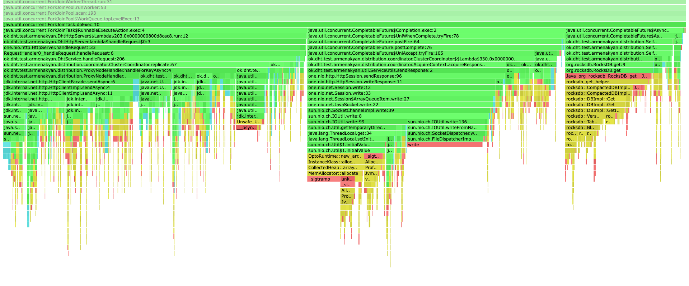
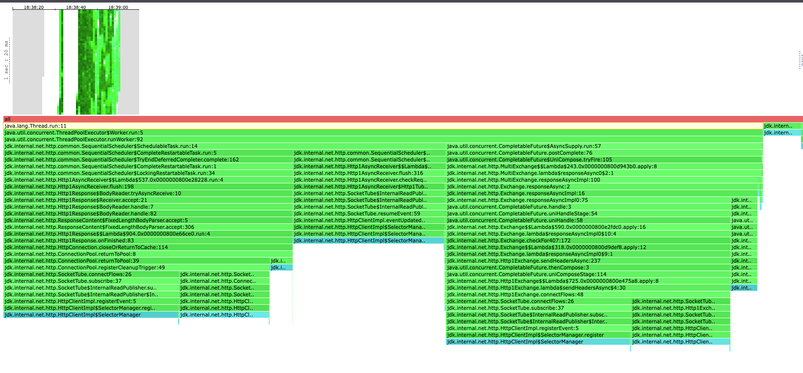
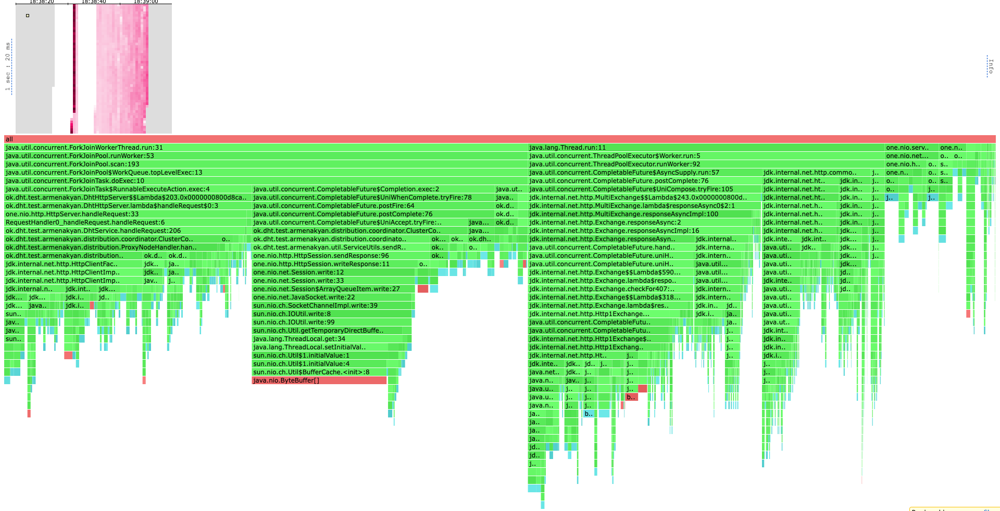

# Report
В качестве бд использовалось RocksDb.

В предыдущем этапе запросы уже отсылались репликам асинхронно. Поэтому в этом этапе были добавлены 
улучшения и оптимизации этого подхода:

Добавлен лимит на количество параллельных запросов к репликам, чтобы упавшая реплика не
ломала доступность до остальных. Здесь достаточно только счетчика, так как клиент асинхронный и наши потоки 
в нем не блокируются. 

Колбеки навешанные на `CompletableFuture` теперь перестали быть асинхронными (например `handleAsync` -> `handle`). 
В нашем случае неважно
исполнится ли колбек в треде, выполнявшем запрос, или же в треде который зарегистрировал `CompletableFuture` с запросом.
Поэтому это изменение, убирает лишний оверхед на явный перенос задачи колбека в пул и переключение контекста потоков.

Также в этом этапе изменилась логика сбора ответов в асинхронных запросах. Теперь это происходит оптимальней: 
каждый тред, получивший ответ,  
соединяет результат с текущим в `AcquireContext` (в прошлом этапе ответы клались в конкурентную коллекцию и мержились 
при последнем ответе). Таким образом должно уменьшится общее время ожидания ответа на запрос в нашу координирующую ноду,
так как теперь после получения последнего ответа с реплики мы должны будем смержить только один результат.

Запускалось 3 ноды.

Базы всех трех нод были преднаполнены ключами, по 1 500 000 ключа на каждую. 
Общий дапазон хранимых ключей от 1 до 4 500 000. 
Общий размер трех баз составил ~3,6gb, примерно по 1.2gb на каждую.

Сначала определим, какую нагрузку выдерживает наш координатор для каждого из методов, 
для этого будем обстреливать по рандомным ключам в хранимом диапазоне. 

### WRK
#### GET
```shell
kar-arm@i109817075 ~/u/h/2/scripts (stage-5)> wrk2 -c80 -t4 -d 10s -R 15000 -L -s get.lua "http://localhost:2001"
Running 10s test @ http://localhost:2001
  4 threads and 80 connections
  Thread Stats   Avg      Stdev     Max   +/- Stdev
    Latency    11.10ms   15.73ms  93.76ms   83.68%
    Req/Sec        nan       nan   0.00      0.00%
  Latency Distribution (HdrHistogram - Recorded Latency)
 50.000%    3.10ms
 75.000%   12.24ms
 90.000%   36.77ms
 99.000%   63.87ms
 99.900%   79.81ms
 99.990%   91.07ms
 99.999%   93.12ms
100.000%   93.82ms

  145711 requests in 10.00s, 316.77MB read
Requests/sec:  14571.29
Transfer/sec:     31.68MB

```
Как видим, после изменений, по сравнению с предыдущим этапом, сервер начал выдерживать большую нагрузку.
На 15к RPS сервер начинает захлебываться: 99 персентиль 63ms, максимальная задержка 93ms.

На 10к RPS сервер показывает среднюю задержу уже в 2,7ms и максимальную в 40ms:
```shell
kar-arm@i109817075 ~/u/h/2/scripts (stage-5)> wrk2 -c80 -t4 -d 10s -R 10000 -L -s get.lua "http://localhost:2001"
Running 10s test @ http://localhost:2001
  4 threads and 80 connections
  Thread Stats   Avg      Stdev     Max   +/- Stdev
    Latency     2.76ms    2.79ms  40.51ms   94.24%
    Req/Sec        nan       nan   0.00      0.00%
  Latency Distribution (HdrHistogram - Recorded Latency)
 50.000%    2.14ms
 75.000%    2.93ms
 90.000%    4.14ms
 99.000%   17.04ms
 99.900%   26.11ms
 99.990%   33.89ms
 99.999%   38.43ms
100.000%   40.54ms

  Detailed Percentile spectrum:
       Value   Percentile   TotalCount 1/(1-Percentile)

       0.256     0.000000            1         1.00
       1.089     0.100000         9736         1.11
       1.386     0.200000        19449         1.25
       1.636     0.300000        29160         1.43
       1.886     0.400000        38901         1.67
       2.141     0.500000        48587         2.00
       2.275     0.550000        53450         2.22
       2.415     0.600000        58344         2.50
       2.565     0.650000        63168         2.86
       2.733     0.700000        68025         3.33
       2.935     0.750000        72902         4.00
       3.053     0.775000        75296         4.44
       3.191     0.800000        77734         5.00
       3.347     0.825000        80157         5.71
       3.541     0.850000        82598         6.67
       3.795     0.875000        85016         8.00
       3.955     0.887500        86226         8.89
       4.143     0.900000        87440        10.00
       4.387     0.912500        88656        11.43
       4.695     0.925000        89870        13.33
       5.239     0.937500        91089        16.00
       5.655     0.943750        91691        17.78
       6.255     0.950000        92300        20.00
       7.195     0.956250        92905        22.86
       8.567     0.962500        93516        26.67
      10.215     0.968750        94122        32.00
      11.015     0.971875        94423        35.56
      11.863     0.975000        94727        40.00
      12.567     0.978125        95030        45.71
      13.591     0.981250        95337        53.33
      14.663     0.984375        95637        64.00
      15.255     0.985938        95789        71.11
      15.919     0.987500        95943        80.00
      16.559     0.989062        96093        91.43
      17.407     0.990625        96246       106.67
      18.287     0.992188        96397       128.00
      18.911     0.992969        96473       142.22
      19.567     0.993750        96548       160.00
      20.143     0.994531        96624       182.86
      20.735     0.995313        96701       213.33
      21.391     0.996094        96779       256.00
      21.887     0.996484        96814       284.44
      22.367     0.996875        96853       320.00
      22.767     0.997266        96891       365.71
      23.375     0.997656        96928       426.67
      24.015     0.998047        96966       512.00
      24.255     0.998242        96985       568.89
      24.623     0.998437        97004       640.00
      25.151     0.998633        97023       731.43
      25.535     0.998828        97042       853.33
      26.175     0.999023        97062      1024.00
      26.367     0.999121        97070      1137.78
      26.815     0.999219        97080      1280.00
      27.151     0.999316        97091      1462.86
      27.487     0.999414        97099      1706.67
      27.967     0.999512        97108      2048.00
      28.351     0.999561        97113      2275.56
      28.639     0.999609        97118      2560.00
      28.943     0.999658        97122      2925.71
      29.471     0.999707        97127      3413.33
      30.559     0.999756        97132      4096.00
      30.943     0.999780        97134      4551.11
      31.519     0.999805        97137      5120.00
      31.615     0.999829        97139      5851.43
      33.055     0.999854        97141      6826.67
      33.535     0.999878        97144      8192.00
      33.887     0.999890        97145      9102.22
      34.015     0.999902        97146     10240.00
      35.039     0.999915        97147     11702.86
      35.231     0.999927        97148     13653.33
      35.743     0.999939        97150     16384.00
      35.743     0.999945        97150     18204.44
      36.543     0.999951        97151     20480.00
      36.543     0.999957        97151     23405.71
      36.607     0.999963        97152     27306.67
      37.823     0.999969        97153     32768.00
      37.823     0.999973        97153     36408.89
      37.823     0.999976        97153     40960.00
      37.823     0.999979        97153     46811.43
      38.431     0.999982        97154     54613.33
      38.431     0.999985        97154     65536.00
      38.431     0.999986        97154     72817.78
      38.431     0.999988        97154     81920.00
      38.431     0.999989        97154     93622.86
      40.543     0.999991        97155    109226.67
      40.543     1.000000        97155          inf
#[Mean    =        2.763, StdDeviation   =        2.785]
#[Max     =       40.512, Total count    =        97155]
#[Buckets =           27, SubBuckets     =         2048]
----------------------------------------------------------
  97159 requests in 10.00s, 143.14MB read
Requests/sec:   9714.82
Transfer/sec:     14.31MB
```
На предыдущем этапе похожие значения были только на 6к RPS.

#### PUT
```shell
kar-arm@i109817075 ~/u/h/2/scripts (stage-5)> wrk2 -c80 -t4 -d 20s -R 10000 -L -s put.lua "http://localhost:2001"
Running 20s test @ http://localhost:2001
  4 threads and 80 connections
  Thread calibration: mean lat.: 7.387ms, rate sampling interval: 20ms
  Thread calibration: mean lat.: 7.033ms, rate sampling interval: 18ms
  Thread calibration: mean lat.: 7.061ms, rate sampling interval: 20ms
  Thread calibration: mean lat.: 7.198ms, rate sampling interval: 18ms
  Thread Stats   Avg      Stdev     Max   +/- Stdev
    Latency     3.94ms    8.98ms  95.42ms   94.53%
    Req/Sec     2.57k   308.11     4.24k    90.23%
  Latency Distribution (HdrHistogram - Recorded Latency)
 50.000%    1.83ms
 75.000%    2.54ms
 90.000%    3.66ms
 99.000%   50.78ms
 99.900%   76.48ms
 99.990%   90.56ms
 99.999%   94.08ms
100.000%   95.49ms

  Detailed Percentile spectrum:
       Value   Percentile   TotalCount 1/(1-Percentile)

       0.328     0.000000            1         1.00
       0.962     0.100000         9923         1.11
       1.200     0.200000        19797         1.25
       1.409     0.300000        29696         1.43
       1.614     0.400000        39611         1.67
       1.827     0.500000        49508         2.00
       1.943     0.550000        54444         2.22
       2.071     0.600000        59415         2.50
       2.211     0.650000        64341         2.86
       2.365     0.700000        69304         3.33
       2.537     0.750000        74238         4.00
       2.643     0.775000        76753         4.44
       2.761     0.800000        79216         5.00
       2.901     0.825000        81675         5.71
       3.079     0.850000        84145         6.67
       3.307     0.875000        86629         8.00
       3.459     0.887500        87851         8.89
       3.657     0.900000        89087        10.00
       3.969     0.912500        90322        11.43
       4.519     0.925000        91566        13.33
       6.363     0.937500        92799        16.00
      11.327     0.943750        93416        17.78
      17.407     0.950000        94034        20.00
      22.639     0.956250        94654        22.86
      27.919     0.962500        95272        26.67
      36.063     0.968750        95890        32.00
      38.591     0.971875        96201        35.56
      40.927     0.975000        96512        40.00
      42.975     0.978125        96818        45.71
      44.831     0.981250        97129        53.33
      46.975     0.984375        97440        64.00
      48.063     0.985938        97593        71.11
      49.023     0.987500        97746        80.00
      50.111     0.989062        97902        91.43
      51.263     0.990625        98056       106.67
      52.639     0.992188        98212       128.00
      53.439     0.992969        98288       142.22
      54.239     0.993750        98366       160.00
      55.135     0.994531        98442       182.86
      56.287     0.995313        98520       213.33
      57.631     0.996094        98597       256.00
      58.431     0.996484        98636       284.44
      59.391     0.996875        98674       320.00
      60.415     0.997266        98713       365.71
      62.143     0.997656        98752       426.67
      64.639     0.998047        98790       512.00
      65.983     0.998242        98810       568.89
      68.351     0.998437        98829       640.00
      70.655     0.998633        98848       731.43
      74.239     0.998828        98868       853.33
      77.375     0.999023        98887      1024.00
      78.719     0.999121        98897      1137.78
      79.935     0.999219        98906      1280.00
      82.175     0.999316        98916      1462.86
      83.455     0.999414        98926      1706.67
      84.607     0.999512        98935      2048.00
      85.375     0.999561        98940      2275.56
      86.079     0.999609        98945      2560.00
      86.911     0.999658        98950      2925.71
      87.679     0.999707        98955      3413.33
      88.255     0.999756        98959      4096.00
      88.511     0.999780        98962      4551.11
      88.703     0.999805        98965      5120.00
      89.151     0.999829        98967      5851.43
      89.983     0.999854        98969      6826.67
      90.431     0.999878        98971      8192.00
      90.559     0.999890        98973      9102.22
      90.623     0.999902        98974     10240.00
      90.751     0.999915        98975     11702.86
      90.815     0.999927        98976     13653.33
      90.943     0.999939        98977     16384.00
      91.199     0.999945        98978     18204.44
      91.391     0.999951        98979     20480.00
      91.391     0.999957        98979     23405.71
      91.839     0.999963        98980     27306.67
      91.839     0.999969        98980     32768.00
      92.927     0.999973        98981     36408.89
      92.927     0.999976        98981     40960.00
      92.927     0.999979        98981     46811.43
      94.079     0.999982        98982     54613.33
      94.079     0.999985        98982     65536.00
      94.079     0.999986        98982     72817.78
      94.079     0.999988        98982     81920.00
      94.079     0.999989        98982     93622.86
      95.487     0.999991        98983    109226.67
      95.487     1.000000        98983          inf
#[Mean    =        3.936, StdDeviation   =        8.982]
#[Max     =       95.424, Total count    =        98983]
#[Buckets =           27, SubBuckets     =         2048]
----------------------------------------------------------
  199530 requests in 20.00s, 11.23MB read
Requests/sec:   9976.05
Transfer/sec:    574.79KB
```
Для 10к RPS на методе PUT мы видим аналогичные с методом GET цифры. Опять же сервер по сравнению с предыдущим этапом
начал справляться лучше, там похожие значения задержки были только на 6к RPS.

#### PROFILING
##### CPU
###### GET: 

Профили получились похожими на профили из предыдущего этапа.

Опять же `java.net.HttpClient` занимает большую долю процессорного времени 50-60%. Из них клиент пишет в сокет
только 4% времени. Читает 0.8% времени. Остальное уходит на менеджмент асинхронной отправки.

Посмотрим на часть профиля, принадлежащую приложению:


Здесь мы видим что часть с чтеним из базы занимает 2.2%, 0.16% занимает соединению результата в `AcquireContext` 
после асинхронного чтения.

Соединение результатов проксирования занимает 5%.

Проксирование запроса репликам занимает 6%.

Работа `ConsistentHashing` занимает 0.3 процента.

Как мы видим, огромную часть всего профиля в итоге занимает деятельность, связанная с асинхронной работой клиента, 
а также ручной асинхронной работой при оборачивании работы с базой в `CompletableFuture`. 
Это говорит о том, что асинхронность приносит нам оверхед, происходит более частое переключение между тредами. 
С другой стороны, асинхронность позволяет нашим тредам не блокироваться и лучше утилизировать ресурсы.

###### PUT: 
В случае PUT все аналогично, за исключением незначительно более долгой работы с базой.

##### GET/PUT LOCK

Профиль блокировок аналогичен предыдущему этапу.
Наши треды не блокируются, работа в них происходит асинхронно. 

Весь профиль блокировок занимаeт работа `SelectorManager` клиента.

##### GET/PUT ALLOC

Профили аллокаций также аналогиен предыдущему этапу.

Здесь можно сильно сэкономить, не копируя в классе `Value` маcсивы байт при создании и в гетере. Копировать меня 
заставил `CodeClimate`. Можно создать обертку над массивом и передавать ссылку на нее (чтобы обмануть климат) 
(здесь тоже будет оверхед на аллокацию лишних классов), или же отключить эту проверку в климате, ведь это мое 
приложение и я знаю что не буду менять значения в массиве по ссылке :).
