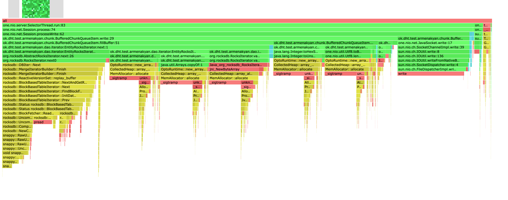
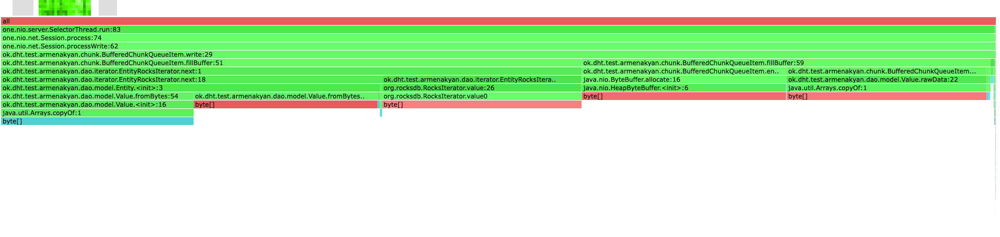

# Report
В качестве бд использовалось RocksDb.

В этом этапе пришлось вынести абстракцию по работе с бд `RocksDBDao` чтобы переиспользовать ее в сервисе для получения
итераторов. 
Для отправки ответа в потоковом режиме используется `ChunkedResponse`, инкапсулирующий в себе итератор по range запросу
из базы. `ChunkedResponse` отправляется с помощью `BufferedChunkQueueItem`. Для минимизации количества системных
вызовов `socket.write()`, в `BufferedChunkQueueItem` поддерживается буфер ограниченного размера, который наполняется
вхождениями из итератора, и отправляется в сокет уже пачкой.

Посмотрим на профили. Профилирование производилось на кластере из предыдущего этапа, каждая из база в котором 
наполнена ключами примерно по 1.2gb. Профилировалось на запросах с параметрами `start=0`, то есть на получение всех
значений из базы. Для упрощения профиля запросов из предыдущих этапов с проксированием на ноду не производилось.

#### PROFILING
##### CPU 

Видно, что профиль трейсы в профиле распределены равномерно. 
Наибольшее время занимает обход итератора `RockIterator`. Здесь в RocksDb происходит поиск и вычитывания элементов
с диска.
Также много времени занимает оборачивание ключа-значения из базы в `Entity`, в основном затраты на копирование 
массивов из-за проверки `CodeClymate`, здесь можно не копировать массив, а оборачивать например в ByteBuffer, но
с таким подходом мы тоже получим оверхед на лишние аллокации.

Запись в сокет занимает 14.5, что немного. Мы записываем чанки буферами, и возможно здесь получится соптимизировать,
еще более уменьшив количество системных вызовов `write` путем расширения размера буфера.

Наполнение буфера в `BufferedChunkQueueItem` занимает 20%, из них почти все время уходит
кодирование размера текущего чанка в шестнадцатеричную строку. Это место можно и нужно оптимизировать, 
не используя `Integer#toHexString` с последующим `Utf8#toBytes`, а написав свою реализацию.

##### ALLOC

На профиле аллокаций напрямую виден оверхед копирования массивов в `Entity` и `Value`, почти весь профиль
забит ими. Пятая часть всех аллокаций приходится на аллокацию value из итератора `RocksIterator`.