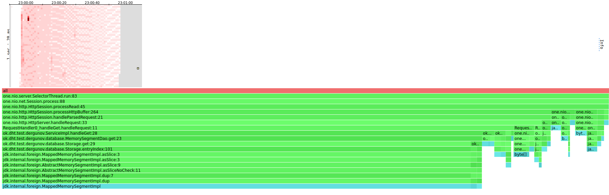

# Отчет Stage 1 #

## Нагрузочное тестирование с помощью wrk2 ##

Тестирование производится на `Ubuntu 22.04.1 LTS` ядро `Linux 5.15.0-48-generic`
процессор `Intel(R) Xeon(R) CPU E5-2620 v3 @ 2.40GHz`
кеш L3 `15 Mb` диск nvme

### PUT ###

Необходимо найти, такую нагрузку варьируя параметр `-R`,
при которой наш сервис будет отвечать быстро (`1ms`),
будем искать бинарным поиском с начальной верхней границей `-R`
100000, так же время тестирования 60 секунд,
будем использовать 1 поток, 1 подключение и скрипт `put.lua`
(`-d 60 -t 1 -c 1 -s put.lua`)

`wrk -d 60 -t 1 -c 1 -R 20000 -s ./put.lua -L http://localhost:8084` - Avg Latency 1.49s - сервис не справился

`wrk -d 60 -t 1 -c 1 -R 10000 -s ./put.lua -L http://localhost:8084` - Avg Latency 675.08us - сервис справился

`wrk -d 60 -t 1 -c 1 -R 15000 -s ./put.lua -L http://localhost:8084` - Avg Latency 61.79ms - сервис не справился

`wrk -d 60 -t 1 -c 1 -R 12500 -s ./put.lua -L http://localhost:8084` - Avg Latency 2.38ms - сервис не справился

`wrk -d 60 -t 1 -c 1 -R 11250 -s ./put.lua -L http://localhost:8084` - Avg Latency 0.98ms - сервис справился

В 90 % случаях ответ давался меньше за 1.11ms
Будем считать что сервис при данных параметра нагрузки хорошо справляется с rate 9687
Консольный вывод при rate 9375,
```
nikita@nikita-X99:~/wrk2$ wrk -d 60 -t 1 -c 1 -R 11250 -s ./put.lua -L http://localhost:8084
Running 1m test @ http://localhost:8084
  1 threads and 1 connections
  Thread calibration: mean lat.: 3.021ms, rate sampling interval: 10ms
  Thread Stats   Avg      Stdev     Max   +/- Stdev
    Latency     0.98ms    1.95ms  20.22ms   96.55%
    Req/Sec    11.83k     1.02k   21.67k    78.02%
  Latency Distribution (HdrHistogram - Recorded Latency)
 50.000%  649.00us
 75.000%    0.94ms
 90.000%    1.11ms
 99.000%   13.22ms
 99.900%   18.21ms
 99.990%   19.84ms
 99.999%   20.17ms
100.000%   20.24ms

  Detailed Percentile spectrum:
       Value   Percentile   TotalCount 1/(1-Percentile)

       0.035     0.000000            2         1.00
       0.176     0.100000        56734         1.11
       0.294     0.200000       112613         1.25
       0.413     0.300000       169068         1.43
       0.531     0.400000       225253         1.67
       0.649     0.500000       281537         2.00
       0.708     0.550000       309734         2.22
       0.767     0.600000       337956         2.50
       0.825     0.650000       365747         2.86
       0.884     0.700000       394145         3.33
       0.942     0.750000       422233         4.00
       0.971     0.775000       436394         4.44
       0.999     0.800000       450029         5.00
       1.028     0.825000       464455         5.71
       1.055     0.850000       478094         6.67
       1.083     0.875000       492262         8.00
       1.097     0.887500       499432         8.89
       1.111     0.900000       506334        10.00
       1.128     0.912500       513335        11.43
       1.301     0.925000       520290        13.33
       1.534     0.937500       527321        16.00
       1.657     0.943750       530823        17.78
       1.783     0.950000       534334        20.00
       1.919     0.956250       537847        22.86
       2.147     0.962500       541355        26.67
       3.865     0.968750       544880        32.00
       5.279     0.971875       546627        35.56
       6.695     0.975000       548397        40.00
       7.687     0.978125       550160        45.71
       8.839     0.981250       551900        53.33
      10.327     0.984375       553658        64.00
      10.967     0.985938       554537        71.11
      11.943     0.987500       555420        80.00
      12.607     0.989062       556294        91.43
      13.543     0.990625       557173       106.67
      14.407     0.992188       558052       128.00
      14.847     0.992969       558497       142.22
      15.183     0.993750       558936       160.00
      15.567     0.994531       559378       182.86
      15.903     0.995313       559814       213.33
      16.327     0.996094       560278       256.00
      16.479     0.996484       560490       284.44
      16.671     0.996875       560697       320.00
      16.831     0.997266       560934       365.71
      16.991     0.997656       561132       426.67
      17.215     0.998047       561364       512.00
      17.279     0.998242       561461       568.89
      17.423     0.998437       561589       640.00
      17.487     0.998633       561678       731.43
      17.807     0.998828       561787       853.33
      18.239     0.999023       561897      1024.00
      18.415     0.999121       561951      1137.78
      18.575     0.999219       562008      1280.00
      18.735     0.999316       562064      1462.86
      18.911     0.999414       562116      1706.67
      19.135     0.999512       562175      2048.00
      19.247     0.999561       562200      2275.56
      19.343     0.999609       562230      2560.00
      19.439     0.999658       562255      2925.71
      19.519     0.999707       562285      3413.33
      19.583     0.999756       562309      4096.00
      19.631     0.999780       562323      4551.11
      19.679     0.999805       562339      5120.00
      19.711     0.999829       562351      5851.43
      19.759     0.999854       562365      6826.67
      19.807     0.999878       562380      8192.00
      19.823     0.999890       562385      9102.22
      19.839     0.999902       562391     10240.00
      19.871     0.999915       562399     11702.86
      19.903     0.999927       562404     13653.33
      19.951     0.999939       562411     16384.00
      19.983     0.999945       562415     18204.44
      19.999     0.999951       562418     20480.00
      20.031     0.999957       562422     23405.71
      20.047     0.999963       562425     27306.67
      20.063     0.999969       562428     32768.00
      20.095     0.999973       562431     36408.89
      20.111     0.999976       562432     40960.00
      20.127     0.999979       562435     46811.43
      20.127     0.999982       562435     54613.33
      20.143     0.999985       562437     65536.00
      20.159     0.999986       562438     72817.78
      20.175     0.999988       562441     81920.00
      20.175     0.999989       562441     93622.86
      20.175     0.999991       562441    109226.67
      20.175     0.999992       562441    131072.00
      20.191     0.999993       562442    145635.56
      20.191     0.999994       562442    163840.00
      20.191     0.999995       562442    187245.71
      20.223     0.999995       562443    218453.33
      20.223     0.999996       562443    262144.00
      20.239     0.999997       562445    291271.11
      20.239     1.000000       562445          inf
#[Mean    =        0.975, StdDeviation   =        1.949]
#[Max     =       20.224, Total count    =       562445]
#[Buckets =           27, SubBuckets     =         2048]
----------------------------------------------------------
  674993 requests in 1.00m, 43.13MB read
Requests/sec:  11249.78
Transfer/sec:    736.07KB
```

### GET ###

Перед выполнением нагрузки на get запрос,
заполним нашу базу с помощью wrk
`wrk -d 120 -t 1 -c 1 -R 11250 -s put.lua -L http://localhost:8082`
получим повторяющиеся записи внутри базы, в базе порядка 1.3 миллионов записей

Запросы нагрузки для get запросов будем искать так же бин поиском, за верхнюю границу возьмем `-R 11250`

`wrk -d 60 -t 1 -c 1 -R 11250 -s ./get.lua -L http://localhost:8084` - Avg Latency 205.22ms - сервис не справился

`wrk -d 60 -t 1 -c 1 -R 5625 -s ./get.lua -L http://localhost:8084` - Avg Latency 730.87us - сервис справился

`wrk -d 60 -t 1 -c 1 -R 7813 -s ./get.lua -L http://localhost:8084` - Avg Latency 660.84us - сервис справился

`wrk -d 60 -t 1 -c 1 -R 8906 -s ./get.lua -L http://localhost:8084` - Avg Latency 849.78us - сервис справился

`wrk -d 60 -t 1 -c 1 -R 9453 -s ./get.lua -L http://localhost:8084` - Avg Latency 44.44ms - сервис не справился

`wrk -d 60 -t 1 -c 1 -R 8906 -s ./get.lua -L http://localhost:8084` - Avg Latency 849.78us - сервис справился

В 90 % случаях ответ давался меньше за 1.08ms
Будем считать что сервис при данных параметра нагрузки хорошо справляется с rate 8906
Консольный вывод при rate 8906:

```
nikita@nikita-X99:~/wrk2$ wrk -d 60 -t 1 -c 1 -R 8906 -s ./get.lua -L http://localhost:8084
Running 1m test @ http://localhost:8084
  1 threads and 1 connections
  Thread calibration: mean lat.: 0.803ms, rate sampling interval: 10ms
  Thread Stats   Avg      Stdev     Max   +/- Stdev
    Latency   849.78us    2.00ms  35.04ms   98.27%
    Req/Sec     9.40k   695.74    15.33k    69.28%
  Latency Distribution (HdrHistogram - Recorded Latency)
 50.000%  638.00us
 75.000%    0.91ms
 90.000%    1.08ms
 99.000%    9.12ms
 99.900%   28.88ms
 99.990%   34.40ms
 99.999%   35.01ms
100.000%   35.07ms

  Detailed Percentile spectrum:
       Value   Percentile   TotalCount 1/(1-Percentile)

       0.048     0.000000            1         1.00
       0.193     0.100000        44645         1.11
       0.305     0.200000        89308         1.25
       0.416     0.300000       133744         1.43
       0.527     0.400000       178259         1.67
       0.638     0.500000       222945         2.00
       0.693     0.550000       245135         2.22
       0.748     0.600000       267463         2.50
       0.803     0.650000       289716         2.86
       0.858     0.700000       312102         3.33
       0.912     0.750000       334056         4.00
       0.940     0.775000       345345         4.44
       0.967     0.800000       356334         5.00
       0.995     0.825000       367787         5.71
       1.022     0.850000       378794         6.67
       1.049     0.875000       389920         8.00
       1.062     0.887500       395217         8.89
       1.076     0.900000       400988        10.00
       1.089     0.912500       406422        11.43
       1.103     0.925000       412141        13.33
       1.116     0.937500       417654        16.00
       1.123     0.943750       420562        17.78
       1.130     0.950000       423213        20.00
       1.138     0.956250       425927        22.86
       1.147     0.962500       428710        26.67
       1.162     0.968750       431405        32.00
       1.196     0.971875       432746        35.56
       1.321     0.975000       434122        40.00
       1.565     0.978125       435514        45.71
       2.149     0.981250       436907        53.33
       3.997     0.984375       438295        64.00
       5.403     0.985938       438991        71.11
       6.787     0.987500       439689        80.00
       8.207     0.989062       440386        91.43
       9.815     0.990625       441080       106.67
      12.767     0.992188       441774       128.00
      13.927     0.992969       442122       142.22
      14.991     0.993750       442470       160.00
      16.143     0.994531       442821       182.86
      17.119     0.995313       443168       213.33
      19.487     0.996094       443514       256.00
      20.719     0.996484       443688       284.44
      21.951     0.996875       443861       320.00
      23.199     0.997266       444036       365.71
      24.495     0.997656       444209       426.67
      25.759     0.998047       444383       512.00
      26.383     0.998242       444470       568.89
      27.039     0.998437       444557       640.00
      27.711     0.998633       444644       731.43
      28.335     0.998828       444732       853.33
      28.959     0.999023       444819      1024.00
      29.359     0.999121       444861      1137.78
      30.047     0.999219       444906      1280.00
      30.671     0.999316       444948      1462.86
      31.279     0.999414       444992      1706.67
      31.887     0.999512       445035      2048.00
      32.239     0.999561       445058      2275.56
      32.575     0.999609       445080      2560.00
      32.927     0.999658       445101      2925.71
      33.247     0.999707       445122      3413.33
      33.567     0.999756       445144      4096.00
      33.727     0.999780       445156      4551.11
      33.887     0.999805       445168      5120.00
      33.983     0.999829       445176      5851.43
      34.175     0.999854       445189      6826.67
      34.303     0.999878       445199      8192.00
      34.367     0.999890       445204      9102.22
      34.431     0.999902       445209     10240.00
      34.527     0.999915       445216     11702.86
      34.591     0.999927       445221     13653.33
      34.655     0.999939       445226     16384.00
      34.719     0.999945       445230     18204.44
      34.751     0.999951       445231     20480.00
      34.783     0.999957       445234     23405.71
      34.815     0.999963       445236     27306.67
      34.847     0.999969       445239     32768.00
      34.879     0.999973       445240     36408.89
      34.911     0.999976       445242     40960.00
      34.943     0.999979       445245     46811.43
      34.943     0.999982       445245     54613.33
      34.975     0.999985       445247     65536.00
      34.975     0.999986       445247     72817.78
      34.975     0.999988       445247     81920.00
      35.007     0.999989       445250     93622.86
      35.007     0.999991       445250    109226.67
      35.007     0.999992       445250    131072.00
      35.007     0.999993       445250    145635.56
      35.007     0.999994       445250    163840.00
      35.007     0.999995       445250    187245.71
      35.007     0.999995       445250    218453.33
      35.039     0.999996       445251    262144.00
      35.039     0.999997       445251    291271.11
      35.039     0.999997       445251    327680.00
      35.039     0.999997       445251    374491.43
      35.039     0.999998       445251    436906.67
      35.071     0.999998       445252    524288.00
      35.071     1.000000       445252          inf
#[Mean    =        0.850, StdDeviation   =        2.001]
#[Max     =       35.040, Total count    =       445252]
#[Buckets =           27, SubBuckets     =         2048]
----------------------------------------------------------
  534350 requests in 1.00m, 37.59MB read
Requests/sec:   8905.86
Transfer/sec:    641.62KB
```

## Профилирование с помощью async-profiler ##

### PUT ###

Выполним старт приложения и дадим нагрузку с помощью wrk:
`wrk -d 60 -t 1 -c 1 -R 11250 -s ./put.lua -L http://localhost:8084`

#### CPU ####


За тестирование, только 10% времени CPU использовалось на upsert,
10 процентов времени на работу сборщика мусора G1,
Но большая часть времени на работу с сетью

#### ALLOC ####


За тестирование, только 3.16% аллокаций использовалось на upsert,
и 10% на сохранение sstables

### GET ###

Перед этим заполним
`wrk -d 60 -t 1 -c 1 -R 11250 -s ./put.lua -L http://localhost:8084`

GET `wrk -d 60 -t 1 -c 1 -R 8906 -s ./get.lua -L http://localhost:8084`

#### CPU ####


За тестирование, только 13% времени CPU использовалось на get внутрь диска,
4.6% на память внутрь памяти, большая часть времени на работу с сетью

#### ALLOC ####


При get же 80% аллокаций идёт на запрос в базу данных, при этом 78%
в том случае когда мы идем за данными на диск и только 2% если мы идем в память

И для put, и для get запросов получены похожие результаты, при профилировке CPU time,
видно что Heatmap и для аллокаций и для CPU имеет пробелы, это означает что в
данной время происходит "простой" системы для того, нужно добиться того чтобы
heatmap был раскрашен равномерно, тогда сервис сможет работать
под большей нагрузкой, для достижения этого, я считаю,
что нужно оптимизировать работу сетью. На данный момент во время
получения запроса сервис обрабатывает его одним за одним, ожидая ответа каждого,
то есть пока не придет ответ от предыдущего новый в обработку взят не будет,
для улучшения этого, можно сделать обработку асинхронной 

