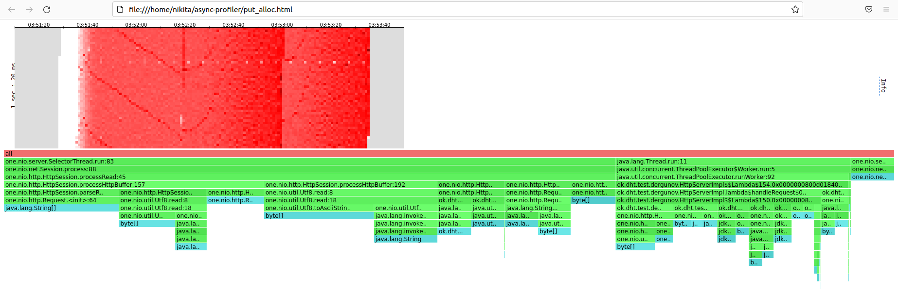

# Отчет Stage 2 #

## Нагрузочное тестирование с помощью wrk2 ##

Тестирование производится на `Ubuntu 22.04.1 LTS` ядро `Linux 5.15.0-48-generic`
процессор `Intel(R) Xeon(R) CPU E5-2620 v3 @ 2.40GHz`
кеш L3 `15 Mb` диск nvme

### PUT ###

#### wrk2 ####

`wrk -d 120 -t 64 -c 64 -R 150000 -s ./put.lua -L http://localhost:8084`

Нагрузка 150000 rps ArrayBlockingQueue 120 секунд 64 потока 64 соединения

| COUNT_CORES | SIZE_QUEUE | Avg Latency |
|-------------|------------|-------------|
| 4           | 32         | 30.61s      |
| 4           | 64         | 1.56ms      |
| 4           | 128        | 1.53ms      |
| 4           | 256        | 2.36ms      |
| 6           | 32         | 11.09s      |
| 6           | 64         | 1.60ms      |
| 6           | 128        | 1.84ms      |
| 6           | 256        | 1.79ms      |
| 8           | 32         | 3.35s       |
| 8           | 64         | 1.72ms      |
| 8           | 128        | 2.46ms      |
| 8           | 256        | 1.93ms      |

Нагрузка 150000 rps LinkedBlockingQueue 120 секунд 64 потока 64 соединения

| COUNT_CORES | SIZE_QUEUE | Avg Latency |
|-------------|------------|-------------|
| 4           | 64         | 2.07ms      |
| 4           | 128        | 1.80ms      |
| 4           | 256        | 1.43ms      |
| 6           | 64         | 1.53ms      |
| 6           | 128        | 1.93ms      |
| 6           | 256        | 1.59ms      |
| 8           | 64         | 1.59ms      |
| 8           | 128        | 2.17ms      |
| 8           | 256        | 2.07ms      |

Лучший результат по среднему значению ответа был продемонстрирован 
на LinkedBlockingQueue при задействовании 4 ядер из 6 доступных
при размере очереди 256 (1.43 ms), подобные результаты были получены при 6 ядрах и 
64 потоков (1.53 ms). При ArrayBlockingQueue подобные результаты были  
при 4 ядрах и размере очереди 128 (1.53 ms). 


Вывод wrk при ArrayBlockingQueue 4 ядрах и размере очереди 128

```sh
nikita@nikita-X99:~/wrk2$ wrk -d 120 -t 64 -c 64 -R 150000 -s ./put.lua -L http://localhost:8084
Running 2m test @ http://localhost:8084
  64 threads and 64 connections
  Thread calibration: mean lat.: 15.310ms, rate sampling interval: 103ms
  Thread calibration: mean lat.: 22.773ms, rate sampling interval: 211ms
  Thread calibration: mean lat.: 21.733ms, rate sampling interval: 217ms
  Thread calibration: mean lat.: 23.197ms, rate sampling interval: 230ms
  Thread calibration: mean lat.: 28.879ms, rate sampling interval: 287ms
  Thread calibration: mean lat.: 23.454ms, rate sampling interval: 228ms
  Thread calibration: mean lat.: 29.706ms, rate sampling interval: 268ms
  Thread calibration: mean lat.: 21.528ms, rate sampling interval: 219ms
  Thread calibration: mean lat.: 22.820ms, rate sampling interval: 224ms
  Thread calibration: mean lat.: 21.661ms, rate sampling interval: 207ms
  Thread calibration: mean lat.: 25.361ms, rate sampling interval: 266ms
  Thread calibration: mean lat.: 22.082ms, rate sampling interval: 216ms
  Thread calibration: mean lat.: 22.826ms, rate sampling interval: 222ms
  Thread calibration: mean lat.: 24.078ms, rate sampling interval: 243ms
  Thread calibration: mean lat.: 21.563ms, rate sampling interval: 211ms
  Thread calibration: mean lat.: 23.923ms, rate sampling interval: 254ms
  Thread calibration: mean lat.: 21.302ms, rate sampling interval: 211ms
  Thread calibration: mean lat.: 23.134ms, rate sampling interval: 233ms
  Thread calibration: mean lat.: 22.222ms, rate sampling interval: 210ms
  Thread calibration: mean lat.: 30.665ms, rate sampling interval: 282ms
  Thread calibration: mean lat.: 15.665ms, rate sampling interval: 130ms
  Thread calibration: mean lat.: 21.604ms, rate sampling interval: 227ms
  Thread calibration: mean lat.: 22.856ms, rate sampling interval: 229ms
  Thread calibration: mean lat.: 23.557ms, rate sampling interval: 234ms
  Thread calibration: mean lat.: 21.414ms, rate sampling interval: 208ms
  Thread calibration: mean lat.: 21.852ms, rate sampling interval: 225ms
  Thread calibration: mean lat.: 22.107ms, rate sampling interval: 223ms
  Thread calibration: mean lat.: 21.339ms, rate sampling interval: 210ms
  Thread calibration: mean lat.: 23.849ms, rate sampling interval: 236ms
  Thread calibration: mean lat.: 27.062ms, rate sampling interval: 262ms
  Thread calibration: mean lat.: 21.672ms, rate sampling interval: 202ms
  Thread calibration: mean lat.: 23.859ms, rate sampling interval: 224ms
  Thread calibration: mean lat.: 23.666ms, rate sampling interval: 250ms
  Thread calibration: mean lat.: 22.497ms, rate sampling interval: 233ms
  Thread calibration: mean lat.: 22.535ms, rate sampling interval: 224ms
  Thread calibration: mean lat.: 30.009ms, rate sampling interval: 276ms
  Thread calibration: mean lat.: 24.269ms, rate sampling interval: 238ms
  Thread calibration: mean lat.: 19.586ms, rate sampling interval: 191ms
  Thread calibration: mean lat.: 30.511ms, rate sampling interval: 289ms
  Thread calibration: mean lat.: 22.714ms, rate sampling interval: 216ms
  Thread calibration: mean lat.: 24.486ms, rate sampling interval: 258ms
  Thread calibration: mean lat.: 24.163ms, rate sampling interval: 242ms
  Thread calibration: mean lat.: 30.237ms, rate sampling interval: 288ms
  Thread calibration: mean lat.: 19.417ms, rate sampling interval: 189ms
  Thread calibration: mean lat.: 22.535ms, rate sampling interval: 227ms
  Thread calibration: mean lat.: 28.827ms, rate sampling interval: 259ms
  Thread calibration: mean lat.: 21.874ms, rate sampling interval: 223ms
  Thread calibration: mean lat.: 21.922ms, rate sampling interval: 216ms
  Thread calibration: mean lat.: 24.849ms, rate sampling interval: 244ms
  Thread calibration: mean lat.: 20.334ms, rate sampling interval: 190ms
  Thread calibration: mean lat.: 20.986ms, rate sampling interval: 188ms
  Thread calibration: mean lat.: 18.292ms, rate sampling interval: 167ms
  Thread calibration: mean lat.: 28.226ms, rate sampling interval: 274ms
  Thread calibration: mean lat.: 22.768ms, rate sampling interval: 214ms
  Thread calibration: mean lat.: 20.723ms, rate sampling interval: 199ms
  Thread calibration: mean lat.: 26.142ms, rate sampling interval: 254ms
  Thread calibration: mean lat.: 23.388ms, rate sampling interval: 242ms
  Thread calibration: mean lat.: 27.827ms, rate sampling interval: 260ms
  Thread calibration: mean lat.: 25.572ms, rate sampling interval: 244ms
  Thread calibration: mean lat.: 24.205ms, rate sampling interval: 248ms
  Thread calibration: mean lat.: 24.737ms, rate sampling interval: 262ms
  Thread calibration: mean lat.: 30.067ms, rate sampling interval: 283ms
  Thread calibration: mean lat.: 19.601ms, rate sampling interval: 195ms
  Thread calibration: mean lat.: 27.019ms, rate sampling interval: 252ms
  Thread Stats   Avg      Stdev     Max   +/- Stdev
    Latency     1.53ms    6.12ms 239.62ms   99.33%
    Req/Sec     2.35k    49.25     4.31k    98.93%
  Latency Distribution (HdrHistogram - Recorded Latency)
 50.000%    1.09ms
 75.000%    1.51ms
 90.000%    1.86ms
 99.000%    3.99ms
 99.900%  107.52ms
 99.990%  187.26ms
 99.999%  233.85ms
100.000%  239.74ms

  Detailed Percentile spectrum:
       Value   Percentile   TotalCount 1/(1-Percentile)

       0.038     0.000000            3         1.00
       0.395     0.100000      1652404         1.11
       0.615     0.200000      3304260         1.25
       0.817     0.300000      4955626         1.43
       0.965     0.400000      6607982         1.67
       1.085     0.500000      8256232         2.00
       1.144     0.550000      9076453         2.22
       1.218     0.600000      9907546         2.50
       1.309     0.650000     10727257         2.86
       1.411     0.700000     11553811         3.33
       1.515     0.750000     12378882         4.00
       1.570     0.775000     12787114         4.44
       1.629     0.800000     13202473         5.00
       1.687     0.825000     13612128         5.71
       1.744     0.850000     14025253         6.67
       1.800     0.875000     14438303         8.00
       1.828     0.887500     14642204         8.89
       1.858     0.900000     14850451        10.00
       1.891     0.912500     15057079        11.43
       1.931     0.925000     15265431        13.33
       1.984     0.937500     15469536        16.00
       2.020     0.943750     15570534        17.78
       2.071     0.950000     15676632        20.00
       2.139     0.956250     15777347        22.86
       2.241     0.962500     15880687        26.67
       2.383     0.968750     15982927        32.00
       2.473     0.971875     16034272        35.56
       2.579     0.975000     16085776        40.00
       2.707     0.978125     16137868        45.71
       2.867     0.981250     16188911        53.33
       3.093     0.984375     16240523        64.00
       3.249     0.985938     16266162        71.11
       3.457     0.987500     16292136        80.00
       3.745     0.989062     16317743        91.43
       4.215     0.990625     16343659       106.67
       5.243     0.992188     16369312       128.00
       6.655     0.992969     16382175       142.22
       9.839     0.993750     16395075       160.00
      17.327     0.994531     16407955       182.86
      28.831     0.995313     16420857       213.33
      40.415     0.996094     16433744       256.00
      47.231     0.996484     16440171       284.44
      55.839     0.996875     16446615       320.00
      62.815     0.997266     16453073       365.71
      70.399     0.997656     16459502       426.67
      78.335     0.998047     16465982       512.00
      83.391     0.998242     16469174       568.89
      90.047     0.998437     16472401       640.00
      96.703     0.998633     16475614       731.43
     101.823     0.998828     16478846       853.33
     108.479     0.999023     16482061      1024.00
     112.319     0.999121     16483667      1137.78
     117.311     0.999219     16485283      1280.00
     122.879     0.999316     16486889      1462.86
     127.743     0.999414     16488521      1706.67
     134.399     0.999512     16490114      2048.00
     137.343     0.999561     16490924      2275.56
     140.543     0.999609     16491728      2560.00
     147.071     0.999658     16492531      2925.71
     156.159     0.999707     16493341      3413.33
     163.839     0.999756     16494141      4096.00
     167.679     0.999780     16494549      4551.11
     172.287     0.999805     16494955      5120.00
     176.639     0.999829     16495349      5851.43
     180.095     0.999854     16495759      6826.67
     182.911     0.999878     16496161      8192.00
     184.959     0.999890     16496361      9102.22
     187.903     0.999902     16496557     10240.00
     190.975     0.999915     16496763     11702.86
     195.711     0.999927     16496963     13653.33
     199.167     0.999939     16497162     16384.00
     200.447     0.999945     16497262     18204.44
     201.599     0.999951     16497368     20480.00
     203.263     0.999957     16497464     23405.71
     205.055     0.999963     16497563     27306.67
     207.743     0.999969     16497664     32768.00
     210.559     0.999973     16497714     36408.89
     216.191     0.999976     16497765     40960.00
     223.871     0.999979     16497816     46811.43
     226.687     0.999982     16497878     54613.33
     231.551     0.999985     16497917     65536.00
     232.575     0.999986     16497941     72817.78
     233.215     0.999988     16497972     81920.00
     233.599     0.999989     16497992     93622.86
     233.983     0.999991     16498016    109226.67
     234.495     0.999992     16498047    131072.00
     234.751     0.999993     16498058    145635.56
     235.007     0.999994     16498069    163840.00
     235.391     0.999995     16498079    187245.71
     236.287     0.999995     16498092    218453.33
     237.183     0.999996     16498106    262144.00
     237.439     0.999997     16498124    291271.11
     237.439     0.999997     16498124    327680.00
     237.439     0.999997     16498124    374491.43
     237.567     0.999998     16498134    436906.67
     237.823     0.999998     16498138    524288.00
     238.079     0.999998     16498141    582542.22
     238.207     0.999998     16498143    655360.00
     238.335     0.999999     16498146    748982.86
     238.463     0.999999     16498149    873813.33
     238.719     0.999999     16498157   1048576.00
     238.719     0.999999     16498157   1165084.44
     238.719     0.999999     16498157   1310720.00
     238.719     0.999999     16498157   1497965.71
     238.847     0.999999     16498162   1747626.67
     238.847     1.000000     16498162   2097152.00
     238.847     1.000000     16498162   2330168.89
     238.847     1.000000     16498162   2621440.00
     238.847     1.000000     16498162   2995931.43
     238.975     1.000000     16498163   3495253.33
     239.103     1.000000     16498164   4194304.00
     239.103     1.000000     16498164   4660337.78
     239.103     1.000000     16498164   5242880.00
     239.359     1.000000     16498165   5991862.86
     239.359     1.000000     16498165   6990506.67
     239.487     1.000000     16498166   8388608.00
     239.487     1.000000     16498166   9320675.55
     239.487     1.000000     16498166  10485760.00
     239.487     1.000000     16498166  11983725.71
     239.487     1.000000     16498166  13981013.34
     239.743     1.000000     16498167  16777216.00
     239.743     1.000000     16498167          inf
#[Mean    =        1.534, StdDeviation   =        6.120]
#[Max     =      239.616, Total count    =     16498167]
#[Buckets =           27, SubBuckets     =         2048]
----------------------------------------------------------
  17998686 requests in 2.00m, 1.12GB read
Requests/sec: 150005.81
Transfer/sec:      9.58MB

```

Вывод wrk при LinkedBlockingQueue 4 ядрах и размере очереди 256

```sh
nikita@nikita-X99:~/wrk2$ wrk -d 120 -t 64 -c 64 -R 150000 -s ./put.lua -L http://localhost:8084
Running 2m test @ http://localhost:8084
  64 threads and 64 connections
  Thread calibration: mean lat.: 26.801ms, rate sampling interval: 279ms
  Thread calibration: mean lat.: 26.829ms, rate sampling interval: 273ms
  Thread calibration: mean lat.: 24.777ms, rate sampling interval: 252ms
  Thread calibration: mean lat.: 26.653ms, rate sampling interval: 277ms
  Thread calibration: mean lat.: 27.678ms, rate sampling interval: 285ms
  Thread calibration: mean lat.: 34.084ms, rate sampling interval: 345ms
  Thread calibration: mean lat.: 26.786ms, rate sampling interval: 272ms
  Thread calibration: mean lat.: 34.770ms, rate sampling interval: 350ms
  Thread calibration: mean lat.: 26.040ms, rate sampling interval: 273ms
  Thread calibration: mean lat.: 26.994ms, rate sampling interval: 267ms
  Thread calibration: mean lat.: 29.443ms, rate sampling interval: 284ms
  Thread calibration: mean lat.: 32.393ms, rate sampling interval: 337ms
  Thread calibration: mean lat.: 25.851ms, rate sampling interval: 268ms
  Thread calibration: mean lat.: 26.702ms, rate sampling interval: 281ms
  Thread calibration: mean lat.: 30.663ms, rate sampling interval: 321ms
  Thread calibration: mean lat.: 29.938ms, rate sampling interval: 310ms
  Thread calibration: mean lat.: 32.260ms, rate sampling interval: 330ms
  Thread calibration: mean lat.: 26.714ms, rate sampling interval: 275ms
  Thread calibration: mean lat.: 27.391ms, rate sampling interval: 287ms
  Thread calibration: mean lat.: 26.976ms, rate sampling interval: 269ms
  Thread calibration: mean lat.: 32.515ms, rate sampling interval: 346ms
  Thread calibration: mean lat.: 29.656ms, rate sampling interval: 311ms
  Thread calibration: mean lat.: 27.482ms, rate sampling interval: 270ms
  Thread calibration: mean lat.: 27.098ms, rate sampling interval: 263ms
  Thread calibration: mean lat.: 23.978ms, rate sampling interval: 243ms
  Thread calibration: mean lat.: 33.123ms, rate sampling interval: 340ms
  Thread calibration: mean lat.: 26.498ms, rate sampling interval: 271ms
  Thread calibration: mean lat.: 34.212ms, rate sampling interval: 366ms
  Thread calibration: mean lat.: 28.517ms, rate sampling interval: 290ms
  Thread calibration: mean lat.: 27.208ms, rate sampling interval: 284ms
  Thread calibration: mean lat.: 28.544ms, rate sampling interval: 272ms
  Thread calibration: mean lat.: 27.633ms, rate sampling interval: 297ms
  Thread calibration: mean lat.: 31.198ms, rate sampling interval: 335ms
  Thread calibration: mean lat.: 29.310ms, rate sampling interval: 314ms
  Thread calibration: mean lat.: 27.949ms, rate sampling interval: 292ms
  Thread calibration: mean lat.: 27.545ms, rate sampling interval: 264ms
  Thread calibration: mean lat.: 27.262ms, rate sampling interval: 283ms
  Thread calibration: mean lat.: 26.855ms, rate sampling interval: 294ms
  Thread calibration: mean lat.: 28.052ms, rate sampling interval: 298ms
  Thread calibration: mean lat.: 26.611ms, rate sampling interval: 271ms
  Thread calibration: mean lat.: 24.684ms, rate sampling interval: 252ms
  Thread calibration: mean lat.: 25.924ms, rate sampling interval: 269ms
  Thread calibration: mean lat.: 30.385ms, rate sampling interval: 307ms
  Thread calibration: mean lat.: 31.784ms, rate sampling interval: 320ms
  Thread calibration: mean lat.: 25.927ms, rate sampling interval: 262ms
  Thread calibration: mean lat.: 25.144ms, rate sampling interval: 256ms
  Thread calibration: mean lat.: 25.539ms, rate sampling interval: 260ms
  Thread calibration: mean lat.: 25.817ms, rate sampling interval: 264ms
  Thread calibration: mean lat.: 32.039ms, rate sampling interval: 336ms
  Thread calibration: mean lat.: 25.500ms, rate sampling interval: 259ms
  Thread calibration: mean lat.: 30.903ms, rate sampling interval: 317ms
  Thread calibration: mean lat.: 32.766ms, rate sampling interval: 329ms
  Thread calibration: mean lat.: 31.856ms, rate sampling interval: 320ms
  Thread calibration: mean lat.: 29.869ms, rate sampling interval: 321ms
  Thread calibration: mean lat.: 30.877ms, rate sampling interval: 300ms
  Thread calibration: mean lat.: 29.824ms, rate sampling interval: 311ms
  Thread calibration: mean lat.: 23.078ms, rate sampling interval: 238ms
  Thread calibration: mean lat.: 35.053ms, rate sampling interval: 331ms
  Thread calibration: mean lat.: 26.083ms, rate sampling interval: 250ms
  Thread calibration: mean lat.: 27.421ms, rate sampling interval: 283ms
  Thread calibration: mean lat.: 29.614ms, rate sampling interval: 312ms
  Thread calibration: mean lat.: 31.260ms, rate sampling interval: 321ms
  Thread calibration: mean lat.: 32.316ms, rate sampling interval: 324ms
  Thread calibration: mean lat.: 31.779ms, rate sampling interval: 338ms
  Thread Stats   Avg      Stdev     Max   +/- Stdev
    Latency     1.43ms    4.64ms 146.30ms   99.42%
    Req/Sec     2.35k    43.57     3.33k    99.10%
  Latency Distribution (HdrHistogram - Recorded Latency)
 50.000%    1.09ms
 75.000%    1.53ms
 90.000%    1.87ms
 99.000%    3.43ms
 99.900%   89.21ms
 99.990%  125.95ms
 99.999%  138.62ms
100.000%  146.43ms

  Detailed Percentile spectrum:
       Value   Percentile   TotalCount 1/(1-Percentile)

       0.036     0.000000            1         1.00
       0.403     0.100000      1655120         1.11
       0.625     0.200000      3305276         1.25
       0.826     0.300000      4951974         1.43
       0.973     0.400000      6608723         1.67
       1.094     0.500000      8260658         2.00
       1.155     0.550000      9079388         2.22
       1.231     0.600000      9899900         2.50
       1.324     0.650000     10725567         2.86
       1.425     0.700000     11554370         3.33
       1.528     0.750000     12376168         4.00
       1.584     0.775000     12790106         4.44
       1.642     0.800000     13200348         5.00
       1.700     0.825000     13615838         5.71
       1.756     0.850000     14028853         6.67
       1.811     0.875000     14437288         8.00
       1.840     0.887500     14647520         8.89
       1.870     0.900000     14850580        10.00
       1.905     0.912500     15060381        11.43
       1.946     0.925000     15261131        13.33
       2.004     0.937500     15468558        16.00
       2.044     0.943750     15571945        17.78
       2.097     0.950000     15676836        20.00
       2.165     0.956250     15778686        22.86
       2.257     0.962500     15881007        26.67
       2.377     0.968750     15984137        32.00
       2.449     0.971875     16035552        35.56
       2.533     0.975000     16087049        40.00
       2.629     0.978125     16137706        45.71
       2.749     0.981250     16189593        53.33
       2.905     0.984375     16241189        64.00
       3.007     0.985938     16266767        71.11
       3.133     0.987500     16292439        80.00
       3.301     0.989062     16318188        91.43
       3.533     0.990625     16343881       106.67
       3.919     0.992188     16369594       128.00
       4.279     0.992969     16382482       142.22
       5.071     0.993750     16395339       160.00
       7.535     0.994531     16408226       182.86
      12.431     0.995313     16421125       213.33
      22.687     0.996094     16434010       256.00
      30.031     0.996484     16440451       284.44
      37.695     0.996875     16446913       320.00
      46.879     0.997266     16453369       365.71
      56.447     0.997656     16459792       426.67
      67.007     0.998047     16466250       512.00
      71.743     0.998242     16469475       568.89
      76.351     0.998437     16472686       640.00
      81.023     0.998633     16475902       731.43
      85.247     0.998828     16479146       853.33
      89.791     0.999023     16482365      1024.00
      92.287     0.999121     16483992      1137.78
      94.975     0.999219     16485582      1280.00
      98.751     0.999316     16487176      1462.86
     103.487     0.999414     16488814      1706.67
     107.519     0.999512     16490417      2048.00
     109.375     0.999561     16491205      2275.56
     111.423     0.999609     16492009      2560.00
     113.279     0.999658     16492814      2925.71
     115.135     0.999707     16493631      3413.33
     117.311     0.999756     16494444      4096.00
     118.399     0.999780     16494830      4551.11
     119.999     0.999805     16495237      5120.00
     121.663     0.999829     16495642      5851.43
     123.327     0.999854     16496042      6826.67
     124.735     0.999878     16496444      8192.00
     125.567     0.999890     16496658      9102.22
     126.207     0.999902     16496848     10240.00
     127.359     0.999915     16497048     11702.86
     128.703     0.999927     16497242     13653.33
     129.791     0.999939     16497446     16384.00
     130.367     0.999945     16497545     18204.44
     130.815     0.999951     16497652     20480.00
     131.711     0.999957     16497757     23405.71
     132.351     0.999963     16497848     27306.67
     133.503     0.999969     16497950     32768.00
     134.271     0.999973     16498006     36408.89
     134.911     0.999976     16498057     40960.00
     135.423     0.999979     16498099     46811.43
     136.319     0.999982     16498148     54613.33
     137.087     0.999985     16498207     65536.00
     137.343     0.999986     16498227     72817.78
     137.983     0.999988     16498250     81920.00
     138.495     0.999989     16498276     93622.86
     139.007     0.999991     16498303    109226.67
     139.903     0.999992     16498325    131072.00
     140.543     0.999993     16498342    145635.56
     140.799     0.999994     16498351    163840.00
     141.183     0.999995     16498362    187245.71
     142.207     0.999995     16498376    218453.33
     142.847     0.999996     16498391    262144.00
     142.975     0.999997     16498395    291271.11
     143.231     0.999997     16498400    327680.00
     143.487     0.999997     16498407    374491.43
     143.999     0.999998     16498413    436906.67
     144.383     0.999998     16498420    524288.00
     144.639     0.999998     16498422    582542.22
     144.895     0.999998     16498426    655360.00
     145.151     0.999999     16498431    748982.86
     145.279     0.999999     16498432    873813.33
     145.663     0.999999     16498435   1048576.00
     145.791     0.999999     16498439   1165084.44
     145.791     0.999999     16498439   1310720.00
     145.791     0.999999     16498439   1497965.71
     145.919     0.999999     16498442   1747626.67
     146.047     1.000000     16498447   2097152.00
     146.047     1.000000     16498447   2330168.89
     146.047     1.000000     16498447   2621440.00
     146.047     1.000000     16498447   2995931.43
     146.047     1.000000     16498447   3495253.33
     146.047     1.000000     16498447   4194304.00
     146.047     1.000000     16498447   4660337.78
     146.047     1.000000     16498447   5242880.00
     146.175     1.000000     16498448   5991862.86
     146.175     1.000000     16498448   6990506.67
     146.303     1.000000     16498449   8388608.00
     146.303     1.000000     16498449   9320675.55
     146.303     1.000000     16498449  10485760.00
     146.303     1.000000     16498449  11983725.71
     146.303     1.000000     16498449  13981013.34
     146.431     1.000000     16498450  16777216.00
     146.431     1.000000     16498450          inf
#[Mean    =        1.427, StdDeviation   =        4.644]
#[Max     =      146.304, Total count    =     16498450]
#[Buckets =           27, SubBuckets     =         2048]
----------------------------------------------------------
  17998955 requests in 2.00m, 1.12GB read
Requests/sec: 150004.78
Transfer/sec:      9.58MB
```

#### CPU ####


| ArrayBlockingQueue                                                                                                                                                                                                                                                                                                                                               | LinkedBlockingQueue                                                                                                                                                                                                                                                                                                                                                  |
|------------------------------------------------------------------------------------------------------------------------------------------------------------------------------------------------------------------------------------------------------------------------------------------------------------------------------------------------------------------|----------------------------------------------------------------------------------------------------------------------------------------------------------------------------------------------------------------------------------------------------------------------------------------------------------------------------------------------------------------------|
|                                                                                                                                                                                                                                                                                                                                     |                                                                                                                                                                                                                                                                                                                                        |
| * Обработка put (метод handleRequest) запроса занимает 62.4 % времени процессора, upsert в базу данных при этом занимает 9.79 % времени, а запись в сокет (one.nio.NativeSocket.write) 48.88 % где и происходит большинство сисколов                                                                                                                             | * Обработка put (метод handleRequest) запроса занимает 62.19 % времени процессора,  upsert в базу данных при этом занимает 9.49 % времени, а запись в сокет (one.nio.NativeSocket.write) 49.13 % где и происходит большинство сисколов                                                                                                                               |
| * one.nio.SelectorThread 18.55 % времени процессора из которых 7.72 % времени на получение сообщения из сокета (recv), а 3 % времени на постановку задачи в очередь в ArrayBlockingQueue, при чем на метод park, блокирующий поток 1.12% метод unpark выполняющий пробуждение потока 0.77 %, а на сам же метод выполняющий постановку в очередь (enqueue) 0.08 % | * one.nio.SelectorThread 18.07 % времени процессора из которых 7.32 % времени на получение сообщения из сокета (recv), а 1.52 % времени на постановку задачи в очередь в LinkedBlockingQueue, при чем на метод park, блокирующий поток 0.57% метод unpark выполняющий пробуждение потока 0.66 %, а на сам же метод выполняющий постановку в очередь (enqueue) 0.13 % |
| * Работа с получением задачи для  ThreadPoolExecutor сводилась к работе с  ArrayBlockingQueue 5.41 %, большая часть из которых на метод метод park (2.63 %) выполняющий блокировку потока, и метод unpark (1.20 %) выполняющий пробуждение потока, а на сам же метод выполняющий постановку в очередь (dequeue) 0.02 %                                           | * Работа с получением задачи для  ThreadPoolExecutor сводилась к работе с  LinkedBlockingQueue 5.79 %, большая часть из которых на метод метод park (2.94 %) выполняющий блокировку потока, и метод unpark (1.16 %) выполняющий пробуждение потока, а на сам же метод выполняющий постановку в очередь (dequeue) 0.15 %                                              |
| * one.nio.net.NativeSelector.epollWait занимает 8.39 % времени, внутри которого вызывается системный вызов epoll_wait который ожидает события epoll который мониторит возможность  чтение записи  предоставленных файловых дескрипторов, метод используется для выбора сессии                                                                                    | * one.nio.net.NativeSelector.epollWait занимает 8.64 % времени, внутри которого вызывается системный вызов epoll_wait который ожидает события epoll который мониторит возможность  чтение записи  предоставленных файловых дескрипторов, метод используется для выбора сессии                                                                                        |
| * Сборщик мусора занимал 1.45 % времени                                                                                                                                                                                                                                                                                                                          | * Сборщик мусора занимал 1.4 % времени                                                                                                                                                                                                                                                                                                                               |


#### ALLOC ####


| ArrayBlockingQueue                                                                                                                                                                                                                                                                                                                                                                                                                                | LinkedBlockingQueue                                                                                                                                                                                                                                                                                                                                                                                                                              |
|---------------------------------------------------------------------------------------------------------------------------------------------------------------------------------------------------------------------------------------------------------------------------------------------------------------------------------------------------------------------------------------------------------------------------------------------------|--------------------------------------------------------------------------------------------------------------------------------------------------------------------------------------------------------------------------------------------------------------------------------------------------------------------------------------------------------------------------------------------------------------------------------------------------|
|                                                                                                                                                                                                                                                                                                                                                                                                                    |                                                                                                                                                                                                                                                                                                                                                                                                                  |
| * 70.68 % алолокаций идет на чтение запроса (one.nio.http.HttpSession.processRead), где происходит распарсинг запроса из wrk                                                                                                                                                                                                                                                                                                                      | * 68.72 % алолокаций идет на чтение запроса (one.nio.http.HttpSession.processRead), где происходит распарсинг запроса из wrk                                                                                                                                                                                                                                                                                                                     |
| * Получение пути запроса (getPath) 3.14 %                                                                                                                                                                                                                                                                                                                                                                                                         | * Получение пути запроса (getPath) 3.1 %                                                                                                                                                                                                                                                                                                                                                                                                         |
| * Обработка запроса (handlePut) занимает 22.99 % аллокаций, ина запись ответа (writeResponse)  6.44 %, создание Response 4.94 %, превращение параметра (ключ) из запроса в MemorySegment 3.61 %, получение параметра (ключ) из запроса 2.75 %, превращения тела (значение) запроса в MemorySegment 2.03 %, в самом upsert в базу данных только 0.73 %, так происходит из-за того что объекты которые там нужно положить в базу данных уже созданы | * Обработка запроса (handlePut) занимает 23.03 % аллокаций, на запись ответа (writeResponse)  6.45 %, создание Response 4.97 %, превращение параметра (ключ) из запроса в MemorySegment 3.55 %, получение параметра (ключ) из запроса 2.77 %, превращения тела (значение) запроса в MemorySegment 2.03 %, в самом upsert в базу данных только 0.75 %, так происходит из-за того что объекты которые там нужно положить в базу данных уже созданы |
| * При работе с SelectorThread 2.96 % аллокаций                                                                                                                                                                                                                                                                                                                                                                                                    | * При работе с SelectorThread 4.87 % аллокаций                                                                                                                                                                                                                                                                                                                                                                                                   |
 


#### LOCK ####


| ArrayBlockingQueue                                                   | LinkedBlockingQueue                                                       |
|----------------------------------------------------------------------|---------------------------------------------------------------------------|
|                                        |                                            |
| * 37.3 % локов идет на помещение задач в ArrayBlockingQueue (offer)  | * 39.18 % локов нв работу с сессиями (one.nio.http.Session)               |
| * 34.03 % локов на работу с сессиями (one.nio.http.Session)          | * 31.03 % локов идет на получение задачи из LinkedBlockingQueue (take)    |
| * 26.5 % локов идет на получение задачи из ArrayBlockingQueue (take) | * 25.61 % локов идет на помещение задач в LinkedBlockingQueue (offer)     |


### GET ###

#### wrk2 ####

`wrk -d 120 -t 64 -c 64 -R 150000 -s ./get.lua -L http://localhost:8084`

Нагрузка 150000 rps ArrayBlockingQueue 120 секунд 64 потока 64 соединения

| COUNT_CORES | SIZE_QUEUE | Avg Latency |
|-------------|------------|-------------|
| 4           | 32         | 38.63s      |
| 4           | 64         | 1.18ms      |
| 4           | 128        | 1.17ms      |
| 4           | 256        | 1.19ms      |
| 6           | 32         | 31.05s      |
| 6           | 64         | 1.50ms      |
| 6           | 128        | 1.24ms      |
| 6           | 256        | 1.27ms      |
| 8           | 32         | 14.96s      |
| 8           | 64         | 3.92ms      |
| 8           | 128        | 1.53ms      |
| 8           | 256        | 1.33ms      |

Нагрузка 150000 rps LinkedBlockingQueue 120 секунд 64 потока 64 соединения

| COUNT_CORES | SIZE_QUEUE | Avg Latency |
|-------------|------------|-------------|
| 4           | 64         | 1.18ms      |
| 4           | 128        | 1.17ms      |
| 4           | 256        | 1.16ms      |
| 6           | 64         | 1.23ms      |
| 6           | 128        | 4.54ms      |
| 6           | 256        | 1.31ms      |
| 8           | 64         | 1.28ms      |
| 8           | 128        | 9.97ms      |
| 8           | 256        | 1.31ms      |


Лучший результат по среднему значению ответа был продемонстрирован
на LinkedBlockingQueue при задействовании 4 ядер из 6 доступных
при размере очереди 256 (1.16 ms), подобные результаты были получены при 
ArrayBlockingQueue при 4 ядрах и размере очереди 128 (1.17 ms).


Вывод wrk при ArrayBlockingQueue 4 ядрах и размере очереди 128

```sh
nikita@nikita-X99:~/wrk2$ wrk -d 120 -t 64 -c 64 -R 150000 -s ./get.lua -L http://localhost:8084
Running 2m test @ http://localhost:8084
  64 threads and 64 connections
  Thread calibration: mean lat.: 60.125ms, rate sampling interval: 471ms
  Thread calibration: mean lat.: 47.131ms, rate sampling interval: 425ms
  Thread calibration: mean lat.: 47.748ms, rate sampling interval: 412ms
  Thread calibration: mean lat.: 50.472ms, rate sampling interval: 434ms
  Thread calibration: mean lat.: 42.575ms, rate sampling interval: 392ms
  Thread calibration: mean lat.: 51.392ms, rate sampling interval: 469ms
  Thread calibration: mean lat.: 49.782ms, rate sampling interval: 419ms
  Thread calibration: mean lat.: 54.194ms, rate sampling interval: 409ms
  Thread calibration: mean lat.: 48.666ms, rate sampling interval: 398ms
  Thread calibration: mean lat.: 51.485ms, rate sampling interval: 444ms
  Thread calibration: mean lat.: 76.957ms, rate sampling interval: 488ms
  Thread calibration: mean lat.: 53.736ms, rate sampling interval: 461ms
  Thread calibration: mean lat.: 48.529ms, rate sampling interval: 439ms
  Thread calibration: mean lat.: 57.084ms, rate sampling interval: 425ms
  Thread calibration: mean lat.: 65.832ms, rate sampling interval: 499ms
  Thread calibration: mean lat.: 38.401ms, rate sampling interval: 387ms
  Thread calibration: mean lat.: 60.561ms, rate sampling interval: 470ms
  Thread calibration: mean lat.: 48.615ms, rate sampling interval: 425ms
  Thread calibration: mean lat.: 46.271ms, rate sampling interval: 384ms
  Thread calibration: mean lat.: 45.528ms, rate sampling interval: 427ms
  Thread calibration: mean lat.: 43.219ms, rate sampling interval: 408ms
  Thread calibration: mean lat.: 55.103ms, rate sampling interval: 433ms
  Thread calibration: mean lat.: 52.756ms, rate sampling interval: 428ms
  Thread calibration: mean lat.: 62.583ms, rate sampling interval: 425ms
  Thread calibration: mean lat.: 41.471ms, rate sampling interval: 427ms
  Thread calibration: mean lat.: 59.886ms, rate sampling interval: 463ms
  Thread calibration: mean lat.: 62.542ms, rate sampling interval: 441ms
  Thread calibration: mean lat.: 57.826ms, rate sampling interval: 452ms
  Thread calibration: mean lat.: 54.222ms, rate sampling interval: 477ms
  Thread calibration: mean lat.: 54.600ms, rate sampling interval: 456ms
  Thread calibration: mean lat.: 50.471ms, rate sampling interval: 417ms
  Thread calibration: mean lat.: 92.864ms, rate sampling interval: 518ms
  Thread calibration: mean lat.: 58.734ms, rate sampling interval: 497ms
  Thread calibration: mean lat.: 59.772ms, rate sampling interval: 435ms
  Thread calibration: mean lat.: 66.480ms, rate sampling interval: 494ms
  Thread calibration: mean lat.: 72.439ms, rate sampling interval: 483ms
  Thread calibration: mean lat.: 56.399ms, rate sampling interval: 453ms
  Thread calibration: mean lat.: 67.946ms, rate sampling interval: 445ms
  Thread calibration: mean lat.: 62.747ms, rate sampling interval: 465ms
  Thread calibration: mean lat.: 61.114ms, rate sampling interval: 479ms
  Thread calibration: mean lat.: 51.228ms, rate sampling interval: 431ms
  Thread calibration: mean lat.: 57.373ms, rate sampling interval: 440ms
  Thread calibration: mean lat.: 59.145ms, rate sampling interval: 477ms
  Thread calibration: mean lat.: 80.369ms, rate sampling interval: 516ms
  Thread calibration: mean lat.: 51.578ms, rate sampling interval: 396ms
  Thread calibration: mean lat.: 64.748ms, rate sampling interval: 482ms
  Thread calibration: mean lat.: 53.176ms, rate sampling interval: 447ms
  Thread calibration: mean lat.: 49.731ms, rate sampling interval: 435ms
  Thread calibration: mean lat.: 60.472ms, rate sampling interval: 461ms
  Thread calibration: mean lat.: 82.209ms, rate sampling interval: 504ms
  Thread calibration: mean lat.: 77.856ms, rate sampling interval: 475ms
  Thread calibration: mean lat.: 48.773ms, rate sampling interval: 432ms
  Thread calibration: mean lat.: 66.812ms, rate sampling interval: 477ms
  Thread calibration: mean lat.: 79.675ms, rate sampling interval: 539ms
  Thread calibration: mean lat.: 84.861ms, rate sampling interval: 498ms
  Thread calibration: mean lat.: 59.619ms, rate sampling interval: 453ms
  Thread calibration: mean lat.: 73.583ms, rate sampling interval: 511ms
  Thread calibration: mean lat.: 55.474ms, rate sampling interval: 462ms
  Thread calibration: mean lat.: 72.967ms, rate sampling interval: 491ms
  Thread calibration: mean lat.: 83.916ms, rate sampling interval: 471ms
  Thread calibration: mean lat.: 75.793ms, rate sampling interval: 500ms
  Thread calibration: mean lat.: 69.415ms, rate sampling interval: 494ms
  Thread calibration: mean lat.: 40.355ms, rate sampling interval: 408ms
  Thread calibration: mean lat.: 69.030ms, rate sampling interval: 480ms
  Thread Stats   Avg      Stdev     Max   +/- Stdev
    Latency     1.17ms  634.17us  17.58ms   71.69%
    Req/Sec     2.35k     5.05     2.40k    77.34%
  Latency Distribution (HdrHistogram - Recorded Latency)
 50.000%    1.10ms
 75.000%    1.53ms
 90.000%    1.88ms
 99.000%    3.04ms
 99.900%    5.81ms
 99.990%    9.65ms
 99.999%   13.38ms
100.000%   17.60ms

  Detailed Percentile spectrum:
       Value   Percentile   TotalCount 1/(1-Percentile)

       0.038     0.000000            1         1.00
       0.423     0.100000      1653799         1.11
       0.638     0.200000      3302880         1.25
       0.833     0.300000      4955495         1.43
       0.981     0.400000      6602155         1.67
       1.104     0.500000      8249711         2.00
       1.167     0.550000      9075137         2.22
       1.241     0.600000      9899217         2.50
       1.329     0.650000     10725327         2.86
       1.429     0.700000     11555646         3.33
       1.533     0.750000     12379897         4.00
       1.588     0.775000     12791113         4.44
       1.646     0.800000     13201365         5.00
       1.706     0.825000     13617070         5.71
       1.764     0.850000     14025683         6.67
       1.822     0.875000     14437964         8.00
       1.852     0.887500     14647380         8.89
       1.883     0.900000     14852900        10.00
       1.917     0.912500     15056647        11.43
       1.958     0.925000     15265082        13.33
       2.009     0.937500     15467551        16.00
       2.042     0.943750     15571194        17.78
       2.083     0.950000     15676961        20.00
       2.133     0.956250     15779369        22.86
       2.197     0.962500     15880484        26.67
       2.285     0.968750     15983594        32.00
       2.341     0.971875     16035039        35.56
       2.407     0.975000     16086340        40.00
       2.487     0.978125     16137989        45.71
       2.583     0.981250     16189149        53.33
       2.705     0.984375     16240748        64.00
       2.779     0.985938     16266892        71.11
       2.865     0.987500     16292656        80.00
       2.965     0.989062     16317988        91.43
       3.093     0.990625     16344039       106.67
       3.257     0.992188     16369499       128.00
       3.361     0.992969     16382586       142.22
       3.481     0.993750     16395344       160.00
       3.625     0.994531     16408289       182.86
       3.797     0.995313     16421173       213.33
       4.003     0.996094     16434022       256.00
       4.127     0.996484     16440417       284.44
       4.267     0.996875     16446987       320.00
       4.419     0.997266     16453326       365.71
       4.607     0.997656     16459754       426.67
       4.839     0.998047     16466246       512.00
       4.979     0.998242     16469423       568.89
       5.139     0.998437     16472632       640.00
       5.323     0.998633     16475835       731.43
       5.555     0.998828     16479084       853.33
       5.843     0.999023     16482273      1024.00
       6.023     0.999121     16483885      1137.78
       6.227     0.999219     16485515      1280.00
       6.467     0.999316     16487111      1462.86
       6.759     0.999414     16488731      1706.67
       7.055     0.999512     16490346      2048.00
       7.231     0.999561     16491133      2275.56
       7.419     0.999609     16491942      2560.00
       7.643     0.999658     16492760      2925.71
       7.875     0.999707     16493554      3413.33
       8.155     0.999756     16494360      4096.00
       8.319     0.999780     16494770      4551.11
       8.519     0.999805     16495176      5120.00
       8.727     0.999829     16495578      5851.43
       8.975     0.999854     16495968      6826.67
       9.303     0.999878     16496375      8192.00
       9.487     0.999890     16496575      9102.22
       9.679     0.999902     16496778     10240.00
       9.887     0.999915     16496980     11702.86
      10.111     0.999927     16497177     13653.33
      10.423     0.999939     16497377     16384.00
      10.655     0.999945     16497484     18204.44
      10.879     0.999951     16497578     20480.00
      11.103     0.999957     16497679     23405.71
      11.351     0.999963     16497781     27306.67
      11.687     0.999969     16497884     32768.00
      11.855     0.999973     16497930     36408.89
      12.103     0.999976     16497982     40960.00
      12.335     0.999979     16498032     46811.43
      12.583     0.999982     16498083     54613.33
      12.847     0.999985     16498132     65536.00
      12.975     0.999986     16498157     72817.78
      13.103     0.999988     16498182     81920.00
      13.295     0.999989     16498209     93622.86
      13.463     0.999991     16498232    109226.67
      13.671     0.999992     16498259    131072.00
      13.807     0.999993     16498270    145635.56
      13.959     0.999994     16498284    163840.00
      14.015     0.999995     16498296    187245.71
      14.167     0.999995     16498309    218453.33
      14.287     0.999996     16498322    262144.00
      14.311     0.999997     16498327    291271.11
      14.367     0.999997     16498333    327680.00
      14.423     0.999997     16498339    374491.43
      14.535     0.999998     16498347    436906.67
      14.711     0.999998     16498352    524288.00
      14.815     0.999998     16498355    582542.22
      14.855     0.999998     16498358    655360.00
      14.959     0.999999     16498361    748982.86
      15.055     0.999999     16498365    873813.33
      15.079     0.999999     16498368   1048576.00
      15.087     0.999999     16498369   1165084.44
      15.127     0.999999     16498371   1310720.00
      15.135     0.999999     16498372   1497965.71
      15.183     0.999999     16498374   1747626.67
      15.343     1.000000     16498376   2097152.00
      15.343     1.000000     16498376   2330168.89
      15.679     1.000000     16498377   2621440.00
      15.983     1.000000     16498378   2995931.43
      16.255     1.000000     16498379   3495253.33
      16.575     1.000000     16498380   4194304.00
      16.575     1.000000     16498380   4660337.78
      16.575     1.000000     16498380   5242880.00
      16.911     1.000000     16498381   5991862.86
      16.911     1.000000     16498381   6990506.67
      17.263     1.000000     16498382   8388608.00
      17.263     1.000000     16498382   9320675.55
      17.263     1.000000     16498382  10485760.00
      17.263     1.000000     16498382  11983725.71
      17.263     1.000000     16498382  13981013.34
      17.599     1.000000     16498383  16777216.00
      17.599     1.000000     16498383          inf
#[Mean    =        1.167, StdDeviation   =        0.634]
#[Max     =       17.584, Total count    =     16498383]
#[Buckets =           27, SubBuckets     =         2048]
----------------------------------------------------------
  17998768 requests in 2.00m, 1.23GB read
Requests/sec: 150006.87
Transfer/sec:     10.52MB
```

Вывод wrk при LinkedBlockingQueue 4 ядрах и размере очереди 256

```sh
nikita@nikita-X99:~/wrk2$ wrk -d 120 -t 64 -c 64 -R 150000 -s ./get.lua -L http://localhost:8084
Running 2m test @ http://localhost:8084
  64 threads and 64 connections
  Thread calibration: mean lat.: 66.681ms, rate sampling interval: 610ms
  Thread calibration: mean lat.: 97.150ms, rate sampling interval: 698ms
  Thread calibration: mean lat.: 103.279ms, rate sampling interval: 707ms
  Thread calibration: mean lat.: 78.985ms, rate sampling interval: 638ms
  Thread calibration: mean lat.: 66.271ms, rate sampling interval: 594ms
  Thread calibration: mean lat.: 87.993ms, rate sampling interval: 715ms
  Thread calibration: mean lat.: 78.975ms, rate sampling interval: 659ms
  Thread calibration: mean lat.: 68.401ms, rate sampling interval: 587ms
  Thread calibration: mean lat.: 73.582ms, rate sampling interval: 594ms
  Thread calibration: mean lat.: 132.527ms, rate sampling interval: 736ms
  Thread calibration: mean lat.: 85.654ms, rate sampling interval: 657ms
  Thread calibration: mean lat.: 60.873ms, rate sampling interval: 582ms
  Thread calibration: mean lat.: 77.818ms, rate sampling interval: 628ms
  Thread calibration: mean lat.: 107.819ms, rate sampling interval: 736ms
  Thread calibration: mean lat.: 113.598ms, rate sampling interval: 734ms
  Thread calibration: mean lat.: 85.418ms, rate sampling interval: 614ms
  Thread calibration: mean lat.: 102.347ms, rate sampling interval: 689ms
  Thread calibration: mean lat.: 89.134ms, rate sampling interval: 666ms
  Thread calibration: mean lat.: 90.312ms, rate sampling interval: 655ms
  Thread calibration: mean lat.: 93.494ms, rate sampling interval: 678ms
  Thread calibration: mean lat.: 107.592ms, rate sampling interval: 722ms
  Thread calibration: mean lat.: 106.967ms, rate sampling interval: 748ms
  Thread calibration: mean lat.: 91.626ms, rate sampling interval: 706ms
  Thread calibration: mean lat.: 91.067ms, rate sampling interval: 736ms
  Thread calibration: mean lat.: 110.467ms, rate sampling interval: 758ms
  Thread calibration: mean lat.: 83.206ms, rate sampling interval: 680ms
  Thread calibration: mean lat.: 76.451ms, rate sampling interval: 633ms
  Thread calibration: mean lat.: 130.211ms, rate sampling interval: 750ms
  Thread calibration: mean lat.: 111.053ms, rate sampling interval: 677ms
  Thread calibration: mean lat.: 124.987ms, rate sampling interval: 735ms
  Thread calibration: mean lat.: 79.138ms, rate sampling interval: 631ms
  Thread calibration: mean lat.: 112.448ms, rate sampling interval: 730ms
  Thread calibration: mean lat.: 100.107ms, rate sampling interval: 657ms
  Thread calibration: mean lat.: 103.102ms, rate sampling interval: 701ms
  Thread calibration: mean lat.: 82.614ms, rate sampling interval: 653ms
  Thread calibration: mean lat.: 112.286ms, rate sampling interval: 765ms
  Thread calibration: mean lat.: 103.548ms, rate sampling interval: 697ms
  Thread calibration: mean lat.: 126.456ms, rate sampling interval: 745ms
  Thread calibration: mean lat.: 130.713ms, rate sampling interval: 736ms
  Thread calibration: mean lat.: 109.456ms, rate sampling interval: 745ms
  Thread calibration: mean lat.: 96.645ms, rate sampling interval: 660ms
  Thread calibration: mean lat.: 91.909ms, rate sampling interval: 737ms
  Thread calibration: mean lat.: 98.696ms, rate sampling interval: 715ms
  Thread calibration: mean lat.: 118.268ms, rate sampling interval: 736ms
  Thread calibration: mean lat.: 100.450ms, rate sampling interval: 669ms
  Thread calibration: mean lat.: 94.895ms, rate sampling interval: 644ms
  Thread calibration: mean lat.: 94.770ms, rate sampling interval: 665ms
  Thread calibration: mean lat.: 89.761ms, rate sampling interval: 658ms
  Thread calibration: mean lat.: 108.328ms, rate sampling interval: 766ms
  Thread calibration: mean lat.: 118.734ms, rate sampling interval: 748ms
  Thread calibration: mean lat.: 70.048ms, rate sampling interval: 608ms
  Thread calibration: mean lat.: 82.495ms, rate sampling interval: 629ms
  Thread calibration: mean lat.: 93.425ms, rate sampling interval: 649ms
  Thread calibration: mean lat.: 100.997ms, rate sampling interval: 639ms
  Thread calibration: mean lat.: 84.553ms, rate sampling interval: 673ms
  Thread calibration: mean lat.: 129.537ms, rate sampling interval: 777ms
  Thread calibration: mean lat.: 99.813ms, rate sampling interval: 670ms
  Thread calibration: mean lat.: 107.561ms, rate sampling interval: 690ms
  Thread calibration: mean lat.: 84.965ms, rate sampling interval: 611ms
  Thread calibration: mean lat.: 97.094ms, rate sampling interval: 685ms
  Thread calibration: mean lat.: 97.243ms, rate sampling interval: 724ms
  Thread calibration: mean lat.: 95.417ms, rate sampling interval: 697ms
  Thread calibration: mean lat.: 98.244ms, rate sampling interval: 679ms
  Thread calibration: mean lat.: 80.780ms, rate sampling interval: 610ms
  Thread Stats   Avg      Stdev     Max   +/- Stdev
    Latency     1.16ms  603.63us  21.06ms   69.24%
    Req/Sec     2.35k     3.27     2.39k    81.22%
  Latency Distribution (HdrHistogram - Recorded Latency)
 50.000%    1.11ms
 75.000%    1.53ms
 90.000%    1.88ms
 99.000%    2.87ms
 99.900%    4.79ms
 99.990%    9.28ms
 99.999%   15.92ms
100.000%   21.07ms

  Detailed Percentile spectrum:
       Value   Percentile   TotalCount 1/(1-Percentile)

       0.034     0.000000            1         1.00
       0.424     0.100000      1656144         1.11
       0.640     0.200000      3301423         1.25
       0.835     0.300000      4951625         1.43
       0.982     0.400000      6599495         1.67
       1.105     0.500000      8257862         2.00
       1.168     0.550000      9080783         2.22
       1.243     0.600000      9907456         2.50
       1.330     0.650000     10722460         2.86
       1.429     0.700000     11554301         3.33
       1.531     0.750000     12378674         4.00
       1.585     0.775000     12787693         4.44
       1.643     0.800000     13200940         5.00
       1.701     0.825000     13608934         5.71
       1.759     0.850000     14022091         6.67
       1.816     0.875000     14434304         8.00
       1.845     0.887500     14641310         8.89
       1.876     0.900000     14852066        10.00
       1.909     0.912500     15056266        11.43
       1.948     0.925000     15262401        13.33
       1.997     0.937500     15467537        16.00
       2.027     0.943750     15567926        17.78
       2.065     0.950000     15672897        20.00
       2.111     0.956250     15775363        22.86
       2.171     0.962500     15879338        26.67
       2.249     0.968750     15980936        32.00
       2.299     0.971875     16032877        35.56
       2.357     0.975000     16083567        40.00
       2.427     0.978125     16135255        45.71
       2.511     0.981250     16186724        53.33
       2.613     0.984375     16237896        64.00
       2.673     0.985938     16263996        71.11
       2.741     0.987500     16289933        80.00
       2.817     0.989062     16315495        91.43
       2.905     0.990625     16341147       106.67
       3.013     0.992188     16366771       128.00
       3.079     0.992969     16379799       142.22
       3.153     0.993750     16392550       160.00
       3.243     0.994531     16405343       182.86
       3.353     0.995313     16418200       213.33
       3.493     0.996094     16431180       256.00
       3.577     0.996484     16437592       284.44
       3.675     0.996875     16444019       320.00
       3.787     0.997266     16450467       365.71
       3.925     0.997656     16456891       426.67
       4.095     0.998047     16463314       512.00
       4.195     0.998242     16466552       568.89
       4.307     0.998437     16469731       640.00
       4.443     0.998633     16473000       731.43
       4.607     0.998828     16476219       853.33
       4.815     0.999023     16479415      1024.00
       4.939     0.999121     16481019      1137.78
       5.079     0.999219     16482627      1280.00
       5.247     0.999316     16484221      1462.86
       5.451     0.999414     16485837      1706.67
       5.711     0.999512     16487446      2048.00
       5.879     0.999561     16488264      2275.56
       6.071     0.999609     16489070      2560.00
       6.283     0.999658     16489862      2925.71
       6.567     0.999707     16490673      3413.33
       6.911     0.999756     16491484      4096.00
       7.143     0.999780     16491880      4551.11
       7.399     0.999805     16492276      5120.00
       7.735     0.999829     16492684      5851.43
       8.059     0.999854     16493086      6826.67
       8.511     0.999878     16493490      8192.00
       8.871     0.999890     16493691      9102.22
       9.375     0.999902     16493887     10240.00
       9.919     0.999915     16494090     11702.86
      10.407     0.999927     16494290     13653.33
      10.943     0.999939     16494492     16384.00
      11.223     0.999945     16494592     18204.44
      11.511     0.999951     16494692     20480.00
      11.831     0.999957     16494796     23405.71
      12.199     0.999963     16494893     27306.67
      12.671     0.999969     16494994     32768.00
      12.911     0.999973     16495046     36408.89
      13.223     0.999976     16495095     40960.00
      13.687     0.999979     16495145     46811.43
      14.055     0.999982     16495195     54613.33
      14.679     0.999985     16495247     65536.00
      14.991     0.999986     16495271     72817.78
      15.391     0.999988     16495296     81920.00
      15.807     0.999989     16495323     93622.86
      16.039     0.999991     16495346    109226.67
      16.479     0.999992     16495372    131072.00
      16.671     0.999993     16495384    145635.56
      17.039     0.999994     16495398    163840.00
      17.327     0.999995     16495410    187245.71
      17.535     0.999995     16495425    218453.33
      17.759     0.999996     16495435    262144.00
      17.935     0.999997     16495441    291271.11
      18.063     0.999997     16495448    327680.00
      18.207     0.999997     16495453    374491.43
      18.383     0.999998     16495460    436906.67
      18.559     0.999998     16495467    524288.00
      18.671     0.999998     16495469    582542.22
      18.735     0.999998     16495474    655360.00
      18.767     0.999999     16495476    748982.86
      18.927     0.999999     16495479    873813.33
      19.071     0.999999     16495482   1048576.00
      19.087     0.999999     16495483   1165084.44
      19.215     0.999999     16495485   1310720.00
      19.423     0.999999     16495486   1497965.71
      19.647     0.999999     16495488   1747626.67
      19.807     1.000000     16495490   2097152.00
      19.807     1.000000     16495490   2330168.89
      19.983     1.000000     16495491   2621440.00
      20.079     1.000000     16495492   2995931.43
      20.255     1.000000     16495493   3495253.33
      20.287     1.000000     16495494   4194304.00
      20.287     1.000000     16495494   4660337.78
      20.287     1.000000     16495494   5242880.00
      20.511     1.000000     16495495   5991862.86
      20.511     1.000000     16495495   6990506.67
      20.815     1.000000     16495496   8388608.00
      20.815     1.000000     16495496   9320675.55
      20.815     1.000000     16495496  10485760.00
      20.815     1.000000     16495496  11983725.71
      20.815     1.000000     16495496  13981013.34
      21.071     1.000000     16495497  16777216.00
      21.071     1.000000     16495497          inf
#[Mean    =        1.159, StdDeviation   =        0.604]
#[Max     =       21.056, Total count    =     16495497]
#[Buckets =           27, SubBuckets     =         2048]
----------------------------------------------------------
  17995988 requests in 2.00m, 1.23GB read
Requests/sec: 150018.93
Transfer/sec:     10.53MB
```


#### CPU ####

| ArrayBlockingQueue                                                                                                                                                                                                                                                                                                                                                  | LinkedBlockingQueue                                                                                                                                                                                                                                                                                                                                                   |
|---------------------------------------------------------------------------------------------------------------------------------------------------------------------------------------------------------------------------------------------------------------------------------------------------------------------------------------------------------------------|-----------------------------------------------------------------------------------------------------------------------------------------------------------------------------------------------------------------------------------------------------------------------------------------------------------------------------------------------------------------------|
|                                                                                                                                                                                                                                                                                                                                        |                                                                                                                                                                                                                                                                                                                                         |
| * Обработка get (метод handleRequest) запроса занимает 67.35 % времени процессора, get в базу данных при этом занимает 16.91 % времени, а запись в сокет (one.nio.NativeSocket.write) 47.06 % где и происходит большинство сисколов                                                                                                                                 | * Обработка put (метод handleRequest) запроса занимает 59.85 % времени процессора, get в базу данных при этом занимает 10 % времени, а запись в сокет (one.nio.NativeSocket.write) 46.68 % где и происходит большинство сисколов                                                                                                                                      |
| * one.nio.SelectorThread 16.84 % времени процессора из которых 7.14 % времени на получение сообщения из сокета (recv), а 1.92 % времени на постановку задачи в очередь в ArrayBlockingQueue, при чем на метод park, блокирующий поток 0.97% метод unpark выполняющий пробуждение потока 0.65 %, а на сам же метод выполняющий постановку в очередь (enqueue) 0.26 % | * one.nio.SelectorThread 16.74 % времени процессора из которых 7.12 % времени на получение сообщения из сокета (recv), а 1.45 % времени на постановку задачи в очередь в LinkedBlockingQueue, при чем на метод park, блокирующий поток 0.52 % метод unpark выполняющий пробуждение потока 0.43 %, а на сам же метод выполняющий постановку в очередь (enqueue) 0.13 % |
| * Работа с получением задачи для ThreadPoolExecutor сводилась к работе с  ArrayBlockingQueue 4.33 %, большая часть из которых на метод метод park (2.57 %) выполняющий блокировку потока, и метод unpark (0.88 %) выполняющий пробуждение потока                                                                                                                    | * Работа с получением задачи для  ThreadPoolExecutor сводилась к работе с  LinkedBlockingQueue 4.40 %, большая часть из которых на метод метод park (2.13 %) выполняющий блокировку потока, и метод unpark (0.82 %) выполняющий пробуждение потока                                                                                                                    |
| * one.nio.net.NativeSelector.epollWait занимает 8.37 % времени, внутри которого вызывается системный вызов epoll_wait который ожидает события epoll который мониторит возможность  чтение записи  предоставленных файловых дескрипторов, метод используется для выбора сессии                                                                                       | * one.nio.net.NativeSelector.epollWait занимает 8.36 % времени, внутри которого вызывается системный вызов epoll_wait который ожидает события epoll который мониторит возможность  чтение записи  предоставленных файловых дескрипторов, метод используется для выбора сессии                                                                                         |
| * Сборщик мусора занимал 0.58 % времени                                                                                                                                                                                                                                                                                                                             | * Сборщик мусора занимал 0.66 % времени                                                                                                                                                                                                                                                                                                                               |


#### ALLOC ####


| ArrayBlockingQueue                                                                                                                                                                                                                                                                                                                            | LinkedBlockingQueue                                                                                                                                                                                                                                                                                                                           |
|-----------------------------------------------------------------------------------------------------------------------------------------------------------------------------------------------------------------------------------------------------------------------------------------------------------------------------------------------|-----------------------------------------------------------------------------------------------------------------------------------------------------------------------------------------------------------------------------------------------------------------------------------------------------------------------------------------------|
|                                                                                                                                                                                                                                                                                                                |                                                                                                                                                                                                                                                                                                               |
| * 69.91 % алолокаций идет на чтение запроса (one.nio.http.HttpSession.processRead), где происходит распарсинг запроса из wrk                                                                                                                                                                                                                  | * 70.81 % алолокаций идет на чтение запроса (one.nio.http.HttpSession.processRead), где происходит распарсинг запроса из wrk                                                                                                                                                                                                                  |
| * Получение пути запроса (getPath) 1.6 %                                                                                                                                                                                                                                                                                                      | * Получение пути запроса (getPath) 1.6 %                                                                                                                                                                                                                                                                                                      |
| * Обработка запроса (handleGet) занимает 25.05 % аллокаций, get в базу данных занимает 15.36 %, на запись ответа (writeResponse) 3.2 %, на создание Response 2.25 %, превращение параметра (ключ) из запроса в MemorySegment 1.66 %, получение параметра (ключ) из запроса 1.23 %, превращения тела (значение) запроса в MemorySegment 0.75 % | * Обработка запроса (handleGet) занимает 25.08 % аллокаций, get в базу данных занимает 14.95 %, на запись ответа (writeResponse) 3.13 %, на создание Response 2.22 %, превращение параметра (ключ) из запроса в MemorySegment 1.63 %, получение параметра (ключ) из запроса 1.26 %, превращения тела (значение) запроса в MemorySegment 1.3 % |
| * При работе с SelectorThread 3.36 % аллокаций                                                                                                                                                                                                                                                                                                | * При работе с SelectorThread 2.42  % аллокаций                                                                                                                                                                                                                                                                                               |

#### LOCK ####


| ArrayBlockingQueue                                                      | LinkedBlockingQueue                                                    |
|-------------------------------------------------------------------------|------------------------------------------------------------------------|
|                                           |                                         |                                       |
| * 39.54  % локов идет на помещение задач в ArrayBlockingQueue (offer)   | * 39.27 % локов нв работу с сессиями (one.nio.http.Session)            |
| * 30.28 % локов на работу с сессиями (one.nio.http.Session)             | * 29.08 % локов идет на помещение задач в LinkedBlockingQueue (offer)  |
| * 27.67 % локов идет на получение задачи из ArrayBlockingQueue (take)   | * 26.28 % локов идет на получение задачи из LinkedBlockingQueue (take) |


### Сравнение с прошлыми результатами ### 

Сравнивая Heatmaps данной и прошлой реализации можно заметить, что в нынешней ресурсы используются
более полно и равномерно (нет белых квадратов), так же можно заметить что мы снизили нагрузку на
SelectorThread из-за чего сервис стал больше времени тратить именно на обработку запроса. Так же удалось
увеличить rate до 150000, работа с методами базы данных осталась на том же уровне,
что и была (в процентах от общего времени, но из-за многопоточности нагрузка увеличилась) 


