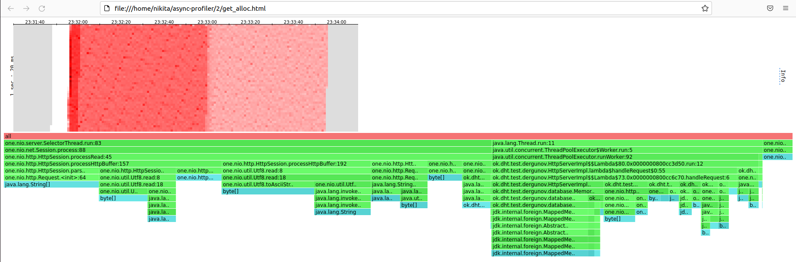

# Отчет Stage 2 #

## Нагрузочное тестирование с помощью wrk2 ##

Тестирование производится на `Ubuntu 22.04.1 LTS` ядро `Linux 5.15.0-48-generic`
процессор `Intel(R) Xeon(R) CPU E5-2620 v3 @ 2.40GHz`
кеш L3 `15 Mb` диск nvme

### PUT ###

#### wrk2 ####

Для 64 соединений удалось достичь rate в 100000

`wrk -d 60 -t 64 -c 64 -R 100000 -s ./put.lua -L http://localhost:8084` - Avg Latency 0.95ms

```sh
nikita@nikita-X99:~/wrk2$ wrk -d 60 -t 64 -c 64 -R 100000 -s ./put.lua -L http://localhost:8084
Running 1m test @ http://localhost:8084
  64 threads and 64 connections
  Thread calibration: mean lat.: 5.429ms, rate sampling interval: 10ms
  Thread calibration: mean lat.: 6.580ms, rate sampling interval: 10ms
  Thread calibration: mean lat.: 6.323ms, rate sampling interval: 10ms
  Thread calibration: mean lat.: 6.205ms, rate sampling interval: 10ms
  Thread calibration: mean lat.: 5.921ms, rate sampling interval: 10ms
  Thread calibration: mean lat.: 4.568ms, rate sampling interval: 10ms
  Thread calibration: mean lat.: 6.557ms, rate sampling interval: 10ms
  Thread calibration: mean lat.: 7.736ms, rate sampling interval: 10ms
  Thread calibration: mean lat.: 6.570ms, rate sampling interval: 10ms
  Thread calibration: mean lat.: 7.031ms, rate sampling interval: 10ms
  Thread calibration: mean lat.: 6.115ms, rate sampling interval: 10ms
  Thread calibration: mean lat.: 5.139ms, rate sampling interval: 10ms
  Thread calibration: mean lat.: 6.018ms, rate sampling interval: 10ms
  Thread calibration: mean lat.: 5.825ms, rate sampling interval: 10ms
  Thread calibration: mean lat.: 5.380ms, rate sampling interval: 10ms
  Thread calibration: mean lat.: 6.673ms, rate sampling interval: 10ms
  Thread calibration: mean lat.: 6.303ms, rate sampling interval: 10ms
  Thread calibration: mean lat.: 6.428ms, rate sampling interval: 10ms
  Thread calibration: mean lat.: 4.528ms, rate sampling interval: 10ms
  Thread calibration: mean lat.: 6.200ms, rate sampling interval: 10ms
  Thread calibration: mean lat.: 6.491ms, rate sampling interval: 10ms
  Thread calibration: mean lat.: 8.028ms, rate sampling interval: 10ms
  Thread calibration: mean lat.: 5.671ms, rate sampling interval: 10ms
  Thread calibration: mean lat.: 6.514ms, rate sampling interval: 10ms
  Thread calibration: mean lat.: 6.154ms, rate sampling interval: 10ms
  Thread calibration: mean lat.: 5.485ms, rate sampling interval: 10ms
  Thread calibration: mean lat.: 5.621ms, rate sampling interval: 10ms
  Thread calibration: mean lat.: 5.987ms, rate sampling interval: 10ms
  Thread calibration: mean lat.: 6.474ms, rate sampling interval: 10ms
  Thread calibration: mean lat.: 8.699ms, rate sampling interval: 10ms
  Thread calibration: mean lat.: 6.214ms, rate sampling interval: 10ms
  Thread calibration: mean lat.: 5.200ms, rate sampling interval: 10ms
  Thread calibration: mean lat.: 5.884ms, rate sampling interval: 10ms
  Thread calibration: mean lat.: 6.689ms, rate sampling interval: 10ms
  Thread calibration: mean lat.: 7.688ms, rate sampling interval: 10ms
  Thread calibration: mean lat.: 9.001ms, rate sampling interval: 10ms
  Thread calibration: mean lat.: 5.621ms, rate sampling interval: 10ms
  Thread calibration: mean lat.: 5.972ms, rate sampling interval: 10ms
  Thread calibration: mean lat.: 4.165ms, rate sampling interval: 10ms
  Thread calibration: mean lat.: 7.115ms, rate sampling interval: 10ms
  Thread calibration: mean lat.: 6.211ms, rate sampling interval: 10ms
  Thread calibration: mean lat.: 8.581ms, rate sampling interval: 10ms
  Thread calibration: mean lat.: 7.255ms, rate sampling interval: 10ms
  Thread calibration: mean lat.: 5.871ms, rate sampling interval: 10ms
  Thread calibration: mean lat.: 6.049ms, rate sampling interval: 10ms
  Thread calibration: mean lat.: 6.044ms, rate sampling interval: 10ms
  Thread calibration: mean lat.: 7.487ms, rate sampling interval: 10ms
  Thread calibration: mean lat.: 6.646ms, rate sampling interval: 10ms
  Thread calibration: mean lat.: 5.894ms, rate sampling interval: 10ms
  Thread calibration: mean lat.: 8.054ms, rate sampling interval: 10ms
  Thread calibration: mean lat.: 8.514ms, rate sampling interval: 10ms
  Thread calibration: mean lat.: 6.728ms, rate sampling interval: 10ms
  Thread calibration: mean lat.: 5.694ms, rate sampling interval: 10ms
  Thread calibration: mean lat.: 8.073ms, rate sampling interval: 10ms
  Thread calibration: mean lat.: 4.529ms, rate sampling interval: 10ms
  Thread calibration: mean lat.: 5.839ms, rate sampling interval: 10ms
  Thread calibration: mean lat.: 5.984ms, rate sampling interval: 10ms
  Thread calibration: mean lat.: 9.207ms, rate sampling interval: 10ms
  Thread calibration: mean lat.: 6.516ms, rate sampling interval: 10ms
  Thread calibration: mean lat.: 5.987ms, rate sampling interval: 10ms
  Thread calibration: mean lat.: 8.672ms, rate sampling interval: 10ms
  Thread calibration: mean lat.: 8.256ms, rate sampling interval: 10ms
  Thread calibration: mean lat.: 4.997ms, rate sampling interval: 10ms
  Thread calibration: mean lat.: 5.939ms, rate sampling interval: 10ms
  Thread Stats   Avg      Stdev     Max   +/- Stdev
    Latency     0.95ms  451.58us  14.41ms   65.63%
    Req/Sec     1.64k   114.30     3.67k    65.08%
  Latency Distribution (HdrHistogram - Recorded Latency)
 50.000%    0.93ms
 75.000%    1.24ms
 90.000%    1.54ms
 99.000%    1.89ms
 99.900%    3.26ms
 99.990%    6.24ms
 99.999%   11.98ms
100.000%   14.41ms

  Detailed Percentile spectrum:
       Value   Percentile   TotalCount 1/(1-Percentile)

       0.040     0.000000            1         1.00
       0.337     0.100000       501683         1.11
       0.554     0.200000      1000558         1.25
       0.718     0.300000      1502943         1.43
       0.829     0.400000      2000800         1.67
       0.933     0.500000      2503937         2.00
       0.984     0.550000      2750144         2.22
       1.038     0.600000      3001675         2.50
       1.095     0.650000      3251120         2.86
       1.159     0.700000      3500001         3.33
       1.244     0.750000      3750245         4.00
       1.291     0.775000      3874240         4.44
       1.339     0.800000      3999444         5.00
       1.388     0.825000      4125876         5.71
       1.436     0.850000      4249249         6.67
       1.486     0.875000      4376465         8.00
       1.510     0.887500      4436672         8.89
       1.536     0.900000      4500015        10.00
       1.562     0.912500      4561825        11.43
       1.589     0.925000      4625231        13.33
       1.616     0.937500      4687458        16.00
       1.630     0.943750      4718222        17.78
       1.646     0.950000      4750855        20.00
       1.662     0.956250      4780801        22.86
       1.681     0.962500      4812139        26.67
       1.703     0.968750      4842860        32.00
       1.717     0.971875      4859229        35.56
       1.732     0.975000      4874413        40.00
       1.750     0.978125      4889978        45.71
       1.772     0.981250      4905398        53.33
       1.801     0.984375      4921178        64.00
       1.819     0.985938      4928721        71.11
       1.841     0.987500      4936379        80.00
       1.870     0.989062      4944365        91.43
       1.908     0.990625      4951981       106.67
       1.965     0.992188      4959823       128.00
       2.004     0.992969      4963763       142.22
       2.051     0.993750      4967608       160.00
       2.111     0.994531      4971504       182.86
       2.189     0.995313      4975454       213.33
       2.291     0.996094      4979341       256.00
       2.361     0.996484      4981316       284.44
       2.445     0.996875      4983247       320.00
       2.551     0.997266      4985212       365.71
       2.669     0.997656      4987155       426.67
       2.805     0.998047      4989093       512.00
       2.879     0.998242      4990056       568.89
       2.959     0.998437      4991044       640.00
       3.053     0.998633      4992023       731.43
       3.155     0.998828      4992991       853.33
       3.279     0.999023      4993962      1024.00
       3.351     0.999121      4994456      1137.78
       3.429     0.999219      4994944      1280.00
       3.525     0.999316      4995431      1462.86
       3.633     0.999414      4995913      1706.67
       3.785     0.999512      4996408      2048.00
       3.885     0.999561      4996651      2275.56
       4.001     0.999609      4996890      2560.00
       4.139     0.999658      4997139      2925.71
       4.295     0.999707      4997377      3413.33
       4.511     0.999756      4997625      4096.00
       4.635     0.999780      4997742      4551.11
       4.795     0.999805      4997864      5120.00
       5.011     0.999829      4997986      5851.43
       5.291     0.999854      4998108      6826.67
       5.763     0.999878      4998230      8192.00
       6.035     0.999890      4998291      9102.22
       6.355     0.999902      4998352     10240.00
       6.683     0.999915      4998413     11702.86
       7.171     0.999927      4998474     13653.33
       7.775     0.999939      4998535     16384.00
       8.135     0.999945      4998566     18204.44
       8.535     0.999951      4998596     20480.00
       9.023     0.999957      4998627     23405.71
       9.383     0.999963      4998657     27306.67
       9.903     0.999969      4998688     32768.00
      10.175     0.999973      4998703     36408.89
      10.431     0.999976      4998718     40960.00
      10.847     0.999979      4998735     46811.43
      11.167     0.999982      4998749     54613.33
      11.439     0.999985      4998764     65536.00
      11.647     0.999986      4998772     72817.78
      11.767     0.999988      4998779     81920.00
      11.943     0.999989      4998787     93622.86
      12.087     0.999991      4998795    109226.67
      12.311     0.999992      4998802    131072.00
      12.423     0.999993      4998806    145635.56
      12.527     0.999994      4998810    163840.00
      12.703     0.999995      4998814    187245.71
      12.831     0.999995      4998818    218453.33
      12.967     0.999996      4998821    262144.00
      12.991     0.999997      4998823    291271.11
      13.055     0.999997      4998825    327680.00
      13.207     0.999997      4998827    374491.43
      13.375     0.999998      4998829    436906.67
      13.447     0.999998      4998831    524288.00
      13.479     0.999998      4998832    582542.22
      13.495     0.999998      4998833    655360.00
      13.535     0.999999      4998834    748982.86
      13.543     0.999999      4998835    873813.33
      13.887     0.999999      4998836   1048576.00
      13.887     0.999999      4998836   1165084.44
      13.935     0.999999      4998838   1310720.00
      13.935     0.999999      4998838   1497965.71
      13.935     0.999999      4998838   1747626.67
      13.935     1.000000      4998838   2097152.00
      13.935     1.000000      4998838   2330168.89
      14.087     1.000000      4998839   2621440.00
      14.087     1.000000      4998839   2995931.43
      14.087     1.000000      4998839   3495253.33
      14.087     1.000000      4998839   4194304.00
      14.087     1.000000      4998839   4660337.78
      14.415     1.000000      4998840   5242880.00
      14.415     1.000000      4998840          inf
#[Mean    =        0.946, StdDeviation   =        0.452]
#[Max     =       14.408, Total count    =      4998840]
#[Buckets =           27, SubBuckets     =         2048]
----------------------------------------------------------
  5999300 requests in 1.00m, 383.33MB read
Requests/sec: 100007.41
Transfer/sec:      6.39MB
```

#### CPU ####


#### ALLOC ####


#### LOCK ####


### GET ###

#### wrk2 ####

Для 64 соединений удалось достичь rate в 100000
`wrk -d 60 -t 64 -c 64 -R 100000 -s ./get.lua -L http://localhost:8084` - Avg Latency - 0.94ms

```sh
nikita@nikita-X99:~/wrk2$ wrk -d 60 -t 64 -c 64 -R 100000 -s ./get.lua -L http://localhost:8084
Running 1m test @ http://localhost:8084
  64 threads and 64 connections
  Thread calibration: mean lat.: 0.983ms, rate sampling interval: 10ms
  Thread calibration: mean lat.: 0.954ms, rate sampling interval: 10ms
  Thread calibration: mean lat.: 0.963ms, rate sampling interval: 10ms
  Thread calibration: mean lat.: 0.935ms, rate sampling interval: 10ms
  Thread calibration: mean lat.: 0.965ms, rate sampling interval: 10ms
  Thread calibration: mean lat.: 0.933ms, rate sampling interval: 10ms
  Thread calibration: mean lat.: 0.937ms, rate sampling interval: 10ms
  Thread calibration: mean lat.: 0.963ms, rate sampling interval: 10ms
  Thread calibration: mean lat.: 0.992ms, rate sampling interval: 10ms
  Thread calibration: mean lat.: 0.958ms, rate sampling interval: 10ms
  Thread calibration: mean lat.: 0.973ms, rate sampling interval: 10ms
  Thread calibration: mean lat.: 1.053ms, rate sampling interval: 10ms
  Thread calibration: mean lat.: 0.930ms, rate sampling interval: 10ms
  Thread calibration: mean lat.: 0.997ms, rate sampling interval: 10ms
  Thread calibration: mean lat.: 0.963ms, rate sampling interval: 10ms
  Thread calibration: mean lat.: 0.968ms, rate sampling interval: 10ms
  Thread calibration: mean lat.: 0.971ms, rate sampling interval: 10ms
  Thread calibration: mean lat.: 0.987ms, rate sampling interval: 10ms
  Thread calibration: mean lat.: 1.092ms, rate sampling interval: 10ms
  Thread calibration: mean lat.: 0.956ms, rate sampling interval: 10ms
  Thread calibration: mean lat.: 1.058ms, rate sampling interval: 10ms
  Thread calibration: mean lat.: 0.953ms, rate sampling interval: 10ms
  Thread calibration: mean lat.: 0.948ms, rate sampling interval: 10ms
  Thread calibration: mean lat.: 1.017ms, rate sampling interval: 10ms
  Thread calibration: mean lat.: 0.961ms, rate sampling interval: 10ms
  Thread calibration: mean lat.: 0.966ms, rate sampling interval: 10ms
  Thread calibration: mean lat.: 1.028ms, rate sampling interval: 10ms
  Thread calibration: mean lat.: 1.034ms, rate sampling interval: 10ms
  Thread calibration: mean lat.: 0.977ms, rate sampling interval: 10ms
  Thread calibration: mean lat.: 0.976ms, rate sampling interval: 10ms
  Thread calibration: mean lat.: 0.990ms, rate sampling interval: 10ms
  Thread calibration: mean lat.: 0.941ms, rate sampling interval: 10ms
  Thread calibration: mean lat.: 0.991ms, rate sampling interval: 10ms
  Thread calibration: mean lat.: 1.022ms, rate sampling interval: 10ms
  Thread calibration: mean lat.: 0.952ms, rate sampling interval: 10ms
  Thread calibration: mean lat.: 0.935ms, rate sampling interval: 10ms
  Thread calibration: mean lat.: 0.953ms, rate sampling interval: 10ms
  Thread calibration: mean lat.: 0.982ms, rate sampling interval: 10ms
  Thread calibration: mean lat.: 0.939ms, rate sampling interval: 10ms
  Thread calibration: mean lat.: 0.979ms, rate sampling interval: 10ms
  Thread calibration: mean lat.: 0.972ms, rate sampling interval: 10ms
  Thread calibration: mean lat.: 1.043ms, rate sampling interval: 10ms
  Thread calibration: mean lat.: 1.006ms, rate sampling interval: 10ms
  Thread calibration: mean lat.: 0.958ms, rate sampling interval: 10ms
  Thread calibration: mean lat.: 0.982ms, rate sampling interval: 10ms
  Thread calibration: mean lat.: 0.990ms, rate sampling interval: 10ms
  Thread calibration: mean lat.: 0.961ms, rate sampling interval: 10ms
  Thread calibration: mean lat.: 1.006ms, rate sampling interval: 10ms
  Thread calibration: mean lat.: 0.947ms, rate sampling interval: 10ms
  Thread calibration: mean lat.: 0.959ms, rate sampling interval: 10ms
  Thread calibration: mean lat.: 0.953ms, rate sampling interval: 10ms
  Thread calibration: mean lat.: 0.958ms, rate sampling interval: 10ms
  Thread calibration: mean lat.: 0.964ms, rate sampling interval: 10ms
  Thread calibration: mean lat.: 0.978ms, rate sampling interval: 10ms
  Thread calibration: mean lat.: 0.986ms, rate sampling interval: 10ms
  Thread calibration: mean lat.: 0.947ms, rate sampling interval: 10ms
  Thread calibration: mean lat.: 0.955ms, rate sampling interval: 10ms
  Thread calibration: mean lat.: 0.965ms, rate sampling interval: 10ms
  Thread calibration: mean lat.: 0.963ms, rate sampling interval: 10ms
  Thread calibration: mean lat.: 0.969ms, rate sampling interval: 10ms
  Thread calibration: mean lat.: 0.962ms, rate sampling interval: 10ms
  Thread calibration: mean lat.: 0.973ms, rate sampling interval: 10ms
  Thread calibration: mean lat.: 0.954ms, rate sampling interval: 10ms
  Thread calibration: mean lat.: 0.960ms, rate sampling interval: 10ms
  Thread Stats   Avg      Stdev     Max   +/- Stdev
    Latency     0.94ms  440.63us  22.67ms   64.84%
    Req/Sec     1.63k   111.68     4.60k    65.87%
  Latency Distribution (HdrHistogram - Recorded Latency)
 50.000%    0.93ms
 75.000%    1.24ms
 90.000%    1.52ms
 99.000%    1.83ms
 99.900%    2.45ms
 99.990%    6.46ms
 99.999%   14.02ms
100.000%   22.69ms

  Detailed Percentile spectrum:
       Value   Percentile   TotalCount 1/(1-Percentile)

       0.041     0.000000            2         1.00
       0.333     0.100000       500183         1.11
       0.550     0.200000      1000003         1.25
       0.715     0.300000      1503229         1.43
       0.825     0.400000      2000994         1.67
       0.927     0.500000      2499590         2.00
       0.979     0.550000      2751574         2.22
       1.032     0.600000      2998906         2.50
       1.090     0.650000      3252404         2.86
       1.153     0.700000      3500745         3.33
       1.236     0.750000      3749430         4.00
       1.283     0.775000      3874853         4.44
       1.330     0.800000      3998346         5.00
       1.378     0.825000      4123947         5.71
       1.426     0.850000      4248853         6.67
       1.475     0.875000      4373961         8.00
       1.500     0.887500      4436861         8.89
       1.525     0.900000      4498102        10.00
       1.552     0.912500      4562378        11.43
       1.578     0.925000      4623368        13.33
       1.605     0.937500      4685804        16.00
       1.619     0.943750      4717088        17.78
       1.634     0.950000      4749303        20.00
       1.649     0.956250      4779082        22.86
       1.667     0.962500      4810942        26.67
       1.687     0.968750      4841798        32.00
       1.699     0.971875      4857890        35.56
       1.712     0.975000      4873219        40.00
       1.727     0.978125      4888741        45.71
       1.745     0.981250      4904456        53.33
       1.766     0.984375      4919573        64.00
       1.779     0.985938      4927398        71.11
       1.794     0.987500      4935146        80.00
       1.813     0.989062      4943201        91.43
       1.835     0.990625      4950967       106.67
       1.863     0.992188      4958568       128.00
       1.881     0.992969      4962515       142.22
       1.902     0.993750      4966387       160.00
       1.927     0.994531      4970207       182.86
       1.959     0.995313      4974165       213.33
       2.000     0.996094      4978036       256.00
       2.026     0.996484      4980004       284.44
       2.055     0.996875      4981925       320.00
       2.091     0.997266      4983951       365.71
       2.133     0.997656      4985901       426.67
       2.183     0.998047      4987784       512.00
       2.215     0.998242      4988753       568.89
       2.253     0.998437      4989737       640.00
       2.301     0.998633      4990716       731.43
       2.363     0.998828      4991692       853.33
       2.461     0.999023      4992663      1024.00
       2.531     0.999121      4993139      1137.78
       2.621     0.999219      4993630      1280.00
       2.753     0.999316      4994115      1462.86
       2.941     0.999414      4994604      1706.67
       3.227     0.999512      4995091      2048.00
       3.425     0.999561      4995333      2275.56
       3.627     0.999609      4995578      2560.00
       3.909     0.999658      4995822      2925.71
       4.183     0.999707      4996066      3413.33
       4.551     0.999756      4996312      4096.00
       4.763     0.999780      4996432      4551.11
       5.043     0.999805      4996554      5120.00
       5.295     0.999829      4996675      5851.43
       5.623     0.999854      4996797      6826.67
       6.011     0.999878      4996919      8192.00
       6.247     0.999890      4996980      9102.22
       6.499     0.999902      4997041     10240.00
       6.835     0.999915      4997103     11702.86
       7.179     0.999927      4997163     13653.33
       7.587     0.999939      4997224     16384.00
       7.887     0.999945      4997256     18204.44
       8.171     0.999951      4997285     20480.00
       8.559     0.999957      4997316     23405.71
       9.007     0.999963      4997347     27306.67
       9.751     0.999969      4997378     32768.00
      10.223     0.999973      4997392     36408.89
      10.879     0.999976      4997407     40960.00
      11.535     0.999979      4997423     46811.43
      12.023     0.999982      4997438     54613.33
      12.527     0.999985      4997453     65536.00
      13.023     0.999986      4997461     72817.78
      13.439     0.999988      4997468     81920.00
      13.575     0.999989      4997476     93622.86
      14.063     0.999991      4997484    109226.67
      14.583     0.999992      4997491    131072.00
      14.935     0.999993      4997495    145635.56
      15.263     0.999994      4997499    163840.00
      15.479     0.999995      4997503    187245.71
      15.863     0.999995      4997507    218453.33
      16.023     0.999996      4997510    262144.00
      16.127     0.999997      4997512    291271.11
      16.415     0.999997      4997514    327680.00
      16.671     0.999997      4997516    374491.43
      17.407     0.999998      4997518    436906.67
      18.367     0.999998      4997520    524288.00
      18.799     0.999998      4997521    582542.22
      19.295     0.999998      4997522    655360.00
      19.759     0.999999      4997523    748982.86
      20.239     0.999999      4997524    873813.33
      20.639     0.999999      4997525   1048576.00
      20.639     0.999999      4997525   1165084.44
      21.135     0.999999      4997526   1310720.00
      21.135     0.999999      4997526   1497965.71
      21.647     0.999999      4997527   1747626.67
      21.647     1.000000      4997527   2097152.00
      21.647     1.000000      4997527   2330168.89
      22.175     1.000000      4997528   2621440.00
      22.175     1.000000      4997528   2995931.43
      22.175     1.000000      4997528   3495253.33
      22.175     1.000000      4997528   4194304.00
      22.175     1.000000      4997528   4660337.78
      22.687     1.000000      4997529   5242880.00
      22.687     1.000000      4997529          inf
#[Mean    =        0.937, StdDeviation   =        0.441]
#[Max     =       22.672, Total count    =      4997529]
#[Buckets =           27, SubBuckets     =         2048]
----------------------------------------------------------
  5997988 requests in 1.00m, 416.28MB read
Requests/sec: 100037.49
Transfer/sec:      6.94MB
```

#### CPU ####


#### ALLOC ####



#### LOCK ####


### Сравнение с прошлыми результатами ###
