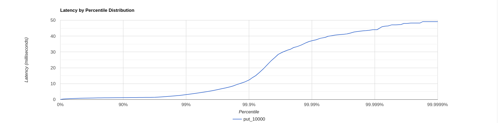
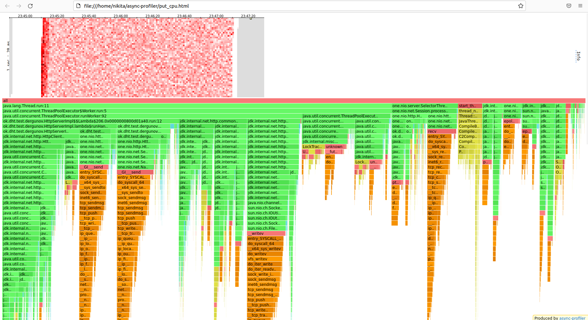
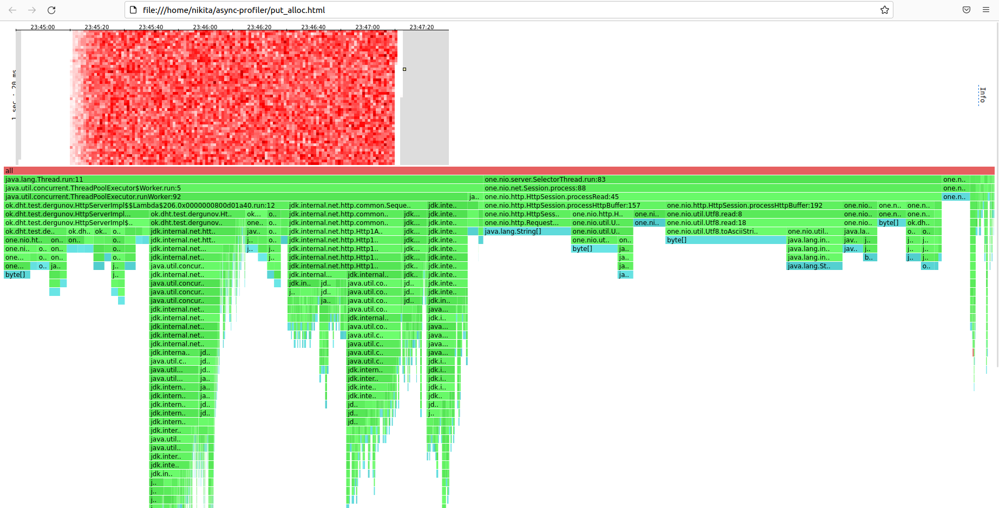
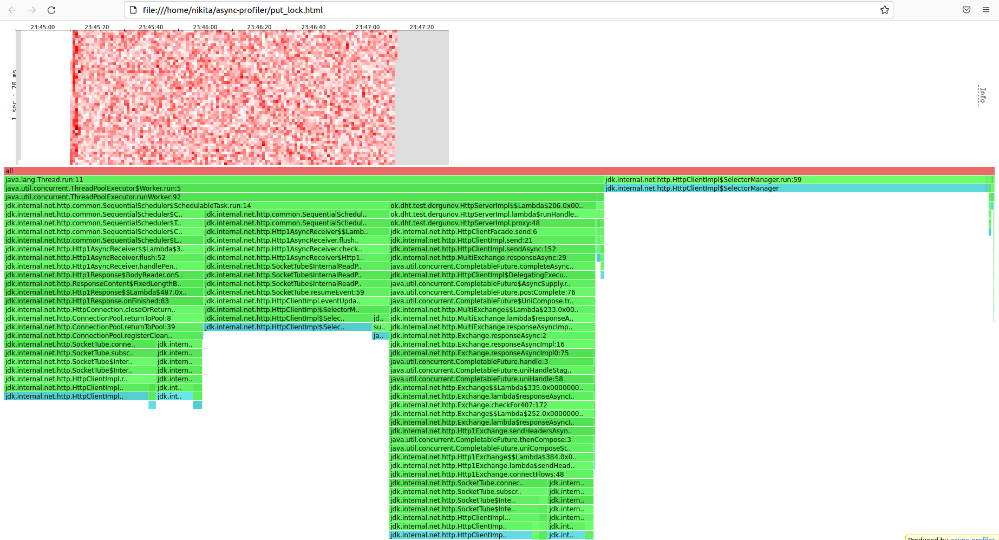
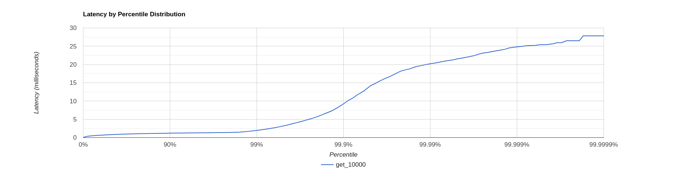
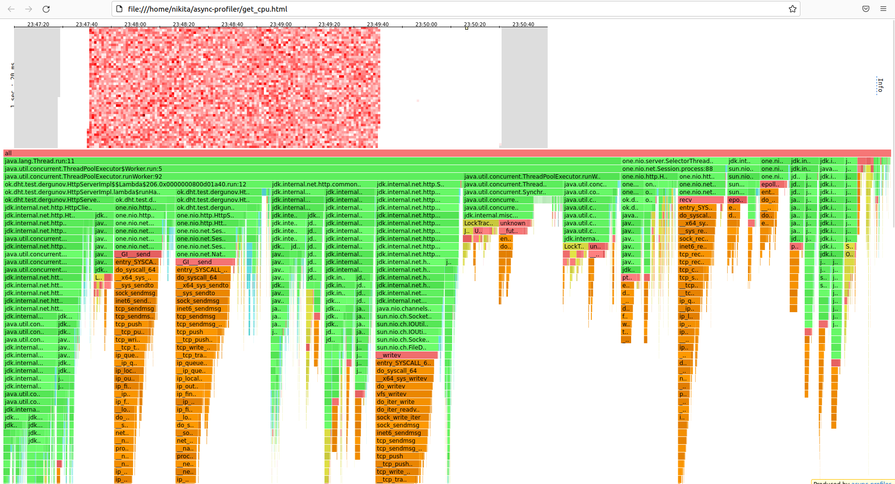
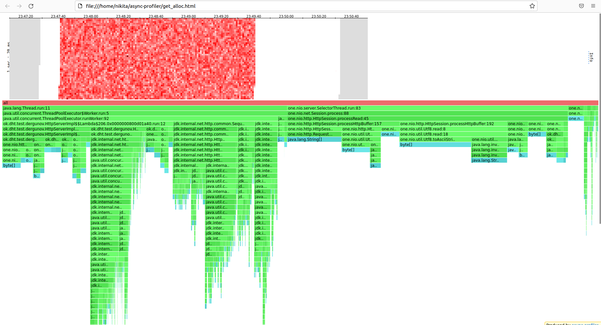
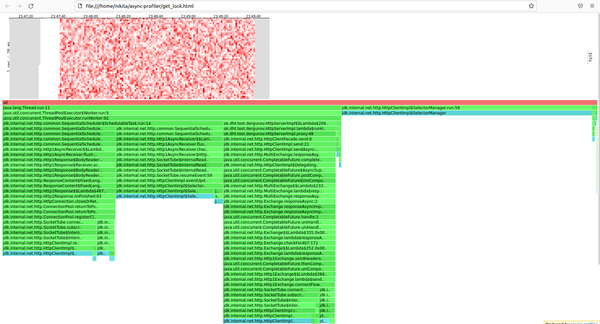

# Отчет Stage 2 #

## Нагрузочное тестирование с помощью wrk2 ##

Тестирование производится на `Ubuntu 22.04.1 LTS` ядро `Linux 5.15.0-48-generic`
процессор `Intel(R) Xeon(R) CPU E5-2620 v3 @ 2.40GHz`
кеш L3 `15 Mb` диск nvme

Для разделения ключей по нодам (3) использовался murmurhash

Так же использовалось очередь LinkedBlockingQueue с размером 128, и количеством 
процессоров для ExecutorService 4 (лучшие показатели из прошлого этапа) 

### PUT ###

#### wrk2 ####

`wrk -d 120 -t 64 -c 64 -R 10000 -s ./put.lua -L http://localhost:8084`


При больших количествах rps сервис начинает отвечать за секунды

Вывод wrk при 10000 rps 
```sh
Running 2m test @ http://localhost:8084
  64 threads and 64 connections
  Thread calibration: mean lat.: 12.106ms, rate sampling interval: 10ms
  Thread calibration: mean lat.: 11.701ms, rate sampling interval: 10ms
  Thread calibration: mean lat.: 11.758ms, rate sampling interval: 10ms
  Thread calibration: mean lat.: 11.732ms, rate sampling interval: 10ms
  Thread calibration: mean lat.: 11.793ms, rate sampling interval: 10ms
  Thread calibration: mean lat.: 11.771ms, rate sampling interval: 10ms
  Thread calibration: mean lat.: 11.684ms, rate sampling interval: 10ms
  Thread calibration: mean lat.: 11.683ms, rate sampling interval: 10ms
  Thread calibration: mean lat.: 11.643ms, rate sampling interval: 10ms
  Thread calibration: mean lat.: 11.737ms, rate sampling interval: 10ms
  Thread calibration: mean lat.: 11.852ms, rate sampling interval: 10ms
  Thread calibration: mean lat.: 11.571ms, rate sampling interval: 10ms
  Thread calibration: mean lat.: 11.619ms, rate sampling interval: 10ms
  Thread calibration: mean lat.: 11.728ms, rate sampling interval: 10ms
  Thread calibration: mean lat.: 11.620ms, rate sampling interval: 10ms
  Thread calibration: mean lat.: 11.815ms, rate sampling interval: 10ms
  Thread calibration: mean lat.: 11.597ms, rate sampling interval: 10ms
  Thread calibration: mean lat.: 11.475ms, rate sampling interval: 10ms
  Thread calibration: mean lat.: 11.575ms, rate sampling interval: 10ms
  Thread calibration: mean lat.: 11.643ms, rate sampling interval: 10ms
  Thread calibration: mean lat.: 11.752ms, rate sampling interval: 10ms
  Thread calibration: mean lat.: 11.589ms, rate sampling interval: 10ms
  Thread calibration: mean lat.: 11.511ms, rate sampling interval: 10ms
  Thread calibration: mean lat.: 11.678ms, rate sampling interval: 10ms
  Thread calibration: mean lat.: 11.545ms, rate sampling interval: 10ms
  Thread calibration: mean lat.: 11.556ms, rate sampling interval: 10ms
  Thread calibration: mean lat.: 11.422ms, rate sampling interval: 10ms
  Thread calibration: mean lat.: 11.453ms, rate sampling interval: 10ms
  Thread calibration: mean lat.: 11.482ms, rate sampling interval: 10ms
  Thread calibration: mean lat.: 11.558ms, rate sampling interval: 10ms
  Thread calibration: mean lat.: 11.811ms, rate sampling interval: 10ms
  Thread calibration: mean lat.: 11.486ms, rate sampling interval: 10ms
  Thread calibration: mean lat.: 11.546ms, rate sampling interval: 10ms
  Thread calibration: mean lat.: 11.585ms, rate sampling interval: 10ms
  Thread calibration: mean lat.: 11.565ms, rate sampling interval: 10ms
  Thread calibration: mean lat.: 11.553ms, rate sampling interval: 10ms
  Thread calibration: mean lat.: 11.500ms, rate sampling interval: 10ms
  Thread calibration: mean lat.: 11.621ms, rate sampling interval: 10ms
  Thread calibration: mean lat.: 11.636ms, rate sampling interval: 10ms
  Thread calibration: mean lat.: 11.498ms, rate sampling interval: 10ms
  Thread calibration: mean lat.: 11.413ms, rate sampling interval: 10ms
  Thread calibration: mean lat.: 11.459ms, rate sampling interval: 10ms
  Thread calibration: mean lat.: 11.597ms, rate sampling interval: 10ms
  Thread calibration: mean lat.: 11.466ms, rate sampling interval: 10ms
  Thread calibration: mean lat.: 11.475ms, rate sampling interval: 10ms
  Thread calibration: mean lat.: 11.595ms, rate sampling interval: 10ms
  Thread calibration: mean lat.: 11.532ms, rate sampling interval: 10ms
  Thread calibration: mean lat.: 11.580ms, rate sampling interval: 10ms
  Thread calibration: mean lat.: 11.563ms, rate sampling interval: 10ms
  Thread calibration: mean lat.: 11.418ms, rate sampling interval: 10ms
  Thread calibration: mean lat.: 11.533ms, rate sampling interval: 10ms
  Thread calibration: mean lat.: 11.501ms, rate sampling interval: 10ms
  Thread calibration: mean lat.: 11.644ms, rate sampling interval: 10ms
  Thread calibration: mean lat.: 11.649ms, rate sampling interval: 10ms
  Thread calibration: mean lat.: 11.589ms, rate sampling interval: 10ms
  Thread calibration: mean lat.: 11.683ms, rate sampling interval: 10ms
  Thread calibration: mean lat.: 11.441ms, rate sampling interval: 10ms
  Thread calibration: mean lat.: 11.774ms, rate sampling interval: 10ms
  Thread calibration: mean lat.: 11.532ms, rate sampling interval: 10ms
  Thread calibration: mean lat.: 11.693ms, rate sampling interval: 10ms
  Thread calibration: mean lat.: 11.969ms, rate sampling interval: 10ms
  Thread calibration: mean lat.: 11.749ms, rate sampling interval: 10ms
  Thread calibration: mean lat.: 11.830ms, rate sampling interval: 10ms
  Thread calibration: mean lat.: 11.628ms, rate sampling interval: 10ms
  Thread Stats   Avg      Stdev     Max   +/- Stdev
    Latency     0.85ms    0.98ms  52.70ms   97.82%
    Req/Sec   163.63     53.31   700.00     48.53%
  Latency Distribution (HdrHistogram - Recorded Latency)
 50.000%  782.00us
 75.000%    1.04ms
 90.000%    1.22ms
 99.000%    3.10ms
 99.900%   12.22ms
 99.990%   37.02ms
 99.999%   44.03ms
100.000%   52.74ms

  Detailed Percentile spectrum:
       Value   Percentile   TotalCount 1/(1-Percentile)

       0.050     0.000000            1         1.00
       0.357     0.100000       110518         1.11
       0.469     0.200000       220702         1.25
       0.574     0.300000       330725         1.43
       0.678     0.400000       440473         1.67
       0.782     0.500000       550269         2.00
       0.834     0.550000       605245         2.22
       0.886     0.600000       660437         2.50
       0.938     0.650000       715882         2.86
       0.989     0.700000       770530         3.33
       1.041     0.750000       825413         4.00
       1.067     0.775000       853271         4.44
       1.092     0.800000       879941         5.00
       1.119     0.825000       908215         5.71
       1.147     0.850000       935020         6.67
       1.179     0.875000       962870         8.00
       1.197     0.887500       976570         8.89
       1.217     0.900000       990578        10.00
       1.237     0.912500      1003824        11.43
       1.259     0.925000      1017392        13.33
       1.284     0.937500      1031268        16.00
       1.298     0.943750      1038050        17.78
       1.315     0.950000      1045119        20.00
       1.335     0.956250      1051853        22.86
       1.366     0.962500      1058762        26.67
       1.436     0.968750      1065526        32.00
       1.528     0.971875      1068952        35.56
       1.665     0.975000      1072386        40.00
       1.828     0.978125      1075823        45.71
       2.030     0.981250      1079247        53.33
       2.287     0.984375      1082697        64.00
       2.443     0.985938      1084409        71.11
       2.637     0.987500      1086128        80.00
       2.897     0.989062      1087843        91.43
       3.247     0.990625      1089564       106.67
       3.675     0.992188      1091279       128.00
       3.923     0.992969      1092137       142.22
       4.219     0.993750      1093002       160.00
       4.555     0.994531      1093853       182.86
       4.975     0.995313      1094718       213.33
       5.523     0.996094      1095575       256.00
       5.883     0.996484      1096003       284.44
       6.307     0.996875      1096431       320.00
       6.783     0.997266      1096860       365.71
       7.351     0.997656      1097290       426.67
       8.111     0.998047      1097721       512.00
       8.655     0.998242      1097934       568.89
       9.447     0.998437      1098151       640.00
      10.167     0.998633      1098363       731.43
      11.055     0.998828      1098579       853.33
      12.519     0.999023      1098792      1024.00
      13.847     0.999121      1098900      1137.78
      15.055     0.999219      1099007      1280.00
      17.039     0.999316      1099116      1462.86
      19.455     0.999414      1099222      1706.67
      22.751     0.999512      1099329      2048.00
      24.591     0.999561      1099383      2275.56
      26.335     0.999609      1099437      2560.00
      28.479     0.999658      1099491      2925.71
      29.855     0.999707      1099545      3413.33
      31.119     0.999756      1099599      4096.00
      31.663     0.999780      1099625      4551.11
      32.767     0.999805      1099652      5120.00
      33.375     0.999829      1099679      5851.43
      34.399     0.999854      1099705      6826.67
      35.903     0.999878      1099733      8192.00
      36.607     0.999890      1099747      9102.22
      37.151     0.999902      1099760     10240.00
      37.663     0.999915      1099773     11702.86
      38.623     0.999927      1099788     13653.33
      39.199     0.999939      1099799     16384.00
      39.903     0.999945      1099807     18204.44
      40.191     0.999951      1099813     20480.00
      40.639     0.999957      1099821     23405.71
      40.927     0.999963      1099826     27306.67
      41.183     0.999969      1099833     32768.00
      41.407     0.999973      1099836     36408.89
      41.887     0.999976      1099840     40960.00
      42.559     0.999979      1099843     46811.43
      42.943     0.999982      1099846     54613.33
      43.327     0.999985      1099850     65536.00
      43.455     0.999986      1099851     72817.78
      43.679     0.999988      1099853     81920.00
      44.031     0.999989      1099855     93622.86
      44.063     0.999991      1099856    109226.67
      45.919     0.999992      1099858    131072.00
      46.239     0.999993      1099859    145635.56
      46.399     0.999994      1099860    163840.00
      47.103     0.999995      1099861    187245.71
      47.103     0.999995      1099861    218453.33
      47.295     0.999996      1099862    262144.00
      47.967     0.999997      1099863    291271.11
      47.967     0.999997      1099863    327680.00
      48.223     0.999997      1099864    374491.43
      48.223     0.999998      1099864    436906.67
      48.223     0.999998      1099864    524288.00
      49.119     0.999998      1099865    582542.22
      49.119     0.999998      1099865    655360.00
      49.119     0.999999      1099865    748982.86
      49.119     0.999999      1099865    873813.33
      49.119     0.999999      1099865   1048576.00
      52.735     0.999999      1099866   1165084.44
      52.735     1.000000      1099866          inf
#[Mean    =        0.854, StdDeviation   =        0.977]
#[Max     =       52.704, Total count    =      1099866]
#[Buckets =           27, SubBuckets     =         2048]
----------------------------------------------------------
  1200024 requests in 2.00m, 76.68MB read
Requests/sec:  10000.68
Transfer/sec:    654.34KB
```

#### CPU ####


| [Cpu put](htmls/put_cpu.html)                                                                                                                                                                                                                                                                                                                                         |
|-----------------------------------------------------------------------------------------------------------------------------------------------------------------------------------------------------------------------------------------------------------------------------------------------------------------------------------------------------------------------|
|                                                                                                                                                                                                                                                                                                                                                |
| * Обработка запроса, который направляется в другое ноду занимает 19.66 % времени, при этом сама отправка (jdk.internal.net.http.HttpClientImpl.send) занимает 10.69 % времени, блокировки времени в ForkJoinPool 2.44 %, так же значительную часть времени занимает перезапись ответа для one.nio.net.Session 5.08 % (recv - время на получение сообщения из сокета), | 
| * Обработка запроса, который обрабатывается на той же ноде занимает 9.16 % времени, при этом запись в сокет 5.97 % времени, upsert базу данных при этом 1.21 % времени                                                                                                                                                                                                |
| * Для планировщика задач (SequentialScheduler) для http клиента требуется 11.69 % вреемни                                                                                                                                                                                                                                                                             |
| * SocketTube используемый для чтения из сокета 9.58 % времени                                                                                                                                                                                                                                                                                                         | 
| * one.nio.SelectorThread 11.98  % времени процессора из которых 4.77 % времени на получение сообщения из сокета (recv), а 3.99 % времени на постановку задачи в очередь в LinkingBlockingQueue, при чем на метод park, блокирующий поток 2.22% метод unpark выполняющий пробуждение потока 0.69 %                                                                     |
| * Работа с получением задачи для ThreadPoolExecutor занимала 15.14 % времени, сто сводится к получению задачи.                                                                                                                                                                                                                                                        |
| * one.nio.net.NativeSelector.epollWait занимает 4.95 % времени, внутри которого вызывается системный вызов epoll_wait который ожидает события epoll, он мониторит возможность  чтение записи  предоставленных файловых дескрипторов, метод используется для выбора сессии                                                                                             |


#### ALLOC ####


| [Alloc put](htmls/put_alloc.html)                                                                                                                                                                                                                                                                                                                                                                                             |
|-------------------------------------------------------------------------------------------------------------------------------------------------------------------------------------------------------------------------------------------------------------------------------------------------------------------------------------------------------------------------------------------------------------------------------|
|                                                                                                                                                                                                                                                                                                                                                                                                      |
| * 46.27 % алолокаций идет на чтение запроса (one.nio.http.HttpSession.processRead), где происходит распарсинг запроса из wrk                                                                                                                                                                                                                                                                                                  |
| * 14.67 % аллокаций идет на запрос, обрабатываемый самой нодой, 6.36% на отправку Response,                                                                                                                                                                                                                                                                                                                                   |
| * 8.73 % аллокаций идет на запрос, обрабатываемый другой нодой,                                                                                                                                                                                                                                                                                                                                                               |
| * 14.06 % аллокаций на планировщик задач (SequentialScheduler) для http клиента                                                                                                                                                                                                                                                                                                                                               |


#### LOCK ####

| [Lock put](htmls/put_lock.html)                                                                                      |
|----------------------------------------------------------------------------------------------------------------------|
|                                                                                              |
| * 38.87 % локов идет на планировщик задач (SequentialScheduler) для http клиента                                     |
| * 20.65 % локов идет на SocketTube для работы с данными из сокета                                                    |
| * 38.45 % локов идет на работы с SelectorManager, реализующий взаимодействие с соединениями клиента в HttpClientImpl |


### GET ###

#### wrk2 ####

`wrk -d 120 -t 64 -c 64 -R 10000 -s ./get.lua -L http://localhost:8084`



Вывод wrk при 10000 rps
```sh
Running 2m test @ http://localhost:8084
  64 threads and 64 connections
  Thread calibration: mean lat.: 0.801ms, rate sampling interval: 10ms
  Thread calibration: mean lat.: 0.810ms, rate sampling interval: 10ms
  Thread calibration: mean lat.: 0.807ms, rate sampling interval: 10ms
  Thread calibration: mean lat.: 0.801ms, rate sampling interval: 10ms
  Thread calibration: mean lat.: 0.784ms, rate sampling interval: 10ms
  Thread calibration: mean lat.: 0.801ms, rate sampling interval: 10ms
  Thread calibration: mean lat.: 0.795ms, rate sampling interval: 10ms
  Thread calibration: mean lat.: 0.791ms, rate sampling interval: 10ms
  Thread calibration: mean lat.: 0.781ms, rate sampling interval: 10ms
  Thread calibration: mean lat.: 0.796ms, rate sampling interval: 10ms
  Thread calibration: mean lat.: 0.781ms, rate sampling interval: 10ms
  Thread calibration: mean lat.: 0.781ms, rate sampling interval: 10ms
  Thread calibration: mean lat.: 0.791ms, rate sampling interval: 10ms
  Thread calibration: mean lat.: 0.782ms, rate sampling interval: 10ms
  Thread calibration: mean lat.: 0.784ms, rate sampling interval: 10ms
  Thread calibration: mean lat.: 0.791ms, rate sampling interval: 10ms
  Thread calibration: mean lat.: 0.781ms, rate sampling interval: 10ms
  Thread calibration: mean lat.: 0.786ms, rate sampling interval: 10ms
  Thread calibration: mean lat.: 0.780ms, rate sampling interval: 10ms
  Thread calibration: mean lat.: 0.776ms, rate sampling interval: 10ms
  Thread calibration: mean lat.: 0.771ms, rate sampling interval: 10ms
  Thread calibration: mean lat.: 0.781ms, rate sampling interval: 10ms
  Thread calibration: mean lat.: 0.777ms, rate sampling interval: 10ms
  Thread calibration: mean lat.: 0.783ms, rate sampling interval: 10ms
  Thread calibration: mean lat.: 0.778ms, rate sampling interval: 10ms
  Thread calibration: mean lat.: 0.784ms, rate sampling interval: 10ms
  Thread calibration: mean lat.: 0.797ms, rate sampling interval: 10ms
  Thread calibration: mean lat.: 0.791ms, rate sampling interval: 10ms
  Thread calibration: mean lat.: 0.784ms, rate sampling interval: 10ms
  Thread calibration: mean lat.: 0.803ms, rate sampling interval: 10ms
  Thread calibration: mean lat.: 0.788ms, rate sampling interval: 10ms
  Thread calibration: mean lat.: 0.809ms, rate sampling interval: 10ms
  Thread calibration: mean lat.: 0.785ms, rate sampling interval: 10ms
  Thread calibration: mean lat.: 0.794ms, rate sampling interval: 10ms
  Thread calibration: mean lat.: 0.801ms, rate sampling interval: 10ms
  Thread calibration: mean lat.: 0.806ms, rate sampling interval: 10ms
  Thread calibration: mean lat.: 0.786ms, rate sampling interval: 10ms
  Thread calibration: mean lat.: 0.785ms, rate sampling interval: 10ms
  Thread calibration: mean lat.: 0.785ms, rate sampling interval: 10ms
  Thread calibration: mean lat.: 0.777ms, rate sampling interval: 10ms
  Thread calibration: mean lat.: 0.774ms, rate sampling interval: 10ms
  Thread calibration: mean lat.: 0.780ms, rate sampling interval: 10ms
  Thread calibration: mean lat.: 0.780ms, rate sampling interval: 10ms
  Thread calibration: mean lat.: 0.786ms, rate sampling interval: 10ms
  Thread calibration: mean lat.: 0.794ms, rate sampling interval: 10ms
  Thread calibration: mean lat.: 0.779ms, rate sampling interval: 10ms
  Thread calibration: mean lat.: 0.779ms, rate sampling interval: 10ms
  Thread calibration: mean lat.: 0.778ms, rate sampling interval: 10ms
  Thread calibration: mean lat.: 0.778ms, rate sampling interval: 10ms
  Thread calibration: mean lat.: 0.787ms, rate sampling interval: 10ms
  Thread calibration: mean lat.: 0.783ms, rate sampling interval: 10ms
  Thread calibration: mean lat.: 0.776ms, rate sampling interval: 10ms
  Thread calibration: mean lat.: 0.769ms, rate sampling interval: 10ms
  Thread calibration: mean lat.: 0.781ms, rate sampling interval: 10ms
  Thread calibration: mean lat.: 0.782ms, rate sampling interval: 10ms
  Thread calibration: mean lat.: 0.795ms, rate sampling interval: 10ms
  Thread calibration: mean lat.: 0.786ms, rate sampling interval: 10ms
  Thread calibration: mean lat.: 0.795ms, rate sampling interval: 10ms
  Thread calibration: mean lat.: 0.783ms, rate sampling interval: 10ms
  Thread calibration: mean lat.: 0.794ms, rate sampling interval: 10ms
  Thread calibration: mean lat.: 0.788ms, rate sampling interval: 10ms
  Thread calibration: mean lat.: 0.790ms, rate sampling interval: 10ms
  Thread calibration: mean lat.: 0.782ms, rate sampling interval: 10ms
  Thread calibration: mean lat.: 0.776ms, rate sampling interval: 10ms
  Thread Stats   Avg      Stdev     Max   +/- Stdev
    Latency   820.27us  627.35us  30.96ms   96.92%
    Req/Sec   163.99     53.31   500.00     47.28%
  Latency Distribution (HdrHistogram - Recorded Latency)
 50.000%  785.00us
 75.000%    1.04ms
 90.000%    1.21ms
 99.000%    1.96ms
 99.900%    9.19ms
 99.990%   20.19ms
 99.999%   24.75ms
100.000%   30.98ms

  Detailed Percentile spectrum:
       Value   Percentile   TotalCount 1/(1-Percentile)

       0.052     0.000000            1         1.00
       0.365     0.100000       110261         1.11
       0.477     0.200000       220593         1.25
       0.580     0.300000       330196         1.43
       0.682     0.400000       440287         1.67
       0.785     0.500000       550722         2.00
       0.836     0.550000       605135         2.22
       0.887     0.600000       660627         2.50
       0.938     0.650000       715490         2.86
       0.989     0.700000       770358         3.33
       1.040     0.750000       825456         4.00
       1.066     0.775000       853438         4.44
       1.091     0.800000       880445         5.00
       1.117     0.825000       907998         5.71
       1.145     0.850000       935537         6.67
       1.175     0.875000       962550         8.00
       1.192     0.887500       976261         8.89
       1.211     0.900000       990232        10.00
       1.231     0.912500      1003883        11.43
       1.252     0.925000      1017534        13.33
       1.274     0.937500      1031119        16.00
       1.286     0.943750      1037996        17.78
       1.299     0.950000      1044899        20.00
       1.313     0.956250      1051763        22.86
       1.330     0.962500      1058925        26.67
       1.350     0.968750      1065693        32.00
       1.362     0.971875      1069017        35.56
       1.377     0.975000      1072510        40.00
       1.396     0.978125      1075795        45.71
       1.428     0.981250      1079285        53.33
       1.504     0.984375      1082702        64.00
       1.586     0.985938      1084388        71.11
       1.711     0.987500      1086108        80.00
       1.859     0.989062      1087831        91.43
       2.053     0.990625      1089553       106.67
       2.307     0.992188      1091266       128.00
       2.477     0.992969      1092126       142.22
       2.677     0.993750      1092980       160.00
       2.953     0.994531      1093844       182.86
       3.297     0.995313      1094700       213.33
       3.767     0.996094      1095562       256.00
       4.039     0.996484      1095990       284.44
       4.351     0.996875      1096418       320.00
       4.727     0.997266      1096849       365.71
       5.187     0.997656      1097278       426.67
       5.815     0.998047      1097706       512.00
       6.247     0.998242      1097921       568.89
       6.735     0.998437      1098136       640.00
       7.295     0.998633      1098352       731.43
       8.163     0.998828      1098567       853.33
       9.375     0.999023      1098780      1024.00
      10.159     0.999121      1098890      1137.78
      10.799     0.999219      1098997      1280.00
      11.783     0.999316      1099105      1462.86
      12.687     0.999414      1099210      1706.67
      14.175     0.999512      1099317      2048.00
      14.695     0.999561      1099371      2275.56
      15.343     0.999609      1099425      2560.00
      16.031     0.999658      1099479      2925.71
      16.687     0.999707      1099532      3413.33
      17.631     0.999756      1099586      4096.00
      18.159     0.999780      1099613      4551.11
      18.511     0.999805      1099640      5120.00
      18.815     0.999829      1099667      5851.43
      19.407     0.999854      1099693      6826.67
      19.775     0.999878      1099722      8192.00
      20.031     0.999890      1099734      9102.22
      20.239     0.999902      1099747     10240.00
      20.447     0.999915      1099761     11702.86
      20.783     0.999927      1099775     13653.33
      21.103     0.999939      1099789     16384.00
      21.247     0.999945      1099794     18204.44
      21.535     0.999951      1099801     20480.00
      21.775     0.999957      1099808     23405.71
      22.063     0.999963      1099814     27306.67
      22.463     0.999969      1099821     32768.00
      22.847     0.999973      1099824     36408.89
      23.135     0.999976      1099828     40960.00
      23.343     0.999979      1099831     46811.43
      23.647     0.999982      1099834     54613.33
      23.967     0.999985      1099838     65536.00
      24.159     0.999986      1099839     72817.78
      24.559     0.999988      1099841     81920.00
      24.751     0.999989      1099843     93622.86
      24.911     0.999991      1099844    109226.67
      25.167     0.999992      1099846    131072.00
      25.199     0.999993      1099847    145635.56
      25.247     0.999994      1099848    163840.00
      25.439     0.999995      1099849    187245.71
      25.439     0.999995      1099849    218453.33
      25.663     0.999996      1099850    262144.00
      25.967     0.999997      1099851    291271.11
      25.967     0.999997      1099851    327680.00
      26.495     0.999997      1099852    374491.43
      26.495     0.999998      1099852    436906.67
      26.495     0.999998      1099852    524288.00
      27.839     0.999998      1099853    582542.22
      27.839     0.999998      1099853    655360.00
      27.839     0.999999      1099853    748982.86
      27.839     0.999999      1099853    873813.33
      27.839     0.999999      1099853   1048576.00
      30.975     0.999999      1099854   1165084.44
      30.975     1.000000      1099854          inf
#[Mean    =        0.820, StdDeviation   =        0.627]
#[Max     =       30.960, Total count    =      1099854]
#[Buckets =           27, SubBuckets     =         2048]
----------------------------------------------------------
  1200013 requests in 2.00m, 82.25MB read
Requests/sec:  10000.77
Transfer/sec:    701.95KB
```


#### CPU ####

| [Cpu get](htmls/get_cpu.html)                                                                                                                                                                                                                                                                                                                                         |
|-----------------------------------------------------------------------------------------------------------------------------------------------------------------------------------------------------------------------------------------------------------------------------------------------------------------------------------------------------------------------|
|                                                                                                                                                                                                                                                                                                                                                |
| * Обработка запроса, который направляется в другое ноду занимает 19.39 % времени, при этом сама отправка (jdk.internal.net.http.HttpClientImpl.send) занимает 10.17 % времени, блокировки времени в ForkJoinPool 2.28 %, так же значительную часть времени занимает перезапись ответа для one.nio.net.Session 5.17 % (recv - время на получение сообщения из сокета), | 
| * Обработка запроса, который обрабатывается на той же ноде занимает 9.72 % времени, при этом запись в сокет 6.5 % времени, get базу данных при этом 1.13 % времени                                                                                                                                                                                                    |
| * Для планировщика задача для http клиента требуется 11.26 % вреемни                                                                                                                                                                                                                                                                                                  |
| * SocketTube используемый для чтения из сокета 9.58 % времени                                                                                                                                                                                                                                                                                                         | 
| * one.nio.SelectorThread 11.98  % времени процессора из которых 4.77 % времени на получение сообщения из сокета (recv), а 3.99 % времени на постановку задачи в очередь в LinkingBlockingQueue, при чем на метод park, блокирующий поток 2.22% метод unpark выполняющий пробуждение потока 0.69 %                                                                     |
| * Работа с получением задачи для ThreadPoolExecutor занимала 17.66 % времени, сто сводится к получению задачи.                                                                                                                                                                                                                                                        |
| * 4.95 занимает epoll_wait вызов которого ожидает события epoll, он мониторит возможность  чтение записи  предоставленных файловых дескрипторов, метод используется для выбора сессии                                                                                                                                                                                 |


#### ALLOC ####


| [Alloc get](htmls/get_alloc.html)                                                                                            |
|------------------------------------------------------------------------------------------------------------------------------|
|                                                                                                     |
| * 47.13 % алолокаций идет на чтение запроса (one.nio.http.HttpSession.processRead), где происходит распарсинг запроса из wrk |
| * 14.74 % аллокаций идет на запрос, обрабатываемый самой нодой, 5.15% на отправку Response.                                  |
| * 9.29 % аллокаций идет на запрос, обрабатываемый другой нодой,                                                              |
| * 13.66 % аллокаций на планировщик задач (SequentialScheduler) для http клиента                                              |

#### LOCK ####


| [Lock get](htmls/get_lock.html)                                                                                     |
|---------------------------------------------------------------------------------------------------------------------|
|                                                                                             |                                      
| * 37.06 % локов идет на планировщик задач (SequentialScheduler) для http клиента                                    |
| * 18.03 % локов идет на SocketTube для работы с данными из сокета                                                   |
| * 42.2 % локов идет на работы с SelectorManager, реализующий взаимодействие с соединениями клиента в HttpClientImpl |


### Сравнение с прошлыми результатами ### 


При добавлении шардирования мы видим что сервис престал поддерживать, прошлое (большее) количество rps порядка 100000,
на данный момент rps вернулся к уровню первого этапа (10000), на работу с сетью стало, тратится больше времени по сравнению
с прошлым этапом, при этом (вычисление hash функции не внесло больших расходов производительности (менее 1 %)),
для улучшения производительности нужно оптимизировать работу с проксированием сообщений на другие сервера, 
HeatMapы имеют не однородную раскраску в следствие локов потоков, количество которых сильно возросло с прошлым этапом,
предположу, что для улучшения ситуации необходимо уменьшить количество локов.

