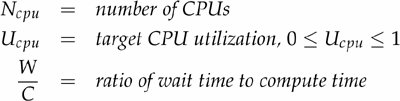
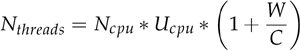

## Этап 2. Асинхронный сервер (deadline 2022-10-05 23:59:59 MSK)

Вынесите **обработку** запросов в отдельный `ExecutorService` с ограниченной очередью, чтобы разгрузить `SelectorThread`ы HTTP сервера.

Проведите нагрузочное тестирование с помощью [wrk2](https://github.com/giltene/wrk2) с **большим количеством соединений** (не меньше 64) `PUT` и `GET` запросами.

Отпрофилируйте приложение (CPU, alloc и lock) под `PUT` и `GET` нагрузкой с помощью [async-profiler](https://github.com/Artyomcool/async-profiler).

Для проведения нагрузочного тестирования для утилиты wrk были использованы Scripting(смотри [wrk2](https://github.com/giltene/wrk2), [wrk](https://github.com/wg/wrk/tree/master/scripts)) \
put-request.lua
```
cou = 0
request = function()
    cou = cou + 1
    path="/v0/entity?id=" .. cou
    body=cou
    return wrk.format("PUT", path, nil, body)
end
```

get-request.lua
```
cou = 0
request = function()
    path="/v0/entity?id=" .. math.random(1, 100000)
    return wrk.format("GET", path)
end
```

### Синхронная реализация 

### PUT

```
wrk2 -t 6 -c 64 -d 60s -R 50000 -s requests-wrk/put-requests.lua --latency http://localhost:42342
    Running 1m test @ http://localhost:42342
  6 threads and 64 connections
  Thread calibration: mean lat.: 1.577ms, rate sampling interval: 10ms
  Thread calibration: mean lat.: 1.585ms, rate sampling interval: 10ms
  Thread calibration: mean lat.: 1.569ms, rate sampling interval: 10ms
  Thread calibration: mean lat.: 1.560ms, rate sampling interval: 10ms
  Thread calibration: mean lat.: 1.639ms, rate sampling interval: 10ms
  Thread calibration: mean lat.: 1.661ms, rate sampling interval: 10ms
  Thread Stats   Avg      Stdev     Max   +/- Stdev
    Latency     1.64ms    4.42ms  94.46ms   99.01%
    Req/Sec     8.79k   766.17    19.22k    81.30%
  Latency Distribution (HdrHistogram - Recorded Latency)
 50.000%    1.22ms
 75.000%    1.66ms
 90.000%    2.11ms
 99.000%    5.53ms
 99.900%   75.14ms
 99.990%   90.11ms
 99.999%   92.61ms
100.000%   94.53ms

  Detailed Percentile spectrum:
       Value   Percentile   TotalCount 1/(1-Percentile)

       0.041     0.000000            1         1.00
       0.534     0.100000       250357         1.11
       0.728     0.200000       499609         1.25
       0.896     0.300000       750549         1.43
       1.056     0.400000       999180         1.67
       1.217     0.500000      1248850         2.00
       1.300     0.550000      1374832         2.22
       1.384     0.600000      1498637         2.50
       1.472     0.650000      1624180         2.86
       1.564     0.700000      1748587         3.33
       1.665     0.750000      1873800         4.00
       1.720     0.775000      1936090         4.44
       1.780     0.800000      1998680         5.00
       1.845     0.825000      2060547         5.71
       1.918     0.850000      2123306         6.67
       2.003     0.875000      2185730         8.00
       2.051     0.887500      2216745         8.89
       2.105     0.900000      2248753        10.00
       2.163     0.912500      2279121        11.43
       2.233     0.925000      2310818        13.33
       2.311     0.937500      2341402        16.00
       2.357     0.943750      2357057        17.78
       2.409     0.950000      2372805        20.00
       2.467     0.956250      2388579        22.86
       2.535     0.962500      2404190        26.67
       2.615     0.968750      2419708        32.00
       2.663     0.971875      2427506        35.56
       2.717     0.975000      2435255        40.00
       2.781     0.978125      2443036        45.71
       2.859     0.981250      2450712        53.33
       2.969     0.984375      2458458        64.00
       3.049     0.985938      2462417        71.11
       3.173     0.987500      2466287        80.00
       3.681     0.989062      2470166        91.43
       9.703     0.990625      2474066       106.67
      20.383     0.992188      2477972       128.00
      23.615     0.992969      2479921       142.22
      26.511     0.993750      2481875       160.00
      30.511     0.994531      2483823       182.86
      34.655     0.995313      2485783       213.33
      39.071     0.996094      2487728       256.00
      42.111     0.996484      2488700       284.44
      48.191     0.996875      2489679       320.00
      54.783     0.997266      2490652       365.71
      58.687     0.997656      2491626       426.67
      62.015     0.998047      2492604       512.00
      63.807     0.998242      2493090       568.89
      66.431     0.998437      2493583       640.00
      69.375     0.998633      2494072       731.43
      72.511     0.998828      2494556       853.33
      75.519     0.999023      2495047      1024.00
      76.991     0.999121      2495289      1137.78
      78.527     0.999219      2495528      1280.00
      80.063     0.999316      2495775      1462.86
      81.535     0.999414      2496021      1706.67
      83.071     0.999512      2496267      2048.00
      83.775     0.999561      2496387      2275.56
      84.415     0.999609      2496508      2560.00
      85.311     0.999658      2496635      2925.71
      86.271     0.999707      2496751      3413.33
      87.231     0.999756      2496870      4096.00
      87.743     0.999780      2496937      4551.11
      88.191     0.999805      2496994      5120.00
      88.703     0.999829      2497062      5851.43
      89.151     0.999854      2497119      6826.67
      89.663     0.999878      2497182      8192.00
      89.855     0.999890      2497207      9102.22
      90.175     0.999902      2497242     10240.00
      90.367     0.999915      2497270     11702.86
      90.623     0.999927      2497301     13653.33
      90.943     0.999939      2497332     16384.00
      91.199     0.999945      2497351     18204.44
      91.327     0.999951      2497364     20480.00
      91.391     0.999957      2497374     23405.71
      91.647     0.999963      2497396     27306.67
      91.775     0.999969      2497408     32768.00
      91.839     0.999973      2497418     36408.89
      91.903     0.999976      2497420     40960.00
      91.967     0.999979      2497426     46811.43
      92.159     0.999982      2497435     54613.33
      92.287     0.999985      2497443     65536.00
      92.351     0.999986      2497447     72817.78
      92.415     0.999988      2497449     81920.00
      92.543     0.999989      2497453     93622.86
      92.607     0.999991      2497457    109226.67
      92.735     0.999992      2497461    131072.00
      92.863     0.999993      2497462    145635.56
      92.991     0.999994      2497464    163840.00
      93.055     0.999995      2497466    187245.71
      93.119     0.999995      2497468    218453.33
      93.183     0.999996      2497471    262144.00
      93.183     0.999997      2497471    291271.11
      93.311     0.999997      2497473    327680.00
      93.311     0.999997      2497473    374491.43
      93.439     0.999998      2497475    436906.67
      93.439     0.999998      2497475    524288.00
      93.439     0.999998      2497475    582542.22
      93.503     0.999998      2497476    655360.00
      93.503     0.999999      2497476    748982.86
      93.759     0.999999      2497477    873813.33
      93.759     0.999999      2497477   1048576.00
      93.759     0.999999      2497477   1165084.44
      94.207     0.999999      2497478   1310720.00
      94.207     0.999999      2497478   1497965.71
      94.207     0.999999      2497478   1747626.67
      94.207     1.000000      2497478   2097152.00
      94.207     1.000000      2497478   2330168.89
      94.527     1.000000      2497479   2621440.00
      94.527     1.000000      2497479          inf
#[Mean    =        1.642, StdDeviation   =        4.423]
#[Max     =       94.464, Total count    =      2497479]
#[Buckets =           27, SubBuckets     =         2048]
----------------------------------------------------------
  2990648 requests in 1.00m, 191.09MB read
Requests/sec:  49843.68
Transfer/sec:      3.18MB
```

### GET 
```
Running 1m test @ http://localhost:42342
  6 threads and 64 connections
  Thread calibration: mean lat.: 1.889ms, rate sampling interval: 10ms
  Thread calibration: mean lat.: 2.189ms, rate sampling interval: 10ms
  Thread calibration: mean lat.: 2.153ms, rate sampling interval: 10ms
  Thread calibration: mean lat.: 1.857ms, rate sampling interval: 10ms
  Thread calibration: mean lat.: 1.840ms, rate sampling interval: 10ms
  Thread calibration: mean lat.: 2.150ms, rate sampling interval: 10ms
  Thread Stats   Avg      Stdev     Max   +/- Stdev
    Latency     1.41ms    2.04ms  46.43ms   99.23%
    Req/Sec     8.79k   648.34    17.33k    71.57%
  Latency Distribution (HdrHistogram - Recorded Latency)
 50.000%    1.22ms
 75.000%    1.67ms
 90.000%    2.10ms
 99.000%    3.06ms
 99.900%   37.98ms
 99.990%   43.84ms
 99.999%   45.82ms
100.000%   46.46ms

  Detailed Percentile spectrum:
       Value   Percentile   TotalCount 1/(1-Percentile)

       0.039     0.000000            1         1.00
       0.544     0.100000       250024         1.11
       0.737     0.200000       499629         1.25
       0.904     0.300000       749348         1.43
       1.064     0.400000       999258         1.67
       1.224     0.500000      1249329         2.00
       1.306     0.550000      1374076         2.22
       1.390     0.600000      1499156         2.50
       1.478     0.650000      1624075         2.86
       1.570     0.700000      1748486         3.33
       1.670     0.750000      1873289         4.00
       1.725     0.775000      1936558         4.44
       1.783     0.800000      1998744         5.00
       1.846     0.825000      2060496         5.71
       1.917     0.850000      2123219         6.67
       1.998     0.875000      2185954         8.00
       2.044     0.887500      2216992         8.89
       2.095     0.900000      2248257        10.00
       2.151     0.912500      2279192        11.43
       2.215     0.925000      2310365        13.33
       2.291     0.937500      2341798        16.00
       2.333     0.943750      2357048        17.78
       2.381     0.950000      2372921        20.00
       2.435     0.956250      2388712        22.86
       2.493     0.962500      2403890        26.67
       2.565     0.968750      2419634        32.00
       2.605     0.971875      2427327        35.56
       2.649     0.975000      2435067        40.00
       2.701     0.978125      2442857        45.71
       2.763     0.981250      2450798        53.33
       2.837     0.984375      2458576        64.00
       2.881     0.985938      2462478        71.11
       2.937     0.987500      2466345        80.00
       3.007     0.989062      2470267        91.43
       3.109     0.990625      2474091       106.67
       3.371     0.992188      2477978       128.00
       4.055     0.992969      2479925       142.22
       5.371     0.993750      2481874       160.00
       7.059     0.994531      2483825       182.86
       9.407     0.995313      2485780       213.33
      14.567     0.996094      2487728       256.00
      17.983     0.996484      2488705       284.44
      21.839     0.996875      2489684       320.00
      25.263     0.997266      2490653       365.71
      28.351     0.997656      2491629       426.67
      32.303     0.998047      2492606       512.00
      33.535     0.998242      2493101       568.89
      34.527     0.998437      2493588       640.00
      35.679     0.998633      2494071       731.43
      36.895     0.998828      2494569       853.33
      38.111     0.999023      2495046      1024.00
      38.719     0.999121      2495296      1137.78
      39.295     0.999219      2495540      1280.00
      39.903     0.999316      2495789      1462.86
      40.543     0.999414      2496021      1706.67
      41.183     0.999512      2496271      2048.00
      41.503     0.999561      2496397      2275.56
      41.791     0.999609      2496511      2560.00
      42.111     0.999658      2496641      2925.71
      42.431     0.999707      2496760      3413.33
      42.751     0.999756      2496879      4096.00
      42.943     0.999780      2496940      4551.11
      43.103     0.999805      2497000      5120.00
      43.295     0.999829      2497067      5851.43
      43.455     0.999854      2497125      6826.67
      43.615     0.999878      2497178      8192.00
      43.711     0.999890      2497209      9102.22
      43.839     0.999902      2497240     10240.00
      43.999     0.999915      2497273     11702.86
      44.127     0.999927      2497301     13653.33
      44.287     0.999939      2497336     16384.00
      44.351     0.999945      2497346     18204.44
      44.479     0.999951      2497364     20480.00
      44.575     0.999957      2497377     23405.71
      44.735     0.999963      2497394     27306.67
      44.863     0.999969      2497407     32768.00
      44.991     0.999973      2497415     36408.89
      45.119     0.999976      2497422     40960.00
      45.247     0.999979      2497429     46811.43
      45.407     0.999982      2497437     54613.33
      45.503     0.999985      2497445     65536.00
      45.631     0.999986      2497450     72817.78
      45.663     0.999988      2497452     81920.00
      45.791     0.999989      2497456     93622.86
      45.855     0.999991      2497460    109226.67
      45.951     0.999992      2497464    131072.00
      45.983     0.999993      2497465    145635.56
      46.047     0.999994      2497468    163840.00
      46.111     0.999995      2497469    187245.71
      46.143     0.999995      2497471    218453.33
      46.239     0.999996      2497473    262144.00
      46.303     0.999997      2497475    291271.11
      46.303     0.999997      2497475    327680.00
      46.335     0.999997      2497476    374491.43
      46.367     0.999998      2497477    436906.67
      46.399     0.999998      2497479    524288.00
      46.399     0.999998      2497479    582542.22
      46.399     0.999998      2497479    655360.00
      46.399     0.999999      2497479    748982.86
      46.431     0.999999      2497480    873813.33
      46.431     0.999999      2497480   1048576.00
      46.431     0.999999      2497480   1165084.44
      46.463     0.999999      2497482   1310720.00
      46.463     1.000000      2497482          inf
#[Mean    =        1.407, StdDeviation   =        2.042]
#[Max     =       46.432, Total count    =      2497482]
#[Buckets =           27, SubBuckets     =         2048]
----------------------------------------------------------
  2998811 requests in 1.00m, 191.30MB read
Requests/sec:  49979.88
Transfer/sec:      3.19MB
```

Как мы видим в синхронной реализации запросы обрабатываются с использованием Selectors.
Handle request, send response и в целом обработка запроса занимают 67% CPU, при этом примерно 33% CPU - 
это метод SelectorImpl.lockAndDoSelect, который вызывает метод poll(), забирающий из
очереди запросов следующий запрос. \
Соответственно видим проблему запросы стоят в очереди, постараемся решить ее с помощью 
добавления асинхронности в наш Service.


### Асинхронная реализация

Добавим в нашу реализацию ThreadPoll.

Параметры для ThreadPoolExecutor:

Размер пула потоков зависит от типа задачи и характеристик системы:
Тестирование проводится на MacBook Pro (16-inch, 2019) Procesor 2,6 GHz 6-Core Intel Core i7
Если пул потоков слишком велик, большое количество потоков будет конкурировать за относительно меньший объем процессора и
ограниченные ресурсы памяти, что не только повлияет на производительность и приводит к чрезмерному потреблению памяти.
Слишком маленький пул потоков приведет к неполному использованию процессора.




Источник: [Java Concurrency In Practice, section 8.2 Sizing Thread Pools.](https://www.amazon.com/dp/0321349601)

CorePoolSize = N_cpu * U_cpu * (1 + W / С). \
Так как у нас много взаимодействия с диском,
рекомендуется брать U_cpu * (1 + W / С) примерно равное 2. Поэтому
CorePoolSize = Runtime.getRuntime().availableProcessors() * 2


Определившись с выбором размера 
#PUT Queue_size = 128

```
wrk2 -t 6 -c 64 -d 60s -R 50000 -s requests-wrk/put-requests.lua --latency http://localhost:42342
Running 1m test @ http://localhost:42342
  6 threads and 64 connections
  Thread calibration: mean lat.: 2.212ms, rate sampling interval: 10ms
  Thread calibration: mean lat.: 2.322ms, rate sampling interval: 10ms
  Thread calibration: mean lat.: 2.300ms, rate sampling interval: 10ms
  Thread calibration: mean lat.: 2.264ms, rate sampling interval: 10ms
  Thread calibration: mean lat.: 2.263ms, rate sampling interval: 10ms
  Thread calibration: mean lat.: 2.253ms, rate sampling interval: 10ms
  Thread Stats   Avg      Stdev     Max   +/- Stdev
    Latency     1.50ms    2.99ms  75.01ms   99.17%
    Req/Sec     8.79k   713.44    15.33k    78.07%
  Latency Distribution (HdrHistogram - Recorded Latency)
 50.000%    1.25ms
 75.000%    1.70ms
 90.000%    2.12ms
 99.000%    3.61ms
 99.900%   54.88ms
 99.990%   67.71ms
 99.999%   72.51ms
100.000%   75.07ms

  Detailed Percentile spectrum:
       Value   Percentile   TotalCount 1/(1-Percentile)

       0.047     0.000000            1         1.00
       0.573     0.100000       250779         1.11
       0.763     0.200000       500767         1.25
       0.928     0.300000       749941         1.43
       1.088     0.400000       999064         1.67
       1.249     0.500000      1250260         2.00
       1.330     0.550000      1373612         2.22
       1.415     0.600000      1499530         2.50
       1.503     0.650000      1624573         2.86
       1.595     0.700000      1748752         3.33
       1.695     0.750000      1873170         4.00
       1.750     0.775000      1936464         4.44
       1.808     0.800000      1998079         5.00
       1.872     0.825000      2060848         5.71
       1.943     0.850000      2123248         6.67
       2.024     0.875000      2185284         8.00
       2.071     0.887500      2216980         8.89
       2.121     0.900000      2247964        10.00
       2.179     0.912500      2279909        11.43
       2.243     0.925000      2310999        13.33
       2.317     0.937500      2341757        16.00
       2.361     0.943750      2357408        17.78
       2.409     0.950000      2372958        20.00
       2.465     0.956250      2388692        22.86
       2.529     0.962500      2404256        26.67
       2.605     0.968750      2419473        32.00
       2.651     0.971875      2427308        35.56
       2.705     0.975000      2435179        40.00
       2.767     0.978125      2442881        45.71
       2.845     0.981250      2450666        53.33
       2.951     0.984375      2458470        64.00
       3.027     0.985938      2462412        71.11
       3.133     0.987500      2466263        80.00
       3.339     0.989062      2470148        91.43
       3.875     0.990625      2474043       106.67
       4.903     0.992188      2477934       128.00
       5.643     0.992969      2479891       142.22
       6.551     0.993750      2481838       160.00
       7.819     0.994531      2483786       182.86
      15.143     0.995313      2485737       213.33
      24.527     0.996094      2487692       256.00
      27.311     0.996484      2488663       284.44
      30.895     0.996875      2489639       320.00
      37.023     0.997266      2490615       365.71
      42.879     0.997656      2491592       426.67
      46.847     0.998047      2492566       512.00
      48.447     0.998242      2493062       568.89
      49.919     0.998437      2493549       640.00
      51.423     0.998633      2494030       731.43
      53.183     0.998828      2494518       853.33
      55.167     0.999023      2495014      1024.00
      56.223     0.999121      2495248      1137.78
      57.407     0.999219      2495497      1280.00
      58.495     0.999316      2495737      1462.86
      59.679     0.999414      2495981      1706.67
      60.799     0.999512      2496228      2048.00
      61.407     0.999561      2496350      2275.56
      61.983     0.999609      2496468      2560.00
      62.655     0.999658      2496592      2925.71
      63.359     0.999707      2496717      3413.33
      64.223     0.999756      2496840      4096.00
      64.607     0.999780      2496895      4551.11
      65.119     0.999805      2496956      5120.00
      65.663     0.999829      2497019      5851.43
      66.303     0.999854      2497079      6826.67
      67.071     0.999878      2497141      8192.00
      67.391     0.999890      2497171      9102.22
      67.839     0.999902      2497202     10240.00
      68.287     0.999915      2497233     11702.86
      68.735     0.999927      2497264     13653.33
      69.247     0.999939      2497293     16384.00
      69.567     0.999945      2497308     18204.44
      69.887     0.999951      2497322     20480.00
      70.207     0.999957      2497339     23405.71
      70.527     0.999963      2497353     27306.67
      70.847     0.999969      2497367     32768.00
      71.103     0.999973      2497376     36408.89
      71.359     0.999976      2497385     40960.00
      71.487     0.999979      2497390     46811.43
      71.807     0.999982      2497400     54613.33
      72.063     0.999985      2497406     65536.00
      72.127     0.999986      2497410     72817.78
      72.383     0.999988      2497414     81920.00
      72.447     0.999989      2497417     93622.86
      72.767     0.999991      2497422    109226.67
      72.895     0.999992      2497424    131072.00
      73.023     0.999993      2497426    145635.56
      73.087     0.999994      2497428    163840.00
      73.215     0.999995      2497430    187245.71
      73.407     0.999995      2497433    218453.33
      73.471     0.999996      2497434    262144.00
      73.599     0.999997      2497435    291271.11
      73.663     0.999997      2497436    327680.00
      73.791     0.999997      2497437    374491.43
      73.919     0.999998      2497438    436906.67
      73.983     0.999998      2497439    524288.00
      73.983     0.999998      2497439    582542.22
      74.303     0.999998      2497441    655360.00
      74.303     0.999999      2497441    748982.86
      74.303     0.999999      2497441    873813.33
      74.303     0.999999      2497441   1048576.00
      74.303     0.999999      2497441   1165084.44
      74.623     0.999999      2497442   1310720.00
      74.623     0.999999      2497442   1497965.71
      74.623     0.999999      2497442   1747626.67
      74.623     1.000000      2497442   2097152.00
      74.623     1.000000      2497442   2330168.89
      75.071     1.000000      2497443   2621440.00
      75.071     1.000000      2497443          inf
#[Mean    =        1.505, StdDeviation   =        2.994]
#[Max     =       75.008, Total count    =      2497443]
#[Buckets =           27, SubBuckets     =         2048]
----------------------------------------------------------
  2998780 requests in 1.00m, 191.61MB read
Requests/sec:  49980.35
Transfer/sec:      3.19MB
```

#GET Queue_size = 128

```
wrk2 -t 6 -c 64 -d 60s -R 50000 -s requests-wrk/get-requests.lua --latency http://localhost:42342
Running 1m test @ http://localhost:42342
  6 threads and 64 connections
  Thread calibration: mean lat.: 333.588ms, rate sampling interval: 1533ms
  Thread calibration: mean lat.: 333.780ms, rate sampling interval: 1532ms
  Thread calibration: mean lat.: 334.555ms, rate sampling interval: 1533ms
  Thread calibration: mean lat.: 341.654ms, rate sampling interval: 1556ms
  Thread calibration: mean lat.: 336.045ms, rate sampling interval: 1541ms
  Thread calibration: mean lat.: 334.845ms, rate sampling interval: 1540ms
  Thread Stats   Avg      Stdev     Max   +/- Stdev
    Latency    19.09ms   93.61ms 709.63ms   96.12%
    Req/Sec     8.44k   492.10    11.17k    96.88%
  Latency Distribution (HdrHistogram - Recorded Latency)
 50.000%    1.29ms
 75.000%    1.77ms
 90.000%    2.31ms
 99.000%  619.52ms
 99.900%  688.13ms
 99.990%  705.53ms
 99.999%  709.12ms
100.000%  710.14ms

  Detailed Percentile spectrum:
       Value   Percentile   TotalCount 1/(1-Percentile)

       0.047     0.000000            1         1.00
       0.593     0.100000       252972         1.11
       0.790     0.200000       505989         1.25
       0.961     0.300000       759296         1.43
       1.124     0.400000      1011071         1.67
       1.288     0.500000      1264128         2.00
       1.373     0.550000      1390915         2.22
       1.461     0.600000      1516326         2.50
       1.555     0.650000      1642844         2.86
       1.655     0.700000      1769379         3.33
       1.766     0.750000      1895528         4.00
       1.828     0.775000      1958565         4.44
       1.897     0.800000      2021928         5.00
       1.975     0.825000      2085632         5.71
       2.065     0.850000      2149329         6.67
       2.171     0.875000      2211358         8.00
       2.235     0.887500      2243123         8.89
       2.311     0.900000      2274845        10.00
       2.403     0.912500      2306548        11.43
       2.523     0.925000      2337768        13.33
       2.711     0.937500      2369368        16.00
       2.877     0.943750      2385086        17.78
       3.565     0.950000      2400791        20.00
      22.255     0.956250      2416594        22.86
     136.959     0.962500      2432381        26.67
     254.975     0.968750      2448178        32.00
     313.855     0.971875      2456079        35.56
     370.687     0.975000      2463986        40.00
     423.423     0.978125      2471893        45.71
     477.951     0.981250      2479788        53.33
     535.551     0.984375      2487681        64.00
     563.711     0.985938      2491634        71.11
     588.287     0.987500      2495626        80.00
     607.743     0.989062      2499535        91.43
     627.199     0.990625      2503502       106.67
     644.095     0.992188      2507416       128.00
     650.239     0.992969      2509454       142.22
     654.847     0.993750      2511418       160.00
     659.455     0.994531      2513536       182.86
     664.063     0.995313      2515520       213.33
     668.159     0.996094      2517317       256.00
     670.719     0.996484      2518444       284.44
     672.767     0.996875      2519427       320.00
     674.815     0.997266      2520305       365.71
     677.375     0.997656      2521258       426.67
     680.447     0.998047      2522323       512.00
     682.495     0.998242      2522835       568.89
     684.031     0.998437      2523265       640.00
     685.567     0.998633      2523808       731.43
     687.103     0.998828      2524447       853.33
     688.127     0.999023      2524711      1024.00
     689.663     0.999121      2525010      1137.78
     690.687     0.999219      2525232      1280.00
     692.223     0.999316      2525428      1462.86
     694.271     0.999414      2525673      1706.67
     696.831     0.999512      2525966      2048.00
     697.343     0.999561      2526042      2275.56
     698.367     0.999609      2526164      2560.00
     699.903     0.999658      2526318      2925.71
     701.439     0.999707      2526448      3413.33
     702.463     0.999756      2526551      4096.00
     703.487     0.999780      2526630      4551.11
     703.999     0.999805      2526679      5120.00
     704.511     0.999829      2526739      5851.43
     705.023     0.999854      2526854      6826.67
     705.023     0.999878      2526854      8192.00
     705.535     0.999890      2526945      9102.22
     705.535     0.999902      2526945     10240.00
     705.535     0.999915      2526945     11702.86
     706.047     0.999927      2527005     13653.33
     706.047     0.999939      2527005     16384.00
     706.559     0.999945      2527017     18204.44
     707.071     0.999951      2527032     20480.00
     708.095     0.999957      2527051     23405.71
     708.607     0.999963      2527074     27306.67
     708.607     0.999969      2527074     32768.00
     709.119     0.999973      2527121     36408.89
     709.119     0.999976      2527121     40960.00
     709.119     0.999979      2527121     46811.43
     709.119     0.999982      2527121     54613.33
     709.119     0.999985      2527121     65536.00
     709.119     0.999986      2527121     72817.78
     709.119     0.999988      2527121     81920.00
     709.119     0.999989      2527121     93622.86
     709.631     0.999991      2527142    109226.67
     709.631     0.999992      2527142    131072.00
     709.631     0.999993      2527142    145635.56
     709.631     0.999994      2527142    163840.00
     709.631     0.999995      2527142    187245.71
     709.631     0.999995      2527142    218453.33
     709.631     0.999996      2527142    262144.00
     709.631     0.999997      2527142    291271.11
     709.631     0.999997      2527142    327680.00
     709.631     0.999997      2527142    374491.43
     709.631     0.999998      2527142    436906.67
     709.631     0.999998      2527142    524288.00
     709.631     0.999998      2527142    582542.22
     710.143     0.999998      2527146    655360.00
     710.143     1.000000      2527146          inf
#[Mean    =       19.089, StdDeviation   =       93.611]
#[Max     =      709.632, Total count    =      2527146]
#[Buckets =           27, SubBuckets     =         2048]
----------------------------------------------------------
  2998788 requests in 1.00m, 191.29MB read
Requests/sec:  49980.45
Transfer/sec:      3.19MB
```

Заметим, что у нас вырос Requests/sec:  \
### PUT
При синхронной реализации 49843.68 \
При асинхронной реализации 49980.35

### GET
При синхронной реализации 49979.88 \
При асинхронной реализации 49980.45

Однако Latency при PUT запросах практически не изменилась \
#[Mean    =        1.642 \
#[Max     =       94.464 \
В то же время на GET резко выросло: \
#[Mean    =       19.089
#[Max     =      709.632

Что связано с более длительным доступом к диску, а значит большей задержкой ресурсов и в следствии этого увеличением процента
take c 59% до 65% для GET.

Основная часть ресурсов уходит на блокировки. Для полученной асинхронной реализации видно, что lock приходится на 
ArrayBlockingQueue, соответственно Selectors proccess на методе offer, а ThreadpollExecutor на take. Т.е видим, что 
основная часть ресурсов приходится на синхронизацию. Видно, что почти 25% CPU уходит на метод take.
