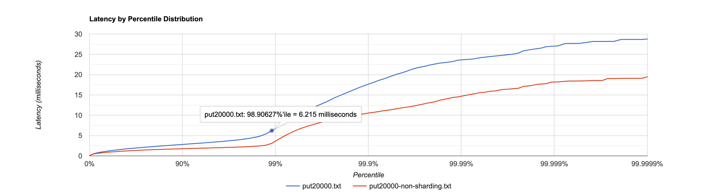

## Этап 3. Шардирование (bonus deadline 2022-10-12 23:59:59 MSK, hard deadline 2022-10-19 23:59:59 MSK)

Реализуем горизонтальное масштабирование через поддержку **кластерных конфигураций**, состоящих из нескольких узлов, взаимодействующих друг с другом через реализованный HTTP API.
Для этого в `ServiceConfig` передаётся статическая "топология", представленная в виде множества координат **всех** узлов кластера в формате `http://<host>:<port>`.

Кластер распределяет ключи между узлами **детерминированным образом**.
В кластере хранится **только одна** копия данных.
Нода, получившая запрос, **проксирует** его на узел, отвечающий за обслуживание соответствующего ключа.
Таким образом, общая ёмкость кластера равна суммарной ёмкости входящих в него узлов.

Реализуйте один из алгоритмов распределения данных между узлами, например, [consistent hashing](https://en.wikipedia.org/wiki/Consistent_hashing), [rendezvous hashing](https://en.wikipedia.org/wiki/Rendezvous_hashing) или что-то другое по согласованию с преподавателем.


# Отчет

Для шардирования данных необходимо выбрать стратегию по распределению нод по кластерам. Для этого используются различные 
алгоритмы выбора кластера для конкретного ключа. Рассмотрим наиболее популярные и эффективные их реализации и сравним 
распределение ключей.

Проверим насколько равномерная нагрузка на ноды:


RendezvousHashing:

Shards statistic:
http://localhost:42342=100731
http://localhost:32213=100345
http://localhost:4030=98497

Как видим нагрузка распределение довольно равномерное отклонение порядка 0.7%, что позволяет говорить, что 
RendezvousHashing хорошо справляется со своей задачей.

ConsistentHashing

Shards statistic:
http://localhost:42342=168082
http://localhost:32213=203011
http://localhost:4030=221186

Как видим нагрузка распределение довольно равномерное однако в данном случае отклонение между максимумом и минимумом
порядка 9%.

Исходя из результатов выбираем алгоритм Rendezvous Hashing, однако стоит помнить, что Rendezvous Hashing хорош если
количество кластеров не такое большое и если хэш функция считается достаточно быстро. В противном случае
асимптотическая разница в выборе кластера между O(log(N)) - Rendezvous Hashing и O(N) - ConsistentHashing, 
где N=кол-ва кластеров, может быть ощутимой.

Давайте протестируем наш сервер без шардирования и с ним и проанализируем результаты:

### PUT

#### Rate=50000

##### Результаты без шардирования

```
Running 1m test @ http://localhost:42342
6 threads and 64 connections
Thread calibration: mean lat.: 5.181ms, rate sampling interval: 10ms
Thread calibration: mean lat.: 5.507ms, rate sampling interval: 10ms
Thread calibration: mean lat.: 6.232ms, rate sampling interval: 10ms
Thread calibration: mean lat.: 5.383ms, rate sampling interval: 10ms
Thread calibration: mean lat.: 5.331ms, rate sampling interval: 10ms
Thread calibration: mean lat.: 4.350ms, rate sampling interval: 10ms
Thread Stats   Avg      Stdev     Max   +/- Stdev
Latency     8.62ms   24.02ms 214.66ms   91.82%
Req/Sec     8.86k     1.82k   31.10k    90.19%
Latency Distribution (HdrHistogram - Recorded Latency)
50.000%    1.41ms
75.000%    2.05ms
90.000%   19.39ms
99.000%  126.33ms
99.900%  172.16ms
99.990%  194.18ms
99.999%  211.71ms
100.000%  214.78ms

Detailed Percentile spectrum:
Value   Percentile   TotalCount 1/(1-Percentile)

       0.044     0.000000            1         1.00
       0.630     0.100000       249805         1.11
       0.845     0.200000       499621         1.25
       1.033     0.300000       748351         1.43
       1.218     0.400000       997818         1.67
       1.409     0.500000      1247305         2.00
       1.511     0.550000      1371959         2.22
       1.620     0.600000      1497344         2.50
       1.740     0.650000      1622132         2.86
       1.878     0.700000      1746431         3.33
       2.053     0.750000      1870897         4.00
       2.167     0.775000      1932971         4.44
       2.313     0.800000      1995449         5.00
       2.527     0.825000      2057725         5.71
       3.017     0.850000      2120090         6.67
       8.303     0.875000      2182346         8.00
      13.455     0.887500      2213529         8.89
      19.391     0.900000      2244753        10.00
      27.759     0.912500      2275877        11.43
      38.623     0.925000      2307070        13.33
      50.527     0.937500      2338243        16.00
      56.895     0.943750      2353792        17.78
      63.263     0.950000      2369409        20.00
      70.079     0.956250      2385116        22.86
      77.311     0.962500      2400646        26.67
      85.823     0.968750      2416237        32.00
      90.175     0.971875      2423980        35.56
      94.783     0.975000      2431792        40.00
     100.031     0.978125      2439583        45.71
     106.431     0.981250      2447354        53.33
     112.831     0.984375      2455123        64.00
     116.287     0.985938      2459017        71.11
     119.999     0.987500      2462905        80.00
     123.647     0.989062      2466830        91.43
     128.447     0.990625      2470703       106.67
     134.271     0.992188      2474621       128.00
     137.471     0.992969      2476563       142.22
     140.415     0.993750      2478530       160.00
     143.743     0.994531      2480481       182.86
     146.815     0.995313      2482412       213.33
     150.911     0.996094      2484337       256.00
     153.215     0.996484      2485362       284.44
     155.391     0.996875      2486293       320.00
     157.823     0.997266      2487315       365.71
     160.255     0.997656      2488285       426.67
     163.071     0.998047      2489227       512.00
     164.735     0.998242      2489722       568.89
     166.399     0.998437      2490182       640.00
     168.319     0.998633      2490688       731.43
     170.111     0.998828      2491165       853.33
     172.543     0.999023      2491673      1024.00
     173.695     0.999121      2491904      1137.78
     174.975     0.999219      2492130      1280.00
     176.511     0.999316      2492381      1462.86
     178.047     0.999414      2492617      1706.67
     179.711     0.999512      2492875      2048.00
     180.607     0.999561      2492994      2275.56
     181.503     0.999609      2493114      2560.00
     182.911     0.999658      2493240      2925.71
     184.319     0.999707      2493358      3413.33
     185.983     0.999756      2493471      4096.00
     186.623     0.999780      2493530      4551.11
     187.647     0.999805      2493594      5120.00
     188.671     0.999829      2493656      5851.43
     190.463     0.999854      2493715      6826.67
     192.127     0.999878      2493774      8192.00
     193.151     0.999890      2493805      9102.22
     194.303     0.999902      2493836     10240.00
     195.199     0.999915      2493869     11702.86
     195.967     0.999927      2493900     13653.33
     196.479     0.999939      2493928     16384.00
     196.991     0.999945      2493942     18204.44
     197.631     0.999951      2493960     20480.00
     198.911     0.999957      2493972     23405.71
     200.191     0.999963      2493987     27306.67
     201.215     0.999969      2494003     32768.00
     203.647     0.999973      2494010     36408.89
     206.079     0.999976      2494018     40960.00
     208.511     0.999979      2494025     46811.43
     209.407     0.999982      2494034     54613.33
     209.919     0.999985      2494041     65536.00
     210.047     0.999986      2494045     72817.78
     210.943     0.999988      2494049     81920.00
     211.199     0.999989      2494052     93622.86
     212.223     0.999991      2494056    109226.67
     212.479     0.999992      2494060    131072.00
     212.607     0.999993      2494061    145635.56
     212.863     0.999994      2494063    163840.00
     213.119     0.999995      2494066    187245.71
     213.247     0.999995      2494068    218453.33
     213.375     0.999996      2494071    262144.00
     213.375     0.999997      2494071    291271.11
     213.375     0.999997      2494071    327680.00
     213.503     0.999997      2494073    374491.43
     213.503     0.999998      2494073    436906.67
     213.631     0.999998      2494075    524288.00
     213.631     0.999998      2494075    582542.22
     213.631     0.999998      2494075    655360.00
     213.631     0.999999      2494075    748982.86
     213.759     0.999999      2494076    873813.33
     213.759     0.999999      2494076   1048576.00
     213.759     0.999999      2494076   1165084.44
     214.143     0.999999      2494077   1310720.00
     214.143     0.999999      2494077   1497965.71
     214.143     0.999999      2494077   1747626.67
     214.143     1.000000      2494077   2097152.00
     214.143     1.000000      2494077   2330168.89
     214.783     1.000000      2494078   2621440.00
     214.783     1.000000      2494078          inf
#[Mean    =        8.623, StdDeviation   =       24.021]
#[Max     =      214.656, Total count    =      2494078]
#[Buckets =           27, SubBuckets     =         2048]
----------------------------------------------------------
2995425 requests in 1.00m, 191.40MB read
Requests/sec:  49924.28
Transfer/sec:      3.19MB
```

#### Результаты c шардированием

```
Running 1m test @ http://localhost:42342
6 threads and 64 connections
Thread calibration: mean lat.: 1297.860ms, rate sampling interval: 4661ms
Thread calibration: mean lat.: 1297.147ms, rate sampling interval: 4653ms
Thread calibration: mean lat.: 1297.742ms, rate sampling interval: 4657ms
Thread calibration: mean lat.: 1303.427ms, rate sampling interval: 4681ms
Thread calibration: mean lat.: 1304.378ms, rate sampling interval: 4681ms
Thread calibration: mean lat.: 1298.607ms, rate sampling interval: 4661ms
Thread Stats   Avg      Stdev     Max   +/- Stdev
Latency     9.78s     4.33s   17.63s    56.93%
Req/Sec     5.87k   152.54     6.14k    63.33%
Latency Distribution (HdrHistogram - Recorded Latency)
50.000%    9.76s
75.000%   13.57s
90.000%   15.84s
99.000%   17.32s
99.900%   17.51s
99.990%   17.60s
99.999%   17.65s
100.000%   17.65s

Detailed Percentile spectrum:
Value   Percentile   TotalCount 1/(1-Percentile)

    2539.519     0.000000            2         1.00
    3844.095     0.100000       175407         1.11
    5193.727     0.200000       350802         1.25
    6680.575     0.300000       526136         1.43
    8228.863     0.400000       701271         1.67
    9764.863     0.500000       876461         2.00
10518.527     0.550000       964600         2.22
11247.615     0.600000      1052351         2.50
11894.783     0.650000      1139721         2.86
12746.751     0.700000      1227534         3.33
13574.143     0.750000      1314876         4.00
13959.167     0.775000      1359162         4.44
14319.615     0.800000      1402942         5.00
14663.679     0.825000      1446635         5.71
15015.935     0.850000      1490387         6.67
15417.343     0.875000      1533698         8.00
15630.335     0.887500      1556206         8.89
15835.135     0.900000      1577851        10.00
16039.935     0.912500      1599548        11.43
16236.543     0.925000      1621545        13.33
16424.959     0.937500      1643344        16.00
16523.263     0.943750      1654369        17.78
16621.567     0.950000      1665204        20.00
16728.063     0.956250      1676843        22.86
16826.367     0.962500      1687068        26.67
16941.055     0.968750      1698263        32.00
17006.591     0.971875      1705030        35.56
17055.743     0.975000      1710216        40.00
17104.895     0.978125      1714920        45.71
17170.431     0.981250      1721533        53.33
17219.583     0.984375      1726310        64.00
17252.351     0.985938      1729500        71.11
17268.735     0.987500      1731152        80.00
17301.503     0.989062      1734424        91.43
17334.271     0.990625      1737498       106.67
17367.039     0.992188      1740521       128.00
17367.039     0.992969      1740521       142.22
17383.423     0.993750      1742010       160.00
17399.807     0.994531      1743412       182.86
17416.191     0.995313      1744765       213.33
17432.575     0.996094      1746149       256.00
17448.959     0.996484      1747513       284.44
17448.959     0.996875      1747513       320.00
17465.343     0.997266      1748760       365.71
17465.343     0.997656      1748760       426.67
17481.727     0.998047      1749912       512.00
17481.727     0.998242      1749912       568.89
17498.111     0.998437      1750815       640.00
17498.111     0.998633      1750815       731.43
17498.111     0.998828      1750815       853.33
17514.495     0.999023      1751529      1024.00
17514.495     0.999121      1751529      1137.78
17514.495     0.999219      1751529      1280.00
17530.879     0.999316      1751990      1462.86
17530.879     0.999414      1751990      1706.67
17530.879     0.999512      1751990      2048.00
17547.263     0.999561      1752231      2275.56
17547.263     0.999609      1752231      2560.00
17547.263     0.999658      1752231      2925.71
17563.647     0.999707      1752436      3413.33
17563.647     0.999756      1752436      4096.00
17563.647     0.999780      1752436      4551.11
17563.647     0.999805      1752436      5120.00
17580.031     0.999829      1752580      5851.43
17580.031     0.999854      1752580      6826.67
17580.031     0.999878      1752580      8192.00
17596.415     0.999890      1752672      9102.22
17596.415     0.999902      1752672     10240.00
17596.415     0.999915      1752672     11702.86
17596.415     0.999927      1752672     13653.33
17596.415     0.999939      1752672     16384.00
17612.799     0.999945      1752723     18204.44
17612.799     0.999951      1752723     20480.00
17612.799     0.999957      1752723     23405.71
17612.799     0.999963      1752723     27306.67
17612.799     0.999969      1752723     32768.00
17629.183     0.999973      1752750     36408.89
17629.183     0.999976      1752750     40960.00
17629.183     0.999979      1752750     46811.43
17629.183     0.999982      1752750     54613.33
17629.183     0.999985      1752750     65536.00
17629.183     0.999986      1752750     72817.78
17645.567     0.999988      1752774     81920.00
17645.567     1.000000      1752774          inf
#[Mean    =     9778.991, StdDeviation   =     4333.318]
#[Max     =    17629.184, Total count    =      1752774]
#[Buckets =           27, SubBuckets     =         2048]
----------------------------------------------------------
2124549 requests in 1.00m, 124.96MB read
Requests/sec:  35409.47
Transfer/sec:      2.08MB
```

Как мы можем заметить при rate=50000 шардированный сервис захлебывается, в то время как реализация с предыдущего занятия
(асинхронная и без шардирования справляется.)

Rate=20000

#### Результаты c шардированием
```
Running 1m test @ http://localhost:42342
6 threads and 64 connections
Thread calibration: mean lat.: 5.898ms, rate sampling interval: 24ms
Thread calibration: mean lat.: 5.495ms, rate sampling interval: 22ms
Thread calibration: mean lat.: 5.810ms, rate sampling interval: 25ms
Thread calibration: mean lat.: 5.422ms, rate sampling interval: 21ms
Thread calibration: mean lat.: 6.023ms, rate sampling interval: 27ms
Thread calibration: mean lat.: 5.687ms, rate sampling interval: 24ms
Thread Stats   Avg      Stdev     Max   +/- Stdev
Latency     1.70ms    1.40ms  28.80ms   90.14%
Req/Sec     3.41k   150.01     4.87k    79.29%
Latency Distribution (HdrHistogram - Recorded Latency)
50.000%    1.50ms
75.000%    2.14ms
90.000%    2.82ms
99.000%    6.80ms
99.900%   17.69ms
99.990%   23.63ms
99.999%   26.99ms
100.000%   28.82ms

Detailed Percentile spectrum:
Value   Percentile   TotalCount 1/(1-Percentile)

       0.065     0.000000            1         1.00
       0.542     0.100000        99916         1.11
       0.831     0.200000       200088         1.25
       1.059     0.300000       300053         1.43
       1.272     0.400000       400033         1.67
       1.495     0.500000       499605         2.00
       1.611     0.550000       549691         2.22
       1.730     0.600000       599610         2.50
       1.853     0.650000       649630         2.86
       1.986     0.700000       699356         3.33
       2.137     0.750000       749511         4.00
       2.221     0.775000       774395         4.44
       2.315     0.800000       799493         5.00
       2.417     0.825000       824483         5.71
       2.531     0.850000       849373         6.67
       2.661     0.875000       874324         8.00
       2.735     0.887500       886792         8.89
       2.815     0.900000       899110        10.00
       2.913     0.912500       911798        11.43
       3.023     0.925000       924167        13.33
       3.159     0.937500       936639        16.00
       3.237     0.943750       942855        17.78
       3.327     0.950000       949077        20.00
       3.431     0.956250       955285        22.86
       3.555     0.962500       961497        26.67
       3.721     0.968750       967776        32.00
       3.823     0.971875       970907        35.56
       3.951     0.975000       974010        40.00
       4.115     0.978125       977163        45.71
       4.343     0.981250       980277        53.33
       4.699     0.984375       983356        64.00
       5.003     0.985938       984913        71.11
       5.467     0.987500       986482        80.00
       6.215     0.989062       988032        91.43
       7.179     0.990625       989598       106.67
       8.335     0.992188       991160       128.00
       8.943     0.992969       991939       142.22
       9.615     0.993750       992720       160.00
      10.319     0.994531       993497       182.86
      11.031     0.995313       994276       213.33
      11.927     0.996094       995061       256.00
      12.375     0.996484       995447       284.44
      12.879     0.996875       995836       320.00
      13.463     0.997266       996226       365.71
      14.255     0.997656       996621       426.67
      14.999     0.998047       997006       512.00
      15.447     0.998242       997203       568.89
      15.927     0.998437       997400       640.00
      16.495     0.998633       997594       731.43
      17.103     0.998828       997789       853.33
      17.743     0.999023       997982      1024.00
      18.095     0.999121       998082      1137.78
      18.559     0.999219       998178      1280.00
      18.959     0.999316       998275      1462.86
      19.535     0.999414       998373      1706.67
      20.143     0.999512       998471      2048.00
      20.431     0.999561       998520      2275.56
      20.815     0.999609       998567      2560.00
      21.311     0.999658       998616      2925.71
      21.727     0.999707       998666      3413.33
      22.095     0.999756       998714      4096.00
      22.367     0.999780       998739      4551.11
      22.591     0.999805       998762      5120.00
      22.847     0.999829       998788      5851.43
      22.991     0.999854       998811      6826.67
      23.279     0.999878       998836      8192.00
      23.535     0.999890       998848      9102.22
      23.663     0.999902       998861     10240.00
      23.743     0.999915       998873     11702.86
      23.887     0.999927       998884     13653.33
      24.207     0.999939       998897     16384.00
      24.319     0.999945       998904     18204.44
      24.463     0.999951       998909     20480.00
      24.607     0.999957       998915     23405.71
      24.751     0.999963       998921     27306.67
      24.959     0.999969       998927     32768.00
      25.071     0.999973       998930     36408.89
      25.311     0.999976       998933     40960.00
      25.887     0.999979       998936     46811.43
      26.143     0.999982       998939     54613.33
      26.399     0.999985       998942     65536.00
      26.559     0.999986       998944     72817.78
      26.895     0.999988       998945     81920.00
      26.991     0.999989       998947     93622.86
      27.087     0.999991       998948    109226.67
      27.663     0.999992       998950    131072.00
      27.679     0.999993       998951    145635.56
      27.679     0.999994       998951    163840.00
      27.711     0.999995       998952    187245.71
      27.919     0.999995       998953    218453.33
      28.175     0.999996       998954    262144.00
      28.175     0.999997       998954    291271.11
      28.175     0.999997       998954    327680.00
      28.191     0.999997       998955    374491.43
      28.191     0.999998       998955    436906.67
      28.671     0.999998       998956    524288.00
      28.671     0.999998       998956    582542.22
      28.671     0.999998       998956    655360.00
      28.671     0.999999       998956    748982.86
      28.671     0.999999       998956    873813.33
      28.815     0.999999       998957   1048576.00
      28.815     1.000000       998957          inf
#[Mean    =        1.699, StdDeviation   =        1.405]
#[Max     =       28.800, Total count    =       998957]
#[Buckets =           27, SubBuckets     =         2048]
----------------------------------------------------------
1199516 requests in 1.00m, 70.56MB read
Requests/sec:  19992.18
Transfer/sec:      1.18MB
```

#### Результаты без шардирования

```
    Running 1m test @ http://localhost:42342
  6 threads and 64 connections
  Thread calibration: mean lat.: 1.214ms, rate sampling interval: 10ms
  Thread calibration: mean lat.: 1.127ms, rate sampling interval: 10ms
  Thread calibration: mean lat.: 1.174ms, rate sampling interval: 10ms
  Thread calibration: mean lat.: 1.172ms, rate sampling interval: 10ms
  Thread calibration: mean lat.: 1.146ms, rate sampling interval: 10ms
  Thread calibration: mean lat.: 1.079ms, rate sampling interval: 10ms
  Thread Stats   Avg      Stdev     Max   +/- Stdev
    Latency     1.16ms  816.62us  19.58ms   91.38%
    Req/Sec     3.51k   326.39     8.80k    90.30%
  Latency Distribution (HdrHistogram - Recorded Latency)
 50.000%    1.08ms
 75.000%    1.45ms
 90.000%    1.77ms
 99.000%    3.62ms
 99.900%   10.54ms
 99.990%   14.69ms
 99.999%   18.17ms
100.000%   19.60ms

  Detailed Percentile spectrum:
       Value   Percentile   TotalCount 1/(1-Percentile)

       0.062     0.000000            1         1.00
       0.490     0.100000       100279         1.11
       0.662     0.200000       199822         1.25
       0.808     0.300000       300286         1.43
       0.944     0.400000       400296         1.67
       1.080     0.500000       499707         2.00
       1.150     0.550000       549870         2.22
       1.222     0.600000       599668         2.50
       1.296     0.650000       649852         2.86
       1.372     0.700000       699854         3.33
       1.452     0.750000       749511         4.00
       1.495     0.775000       774482         4.44
       1.540     0.800000       799216         5.00
       1.589     0.825000       824452         5.71
       1.641     0.850000       849190         6.67
       1.699     0.875000       874344         8.00
       1.731     0.887500       886735         8.89
       1.766     0.900000       899255        10.00
       1.805     0.912500       911872        11.43
       1.847     0.925000       924071        13.33
       1.898     0.937500       936712        16.00
       1.928     0.943750       942937        17.78
       1.960     0.950000       949155        20.00
       1.998     0.956250       955427        22.86
       2.043     0.962500       961595        26.67
       2.099     0.968750       967954        32.00
       2.131     0.971875       970938        35.56
       2.173     0.975000       974135        40.00
       2.223     0.978125       977155        45.71
       2.293     0.981250       980301        53.33
       2.401     0.984375       983423        64.00
       2.491     0.985938       984955        71.11
       2.653     0.987500       986504        80.00
       3.101     0.989062       988060        91.43
       4.021     0.990625       989622       106.67
       5.035     0.992188       991183       128.00
       5.551     0.992969       991968       142.22
       6.119     0.993750       992748       160.00
       6.663     0.994531       993527       182.86
       7.203     0.995313       994304       213.33
       7.723     0.996094       995087       256.00
       8.023     0.996484       995475       284.44
       8.335     0.996875       995873       320.00
       8.647     0.997266       996257       365.71
       8.983     0.997656       996653       426.67
       9.383     0.998047       997042       512.00
       9.575     0.998242       997231       568.89
       9.799     0.998437       997426       640.00
      10.063     0.998633       997628       731.43
      10.287     0.998828       997819       853.33
      10.583     0.999023       998015      1024.00
      10.719     0.999121       998110      1137.78
      10.895     0.999219       998206      1280.00
      11.119     0.999316       998307      1462.86
      11.327     0.999414       998404      1706.67
      11.631     0.999512       998500      2048.00
      11.815     0.999561       998549      2275.56
      11.991     0.999609       998597      2560.00
      12.183     0.999658       998645      2925.71
      12.495     0.999707       998696      3413.33
      12.879     0.999756       998743      4096.00
      13.103     0.999780       998767      4551.11
      13.287     0.999805       998792      5120.00
      13.703     0.999829       998816      5851.43
      14.015     0.999854       998840      6826.67
      14.407     0.999878       998865      8192.00
      14.511     0.999890       998877      9102.22
      14.735     0.999902       998889     10240.00
      14.999     0.999915       998902     11702.86
      15.279     0.999927       998913     13653.33
      15.615     0.999939       998926     16384.00
      15.703     0.999945       998934     18204.44
      15.911     0.999951       998939     20480.00
      16.015     0.999957       998944     23405.71
      16.343     0.999963       998951     27306.67
      16.447     0.999969       998956     32768.00
      16.559     0.999973       998959     36408.89
      16.639     0.999976       998963     40960.00
      17.119     0.999979       998966     46811.43
      17.263     0.999982       998968     54613.33
      17.615     0.999985       998971     65536.00
      17.711     0.999986       998973     72817.78
      17.791     0.999988       998974     81920.00
      18.175     0.999989       998976     93622.86
      18.207     0.999991       998977    109226.67
      18.367     0.999992       998979    131072.00
      18.431     0.999993       998980    145635.56
      18.431     0.999994       998980    163840.00
      18.447     0.999995       998981    187245.71
      18.479     0.999995       998982    218453.33
      18.559     0.999996       998983    262144.00
      18.559     0.999997       998983    291271.11
      18.559     0.999997       998983    327680.00
      19.039     0.999997       998984    374491.43
      19.039     0.999998       998984    436906.67
      19.103     0.999998       998985    524288.00
      19.103     0.999998       998985    582542.22
      19.103     0.999998       998985    655360.00
      19.103     0.999999       998985    748982.86
      19.103     0.999999       998985    873813.33
      19.599     0.999999       998986   1048576.00
      19.599     1.000000       998986          inf
#[Mean    =        1.164, StdDeviation   =        0.817]
#[Max     =       19.584, Total count    =       998986]
#[Buckets =           27, SubBuckets     =         2048]
----------------------------------------------------------
  1199545 requests in 1.00m, 76.65MB read
Requests/sec:  19992.59
Transfer/sec:      1.28MB
```



Заметим, что в обеих реализациях происходит резкий рост после 99 Percentile. Видим, что у нас реализация с шардированием
работает в ~1.4 раза медленее, что является хорошим результатом. Из-за использования шардирования у нас будет в
1 + 2/3 запросов = 5/3 = 1.6 раз больше запросов, однако удалось ускорить этот процесс из-за более эффективного разделения ресурсов,
а именно использование нескольких jvm со своей памятью и ресурсами, которые на них выделяет операционная система. 

### Get

#### Rate=20000

#### Результаты с шардированием

```

```

#### Результаты без шардирования

```
    
```

#### Rate=50000

#### Результаты с шардированием


```
    Running 1m test @ http://localhost:42342
  6 threads and 64 connections
  Thread calibration: mean lat.: 5565.761ms, rate sampling interval: 16531ms
  Thread calibration: mean lat.: 5518.920ms, rate sampling interval: 16457ms
  Thread calibration: mean lat.: 5357.910ms, rate sampling interval: 15654ms
  Thread calibration: mean lat.: 5720.972ms, rate sampling interval: 17203ms
  Thread calibration: mean lat.: 5674.425ms, rate sampling interval: 17203ms
  Thread calibration: mean lat.: 5682.388ms, rate sampling interval: 16728ms
  Thread Stats   Avg      Stdev     Max   +/- Stdev
    Latency     3.21s     3.88s   11.55s    78.18%
    Req/Sec    10.34k     1.28k   11.76k    40.00%
  Latency Distribution (HdrHistogram - Recorded Latency)
 50.000%  944.13ms
 75.000%    6.39s 
 90.000%    9.81s 
 99.000%   11.36s 
 99.900%   11.53s 
 99.990%   11.55s 
 99.999%   11.55s 
100.000%   11.56s 

  Detailed Percentile spectrum:
       Value   Percentile   TotalCount 1/(1-Percentile)

       0.048     0.000000            1         1.00
       0.836     0.100000       300269         1.11
       1.197     0.200000       599794         1.25
       1.578     0.300000       900202         1.43
       2.163     0.400000      1199704         1.67
     944.127     0.500000      1499289         2.00
    1988.607     0.550000      1649225         2.22
    3059.711     0.600000      1799292         2.50
    4141.055     0.650000      1949075         2.86
    5246.975     0.700000      2099445         3.33
    6393.855     0.750000      2249345         4.00
    6946.815     0.775000      2324150         4.44
    7516.159     0.800000      2399205         5.00
    8089.599     0.825000      2473980         5.71
    8667.135     0.850000      2549302         6.67
    9240.575     0.875000      2624230         8.00
    9527.295     0.887500      2661438         8.89
    9814.015     0.900000      2699491        10.00
   10100.735     0.912500      2737067        11.43
   10362.879     0.925000      2774717        13.33
   10584.063     0.937500      2811826        16.00
   10674.175     0.943750      2830552        17.78
   10731.519     0.950000      2850369        20.00
   10821.631     0.956250      2867855        22.86
   10887.167     0.962500      2887391        26.67
   10993.663     0.968750      2907132        32.00
   11018.239     0.971875      2916748        35.56
   11042.815     0.975000      2924242        40.00
   11108.351     0.978125      2933313        45.71
   11182.079     0.981250      2943145        53.33
   11247.615     0.984375      2952050        64.00
   11280.383     0.985938      2956540        71.11
   11313.151     0.987500      2961073        80.00
   11345.919     0.989062      2966039        91.43
   11378.687     0.990625      2971006       106.67
   11411.455     0.992188      2976038       128.00
   11427.839     0.992969      2978636       142.22
   11436.031     0.993750      2979960       160.00
   11452.415     0.994531      2982643       182.86
   11468.799     0.995313      2985378       213.33
   11476.991     0.996094      2986794       256.00
   11485.183     0.996484      2988208       284.44
   11493.375     0.996875      2989635       320.00
   11501.567     0.997266      2991144       365.71
   11509.759     0.997656      2992849       426.67
   11509.759     0.998047      2992849       512.00
   11517.951     0.998242      2994530       568.89
   11517.951     0.998437      2994530       640.00
   11517.951     0.998633      2994530       731.43
   11526.143     0.998828      2995951       853.33
   11526.143     0.999023      2995951      1024.00
   11526.143     0.999121      2995951      1137.78
   11534.335     0.999219      2996877      1280.00
   11534.335     0.999316      2996877      1462.86
   11534.335     0.999414      2996877      1706.67
   11542.527     0.999512      2997858      2048.00
   11542.527     0.999561      2997858      2275.56
   11542.527     0.999609      2997858      2560.00
   11542.527     0.999658      2997858      2925.71
   11542.527     0.999707      2997858      3413.33
   11542.527     0.999756      2997858      4096.00
   11542.527     0.999780      2997858      4551.11
   11550.719     0.999805      2998493      5120.00
   11550.719     0.999829      2998493      5851.43
   11550.719     0.999854      2998493      6826.67
   11550.719     0.999878      2998493      8192.00
   11550.719     0.999890      2998493      9102.22
   11550.719     0.999902      2998493     10240.00
   11550.719     0.999915      2998493     11702.86
   11550.719     0.999927      2998493     13653.33
   11550.719     0.999939      2998493     16384.00
   11550.719     0.999945      2998493     18204.44
   11550.719     0.999951      2998493     20480.00
   11550.719     0.999957      2998493     23405.71
   11550.719     0.999963      2998493     27306.67
   11550.719     0.999969      2998493     32768.00
   11550.719     0.999973      2998493     36408.89
   11550.719     0.999976      2998493     40960.00
   11550.719     0.999979      2998493     46811.43
   11550.719     0.999982      2998493     54613.33
   11550.719     0.999985      2998493     65536.00
   11550.719     0.999986      2998493     72817.78
   11550.719     0.999988      2998493     81920.00
   11550.719     0.999989      2998493     93622.86
   11550.719     0.999991      2998493    109226.67
   11550.719     0.999992      2998493    131072.00
   11550.719     0.999993      2998493    145635.56
   11550.719     0.999994      2998493    163840.00
   11550.719     0.999995      2998493    187245.71
   11550.719     0.999995      2998493    218453.33
   11550.719     0.999996      2998493    262144.00
   11550.719     0.999997      2998493    291271.11
   11550.719     0.999997      2998493    327680.00
   11550.719     0.999997      2998493    374491.43
   11550.719     0.999998      2998493    436906.67
   11550.719     0.999998      2998493    524288.00
   11550.719     0.999998      2998493    582542.22
   11550.719     0.999998      2998493    655360.00
   11550.719     0.999999      2998493    748982.86
   11550.719     0.999999      2998493    873813.33
   11550.719     0.999999      2998493   1048576.00
   11550.719     0.999999      2998493   1165084.44
   11550.719     0.999999      2998493   1310720.00
   11550.719     0.999999      2998493   1497965.71
   11550.719     0.999999      2998493   1747626.67
   11550.719     1.000000      2998493   2097152.00
   11550.719     1.000000      2998493   2330168.89
   11550.719     1.000000      2998493   2621440.00
   11550.719     1.000000      2998493   2995931.43
   11558.911     1.000000      2998494   3495253.33
   11558.911     1.000000      2998494          inf
#[Mean    =     3212.640, StdDeviation   =     3879.152]
#[Max     =    11550.720, Total count    =      2998494]
#[Buckets =           27, SubBuckets     =         2048]
----------------------------------------------------------
  2998750 requests in 1.00m, 199.46MB read
  Socket errors: connect 0, read 0, write 0, timeout 146
Requests/sec:  49980.51
Transfer/sec:      3.32MB
```


#### Результаты без шардирования

```
    Running 1m test @ http://localhost:42342
  6 threads and 64 connections
  Thread calibration: mean lat.: 328.531ms, rate sampling interval: 1732ms
  Thread calibration: mean lat.: 278.635ms, rate sampling interval: 1548ms
  Thread calibration: mean lat.: 281.943ms, rate sampling interval: 1551ms
  Thread calibration: mean lat.: 241.022ms, rate sampling interval: 1378ms
  Thread calibration: mean lat.: 255.269ms, rate sampling interval: 1423ms
  Thread calibration: mean lat.: 290.152ms, rate sampling interval: 1575ms
  Thread Stats   Avg      Stdev     Max   +/- Stdev
    Latency    82.44ms  225.49ms   1.03s    89.72%
    Req/Sec     8.17k   525.68     9.82k    85.57%
  Latency Distribution (HdrHistogram - Recorded Latency)
 50.000%    1.41ms
 75.000%    2.10ms
 90.000%  347.90ms
 99.000%  986.62ms
 99.900%    1.01s 
 99.990%    1.03s 
 99.999%    1.03s 
100.000%    1.03s 

  Detailed Percentile spectrum:
       Value   Percentile   TotalCount 1/(1-Percentile)

       0.045     0.000000            1         1.00
       0.609     0.100000       245411         1.11
       0.827     0.200000       490615         1.25
       1.021     0.300000       734415         1.43
       1.212     0.400000       979588         1.67
       1.410     0.500000      1224293         2.00
       1.515     0.550000      1346950         2.22
       1.627     0.600000      1469088         2.50
       1.752     0.650000      1592079         2.86
       1.899     0.700000      1714082         3.33
       2.095     0.750000      1836491         4.00
       2.229     0.775000      1897462         4.44
       2.419     0.800000      1958587         5.00
       2.783     0.825000      2019707         5.71
      33.183     0.850000      2080766         6.67
     207.743     0.875000      2142073         8.00
     268.799     0.887500      2172585         8.89
     347.903     0.900000      2203175        10.00
     460.287     0.912500      2233932        11.43
     532.479     0.925000      2264613        13.33
     559.103     0.937500      2295136        16.00
     585.215     0.943750      2310292        17.78
     674.815     0.950000      2325642        20.00
     759.807     0.956250      2340887        22.86
     852.991     0.962500      2356282        26.67
     905.215     0.968750      2371478        32.00
     949.247     0.971875      2379281        35.56
     958.975     0.975000      2386925        40.00
     965.119     0.978125      2394413        45.71
     971.775     0.981250      2402663        53.33
     976.895     0.984375      2410275        64.00
     979.455     0.985938      2414073        71.11
     982.015     0.987500      2417708        80.00
     985.087     0.989062      2421795        91.43
     987.647     0.990625      2425376       106.67
     990.719     0.992188      2429463       128.00
     991.743     0.992969      2430846       142.22
     993.279     0.993750      2432657       160.00
     995.327     0.994531      2434868       182.86
     997.375     0.995313      2436737       213.33
     999.423     0.996094      2438528       256.00
    1000.447     0.996484      2439380       284.44
    1001.983     0.996875      2440447       320.00
    1003.007     0.997266      2441299       365.71
    1004.543     0.997656      2442232       426.67
    1006.079     0.998047      2443267       512.00
    1007.103     0.998242      2443816       568.89
    1008.127     0.998437      2444342       640.00
    1008.639     0.998633      2444630       731.43
    1009.663     0.998828      2445108       853.33
    1011.199     0.999023      2445625      1024.00
    1012.223     0.999121      2445938      1137.78
    1012.735     0.999219      2446082      1280.00
    1014.271     0.999316      2446346      1462.86
    1015.807     0.999414      2446610      1706.67
    1017.343     0.999512      2446782      2048.00
    1018.367     0.999561      2446920      2275.56
    1018.879     0.999609      2446998      2560.00
    1019.903     0.999658      2447171      2925.71
    1020.415     0.999707      2447238      3413.33
    1021.951     0.999756      2447405      4096.00
    1022.463     0.999780      2447463      4551.11
    1022.975     0.999805      2447537      5120.00
    1022.975     0.999829      2447537      5851.43
    1023.487     0.999854      2447604      6826.67
    1024.511     0.999878      2447683      8192.00
    1025.023     0.999890      2447708      9102.22
    1025.535     0.999902      2447732     10240.00
    1026.047     0.999915      2447757     11702.86
    1026.559     0.999927      2447787     13653.33
    1027.071     0.999939      2447820     16384.00
    1027.071     0.999945      2447820     18204.44
    1027.583     0.999951      2447845     20480.00
    1028.095     0.999957      2447862     23405.71
    1028.607     0.999963      2447873     27306.67
    1029.119     0.999969      2447881     32768.00
    1029.631     0.999973      2447890     36408.89
    1030.143     0.999976      2447905     40960.00
    1030.143     0.999979      2447905     46811.43
    1030.655     0.999982      2447915     54613.33
    1031.167     0.999985      2447926     65536.00
    1031.167     0.999986      2447926     72817.78
    1031.167     0.999988      2447926     81920.00
    1031.679     0.999989      2447942     93622.86
    1031.679     0.999991      2447942    109226.67
    1031.679     0.999992      2447942    131072.00
    1031.679     0.999993      2447942    145635.56
    1031.679     0.999994      2447942    163840.00
    1031.679     0.999995      2447942    187245.71
    1032.191     0.999995      2447945    218453.33
    1032.191     0.999996      2447945    262144.00
    1032.703     0.999997      2447946    291271.11
    1033.215     0.999997      2447949    327680.00
    1033.215     0.999997      2447949    374491.43
    1033.215     0.999998      2447949    436906.67
    1033.727     0.999998      2447954    524288.00
    1033.727     1.000000      2447954          inf
#[Mean    =       82.443, StdDeviation   =      225.492]
#[Max     =     1033.216, Total count    =      2447954]
#[Buckets =           27, SubBuckets     =         2048]
----------------------------------------------------------
  2949279 requests in 1.00m, 188.14MB read
Requests/sec:  49155.18
Transfer/sec:      3.14MB
```

Как мы можем заметить при rate=50000 шардированный сервис захлебывается, в то время как реализация c предыдущего занятия
(асинхронная и без шардирования справляется).

### Выводы
Использование Rendezvous Hashing показало себя как хороший способ распределения ключей по кластерам. 
Ключи распределяются равномерно в ходе тестирования было зафиксировано отклонение не более 1%. 
Однако необходимо оптимизировать выделение памяти при хэшировании ключа, так более 20% аллокаций выделяется
на создание строки shard + key.

Видим, что в итоге получилось хорошее распределение по кластерам. Решение работает медленнее, что 
объясняется дополнительными затратами на пересылку 2/3 запросов в соседние кластера и так как мы делаем это через
одну ноду производительность конечно же падает. Однако видно, что даже в такой тестовой ситуации нам удается добится 
некоторого параллелизма, как например в примере с PUT запросами производительность упала не в 1.6 раза, а в 1.4.


