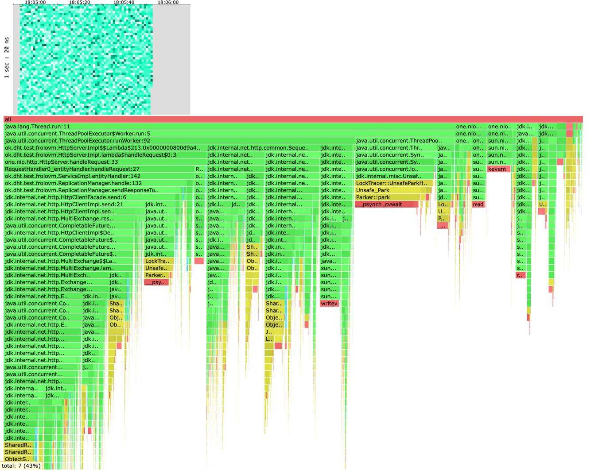
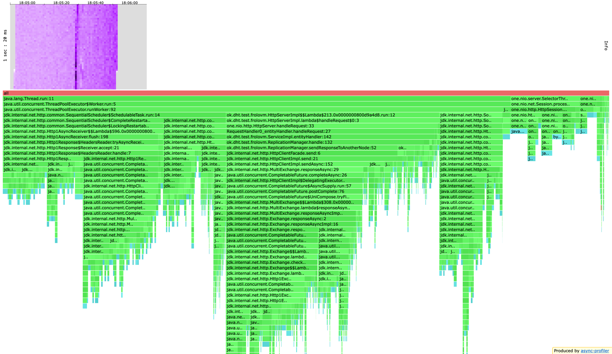
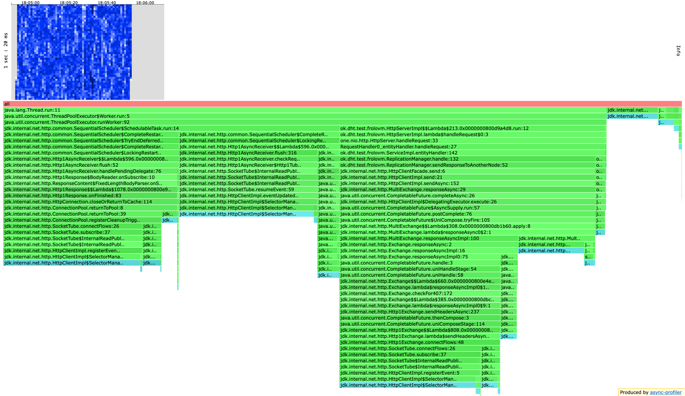
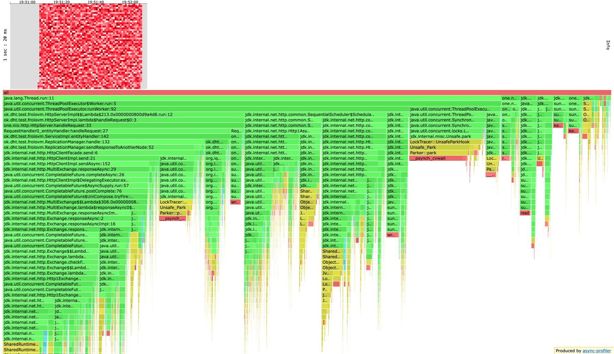
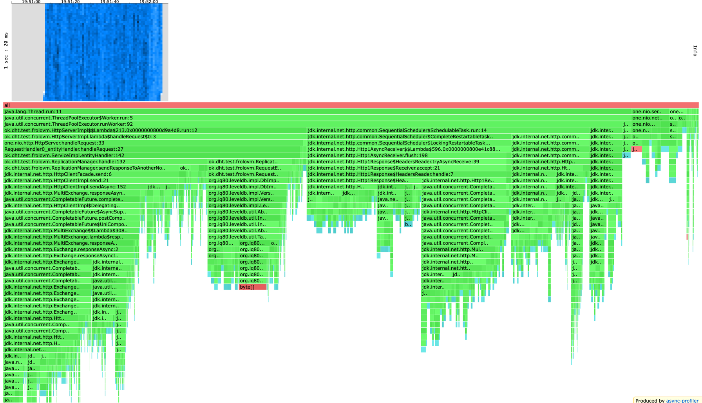
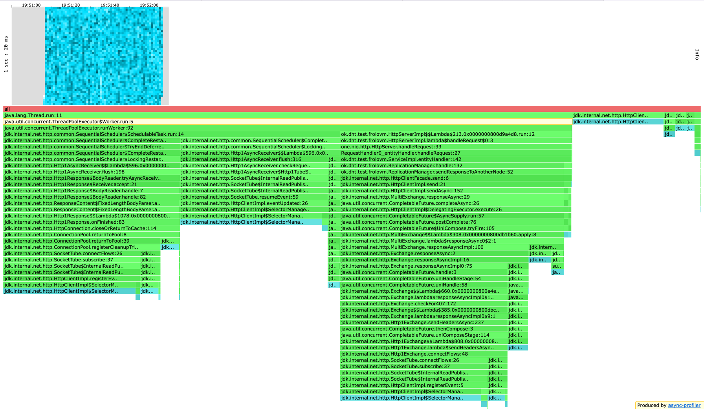
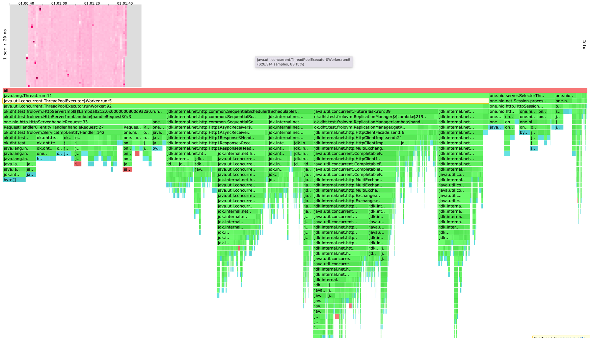
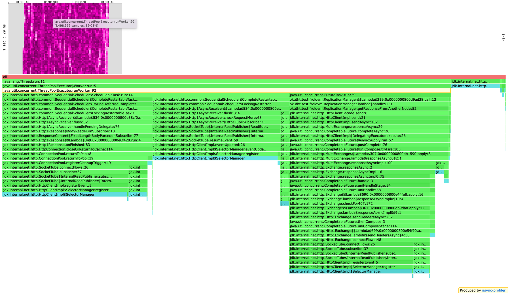

## Этап 4. Репликация (deadline 2022-10-26 23:59:59 MSK)

Реализуем поддержку хранения [нескольких реплик](https://en.wikipedia.org/wiki/Replication_(computing)) данных в кластере для обеспечения отказоустойчивости.

HTTP API расширяется query-параметром `replicas`, содержащим количество узлов, которые должны подтвердить операцию, чтобы она считалась выполненной успешно.
Значение параметра `replicas` указывается в формате `ack/from`, где:
* `ack` -- сколько ответов нужно получить
* `from` -- от какого количества узлов

Таким образом, теперь узлы должны поддерживать расширенный протокол (совместимый с предыдущей версией):
* HTTP `GET /v0/entity?id=<ID>[&replicas=ack/from]` -- получить данные по ключу `<ID>`. Возвращает:
    * `200 OK` и данные, если ответили хотя бы `ack` из `from` реплик
    * `404 Not Found`, если ни одна из `ack` реплик, вернувших ответ, не содержит данные (либо **самая свежая версия** среди `ack` ответов -- это tombstone)
    * `504 Not Enough Replicas`, если не получили `200`/`404` от `ack` реплик из всего множества `from` реплик

* HTTP `PUT /v0/entity?id=<ID>[&replicas=ack/from]` -- создать/перезаписать (upsert) данные по ключу `<ID>`. Возвращает:
    * `201 Created`, если хотя бы `ack` из `from` реплик подтвердили операцию
    * `504 Not Enough Replicas`, если не набралось `ack` подтверждений из всего множества `from` реплик

* HTTP `DELETE /v0/entity?id=<ID>[&replicas=ack/from]` -- удалить данные по ключу `<ID>`. Возвращает:
    * `202 Accepted`, если хотя бы `ack` из `from` реплик подтвердили операцию
    * `504 Not Enough Replicas`, если не набралось `ack` подтверждений из всего множества `from` реплик

Если параметр `replicas` не указан, то в качестве `ack` используется значение по умолчанию, равное **кворуму** от количества узлов в кластере, а `from` равен общему количеству узлов в кластере, например:
* `1/1` для кластера из одного узла
* `2/2` для кластера из двух узлов
* `2/3` для кластера из трёх узлов
* `3/4` для кластера из четырёх узлов
* `3/5` для кластера из пяти узлов

Выбор узлов-реплик (множества `from`) для каждого `<ID>` является **детерминированным**:
* Множество узлов-реплик для фиксированного ID и меньшего значения `from` является строгим подмножеством для большего значения `from`
* При `PUT` не сохраняется больше копий данных, чем указано в `from` (т.е. не стоит писать лишние копии данных на все реплики)

Фактически, с помощью параметра `replicas` клиент выбирает, сколько копий данных он хочет хранить, а также
уровень консистентности при выполнении последовательности операций для одного ID.

Таким образом, обеспечиваются следующие примеры инвариантов (список не исчерпывающий):
* `GET` с `1/2` всегда вернёт данные, сохранённые с помощью `PUT` с `2/2` (даже при недоступности одной реплики при `GET`)
* `GET` с `2/3` всегда вернёт данные, сохранённые с помощью `PUT` с `2/3` (даже при недоступности одной реплики при `GET`)
* `GET` с `1/2` "увидит" результат `DELETE` с `2/2` (даже при недоступности одной реплики при `GET`)
* `GET` с `2/3` "увидит" результат `DELETE` с `2/3` (даже при недоступности одной реплики при `GET`)
* `GET` с `1/2` может не "увидеть" результат `PUT` с `1/2`
* `GET` с `1/3` может не "увидеть" результат `PUT` с `2/3`
* `GET` с `1/2` может вернуть данные несмотря на предшествующий `DELETE` с `1/2`
* `GET` с `1/3` может вернуть данные несмотря на предшествующий `DELETE` с `2/3`
* `GET` с `ack` равным `quorum(from)` "увидит" результат `PUT`/`DELETE` с `ack` равным `quorum(from)` даже при недоступности **<** `quorum(from)` реплик

# Отчет

На данном этапе проекта добавилась поддержка нескольких реплик данных для обеспечения отказоустойчивости. Потребовалось реализовать синхронный случай репликации, 
а именно мы последовательно посылаем и обрабатываем запросы
на другие кластеры получая ack успешных запросов или сообщение, что кластера закончились и мы приостанавливаем запросы. Данный подход
позволяет настраивать на скольких репликах будут храниться данные и сколько необходимо реплик дл успешного выполнения запроса. 

Очевидно, что данный подход имеет неприятные последствия, а именно запросы начинают обрабатываться в ack раз медленнее,
увеличивается нагрузка на сеть, происходит активное ожидание и множество других проблем. Далее в отчете 
будет показано как это отразилось на производительности и потреблении ресурсов нашим сервисом.

### Данные

Для реализации репликации потребовалось для каждого значение в базе хранить не только сами данные, а еще время записи
(для того чтобы выбрать наиболее свежую из них), а также хранить флаг Tombstone(для того чтобы обрабатывать случаи удаления данных, 
в которых нужно понимать данных в базе нет из-за того что последней операцией мы их удалили или потому что их там никогда не было).

Для наиболее эффективного хранения решено было зарезервировать первые байты в каждой хранимой сущности под хранение 
timestamp(8 байт) и isTombstone(1 байт). Для наиболее эффективного преобразования из entity в timestamp, isTombstone, data
и наоборот.

Для реализации timestamp используется System.currentTimeMillis() в данном случае такое решение возможно, потому что
мы используем единый координатор для определения времени для одной и той же сущности. Существуют решения по типу 
часов Lamporta и векторных часов, которые позволяют добиться линеаризуемости, но в реальности их никто не использует
из-за больших накладных расходов требующихся для их пересчета. На практике можно например использовать 
[Spanner](https://cloud.google.com/spanner/docs/true-time-external-consistency) от Google или подобные решения, которые 
будут гарантировать линеаризуемость.

### Нагрузочное тестирование

Нагрузочное тестирование проводилось аналогично предыдущим этапам в 6 потоков и 64 соединения.

Проведем нагрузочное тестирование и сравним результаты с этапа шардирования и с текущего этапа.

### PUT

Найдем с каким rate справляется текущая реализация. Возьмем rate=20000, с которым справилась версия с этапа шардирования.

#### Rate 20000

```
Running 1m test @ http://localhost:42342
  6 threads and 64 connections
  Thread calibration: mean lat.: 3069.464ms, rate sampling interval: 10616ms
  Thread calibration: mean lat.: 2748.628ms, rate sampling interval: 9560ms
  Thread calibration: mean lat.: 3062.737ms, rate sampling interval: 10608ms
  Thread calibration: mean lat.: 3069.225ms, rate sampling interval: 10608ms
  Thread calibration: mean lat.: 3073.555ms, rate sampling interval: 10616ms
  Thread calibration: mean lat.: 3076.462ms, rate sampling interval: 10633ms
  Thread Stats   Avg      Stdev     Max   +/- Stdev
    Latency    20.20s     8.30s   35.03s    58.03%
    Req/Sec     1.40k    19.92     1.43k    52.00%
  Latency Distribution (HdrHistogram - Recorded Latency)
 50.000%   20.25s 
 75.000%   27.34s 
 90.000%   31.70s 
 99.000%   34.60s 
 99.900%   34.96s 
 99.990%   35.03s 
 99.999%   35.03s 
100.000%   35.06s 

  Detailed Percentile spectrum:
       Value   Percentile   TotalCount 1/(1-Percentile)

    5287.935     0.000000            1         1.00
    8699.903     0.100000        41805         1.11
   11509.759     0.200000        83551         1.25
   14450.687     0.300000       125374         1.43
   17416.191     0.400000       167163         1.67
   20250.623     0.500000       209025         2.00
   21676.031     0.550000       229814         2.22
   23035.903     0.600000       250928         2.50
   24412.159     0.650000       271682         2.86
   25853.951     0.700000       292609         3.33
   27344.895     0.750000       313363         4.00
   28016.639     0.775000       323960         4.44
   28688.383     0.800000       334398         5.00
   29392.895     0.825000       344881         5.71
   30081.023     0.850000       355288         6.67
   30883.839     0.875000       365578         8.00
   31309.823     0.887500       370870         8.89
   31703.039     0.900000       376001        10.00
   32129.023     0.912500       381395        11.43
   32555.007     0.925000       386618        13.33
   32948.223     0.937500       391704        16.00
   33144.831     0.943750       394356        17.78
   33341.439     0.950000       397043        20.00
   33538.047     0.956250       399580        22.86
   33751.039     0.962500       402463        26.67
   33914.879     0.968750       404722        32.00
   34013.183     0.971875       406127        35.56
   34111.487     0.975000       407426        40.00
   34209.791     0.978125       408778        45.71
   34308.095     0.981250       410143        53.33
   34406.399     0.984375       411480        64.00
   34439.167     0.985938       411928        71.11
   34504.703     0.987500       412721        80.00
   34570.239     0.989062       413451        91.43
   34635.775     0.990625       414111       106.67
   34701.311     0.992188       414798       128.00
   34734.079     0.992969       415169       142.22
   34734.079     0.993750       415169       160.00
   34766.847     0.994531       415531       182.86
   34799.615     0.995313       415901       213.33
   34832.383     0.996094       416288       256.00
   34832.383     0.996484       416288       284.44
   34865.151     0.996875       416664       320.00
   34865.151     0.997266       416664       365.71
   34897.919     0.997656       417011       426.67
   34897.919     0.998047       417011       512.00
   34930.687     0.998242       417326       568.89
   34930.687     0.998437       417326       640.00
   34930.687     0.998633       417326       731.43
   34930.687     0.998828       417326       853.33
   34963.455     0.999023       417563      1024.00
   34963.455     0.999121       417563      1137.78
   34963.455     0.999219       417563      1280.00
   34963.455     0.999316       417563      1462.86
   34963.455     0.999414       417563      1706.67
   34963.455     0.999512       417563      2048.00
   34996.223     0.999561       417702      2275.56
   34996.223     0.999609       417702      2560.00
   34996.223     0.999658       417702      2925.71
   34996.223     0.999707       417702      3413.33
   34996.223     0.999756       417702      4096.00
   34996.223     0.999780       417702      4551.11
   34996.223     0.999805       417702      5120.00
   34996.223     0.999829       417702      5851.43
   34996.223     0.999854       417702      6826.67
   34996.223     0.999878       417702      8192.00
   35028.991     0.999890       417747      9102.22
   35028.991     0.999902       417747     10240.00
   35028.991     0.999915       417747     11702.86
   35028.991     0.999927       417747     13653.33
   35028.991     0.999939       417747     16384.00
   35028.991     0.999945       417747     18204.44
   35028.991     0.999951       417747     20480.00
   35028.991     0.999957       417747     23405.71
   35028.991     0.999963       417747     27306.67
   35028.991     0.999969       417747     32768.00
   35028.991     0.999973       417747     36408.89
   35028.991     0.999976       417747     40960.00
   35028.991     0.999979       417747     46811.43
   35028.991     0.999982       417747     54613.33
   35028.991     0.999985       417747     65536.00
   35028.991     0.999986       417747     72817.78
   35028.991     0.999988       417747     81920.00
   35028.991     0.999989       417747     93622.86
   35061.759     0.999991       417751    109226.67
   35061.759     1.000000       417751          inf
#[Mean    =    20199.188, StdDeviation   =     8301.958]
#[Max     =    35028.992, Total count    =       417751]
#[Buckets =           27, SubBuckets     =         2048]
----------------------------------------------------------
  499007 requests in 1.00m, 31.88MB read
Requests/sec:   8316.74
Transfer/sec:    544.16KB
```

```
Requests/sec:   8316.74 

Latency:
Mean    =    20199.188
Max     =    35028.992
```

Как видим в этот раз сервис захлебнулся на 20000 put. Сервис обрабатывает лишь 8k из 20k. Latency очень большое, что
связано с тем, что запросы стали очень объемные, теперь каждый запрос дополнительно ходит в сеть, что как мы помним 
из результатов профилирования предыдущих этапов пагубно влияет на производительность.

Rate=10000
```
Running 1m test @ http://localhost:42342
  6 threads and 64 connections
  Thread calibration: mean lat.: 933.488ms, rate sampling interval: 3141ms
  Thread calibration: mean lat.: 936.323ms, rate sampling interval: 3153ms
  Thread calibration: mean lat.: 939.117ms, rate sampling interval: 3153ms
  Thread calibration: mean lat.: 934.859ms, rate sampling interval: 3153ms
  Thread calibration: mean lat.: 932.061ms, rate sampling interval: 3143ms
  Thread calibration: mean lat.: 930.381ms, rate sampling interval: 3129ms
  Thread Stats   Avg      Stdev     Max   +/- Stdev
    Latency     6.35s     3.05s   12.12s    55.87%
    Req/Sec     1.33k    60.28     1.44k    72.22%
  Latency Distribution (HdrHistogram - Recorded Latency)
 50.000%    6.01s 
 75.000%    9.13s 
 90.000%   10.73s 
 99.000%   11.79s 
 99.900%   11.98s 
 99.990%   12.07s 
 99.999%   12.12s 
100.000%   12.12s 

  Detailed Percentile spectrum:
       Value   Percentile   TotalCount 1/(1-Percentile)

    1613.823     0.000000            1         1.00
    2469.887     0.100000        39814         1.11
    3121.151     0.200000        79601         1.25
    4040.703     0.300000       119263         1.43
    4935.679     0.400000       159098         1.67
    6012.927     0.500000       198733         2.00
    6590.463     0.550000       218617         2.22
    7241.727     0.600000       238451         2.50
    7868.415     0.650000       258364         2.86
    8585.215     0.700000       278281         3.33
    9125.887     0.750000       298281         4.00
    9347.071     0.775000       308213         4.44
    9601.023     0.800000       318024         5.00
    9895.935     0.825000       328102         5.71
   10158.079     0.850000       337917         6.67
   10428.415     0.875000       347878         8.00
   10575.871     0.887500       352770         8.89
   10731.519     0.900000       357688        10.00
   10870.783     0.912500       362654        11.43
   11026.431     0.925000       367735        13.33
   11173.887     0.937500       372734        16.00
   11239.423     0.943750       375083        17.78
   11313.151     0.950000       377853        20.00
   11370.495     0.956250       380072        22.86
   11436.031     0.962500       382551        26.67
   11509.759     0.968750       385067        32.00
   11550.719     0.971875       386408        35.56
   11591.679     0.975000       387650        40.00
   11632.639     0.978125       388911        45.71
   11673.599     0.981250       390219        53.33
   11706.367     0.984375       391212        64.00
   11730.943     0.985938       391981        71.11
   11747.327     0.987500       392480        80.00
   11771.903     0.989062       393186        91.43
   11796.479     0.990625       393861       106.67
   11812.863     0.992188       394327       128.00
   11829.247     0.992969       394744       142.22
   11837.439     0.993750       394936       160.00
   11853.823     0.994531       395281       182.86
   11870.207     0.995313       395637       213.33
   11886.591     0.996094       395958       256.00
   11894.783     0.996484       396095       284.44
   11902.975     0.996875       396232       320.00
   11911.167     0.997266       396376       365.71
   11919.359     0.997656       396510       426.67
   11935.743     0.998047       396701       512.00
   11943.935     0.998242       396786       568.89
   11952.127     0.998437       396858       640.00
   11960.319     0.998633       396927       731.43
   11968.511     0.998828       397000       853.33
   11976.703     0.999023       397064      1024.00
   11976.703     0.999121       397064      1137.78
   11984.895     0.999219       397118      1280.00
   11993.087     0.999316       397168      1462.86
   12001.279     0.999414       397207      1706.67
   12009.471     0.999512       397241      2048.00
   12009.471     0.999561       397241      2275.56
   12017.663     0.999609       397276      2560.00
   12017.663     0.999658       397276      2925.71
   12025.855     0.999707       397297      3413.33
   12042.239     0.999756       397328      4096.00
   12042.239     0.999780       397328      4551.11
   12050.431     0.999805       397343      5120.00
   12050.431     0.999829       397343      5851.43
   12058.623     0.999854       397356      6826.67
   12066.815     0.999878       397369      8192.00
   12066.815     0.999890       397369      9102.22
   12075.007     0.999902       397381     10240.00
   12075.007     0.999915       397381     11702.86
   12075.007     0.999927       397381     13653.33
   12083.199     0.999939       397389     16384.00
   12083.199     0.999945       397389     18204.44
   12091.391     0.999951       397392     20480.00
   12099.583     0.999957       397395     23405.71
   12099.583     0.999963       397395     27306.67
   12107.775     0.999969       397399     32768.00
   12107.775     0.999973       397399     36408.89
   12115.967     0.999976       397406     40960.00
   12115.967     0.999979       397406     46811.43
   12115.967     0.999982       397406     54613.33
   12115.967     0.999985       397406     65536.00
   12115.967     0.999986       397406     72817.78
   12115.967     0.999988       397406     81920.00
   12115.967     0.999989       397406     93622.86
   12115.967     0.999991       397406    109226.67
   12115.967     0.999992       397406    131072.00
   12124.159     0.999993       397409    145635.56
   12124.159     1.000000       397409          inf
#[Mean    =     6346.459, StdDeviation   =     3047.092]
#[Max     =    12115.968, Total count    =       397409]
#[Buckets =           27, SubBuckets     =         2048]
----------------------------------------------------------
  480694 requests in 1.00m, 30.71MB read
Requests/sec:   8011.10
Transfer/sec:    524.16KB
```

```
Requests/sec:   8011.10

Latency:
Mean    =     6346.459
Max     =    12115.968
```

На 10000 так же не получилось добиться стабильной работы сервиса, постараемся уменьшить rate еще.

Rate=6000

```
Running 1m test @ http://localhost:42342
  6 threads and 64 connections
  Thread calibration: mean lat.: 2.768ms, rate sampling interval: 10ms
  Thread calibration: mean lat.: 2.677ms, rate sampling interval: 10ms
  Thread calibration: mean lat.: 2.478ms, rate sampling interval: 10ms
  Thread calibration: mean lat.: 2.645ms, rate sampling interval: 10ms
  Thread calibration: mean lat.: 2.716ms, rate sampling interval: 10ms
  Thread calibration: mean lat.: 2.792ms, rate sampling interval: 10ms
  Thread Stats   Avg      Stdev     Max   +/- Stdev
    Latency     3.86ms    5.61ms  80.38ms   96.00%
    Req/Sec     1.05k   194.10     2.20k    76.10%
  Latency Distribution (HdrHistogram - Recorded Latency)
 50.000%    2.88ms
 75.000%    3.70ms
 90.000%    4.81ms
 99.000%   36.80ms
 99.900%   59.68ms
 99.990%   71.10ms
 99.999%   76.10ms
100.000%   80.45ms

  Detailed Percentile spectrum:
       Value   Percentile   TotalCount 1/(1-Percentile)

       0.266     0.000000            1         1.00
       1.355     0.100000        30006         1.11
       1.943     0.200000        59955         1.25
       2.309     0.300000        89999         1.43
       2.601     0.400000       119883         1.67
       2.877     0.500000       149883         2.00
       3.017     0.550000       164980         2.22
       3.163     0.600000       179939         2.50
       3.319     0.650000       194818         2.86
       3.495     0.700000       209838         3.33
       3.697     0.750000       224905         4.00
       3.811     0.775000       232357         4.44
       3.935     0.800000       239822         5.00
       4.079     0.825000       247331         5.71
       4.251     0.850000       254829         6.67
       4.471     0.875000       262316         8.00
       4.619     0.887500       266072         8.89
       4.807     0.900000       269760        10.00
       5.075     0.912500       273538        11.43
       5.519     0.925000       277243        13.33
       6.427     0.937500       280986        16.00
       7.039     0.943750       282861        17.78
       7.767     0.950000       284720        20.00
       8.711     0.956250       286593        22.86
      10.119     0.962500       288470        26.67
      12.583     0.968750       290339        32.00
      14.319     0.971875       291275        35.56
      16.831     0.975000       292216        40.00
      20.207     0.978125       293150        45.71
      24.223     0.981250       294087        53.33
      28.463     0.984375       295022        64.00
      30.735     0.985938       295491        71.11
      33.087     0.987500       295960        80.00
      35.551     0.989062       296427        91.43
      37.855     0.990625       296901       106.67
      40.287     0.992188       297363       128.00
      41.567     0.992969       297601       142.22
      43.007     0.993750       297832       160.00
      44.575     0.994531       298065       182.86
      46.335     0.995313       298303       213.33
      48.415     0.996094       298534       256.00
      49.471     0.996484       298653       284.44
      50.623     0.996875       298769       320.00
      51.871     0.997266       298885       365.71
      53.215     0.997656       299003       426.67
      54.463     0.998047       299120       512.00
      55.615     0.998242       299181       568.89
      56.543     0.998437       299237       640.00
      57.375     0.998633       299295       731.43
      58.687     0.998828       299355       853.33
      59.743     0.999023       299412      1024.00
      60.607     0.999121       299441      1137.78
      61.535     0.999219       299471      1280.00
      62.335     0.999316       299502      1462.86
      63.231     0.999414       299529      1706.67
      64.511     0.999512       299558      2048.00
      65.215     0.999561       299573      2275.56
      65.983     0.999609       299588      2560.00
      66.495     0.999658       299603      2925.71
      67.519     0.999707       299618      3413.33
      68.671     0.999756       299631      4096.00
      69.247     0.999780       299642      4551.11
      69.631     0.999805       299646      5120.00
      69.887     0.999829       299653      5851.43
      70.463     0.999854       299661      6826.67
      70.783     0.999878       299668      8192.00
      71.039     0.999890       299672      9102.22
      71.295     0.999902       299676     10240.00
      71.679     0.999915       299679     11702.86
      71.999     0.999927       299684     13653.33
      72.127     0.999939       299686     16384.00
      72.575     0.999945       299688     18204.44
      73.087     0.999951       299690     20480.00
      73.151     0.999957       299692     23405.71
      73.727     0.999963       299694     27306.67
      74.047     0.999969       299695     32768.00
      74.239     0.999973       299696     36408.89
      74.367     0.999976       299697     40960.00
      74.815     0.999979       299698     46811.43
      75.583     0.999982       299699     54613.33
      75.647     0.999985       299700     65536.00
      75.647     0.999986       299700     72817.78
      76.095     0.999988       299701     81920.00
      76.095     0.999989       299701     93622.86
      77.567     0.999991       299702    109226.67
      77.567     0.999992       299702    131072.00
      77.567     0.999993       299702    145635.56
      78.591     0.999994       299703    163840.00
      78.591     0.999995       299703    187245.71
      78.591     0.999995       299703    218453.33
      78.591     0.999996       299703    262144.00
      78.591     0.999997       299703    291271.11
      80.447     0.999997       299704    327680.00
      80.447     1.000000       299704          inf
#[Mean    =        3.857, StdDeviation   =        5.613]
#[Max     =       80.384, Total count    =       299704]
#[Buckets =           27, SubBuckets     =         2048]
----------------------------------------------------------
  359885 requests in 1.00m, 23.00MB read
Requests/sec:   5997.92
Transfer/sec:    392.44KB
```

```
Requests/sec:   5997.92

Latency:
Mean    =        3.857
Max     =       80.384
```

Видим, что сервис справляется с 6000 запросов. Однако ближе к 100 percentile Latency начинает сильно расти.
Так же как и в этапе шардирования, только еще быстрее.  Далее на этапе профилирования мы увидим, что 
это происходит из-за большого использования Http Сlientом ресурсов: большим потреблением CPU,
аллокации памяти и взятием блокировок. 

### GET

Rate=18000

```
  Running 1m test @ http://localhost:42342
  6 threads and 64 connections
  Thread calibration: mean lat.: 3295.931ms, rate sampling interval: 10747ms
  Thread calibration: mean lat.: 3293.626ms, rate sampling interval: 10747ms
  Thread calibration: mean lat.: 3299.427ms, rate sampling interval: 10764ms
  Thread calibration: mean lat.: 3286.818ms, rate sampling interval: 10731ms
  Thread calibration: mean lat.: 3293.947ms, rate sampling interval: 10756ms
  Thread calibration: mean lat.: 3295.511ms, rate sampling interval: 10764ms
  Thread Stats   Avg      Stdev     Max   +/- Stdev
    Latency    20.94s     8.96s   36.24s    56.84%
    Req/Sec     1.18k    51.69     1.24k    50.00%
  Latency Distribution (HdrHistogram - Recorded Latency)
 50.000%   20.89s 
 75.000%   29.07s 
 90.000%   33.03s 
 99.000%   35.88s 
 99.900%   36.14s 
 99.990%   36.24s 
 99.999%   36.27s 
100.000%   36.27s 

  Detailed Percentile spectrum:
       Value   Percentile   TotalCount 1/(1-Percentile)

    5865.471     0.000000            1         1.00
    8364.031     0.100000        35510         1.11
   11452.415     0.200000        71063         1.25
   14737.407     0.300000       106538         1.43
   17727.487     0.400000       141987         1.67
   20889.599     0.500000       177447         2.00
   22659.071     0.550000       195220         2.22
   24100.863     0.600000       212947         2.50
   26017.791     0.650000       230696         2.86
   27508.735     0.700000       248500         3.33
   29065.215     0.750000       266314         4.00
   29736.959     0.775000       275195         4.44
   30359.551     0.800000       284013         5.00
   30998.527     0.825000       292959         5.71
   31670.271     0.850000       301697         6.67
   32325.631     0.875000       310582         8.00
   32702.463     0.887500       315073         8.89
   33030.143     0.900000       319399        10.00
   33406.975     0.912500       323978        11.43
   33849.343     0.925000       328472        13.33
   34209.791     0.937500       332811        16.00
   34471.935     0.943750       335030        17.78
   34668.543     0.950000       337290        20.00
   34865.151     0.956250       339702        22.86
   35028.991     0.962500       341587        26.67
   35258.367     0.968750       344032        32.00
   35356.671     0.971875       345093        35.56
   35454.975     0.975000       346309        40.00
   35553.279     0.978125       347421        45.71
   35651.583     0.981250       348447        53.33
   35749.887     0.984375       349642        64.00
   35782.655     0.985938       350109        71.11
   35815.423     0.987500       350550        80.00
   35880.959     0.989062       351412        91.43
   35913.727     0.990625       351850       106.67
   35946.495     0.992188       352266       128.00
   35979.263     0.992969       352681       142.22
   35979.263     0.993750       352681       160.00
   36012.031     0.994531       353081       182.86
   36044.799     0.995313       353453       213.33
   36077.567     0.996094       353861       256.00
   36077.567     0.996484       353861       284.44
   36077.567     0.996875       353861       320.00
   36110.335     0.997266       354285       365.71
   36110.335     0.997656       354285       426.67
   36110.335     0.998047       354285       512.00
   36110.335     0.998242       354285       568.89
   36143.103     0.998437       354558       640.00
   36143.103     0.998633       354558       731.43
   36143.103     0.998828       354558       853.33
   36143.103     0.999023       354558      1024.00
   36175.871     0.999121       354740      1137.78
   36175.871     0.999219       354740      1280.00
   36175.871     0.999316       354740      1462.86
   36175.871     0.999414       354740      1706.67
   36175.871     0.999512       354740      2048.00
   36175.871     0.999561       354740      2275.56
   36175.871     0.999609       354740      2560.00
   36208.639     0.999658       354818      2925.71
   36208.639     0.999707       354818      3413.33
   36208.639     0.999756       354818      4096.00
   36208.639     0.999780       354818      4551.11
   36208.639     0.999805       354818      5120.00
   36208.639     0.999829       354818      5851.43
   36241.407     0.999854       354863      6826.67
   36241.407     0.999878       354863      8192.00
   36241.407     0.999890       354863      9102.22
   36241.407     0.999902       354863     10240.00
   36241.407     0.999915       354863     11702.86
   36241.407     0.999927       354863     13653.33
   36241.407     0.999939       354863     16384.00
   36241.407     0.999945       354863     18204.44
   36241.407     0.999951       354863     20480.00
   36241.407     0.999957       354863     23405.71
   36241.407     0.999963       354863     27306.67
   36241.407     0.999969       354863     32768.00
   36241.407     0.999973       354863     36408.89
   36241.407     0.999976       354863     40960.00
   36274.175     0.999979       354871     46811.43
   36274.175     1.000000       354871          inf
#[Mean    =    20942.661, StdDeviation   =     8961.385]
#[Max     =    36241.408, Total count    =       354871]
#[Buckets =           27, SubBuckets     =         2048]
----------------------------------------------------------
  428996 requests in 1.00m, 27.37MB read
Requests/sec:   7149.90
Transfer/sec:    467.03KB
```

Видим аналогичную put картину в этот раз сервис захлебнулся на 18000 get.

Rate=10000

```
  Running 1m test @ http://localhost:42342
  6 threads and 64 connections
  Thread calibration: mean lat.: 1070.609ms, rate sampling interval: 3784ms
  Thread calibration: mean lat.: 1068.928ms, rate sampling interval: 3786ms
  Thread calibration: mean lat.: 1070.836ms, rate sampling interval: 3778ms
  Thread calibration: mean lat.: 1075.986ms, rate sampling interval: 3788ms
  Thread calibration: mean lat.: 1065.362ms, rate sampling interval: 3770ms
  Thread calibration: mean lat.: 1077.860ms, rate sampling interval: 3794ms
  Thread Stats   Avg      Stdev     Max   +/- Stdev
    Latency     7.78s     3.33s   13.46s    56.19%
    Req/Sec     1.29k    35.31     1.37k    61.54%
  Latency Distribution (HdrHistogram - Recorded Latency)
 50.000%    7.65s 
 75.000%   10.88s 
 90.000%   12.42s 
 99.000%   13.21s 
 99.900%   13.34s 
 99.990%   13.43s 
 99.999%   13.47s 
100.000%   13.47s 

  Detailed Percentile spectrum:
       Value   Percentile   TotalCount 1/(1-Percentile)

    1936.383     0.000000            1         1.00
    3235.839     0.100000        38763         1.11
    4313.087     0.200000        77616         1.25
    5447.679     0.300000       116335         1.43
    6602.751     0.400000       155150         1.67
    7651.327     0.500000       193835         2.00
    8228.863     0.550000       213125         2.22
    8871.935     0.600000       232610         2.50
    9551.871     0.650000       252007         2.86
   10248.191     0.700000       271274         3.33
   10878.975     0.750000       290662         4.00
   11132.927     0.775000       300475         4.44
   11354.111     0.800000       310132         5.00
   11583.487     0.825000       319952         5.71
   11886.591     0.850000       329570         6.67
   12132.351     0.875000       339239         8.00
   12271.615     0.887500       344083         8.89
   12419.071     0.900000       348762        10.00
   12550.143     0.912500       353763        11.43
   12648.447     0.925000       358567        13.33
   12738.559     0.937500       363470        16.00
   12787.711     0.943750       365877        17.78
   12836.863     0.950000       368293        20.00
   12886.015     0.956250       370604        22.86
   12943.359     0.962500       373229        26.67
   13000.703     0.968750       375543        32.00
   13033.471     0.971875       376876        35.56
   13058.047     0.975000       377892        40.00
   13090.815     0.978125       379242        45.71
   13123.583     0.981250       380572        53.33
   13148.159     0.984375       381619        64.00
   13164.543     0.985938       382279        71.11
   13180.927     0.987500       382890        80.00
   13197.311     0.989062       383539        91.43
   13213.695     0.990625       384194       106.67
   13230.079     0.992188       384779       128.00
   13230.079     0.992969       384779       142.22
   13238.271     0.993750       385102       160.00
   13254.655     0.994531       385559       182.86
   13262.847     0.995313       385786       213.33
   13271.039     0.996094       385987       256.00
   13279.231     0.996484       386145       284.44
   13287.423     0.996875       386308       320.00
   13295.615     0.997266       386447       365.71
   13311.999     0.997656       386715       426.67
   13320.191     0.998047       386853       512.00
   13320.191     0.998242       386853       568.89
   13328.383     0.998437       386957       640.00
   13336.575     0.998633       387056       731.43
   13336.575     0.998828       387056       853.33
   13352.959     0.999023       387209      1024.00
   13352.959     0.999121       387209      1137.78
   13352.959     0.999219       387209      1280.00
   13361.151     0.999316       387287      1462.86
   13361.151     0.999414       387287      1706.67
   13369.343     0.999512       387337      2048.00
   13369.343     0.999561       387337      2275.56
   13377.535     0.999609       387377      2560.00
   13377.535     0.999658       387377      2925.71
   13385.727     0.999707       387402      3413.33
   13385.727     0.999756       387402      4096.00
   13393.919     0.999780       387416      4551.11
   13402.111     0.999805       387430      5120.00
   13402.111     0.999829       387430      5851.43
   13410.303     0.999854       387442      6826.67
   13418.495     0.999878       387453      8192.00
   13418.495     0.999890       387453      9102.22
   13426.687     0.999902       387460     10240.00
   13434.879     0.999915       387464     11702.86
   13443.071     0.999927       387466     13653.33
   13451.263     0.999939       387471     16384.00
   13459.455     0.999945       387488     18204.44
   13459.455     0.999951       387488     20480.00
   13459.455     0.999957       387488     23405.71
   13459.455     0.999963       387488     27306.67
   13459.455     0.999969       387488     32768.00
   13459.455     0.999973       387488     36408.89
   13459.455     0.999976       387488     40960.00
   13459.455     0.999979       387488     46811.43
   13459.455     0.999982       387488     54613.33
   13467.647     0.999985       387494     65536.00
   13467.647     1.000000       387494          inf
#[Mean    =     7779.364, StdDeviation   =     3325.681]
#[Max     =    13459.456, Total count    =       387494]
#[Buckets =           27, SubBuckets     =         2048]
----------------------------------------------------------
  467016 requests in 1.00m, 29.79MB read
Requests/sec:   7783.51
Transfer/sec:    508.42KB
```

Все еще захлеб пробуем уменьшить.

Rate=7000

```
Running 1m test @ http://localhost:42342
  6 threads and 64 connections
  Thread calibration: mean lat.: 3.876ms, rate sampling interval: 16ms
  Thread calibration: mean lat.: 3.732ms, rate sampling interval: 16ms
  Thread calibration: mean lat.: 3.898ms, rate sampling interval: 16ms
  Thread calibration: mean lat.: 3.892ms, rate sampling interval: 16ms
  Thread calibration: mean lat.: 3.875ms, rate sampling interval: 16ms
  Thread calibration: mean lat.: 4.205ms, rate sampling interval: 16ms
  Thread Stats   Avg      Stdev     Max   +/- Stdev
    Latency     3.04ms    4.18ms  62.08ms   93.37%
    Req/Sec     1.20k   106.14     1.87k    71.50%
  Latency Distribution (HdrHistogram - Recorded Latency)
 50.000%    1.94ms
 75.000%    2.87ms
 90.000%    5.26ms
 99.000%   24.64ms
 99.900%   42.08ms
 99.990%   50.91ms
 99.999%   57.89ms
100.000%   62.11ms

  Detailed Percentile spectrum:
       Value   Percentile   TotalCount 1/(1-Percentile)

       0.291     0.000000            1         1.00
       1.004     0.100000        35027         1.11
       1.268     0.200000        69949         1.25
       1.490     0.300000       104967         1.43
       1.706     0.400000       139914         1.67
       1.937     0.500000       174844         2.00
       2.067     0.550000       192446         2.22
       2.211     0.600000       209826         2.50
       2.379     0.650000       227274         2.86
       2.589     0.700000       244798         3.33
       2.865     0.750000       262284         4.00
       3.041     0.775000       271005         4.44
       3.261     0.800000       279743         5.00
       3.535     0.825000       288497         5.71
       3.903     0.850000       297235         6.67
       4.435     0.875000       305944         8.00
       4.803     0.887500       310321         8.89
       5.263     0.900000       314694        10.00
       5.847     0.912500       319076        11.43
       6.595     0.925000       323447        13.33
       7.535     0.937500       327807        16.00
       8.115     0.943750       329993        17.78
       8.807     0.950000       332181        20.00
       9.671     0.956250       334362        22.86
      10.831     0.962500       336548        26.67
      12.527     0.968750       338728        32.00
      13.671     0.971875       339817        35.56
      15.015     0.975000       340909        40.00
      16.527     0.978125       342011        45.71
      18.207     0.981250       343106        53.33
      20.143     0.984375       344192        64.00
      21.247     0.985938       344737        71.11
      22.415     0.987500       345280        80.00
      23.823     0.989062       345832        91.43
      25.247     0.990625       346373       106.67
      26.943     0.992188       346921       128.00
      28.111     0.992969       347193       142.22
      29.135     0.993750       347466       160.00
      30.383     0.994531       347739       182.86
      31.743     0.995313       348015       213.33
      33.151     0.996094       348292       256.00
      33.951     0.996484       348421       284.44
      34.783     0.996875       348558       320.00
      35.679     0.997266       348695       365.71
      36.671     0.997656       348832       426.67
      37.951     0.998047       348968       512.00
      38.783     0.998242       349038       568.89
      39.455     0.998437       349104       640.00
      40.415     0.998633       349173       731.43
      41.343     0.998828       349243       853.33
      42.239     0.999023       349311      1024.00
      42.687     0.999121       349344      1137.78
      43.263     0.999219       349380      1280.00
      44.031     0.999316       349411      1462.86
      44.863     0.999414       349448      1706.67
      45.663     0.999512       349481      2048.00
      46.079     0.999561       349499      2275.56
      46.431     0.999609       349515      2560.00
      46.815     0.999658       349531      2925.71
      47.295     0.999707       349549      3413.33
      47.711     0.999756       349565      4096.00
      47.967     0.999780       349574      4551.11
      48.223     0.999805       349582      5120.00
      48.575     0.999829       349591      5851.43
      49.343     0.999854       349599      6826.67
      49.919     0.999878       349608      8192.00
      50.655     0.999890       349612      9102.22
      51.519     0.999902       349616     10240.00
      52.159     0.999915       349621     11702.86
      52.767     0.999927       349625     13653.33
      53.599     0.999939       349629     16384.00
      54.047     0.999945       349631     18204.44
      54.591     0.999951       349634     20480.00
      54.943     0.999957       349636     23405.71
      55.359     0.999963       349638     27306.67
      55.999     0.999969       349640     32768.00
      56.191     0.999973       349641     36408.89
      56.383     0.999976       349642     40960.00
      56.639     0.999979       349643     46811.43
      56.927     0.999982       349644     54613.33
      57.119     0.999985       349645     65536.00
      57.471     0.999986       349646     72817.78
      57.471     0.999988       349646     81920.00
      57.887     0.999989       349647     93622.86
      57.887     0.999991       349647    109226.67
      59.231     0.999992       349648    131072.00
      59.231     0.999993       349648    145635.56
      59.231     0.999994       349648    163840.00
      60.543     0.999995       349649    187245.71
      60.543     0.999995       349649    218453.33
      60.543     0.999996       349649    262144.00
      60.543     0.999997       349649    291271.11
      60.543     0.999997       349649    327680.00
      62.111     0.999997       349650    374491.43
      62.111     1.000000       349650          inf
#[Mean    =        3.040, StdDeviation   =        4.178]
#[Max     =       62.080, Total count    =       349650]
#[Buckets =           27, SubBuckets     =         2048]
----------------------------------------------------------
  419861 requests in 1.00m, 26.78MB read
Requests/sec:   6997.65
Transfer/sec:    457.09KB

```

Видим, что Get справился с 7000 запросов. Get на предыдущих этапах был более долгой операцией. \
Однако при добавлении репликаций, при операции Get Requests/sec больше, чем в Put, так как в случае,
если мы получили ack подтверждений для Get мы не ждем остальные ноды и сразу возвращаем ответ.

```
Requests/sec:   6997.65

Latency:
Mean    =        3.040
Max     =       62.080
```

### Результаты профилирования:

### CPU



Картина похожа на ту которая была при шардировании, так как операции остались те же самые просто мы выполняем их 
на нескольких репликах. Вырос процент работы, который уходит на отправку запроса на другие ноды (sendResponseToAnotherNode) 
с 24% до 32% от CPU. 

Одновременно с этим уменьшился в процентном соотношении send response с 4% до 2%, но responses на главной ноде мы возвращаем столько же.
Значит то же количество responses теперь требует в 2 раза меньше ресурсов.
Тогда мы можем примерно пересчитать насколько изменились все остальные значения. Из этого получается мы тратим на пересылку 
сообщений между нодами(sendResponseToAnotherNode) ~2.66 раза больше ресурсов CPU, что следует из нашей реализации 
кворума(по умолчанию ack = from / 2 + 1, from = clasters.size).

В целом использование HTTP client для отправки запросов на другие кластеры приводит к дополнительному оверхэду.
Протокол HTTP содержит в себе множество накладных расходов, из-за чего мы тратим слишком много ресурсов
на отправку и получение ответа, а мы при реализации шардирования в несколько раз увеличили количество 
пересылаемых requests и responses, что ведет к замедлению работы.

В данном случае хотелось бы использовать другой подход к реализации клиента. Текущая реализация с 
Сompletable future вызывает get waiting и паркуется, что кажется не самым эффективным решением. На данном этапе это становится
критичным, потому что у нас сильно увеличивается кол-во responses, которые посылают между собой кластера. 
В связи с этим в следующем задании можно будет улучшить нашу реализацию путем добавления и реализации асинхронного клиента.

Также около 0.8% тратиться на создание client request builder. Данный код можно оптимизировать передавая данные 
в более сжатом формате(сократив размер хэдера), либо использовать GRPS и передавать только данные с минимумом 
дополнительной информации.

Put занимает порядка 1% от общего CPU раньше было 0.7%, что немного выше, чем было до этого и связано с тем,
что мы кладем еще timestamp и tombstone.

Поскольку репликация была реализована эффективно и выбор шарда происходит один раз на Coordinatorе, то 
в процентном соотношении выбор шарда уменьшился с 0.25% до 0.09%.

### ALLOC
  


Selector Thread аллоцирует порядка 8.5% на работу с byte[] и String для чтения данных и создание HTTPBuffer в предыдущей 
версии было 12%. В основном связано с перераспределением процентов теперь http client потребляет больше ресурсов.

Выросло с 72% до 86% аллокация памяти в ThreadPollExecutor. Как и в предыдущем этапе почти вся память выделяется на нужды
HTTPClient. Большая часть памяти аллоцируется для byte[], часть аллоцируется для асинхронной
работы, работы с future, создание блокировок, большая часть уходит на обработку headers. 
Так как мы добавили header timestamp, то аллокаций на обработку request и reponse в HTTP client также выросли: 

Много аллокаций приходится Completeble future на handle response в Http Client, так доля в процентах выросла с 
7% до 13%, что опять же говорит о том, что сильно выросли затраты на сеть.

Также выросли затраты на Client request builder c 1% до 1.6%. Как я уже писал в CPU: \
Данный код можно оптимизировать передавая данные
в более сжатом формате(сократив размер хэдера), либо использовать GRPS и передавать только данные с минимумом
дополнительной информации.

### LOCK



HttpClient Selector Manager увеличился с 7 до 9%, так как запросов стало значительно больше и выросли затраты на добавление в очередь selectов.

80% lock занимает HTTP client. Мы видим, что Http Client крайне
неэффективно использует локи по сути локи для обработки данных становятся не существенными.

Так как наибольшую часть ресурсов потребляет HttpClient результаты профилирования для GET практически не отличаются от PUT.
Однако это невилируется затратами на HttpClient. Get запрос в базу аналогично с PUT занимает порядка 1% от общего CPU раньше было 0.8%, 
что немного выше, чем было до этого и связано с тем, что мы кладем больше дополнительной информации.

### GET

### CPU



### ALLOC



### LOCK




### Давайте попробуем несколько улучшить ситуацию с запросами.
В изначальной реализации я отправлял запрос, дожидался ответа и по новой. Давайте улучшим реализацию, заведем executor
service и сначала отправим все запросы асинхронно, а потом будем по очереди их ждать future.get().

### PUT

Rate = 6000

```
Running 1m test @ http://localhost:42342
  6 threads and 64 connections
  Thread calibration: mean lat.: 121.752ms, rate sampling interval: 453ms
  Thread calibration: mean lat.: 124.892ms, rate sampling interval: 464ms
  Thread calibration: mean lat.: 121.629ms, rate sampling interval: 454ms
  Thread calibration: mean lat.: 121.998ms, rate sampling interval: 450ms
  Thread calibration: mean lat.: 122.751ms, rate sampling interval: 458ms
  Thread calibration: mean lat.: 122.008ms, rate sampling interval: 454ms
  Thread Stats   Avg      Stdev     Max   +/- Stdev
    Latency    63.41ms  139.96ms 996.86ms   95.08%
    Req/Sec     0.98k    77.55     1.10k    86.13%
  Latency Distribution (HdrHistogram - Recorded Latency)
 50.000%   16.14ms
 75.000%   69.06ms
 90.000%  127.17ms
 99.000%  921.09ms
 99.900%  984.06ms
 99.990%  992.77ms
 99.999%  997.38ms
100.000%  997.38ms

  Detailed Percentile spectrum:
       Value   Percentile   TotalCount 1/(1-Percentile)

       0.327     0.000000            1         1.00
       2.897     0.100000        29432         1.11
       4.223     0.200000        58821         1.25
       6.367     0.300000        88231         1.43
      10.495     0.400000       117678         1.67
      16.143     0.500000       147059         2.00
      21.551     0.550000       161751         2.22
      35.071     0.600000       176451         2.50
      47.167     0.650000       191164         2.86
      58.015     0.700000       205892         3.33
      69.055     0.750000       220659         4.00
      73.791     0.775000       227931         4.44
      79.039     0.800000       235286         5.00
      87.039     0.825000       242627         5.71
      98.687     0.850000       249979         6.67
     110.015     0.875000       257341         8.00
     117.759     0.887500       261001         8.89
     127.167     0.900000       264687        10.00
     135.935     0.912500       268366        11.43
     142.335     0.925000       272043        13.33
     149.119     0.937500       275745        16.00
     155.263     0.943750       277548        17.78
     179.071     0.950000       279382        20.00
     290.047     0.956250       281227        22.86
     314.623     0.962500       283069        26.67
     347.903     0.968750       284893        32.00
     393.215     0.971875       285813        35.56
     551.935     0.975000       286734        40.00
     655.359     0.978125       287654        45.71
     728.063     0.981250       288571        53.33
     816.639     0.984375       289491        64.00
     841.727     0.985938       289951        71.11
     870.911     0.987500       290407        80.00
     904.703     0.989062       290874        91.43
     929.791     0.990625       291328       106.67
     944.639     0.992188       291798       128.00
     949.759     0.992969       292046       142.22
     953.855     0.993750       292268       160.00
     957.439     0.994531       292482       182.86
     961.535     0.995313       292714       213.33
     966.655     0.996094       292943       256.00
     969.727     0.996484       293072       284.44
     971.775     0.996875       293181       320.00
     974.335     0.997266       293295       365.71
     976.895     0.997656       293414       426.67
     978.431     0.998047       293525       512.00
     979.455     0.998242       293589       568.89
     980.479     0.998437       293644       640.00
     981.503     0.998633       293689       731.43
     983.039     0.998828       293760       853.33
     984.575     0.999023       293810      1024.00
     985.087     0.999121       293838      1137.78
     985.599     0.999219       293856      1280.00
     986.111     0.999316       293886      1462.86
     987.135     0.999414       293926      1706.67
     987.647     0.999512       293950      2048.00
     988.159     0.999561       293969      2275.56
     988.159     0.999609       293969      2560.00
     988.671     0.999658       293983      2925.71
     989.695     0.999707       294013      3413.33
     989.695     0.999756       294013      4096.00
     990.207     0.999780       294026      4551.11
     990.207     0.999805       294026      5120.00
     991.231     0.999829       294039      5851.43
     991.743     0.999854       294048      6826.67
     991.743     0.999878       294048      8192.00
     992.255     0.999890       294053      9102.22
     992.767     0.999902       294060     10240.00
     992.767     0.999915       294060     11702.86
     993.279     0.999927       294062     13653.33
     993.791     0.999939       294067     16384.00
     993.791     0.999945       294067     18204.44
     994.303     0.999951       294072     20480.00
     994.303     0.999957       294072     23405.71
     994.815     0.999963       294074     27306.67
     995.327     0.999969       294075     32768.00
     995.327     0.999973       294075     36408.89
     995.839     0.999976       294077     40960.00
     995.839     0.999979       294077     46811.43
     996.351     0.999982       294079     54613.33
     996.351     0.999985       294079     65536.00
     996.351     0.999986       294079     72817.78
     997.375     0.999988       294083     81920.00
     997.375     1.000000       294083          inf
#[Mean    =       63.407, StdDeviation   =      139.963]
#[Max     =      996.864, Total count    =       294083]
#[Buckets =           27, SubBuckets     =         2048]
----------------------------------------------------------
  354019 requests in 1.00m, 22.62MB read
Requests/sec:   5900.29
Transfer/sec:    386.05KB
```

Видим, что получившаяся реализация работает медленнее - была надежда на то, что если отправить запросы параллельно, 
то они успеют обработаться до того как мы начнем их собирать на future.get(), однако мы добавили слишком много накладных 
ресурсов из-за нового ExecutorService, а также основное узкое место Coordinator, который ждет ответа от других кластеров
никуда не делось.

### CPU


### ALLOC



### LOCK



Видим, что ThreadPoolExecutor стал использовать еще больше ресурсов, а также часть вызовов переместилось из ServiceImpl.handle
в future.

Исходя из результатов понятно, что если данная оптимизация если и работает то точно не на одной машине, так как 
в данном случае мы добавили накладных ресурсов, не уменьшив кол-во работы. Нужна большая параллельность ресурсов, чтобы 
формула быстрее отправил - быстрее получил ответ сработала. Нужна более эффективная реализация асинхронного клиента.


# Выводы

В ходе выполнения работы добавили поддержку нескольких реплик данных. 
Это позволило нам переживать отказы некоторых нод и параллельно с этим хранить и обрабатывать запросы, которые раньше
бы не выполнились при недоступности кластера хранящего данную сущность.

Достоинством нашей реализации является также то, что мы
можем для каждой сущности выбирать сколько кластеров необходимо для ее хранения и от скольких кластеров нужно подтверждения ее валидности.
Это позволяет используя одну и ту же конфигурацию системы обрабатывать важные данные, которые нельзя потерять и
для которых важно время ответа, но не важна надежность.

Однако добавление репликации уменьшило производительность нашего сервиса:

Для PUT запросов мы теперь выдерживаем rate=6000 вместо rate=20000. \
Для GET запросов мы теперь выдерживаем rate=7000 вместо rate=18000.

Основная причина такого снижения - это увеличение кол-ва HTTP запросов на HttpClient и их последующее активное ожидание.
В текущей реализации наш координатор ожидает выполнения всех ack запросов и только потом приступает к исполнению, 
это можно улучшить добавив асинхронность нашему клиенту.

Стало больше аллокаций, мы стали хранить еще больше данных, и в целом дополнительные затраты 
соответствуют ожиданиям от репликации. С другой стороны
мы храним большое количество неактуальных данных и хорошей фичей было бы добавить рассылку актуальных значений 
при GET запросе нодам, на которых значение не является актуальным. Можно использовать например [Hinted Handoff](https://habr.com/ru/post/155115/).


