## Этап 5. Асинхронное взаимодействие (bonus deadline 2022-11-02 23:59:59 MSK, hard deadline 2022-11-09 23:59:59 MSK)

Переключаем внутреннее взаимодействие узлов на асинхронный `java.net.http.HttpClient`.
**Параллельно** отправляем запросы репликам и собираем **самые быстрые** ответы на `CompletableFuture`.

Проведите нагрузочное тестирование с помощью [wrk2](https://github.com/giltene/wrk2) в несколько соединений.

Отпрофилируйте приложение (CPU, alloc и **lock**) под нагрузкой и сравните результаты latency и профилирования по сравнению с неасинхронной версией.

Присылайте pull request со своей реализацией на review.

# Отчет 

На предыдущем этапе я попытался улучшить производительность сервиса добавив асинхронности.
Я завел executor service и сначала отправил все запросы асинхронно, а потом по очереди их ждал через future.get().

### PUT

Rate = 6000

```
Running 1m test @ http://localhost:42342
  6 threads and 64 connections
  Thread calibration: mean lat.: 121.752ms, rate sampling interval: 453ms
  Thread calibration: mean lat.: 124.892ms, rate sampling interval: 464ms
  Thread calibration: mean lat.: 121.629ms, rate sampling interval: 454ms
  Thread calibration: mean lat.: 121.998ms, rate sampling interval: 450ms
  Thread calibration: mean lat.: 122.751ms, rate sampling interval: 458ms
  Thread calibration: mean lat.: 122.008ms, rate sampling interval: 454ms
  Thread Stats   Avg      Stdev     Max   +/- Stdev
    Latency    63.41ms  139.96ms 996.86ms   95.08%
    Req/Sec     0.98k    77.55     1.10k    86.13%
  Latency Distribution (HdrHistogram - Recorded Latency)
 50.000%   16.14ms
 75.000%   69.06ms
 90.000%  127.17ms
 99.000%  921.09ms
 99.900%  984.06ms
 99.990%  992.77ms
 99.999%  997.38ms
100.000%  997.38ms

  Detailed Percentile spectrum:
       Value   Percentile   TotalCount 1/(1-Percentile)

       0.327     0.000000            1         1.00
       2.897     0.100000        29432         1.11
       4.223     0.200000        58821         1.25
       6.367     0.300000        88231         1.43
      10.495     0.400000       117678         1.67
      16.143     0.500000       147059         2.00
      21.551     0.550000       161751         2.22
      35.071     0.600000       176451         2.50
      47.167     0.650000       191164         2.86
      58.015     0.700000       205892         3.33
      69.055     0.750000       220659         4.00
      73.791     0.775000       227931         4.44
      79.039     0.800000       235286         5.00
      87.039     0.825000       242627         5.71
      98.687     0.850000       249979         6.67
     110.015     0.875000       257341         8.00
     117.759     0.887500       261001         8.89
     127.167     0.900000       264687        10.00
     135.935     0.912500       268366        11.43
     142.335     0.925000       272043        13.33
     149.119     0.937500       275745        16.00
     155.263     0.943750       277548        17.78
     179.071     0.950000       279382        20.00
     290.047     0.956250       281227        22.86
     314.623     0.962500       283069        26.67
     347.903     0.968750       284893        32.00
     393.215     0.971875       285813        35.56
     551.935     0.975000       286734        40.00
     655.359     0.978125       287654        45.71
     728.063     0.981250       288571        53.33
     816.639     0.984375       289491        64.00
     841.727     0.985938       289951        71.11
     870.911     0.987500       290407        80.00
     904.703     0.989062       290874        91.43
     929.791     0.990625       291328       106.67
     944.639     0.992188       291798       128.00
     949.759     0.992969       292046       142.22
     953.855     0.993750       292268       160.00
     957.439     0.994531       292482       182.86
     961.535     0.995313       292714       213.33
     966.655     0.996094       292943       256.00
     969.727     0.996484       293072       284.44
     971.775     0.996875       293181       320.00
     974.335     0.997266       293295       365.71
     976.895     0.997656       293414       426.67
     978.431     0.998047       293525       512.00
     979.455     0.998242       293589       568.89
     980.479     0.998437       293644       640.00
     981.503     0.998633       293689       731.43
     983.039     0.998828       293760       853.33
     984.575     0.999023       293810      1024.00
     985.087     0.999121       293838      1137.78
     985.599     0.999219       293856      1280.00
     986.111     0.999316       293886      1462.86
     987.135     0.999414       293926      1706.67
     987.647     0.999512       293950      2048.00
     988.159     0.999561       293969      2275.56
     988.159     0.999609       293969      2560.00
     988.671     0.999658       293983      2925.71
     989.695     0.999707       294013      3413.33
     989.695     0.999756       294013      4096.00
     990.207     0.999780       294026      4551.11
     990.207     0.999805       294026      5120.00
     991.231     0.999829       294039      5851.43
     991.743     0.999854       294048      6826.67
     991.743     0.999878       294048      8192.00
     992.255     0.999890       294053      9102.22
     992.767     0.999902       294060     10240.00
     992.767     0.999915       294060     11702.86
     993.279     0.999927       294062     13653.33
     993.791     0.999939       294067     16384.00
     993.791     0.999945       294067     18204.44
     994.303     0.999951       294072     20480.00
     994.303     0.999957       294072     23405.71
     994.815     0.999963       294074     27306.67
     995.327     0.999969       294075     32768.00
     995.327     0.999973       294075     36408.89
     995.839     0.999976       294077     40960.00
     995.839     0.999979       294077     46811.43
     996.351     0.999982       294079     54613.33
     996.351     0.999985       294079     65536.00
     996.351     0.999986       294079     72817.78
     997.375     0.999988       294083     81920.00
     997.375     1.000000       294083          inf
#[Mean    =       63.407, StdDeviation   =      139.963]
#[Max     =      996.864, Total count    =       294083]
#[Buckets =           27, SubBuckets     =         2048]
----------------------------------------------------------
  354019 requests in 1.00m, 22.62MB read
Requests/sec:   5900.29
Transfer/sec:    386.05KB
```

Видим, что получившаяся реализация работает медленнее - была надежда на то, что если отправить запросы параллельно,
то они успеют обработаться до того как мы начнем их собирать на future.get(), однако мы добавили слишком много накладных
ресурсов из-за нового ExecutorService, а также основное узкое место Coordinator, который ждет ответа от других кластеров
никуда не делось.

### CPU
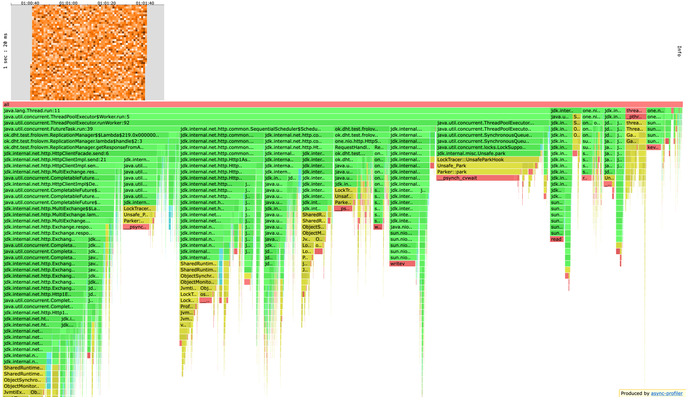

### ALLOC


### LOCK


Видим, что ThreadPoolExecutor стал использовать еще больше ресурсов, а также часть вызовов переместилось из ServiceImpl.handle
в future.

Я сделал вывод: \
Исходя из результатов понятно, что если данная оптимизация если и работает то точно не на одной машине, так как
в данном случае мы добавили накладных ресурсов, не уменьшив кол-во работы. Нужна большая параллельность ресурсов, чтобы
формула: Быстрее отправил - быстрее получил ответы сработала. Нужна более эффективная реализация асинхронного клиента.


После этого я посмотрел лекцию [Сергея Куксенко](https://www.youtube.com/watch?v=W7iK74YA5NM) и решил для асинхронного 
клиента использовать Completable Future.

### PUT

Посмотрим справится ли новая реализация c Rate=10000

```
Running 1m test @ http://localhost:42342
  6 threads and 64 connections
  Thread calibration: mean lat.: 2435.799ms, rate sampling interval: 9404ms
  Thread calibration: mean lat.: 2477.851ms, rate sampling interval: 8912ms
  Thread calibration: mean lat.: 2433.714ms, rate sampling interval: 9379ms
  Thread calibration: mean lat.: 2421.178ms, rate sampling interval: 9338ms
  Thread calibration: mean lat.: 2427.539ms, rate sampling interval: 9396ms
  Thread calibration: mean lat.: 2437.763ms, rate sampling interval: 9371ms
  Thread Stats   Avg      Stdev     Max   +/- Stdev
    Latency    18.44s     7.86s   32.28s    57.26%
    Req/Sec   774.40     29.48   808.00     66.67%
  Latency Distribution (HdrHistogram - Recorded Latency)
 50.000%   18.66s 
 75.000%   25.33s 
 90.000%   29.26s 
 99.000%   31.65s 
 99.900%   32.01s 
 99.990%   32.18s 
 99.999%   32.28s 
100.000%   32.29s 

  Detailed Percentile spectrum:
       Value   Percentile   TotalCount 1/(1-Percentile)

    4857.855     0.000000            1         1.00
    7585.791     0.100000        23234         1.11
   10166.271     0.200000        46452         1.25
   12754.943     0.300000        69652         1.43
   15417.343     0.400000        92874         1.67
   18661.375     0.500000       116198         2.00
   20054.015     0.550000       127739         2.22
   21364.735     0.600000       139394         2.50
   22642.687     0.650000       151039         2.86
   24018.943     0.700000       162539         3.33
   25329.663     0.750000       174165         4.00
   25935.871     0.775000       179931         4.44
   26640.383     0.800000       185809         5.00
   27279.359     0.825000       191597         5.71
   27951.103     0.850000       197392         6.67
   28606.463     0.875000       203173         8.00
   28917.759     0.887500       206094         8.89
   29261.823     0.900000       208973        10.00
   29605.887     0.912500       211900        11.43
   29933.567     0.925000       214753        13.33
   30261.247     0.937500       217741        16.00
   30425.087     0.943750       219193        17.78
   30588.927     0.950000       220644        20.00
   30752.767     0.956250       222043        22.86
   30916.607     0.962500       223509        26.67
   31080.447     0.968750       224957        32.00
   31162.367     0.971875       225684        35.56
   31244.287     0.975000       226394        40.00
   31326.207     0.978125       227083        45.71
   31408.127     0.981250       227822        53.33
   31490.047     0.984375       228536        64.00
   31539.199     0.985938       228972        71.11
   31588.351     0.987500       229399        80.00
   31621.119     0.989062       229680        91.43
   31670.271     0.990625       230059       106.67
   31719.423     0.992188       230397       128.00
   31752.191     0.992969       230620       142.22
   31768.575     0.993750       230729       160.00
   31801.343     0.994531       230960       182.86
   31834.111     0.995313       231166       213.33
   31850.495     0.996094       231255       256.00
   31866.879     0.996484       231348       284.44
   31883.263     0.996875       231442       320.00
   31916.031     0.997266       231596       365.71
   31932.415     0.997656       231660       426.67
   31948.799     0.998047       231731       512.00
   31965.183     0.998242       231796       568.89
   31981.567     0.998437       231851       640.00
   31981.567     0.998633       231851       731.43
   31997.951     0.998828       231907       853.33
   32014.335     0.999023       231957      1024.00
   32014.335     0.999121       231957      1137.78
   32030.719     0.999219       231998      1280.00
   32047.103     0.999316       232031      1462.86
   32047.103     0.999414       232031      1706.67
   32063.487     0.999512       232064      2048.00
   32063.487     0.999561       232064      2275.56
   32079.871     0.999609       232086      2560.00
   32079.871     0.999658       232086      2925.71
   32096.255     0.999707       232101      3413.33
   32112.639     0.999756       232116      4096.00
   32112.639     0.999780       232116      4551.11
   32112.639     0.999805       232116      5120.00
   32129.023     0.999829       232124      5851.43
   32145.407     0.999854       232133      6826.67
   32145.407     0.999878       232133      8192.00
   32161.791     0.999890       232137      9102.22
   32178.175     0.999902       232141     10240.00
   32194.559     0.999915       232145     11702.86
   32194.559     0.999927       232145     13653.33
   32210.943     0.999939       232148     16384.00
   32227.327     0.999945       232152     18204.44
   32227.327     0.999951       232152     20480.00
   32227.327     0.999957       232152     23405.71
   32243.711     0.999963       232154     27306.67
   32243.711     0.999969       232154     32768.00
   32260.095     0.999973       232157     36408.89
   32260.095     0.999976       232157     40960.00
   32260.095     0.999979       232157     46811.43
   32260.095     0.999982       232157     54613.33
   32276.479     0.999985       232159     65536.00
   32276.479     0.999986       232159     72817.78
   32276.479     0.999988       232159     81920.00
   32276.479     0.999989       232159     93622.86
   32276.479     0.999991       232159    109226.67
   32292.863     0.999992       232161    131072.00
   32292.863     1.000000       232161          inf
#[Mean    =    18442.221, StdDeviation   =     7861.545]
#[Max     =    32276.480, Total count    =       232161]
#[Buckets =           27, SubBuckets     =         2048]
----------------------------------------------------------
  278909 requests in 1.00m, 17.82MB read
Requests/sec:   4648.32
Transfer/sec:    304.14KB
```

Сервис, так же как и на предыдущей итерации, не справился с нагрузкой. \

До добавления асинхронности
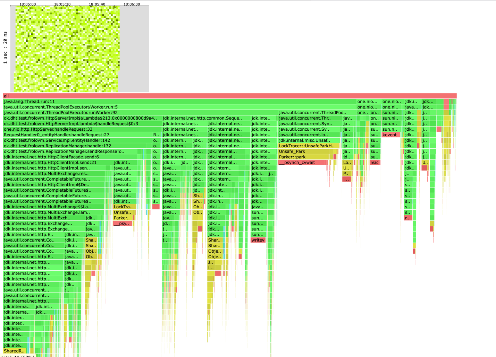

После добавления асинхронности
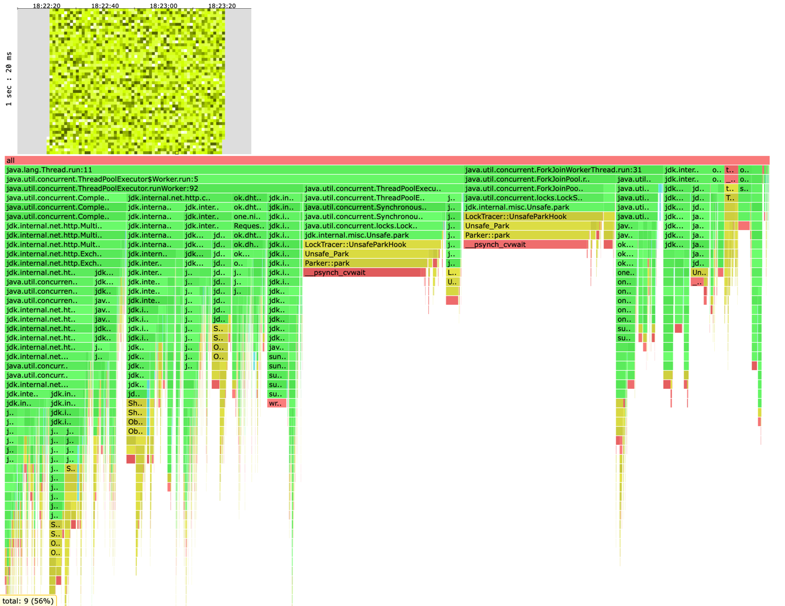

Что интересно при такой же нагрузке на предыдущем этапе сервис потратил 78% CPU в ThreadPool,
а сейчас он потратил 23% на ForkJoinPool и 62% на ThreadPool. Т.е на 7% выросла работа на ThreadPools.
Далее на этапе профилирования разберемся с чем это связано и за счет чего произошел такой рост.

Далее получилось выяснить, что сервис стабильно выдерживает нагрузку при Rate=5000.

```
    Running 1m test @ http://localhost:42342
  6 threads and 64 connections
  Thread calibration: mean lat.: 4.080ms, rate sampling interval: 19ms
  Thread calibration: mean lat.: 4.047ms, rate sampling interval: 19ms
  Thread calibration: mean lat.: 4.149ms, rate sampling interval: 19ms
  Thread calibration: mean lat.: 4.124ms, rate sampling interval: 19ms
  Thread calibration: mean lat.: 4.188ms, rate sampling interval: 19ms
  Thread calibration: mean lat.: 4.105ms, rate sampling interval: 19ms
  Thread Stats   Avg      Stdev     Max   +/- Stdev
    Latency     6.42ms   14.96ms 169.98ms   93.85%
    Req/Sec     0.86k    96.79     1.39k    83.07%
  Latency Distribution (HdrHistogram - Recorded Latency)
 50.000%    2.10ms
 75.000%    3.61ms
 90.000%   11.89ms
 99.000%   88.89ms
 99.900%  130.49ms
 99.990%  152.32ms
 99.999%  167.04ms
100.000%  170.11ms

  Detailed Percentile spectrum:
       Value   Percentile   TotalCount 1/(1-Percentile)

       0.345     0.000000            1         1.00
       1.132     0.100000        24998         1.11
       1.399     0.200000        49956         1.25
       1.626     0.300000        74990         1.43
       1.849     0.400000        99984         1.67
       2.103     0.500000       124978         2.00
       2.249     0.550000       137422         2.22
       2.423     0.600000       149846         2.50
       2.645     0.650000       162354         2.86
       2.987     0.700000       174877         3.33
       3.613     0.750000       187311         4.00
       4.203     0.775000       193554         4.44
       5.083     0.800000       199804         5.00
       6.223     0.825000       206060         5.71
       7.615     0.850000       212283         6.67
       9.351     0.875000       218523         8.00
      10.479     0.887500       221661         8.89
      11.887     0.900000       224774        10.00
      13.735     0.912500       227899        11.43
      16.495     0.925000       231016        13.33
      20.927     0.937500       234139        16.00
      23.903     0.943750       235694        17.78
      27.775     0.950000       237254        20.00
      32.543     0.956250       238815        22.86
      38.335     0.962500       240383        26.67
      45.695     0.968750       241937        32.00
      49.887     0.971875       242722        35.56
      55.199     0.975000       243499        40.00
      61.759     0.978125       244277        45.71
      69.631     0.981250       245061        53.33
      76.287     0.984375       245843        64.00
      79.551     0.985938       246233        71.11
      82.815     0.987500       246620        80.00
      86.463     0.989062       247010        91.43
      90.495     0.990625       247400       106.67
      94.783     0.992188       247795       128.00
      96.831     0.992969       247985       142.22
      99.455     0.993750       248181       160.00
     102.143     0.994531       248378       182.86
     105.663     0.995313       248571       213.33
     109.119     0.996094       248766       256.00
     111.295     0.996484       248866       284.44
     113.215     0.996875       248963       320.00
     115.391     0.997266       249060       365.71
     117.887     0.997656       249155       426.67
     121.023     0.998047       249257       512.00
     122.367     0.998242       249304       568.89
     124.095     0.998437       249350       640.00
     126.079     0.998633       249399       731.43
     128.575     0.998828       249448       853.33
     130.687     0.999023       249497      1024.00
     132.223     0.999121       249522      1137.78
     133.887     0.999219       249546      1280.00
     135.935     0.999316       249570      1462.86
     137.855     0.999414       249594      1706.67
     139.647     0.999512       249621      2048.00
     140.671     0.999561       249632      2275.56
     141.823     0.999609       249643      2560.00
     143.359     0.999658       249656      2925.71
     143.999     0.999707       249669      3413.33
     145.279     0.999756       249680      4096.00
     146.175     0.999780       249686      4551.11
     146.943     0.999805       249693      5120.00
     148.095     0.999829       249698      5851.43
     148.607     0.999854       249704      6826.67
     150.911     0.999878       249710      8192.00
     152.063     0.999890       249713      9102.22
     152.831     0.999902       249716     10240.00
     153.215     0.999915       249719     11702.86
     154.495     0.999927       249722     13653.33
     155.647     0.999939       249725     16384.00
     156.287     0.999945       249727     18204.44
     156.543     0.999951       249728     20480.00
     157.567     0.999957       249730     23405.71
     158.975     0.999963       249731     27306.67
     159.231     0.999969       249733     32768.00
     159.743     0.999973       249734     36408.89
     159.743     0.999976       249734     40960.00
     162.175     0.999979       249735     46811.43
     163.583     0.999982       249736     54613.33
     164.351     0.999985       249737     65536.00
     164.351     0.999986       249737     72817.78
     164.351     0.999988       249737     81920.00
     167.039     0.999989       249738     93622.86
     167.039     0.999991       249738    109226.67
     167.295     0.999992       249739    131072.00
     167.295     0.999993       249739    145635.56
     167.295     0.999994       249739    163840.00
     167.295     0.999995       249739    187245.71
     167.295     0.999995       249739    218453.33
     170.111     0.999996       249740    262144.00
     170.111     1.000000       249740          inf
#[Mean    =        6.416, StdDeviation   =       14.957]
#[Max     =      169.984, Total count    =       249740]
#[Buckets =           27, SubBuckets     =         2048]
----------------------------------------------------------
  299906 requests in 1.00m, 19.16MB read
Requests/sec:   4998.48
Transfer/sec:    327.05KB
```

Как мы видим стабильно сервис теперь выдерживает нагрузку 5000. Однако На предыдущем этапе 
сервис выдерживал нагрузку в 6000. \
С чем же это связано? \
Мое предположение состоит в следующем: \
Запуская асинхронный клиент, мы оптимизируем работу по ожиданию ответов от других кластеров. \
Однако запуск производится, как и на предыдущей итерации на 3 кластерах(т.к при большем кол-ве сильно повышается конкуренция
за ресурсы между instancами сервиса). \
Получается мы тратим дополнительные ресурсы на ThreadJoinPool, на дополнительные блокировки, создание фьючей, а взамен получаем
всего лишь 2 асинхронных запроса, так как мы тестируем с ack=2, from=3. \

Попробуем увеличить количество кластеров и сравнить результаты асинхронной и синхронной версий клиента.

### PUT

Результат синхронной версии 5-кластеров

```
    Running 1m test @ http://localhost:42342
  6 threads and 64 connections
  Thread calibration: mean lat.: 1828.969ms, rate sampling interval: 4673ms
  Thread calibration: mean lat.: 1833.977ms, rate sampling interval: 4685ms
  Thread calibration: mean lat.: 1842.475ms, rate sampling interval: 4689ms
  Thread calibration: mean lat.: 1828.426ms, rate sampling interval: 4673ms
  Thread calibration: mean lat.: 1822.765ms, rate sampling interval: 4653ms
  Thread calibration: mean lat.: 1824.933ms, rate sampling interval: 4657ms
  Thread Stats   Avg      Stdev     Max   +/- Stdev
    Latency    77.02ms  266.94ms   1.67s    92.54%
    Req/Sec   344.20     33.66   446.00     90.00%
  Latency Distribution (HdrHistogram - Recorded Latency)
 50.000%    3.23ms
 75.000%    4.06ms
 90.000%    7.80ms
 99.000%    1.43s 
 99.900%    1.58s 
 99.990%    1.64s 
 99.999%    1.66s 
100.000%    1.67s 

  Detailed Percentile spectrum:
       Value   Percentile   TotalCount 1/(1-Percentile)

       0.825     0.000000            1         1.00
       1.860     0.100000        10312         1.11
       2.247     0.200000        20655         1.25
       2.589     0.300000        30953         1.43
       2.919     0.400000        41221         1.67
       3.227     0.500000        51571         2.00
       3.373     0.550000        56681         2.22
       3.529     0.600000        61859         2.50
       3.687     0.650000        67017         2.86
       3.861     0.700000        72154         3.33
       4.057     0.750000        77285         4.00
       4.179     0.775000        79940         4.44
       4.319     0.800000        82463         5.00
       4.495     0.825000        85015         5.71
       4.739     0.850000        87595         6.67
       5.171     0.875000        90179         8.00
       5.671     0.887500        91454         8.89
       7.803     0.900000        92740        10.00
     168.703     0.912500        94028        11.43
     338.943     0.925000        95317        13.33
     523.519     0.937500        96606        16.00
     597.503     0.943750        97255        17.78
     676.351     0.950000        97892        20.00
     785.407     0.956250        98536        22.86
     908.287     0.962500        99184        26.67
    1031.167     0.968750        99826        32.00
    1093.631     0.971875       100148        35.56
    1156.095     0.975000       100471        40.00
    1219.583     0.978125       100795        45.71
    1275.903     0.981250       101112        53.33
    1332.223     0.984375       101435        64.00
    1360.895     0.985938       101596        71.11
    1389.567     0.987500       101757        80.00
    1415.167     0.989062       101919        91.43
    1441.791     0.990625       102083       106.67
    1465.343     0.992188       102244       128.00
    1476.607     0.992969       102323       142.22
    1487.871     0.993750       102400       160.00
    1499.135     0.994531       102481       182.86
    1511.423     0.995313       102562       213.33
    1522.687     0.996094       102642       256.00
    1529.855     0.996484       102684       284.44
    1535.999     0.996875       102723       320.00
    1543.167     0.997266       102769       365.71
    1549.311     0.997656       102808       426.67
    1555.455     0.998047       102847       512.00
    1560.575     0.998242       102865       568.89
    1563.647     0.998437       102883       640.00
    1569.791     0.998633       102907       731.43
    1573.887     0.998828       102925       853.33
    1580.031     0.999023       102946      1024.00
    1583.103     0.999121       102956      1137.78
    1586.175     0.999219       102966      1280.00
    1589.247     0.999316       102974      1462.86
    1592.319     0.999414       102985      1706.67
    1598.463     0.999512       102994      2048.00
    1601.535     0.999561       103001      2275.56
    1604.607     0.999609       103004      2560.00
    1606.655     0.999658       103009      2925.71
    1612.799     0.999707       103014      3413.33
    1614.847     0.999756       103019      4096.00
    1619.967     0.999780       103022      4551.11
    1623.039     0.999805       103025      5120.00
    1627.135     0.999829       103027      5851.43
    1630.207     0.999854       103029      6826.67
    1634.303     0.999878       103032      8192.00
    1636.351     0.999890       103033      9102.22
    1637.375     0.999902       103034     10240.00
    1639.423     0.999915       103036     11702.86
    1640.447     0.999927       103037     13653.33
    1644.543     0.999939       103038     16384.00
    1645.567     0.999945       103039     18204.44
    1645.567     0.999951       103039     20480.00
    1648.639     0.999957       103040     23405.71
    1654.783     0.999963       103041     27306.67
    1654.783     0.999969       103041     32768.00
    1656.831     0.999973       103042     36408.89
    1656.831     0.999976       103042     40960.00
    1656.831     0.999979       103042     46811.43
    1663.999     0.999982       103043     54613.33
    1663.999     0.999985       103043     65536.00
    1663.999     0.999986       103043     72817.78
    1663.999     0.999988       103043     81920.00
    1663.999     0.999989       103043     93622.86
    1666.047     0.999991       103044    109226.67
    1666.047     1.000000       103044          inf
#[Mean    =       77.017, StdDeviation   =      266.940]
#[Max     =     1665.024, Total count    =       103044]
#[Buckets =           27, SubBuckets     =         2048]
----------------------------------------------------------
  119982 requests in 1.00m, 7.67MB read
Requests/sec:   1999.56
Transfer/sec:    130.83KB
```

Для асинхронной версии 5 - кластеров, ack=3, from=5. Rate=2000

```
    Running 1m test @ http://localhost:42342
  6 threads and 64 connections
  Thread calibration: mean lat.: 3.972ms, rate sampling interval: 10ms
  Thread calibration: mean lat.: 3.878ms, rate sampling interval: 10ms
  Thread calibration: mean lat.: 3.955ms, rate sampling interval: 10ms
  Thread calibration: mean lat.: 3.750ms, rate sampling interval: 10ms
  Thread calibration: mean lat.: 3.954ms, rate sampling interval: 10ms
  Thread calibration: mean lat.: 3.631ms, rate sampling interval: 10ms
  Thread Stats   Avg      Stdev     Max   +/- Stdev
    Latency    15.50ms   47.39ms 364.54ms   94.09%
    Req/Sec   351.40    125.76     1.11k    62.86%
  Latency Distribution (HdrHistogram - Recorded Latency)
 50.000%    4.01ms
 75.000%    5.00ms
 90.000%    7.75ms
 99.000%  261.50ms
 99.900%  323.84ms
 99.990%  354.56ms
 99.999%  361.47ms
100.000%  364.80ms

  Detailed Percentile spectrum:
       Value   Percentile   TotalCount 1/(1-Percentile)

       0.458     0.000000            1         1.00
       2.223     0.100000         9995         1.11
       2.801     0.200000        20004         1.25
       3.249     0.300000        29971         1.43
       3.645     0.400000        39997         1.67
       4.005     0.500000        49999         2.00
       4.179     0.550000        54967         2.22
       4.359     0.600000        59968         2.50
       4.551     0.650000        64970         2.86
       4.759     0.700000        70003         3.33
       5.003     0.750000        74950         4.00
       5.155     0.775000        77457         4.44
       5.339     0.800000        79937         5.00
       5.579     0.825000        82440         5.71
       5.919     0.850000        84934         6.67
       6.539     0.875000        87416         8.00
       7.047     0.887500        88662         8.89
       7.747     0.900000        89911        10.00
       8.895     0.912500        91161        11.43
      12.103     0.925000        92410        13.33
      41.183     0.937500        93657        16.00
      82.431     0.943750        94281        17.78
     115.775     0.950000        94905        20.00
     140.287     0.956250        95534        22.86
     164.735     0.962500        96155        26.67
     187.391     0.968750        96782        32.00
     199.679     0.971875        97093        35.56
     211.199     0.975000        97404        40.00
     221.695     0.978125        97716        45.71
     232.447     0.981250        98030        53.33
     241.279     0.984375        98343        64.00
     246.399     0.985938        98500        71.11
     251.775     0.987500        98652        80.00
     257.151     0.989062        98808        91.43
     263.935     0.990625        98967       106.67
     271.359     0.992188        99122       128.00
     275.455     0.992969        99204       142.22
     279.551     0.993750        99278       160.00
     282.879     0.994531        99354       182.86
     287.231     0.995313        99432       213.33
     291.071     0.996094        99516       256.00
     293.375     0.996484        99550       284.44
     296.447     0.996875        99588       320.00
     299.775     0.997266        99635       365.71
     303.103     0.997656        99667       426.67
     307.967     0.998047        99706       512.00
     310.271     0.998242        99726       568.89
     312.575     0.998437        99745       640.00
     315.903     0.998633        99764       731.43
     319.487     0.998828        99783       853.33
     324.351     0.999023        99804      1024.00
     326.399     0.999121        99813      1137.78
     328.703     0.999219        99822      1280.00
     330.751     0.999316        99833      1462.86
     335.871     0.999414        99843      1706.67
     338.943     0.999512        99852      2048.00
     340.223     0.999561        99858      2275.56
     341.503     0.999609        99862      2560.00
     343.295     0.999658        99866      2925.71
     345.087     0.999707        99871      3413.33
     346.367     0.999756        99876      4096.00
     348.415     0.999780        99879      4551.11
     349.183     0.999805        99881      5120.00
     349.439     0.999829        99883      5851.43
     351.231     0.999854        99886      6826.67
     353.535     0.999878        99888      8192.00
     354.559     0.999890        99890      9102.22
     354.815     0.999902        99891     10240.00
     355.071     0.999915        99892     11702.86
     355.327     0.999927        99894     13653.33
     355.327     0.999939        99894     16384.00
     355.839     0.999945        99895     18204.44
     356.095     0.999951        99896     20480.00
     356.095     0.999957        99896     23405.71
     357.887     0.999963        99897     27306.67
     357.887     0.999969        99897     32768.00
     359.423     0.999973        99898     36408.89
     359.423     0.999976        99898     40960.00
     359.423     0.999979        99898     46811.43
     361.471     0.999982        99899     54613.33
     361.471     0.999985        99899     65536.00
     361.471     0.999986        99899     72817.78
     361.471     0.999988        99899     81920.00
     361.471     0.999989        99899     93622.86
     364.799     0.999991        99900    109226.67
     364.799     1.000000        99900          inf
#[Mean    =       15.502, StdDeviation   =       47.391]
#[Max     =      364.544, Total count    =        99900]
#[Buckets =           27, SubBuckets     =         2048]
----------------------------------------------------------
  119983 requests in 1.00m, 7.67MB read
Requests/sec:   1999.55
Transfer/sec:    130.83KB
```

Сравним результаты:
```
            Async           Sync
Latency:
Mean    =   15.502          77.017
Max     =   364.544         1665.024

  Latency Distribution (HdrHistogram - Recorded Latency)
            Async           Sync
50.000%     4.01ms          3.23ms     
75.000%     5.00ms          4.06ms
90.000%     7.75ms          7.80ms
99.000%     261.50ms         1.43s
99.900%     323.84ms         1.58s
99.990%     354.56ms         1.64s
99.999%     361.47ms         1.66s
100.000%    364.80ms         1.67s 
```


Видим, что latency синхронного сервиса оказался в 5 раз больше на 99-100%.

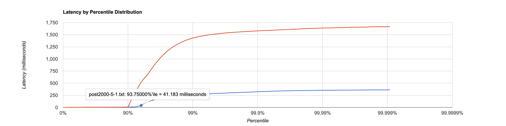

Теперь попробуем увеличить число кластеров до 8.

Результат синхронной версии 8-кластеров

```
    Running 1m test @ http://localhost:42342
  6 threads and 64 connections
  Thread calibration: mean lat.: 854.898ms, rate sampling interval: 2555ms
  Thread calibration: mean lat.: 862.328ms, rate sampling interval: 2572ms
  Thread calibration: mean lat.: 867.477ms, rate sampling interval: 2592ms
  Thread calibration: mean lat.: 858.714ms, rate sampling interval: 2549ms
  Thread calibration: mean lat.: 868.611ms, rate sampling interval: 2594ms
  Thread calibration: mean lat.: 861.737ms, rate sampling interval: 2578ms
  Thread Stats   Avg      Stdev     Max   +/- Stdev
    Latency     4.39s     1.96s    8.00s    54.77%
    Req/Sec   289.98     17.48   310.00     85.09%
  Latency Distribution (HdrHistogram - Recorded Latency)
 50.000%    4.03s 
 75.000%    6.35s 
 90.000%    7.29s 
 99.000%    7.76s 
 99.900%    7.87s 
 99.990%    7.96s 
 99.999%    7.99s 
100.000%    8.00s 

  Detailed Percentile spectrum:
       Value   Percentile   TotalCount 1/(1-Percentile)

    1325.055     0.000000            1         1.00
    1908.735     0.100000         8730         1.11
    2416.639     0.200000        17440         1.25
    3026.943     0.300000        26142         1.43
    3553.279     0.400000        34831         1.67
    4032.511     0.500000        43543         2.00
    4329.471     0.550000        47947         2.22
    4575.231     0.600000        52313         2.50
    4837.375     0.650000        56610         2.86
    5832.703     0.700000        60961         3.33
    6352.895     0.750000        65310         4.00
    6590.463     0.775000        67517         4.44
    6795.263     0.800000        69658         5.00
    6946.815     0.825000        71842         5.71
    7086.079     0.850000        74050         6.67
    7192.575     0.875000        76264         8.00
    7241.727     0.887500        77350         8.89
    7290.879     0.900000        78429        10.00
    7335.935     0.912500        79476        11.43
    7385.087     0.925000        80582        13.33
    7442.431     0.937500        81634        16.00
    7479.295     0.943750        82181        17.78
    7520.255     0.950000        82750        20.00
    7561.215     0.956250        83307        22.86
    7598.079     0.962500        83847        26.67
    7630.847     0.968750        84367        32.00
    7651.327     0.971875        84702        35.56
    7663.615     0.975000        84918        40.00
    7679.999     0.978125        85168        45.71
    7700.479     0.981250        85467        53.33
    7716.863     0.984375        85714        64.00
    7729.151     0.985938        85866        71.11
    7741.439     0.987500        85999        80.00
    7753.727     0.989062        86155        91.43
    7761.919     0.990625        86255       106.67
    7774.207     0.992188        86390       128.00
    7782.399     0.992969        86479       142.22
    7790.591     0.993750        86541       160.00
    7798.783     0.994531        86610       182.86
    7806.975     0.995313        86681       213.33
    7815.167     0.996094        86746       256.00
    7819.263     0.996484        86778       284.44
    7823.359     0.996875        86798       320.00
    7831.551     0.997266        86846       365.71
    7839.743     0.997656        86884       426.67
    7843.839     0.998047        86903       512.00
    7847.935     0.998242        86919       568.89
    7856.127     0.998437        86945       640.00
    7860.223     0.998633        86952       731.43
    7868.415     0.998828        86978       853.33
    7872.511     0.999023        86986      1024.00
    7876.607     0.999121        86992      1137.78
    7880.703     0.999219        87001      1280.00
    7888.895     0.999316        87011      1462.86
    7892.991     0.999414        87017      1706.67
    7901.183     0.999512        87026      2048.00
    7909.375     0.999561        87030      2275.56
    7917.567     0.999609        87034      2560.00
    7925.759     0.999658        87042      2925.71
    7929.855     0.999707        87043      3413.33
    7942.143     0.999756        87049      4096.00
    7942.143     0.999780        87049      4551.11
    7950.335     0.999805        87051      5120.00
    7958.527     0.999829        87056      5851.43
    7958.527     0.999854        87056      6826.67
    7962.623     0.999878        87059      8192.00
    7962.623     0.999890        87059      9102.22
    7970.815     0.999902        87060     10240.00
    7974.911     0.999915        87061     11702.86
    7979.007     0.999927        87062     13653.33
    7983.103     0.999939        87065     16384.00
    7983.103     0.999945        87065     18204.44
    7983.103     0.999951        87065     20480.00
    7983.103     0.999957        87065     23405.71
    7983.103     0.999963        87065     27306.67
    7987.199     0.999969        87066     32768.00
    7987.199     0.999973        87066     36408.89
    7987.199     0.999976        87066     40960.00
    7991.295     0.999979        87067     46811.43
    7991.295     0.999982        87067     54613.33
    7991.295     0.999985        87067     65536.00
    7991.295     0.999986        87067     72817.78
    7991.295     0.999988        87067     81920.00
    8003.583     0.999989        87068     93622.86
    8003.583     1.000000        87068          inf
#[Mean    =     4388.261, StdDeviation   =     1964.037]
#[Max     =     7999.488, Total count    =        87068]
#[Buckets =           27, SubBuckets     =         2048]
----------------------------------------------------------
  104390 requests in 1.00m, 6.67MB read
Requests/sec:   1739.68
Transfer/sec:    113.83KB
```

Для асинхронной версии 8 - кластеров, ack=5, from=8. Rate=2000

```
    Running 1m test @ http://localhost:42342
  6 threads and 64 connections
  Thread calibration: mean lat.: 6.743ms, rate sampling interval: 23ms
  Thread calibration: mean lat.: 6.628ms, rate sampling interval: 23ms
  Thread calibration: mean lat.: 6.517ms, rate sampling interval: 23ms
  Thread calibration: mean lat.: 6.582ms, rate sampling interval: 23ms
  Thread calibration: mean lat.: 11.006ms, rate sampling interval: 29ms
  Thread calibration: mean lat.: 6.363ms, rate sampling interval: 23ms
  Thread Stats   Avg      Stdev     Max   +/- Stdev
    Latency   219.53ms  334.15ms   1.45s    82.27%
    Req/Sec   333.73     76.28   689.00     76.83%
  Latency Distribution (HdrHistogram - Recorded Latency)
 50.000%   15.65ms
 75.000%  357.38ms
 90.000%  820.22ms
 99.000%    1.21s 
 99.900%    1.38s 
 99.990%    1.44s 
 99.999%    1.45s 
100.000%    1.45s 

  Detailed Percentile spectrum:
       Value   Percentile   TotalCount 1/(1-Percentile)

       0.615     0.000000            1         1.00
       4.235     0.100000         9804         1.11
       6.223     0.200000        19603         1.25
       8.983     0.300000        29412         1.43
      11.455     0.400000        39214         1.67
      15.647     0.500000        49008         2.00
      22.943     0.550000        53903         2.22
      52.639     0.600000        58805         2.50
     120.831     0.650000        63705         2.86
     223.615     0.700000        68606         3.33
     357.375     0.750000        73503         4.00
     422.655     0.775000        75957         4.44
     492.031     0.800000        78407         5.00
     561.663     0.825000        80870         5.71
     636.927     0.850000        83306         6.67
     718.335     0.875000        85753         8.00
     769.023     0.887500        86987         8.89
     820.223     0.900000        88203        10.00
     867.839     0.912500        89435        11.43
     906.751     0.925000        90667        13.33
     944.639     0.937500        91891        16.00
     962.559     0.943750        92506        17.78
     977.919     0.950000        93107        20.00
     994.815     0.956250        93727        22.86
    1011.711     0.962500        94331        26.67
    1036.799     0.968750        94943        32.00
    1049.599     0.971875        95257        35.56
    1064.959     0.975000        95558        40.00
    1083.391     0.978125        95864        45.71
    1114.111     0.981250        96178        53.33
    1138.687     0.984375        96483        64.00
    1157.119     0.985938        96629        71.11
    1179.647     0.987500        96778        80.00
    1205.247     0.989062        96935        91.43
    1221.631     0.990625        97090       106.67
    1236.991     0.992188        97240       128.00
    1247.231     0.992969        97319       142.22
    1254.399     0.993750        97396       160.00
    1261.567     0.994531        97469       182.86
    1268.735     0.995313        97558       213.33
    1276.927     0.996094        97623       256.00
    1284.095     0.996484        97662       284.44
    1293.311     0.996875        97700       320.00
    1300.479     0.997266        97740       365.71
    1306.623     0.997656        97774       426.67
    1314.815     0.998047        97813       512.00
    1319.935     0.998242        97831       568.89
    1336.319     0.998437        97850       640.00
    1354.751     0.998633        97873       731.43
    1364.991     0.998828        97890       853.33
    1378.303     0.999023        97908      1024.00
    1387.519     0.999121        97917      1137.78
    1391.615     0.999219        97928      1280.00
    1399.807     0.999316        97937      1462.86
    1403.903     0.999414        97946      1706.67
    1412.095     0.999512        97956      2048.00
    1414.143     0.999561        97961      2275.56
    1416.191     0.999609        97968      2560.00
    1420.287     0.999658        97970      2925.71
    1425.407     0.999707        97977      3413.33
    1427.455     0.999756        97981      4096.00
    1428.479     0.999780        97982      4551.11
    1430.527     0.999805        97984      5120.00
    1433.599     0.999829        97987      5851.43
    1434.623     0.999854        97989      6826.67
    1437.695     0.999878        97992      8192.00
    1438.719     0.999890        97993      9102.22
    1439.743     0.999902        97994     10240.00
    1441.791     0.999915        97996     11702.86
    1441.791     0.999927        97996     13653.33
    1444.863     0.999939        97999     16384.00
    1444.863     0.999945        97999     18204.44
    1444.863     0.999951        97999     20480.00
    1444.863     0.999957        97999     23405.71
    1445.887     0.999963        98000     27306.67
    1452.031     0.999969        98001     32768.00
    1452.031     0.999973        98001     36408.89
    1452.031     0.999976        98001     40960.00
    1452.031     0.999979        98001     46811.43
    1454.079     0.999982        98003     54613.33
    1454.079     1.000000        98003          inf
#[Mean    =      219.534, StdDeviation   =      334.148]
#[Max     =     1453.056, Total count    =        98003]
#[Buckets =           27, SubBuckets     =         2048]
----------------------------------------------------------
  117749 requests in 1.00m, 7.52MB read
Requests/sec:   1962.26
Transfer/sec:    128.39KB
```

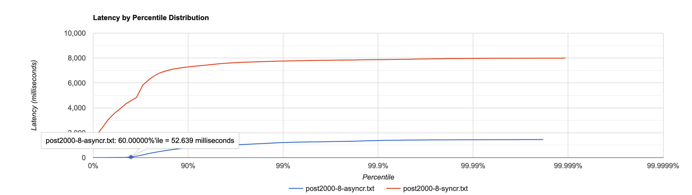

Сравним результаты:
```
            Async           Sync
Latency:
Mean    =   219.534         4388.261
Max     =   1453.056        7999.488

  Latency Distribution (HdrHistogram - Recorded Latency)
            Async           Sync
50.000%     15.65ms         4.03s
75.000%     357.38ms        6.35s
90.000%     820.22ms        7.29s
99.000%     1.21s           7.76s
99.900%     1.38s           7.87s
99.990%     1.44s           7.96s
99.999%     1.45s           7.99s
100.000%    1.45s           8.00s
```


В данном случае видим, что сервис с синхронным клиентом захлебнулся, тогда как сервис с асинхронным клиентом продолжил работать. \
Исходя из полученных данных можно сделать вывод, что полученное решение является эффективным
при числе кластеров >= 5, а значит в реальном продакшене целесообразно использовать именно его.

### GET

Rate=10000
```
 Running 1m test @ http://localhost:42342
  6 threads and 64 connections
  Thread calibration: mean lat.: 2921.013ms, rate sampling interval: 10543ms
  Thread calibration: mean lat.: 2918.996ms, rate sampling interval: 10543ms
  Thread calibration: mean lat.: 2910.166ms, rate sampling interval: 10477ms
  Thread calibration: mean lat.: 2915.582ms, rate sampling interval: 10551ms
  Thread calibration: mean lat.: 2686.629ms, rate sampling interval: 9617ms
  Thread calibration: mean lat.: 2921.436ms, rate sampling interval: 10551ms
  Thread Stats   Avg      Stdev     Max   +/- Stdev
    Latency    19.82s     8.19s   34.44s    58.16%
    Req/Sec   721.00     11.43   743.00     64.00%
  Latency Distribution (HdrHistogram - Recorded Latency)
 50.000%   19.58s 
 75.000%   26.87s 
 90.000%   31.24s 
 99.000%   33.82s 
 99.900%   34.24s 
 99.990%   34.41s 
 99.999%   34.44s 
100.000%   34.47s 

  Detailed Percentile spectrum:
       Value   Percentile   TotalCount 1/(1-Percentile)

    5263.359     0.000000            1         1.00
    8519.679     0.100000        21655         1.11
   11403.263     0.200000        43182         1.25
   14123.007     0.300000        64773         1.43
   16924.671     0.400000        86406         1.67
   19578.879     0.500000       108029         2.00
   21102.591     0.550000       118825         2.22
   22675.455     0.600000       129583         2.50
   24133.631     0.650000       140423         2.86
   25493.503     0.700000       151130         3.33
   26869.759     0.750000       161963         4.00
   27557.887     0.775000       167343         4.44
   28377.087     0.800000       172760         5.00
   29097.983     0.825000       178161         5.71
   29835.263     0.850000       183586         6.67
   30605.311     0.875000       189006         8.00
   30916.607     0.887500       191686         8.89
   31244.287     0.900000       194411        10.00
   31571.967     0.912500       197082        11.43
   31932.415     0.925000       199742        13.33
   32292.863     0.937500       202400        16.00
   32473.087     0.943750       203787        17.78
   32653.311     0.950000       205145        20.00
   32817.151     0.956250       206466        22.86
   32997.375     0.962500       207899        26.67
   33161.215     0.968750       209146        32.00
   33259.519     0.971875       209901        35.56
   33341.439     0.975000       210561        40.00
   33423.359     0.978125       211208        45.71
   33505.279     0.981250       211858        53.33
   33619.967     0.984375       212680        64.00
   33652.735     0.985938       212906        71.11
   33718.271     0.987500       213292        80.00
   33783.807     0.989062       213625        91.43
   33849.343     0.990625       213940       106.67
   33914.879     0.992188       214259       128.00
   33947.647     0.992969       214426       142.22
   33980.415     0.993750       214604       160.00
   34013.183     0.994531       214781       182.86
   34045.951     0.995313       214957       213.33
   34078.719     0.996094       215122       256.00
   34111.487     0.996484       215267       284.44
   34111.487     0.996875       215267       320.00
   34144.255     0.997266       215396       365.71
   34144.255     0.997656       215396       426.67
   34177.023     0.998047       215508       512.00
   34177.023     0.998242       215508       568.89
   34209.791     0.998437       215613       640.00
   34209.791     0.998633       215613       731.43
   34242.559     0.998828       215692       853.33
   34242.559     0.999023       215692      1024.00
   34242.559     0.999121       215692      1137.78
   34275.327     0.999219       215754      1280.00
   34275.327     0.999316       215754      1462.86
   34308.095     0.999414       215806      1706.67
   34308.095     0.999512       215806      2048.00
   34308.095     0.999561       215806      2275.56
   34308.095     0.999609       215806      2560.00
   34340.863     0.999658       215835      2925.71
   34340.863     0.999707       215835      3413.33
   34340.863     0.999756       215835      4096.00
   34340.863     0.999780       215835      4551.11
   34373.631     0.999805       215857      5120.00
   34373.631     0.999829       215857      5851.43
   34373.631     0.999854       215857      6826.67
   34373.631     0.999878       215857      8192.00
   34406.399     0.999890       215871      9102.22
   34406.399     0.999902       215871     10240.00
   34406.399     0.999915       215871     11702.86
   34406.399     0.999927       215871     13653.33
   34406.399     0.999939       215871     16384.00
   34406.399     0.999945       215871     18204.44
   34406.399     0.999951       215871     20480.00
   34439.167     0.999957       215880     23405.71
   34439.167     0.999963       215880     27306.67
   34439.167     0.999969       215880     32768.00
   34439.167     0.999973       215880     36408.89
   34439.167     0.999976       215880     40960.00
   34439.167     0.999979       215880     46811.43
   34439.167     0.999982       215880     54613.33
   34439.167     0.999985       215880     65536.00
   34439.167     0.999986       215880     72817.78
   34439.167     0.999988       215880     81920.00
   34439.167     0.999989       215880     93622.86
   34439.167     0.999991       215880    109226.67
   34439.167     0.999992       215880    131072.00
   34439.167     0.999993       215880    145635.56
   34439.167     0.999994       215880    163840.00
   34439.167     0.999995       215880    187245.71
   34471.935     0.999995       215881    218453.33
   34471.935     1.000000       215881          inf
#[Mean    =    19817.333, StdDeviation   =     8188.375]
#[Max     =    34439.168, Total count    =       215881]
#[Buckets =           27, SubBuckets     =         2048]
----------------------------------------------------------
  256994 requests in 1.00m, 16.15MB read
Requests/sec:   4283.16
Transfer/sec:    275.59KB
```

Видим, что сервис не справляется с rate=10000. Найдем при каком rate наша асинхронная реализация не захлебывается.

Rate=5000

```
Running 1m test @ http://localhost:42342
  6 threads and 64 connections
  Thread calibration: mean lat.: 3.802ms, rate sampling interval: 10ms
  Thread calibration: mean lat.: 3.775ms, rate sampling interval: 10ms
  Thread calibration: mean lat.: 3.928ms, rate sampling interval: 10ms
  Thread calibration: mean lat.: 3.641ms, rate sampling interval: 10ms
  Thread calibration: mean lat.: 3.939ms, rate sampling interval: 10ms
  Thread calibration: mean lat.: 4.892ms, rate sampling interval: 12ms
  Thread Stats   Avg      Stdev     Max   +/- Stdev
    Latency   286.03ms  275.89ms   1.27s    53.93%
    Req/Sec     0.86k   181.34     1.82k    72.07%
  Latency Distribution (HdrHistogram - Recorded Latency)
 50.000%  255.23ms
 75.000%  479.74ms
 90.000%  695.29ms
 99.000%  940.03ms
 99.900%    1.14s 
 99.990%    1.26s 
 99.999%    1.27s 
100.000%    1.27s 

  Detailed Percentile spectrum:
       Value   Percentile   TotalCount 1/(1-Percentile)

       0.357     0.000000            1         1.00
       2.409     0.100000        24629         1.11
       4.049     0.200000        49248         1.25
      15.767     0.300000        73856         1.43
     118.143     0.400000        98475         1.67
     255.231     0.500000       123107         2.00
     301.055     0.550000       135408         2.22
     342.527     0.600000       147766         2.50
     381.695     0.650000       160059         2.86
     427.519     0.700000       172368         3.33
     479.743     0.750000       184666         4.00
     508.927     0.775000       190795         4.44
     541.695     0.800000       196947         5.00
     576.511     0.825000       203117         5.71
     613.887     0.850000       209274         6.67
     659.455     0.875000       215413         8.00
     677.887     0.887500       218548         8.89
     695.295     0.900000       221558        10.00
     718.335     0.912500       224651        11.43
     747.519     0.925000       227756        13.33
     776.191     0.937500       230806        16.00
     791.039     0.943750       232341        17.78
     805.375     0.950000       233871        20.00
     821.247     0.956250       235411        22.86
     840.703     0.962500       236942        26.67
     859.647     0.968750       238516        32.00
     867.839     0.971875       239268        35.56
     877.567     0.975000       240066        40.00
     887.295     0.978125       240815        45.71
     898.047     0.981250       241579        53.33
     912.383     0.984375       242352        64.00
     919.039     0.985938       242738        71.11
     925.695     0.987500       243121        80.00
     932.863     0.989062       243486        91.43
     945.151     0.990625       243866       106.67
     962.047     0.992188       244256       128.00
     968.703     0.992969       244451       142.22
     974.847     0.993750       244641       160.00
     983.551     0.994531       244834       182.86
     996.351     0.995313       245021       213.33
    1021.951     0.996094       245222       256.00
    1030.143     0.996484       245313       284.44
    1041.919     0.996875       245406       320.00
    1050.623     0.997266       245503       365.71
    1067.007     0.997656       245599       426.67
    1084.415     0.998047       245695       512.00
    1097.727     0.998242       245744       568.89
    1107.967     0.998437       245792       640.00
    1122.303     0.998633       245842       731.43
    1131.519     0.998828       245894       853.33
    1141.759     0.999023       245933      1024.00
    1168.383     0.999121       245958      1137.78
    1181.695     0.999219       245982      1280.00
    1187.839     0.999316       246006      1462.86
    1217.535     0.999414       246029      1706.67
    1231.871     0.999512       246054      2048.00
    1238.015     0.999561       246069      2275.56
    1241.087     0.999609       246077      2560.00
    1245.183     0.999658       246094      2925.71
    1246.207     0.999707       246101      3413.33
    1249.279     0.999756       246117      4096.00
    1250.303     0.999780       246121      4551.11
    1251.327     0.999805       246125      5120.00
    1253.375     0.999829       246132      5851.43
    1254.399     0.999854       246137      6826.67
    1255.423     0.999878       246143      8192.00
    1256.447     0.999890       246146      9102.22
    1257.471     0.999902       246151     10240.00
    1258.495     0.999915       246153     11702.86
    1260.543     0.999927       246156     13653.33
    1262.591     0.999939       246161     16384.00
    1262.591     0.999945       246161     18204.44
    1262.591     0.999951       246161     20480.00
    1265.663     0.999957       246165     23405.71
    1265.663     0.999963       246165     27306.67
    1266.687     0.999969       246167     32768.00
    1266.687     0.999973       246167     36408.89
    1266.687     0.999976       246167     40960.00
    1267.711     0.999979       246169     46811.43
    1267.711     0.999982       246169     54613.33
    1268.735     0.999985       246172     65536.00
    1268.735     0.999986       246172     72817.78
    1268.735     0.999988       246172     81920.00
    1268.735     0.999989       246172     93622.86
    1268.735     0.999991       246172    109226.67
    1268.735     0.999992       246172    131072.00
    1268.735     0.999993       246172    145635.56
    1268.735     0.999994       246172    163840.00
    1268.735     0.999995       246172    187245.71
    1268.735     0.999995       246172    218453.33
    1271.807     0.999996       246173    262144.00
    1271.807     1.000000       246173          inf
#[Mean    =      286.028, StdDeviation   =      275.888]
#[Max     =     1270.784, Total count    =       246173]
#[Buckets =           27, SubBuckets     =         2048]
----------------------------------------------------------
  295358 requests in 1.00m, 18.56MB read
Requests/sec:   4922.47
Transfer/sec:    316.74KB
```

Сервис выдерживает Rate=5000

```
Requests/sec:   4922.47
Mean    =      286.028
Max     =     1270.784
```

## Результаты профилирования

### PUT

#### CPU

Синхронный вариант
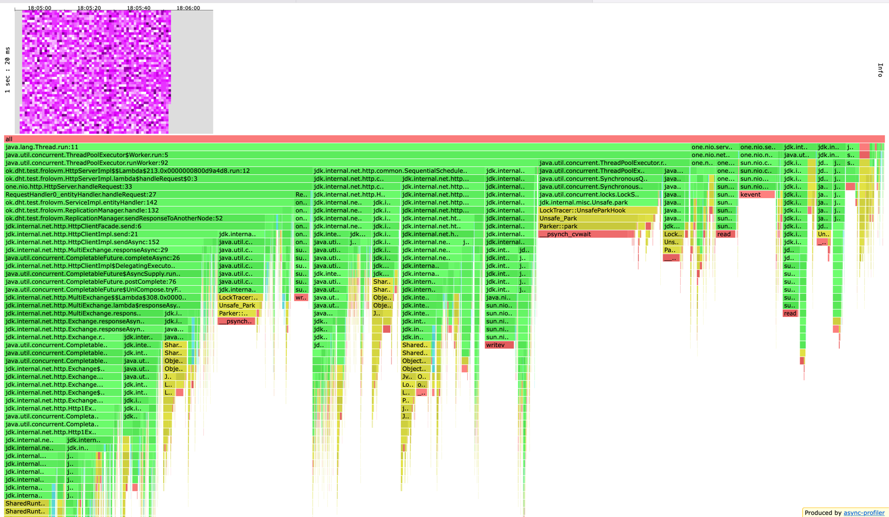

Ассинхронный вариант
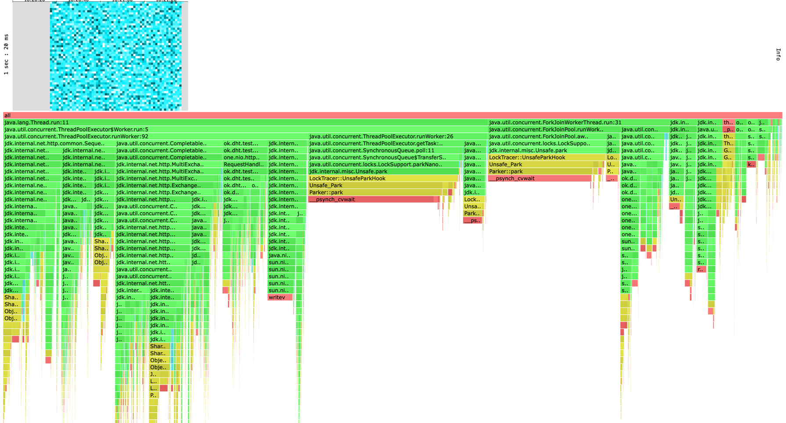

Заметим, что на нашем flamegraph появился ForkJoinWorkerThread он используется под капотом для реализации java 
Http Сlient и для Completable future, как было сказано в видео на данный момент в Java - данное решение является 
наиболее быстрым. \
Напомню о факте, который мы заметили на этапе тестирования: В синхронной версии ThreadPool занимал 78%.
А в асинхронной в процентном соотношении ForkJoinWorkerThread составляет ~23.4% и в сумме с 
ThreadPoolExecutor (~62%) дает 85% всей работы. Работа Threadpools выросла на 7%, это связано с тем, что мы теперь мы 
тратим дополнительные ресурсы на асинхронную работу. 

В процентном соотношении стало на 10% больше работы CPU на park, unpark. Это связано с тем, что у нас добавилось 
 еще потоков и переключений между ними, при этом мы упираемся в ограничения одной локальной машины.

Работа селекторов по стала занимать меньшее процентное время с одной стороны это вызвано перераспределением процентов
(в общем ресурсов сервис стал тратить больше), с другой стороны у нас стало меньше ожидание на Selectors оно переместилось на
ForkJoinPool.

#### ALLOC
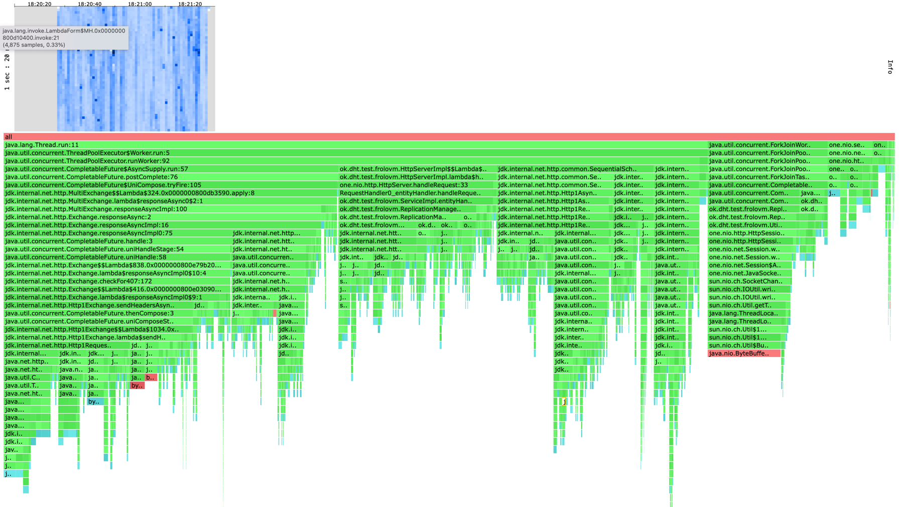

Синхронный вариант
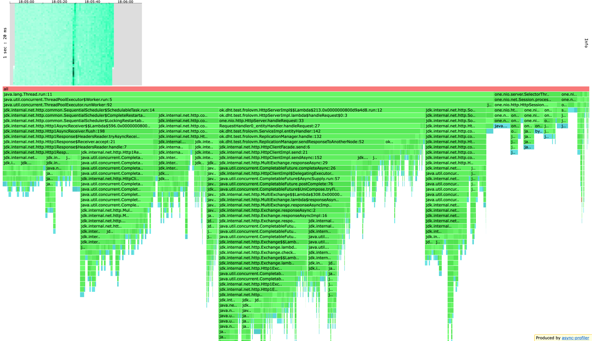
Ассинхронный вариант
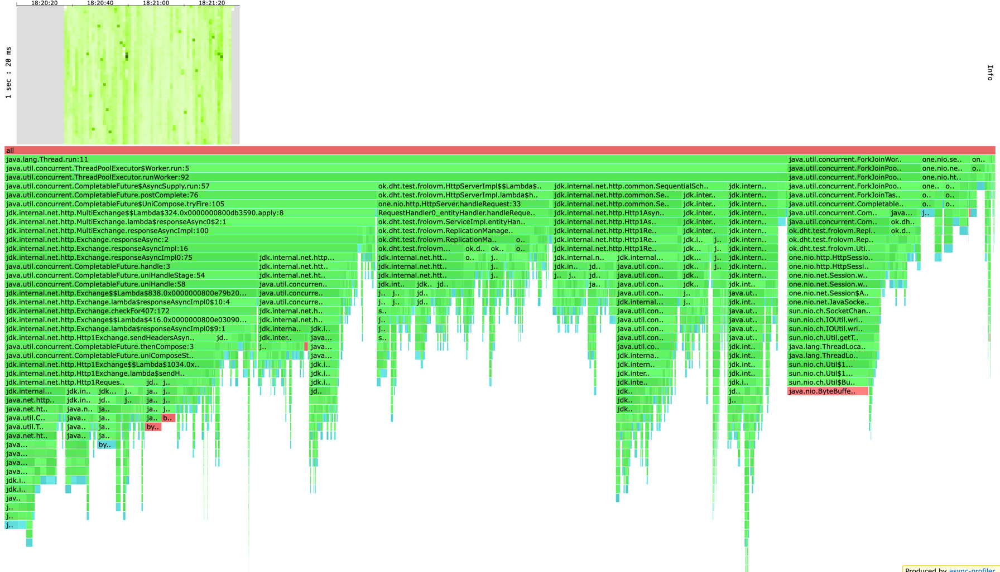

Видно, что у нас появилась отдельная плашка с ForkJoinPool в данной секции описаны затраты на обработку ответа 
Http Clientа. Состоит из затрат на создание и исполнение Completable future, 
создание response, работа с headers, аллокация byte[], также около 8% занимает работа с ByteBuffer.

#### LOCK

Синхронный вариант
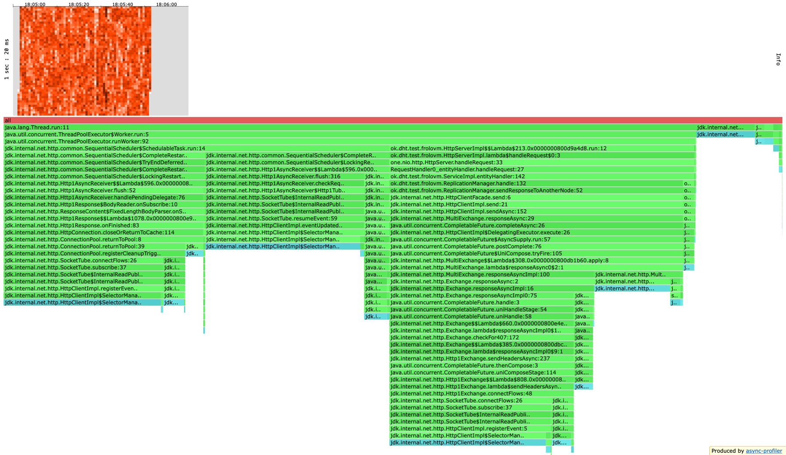

Ассинхронный вариант
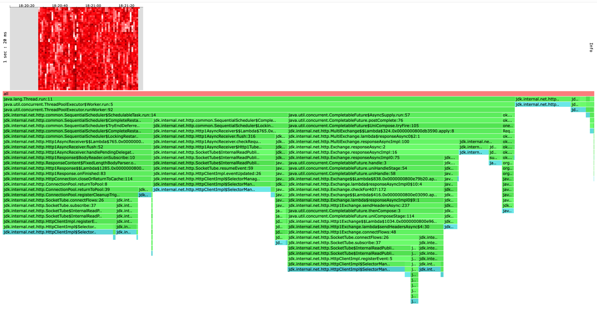

Видим, что работа с базой данных занимает ~2% lock, и практически не изменилась с прошлого этапа. \
Также основную часть ~95% lock занимает Http Client Selector Manager. Можно заметить, что мы немного улучшили кол-во
locks в Threadpool за счет упрощения структуры вызовов. А именно HttpCLient.send -> HttpClient.sendAsync, заменили 
на просто вызов HttpClient.sendAsync и работой с Completable future.

В остальном картина не изменилась с предыдущего этапа.

### GET

#### CPU

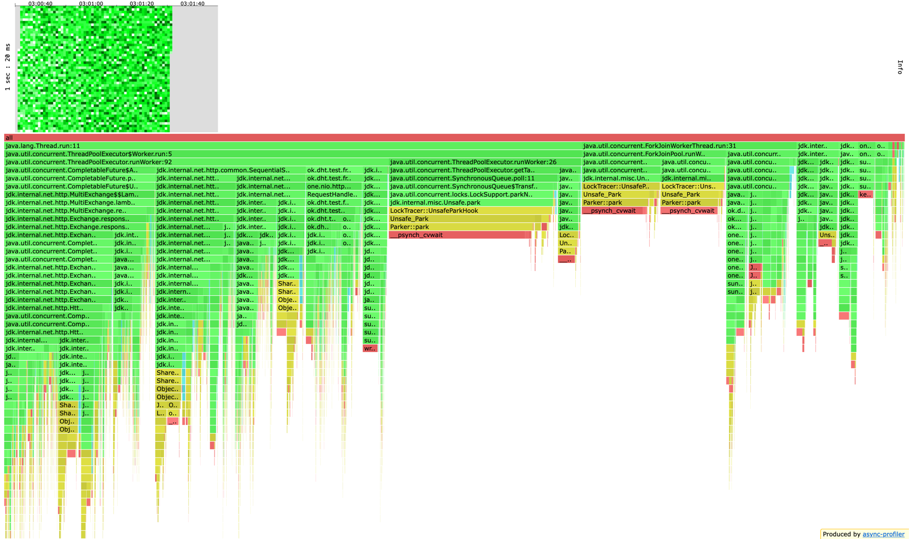z

Картина практически идентичная PUT, также как и в PUT произошло перераспределение работы на ForkJoinPool и
уменьшился процент, которые приходится на ThreadPool в частности уменьшился процент getTask и 
SequentialScheduler. Из чего можно сделать вывод, что мы разгрузили наш воркер, уменьшили кол-во тасок и сложность задач,
и разгрузили планировщик, перенеся часть работы HTTP client из него, благодаря этому впоследствии 
при усложнении логики обработки запросов из базы данных мы сможем получить прирост в скорости.

#### ALLOC

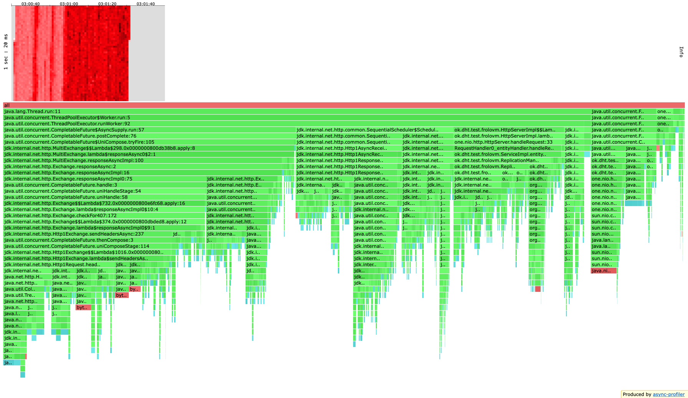

Картина практически идентичная PUT, обработка массива futures, в которой и могло быть различие между GET и PUT,
занимает незначительную часть аллокации памяти и не видна на flame graphe.

#### LOCK

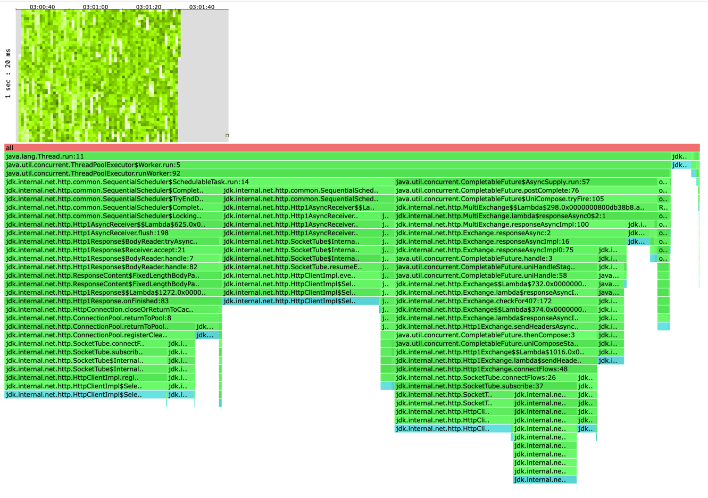

## На второй неделе

После просмотра лекции решил воспользоваться рекомендацией и добавил логику того, что если сервер уже 
не способен набрать нужное число ack, то посылаем ответ с ошибкой сразу(раньше ожидал всех ответов).

Также в лекции упомянули, что для Completable Future необходимо контролировать на каком пуле будет исполняться задачи, т.к если использовать 
встроенный ForkJoinPool, то нельзя быть уверенным, что на машине пользователя данный пул будет использован только нашим 
приложением и не будет конкурировать за ресурсы с другим. Поэтому для отправки и обработки запросов клиента создадим отдельный executor.

Rate=5000
```
Running 1m test @ http://localhost:42342
  6 threads and 64 connections
  Thread calibration: mean lat.: 1.451ms, rate sampling interval: 10ms
  Thread calibration: mean lat.: 1.386ms, rate sampling interval: 10ms
  Thread calibration: mean lat.: 1.407ms, rate sampling interval: 10ms
  Thread calibration: mean lat.: 1.504ms, rate sampling interval: 10ms
  Thread calibration: mean lat.: 1.495ms, rate sampling interval: 10ms
  Thread calibration: mean lat.: 1.545ms, rate sampling interval: 10ms
  Thread Stats   Avg      Stdev     Max   +/- Stdev
    Latency    27.09ms   59.98ms 366.08ms   88.46%
    Req/Sec     0.88k   180.99     2.11k    81.54%
  Latency Distribution (HdrHistogram - Recorded Latency)
 50.000%    1.97ms
 75.000%   13.51ms
 90.000%   99.39ms
 99.000%  283.39ms
 99.900%  328.96ms
 99.990%  357.12ms
 99.999%  363.52ms
100.000%  366.33ms

  Detailed Percentile spectrum:
       Value   Percentile   TotalCount 1/(1-Percentile)

       0.253     0.000000            1         1.00
       0.914     0.100000        25042         1.11
       1.182     0.200000        50056         1.25
       1.414     0.300000        74926         1.43
       1.661     0.400000        99968         1.67
       1.971     0.500000       124895         2.00
       2.193     0.550000       137426         2.22
       2.575     0.600000       149868         2.50
       3.865     0.650000       162345         2.86
       7.459     0.700000       174824         3.33
      13.511     0.750000       187310         4.00
      17.839     0.775000       193557         4.44
      23.903     0.800000       199802         5.00
      34.719     0.825000       206044         5.71
      55.359     0.850000       212283         6.67
      79.359     0.875000       218535         8.00
      89.535     0.887500       221654         8.89
      99.391     0.900000       224789        10.00
     109.631     0.912500       227906        11.43
     122.751     0.925000       231022        13.33
     143.615     0.937500       234146        16.00
     160.127     0.943750       235702        17.78
     178.431     0.950000       237264        20.00
     195.455     0.956250       238834        22.86
     210.303     0.962500       240390        26.67
     225.151     0.968750       241947        32.00
     233.215     0.971875       242721        35.56
     240.767     0.975000       243504        40.00
     248.959     0.978125       244286        45.71
     257.151     0.981250       245073        53.33
     266.239     0.984375       245851        64.00
     270.591     0.985938       246247        71.11
     274.943     0.987500       246627        80.00
     280.063     0.989062       247015        91.43
     285.439     0.990625       247406       106.67
     291.327     0.992188       247793       128.00
     294.399     0.992969       247989       142.22
     297.727     0.993750       248195       160.00
     301.055     0.994531       248390       182.86
     303.871     0.995313       248581       213.33
     307.455     0.996094       248774       256.00
     309.247     0.996484       248867       284.44
     311.295     0.996875       248972       320.00
     313.599     0.997266       249071       365.71
     315.903     0.997656       249159       426.67
     318.719     0.998047       249263       512.00
     320.511     0.998242       249310       568.89
     322.815     0.998437       249357       640.00
     324.351     0.998633       249405       731.43
     326.399     0.998828       249453       853.33
     329.471     0.999023       249509      1024.00
     330.239     0.999121       249526      1137.78
     332.799     0.999219       249550      1280.00
     335.615     0.999316       249576      1462.86
     338.943     0.999414       249601      1706.67
     342.527     0.999512       249623      2048.00
     343.807     0.999561       249635      2275.56
     345.343     0.999609       249648      2560.00
     346.623     0.999658       249660      2925.71
     348.415     0.999707       249671      3413.33
     349.951     0.999756       249684      4096.00
     351.231     0.999780       249690      4551.11
     353.023     0.999805       249697      5120.00
     354.559     0.999829       249705      5851.43
     355.327     0.999854       249709      6826.67
     356.607     0.999878       249716      8192.00
     356.863     0.999890       249718      9102.22
     357.119     0.999902       249721     10240.00
     357.887     0.999915       249724     11702.86
     358.911     0.999927       249726     13653.33
     359.423     0.999939       249729     16384.00
     359.679     0.999945       249731     18204.44
     360.191     0.999951       249733     20480.00
     360.447     0.999957       249734     23405.71
     360.703     0.999963       249735     27306.67
     360.959     0.999969       249737     32768.00
     361.215     0.999973       249738     36408.89
     361.215     0.999976       249738     40960.00
     363.007     0.999979       249741     46811.43
     363.007     0.999982       249741     54613.33
     363.007     0.999985       249741     65536.00
     363.007     0.999986       249741     72817.78
     363.007     0.999988       249741     81920.00
     363.519     0.999989       249742     93622.86
     363.519     0.999991       249742    109226.67
     364.543     0.999992       249743    131072.00
     364.543     0.999993       249743    145635.56
     364.543     0.999994       249743    163840.00
     364.543     0.999995       249743    187245.71
     364.543     0.999995       249743    218453.33
     366.335     0.999996       249744    262144.00
     366.335     1.000000       249744          inf
#[Mean    =       27.089, StdDeviation   =       59.977]
#[Max     =      366.080, Total count    =       249744]
#[Buckets =           27, SubBuckets     =         2048]
----------------------------------------------------------
  299910 requests in 1.00m, 19.16MB read
Requests/sec:   4998.47
Transfer/sec:    327.05KB
```

```
Rate=5000

Со своим executor
Latency:
Mean    =       27.089
Max     =      366.080

C ForkJoinPool
Latency:
Mean    =        6.416
Max     =      169.984
```

Как мы можем заметить latency при добавлении еще одного Executor service вырос, что в целом логично как говорилось в видео
по дефолту ForkJoinPool реализованный в JVM является наиболее оптимальным и хорошо оптимизированным для работы с java HttpClient.
Но, для того чтобы быть уверенным в том где и кто исполняет наш поток и решить проблему выше, мы жертвуем скоростью.

Также приведенный выше результат является наиболее оптимальным:

Размер очереди был выбран QUEUE_CAPACITY = 1024, так как при меньшем размере некоторые таски реджектились.

Производились запуски с различным размером CORE_POLL_SIZE:

CORE_POLL_SIZE = 2
```
Latency:
Mean    =       27.089
Max     =      366.080
```

CORE_POLL_SIZE = 4
```
Latency:
Mean    =       37.788
Max     =      470.528
```

CORE_POLL_SIZE = 6
```
Latency:
Mean    =       61.721
Max     =       631.988
```

# Итоги

На предыдущей итерации было показано, что добавление пула потоков для асинхронной отправки запросов на клиенте 
только замедляет работу сервера, так как появляется дополнительный оверхэд на работу с потоками, при этом потоки 
все равно забиваются ожиданием ответа от другого кластера из-за чего асинхронности добиться не получается.

На данном этапе была реализована концепция асинхронного клиента через Completable future, реализация опирается на 
асинхронный `java.net.http.HttpClient`. При написании были учтены основные концепции написания кода на Completable
future, которые были рассказаны в видео Сергея Куксенко. \

Выяснилось, что наш сервис не получил ускорение по сравнению с вариантом асинхронного кода при ack=2, from=3, 
а его стабильно исполняемый Rate уменьшился с 6000 до 5000 oper/sec. \
Тогда была проведены запуски с большим количеством кластеров. Выяснилось, что уже при 5 кластерах, сервисы ведут себя
практически одинаково до 90%, а начиная с него происходит резкий рост latency у синхронного сервиса, тогда как 
у асинхронного рост после 94% и рост медленнее, так в 99-100% разница в latency в 5 раз.
При 8 кластерах наблюдаем картину, что асинхронный сервис все еще достаточно стабильно отвечает на запросы:

Max latency 1.4 sec, Mean latency 0.2 sec и Requests/sec: 1962.26. \
А синхронный сервис захлебывается: \
Max latency 8.0 sec, Mean latency 4.4 sec и Requests/sec: 1739.68.

Эти данные позволяют сделать выводы о целесообразности использования асинхронного решения. Не стоит забывать, что 
в реальном продакшене затраты на сетевую передачу данных будут выше, чем в данные момент на локальной машине, 
а также задачи по обработке данных на соседнем кластере будут занимать существенное время и мы не сможем позволить 
себе активное ожидание, соответственно перфоманс данного решения только вырастет. 
Привожу схему на которой видно, что чем дольше выполняется задача, которую мы распараллеливаем, тем большего 
выигрыша мы достигаем.
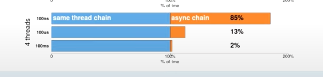