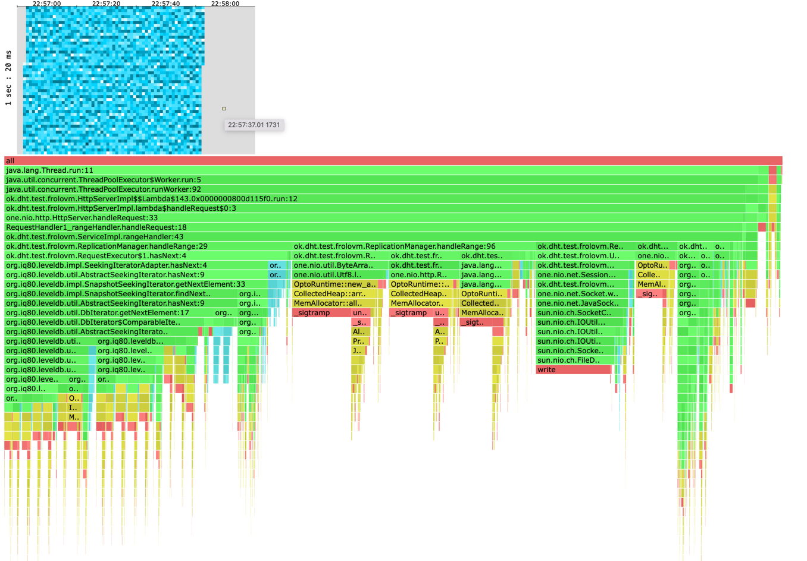
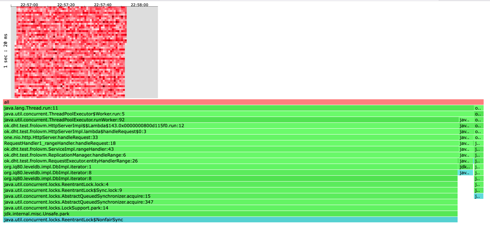
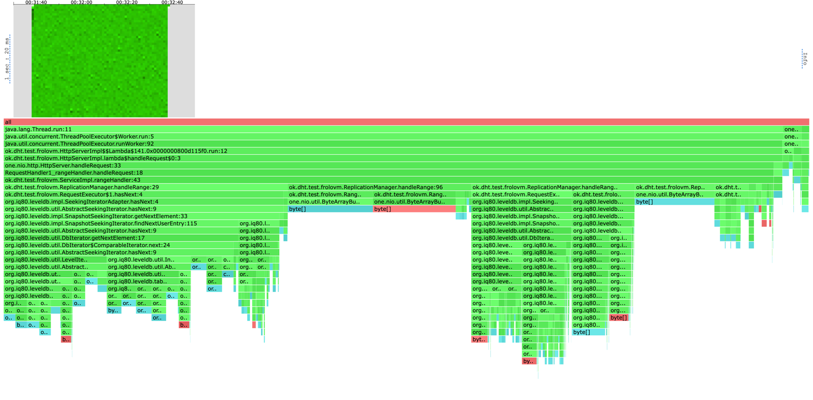
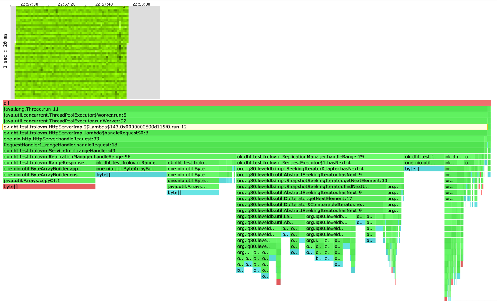

## Этап 6. Range-запросы

Реализуйте получение **диапазона данных текущего узла** с помощью HTTP `GET /v0/entities?start=<ID>[&end=<ID>]`, который возвращает:
* Статус код `200 OK`
* Возможно пустой **отсортированный** (по ключу) набор **ключей** и **значений** в диапазоне ключей от **обязательного** `start` (включая) до **опционального** `end` (не включая)
* Используйте [Chunked transfer encoding](https://en.wikipedia.org/wiki/Chunked_transfer_encoding)
* Чанки в формате `<key>\n<value>`

Диапазон должен отдаваться в **потоковом режиме** без формирования всего ответа в памяти.

# Отчет 

Для данного решения была использована отправка данных при помощи chunked transfer encoding. Теперь мы отвечаем на запросы 
сразу для какого-то промежутка ключей, вместо один запрос - один ключ. \ 
Важной константой, которая была подобрана в ходе эксперементов был размер буфера CHUNK_REQUEST_CAPACITY.

Так для range=100, наиболее эффективной константой был размер буфера = 512, а для range=500 - 1024.
В дальнейшем я буду преимущественно тестировать на range=10, 100, поэтому выбрал константу = 512.

Проведем исследования нашего решения для различных диапазонов range=10, range=100, range=500.

RANGE=10 RATE=10000
```
Running 1m test @ http://localhost:42342
  6 threads and 64 connections
  Thread calibration: mean lat.: 47.495ms, rate sampling interval: 185ms
  Thread calibration: mean lat.: 54.411ms, rate sampling interval: 244ms
  Thread calibration: mean lat.: 61.752ms, rate sampling interval: 242ms
  Thread calibration: mean lat.: 57.397ms, rate sampling interval: 220ms
  Thread calibration: mean lat.: 50.275ms, rate sampling interval: 211ms
  Thread calibration: mean lat.: 57.077ms, rate sampling interval: 253ms
  Thread Stats   Avg      Stdev     Max   +/- Stdev
    Latency    74.39ms  102.18ms 465.15ms   84.81%
    Req/Sec     1.67k    79.09     1.84k    84.09%
  Latency Distribution (HdrHistogram - Recorded Latency)
 50.000%   20.75ms
 75.000%  110.53ms
 90.000%  235.90ms
 99.000%  391.93ms
 99.900%  436.99ms
 99.990%  457.47ms
 99.999%  463.61ms
100.000%  465.41ms

  Detailed Percentile spectrum:
       Value   Percentile   TotalCount 1/(1-Percentile)

       0.275     0.000000            1         1.00
       1.583     0.100000        49862         1.11
       2.445     0.200000        99730         1.25
       4.939     0.300000       149549         1.43
       8.287     0.400000       199446         1.67
      20.751     0.500000       249244         2.00
      33.215     0.550000       274145         2.22
      48.863     0.600000       299081         2.50
      67.263     0.650000       324034         2.86
      86.847     0.700000       348946         3.33
     110.527     0.750000       373896         4.00
     124.671     0.775000       386334         4.44
     140.543     0.800000       398800         5.00
     158.719     0.825000       411232         5.71
     178.431     0.850000       423705         6.67
     206.463     0.875000       436176         8.00
     221.823     0.887500       442404         8.89
     235.903     0.900000       448617        10.00
     251.007     0.912500       454845        11.43
     272.639     0.925000       461094        13.33
     301.311     0.937500       467330        16.00
     314.111     0.943750       470417        17.78
     324.863     0.950000       473567        20.00
     335.615     0.956250       476645        22.86
     346.879     0.962500       479818        26.67
     356.863     0.968750       482942        32.00
     360.959     0.971875       484452        35.56
     365.311     0.975000       486026        40.00
     369.919     0.978125       487599        45.71
     375.039     0.981250       489125        53.33
     380.415     0.984375       490685        64.00
     383.487     0.985938       491486        71.11
     386.303     0.987500       492266        80.00
     389.375     0.989062       492997        91.43
     393.471     0.990625       493773       106.67
     397.823     0.992188       494573       128.00
     399.871     0.992969       494943       142.22
     401.919     0.993750       495360       160.00
     404.223     0.994531       495770       182.86
     406.783     0.995313       496118       213.33
     410.623     0.996094       496501       256.00
     412.927     0.996484       496695       284.44
     415.231     0.996875       496893       320.00
     418.559     0.997266       497089       365.71
     421.375     0.997656       497284       426.67
     425.471     0.998047       497479       512.00
     427.519     0.998242       497576       568.89
     429.567     0.998437       497675       640.00
     431.615     0.998633       497775       731.43
     434.175     0.998828       497868       853.33
     437.247     0.999023       497961      1024.00
     438.783     0.999121       498016      1137.78
     439.807     0.999219       498058      1280.00
     441.087     0.999316       498112      1462.86
     442.623     0.999414       498153      1706.67
     444.927     0.999512       498207      2048.00
     445.695     0.999561       498226      2275.56
     446.975     0.999609       498255      2560.00
     447.743     0.999658       498278      2925.71
     448.767     0.999707       498299      3413.33
     450.303     0.999756       498324      4096.00
     451.583     0.999780       498336      4551.11
     452.607     0.999805       498350      5120.00
     453.375     0.999829       498360      5851.43
     455.167     0.999854       498373      6826.67
     456.447     0.999878       498385      8192.00
     457.215     0.999890       498392      9102.22
     457.727     0.999902       498398     10240.00
     458.751     0.999915       498406     11702.86
     459.519     0.999927       498410     13653.33
     460.287     0.999939       498416     16384.00
     460.543     0.999945       498419     18204.44
     461.311     0.999951       498424     20480.00
     461.311     0.999957       498424     23405.71
     461.567     0.999963       498427     27306.67
     461.823     0.999969       498430     32768.00
     462.079     0.999973       498432     36408.89
     462.335     0.999976       498434     40960.00
     463.103     0.999979       498436     46811.43
     463.103     0.999982       498436     54613.33
     463.359     0.999985       498438     65536.00
     463.615     0.999986       498441     72817.78
     463.615     0.999988       498441     81920.00
     463.615     0.999989       498441     93622.86
     463.615     0.999991       498441    109226.67
     463.871     0.999992       498443    131072.00
     463.871     0.999993       498443    145635.56
     463.871     0.999994       498443    163840.00
     463.871     0.999995       498443    187245.71
     463.871     0.999995       498443    218453.33
     464.895     0.999996       498444    262144.00
     464.895     0.999997       498444    291271.11
     464.895     0.999997       498444    327680.00
     464.895     0.999997       498444    374491.43
     464.895     0.999998       498444    436906.67
     465.407     0.999998       498445    524288.00
     465.407     1.000000       498445          inf
#[Mean    =       74.387, StdDeviation   =      102.177]
#[Max     =      465.152, Total count    =       498445]
#[Buckets =           27, SubBuckets     =         2048]
----------------------------------------------------------
  597941 requests in 1.00m, 111.87MB read
Requests/sec:   9965.58
Transfer/sec:      1.86MB
```

Для range=10 получилось стабильно обрабатывать запросы при Rate=10000, что означает, что мы передаем порядка 100.000 данных.


RANGE=100 RATE=3000
```
    Running 1m test @ http://localhost:42342
  6 threads and 64 connections
  Thread calibration: mean lat.: 4.500ms, rate sampling interval: 12ms
  Thread calibration: mean lat.: 4.420ms, rate sampling interval: 12ms
  Thread calibration: mean lat.: 4.617ms, rate sampling interval: 12ms
  Thread calibration: mean lat.: 4.788ms, rate sampling interval: 13ms
  Thread calibration: mean lat.: 4.613ms, rate sampling interval: 12ms
  Thread calibration: mean lat.: 4.638ms, rate sampling interval: 12ms
  Thread Stats   Avg      Stdev     Max   +/- Stdev
    Latency     7.41ms   16.64ms 444.42ms   96.59%
    Req/Sec   521.13    107.10     1.54k    71.94%
  Latency Distribution (HdrHistogram - Recorded Latency)
 50.000%    4.76ms
 75.000%    5.87ms
 90.000%    7.70ms
 99.000%   79.74ms
 99.900%  232.70ms
 99.990%  347.14ms
 99.999%  435.71ms
100.000%  444.67ms

  Detailed Percentile spectrum:
       Value   Percentile   TotalCount 1/(1-Percentile)

       0.556     0.000000            1         1.00
       3.265     0.100000        14993         1.11
       3.699     0.200000        30001         1.25
       4.065     0.300000        45020         1.43
       4.411     0.400000        60103         1.67
       4.759     0.500000        75087         2.00
       4.939     0.550000        82529         2.22
       5.135     0.600000        89938         2.50
       5.355     0.650000        97509         2.86
       5.595     0.700000       105024         3.33
       5.871     0.750000       112441         4.00
       6.047     0.775000       116192         4.44
       6.243     0.800000       119943         5.00
       6.475     0.825000       123629         5.71
       6.771     0.850000       127378         6.67
       7.159     0.875000       131143         8.00
       7.395     0.887500       132999         8.89
       7.695     0.900000       134864        10.00
       8.071     0.912500       136742        11.43
       8.599     0.925000       138611        13.33
       9.479     0.937500       140486        16.00
      10.231     0.943750       141425        17.78
      12.127     0.950000       142355        20.00
      16.095     0.956250       143292        22.86
      21.327     0.962500       144230        26.67
      26.447     0.968750       145165        32.00
      29.391     0.971875       145635        35.56
      33.119     0.975000       146101        40.00
      37.151     0.978125       146570        45.71
      43.423     0.981250       147038        53.33
      51.871     0.984375       147507        64.00
      56.863     0.985938       147740        71.11
      63.071     0.987500       147975        80.00
      71.935     0.989062       148212        91.43
      84.991     0.990625       148444       106.67
     100.159     0.992188       148677       128.00
     107.839     0.992969       148794       142.22
     115.519     0.993750       148912       160.00
     124.095     0.994531       149028       182.86
     134.143     0.995313       149146       213.33
     148.095     0.996094       149262       256.00
     158.079     0.996484       149321       284.44
     163.711     0.996875       149379       320.00
     171.263     0.997266       149439       365.71
     182.015     0.997656       149497       426.67
     193.535     0.998047       149555       512.00
     199.423     0.998242       149584       568.89
     205.439     0.998437       149613       640.00
     212.991     0.998633       149643       731.43
     225.407     0.998828       149673       853.33
     233.727     0.999023       149701      1024.00
     239.615     0.999121       149716      1137.78
     246.783     0.999219       149730      1280.00
     258.431     0.999316       149745      1462.86
     264.447     0.999414       149760      1706.67
     269.055     0.999512       149774      2048.00
     276.479     0.999561       149782      2275.56
     278.783     0.999609       149789      2560.00
     283.391     0.999658       149796      2925.71
     287.487     0.999707       149804      3413.33
     293.375     0.999756       149811      4096.00
     303.615     0.999780       149815      4551.11
     318.975     0.999805       149818      5120.00
     333.567     0.999829       149822      5851.43
     340.735     0.999854       149826      6826.67
     346.623     0.999878       149829      8192.00
     346.879     0.999890       149831      9102.22
     348.671     0.999902       149833     10240.00
     353.791     0.999915       149835     11702.86
     360.959     0.999927       149837     13653.33
     361.983     0.999939       149838     16384.00
     363.007     0.999945       149839     18204.44
     367.871     0.999951       149840     20480.00
     369.919     0.999957       149841     23405.71
     378.367     0.999963       149842     27306.67
     395.007     0.999969       149843     32768.00
     395.007     0.999973       149843     36408.89
     410.111     0.999976       149844     40960.00
     410.111     0.999979       149844     46811.43
     424.959     0.999982       149845     54613.33
     424.959     0.999985       149845     65536.00
     424.959     0.999986       149845     72817.78
     435.711     0.999988       149846     81920.00
     435.711     0.999989       149846     93622.86
     435.711     0.999991       149846    109226.67
     435.711     0.999992       149846    131072.00
     435.711     0.999993       149846    145635.56
     444.671     0.999994       149847    163840.00
     444.671     1.000000       149847          inf
#[Mean    =        7.407, StdDeviation   =       16.641]
#[Max     =      444.416, Total count    =       149847]
#[Buckets =           27, SubBuckets     =         2048]
----------------------------------------------------------
  179947 requests in 1.00m, 6.82GB read
Requests/sec:   2999.11
Transfer/sec:    116.47MB
```

Для range=100 получилось стабильно обрабатывать запросы при Rate=3000, что означает, что мы передаем порядка 300.000 данных.

RANGE=250 RATE=1800
```
Running 1m test @ http://localhost:42342
  6 threads and 64 connections
  Thread calibration: mean lat.: 7.074ms, rate sampling interval: 21ms
  Thread calibration: mean lat.: 7.135ms, rate sampling interval: 21ms
  Thread calibration: mean lat.: 7.069ms, rate sampling interval: 20ms
  Thread calibration: mean lat.: 7.284ms, rate sampling interval: 21ms
  Thread calibration: mean lat.: 7.247ms, rate sampling interval: 21ms
  Thread calibration: mean lat.: 7.187ms, rate sampling interval: 21ms
  Thread Stats   Avg      Stdev     Max   +/- Stdev
    Latency     7.70ms    5.50ms 313.34ms   94.68%
    Req/Sec   307.36     60.38   578.00     68.88%
  Latency Distribution (HdrHistogram - Recorded Latency)
 50.000%    6.77ms
 75.000%    9.00ms
 90.000%   11.41ms
 99.000%   22.24ms
 99.900%   60.45ms
 99.990%  200.32ms
 99.999%  311.55ms
100.000%  313.60ms

  Detailed Percentile spectrum:
       Value   Percentile   TotalCount 1/(1-Percentile)

       1.804     0.000000            1         1.00
       4.335     0.100000         9016         1.11
       4.931     0.200000        18015         1.25
       5.483     0.300000        27005         1.43
       6.087     0.400000        35972         1.67
       6.767     0.500000        44965         2.00
       7.151     0.550000        49464         2.22
       7.567     0.600000        53983         2.50
       8.011     0.650000        58446         2.86
       8.487     0.700000        63000         3.33
       8.999     0.750000        67462         4.00
       9.279     0.775000        69705         4.44
       9.583     0.800000        71937         5.00
       9.943     0.825000        74197         5.71
      10.343     0.850000        76450         6.67
      10.823     0.875000        78711         8.00
      11.095     0.887500        79808         8.89
      11.407     0.900000        80923        10.00
      11.759     0.912500        82058        11.43
      12.191     0.925000        83185        13.33
      12.719     0.937500        84294        16.00
      13.015     0.943750        84860        17.78
      13.391     0.950000        85427        20.00
      13.807     0.956250        85984        22.86
      14.335     0.962500        86542        26.67
      15.103     0.968750        87107        32.00
      15.623     0.971875        87388        35.56
      16.327     0.975000        87667        40.00
      17.167     0.978125        87948        45.71
      18.047     0.981250        88231        53.33
      19.215     0.984375        88511        64.00
      19.823     0.985938        88651        71.11
      20.671     0.987500        88791        80.00
      21.631     0.989062        88930        91.43
      22.783     0.990625        89071       106.67
      23.823     0.992188        89213       128.00
      24.463     0.992969        89281       142.22
      25.503     0.993750        89352       160.00
      26.831     0.994531        89422       182.86
      28.431     0.995313        89492       213.33
      31.359     0.996094        89562       256.00
      33.375     0.996484        89597       284.44
      35.615     0.996875        89633       320.00
      37.919     0.997266        89668       365.71
      40.671     0.997656        89705       426.67
      44.223     0.998047        89738       512.00
      46.879     0.998242        89755       568.89
      48.511     0.998437        89773       640.00
      50.975     0.998633        89791       731.43
      55.647     0.998828        89808       853.33
      61.887     0.999023        89826      1024.00
      63.103     0.999121        89834      1137.78
      68.735     0.999219        89843      1280.00
      83.519     0.999316        89852      1462.86
      91.967     0.999414        89861      1706.67
     101.247     0.999512        89870      2048.00
     113.535     0.999561        89874      2275.56
     118.207     0.999609        89878      2560.00
     124.735     0.999658        89883      2925.71
     133.631     0.999707        89887      3413.33
     142.463     0.999756        89892      4096.00
     144.127     0.999780        89894      4551.11
     150.527     0.999805        89896      5120.00
     161.791     0.999829        89898      5851.43
     172.799     0.999854        89900      6826.67
     198.911     0.999878        89903      8192.00
     200.319     0.999890        89904      9102.22
     224.383     0.999902        89905     10240.00
     226.687     0.999915        89906     11702.86
     228.351     0.999927        89907     13653.33
     254.591     0.999939        89908     16384.00
     254.975     0.999945        89909     18204.44
     254.975     0.999951        89909     20480.00
     284.671     0.999957        89910     23405.71
     284.671     0.999963        89910     27306.67
     285.439     0.999969        89911     32768.00
     285.439     0.999973        89911     36408.89
     285.439     0.999976        89911     40960.00
     311.551     0.999979        89912     46811.43
     311.551     0.999982        89912     54613.33
     311.551     0.999985        89912     65536.00
     311.551     0.999986        89912     72817.78
     311.551     0.999988        89912     81920.00
     313.599     0.999989        89913     93622.86
     313.599     1.000000        89913          inf
#[Mean    =        7.696, StdDeviation   =        5.501]
#[Max     =      313.344, Total count    =        89913]
#[Buckets =           27, SubBuckets     =         2048]
----------------------------------------------------------
  107982 requests in 1.00m, 15.72GB read
Requests/sec:   1799.48
Transfer/sec:    268.28MB
```

Для range=250 получилось стабильно обрабатывать запросы при Rate=1800, что означает, что мы передаем порядка 450.000 данных.

## Сравнение

Для наглядности сравним результаты для кода, который был на Stage2 (до шардирования и репликации).

### GET STAGE2
```
wrk2 -t 6 -c 64 -d 60s -R 50000 -s requests-wrk/get-requests.lua --latency http://localhost:42342
Running 1m test @ http://localhost:42342
  6 threads and 64 connections
  Thread calibration: mean lat.: 15.313ms, rate sampling interval: 87ms
  Thread calibration: mean lat.: 14.938ms, rate sampling interval: 84ms
  Thread calibration: mean lat.: 14.619ms, rate sampling interval: 81ms
  Thread calibration: mean lat.: 15.165ms, rate sampling interval: 84ms
  Thread calibration: mean lat.: 14.685ms, rate sampling interval: 76ms
  Thread calibration: mean lat.: 13.939ms, rate sampling interval: 78ms
  Thread Stats   Avg      Stdev     Max   +/- Stdev
    Latency     1.71ms    3.57ms  78.40ms   97.81%
    Req/Sec     8.39k   345.05    13.34k    96.95%
  Latency Distribution (HdrHistogram - Recorded Latency)
 50.000%    1.27ms
 75.000%    1.72ms
 90.000%    2.18ms
 99.000%   14.25ms
 99.900%   57.82ms
 99.990%   72.96ms
 99.999%   76.67ms
100.000%   78.46ms

  Detailed Percentile spectrum:
       Value   Percentile   TotalCount 1/(1-Percentile)

       0.048     0.000000            2         1.00
       0.594     0.100000       250590         1.11
       0.786     0.200000       499927         1.25
       0.953     0.300000       750577         1.43
       1.112     0.400000       999953         1.67
       1.270     0.500000      1248886         2.00
       1.352     0.550000      1374502         2.22
       1.437     0.600000      1499456         2.50
       1.526     0.650000      1624259         2.86
       1.621     0.700000      1749325         3.33
       1.724     0.750000      1874167         4.00
       1.780     0.775000      1935719         4.44
       1.841     0.800000      1998125         5.00
       1.909     0.825000      2061035         5.71
       1.984     0.850000      2122939         6.67
       2.073     0.875000      2186075         8.00
       2.123     0.887500      2216883         8.89
       2.179     0.900000      2248160        10.00
       2.243     0.912500      2279726        11.43
       2.317     0.925000      2310430        13.33
       2.409     0.937500      2341877        16.00
       2.463     0.943750      2357346        17.78
       2.527     0.950000      2372708        20.00
       2.607     0.956250      2388400        22.86
       2.711     0.962500      2403914        26.67
       2.871     0.968750      2419509        32.00
       3.005     0.971875      2427184        35.56
       3.345     0.975000      2434997        40.00
       5.311     0.978125      2442799        45.71
       8.015     0.981250      2450597        53.33
      10.319     0.984375      2458402        64.00
      11.431     0.985938      2462326        71.11
      12.503     0.987500      2466222        80.00
      13.519     0.989062      2470140        91.43
      14.871     0.990625      2474009       106.67
      18.495     0.992188      2477931       128.00
      20.543     0.992969      2479879       142.22
      22.607     0.993750      2481819       160.00
      24.799     0.994531      2483782       182.86
      26.959     0.995313      2485727       213.33
      29.215     0.996094      2487684       256.00
      30.591     0.996484      2488650       284.44
      33.151     0.996875      2489623       320.00
      38.015     0.997266      2490598       365.71
      43.199     0.997656      2491579       426.67
      46.687     0.998047      2492548       512.00
      48.287     0.998242      2493039       568.89
      50.079     0.998437      2493521       640.00
      52.351     0.998633      2494013       731.43
      55.135     0.998828      2494496       853.33
      58.207     0.999023      2494986      1024.00
      59.775     0.999121      2495231      1137.78
      61.215     0.999219      2495471      1280.00
      62.751     0.999316      2495717      1462.86
      64.255     0.999414      2495961      1706.67
      65.855     0.999512      2496208      2048.00
      66.623     0.999561      2496329      2275.56
      67.455     0.999609      2496452      2560.00
      68.287     0.999658      2496579      2925.71
      69.055     0.999707      2496696      3413.33
      69.887     0.999756      2496820      4096.00
      70.335     0.999780      2496885      4551.11
      70.783     0.999805      2496937      5120.00
      71.295     0.999829      2496997      5851.43
      71.807     0.999854      2497059      6826.67
      72.383     0.999878      2497120      8192.00
      72.767     0.999890      2497155      9102.22
      73.023     0.999902      2497185     10240.00
      73.343     0.999915      2497211     11702.86
      73.727     0.999927      2497240     13653.33
      74.175     0.999939      2497272     16384.00
      74.367     0.999945      2497285     18204.44
      74.623     0.999951      2497301     20480.00
      74.943     0.999957      2497318     23405.71
      75.199     0.999963      2497332     27306.67
      75.519     0.999969      2497348     32768.00
      75.711     0.999973      2497356     36408.89
      75.839     0.999976      2497365     40960.00
      75.967     0.999979      2497370     46811.43
      76.223     0.999982      2497379     54613.33
      76.415     0.999985      2497385     65536.00
      76.543     0.999986      2497388     72817.78
      76.607     0.999988      2497392     81920.00
      76.671     0.999989      2497397     93622.86
      76.799     0.999991      2497401    109226.67
      76.927     0.999992      2497403    131072.00
      76.991     0.999993      2497406    145635.56
      77.055     0.999994      2497411    163840.00
      77.055     0.999995      2497411    187245.71
      77.055     0.999995      2497411    218453.33
      77.247     0.999996      2497413    262144.00
      77.311     0.999997      2497414    291271.11
      77.375     0.999997      2497416    327680.00
      77.375     0.999997      2497416    374491.43
      77.503     0.999998      2497417    436906.67
      77.567     0.999998      2497418    524288.00
      77.567     0.999998      2497418    582542.22
      77.759     0.999998      2497419    655360.00
      77.759     0.999999      2497419    748982.86
      77.823     0.999999      2497421    873813.33
      77.823     0.999999      2497421   1048576.00
      77.823     0.999999      2497421   1165084.44
      77.823     0.999999      2497421   1310720.00
      77.823     0.999999      2497421   1497965.71
      77.823     0.999999      2497421   1747626.67
      77.823     1.000000      2497421   2097152.00
      77.823     1.000000      2497421   2330168.89
      78.463     1.000000      2497422   2621440.00
      78.463     1.000000      2497422          inf
#[Mean    =        1.713, StdDeviation   =        3.567]
#[Max     =       78.400, Total count    =      2497422]
#[Buckets =           27, SubBuckets     =         2048]
----------------------------------------------------------
  2998741 requests in 1.00m, 191.29MB read
Requests/sec:  49979.38
Transfer/sec:      3.19MB
```

В данном случае Rate=50000 в течении 1 min. Значит, если мы хотим считывать диапазоны по 100, нам потребуется
в 'лучшем' случае 500 запросов для текущего решения:

Rate=500 
```
  Running 1m test @ http://localhost:42342
  6 threads and 64 connections
  Thread calibration: mean lat.: 3.071ms, rate sampling interval: 10ms
  Thread calibration: mean lat.: 3.054ms, rate sampling interval: 10ms
  Thread calibration: mean lat.: 3.070ms, rate sampling interval: 10ms
  Thread calibration: mean lat.: 3.083ms, rate sampling interval: 10ms
  Thread calibration: mean lat.: 2.807ms, rate sampling interval: 10ms
  Thread calibration: mean lat.: 2.877ms, rate sampling interval: 10ms
  Thread Stats   Avg      Stdev     Max   +/- Stdev
    Latency     2.90ms  760.38us   8.38ms   72.12%
    Req/Sec    90.59    103.30   333.00     63.49%
  Latency Distribution (HdrHistogram - Recorded Latency)
 50.000%    2.81ms
 75.000%    3.30ms
 90.000%    3.88ms
 99.000%    5.26ms
 99.900%    6.36ms
 99.990%    8.03ms
 99.999%    8.39ms
100.000%    8.39ms

  Detailed Percentile spectrum:
       Value   Percentile   TotalCount 1/(1-Percentile)

       0.403     0.000000            1         1.00
       2.029     0.100000         2504         1.11
       2.287     0.200000         4996         1.25
       2.475     0.300000         7497         1.43
       2.645     0.400000        10006         1.67
       2.813     0.500000        12501         2.00
       2.899     0.550000        13756         2.22
       2.985     0.600000        15000         2.50
       3.077     0.650000        16243         2.86
       3.179     0.700000        17475         3.33
       3.299     0.750000        18743         4.00
       3.367     0.775000        19351         4.44
       3.443     0.800000        19981         5.00
       3.525     0.825000        20610         5.71
       3.623     0.850000        21226         6.67
       3.735     0.875000        21847         8.00
       3.799     0.887500        22153         8.89
       3.883     0.900000        22466        10.00
       3.969     0.912500        22777        11.43
       4.063     0.925000        23091        13.33
       4.179     0.937500        23403        16.00
       4.247     0.943750        23559        17.78
       4.319     0.950000        23721        20.00
       4.395     0.956250        23872        22.86
       4.483     0.962500        24029        26.67
       4.583     0.968750        24182        32.00
       4.643     0.971875        24263        35.56
       4.703     0.975000        24340        40.00
       4.771     0.978125        24417        45.71
       4.863     0.981250        24493        53.33
       4.939     0.984375        24570        64.00
       5.035     0.985938        24611        71.11
       5.127     0.987500        24649        80.00
       5.187     0.989062        24687        91.43
       5.283     0.990625        24726       106.67
       5.355     0.992188        24768       128.00
       5.403     0.992969        24785       142.22
       5.467     0.993750        24804       160.00
       5.535     0.994531        24824       182.86
       5.583     0.995313        24843       213.33
       5.671     0.996094        24863       256.00
       5.719     0.996484        24874       284.44
       5.787     0.996875        24882       320.00
       5.815     0.997266        24892       365.71
       5.907     0.997656        24902       426.67
       6.015     0.998047        24912       512.00
       6.059     0.998242        24918       568.89
       6.119     0.998437        24921       640.00
       6.155     0.998633        24926       731.43
       6.291     0.998828        24931       853.33
       6.459     0.999023        24936      1024.00
       6.711     0.999121        24940      1137.78
       6.719     0.999219        24941      1280.00
       6.799     0.999316        24943      1462.86
       6.899     0.999414        24946      1706.67
       6.975     0.999512        24948      2048.00
       7.023     0.999561        24950      2275.56
       7.051     0.999609        24951      2560.00
       7.147     0.999658        24952      2925.71
       7.151     0.999707        24953      3413.33
       7.203     0.999756        24954      4096.00
       7.227     0.999780        24955      4551.11
       7.551     0.999805        24956      5120.00
       7.551     0.999829        24956      5851.43
       7.779     0.999854        24957      6826.67
       7.779     0.999878        24957      8192.00
       8.031     0.999890        24959      9102.22
       8.031     0.999902        24959     10240.00
       8.031     0.999915        24959     11702.86
       8.031     0.999927        24959     13653.33
       8.031     0.999939        24959     16384.00
       8.031     0.999945        24959     18204.44
       8.031     0.999951        24959     20480.00
       8.031     0.999957        24959     23405.71
       8.391     0.999963        24960     27306.67
       8.391     1.000000        24960          inf
#[Mean    =        2.902, StdDeviation   =        0.760]
#[Max     =        8.384, Total count    =        24960]
#[Buckets =           27, SubBuckets     =         2048]
----------------------------------------------------------
  30006 requests in 1.00m, 1.14GB read
Requests/sec:    500.06
Transfer/sec:     19.41MB
```

Как видим передаем данные в 10 раз быстрее, чем раньше. Однако понятно, что в реальности нам могут не потребоваться все 
100 значений из диапазона. Предположим, что нам нужны 1/4 данных при считывании диапазона, 
тогда делаем 500 * 4 = 2000 запросов и получаем:

```
Running 1m test @ http://localhost:42342
  6 threads and 64 connections
  Thread calibration: mean lat.: 3.831ms, rate sampling interval: 11ms
  Thread calibration: mean lat.: 3.961ms, rate sampling interval: 11ms
  Thread calibration: mean lat.: 3.771ms, rate sampling interval: 10ms
  Thread calibration: mean lat.: 3.930ms, rate sampling interval: 12ms
  Thread calibration: mean lat.: 5.960ms, rate sampling interval: 16ms
  Thread calibration: mean lat.: 3.909ms, rate sampling interval: 11ms
  Thread Stats   Avg      Stdev     Max   +/- Stdev
    Latency     4.27ms    1.65ms  27.55ms   73.35%
    Req/Sec   347.57    128.49   727.00     75.61%
  Latency Distribution (HdrHistogram - Recorded Latency)
 50.000%    3.84ms
 75.000%    5.18ms
 90.000%    6.58ms
 99.000%    9.18ms
 99.900%   10.77ms
 99.990%   22.42ms
 99.999%   27.04ms
100.000%   27.57ms

  Detailed Percentile spectrum:
       Value   Percentile   TotalCount 1/(1-Percentile)

       0.459     0.000000            1         1.00
       2.575     0.100000         9997         1.11
       2.953     0.200000        19987         1.25
       3.245     0.300000        30004         1.43
       3.521     0.400000        39976         1.67
       3.839     0.500000        49990         2.00
       4.033     0.550000        54972         2.22
       4.259     0.600000        59961         2.50
       4.523     0.650000        64947         2.86
       4.831     0.700000        69951         3.33
       5.175     0.750000        74968         4.00
       5.367     0.775000        77430         4.44
       5.567     0.800000        79929         5.00
       5.771     0.825000        82458         5.71
       5.999     0.850000        84930         6.67
       6.275     0.875000        87448         8.00
       6.415     0.887500        88664         8.89
       6.579     0.900000        89913        10.00
       6.763     0.912500        91160        11.43
       6.979     0.925000        92418        13.33
       7.227     0.937500        93671        16.00
       7.355     0.943750        94289        17.78
       7.515     0.950000        94925        20.00
       7.679     0.956250        95530        22.86
       7.879     0.962500        96156        26.67
       8.107     0.968750        96779        32.00
       8.223     0.971875        97101        35.56
       8.359     0.975000        97414        40.00
       8.487     0.978125        97728        45.71
       8.639     0.981250        98035        53.33
       8.815     0.984375        98351        64.00
       8.911     0.985938        98508        71.11
       8.999     0.987500        98654        80.00
       9.111     0.989062        98815        91.43
       9.223     0.990625        98966       106.67
       9.367     0.992188        99123       128.00
       9.447     0.992969        99201       142.22
       9.535     0.993750        99279       160.00
       9.631     0.994531        99360       182.86
       9.743     0.995313        99434       213.33
       9.863     0.996094        99513       256.00
       9.935     0.996484        99554       284.44
      10.015     0.996875        99589       320.00
      10.095     0.997266        99629       365.71
      10.159     0.997656        99668       426.67
      10.247     0.998047        99707       512.00
      10.327     0.998242        99729       568.89
      10.423     0.998437        99744       640.00
      10.519     0.998633        99765       731.43
      10.615     0.998828        99784       853.33
      10.791     0.999023        99804      1024.00
      10.967     0.999121        99813      1137.78
      11.135     0.999219        99822      1280.00
      11.383     0.999316        99832      1462.86
      11.575     0.999414        99842      1706.67
      11.935     0.999512        99852      2048.00
      12.127     0.999561        99857      2275.56
      12.359     0.999609        99861      2560.00
      12.847     0.999658        99866      2925.71
      13.647     0.999707        99871      3413.33
      13.943     0.999756        99876      4096.00
      14.575     0.999780        99879      4551.11
      14.919     0.999805        99881      5120.00
      15.647     0.999829        99883      5851.43
      18.175     0.999854        99886      6826.67
      22.047     0.999878        99888      8192.00
      22.415     0.999890        99890      9102.22
      22.431     0.999902        99891     10240.00
      23.391     0.999915        99892     11702.86
      23.583     0.999927        99894     13653.33
      23.583     0.999939        99894     16384.00
      24.095     0.999945        99895     18204.44
      24.271     0.999951        99896     20480.00
      24.271     0.999957        99896     23405.71
      24.463     0.999963        99897     27306.67
      24.463     0.999969        99897     32768.00
      26.591     0.999973        99898     36408.89
      26.591     0.999976        99898     40960.00
      26.591     0.999979        99898     46811.43
      27.039     0.999982        99899     54613.33
      27.039     0.999985        99899     65536.00
      27.039     0.999986        99899     72817.78
      27.039     0.999988        99899     81920.00
      27.039     0.999989        99899     93622.86
      27.567     0.999991        99900    109226.67
      27.567     1.000000        99900          inf
#[Mean    =        4.269, StdDeviation   =        1.651]
#[Max     =       27.552, Total count    =        99900]
#[Buckets =           27, SubBuckets     =         2048]
----------------------------------------------------------
  119656 requests in 1.00m, 4.54GB read
Requests/sec:   1993.80
Transfer/sec:     77.45MB
```

Получается ускорение производительности в 3 раза, что все еще делает данный способ получения данных очень эффективным.

Далее захотелось найти какой-то порог для небольших значений range, так как уже видно, что мы сильно выигрываем при больших range.

Результаты для range=10:

RATE=5000
```
  Detailed Percentile spectrum:
       Value   Percentile   TotalCount 1/(1-Percentile)
       0.224     0.000000            1         1.00
       0.639     0.100000        25021         1.11
       0.796     0.200000        49998         1.25
       0.945     0.300000        75103         1.43
       1.084     0.400000        99949         1.67
       1.221     0.500000       124953         2.00
       1.891     0.912500       227968        11.43
       1.931     0.925000       231076        13.33
       1.975     0.937500       234164        16.00
       2.000     0.943750       235755        17.78
       2.027     0.950000       237270        20.00
       2.057     0.956250       238861        22.86
       2.093     0.962500       240457        26.67
       2.133     0.968750       241942        32.00
       3.663     0.999993       249743    145635.56
       3.663     0.999994       249743    163840.00
       3.663     0.999995       249743    187245.71
       3.663     0.999995       249743    218453.33
       3.819     0.999996       249744    262144.00
       3.819     1.000000       249744          inf
#[Mean    =        1.241, StdDeviation   =        0.467]
#[Max     =        3.818, Total count    =       249744]
#[Buckets =           27, SubBuckets     =         2048]
----------------------------------------------------------
  299909 requests in 1.00m, 56.11MB read
Requests/sec:   4998.47
Transfer/sec:      0.94MB
```

RATE=10000

```
  Detailed Percentile spectrum:
       Value   Percentile   TotalCount 1/(1-Percentile)
       0.275     0.000000            1         1.00
       1.583     0.100000        49862         1.11
       2.445     0.200000        99730         1.25
       4.939     0.300000       149549         1.43
       8.287     0.400000       199446         1.67
      20.751     0.500000       249244         2.00
      33.215     0.550000       274145         2.22
      48.863     0.600000       299081         2.50
      67.263     0.650000       324034         2.86
      86.847     0.700000       348946         3.33
     110.527     0.750000       373896         4.00
     124.671     0.775000       386334         4.44
     401.919     0.993750       495360       160.00
     404.223     0.994531       495770       182.86
     463.871     0.999995       498443    218453.33
     464.895     0.999996       498444    262144.00
     464.895     0.999997       498444    291271.11
     464.895     0.999997       498444    327680.00
     464.895     0.999997       498444    374491.43
     464.895     0.999998       498444    436906.67
     465.407     0.999998       498445    524288.00
     465.407     1.000000       498445          inf
#[Mean    =       74.387, StdDeviation   =      102.177]
#[Max     =      465.152, Total count    =       498445]
#[Buckets =           27, SubBuckets     =         2048]
----------------------------------------------------------
  597941 requests in 1.00m, 111.87MB read
Requests/sec:   9965.58
Transfer/sec:      1.86MB
```

RATE=20k
```
  Detailed Percentile spectrum:
       Value   Percentile   TotalCount 1/(1-Percentile)
    4362.239     0.000000            1         1.00
    7102.463     0.100000        52257         1.11
    9494.527     0.200000       104487         1.25
   11845.631     0.300000       156715         1.43
   14196.735     0.400000       208888         1.67
   16596.991     0.500000       261097         2.00
   17858.559     0.550000       287346         2.22
   19021.823     0.600000       313248         2.50
   20201.471     0.650000       339506         2.86
   26656.767     0.925000       483108        13.33
   26935.295     0.937500       489391        16.00
   27082.751     0.943750       492610        17.78
   27246.591     0.950000       496150        20.00
   27394.047     0.956250       499211        22.86
   27574.271     0.962500       502365        26.67
   27770.879     0.968750       505796        32.00
   28753.919     0.999995       521918    187245.71
   28753.919     0.999995       521918    218453.33
   28770.303     0.999996       521920    262144.00
   28770.303     1.000000       521920          inf
#[Mean    =    16597.873, StdDeviation   =     6855.969]
#[Max     =    28753.920, Total count    =       521920]
#[Buckets =           27, SubBuckets     =         2048]
----------------------------------------------------------
  625177 requests in 1.00m, 116.96MB read
Requests/sec:  10419.73
Transfer/sec:      1.95MB
```

Т.е при range=10, Выдерживаем rate=10000 и получается передать порядка 100k данных, что в 2 раза больше, чем было раньше по 1 запросу. \
Для каждой конкретной ситуации придется мерить и подбирать размер диапазона (range), если нужно много данных в диапазоне, 
то ускорение будет большое, иначе возможно выгоднее читать по одному.

## Профилирование

### CPU


Видим, что теперь на профиле большую часть занимает вычисление запроса, тогда как раньше трудно было найти эту часть
на flamegraph. 

На проход итератором по базе (поиск, проверка следующего и считывание данных) тратится ~36% CPU.
Хочется предложить идею оптимизации на уровне самой бд реализовать поиск значений в диапазоне и вернуть сразу 
итератор по нужным значениям, это позволит убрать проверку hasNext и сильно увеличит производительность за счет 
уменьшения походов в память.

~31% тратится на формирования Response, что не так плохо с учетом того, что раньше данная часть занимала порядка 3%,
и если заскейлить на 100 запросов, то выйдет 300%.
~13% тратится на отправку Response, что тоже логично увеличилось из-за кол-ва данных.

Операция seek LevelDb работает хорошо и занимает только 2.7% раньше подобное значение было у операции get.

### ALLOC


34% аллокаций приходится на leveldb на SLice, выделение временных буферов. \
47% приходится на ByteArrayBuilder в createOneChunk. \
Остальные проценты уходят на аллокацию памяти для responses.

#### UPD: Оптимизировал createOneChunk сделал аллокацию ByteArrayBuilder заранее до appends.

Я сократил alloc в createOneChunk c 47% до 22%.




### LOCK


Основной lock занимает LevelDB iterator. Хорошей оптимизацией было бы использовать многопоточный GET. \
Так можно делать, например, в базе данных postgres. Однако для LevelDB не получилось найти подобной возможности.

# Итоги

Реализовали получение **диапазона данных текущего узла** с помощью HTTP. В итоге получилось получить серьезный прирост 
производительности для данных находящихся в диапазоне. \
Основная причина такого прироста понятна - мы делаем меньше HTTP запросов и ответов, которые 
как мы видели на предыдущих этапах составляют большую часть CPU, ALLOC, LOCK нашего сервиса.

В данном решении необходимо не забывать о константе CHUNK_RESPONSE_CAPACITY, которая должна быть подобрана исходя из задач, 
которые решает сервис, выше было описано, что чем больше размер данных в ответе, тем больше следует выбирать константу. 
Также важны параметры **размера** range и **процента данных** в range, которые будут нужны. Как было показано для range=100 и 
25% нужных данных в диапазоне получаем прирост в 3 раза по сравнению со считыванием по одному.

Из оптимизаций для базы данных хотелось бы получить интерфейс для считывания сразу диапазона данных, вместо прохода итератором,
так как тратится время на каждом шаге для hasNext, и внутри базы это можно реализовать куда эффективнее.