# PUT

####Приведу текст скрипта на lua:

[Lua put script](java/ok/dht/test/galeev/reports/scritps/put.lua)
```
cnt = 0
request = function()
    uri = "/v0/entity?id=K:" .. cnt
    wrk.body = "V:" .. cnt
    cnt = cnt + 1
    return wrk.format("PUT", uri)
end
```

## 13.5K
После перебора нескольких вариантов параметра `-R` - пришел к выводу, что средняя задержка от сервера находится в районе 2мс, что я считаю наиболее оптимальным.

```
└─$ wrk -t 1 -c 1 -d 60s -s /media/coradead/Windows1/Users/CORADEAD/IdeaProjects/2022-highload-dht/src/main/java/ok/dht/test/galeev/reports/scritps/put.lua -L http://localhost:19234 -R 13500
Running 1m test @ http://localhost:19234
  1 threads and 1 connections
  Thread calibration: mean lat.: 32.014ms, rate sampling interval: 342ms
  Thread Stats   Avg      Stdev     Max   +/- Stdev
    Latency     2.18ms    7.12ms  86.53ms   95.52%
    Req/Sec    13.52k   232.48    15.20k    91.78%
  Latency Distribution (HdrHistogram - Recorded Latency)
 50.000%  745.00us
 75.000%    1.07ms
 90.000%    2.22ms
 99.000%   46.17ms
 99.900%   70.78ms
 99.990%   85.06ms
 99.999%   86.59ms
100.000%   86.59ms
----------------------------------------------------------
  809970 requests in 1.00m, 51.75MB read
Requests/sec:  13499.82
Transfer/sec:      0.86MB
```

## 14K

```
└─$ wrk -t 1 -c 1 -d 60s -s /media/coradead/Windows1/Users/CORADEAD/IdeaProjects/2022-highload-dht/src/main/java/ok/dht/test/galeev/reports/scritps/put.lua -L http://localhost:19234 -R 14000 
Running 1m test @ http://localhost:19234
  1 threads and 1 connections
  Thread calibration: mean lat.: 93.228ms, rate sampling interval: 645ms
  Thread Stats   Avg      Stdev     Max   +/- Stdev
    Latency     6.25ms   12.63ms  67.20ms   90.21%
    Req/Sec    14.01k   245.50    15.35k    87.01%
  Latency Distribution (HdrHistogram - Recorded Latency)
 50.000%    0.92ms
 75.000%    4.93ms
 90.000%   18.64ms
 99.000%   58.21ms
 99.900%   65.60ms
 99.990%   66.82ms
 99.999%   67.20ms
100.000%   67.26ms
----------------------------------------------------------
  839968 requests in 1.00m, 53.67MB read
Requests/sec:  13999.63
Transfer/sec:      0.89MB
```

## Заполненная БД
```
└─$ wrk -t 1 -c 1 -d 60s -s /media/coradead/Windows1/Users/CORADEAD/IdeaProjects/2022-highload-dht/src/main/java/ok/dht/test/galeev/reports/scritps/put.lua -L http://localhost:19234 -R 13500  
Running 1m test @ http://localhost:19234
  1 threads and 1 connections
  Thread calibration: mean lat.: 124.930ms, rate sampling interval: 764ms
  Thread Stats   Avg      Stdev     Max   +/- Stdev
    Latency     2.74ms    6.68ms  52.99ms   92.75%
    Req/Sec    13.51k   115.23    14.05k    90.77%
  Latency Distribution (HdrHistogram - Recorded Latency)
 50.000%  774.00us
 75.000%    1.10ms
 90.000%    5.04ms
 99.000%   29.77ms
 99.900%   51.39ms
 99.990%   52.83ms
 99.999%   52.99ms
100.000%   53.02ms
----------------------------------------------------------
  809972 requests in 1.00m, 51.75MB read
Requests/sec:  13499.77
Transfer/sec:      0.86MB

```


## Графики:
### 1. Plotted latency graph для `put` на рейте в 13.5K
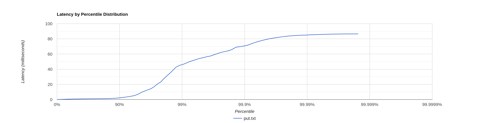

### 2. Plotted latency graph для `put` на рейте в 14K
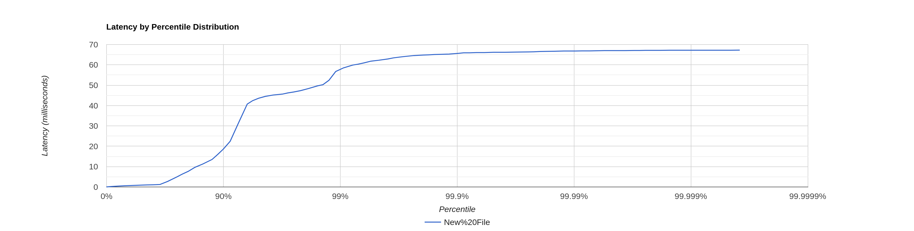

### 3. Plotted latency graph для `put` при заполненной БД
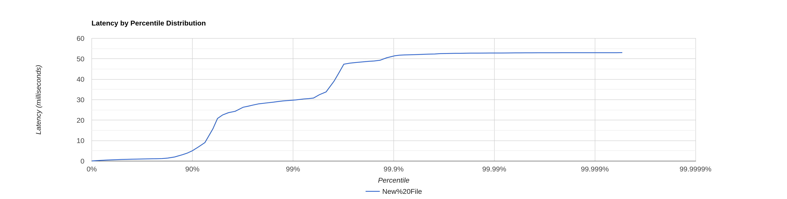

### 4. CPU async profiler 13.5K
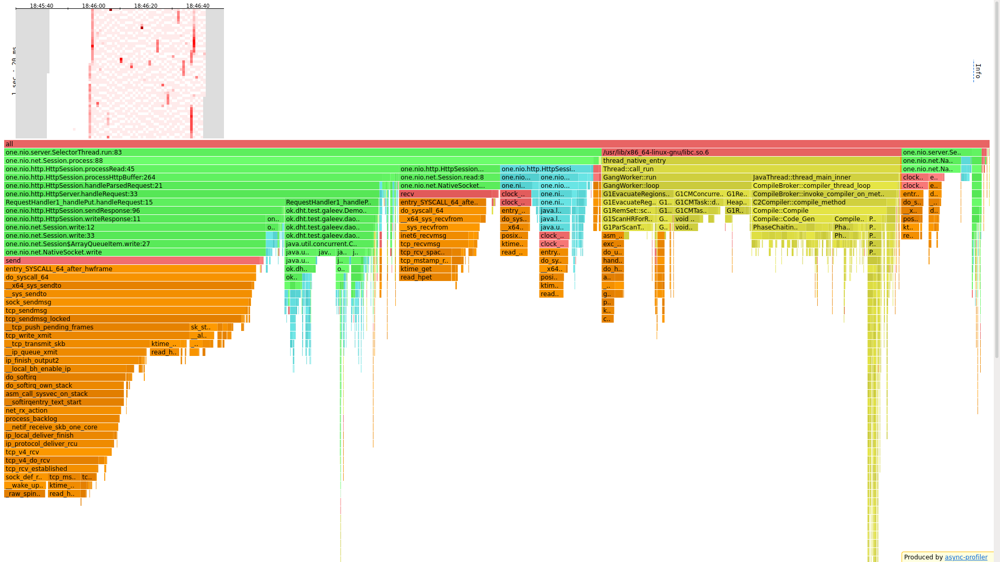

### 5. CPU async profiler 14K
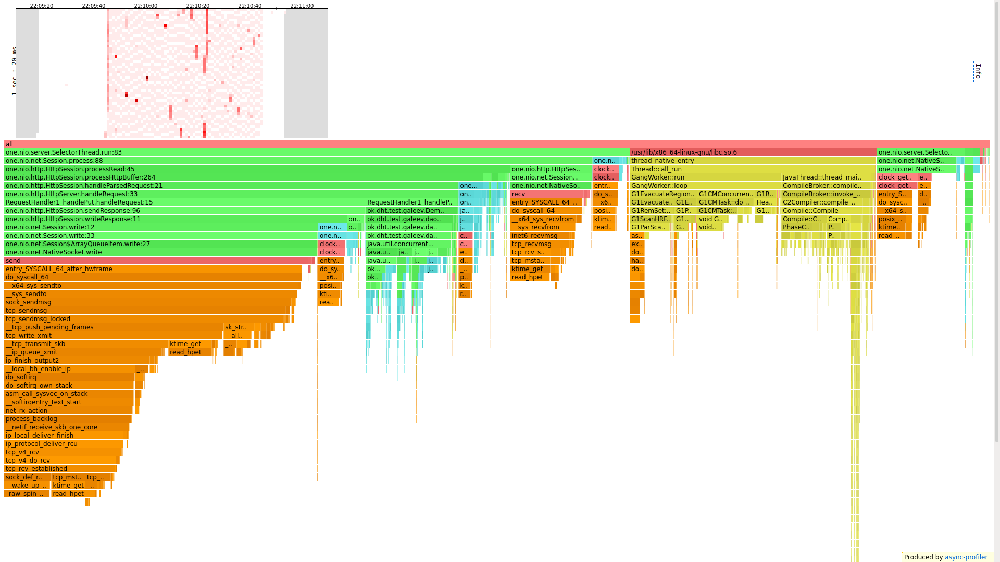

### 6. CPU async profiler 13.5K c заполненной БД
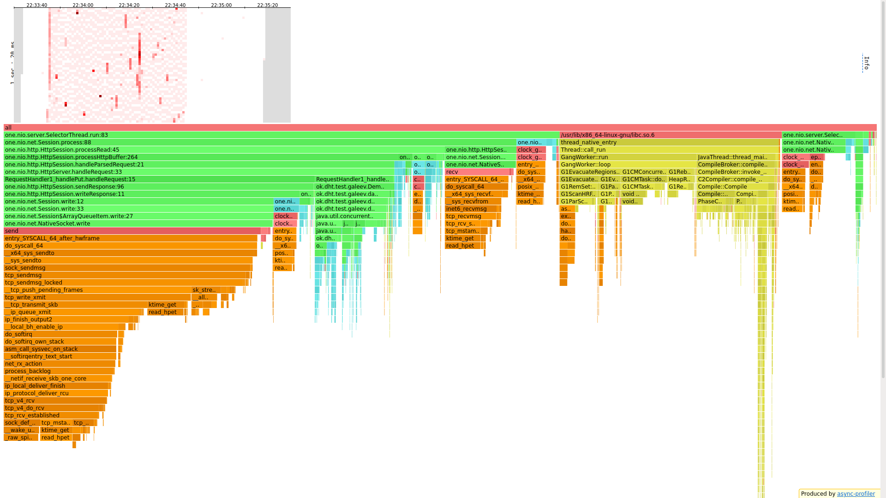

### 7. Alloc async profiler 13.5K
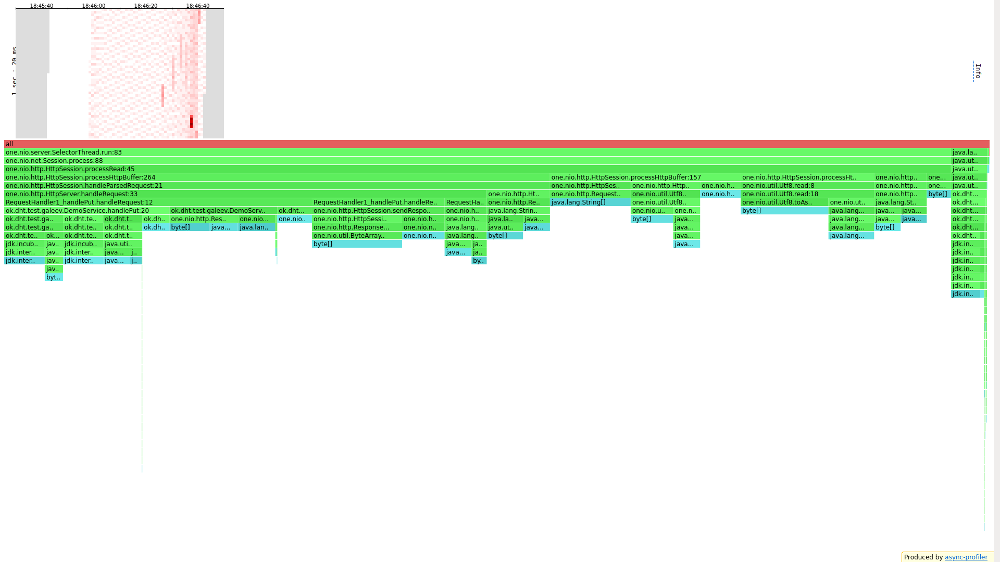

### 8. Alloc async profiler 14K
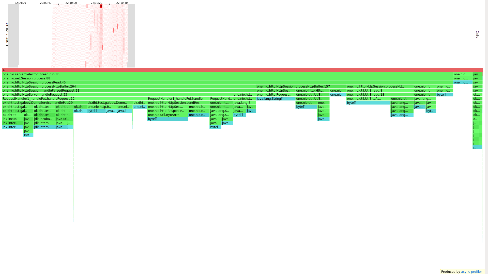

### 9. Alloc async profiler 13.5K c заполненной БД
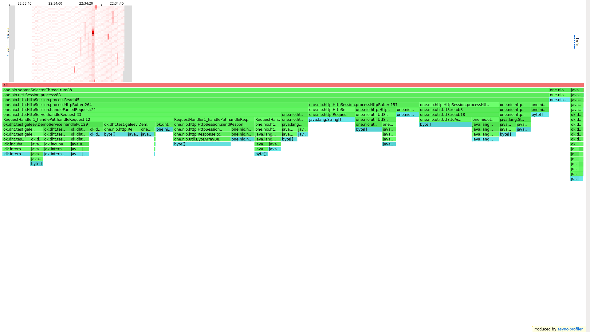

# GET

Для тестирования `get` была создана БД на 3Гб(примерно 70млн `entry`), размер файла 8/64Мб

[Lua get script для последовательного чтения](java/ok/dht/test/galeev/reports/scritps/get.lua)
```
cnt = 0
request = function()
    uri = string.format("/v0/entity?id=k%010d", cnt)
    cnt = cnt + 1
    return wrk.format("GET", uri, {})
end
```

[Lua get script для рандомного чтения](java/ok/dht/test/galeev/reports/scritps/getRandom.lua)

## 500
Размер файла - 16МБ. Пожалуй сразу попали в приемлемый результат
```
└─$ wrk -t 1 -c 1 -d 60s -s /media/coradead/Windows1/Users/CORADEAD/IdeaProjects/2022-highload-dht/src/main/java/ok/dht/test/galeev/reports/scritps/get.lua -L http://localhost:19234 -R 500  
Running 1m test @ http://localhost:19234
  1 threads and 1 connections
  Thread calibration: mean lat.: 2.104ms, rate sampling interval: 10ms
  Thread Stats   Avg      Stdev     Max   +/- Stdev
    Latency     1.92ms  484.60us  12.91ms   71.75%
    Req/Sec   526.14     66.87   800.00     63.94%
  Latency Distribution (HdrHistogram - Recorded Latency)
 50.000%    1.92ms
 75.000%    2.22ms
 90.000%    2.48ms
 99.000%    2.81ms
 99.900%    5.14ms
 99.990%   11.50ms
 99.999%   12.92ms
100.000%   12.92ms
----------------------------------------------------------
  30000 requests in 1.00m, 2.12MB read
Requests/sec:    500.00
Transfer/sec:     36.13KB
```

## 500, но размер файла увеличен до 64МБ
```
└─$ wrk -t 1 -c 1 -d 60s -s /media/coradead/Windows1/Users/CORADEAD/IdeaProjects/2022-highload-dht/src/main/java/ok/dht/test/galeev/reports/scritps/get.lua -L http://localhost:19234 -R 500 
Running 1m test @ http://localhost:19234
  1 threads and 1 connections
  Thread calibration: mean lat.: 2.217ms, rate sampling interval: 10ms
  Thread Stats   Avg      Stdev     Max   +/- Stdev
    Latency     1.29ms  361.43us   6.76ms   67.06%
    Req/Sec   527.50     65.35     0.89k    68.90%
  Latency Distribution (HdrHistogram - Recorded Latency)
 50.000%    1.28ms
 75.000%    1.54ms
 90.000%    1.74ms
 99.000%    2.07ms
 99.900%    3.28ms
 99.990%    5.80ms
 99.999%    6.76ms
100.000%    6.76ms
----------------------------------------------------------
  30000 requests in 1.00m, 2.12MB read
Requests/sec:    500.00
Transfer/sec:     36.13KB
```

## 500, но размер файла увеличен до 64МБ + случайное чтение
```
└─$ wrk -t 1 -c 1 -d 60s -s /media/coradead/Windows1/Users/CORADEAD/IdeaProjects/2022-highload-dht/src/main/java/ok/dht/test/galeev/reports/scritps/getRandom.lua -L http://localhost:19234 -R 500 
Running 1m test @ http://localhost:19234
  1 threads and 1 connections
  Thread calibration: mean lat.: 1.792ms, rate sampling interval: 10ms
  Thread Stats   Avg      Stdev     Max   +/- Stdev
    Latency     1.28ms  444.72us  11.44ms   67.62%
    Req/Sec   527.09     65.46     0.89k    62.95%
  Latency Distribution (HdrHistogram - Recorded Latency)
 50.000%    1.27ms
 75.000%    1.57ms
 90.000%    1.83ms
 99.000%    2.26ms
 99.900%    3.06ms
 99.990%    8.49ms
 99.999%   11.45ms
100.000%   11.45ms
----------------------------------------------------------
  30000 requests in 1.00m, 2.12MB read
Requests/sec:    500.00
Transfer/sec:     36.13KB
```

##Графики:
### 1. Plotted latency graph для `get`
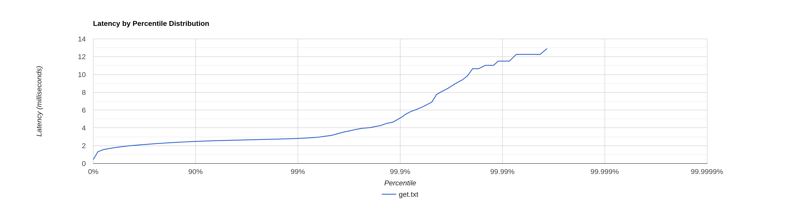

### 2. Plotted latency graph для `get`, но размер файла 64МБ
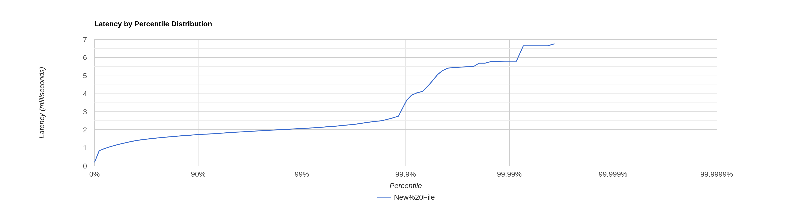

### 3. Plotted latency graph для `get`, но размер файла 64МБ + случайное чтение
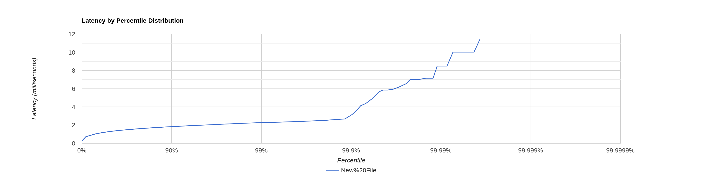

### 4. CPU async profiler
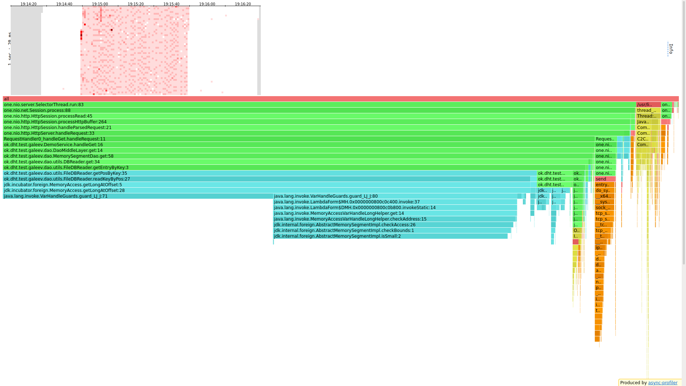

### 5. CPU async profiler with extended file size
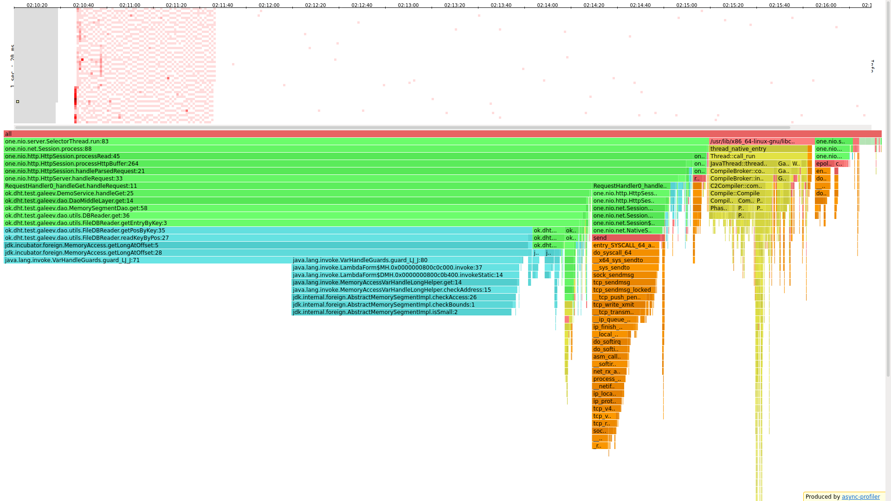

### 6. CPU async profiler with extended file size + random access
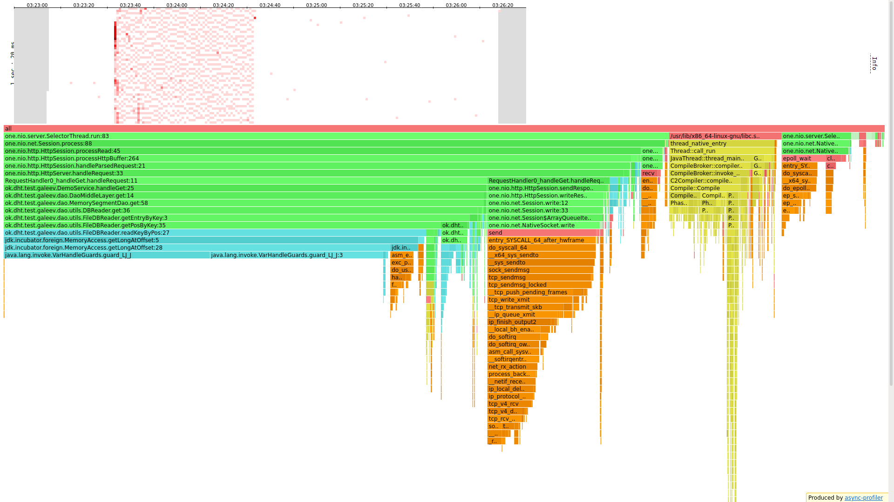

### 7. Alloc async profiler
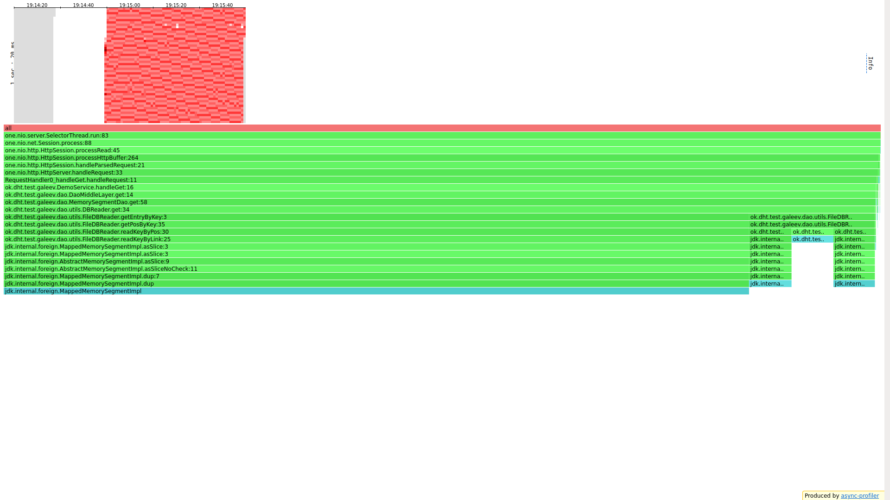

### 8. Alloc async profiler with extended file size
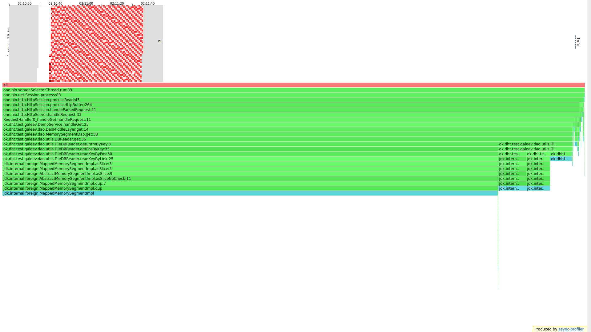

### 8. Alloc async profiler with extended file size + random access
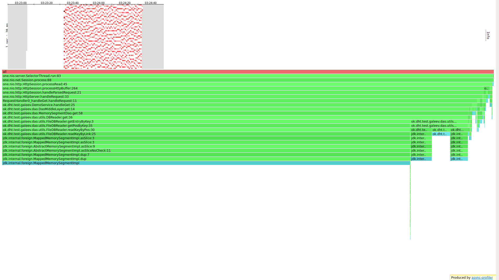

#Вывод

#### В первую очередь `put`.

Около трети всего времени занимала запись в сокеты. Еще треть занимала С++ библиотека `libc6.so`, которая отвечает за
построение программ, хотя это больше похоже на скриптик линковщика. В конечном итоге только 10% всего времени занимал
наш код, отвечающий за сохранение и запись. На хит мапе видны вертикальные красные полосы - это, как раз, и есть места
работы С++ библиотеки `libc6.so`.

Хочется заметить, что на данном железе нагрузка в 13.5К является наиболее оптимальной, потому что при увеличении даже
до 14к - задержка увеличивается с 2мс до 6мс, что на мой субъективный взгляд многовато(для меня +-2мс - это идеал).

Ограничения по памяти мы не можем изменять, поэтому объективно оценить влияние объема ОЗУ мы не можем, но можем
предположить, что это позволит операционной системе не сразу загружать файлы на жесткий диск, а только при заполнении ОЗУ.

При заполненной бд задержки никак не изменяются, потому что это особенность реализации реализованной нами бд. Новые
записи просто дописываются в конец новым файлом, а не перезаписывают старые, что мы и видим в результатах(погрешность
и все такое).

#### Теперь что качается `get`

Треть времени процессора занимает функция isSmall(), но при подробном рассмотрении ничего понятнее не становится, ведь
код функции - 1 строка буквально:
```
@Override
public boolean isSmall() {
    return isSet(SMALL);
}
```
И самое, что забавное - дочерняя функция isSet занимает 0.24% от родителя, а SMALL - статическая константа. И изменение
частоты семплирования ничего не дало.
В целом здесь ситуация обратная от put - здесь основное время занимал именно поиск - 87%, на сеть около 3%, 3.6% - уже
знакомая С++ библиотека libc.so и около 1.6 - сам сервер. Еще добавлю об одном из недостатков хендлеров через анотации -
функция PathMapper::find, которое расходует чуть меньше 1%. В данной ситуации этим можно пренебречь, но если целью будет
написать супер оптимизированный код - ВОЗМОЖНО - это будет одним из проблемных мест. Объективно 85% времени - это очень
много, данную ситуацию можно было бы облегчить применил фильтр Блума, который может сказать существует ли объект в базе. 

Основное выделение памяти происходило на то, чтобы создавать(читать с диска) MappedMemorySegment. 85% на сами данные, и
остальные 15% - позиции данных внутри одного файла (особенность реализации, за счет которой работает бинарный поиск по
файлу).

Сравним как изменится ситуация, при увеличении размер файла с 8МБ до 64МБ. В первую очередь сразу видно уменьшение
задержек с 2мс до 1.2мс. Это объясняется меньшим количеством сис колов, а так же более эффективной работой бинарного
поиска по большому файлу. Чем больше файл - тем эффективнее работает бинарный поиск.

При рандомном чтении - значительного ускорения не наблюдается, предполагаю, что это связано с тем, что бинарный поиск
работает всегда за логарифм от размера файла, а, учитывая тот факт, что размер файла не изменился - скорость работы 
осталась прежней. Единственное, что может улучшить ситуацию - выборка файлов. При последовательном чтении - у нас 
прочтутся все файлы, в то время как при случайном выборе ключей - может получиться так, что все запросы попадут в еще 
не записанные на жесткий диск файлы(ну тоесть в ОЗУ), что теоретически уменьшит задержки.


