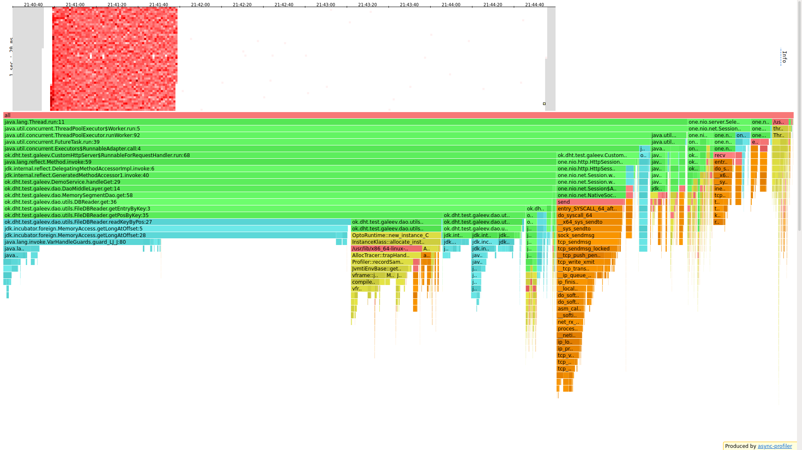
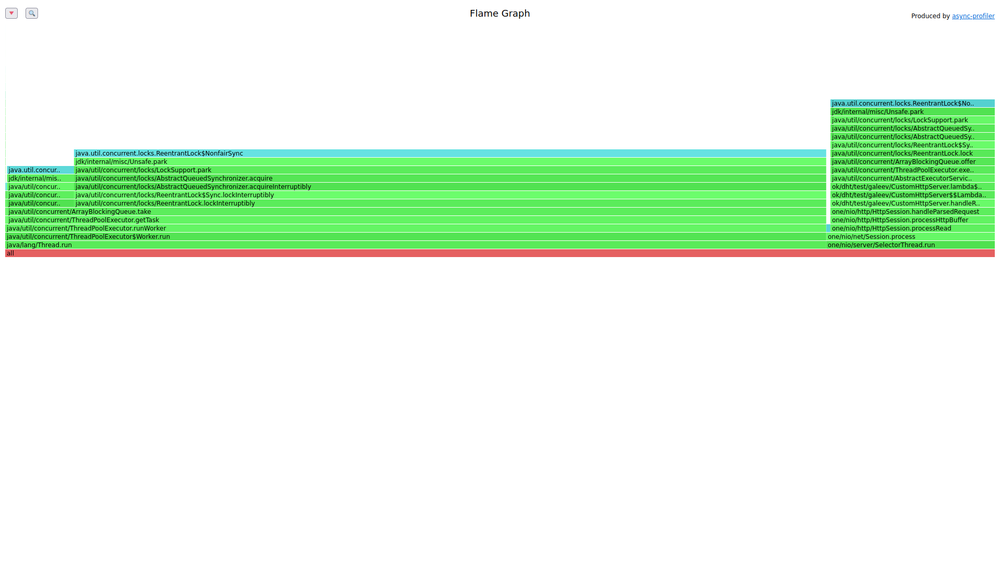

# Stage 2

## Количество потоков воркеров
Для начало нужно определиться с количеством воркеров. Определять будем с помощью get.

`Размер очереди 128(будут тесты, где это число меняется).`
### 10, как в selector thread
```
└─$ wrk -t 1 -c 1 -d 60s -s /media/coradead/Windows1/Users/CORADEAD/IdeaProjects/2022-highload-dht/src/main/java/ok/dht/test/galeev/reports/scritps/get.lua -L http://localhost:19234 -R 500 
Running 1m test @ http://localhost:19234
  1 threads and 1 connections
  Thread calibration: mean lat.: 1.490ms, rate sampling interval: 10ms
  Thread Stats   Avg      Stdev     Max   +/- Stdev
    Latency     1.21ms  429.15us  13.10ms   73.04%
    Req/Sec   527.76     68.15     1.11k    64.77%

```

### 32
```
└─$ wrk -t 1 -c 1 -d 60s -s /media/coradead/Windows1/Users/CORADEAD/IdeaProjects/2022-highload-dht/src/main/java/ok/dht/test/galeev/reports/scritps/get.lua -L http://localhost:19234 -R 500
Running 1m test @ http://localhost:19234
  1 threads and 1 connections
  Thread calibration: mean lat.: 1.826ms, rate sampling interval: 10ms
  Thread Stats   Avg      Stdev     Max   +/- Stdev
    Latency     1.37ms  392.57us  10.66ms   65.66%
    Req/Sec   527.61     45.25     1.00k    87.24%
```
Видим хоть и незначительное, но ухудшение в среднем времени, но улучшение максимального времени ожидания.
Идем дальше

### 64
```
└─$ wrk -t 1 -c 1 -d 60s -s /media/coradead/Windows1/Users/CORADEAD/IdeaProjects/2022-highload-dht/src/main/java/ok/dht/test/galeev/reports/scritps/get.lua -L http://localhost:19234 -R 500
Running 1m test @ http://localhost:19234
  1 threads and 1 connections
  Thread calibration: mean lat.: 1.910ms, rate sampling interval: 10ms
  Thread Stats   Avg      Stdev     Max   +/- Stdev
    Latency     1.29ms  367.81us   8.74ms   68.35%
    Req/Sec   527.89     59.58   777.00     70.52%
```

Среднее время не изменилось, но вот максимальное опять уменьшилось.
### 100
```
└─$ wrk -t 1 -c 1 -d 60s -s /media/coradead/Windows1/Users/CORADEAD/IdeaProjects/2022-highload-dht/src/main/java/ok/dht/test/galeev/reports/scritps/get.lua -L http://localhost:19234 -R 500
Running 1m test @ http://localhost:19234
  1 threads and 1 connections
  Thread calibration: mean lat.: 1.811ms, rate sampling interval: 10ms
  Thread Stats   Avg      Stdev     Max   +/- Stdev
    Latency     1.40ms  412.36us  11.30ms   66.63%
    Req/Sec   527.05     63.13   777.00     58.63%
```
Уже видим регрессию поэтому остановимся на 64, как более менее оптимальное количество воркеров,
обращающихся к DAO.


## Сравнение
В первую очередь обратим внимание, что мы освободили selector threads,
а значит теоретически, если раньше мы упирались в эти 10 selector thread,
то сейчас ситуация должна улучшиться. Давайте сравним. Например, недавний тест с 64 воркерами

Было
```
└─$ wrk -t 1 -c 1 -d 60s -s /media/coradead/Windows1/Users/CORADEAD/IdeaProjects/2022-highload-dht/src/main/java/ok/dht/test/galeev/reports/scritps/get.lua -L http://localhost:19234 -R 500 
Running 1m test @ http://localhost:19234
  1 threads and 1 connections
  Thread calibration: mean lat.: 2.217ms, rate sampling interval: 10ms
  Thread Stats   Avg      Stdev     Max   +/- Stdev
    Latency     1.29ms  361.43us   6.76ms   67.06%
    Req/Sec   527.50     65.35     0.89k    68.90%
```

Стало
```
└─$ wrk -t 1 -c 1 -d 60s -s /media/coradead/Windows1/Users/CORADEAD/IdeaProjects/2022-highload-dht/src/main/java/ok/dht/test/galeev/reports/scritps/get.lua -L http://localhost:19234 -R 500
Running 1m test @ http://localhost:19234
  1 threads and 1 connections
  Thread calibration: mean lat.: 1.910ms, rate sampling interval: 10ms
  Thread Stats   Avg      Stdev     Max   +/- Stdev
    Latency     1.29ms  367.81us   8.74ms   68.35%
    Req/Sec   527.89     59.58   777.00     70.52%
```
Стало даже хуже. Предположим, что преимущество новой версии появится при повышенной
нагрузке. Проверим увеличив количество потоков и каналов.

Было
```
└─$ wrk -t 6 -c 64 -d 60s -s /media/coradead/Windows1/Users/CORADEAD/IdeaProjects/2022-highload-dht/src/main/java/ok/dht/test/galeev/reports/scritps/get.lua -L http://localhost:19234 -R 40000
Running 1m test @ http://localhost:19234
  6 threads and 64 connections
  Thread calibration: mean lat.: 13.070ms, rate sampling interval: 10ms
  Thread calibration: mean lat.: 16.370ms, rate sampling interval: 10ms
  Thread calibration: mean lat.: 14.119ms, rate sampling interval: 10ms
  Thread calibration: mean lat.: 15.216ms, rate sampling interval: 10ms
  Thread calibration: mean lat.: 14.272ms, rate sampling interval: 10ms
  Thread calibration: mean lat.: 15.935ms, rate sampling interval: 10ms
  Thread Stats   Avg      Stdev     Max   +/- Stdev
    Latency     1.22ms  609.66us  14.98ms   67.94%
    Req/Sec     7.03k   515.23    13.22k    67.14%
```

Стало
```
└─$ wrk -t 6 -c 64 -d 60s -s /media/coradead/Windows1/Users/CORADEAD/IdeaProjects/2022-highload-dht/src/main/java/ok/dht/test/galeev/reports/scritps/get.lua -L http://localhost:19234 -R 40000
Running 1m test @ http://localhost:19234
  6 threads and 64 connections
  Thread calibration: mean lat.: 3.582ms, rate sampling interval: 14ms
  Thread calibration: mean lat.: 3.125ms, rate sampling interval: 13ms
  Thread calibration: mean lat.: 3.434ms, rate sampling interval: 15ms
  Thread calibration: mean lat.: 3.681ms, rate sampling interval: 14ms
  Thread calibration: mean lat.: 3.377ms, rate sampling interval: 13ms
  Thread calibration: mean lat.: 3.394ms, rate sampling interval: 14ms
  Thread Stats   Avg      Stdev     Max   +/- Stdev
    Latency     2.89ms    3.52ms  59.87ms   90.29%
    Req/Sec     6.93k     0.95k   12.25k    73.71%
```
Хуже во всем. Теперь же проведем повторные испытания, но в 1 поток.

Было
```
└─$ wrk -t 1 -c 64 -d 60s -s /media/coradead/Windows1/Users/CORADEAD/IdeaProjects/2022-highload-dht/src/main/java/ok/dht/test/galeev/reports/scritps/get.lua -L http://localhost:19234 -R 40000
Running 1m test @ http://localhost:19234
  1 threads and 64 connections
  Thread calibration: mean lat.: 776.579ms, rate sampling interval: 2312ms
  Thread Stats   Avg      Stdev     Max   +/- Stdev
    Latency    88.66ms  263.64ms   1.58s    90.25%
    Req/Sec    40.95k     2.34k   47.97k    85.71%
```
Стало
```
└─$ wrk -t 1 -c 64 -d 60s -s /media/coradead/Windows1/Users/CORADEAD/IdeaProjects/2022-highload-dht/src/main/java/ok/dht/test/galeev/reports/scritps/get.lua -L http://localhost:19234 -R 40000
Running 1m test @ http://localhost:19234
  1 threads and 64 connections
  Thread calibration: mean lat.: 63.969ms, rate sampling interval: 458ms
  Thread Stats   Avg      Stdev     Max   +/- Stdev
    Latency     8.15ms    9.40ms 107.97ms   87.54%
    Req/Sec    40.04k   399.67    41.21k    76.85%
```
Стало гораздо лучше.
Попробуем 1 поток, но количество соединений увеличим до 256:

Было
```
└─$ wrk -t 1 -c 256 -d 60s -s /media/coradead/Windows1/Users/CORADEAD/IdeaProjects/2022-highload-dht/src/main/java/ok/dht/test/galeev/reports/scritps/get.lua -L http://localhost:19234 -R 40000
Running 1m test @ http://localhost:19234
  1 threads and 256 connections
  Thread calibration: mean lat.: 1152.713ms, rate sampling interval: 3266ms
  Thread Stats   Avg      Stdev     Max   +/- Stdev
    Latency   287.07ms  489.16ms   2.18s    81.44%
    Req/Sec    41.46k     2.01k   45.15k    71.43%

```

Стало
```
└─$ wrk -t 1 -c 256 -d 60s -s /media/coradead/Windows1/Users/CORADEAD/IdeaProjects/2022-highload-dht/src/main/java/ok/dht/test/galeev/reports/scritps/get.lua -L http://localhost:19234 -R 40000                                                                         1 ⨯
Running 1m test @ http://localhost:19234
  1 threads and 256 connections
  Thread calibration: mean lat.: 95.370ms, rate sampling interval: 927ms
  Thread Stats   Avg      Stdev     Max   +/- Stdev
    Latency     3.83ms    1.55ms  16.45ms   66.69%
    Req/Sec    20.17k    35.78    20.24k    65.38%
```

Неужто чудо? А нет. Если пролистать ниже, то видно, что сервер просто захлебнулся
```
  1350971 requests in 1.00m, 95.34MB read
  Socket errors: connect 0, read 0, write 0, timeout 3122
Requests/sec:  22515.92
Transfer/sec:      1.59MB
```

##Посмотрим на флейм графы у `put` для `t=1` и `c=64`.

Было
```
└─$ wrk -t 1 -c 64 -d 60s -s /media/coradead/Windows1/Users/CORADEAD/IdeaProjects/2022-highload-dht/src/main/java/ok/dht/test/galeev/reports/scritps/put.lua -L http://localhost:19234 -R 40000
Running 1m test @ http://localhost:19234
  1 threads and 64 connections
  Thread calibration: mean lat.: 5.759ms, rate sampling interval: 35ms
  Thread Stats   Avg      Stdev     Max   +/- Stdev
    Latency     2.27ms    2.45ms  60.48ms   92.72%
    Req/Sec    40.59k     1.47k   48.24k    82.37%
  Latency Distribution (HdrHistogram - Recorded Latency)
 50.000%    1.68ms
 75.000%    2.40ms
 90.000%    3.80ms
 99.000%   12.48ms
 99.900%   28.88ms
 99.990%   46.85ms
 99.999%   58.81ms
100.000%   60.51ms
----------------------------------------------------------
  2393641 requests in 1.00m, 152.94MB read
Requests/sec:  39893.74
Transfer/sec:      2.55MB
```

Стало
```
└─$ wrk -t 1 -c 64 -d 60s -s /media/coradead/Windows1/Users/CORADEAD/IdeaProjects/2022-highload-dht/src/main/java/ok/dht/test/galeev/reports/scritps/put.lua -L http://localhost:19234 -R 40000
Running 1m test @ http://localhost:19234
  1 threads and 64 connections
  Thread calibration: mean lat.: 7.764ms, rate sampling interval: 42ms
  Thread Stats   Avg      Stdev     Max   +/- Stdev
    Latency     5.48ms    6.60ms  75.26ms   89.45%
    Req/Sec    40.48k     2.14k   47.88k    75.63%
  Latency Distribution (HdrHistogram - Recorded Latency)
 50.000%    3.13ms
 75.000%    6.53ms
 90.000%   12.46ms
 99.000%   34.33ms
 99.900%   56.06ms
 99.990%   68.10ms
 99.999%   73.47ms
100.000%   75.33ms
----------------------------------------------------------
  2393143 requests in 1.00m, 152.91MB read
Requests/sec:  39886.33
Transfer/sec:      2.55MB
```

Сразу заметим, что теперь selector thread занимает всего 15%, хотя как раньше занимал 70%.
А значит основную задачу пул воркеров выполнил, да и flamegraph стал равномернее.
А по памяти - теперь выделение проходит именно в воркерах, а не в selector thread'ах.
И на первый взгляд нагрузка на процессор стала чуть-чуть равномернее, но посмотрев на
выделение памяти - можно с уверенностью сказать, что стало гораздо лучше.

Cтало:


Было:


### Оптимизации
В первую очередь замечаешь, что теперь 28% занимает `take()` из очереди. Можно 
реализовать свою неблокирующую очередь, что(судя по локам) улучшит ситуацию. Воркер 
занимает 10% времени. Внутри же воркера можно увидеть огромное количество системных
вызовов на выделение памяти при конвертации string в byte[]. Половину времени работы \
воркера занимает добавление в скип лист, 13% локи, при которых происходит замера state,
но с ними мало, что сделаешь так же как и с 25% времени на аллокации, т.к. это системный 
вызов, а значит очень маловероятно, что получится что-то оптимизировать. У учитывая, что 
one.nio и ThreadPoolExecutor не оптимизируешь - мало, что можно сделать.

### Locks
По локам видно, что 70% локов занимает именно пул работников. А локов от DAO вообще не видно.
Selector thread'ы занимают 30%. Если улучшить очередь, то можно очень неплохо выиграть в
производительности.

##Посмотрим на флейм графы у `get` для `t=1` и `c=64`.
Теперь selector thread занимает всего 8%, хотя раньше занимал 80%.
А значит основную задачу пул воркеров выполнил, да и flamegraph стал
равномернее. По памяти ничего особо не изменилось(кроме того факта,
что теперь DAO выделяет память в воркерах).

Стало:





Было:


### Оптимизации
70% процессорного времени занимает именно get(), для его улучшения можно,
например, реализовать фильтр блума, который уменьшит количество запросов к
памяти. Еще можно сделать очередь задач неблокирующей, ведь take занимает
порядка 4.7%, а добавление 0.5%, но про это позже. А оптимизировать
использование памяти, как и в прошлом stage - не получится.

### Locks
Так же можем взглянуть на wall(решил попробовать, посмотреть что это),
lock events. Оптимизировать здесь мало что получится, так как на графике lock вообще
не видно функций DAO. 82% занимает take(), причем 76% это именно блокировки,
и лишь 6.7% - сон. А значит изменение очереди на неблокирующую позволит
сэкономить почти все локи на взятие задачи.

## Почему мы получили такие результаты?
Если посмотреть на flame graph stage1 при тех же условиях, то становится
понятно, в чем проблема. get у dao в новой версии занимает 69% времени,
в то время как у старой 77%. 5% - потребляет пул и еще 1% - invoke - особенность
реализации. А, учитывая тот факт, что ни один из запросов не отклонился из-за
переполнения очереди, вполне логично, что занимать это все будет столько же времени и даже больше,
ведь теперь еще приходится тратить время на пул, а количество ресурсов у системы не изменилось

## Об очереди
Уменьшив очередь, сервер сам начинает скипать запросы, что конечно значительно уменьшает
время ответа. Но вместо 40к ответ получают лишь 15к, но средняя задержки и максимальные
задержки стали очень маленькими. Например, для `get`, если размер очереди равен 16,
то сервер обрабатывает 15К/с, если же очередь равна 32, то количество обрабатываемых
запросов увеличивается до 20к/с, 64 - 40к/с, а максимальные задержки 11ms, 40ms, 66ms
соответственно.

Для очереди в 16 элементов:
```
└─$ wrk -t 1 -c 64 -d 60s -s /media/coradead/Windows1/Users/CORADEAD/IdeaProjects/2022-highload-dht/src/main/java/ok/dht/test/galeev/reports/scritps/get.lua -L http://localhost:19234 -R 40000
Running 1m test @ http://localhost:19234
  1 threads and 64 connections
  Thread calibration: mean lat.: 4.763ms, rate sampling interval: 10ms
  Thread Stats   Avg      Stdev     Max   +/- Stdev
    Latency     1.46ms  684.77us  11.00ms   71.85%
    Req/Sec    15.80k     0.98k   21.33k    73.22%
  Latency Distribution (HdrHistogram - Recorded Latency)
 50.000%    1.35ms
 75.000%    1.80ms
 90.000%    2.38ms
 99.000%    3.49ms
 99.900%    5.01ms
 99.990%    7.12ms
 99.999%    9.76ms
100.000%   11.01ms
-------------------------------------
901238 requests in 1.00m, 63.60MB read
  Socket errors: connect 0, read 0, write 0, timeout 1144
Requests/sec:  15020.76
Transfer/sec:      1.06MB
```
Для очереди в 32 элемента:
```
└─$ wrk -t 1 -c 64 -d 60s -s /media/coradead/Windows1/Users/CORADEAD/IdeaProjects/2022-highload-dht/src/main/java/ok/dht/test/galeev/reports/scritps/get.lua -L http://localhost:19234 -R 40000
Running 1m test @ http://localhost:19234
  1 threads and 64 connections
  Thread calibration: mean lat.: 4.333ms, rate sampling interval: 10ms
  Thread Stats   Avg      Stdev     Max   +/- Stdev
    Latency     1.61ms    1.62ms  40.10ms   96.43%
    Req/Sec    21.07k     1.53k   39.33k    83.28%
  Latency Distribution (HdrHistogram - Recorded Latency)
 50.000%    1.40ms
 75.000%    1.88ms
 90.000%    2.46ms
 99.000%    4.82ms
 99.900%   29.74ms
 99.990%   35.39ms
 99.999%   37.15ms
100.000%   40.13ms

---------------------------------------------
1210137 requests in 1.00m, 85.40MB read
  Socket errors: connect 0, read 0, write 0, timeout 928
Requests/sec:  20150.81
Transfer/sec:      1.42MB
```
Для очереди в 64 элемента:
```
└─$ wrk -t 1 -c 64 -d 60s -s /media/coradead/Windows1/Users/CORADEAD/IdeaProjects/2022-highload-dht/src/main/java/ok/dht/test/galeev/reports/scritps/get.lua -L http://localhost:19234 -R 40000
Running 1m test @ http://localhost:19234
  1 threads and 64 connections
  Thread calibration: mean lat.: 65.343ms, rate sampling interval: 418ms
  Thread Stats   Avg      Stdev     Max   +/- Stdev
    Latency     5.01ms    5.49ms  66.11ms   88.01%
    Req/Sec    40.05k   308.03    40.83k    76.27%
  Latency Distribution (HdrHistogram - Recorded Latency)
 50.000%    2.86ms
 75.000%    6.22ms
 90.000%   11.57ms
 99.000%   27.34ms
 99.900%   44.45ms
 99.990%   56.42ms
 99.999%   63.62ms
100.000%   66.18ms
----------------------------------------------------------
  2359760 requests in 1.00m, 166.53MB read
Requests/sec:  39329.54
Transfer/sec:      2.78MB
```

## Вывод
Реализованная фича при малом количестве соединений не дает заметных преимуществ, даже
наоборот ухудшает ситуацию, так как новая реализация потребляет некоторые
дополнительные ресурсы для своей работы, но при увеличении количества соединений более равномерная
нагрузка(судя по heatmap) предоставляет нам большее процессорное время, за счет чего
получаем выигрыш. Так же это получился хороший инструмент, который предоставляет
нам возможность изменять среднее, максимальное время ответа и количество обрабатываемых
запросов в секунду, за счет увеличения размера очереди. Все это происходит за счет
разгрузки selector thread'ов, которые своевременно добавляют новые задачи и удаляют
старые, при этом выполнением этих задач теперь занимается отдельный пул.