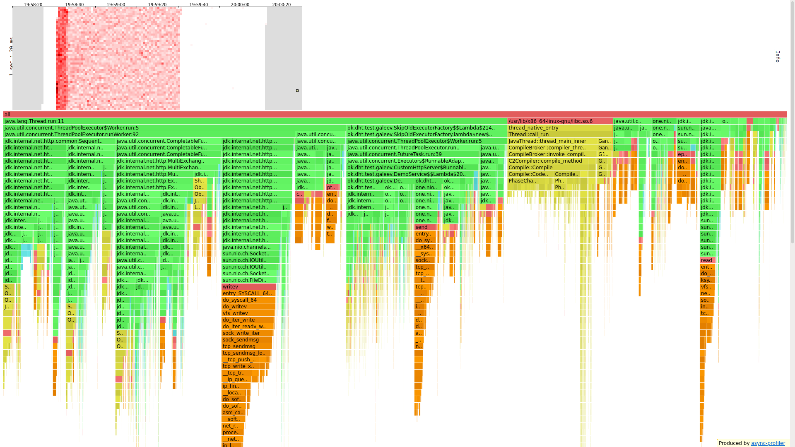
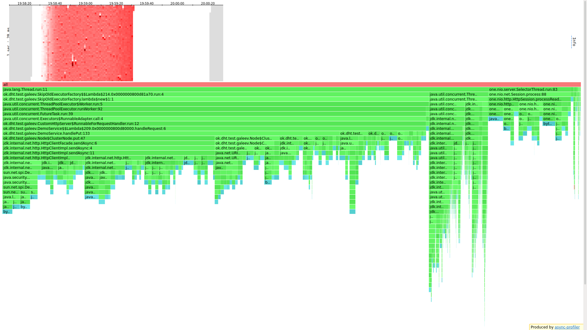
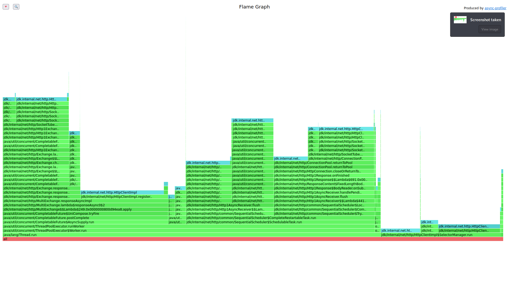
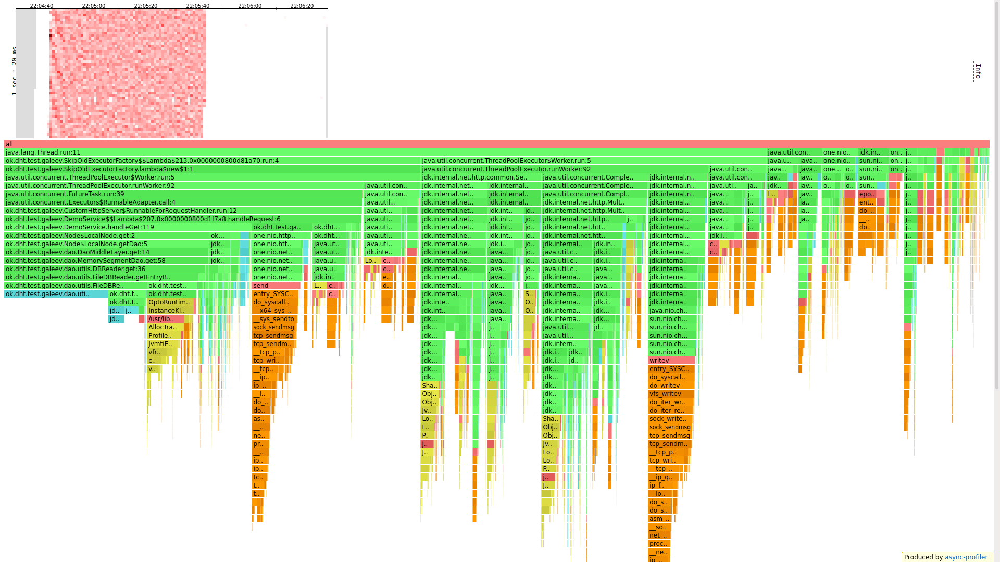
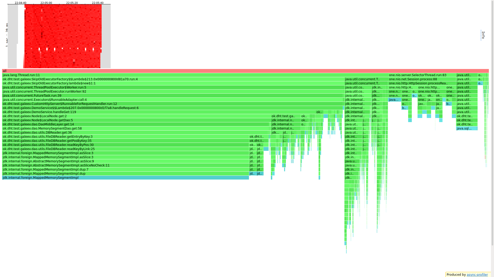
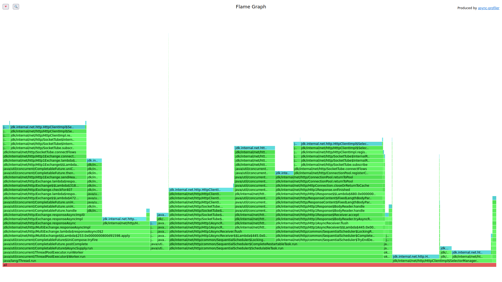

# Stage 4

## Предисловие
Была реализованна поддержка отправки запроса несколькими нодами одновременно. При отправке запроса на несколько - ноды
выбираются путем выбора следующей "по кругу".
\
Профайлер будут запускаться на ноде, куда мы отправляем запросы (она распределяет запросы на другие ноды).
Все запросы от wrk будут собирать кворум. Поле каждого замера все сервера перезапускаются.


## PUT

### Подбираем нагрузку
<details>
<summary>Put на 500</summary>
<pre>
└─$ wrk -t 1 -c 64 -d 60s -s /media/coradead/Windows1/Users/CORADEAD/IdeaProjects/2022-highload-dht/src/main/java/ok/dht/test/galeev/reports/scritps/put.lua -L http://localhost:19234 -R 500

Running 1m test @ http://localhost:19234
  1 threads and 64 connections
  Thread calibration: mean lat.: 10.560ms, rate sampling interval: 42ms
  Thread Stats   Avg      Stdev     Max   +/- Stdev
    Latency     4.96ms    1.54ms  29.54ms   80.96%
    Req/Sec   506.80    693.97     1.56k    68.46%
  Latency Distribution (HdrHistogram - Recorded Latency)
 50.000%    4.89ms
 75.000%    5.52ms
 90.000%    6.39ms
 99.000%    9.83ms
 99.900%   20.25ms
 99.990%   29.15ms
 99.999%   29.55ms
100.000%   29.55ms
----------------------------------------------------------
  29511 requests in 1.00m, 1.89MB read
Requests/sec:    491.74
Transfer/sec:     32.17KB
</pre>
</details>

Казалось бы относительно прошлого стейджа заметное ухудшение, но давайте попробуем еще раз, но с большим рейтом.
Вы скажете, зачем, все и так плохо, но результат удивителен.

<details>
<summary>Put на 600</summary>
<pre>
└─$ wrk -t 1 -c 64 -d 60s -s /media/coradead/Windows1/Users/CORADEAD/IdeaProjects/2022-highload-dht/src/main/java/ok/dht/test/galeev/reports/scritps/put.lua -L http://localhost:19234 -R 600

Running 1m test @ http://localhost:19234
  1 threads and 64 connections
  Thread calibration: mean lat.: 2.153ms, rate sampling interval: 10ms
  Thread Stats   Avg      Stdev     Max   +/- Stdev
    Latency     1.46ms  570.29us   9.86ms   68.03%
    Req/Sec   632.94    138.14     1.67k    75.68%
  Latency Distribution (HdrHistogram - Recorded Latency)
 50.000%    1.41ms
 75.000%    1.83ms
 90.000%    2.19ms
 99.000%    2.79ms
 99.900%    4.65ms
 99.990%    9.25ms
 99.999%    9.86ms
100.000%    9.86ms
----------------------------------------------------------
  35936 requests in 1.00m, 2.30MB read
Requests/sec:    598.94
Transfer/sec:     39.19KB
</pre>
</details>

Странно. Увеличим еще

<details>
<summary>Put на 700</summary>
<pre>
└─$ wrk -t 1 -c 64 -d 60s -s /media/coradead/Windows1/Users/CORADEAD/IdeaProjects/2022-highload-dht/src/main/java/ok/dht/test/galeev/reports/scritps/put.lua -L http://localhost:19234 -R 700

Running 1m test @ http://localhost:19234
  1 threads and 64 connections
  Thread calibration: mean lat.: 2.177ms, rate sampling interval: 10ms
  Thread Stats   Avg      Stdev     Max   +/- Stdev
    Latency     1.54ms  648.02us  26.11ms   75.29%
    Req/Sec   738.18    146.47     2.10k    65.39%
  Latency Distribution (HdrHistogram - Recorded Latency)
 50.000%    1.49ms
 75.000%    1.90ms
 90.000%    2.28ms
 99.000%    2.92ms
 99.900%    5.55ms
 99.990%   20.74ms
 99.999%   26.13ms
100.000%   26.13ms
----------------------------------------------------------
  41922 requests in 1.00m, 2.68MB read
Requests/sec:    698.69
Transfer/sec:     45.71KB
</pre>
</details>

Тут Тоже все неплохо, но заметно, что 99.990% задержки значительно выросли. Давайте значительно увеличим рейт.

<details>
<summary>Put на 1500</summary>
<pre>
└─$ wrk -t 1 -c 64 -d 60s -s /media/coradead/Windows1/Users/CORADEAD/IdeaProjects/2022-highload-dht/src/main/java/ok/dht/test/galeev/reports/scritps/put.lua -L http://localhost:19234 -R 1500

Running 1m test @ http://localhost:19234
1 threads and 64 connections
Thread calibration: mean lat.: 18.754ms, rate sampling interval: 21ms
Thread Stats   Avg      Stdev     Max   +/- Stdev
Latency     4.51ms    1.25ms  17.52ms   78.24%
Req/Sec     1.54k     1.27k    3.20k    28.77%
Latency Distribution (HdrHistogram - Recorded Latency)
50.000%    4.47ms
75.000%    5.09ms
90.000%    5.78ms
99.000%    8.81ms
99.900%   14.16ms
99.990%   16.66ms
99.999%   17.53ms
100.000%   17.53ms
</pre>
</details>

Наверное это и есть наш рейт, на котором будет в дальнейшем профилировать, но, интереса ради, поднимем еще

<details>
<summary>Put на 2000</summary>
<pre>
└─$ wrk -t 1 -c 64 -d 60s -s /media/coradead/Windows1/Users/CORADEAD/IdeaProjects/2022-highload-dht/src/main/java/ok/dht/test/galeev/reports/scritps/put.lua -L http://localhost:19234 -R 20
00

Running 1m test @ http://localhost:19234
1 threads and 64 connections
Thread calibration: mean lat.: 19.788ms, rate sampling interval: 22ms
Thread Stats   Avg      Stdev     Max   +/- Stdev
Latency     4.79ms    1.44ms  30.21ms   80.95%
Req/Sec     2.06k     1.18k    3.77k    72.75%
Latency Distribution (HdrHistogram - Recorded Latency)
50.000%    4.73ms
75.000%    5.37ms
90.000%    6.15ms
99.000%    9.45ms
99.900%   15.67ms
99.990%   29.44ms
99.999%   30.13ms
100.000%   30.22ms
----------------------------------------------------------
118066 requests in 1.00m, 7.54MB read
Requests/sec:   1967.25
Transfer/sec:    128.72KB
</pre>
</details>

Растет лишь 99.990 персентиль, среднее же время почти не изменяется. Увеличим еще 

<details>
<summary>Put на 4000</summary>
<pre>
└─$ wrk -t 1 -c 64 -d 60s -s /media/coradead/Windows1/Users/CORADEAD/IdeaProjects/2022-highload-dht/src/main/java/ok/dht/test/galeev/reports/scritps/put.lua -L http://localhost:19234 -R 4000

Running 1m test @ http://localhost:19234
1 threads and 64 connections
Thread calibration: mean lat.: 42.724ms, rate sampling interval: 431ms
Thread Stats   Avg      Stdev     Max   +/- Stdev
Latency     4.40ms    1.76ms  48.48ms   89.86%
Req/Sec     4.00k    14.37     4.05k    92.17%
Latency Distribution (HdrHistogram - Recorded Latency)
50.000%    4.27ms
75.000%    4.86ms
90.000%    5.56ms
99.000%    9.57ms
99.900%   31.06ms
99.990%   43.07ms
99.999%   46.59ms
100.000%   48.51ms
</pre>
</details>

Теперь уже растет 99.900% персентиль.

<details>
<summary>Put на 10000</summary>
<pre>
└─$ wrk -t 1 -c 64 -d 60s -s /media/coradead/Windows1/Users/CORADEAD/IdeaProjects/2022-highload-dht/src/main/java/ok/dht/test/galeev/reports/scritps/put.lua -L http://localhost:19234 -R 10
000

Running 1m test @ http://localhost:19234
1 threads and 64 connections
Thread calibration: mean lat.: 265.556ms, rate sampling interval: 1665ms
Thread Stats   Avg      Stdev     Max   +/- Stdev
Latency     5.27ms   12.19ms 166.02ms   97.25%
Req/Sec    10.01k   146.40    10.55k    93.10%
Latency Distribution (HdrHistogram - Recorded Latency)
50.000%    3.37ms
75.000%    3.96ms
90.000%    4.72ms
99.000%   83.20ms
99.900%  133.89ms
99.990%  148.48ms
99.999%  162.43ms
100.000%  166.14ms
----------------------------------------------------------
589955 requests in 1.00m, 37.70MB read
Requests/sec:   9832.65
Transfer/sec:    643.35KB
</pre>
</details>

Наконец заметный взлет, но при этом задержки меньше 99 персентиля очень низкие.
Если запустить на этом рейте с включенным профайлером, то задержки вырастают до 1с, поэтому возьмем что-то пониже.

<details>
<summary>Put на 6000</summary>
<pre>
└─$ wrk -t 1 -c 64 -d 60s -s /media/coradead/Windows1/Users/CORADEAD/IdeaProjects/2022-highload-dht/src/main/java/ok/dht/test/galeev/reports/scritps/put.lua -L http://localhost:19234 -R 6000

Running 1m test @ http://localhost:19234
1 threads and 64 connections
Thread calibration: mean lat.: 58.762ms, rate sampling interval: 581ms
Thread Stats   Avg      Stdev     Max   +/- Stdev
Latency     2.23ms    2.56ms  77.44ms   97.71%
Req/Sec     6.01k    26.18     6.13k    87.06%
Latency Distribution (HdrHistogram - Recorded Latency)
50.000%    1.86ms
75.000%    2.48ms
90.000%    3.46ms
99.000%    8.30ms
99.900%   39.36ms
99.990%   69.50ms
----------------------------------------------------------
359066 requests in 1.00m, 22.94MB read
Requests/sec:   5984.38
Transfer/sec:    391.56KB
</pre>
</details>

Пожалуй и будем использовать это в качестве рабочего значения.

### Профайлер

```
└─$ wrk -t 1 -c 64 -d 60s -s /media/coradead/Windows1/Users/CORADEAD/IdeaProjects/2022-highload-dht/src/main/java/ok/dht/test/galeev/reports/scritps/put.lua -L http://localhost:19234 -R 60
00

Running 1m test @ http://localhost:19234
  1 threads and 64 connections
  Thread calibration: mean lat.: 273.830ms, rate sampling interval: 1558ms
  Thread Stats   Avg      Stdev     Max   +/- Stdev
    Latency     2.36ms    3.42ms  82.05ms   97.67%
    Req/Sec     6.00k     3.98     6.01k    61.29%
  Latency Distribution (HdrHistogram - Recorded Latency)
 50.000%    1.94ms
 75.000%    2.31ms
 90.000%    2.80ms
 99.000%   14.45ms
 99.900%   55.71ms
 99.990%   77.38ms
 99.999%   81.41ms
100.000%   82.11ms
----------------------------------------------------------
  359073 requests in 1.00m, 22.94MB read
Requests/sec:   5984.49
Transfer/sec:    391.56KB
```

#### CPU

Для начала давайте посмотрим на код, где мы добавляем в нашу DAO/проксируем запросы/выбираем ноды.
Все это занимает 16.9%(от общего времени) из них 0.9%(от общего времени) занимает выбор нод консистентным хешированием,
1.9% занимает создание URI других нод. 4% занимает отправка ответов клиенту. И 5.4% занимает добавление в executor
запросов для отправки данных на другие ноды.
\
Отдалив экран, видим ужас. 50% занимает отправка запросов... Весьма ожидаемо, ведь мы делаем сразу 
2 отправки на ноды, для одного запроса.

#### Alloc

73% занимают воркеры. 2.2% выделят хеш роутер. 53% выделяется за СОЗДАНИЕ запросов к другим нодам,
еще 10% на отправку этих запросов. 14% выделяется на работу сервера one nio. Всего 2% на работу нашей 
DAO, но, хочется подметить, что объема данных не хватило, чтобы вызвать autoflush.

#### Lock

33% занимает ожидание ответа от нод, 3.5% добавление в очередь executor'а и еще 37.7 на отправку.
Еще 24% занимает one nio.

### 15 минутный тест

<details>
<summary>Put на 10к 15 минут</summary>
<pre>
└─$ wrk -t 1 -c 64 -d 900s -s /media/coradead/Windows1/Users/CORADEAD/IdeaProjects/2022-highload-dht/src/main/java/ok/dht/test/galeev/reports/scritps/put.lua -L http://localhost:19234 -R 10000

Running 15m test @ http://localhost:19234
1 threads and 64 connections
Thread calibration: mean lat.: 229.141ms, rate sampling interval: 1683ms
Thread Stats   Avg      Stdev     Max   +/- Stdev
Latency     2.13ms    1.21ms  78.14ms   86.94%
Req/Sec    10.00k    14.85    10.19k    94.13%
Latency Distribution (HdrHistogram - Recorded Latency)
50.000%    1.97ms
75.000%    2.45ms
90.000%    3.23ms
99.000%    5.22ms
99.900%   10.20ms
99.990%   44.16ms
99.999%   56.48ms
100.000%   78.21ms
----------------------------------------------------------
8998419 requests in 15.00m, 574.96MB read
Requests/sec:   9998.24
Transfer/sec:    654.18KB
</pre>
</details>

Весьма не похоже на то, что мы видели раньше. Очень низкая средняя задержка, да и самые большие персентили
не такие огромные как раньше. А значит для длительного использования - рейт будет выше. 

## GET

### Подбираем нагрузку
<details>
<summary>Get на 1000</summary>
<pre>
└─$ wrk -t 1 -c 64 -d 60s -s /media/coradead/Windows1/Users/CORADEAD/IdeaProjects/2022-highload-dht/src/main/java/ok/dht/test/galeev/reports/scritps/get.lua -L http://localhost:19234 -R 10
00

Running 1m test @ http://localhost:19234
1 threads and 64 connections
Thread calibration: mean lat.: 1.691ms, rate sampling interval: 10ms
Thread Stats   Avg      Stdev     Max   +/- Stdev
Latency     1.62ms  580.14us   9.10ms   67.16%
Req/Sec     1.05k   191.81     1.89k    73.53%
Latency Distribution (HdrHistogram - Recorded Latency)
50.000%    1.56ms
75.000%    1.99ms
90.000%    2.42ms
99.000%    3.06ms
99.900%    3.82ms
99.990%    7.13ms
99.999%    9.10ms
100.000%    9.10ms
----------------------------------------------------------
59873 requests in 1.00m, 3.93MB read
Requests/sec:    997.88
Transfer/sec:     67.06KB
</pre>
</details>

Очень мало. Скип.

<details>
<summary>Get на 2000</summary>
<pre>
└─$ wrk -t 1 -c 64 -d 60s -s /media/coradead/Windows1/Users/CORADEAD/IdeaProjects/2022-highload-dht/src/main/java/ok/dht/test/galeev/reports/scritps/get.lua -L http://localhost:19234 -R 2000

Running 1m test @ http://localhost:19234
1 threads and 64 connections
Thread calibration: mean lat.: 1.745ms, rate sampling interval: 10ms
Thread Stats   Avg      Stdev     Max   +/- Stdev
Latency     1.71ms  731.53us  17.60ms   68.74%
Req/Sec     2.11k   303.20     4.22k    66.45%
Latency Distribution (HdrHistogram - Recorded Latency)
50.000%    1.60ms
75.000%    2.16ms
90.000%    2.66ms
99.000%    3.32ms
99.900%    7.49ms
99.990%   11.88ms
99.999%   17.55ms
100.000%   17.61ms
----------------------------------------------------------
119711 requests in 1.00m, 7.89MB read
Requests/sec:   1995.19
Transfer/sec:    134.58KB
</pre>
</details>

Все еще неплохо, но 99.990% уже подросли. Идем дальше.

<details>
<summary>Get на 4000</summary>
<pre>
└─$ wrk -t 1 -c 64 -d 60s -s /media/coradead/Windows1/Users/CORADEAD/IdeaProjects/2022-highload-dht/src/main/java/ok/dht/test/galeev/reports/scritps/get.lua -L http://localhost:19234 -R 40
00

Running 1m test @ http://localhost:19234
1 threads and 64 connections
Thread calibration: mean lat.: 3.683ms, rate sampling interval: 10ms
Thread Stats   Avg      Stdev     Max   +/- Stdev
Latency     3.55ms    1.01ms  15.95ms   73.77%
Req/Sec     4.29k     2.78k    8.40k    59.00%
Latency Distribution (HdrHistogram - Recorded Latency)
50.000%    3.48ms
75.000%    4.09ms
90.000%    4.72ms
99.000%    6.30ms
99.900%   10.94ms
99.990%   14.02ms
99.999%   14.99ms
100.000%   15.96ms
----------------------------------------------------------
236028 requests in 1.00m, 15.65MB read
Requests/sec:   3933.62
Transfer/sec:    267.09KB
</pre>
</details>

Все еще мало. Идем дальше.

<details>
<summary>Put на 10000</summary>
<pre>
└─$ wrk -t 1 -c 64 -d 60s -s /media/coradead/Windows1/Users/CORADEAD/IdeaProjects/2022-highload-dht/src/main/java/ok/dht/test/galeev/reports/scritps/get.lua -L http://localhost:19234 -R 10000

Running 1m test @ http://localhost:19234
1 threads and 64 connections
Thread calibration: mean lat.: 2.151ms, rate sampling interval: 10ms
Thread Stats   Avg      Stdev     Max   +/- Stdev
Latency     2.15ms  776.19us  21.39ms   81.45%
Req/Sec    10.55k     0.96k   18.40k    77.50%
Latency Distribution (HdrHistogram - Recorded Latency)
50.000%    2.05ms
75.000%    2.43ms
90.000%    2.97ms
99.000%    4.61ms
99.900%    9.53ms
99.990%   14.89ms
99.999%   18.96ms
100.000%   21.41ms
----------------------------------------------------------
598439 requests in 1.00m, 39.84MB read
Requests/sec:   9973.95
Transfer/sec:    680.00KB
</pre>
</details>

Ничего не меняется. Предположу, что все 3ГБ базы в оперативной памяти. 

<details>
<summary>Put на 15000</summary>
<pre>
└─$ wrk -t 1 -c 64 -d 60s -s /media/coradead/Windows1/Users/CORADEAD/IdeaProjects/2022-highload-dht/src/main/java/ok/dht/test/galeev/reports/scritps/get.lua -L http://localhost:19234 -R 15000

Running 1m test @ http://localhost:19234
1 threads and 64 connections
Thread calibration: mean lat.: 3.104ms, rate sampling interval: 10ms
Thread Stats   Avg      Stdev     Max   +/- Stdev
Latency     3.51ms    1.83ms  46.78ms   89.32%
Req/Sec    15.82k     2.33k   31.00k    74.78%
Latency Distribution (HdrHistogram - Recorded Latency)
50.000%    2.69ms
75.000%    3.43ms
90.000%    4.45ms
99.000%   10.47ms
99.900%   43.09ms
99.990%   53.98ms
99.999%   71.44ms
100.000%   96.81ms
----------------------------------------------------------
884912 requests in 1.00m, 58.97MB read
Requests/sec:  14747.32
Transfer/sec:      0.98MB
</pre>
</details>

Пожалуй это наиболее оптимально.

### Профилируем

```
└─$ wrk -t 1 -c 64 -d 60s -s /media/coradead/Windows1/Users/CORADEAD/IdeaProjects/2022-highload-dht/src/main/java/ok/dht/test/galeev/reports/scritps/get.lua -L http://localhost:19234 -R 15000

Running 1m test @ http://localhost:19234
  1 threads and 64 connections
  Thread calibration: mean lat.: 2.833ms, rate sampling interval: 10ms
  Thread Stats   Avg      Stdev     Max   +/- Stdev
    Latency     2.93ms    3.48ms  68.80ms   97.76%
    Req/Sec    15.79k     1.45k   24.00k    77.35%
  Latency Distribution (HdrHistogram - Recorded Latency)
 50.000%    2.38ms
 75.000%    3.01ms
 90.000%    3.75ms
 99.000%   21.38ms
 99.900%   47.36ms
 99.990%   62.08ms
 99.999%   67.33ms
100.000%   68.86ms
----------------------------------------------------------
  897609 requests in 1.00m, 59.82MB read
Requests/sec:  14960.25
Transfer/sec:      1.00MB
```

#### CPU

Поиск по базе занимает 25% общего времени, 6% занимают ответы клиенту. 3.4% мы стоим в ожидании,
пока придут ответы от других нод. 5.7% занимает взятие задач из очереди работниками. 35% занимает
взаимодействие с другими нодами. 5.1% занимает one nio. Все остальное так или иначе занимает 
http client impl.

#### Alloc

Уоу. Как красно. 
\
55.2% выделяется при поиске в DAO. 9.1% выделяется на СОЗДАНИЕ запроса к дургой ноде, еще 
9% при отправке этого запроса. 14% идет на one nio. Еще 4.4% выделяется при конвертации ответа
от ноды.

#### Lock

Здесь ситуация точь-в-точь как при локах в PUT. 30% занимает ожидание ответа от нод, 3.8% добавление в
очередь executor'а и еще 43% на отправку. Еще 20% занимает one nio.

## Оптимизации 
* У нас нет задачи синхронизации данных меж нодами, но можно, хотя бы, отправлять ноде с устаревшим
значение свежее, но это еще сильнее замедлит весь сервис.
* Можно при get запрашивать тело единожды, а от остальных нод просить лишь хеш и сравнивать его,
это уменьшит нагрузку на сеть.

## Выводы
Заметно ухудшение производительности, но зато теперь мы храним данные на нескольких нодах сразу!
А значит выше безопасность данных. Полученине и вставка теперь сразу `from` нод. 
Консистентное хеширование не перестает радовать: помимо того, что теперь на флеймграфах ео почти
не видно, так еще и распределение супер ровное.