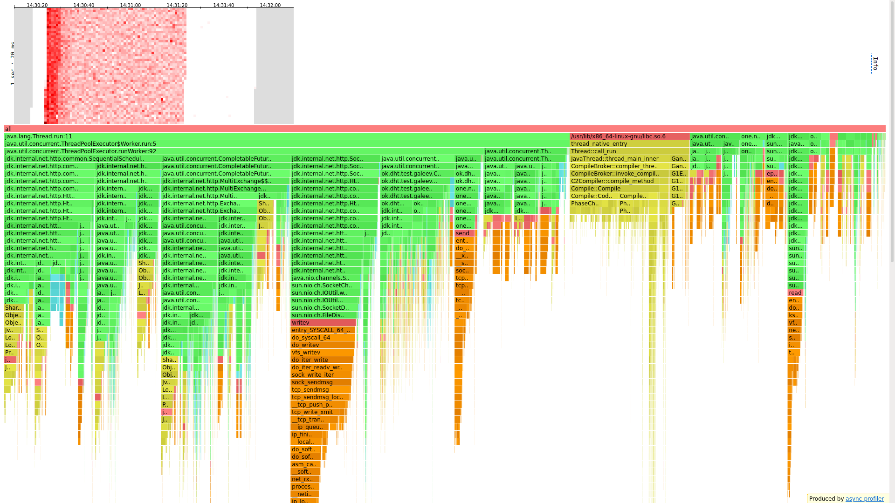
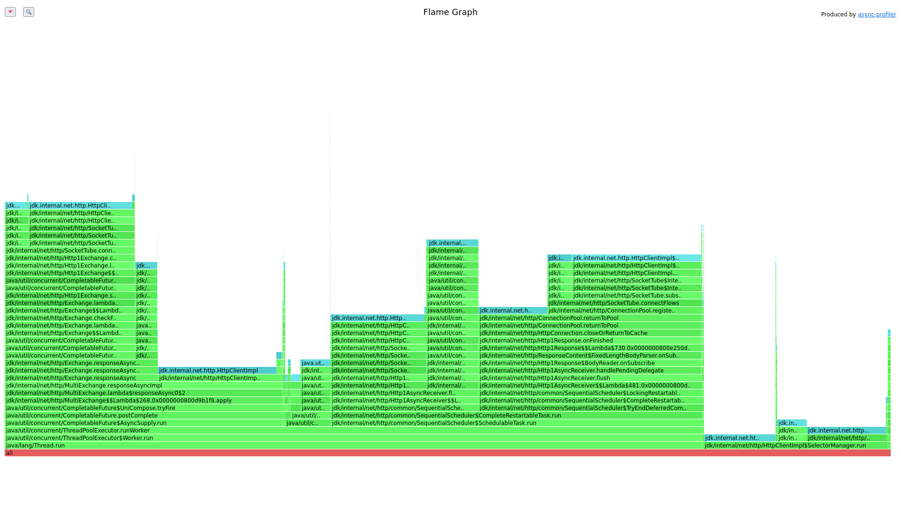
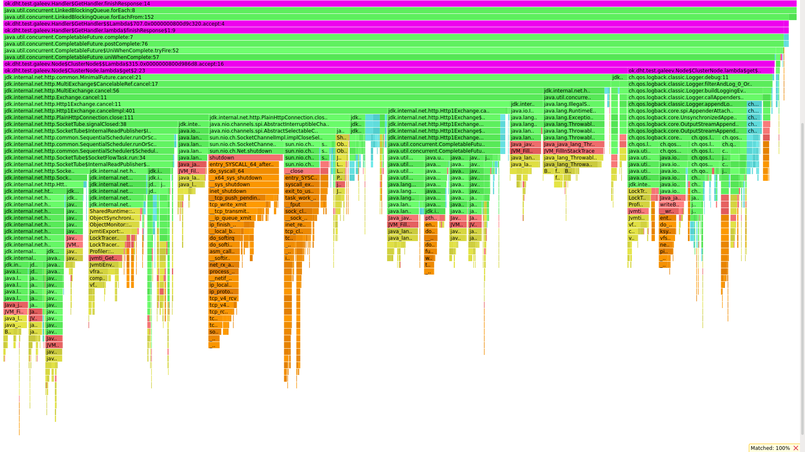
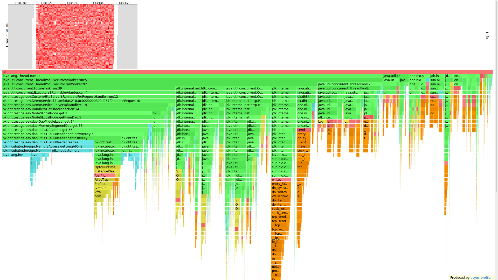
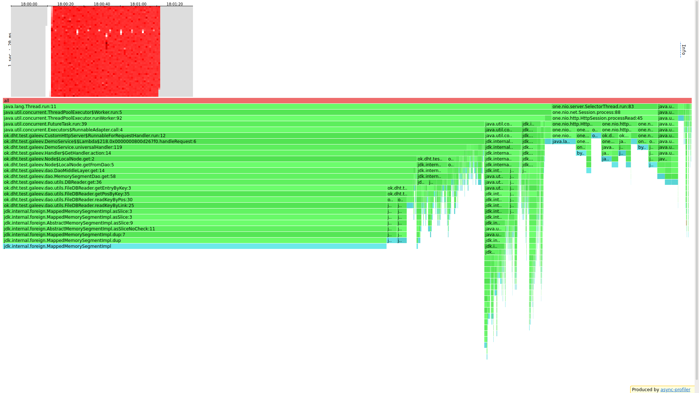
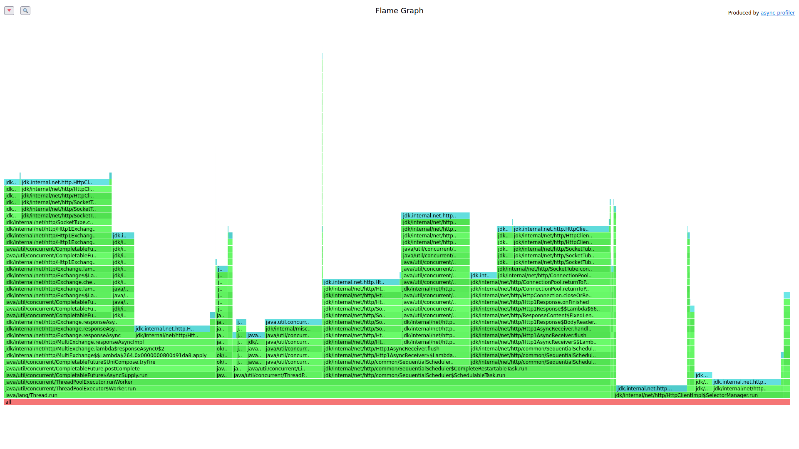
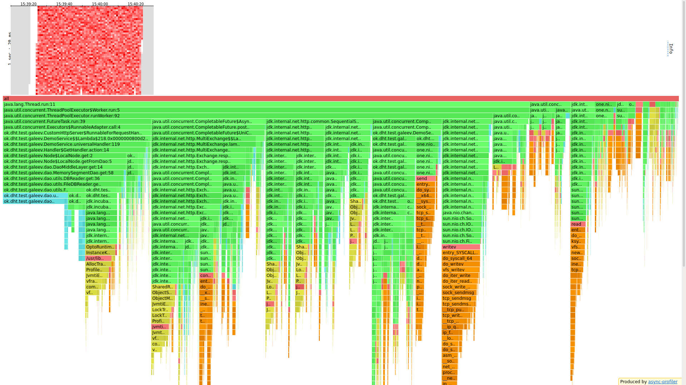
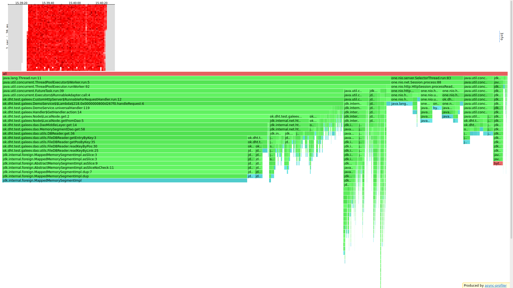
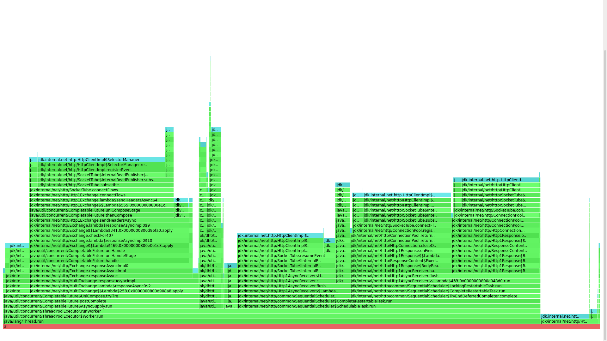

# Stage 5

## Предисловие
Сравнение с прошлым стейджом будет слегка не корректным, ведь (по большей части) я уже тогда сделал все асинхронно, за
исключением того, что в прошлой версии поток пула работников ожидал ack ответов от нод внутри кластера и отправлял
ответ, а теперь этот же поток просто создает запросы, а ответ отправляет поток, получивший ack ответ. 
\
Также была реализована отмена ненужных GET запросов. В логах видно отмены запросов, скрин будет ниже.

## PUT

### Сравнение с прошлым этапом
#### Put на 6000

<details>
<summary>Было</summary>
<pre>
└─$ wrk -t 1 -c 64 -d 60s -s /media/coradead/Windows1/Users/CORADEAD/IdeaProjects/2022-highload-dht/src/main/java/ok/dht/test/galeev/reports/scritps/put.lua -L http://localhost:19234 -R 6000

Running 1m test @ http://localhost:19234
1 threads and 64 connections
Thread calibration: mean lat.: 58.762ms, rate sampling interval: 581ms
Thread Stats   Avg      Stdev     Max   +/- Stdev
Latency     2.23ms    2.56ms  77.44ms   97.71%
Req/Sec     6.01k    26.18     6.13k    87.06%
Latency Distribution (HdrHistogram - Recorded Latency)
50.000%    1.86ms
75.000%    2.48ms
90.000%    3.46ms
99.000%    8.30ms
99.900%   39.36ms
99.990%   69.50ms
----------------------------------------------------------
359066 requests in 1.00m, 22.94MB read
Requests/sec:   5984.38
Transfer/sec:    391.56KB
</pre>
</details>

<details>
<summary>Стало</summary>
<pre>
└─$ wrk -t 1 -c 64 -d 60s -s /media/coradead/Windows1/Users/CORADEAD/IdeaProjects/2022-highload-dht/src/main/java/ok/dht/test/galeev/reports/scritps/put.lua -L http://localhost:19234 -R 6000

Running 1m test @ http://localhost:19234
1 threads and 64 connections
Thread calibration: mean lat.: 163.385ms, rate sampling interval: 1260ms
Thread Stats   Avg      Stdev     Max   +/- Stdev
Latency     2.08ms    2.04ms  45.50ms   96.02%
Req/Sec     6.00k     9.62     6.03k    92.31%
Latency Distribution (HdrHistogram - Recorded Latency)
50.000%    1.81ms
75.000%    2.26ms
90.000%    2.95ms
99.000%    7.29ms
99.900%   32.17ms
99.990%   39.36ms
99.999%   42.72ms
100.000%   45.53ms
----------------------------------------------------------
359055 requests in 1.00m, 22.94MB read
Requests/sec:   5984.32
Transfer/sec:    391.55KB
</pre>
</details>

Результат на лицо. Мы получили неплохое улучшение, особенно заметное на персентилях близких к ста, да и среднее время
уменьшилось тоже.

### Профайлер

```
└─$ wrk -t 1 -c 64 -d 60s -s /media/coradead/Windows1/Users/CORADEAD/IdeaProjects/2022-highload-dht/src/main/java/ok/dht/test/galeev/reports/scritps/put.lua -L http://localhost:19234 -R 6000

Running 1m test @ http://localhost:19234
  1 threads and 64 connections
  Thread calibration: mean lat.: 784.075ms, rate sampling interval: 2863ms
  Thread Stats   Avg      Stdev     Max   +/- Stdev
    Latency     2.70ms    4.01ms  94.78ms   97.21%
    Req/Sec     6.00k     2.33     6.00k    76.47%
  Latency Distribution (HdrHistogram - Recorded Latency)
 50.000%    2.02ms
 75.000%    2.53ms
 90.000%    3.89ms
 99.000%   21.12ms
 99.900%   59.07ms
 99.990%   81.79ms
 99.999%   92.42ms
100.000%   94.85ms
----------------------------------------------------------
  359065 requests in 1.00m, 22.94MB read
Requests/sec:   5984.45
Transfer/sec:    391.56KB
```

#### CPU

В первую очередь сразу видно, что RequestHandler уменьшился с 16,8 до 8,4, потому что теперь нет необходимости
дожидаться запросов + ответ отправляет другой поток (отправка занимает 2,9%). А так все осталось по-прежнему. 

#### Alloc

Здесь единственное изменение в том, что создание ответа теперь происходит в отдельном потоке

#### Lock

И здесь изменения минимальны.

### 20 минутный тест 

<details>
<summary>Put на 11к 20 минут</summary>
<pre>
└─$ wrk -t 1 -c 64 -d 20m -s /media/coradead/Windows1/Users/CORADEAD/IdeaProjects/2022-highload-dht/src/main/java/ok/dht/test/galeev/reports/scritps/put.lua -L http://localhost:19234 -R 11000

Running 20m test @ http://localhost:19234
1 threads and 64 connections
Thread calibration: mean lat.: 560.174ms, rate sampling interval: 2912ms
Thread Stats   Avg      Stdev     Max   +/- Stdev
Latency     2.88ms    7.24ms 370.43ms   96.94%
Req/Sec    11.00k    25.63    11.33k    94.12%
Latency Distribution (HdrHistogram - Recorded Latency)
50.000%    2.15ms
75.000%    2.58ms
90.000%    3.41ms
99.000%   15.38ms
99.900%   57.98ms
99.990%  314.62ms
99.999%  337.92ms
100.000%  370.69ms
----------------------------------------------------------
13198244 requests in 20.00m, 843.32MB read
Requests/sec:  10998.53
Transfer/sec:    719.63KB
</pre>
</details>

---
## GET

### Сравнение с прошлым этапом
#### Get на 6000

<details>
<summary>Было</summary>
<pre>
└─$ wrk -t 1 -c 64 -d 60s -s /media/coradead/Windows1/Users/CORADEAD/IdeaProjects/2022-highload-dht/src/main/java/ok/dht/test/galeev/reports/scritps/get.lua -L http://localhost:19234 -R 15000

Running 1m test @ http://localhost:19234
1 threads and 64 connections
Thread calibration: mean lat.: 3.104ms, rate sampling interval: 10ms
Thread Stats   Avg      Stdev     Max   +/- Stdev
Latency     3.51ms    1.83ms  46.78ms   89.32%
Req/Sec    15.82k     2.33k   31.00k    74.78%
Latency Distribution (HdrHistogram - Recorded Latency)
50.000%    2.69ms
75.000%    3.43ms
90.000%    4.45ms
99.000%   10.47ms
99.900%   43.09ms
99.990%   53.98ms
99.999%   71.44ms
100.000%   96.81ms
----------------------------------------------------------
884912 requests in 1.00m, 58.97MB read
Requests/sec:  14747.32
Transfer/sec:      0.98MB
</pre>
</details>

<details>
<summary>Стало (без отмены запросов)</summary>
<pre>
└─$ wrk -t 1 -c 64 -d 60s -s /media/coradead/Windows1/Users/CORADEAD/IdeaProjects/2022-highload-dht/src/main/java/ok/dht/test/galeev/reports/scritps/get.lua -L http://localhost:19234 -R 15000

Running 1m test @ http://localhost:19234
1 threads and 64 connections
Thread calibration: mean lat.: 3.119ms, rate sampling interval: 10ms
Thread Stats   Avg      Stdev     Max   +/- Stdev
Latency     3.02ms    1.73ms  52.86ms   88.10%
Req/Sec    15.81k     2.07k   31.78k    73.10%
Latency Distribution (HdrHistogram - Recorded Latency)
50.000%    2.73ms
75.000%    3.57ms
90.000%    4.57ms
99.000%    7.47ms
99.900%   27.18ms
99.990%   36.58ms
99.999%   47.62ms
100.000%   52.90ms
----------------------------------------------------------
884966 requests in 1.00m, 58.97MB read
Requests/sec:  14749.44
Transfer/sec:      0.98MB
</pre>
</details>

В целом разница есть, но не сказать, что она большая. Отмена запросов должна улучшить ситуацию разгрузкой сети.
Попробуем.

<details>
<summary>Стало (с отменой запросов)</summary>
<pre>
└─$ wrk -t 1 -c 64 -d 60s -s /media/coradead/Windows1/Users/CORADEAD/IdeaProjects/2022-highload-dht/src/main/java/ok/dht/test/galeev/reports/scritps/get.lua -L http://localhost:19234 -R 15000

Running 1m test @ http://localhost:19234
1 threads and 64 connections
Thread calibration: mean lat.: 1512.215ms, rate sampling interval: 5349ms
Thread Stats   Avg      Stdev     Max   +/- Stdev
Latency    10.69s     4.46s   19.09s    57.60%
Req/Sec    10.31k   138.15    10.46k    77.78%
Latency Distribution (HdrHistogram - Recorded Latency)
50.000%   10.60s
75.000%   14.63s
90.000%   16.89s
99.000%   18.48s
99.900%   18.79s
99.990%   18.96s
99.999%   19.09s
100.000%   19.10s
----------------------------------------------------------
603534 requests in 1.00m, 40.18MB read
Requests/sec:  10059.00
Transfer/sec:    685.82KB
</pre>
</details>

О, ужас. Что мы видим? Запросы стали ужасно долгими. Почему? Давайте посмотри на профайлер:

Теперь 5% общего времени занимает отмена запросов.


### Профайлер

#### Без отмены запросов

#### CPU


Раньше RequestHandler занимал 36.29% всего времени, теперь же он занимает 35.3%, но при этом 
поиск по локальной базе занимает 30%, тогда как раньше 20%. Раньше 3.5% занимало ожидание 
пока придет ack ответов и еще 6 - отправка ответов, теперь же это делается в отдельном пуле потоков.

#### Alloc


Здесь ситуация подобна put. Ведь логика изменилась для всех типов запросов.

#### Lock


Здесь ситуация подобна put. Ведь логика изменилась для всех типов запросов.

---

#### С отменой запросов

#### CPU


#### Alloc


#### Lock


Судя по всему операция отмены очень тяжелая, а мы ее выполняем в потоке нод, делающих запросы (всего 8 потоков).
Скорее всего все 8 потоков быстро забиваются, для проверки увеличим число потоков до 32 и посмотрим:
<details>
<summary>Увеличение количество прокси потоков</summary>
<pre>
└─$ wrk -t 1 -c 64 -d 60s -s /media/coradead/Windows1/Users/CORADEAD/IdeaProjects/2022-highload-dht/src/main/java/ok/dht/test/galeev/reports/scritps/get.lua -L http://localhost:19234 -R 15000

Running 1m test @ http://localhost:19234
1 threads and 64 connections
Thread calibration: mean lat.: 2064.351ms, rate sampling interval: 4919ms
Thread Stats   Avg      Stdev     Max   +/- Stdev
Latency    77.10ms  277.41ms   1.88s    92.85%
Req/Sec    15.50k     1.51k   20.02k    90.00%
Latency Distribution (HdrHistogram - Recorded Latency)
50.000%    2.32ms
75.000%    2.96ms
90.000%    5.14ms
99.000%    1.47s
99.900%    1.71s
99.990%    1.82s
99.999%    1.87s
100.000%    1.88s
----------------------------------------------------------
897613 requests in 1.00m, 59.82MB read
Requests/sec:  14960.31
Transfer/sec:      1.00MB
</pre>
</details>
А это и в правду помогло, а значит моя теория была верна. Но несмотря на то, что результат улучшился, функцию отмены
стоит оставить выключенной, так как отмена по итогу выходит дороже чем просто дождаться ответа.
