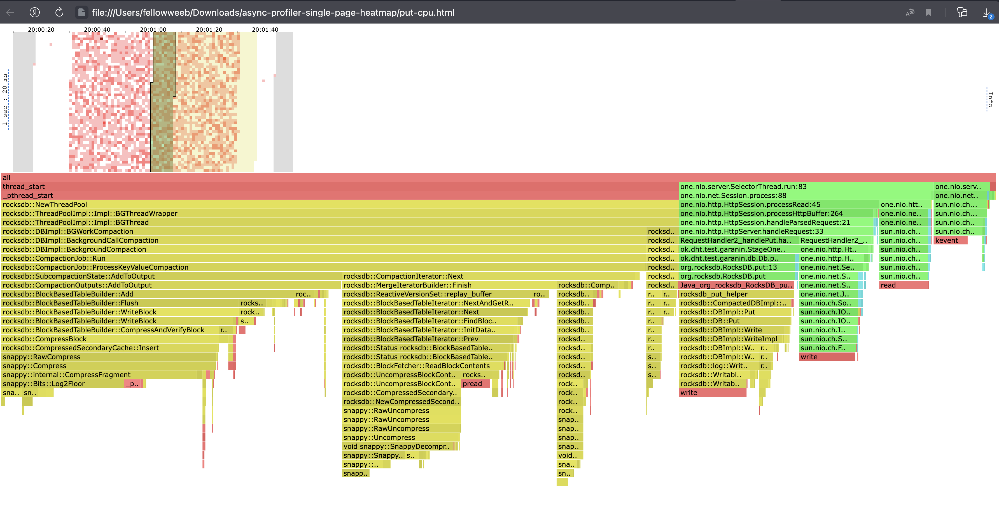

# Stage 1 Report

База перед тестированием была заполнена на 100_000_000 ключей на общий размер 1,83 GB.

## PUT
Wrk2 put запросы скриптом c рандомными ключами: 
```
❯ wrk2 -c 1 -t 1 -d 60 -R 10000 -s put.lua "http://localhost:19234"
Running 1m test @ http://localhost:19234
  1 threads and 1 connections
  Thread calibration: mean lat.: 0.817ms, rate sampling interval: 10ms
  Thread Stats   Avg      Stdev     Max   +/- Stdev
    Latency   679.89us  820.95us  26.34ms   99.79%
    Req/Sec    10.56k   803.29    17.78k    68.55%
  599984 requests in 1.00m, 38.34MB read
Requests/sec:   9999.77
Transfer/sec:    654.28KB

❯ wrk2 -c 1 -t 1 -d 60 -R 20000 -s put.lua "http://localhost:19234"
Running 1m test @ http://localhost:19234
  1 threads and 1 connections
  Thread calibration: mean lat.: 549.009ms, rate sampling interval: 1876ms
  Thread Stats   Avg      Stdev     Max   +/- Stdev
    Latency     3.53s     1.47s    6.09s    57.81%
    Req/Sec    18.00k   342.30    18.59k    69.23%
  1078152 requests in 1.00m, 68.89MB read
Requests/sec:  17969.24
Transfer/sec:      1.15MB

❯ wrk2 -c 1 -t 1 -d 60 -R 15000 -s put.lua "http://localhost:19234"
Running 1m test @ http://localhost:19234
  1 threads and 1 connections
  Thread calibration: mean lat.: 0.736ms, rate sampling interval: 10ms
  Thread Stats   Avg      Stdev     Max   +/- Stdev
    Latency     1.48ms    4.95ms  61.12ms   96.63%
    Req/Sec    15.83k     1.42k   21.11k    65.73%
  899990 requests in 1.00m, 57.51MB read
Requests/sec:  14999.88
Transfer/sec:      0.96MB

```
Как можно заметить при 10000 сервер спокойно справляется, 
при 20000 захлёбывается на 1000+ запросов, 
а вот 15000 похоже на около максимальную нагрузку при стабильных ответах

Далее профилируем с запросами от wrk2 длительностью 60 сек и 15k rate

### Профилирование CPU:



Сначала о выделенной на хитмапе красным области, это произошла компактизация занявшая 64% cpu.
Если верить документации rocksdb при заполнении базы на 2 гб таблицы должны быть разбиты на 2 уровня (300mb, 3gb).
Компактизация происходить асинхронно и серверу удаётся отвечать на запросы


Теперь когда сервер не занят компактизацией, 42% на put в базу и 15% на write response и 16% на read из сокета.
Вероятно это чтения и запись можно было бы уменьшить если использовать более эффективный протокол вместо http.
Так же можно заметить что сама база занимаешь лишь 42% cpu то есть меньше чем сетевая часть.

### Профилирование alloc:


Тк RocksDB написана на c++, async-profiler не профилирует память базы и на графике
можно увидеть только аллокации серверной части

## Get

Wrk2 put запросы скриптом c рандомными ключами:

```
❯ wrk2 -c 1 -t 1 -d 60 -R 10000 -s get.lua "http://localhost:19234"
Running 1m test @ http://localhost:19234
  1 threads and 1 connections
  Thread calibration: mean lat.: 1.169ms, rate sampling interval: 10ms
  Thread Stats   Avg      Stdev     Max   +/- Stdev
    Latency   657.03us  337.49us   2.36ms   58.75%
    Req/Sec    10.56k   700.30    13.11k    68.83%
  599993 requests in 1.00m, 43.44MB read
Requests/sec:   9999.75
Transfer/sec:    741.28KB

❯ wrk2 -c 1 -t 1 -d 60 -R 20000 -s get.lua "http://localhost:19234"
Running 1m test @ http://localhost:19234
  1 threads and 1 connections
  Thread calibration: mean lat.: 753.390ms, rate sampling interval: 2666ms
  Thread Stats   Avg      Stdev     Max   +/- Stdev
    Latency     4.72s     2.14s   13.30s    70.32%
    Req/Sec    15.71k     3.73k   17.34k    88.89%
  934042 requests in 1.00m, 69.75MB read
Requests/sec:  15567.38
Transfer/sec:      1.16MB

❯ wrk2 -c 1 -t 1 -d 60 -R 15000 -s get.lua "http://localhost:19234"
Running 1m test @ http://localhost:19234
  1 threads and 1 connections
  Thread calibration: mean lat.: 1.897ms, rate sampling interval: 10ms
  Thread Stats   Avg      Stdev     Max   +/- Stdev
    Latency     6.44ms   37.95ms 434.69ms   97.38%
    Req/Sec    15.69k     1.24k   19.67k    83.58%
  893471 requests in 1.00m, 64.68MB read
Requests/sec:  14891.21
Transfer/sec:      1.08MB
```

Ситуация похожа на put, но можно заметить что put на 20000 справился с 18к запросов,
а get на 20к лишь с 15.5к запросов
Неплохая демонстрация оптимизированности LSM и RocksDB на запись > чтение

### Профилирование CPU:


Так же как и в put, Db.get занимает 40% cpu, то есть меньше чем сетевая часть.
Мысли о серверной части такие же.
Компактизации которую видели во время put, только на get запросы быть не может,
она запускается когда in-memory табличка достигает нужного размера

### Профилирование alloc:


Такая же, как и в put ситуация