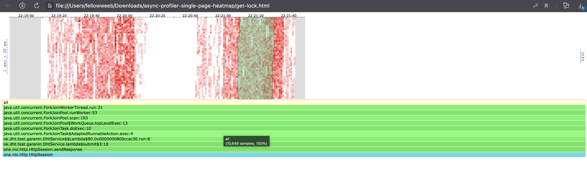

# Stage 2

## OLD

Для начала было проведено тестирование старой версии сервера с блокированием селекторов в момент похода в базу
Рпс сильно подрос тк он идёт не через один, а 64 соединения
Была подобрана такая нагрузка чтобы сервер довольно бодро отвечал на p90, и на p99-p9999 уже были задержки

```
❯ wrk2 -c 64 -t 6 -d 60 -R 62500 -s get.lua -L "http://localhost:19234"
Running 1m test @ http://localhost:19234
  6 threads and 64 connections
  Thread calibration: mean lat.: 1.279ms, rate sampling interval: 10ms
  Thread calibration: mean lat.: 1.278ms, rate sampling interval: 10ms
  Thread calibration: mean lat.: 1.281ms, rate sampling interval: 10ms
  Thread calibration: mean lat.: 1.280ms, rate sampling interval: 10ms
  Thread calibration: mean lat.: 1.289ms, rate sampling interval: 10ms
  Thread calibration: mean lat.: 1.287ms, rate sampling interval: 10ms
  Thread Stats   Avg      Stdev     Max   +/- Stdev
    Latency     1.32ms  676.09us  16.98ms   77.45%
    Req/Sec    10.99k   821.18    14.44k    70.05%
  Latency Distribution (HdrHistogram - Recorded Latency)
 50.000%    1.25ms
 75.000%    1.67ms
 90.000%    2.07ms
 99.000%    2.79ms
 99.900%    9.14ms
 99.990%   14.31ms
 99.999%   16.06ms
100.000%   16.99ms

----------------------------------------------------------
  3738111 requests in 1.00m, 270.61MB read
Requests/sec:  62302.95
Transfer/sec:      4.51MB
```


```
❯ wrk2 -c 64 -t 6 -d 60 -R 55000 -s put.lua -L "http://localhost:19234"
Running 1m test @ http://localhost:19234
  6 threads and 64 connections
  Thread calibration: mean lat.: 1.304ms, rate sampling interval: 10ms
  Thread calibration: mean lat.: 1.316ms, rate sampling interval: 10ms
  Thread calibration: mean lat.: 1.316ms, rate sampling interval: 10ms
  Thread calibration: mean lat.: 1.326ms, rate sampling interval: 10ms
  Thread calibration: mean lat.: 1.319ms, rate sampling interval: 10ms
  Thread calibration: mean lat.: 1.320ms, rate sampling interval: 10ms
  Thread Stats   Avg      Stdev     Max   +/- Stdev
    Latency     2.13ms    5.71ms  68.61ms   97.39%
    Req/Sec     9.67k     1.02k   14.22k    82.70%
  Latency Distribution (HdrHistogram - Recorded Latency)
 50.000%    1.28ms
 75.000%    1.75ms
 90.000%    2.24ms
 99.000%   36.51ms
 99.900%   62.49ms
 99.990%   66.30ms
 99.999%   68.10ms
100.000%   68.67ms

----------------------------------------------------------
  3298694 requests in 1.00m, 210.77MB read
Requests/sec:  54979.24
Transfer/sec:      3.51MB
```

## NEW

Работа с походом в базу была перенесена на ExecutorService и selector'ы были разблокированы
На get заметный выигрыш, на put небольшой, но всё же выигрыш

```
❯ wrk2 -c 64 -t 6 -d 60 -R 62500 -s get.lua -L "http://localhost:19234"
Running 1m test @ http://localhost:19234
  6 threads and 64 connections
  Thread calibration: mean lat.: 1.460ms, rate sampling interval: 10ms
  Thread calibration: mean lat.: 1.459ms, rate sampling interval: 10ms
  Thread calibration: mean lat.: 1.430ms, rate sampling interval: 10ms
  Thread calibration: mean lat.: 1.420ms, rate sampling interval: 10ms
  Thread calibration: mean lat.: 1.431ms, rate sampling interval: 10ms
  Thread calibration: mean lat.: 1.454ms, rate sampling interval: 10ms
  Thread Stats   Avg      Stdev     Max   +/- Stdev
    Latency     1.35ms  559.54us  19.25ms   66.76%
    Req/Sec    10.98k   818.15    14.22k    70.42%
  Latency Distribution (HdrHistogram - Recorded Latency)
 50.000%    1.29ms
 75.000%    1.73ms
 90.000%    2.12ms
 99.000%    2.76ms
 99.900%    3.24ms
 99.990%    4.17ms
 99.999%    7.27ms
100.000%   19.26ms

----------------------------------------------------------
  3748492 requests in 1.00m, 271.36MB read
Requests/sec:  62475.88
Transfer/sec:      4.52MB
```

```
❯ wrk2 -c 64 -t 6 -d 60 -R 55000 -s put.lua -L "http://localhost:19234"
Running 1m test @ http://localhost:19234
  6 threads and 64 connections
  Thread calibration: mean lat.: 1.984ms, rate sampling interval: 10ms
  Thread calibration: mean lat.: 1.960ms, rate sampling interval: 10ms
  Thread calibration: mean lat.: 2.010ms, rate sampling interval: 10ms
  Thread calibration: mean lat.: 1.960ms, rate sampling interval: 10ms
  Thread calibration: mean lat.: 1.972ms, rate sampling interval: 10ms
  Thread calibration: mean lat.: 1.953ms, rate sampling interval: 10ms
  Thread Stats   Avg      Stdev     Max   +/- Stdev
    Latency     2.31ms    5.53ms  65.59ms   96.94%
    Req/Sec     9.67k     1.04k   14.00k    81.74%
  Latency Distribution (HdrHistogram - Recorded Latency)
 50.000%    1.43ms
 75.000%    1.92ms
 90.000%    2.45ms
 99.000%   28.90ms
 99.900%   58.29ms
 99.990%   61.29ms
 99.999%   65.08ms
100.000%   65.65ms

----------------------------------------------------------
  3298655 requests in 1.00m, 210.77MB read
Requests/sec:  54978.45
Transfer/sec:      3.51MB
```

Был выбран ForkJoinPool, тк он использует work stealing стратегию шедулинга,
что позволяет уменьшить кол-во блокировок на очередь задач и увеличить время работы потока


Как можно увидеть на профилировании локов у новой версии отсутствуют блокировки изза lock-free очередей под капотом ForkJoinPool'а

