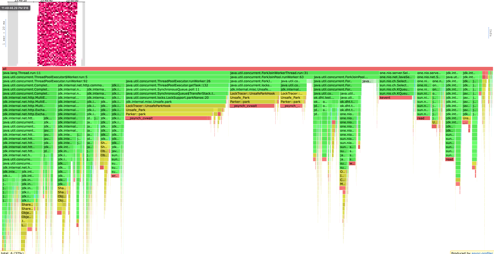
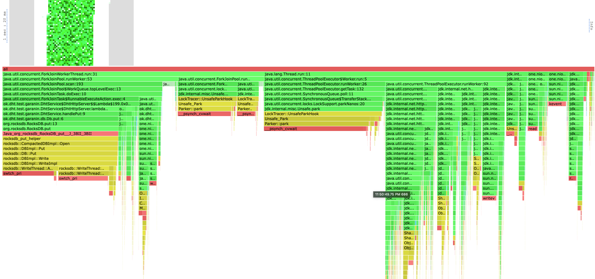
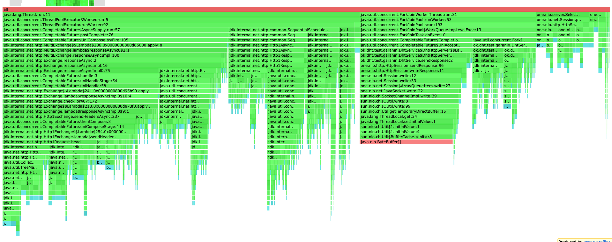
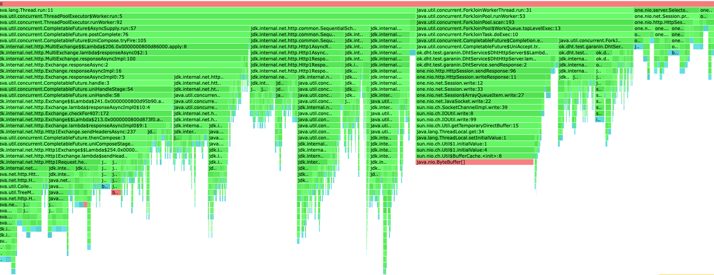
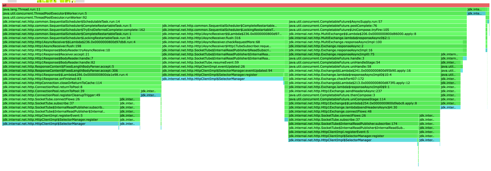
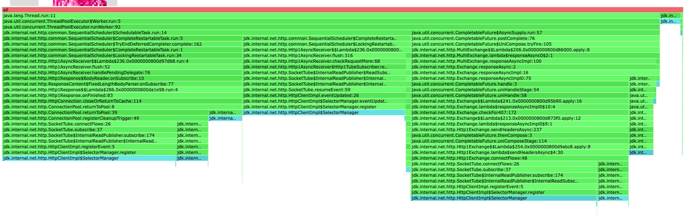

# Stage 3

3 шарда кластера, в каждом по ~15 млн ключей размером около 1гб, равномерно на уровне погрешности компактизации


## GET
Выбрал нагрузку
```
❯ wrk2 -c 64 -t 6 -d 10 -R 20000 -s get.lua -L "http://localhost:5001"
Running 10s test @ http://localhost:5001
  6 threads and 64 connections
  Thread Stats   Avg      Stdev     Max   +/- Stdev
    Latency     1.71ms    1.72ms  31.42ms   92.67%
    Req/Sec        nan       nan   0.00      0.00%
  Latency Distribution (HdrHistogram - Recorded Latency)
 50.000%    1.34ms
 75.000%    1.93ms
 90.000%    2.87ms
 99.000%    9.11ms
 99.900%   19.89ms
 99.990%   27.65ms
 99.999%   29.77ms
100.000%   31.44ms

----------------------------------------------------------
  199535 requests in 10.00s, 99.30MB read
Requests/sec:  19953.86
Transfer/sec:      9.93MB
```

## PUT
Выбрал нагрузку
```
❯ wrk2 -c 64 -t 6 -d 10 -R 17000 -s put.lua -L "http://localhost:5001"
Running 10s test @ http://localhost:5001
  6 threads and 64 connections
  Thread Stats   Avg      Stdev     Max   +/- Stdev
    Latency     1.86ms    3.38ms  61.41ms   97.80%
    Req/Sec        nan       nan   0.00      0.00%
  Latency Distribution (HdrHistogram - Recorded Latency)
 50.000%    1.36ms
 75.000%    1.90ms
 90.000%    2.57ms
 99.000%   21.12ms
 99.900%   41.89ms
 99.990%   49.31ms
 99.999%   58.40ms
100.000%   61.44ms

----------------------------------------------------------
  169613 requests in 10.00s, 10.84MB read
Requests/sec:  16961.74
Transfer/sec:      1.08MB
```

## PROFILING
### GET CPU


ThreadPoolExecutor занимает 46% cpu работая с HttpClient, внутри асинхронная работа с Future.
Тут стоит посильнее раскурить HttpClient, поиграться с его конфигами и пулом в future. Может быть даже заменить его на что-то попроще.

При работе с ключами принадлежащим ноде: 1.5% на запись ответа, 0.71% на сам поход в rocksdb

0.78% выполняется вычисление хеша и урла куда надо сходить, за счёт подсчёта криптографии системным вызовом

Так же сразу заметно куча аллокаций при создании URI для HttpClient(

Размышления о one nio как в предыдущих отчётах


### PUT CPU


Ситуация похожа на get, с той разницей, что на запись в базу теперь тратиться 20%.


### GET ALLOC


58% аллокаций принадлежат HttpClient'у, он аллоцирует очень много (например стримы под капотом)
Остальная значительная часть 18% это direct buffer сетевой карты

### PUT ALLOC


Идентично get'у

### GET LOCK


Все локи забиты selector'ами HttpClient'а

### PUT LOCK


Идентично get'у

## Итог

Хочется использовать более лёгкий http client, ну или победить его конфигурацией если это возможно, 
хотя кажется это не возможным тк он всегда под копотом использует тяжёлые абстракции.

Так же хочется снова отметить хороший выбор для хеш функции криптографии тк они считаются системой на железе. 
