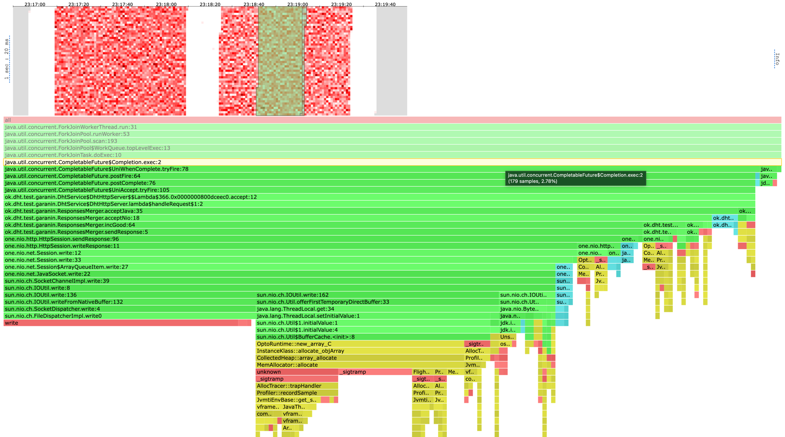
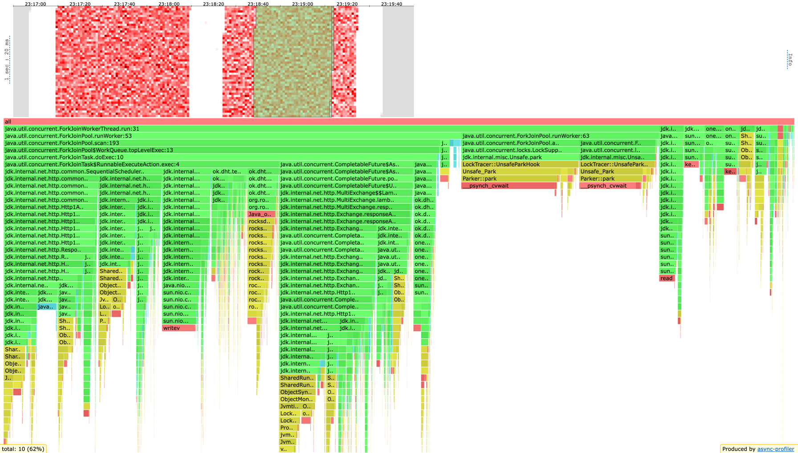
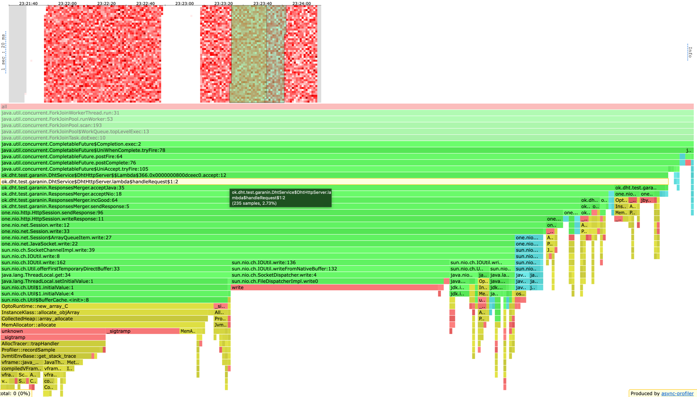
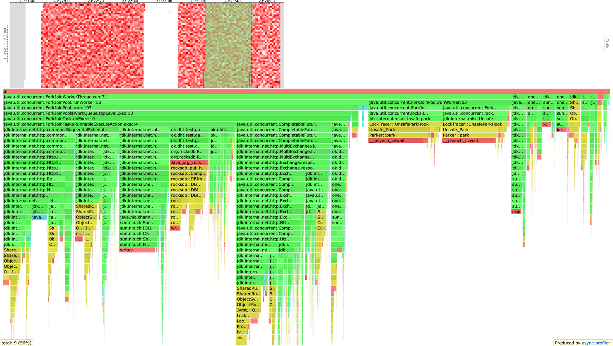
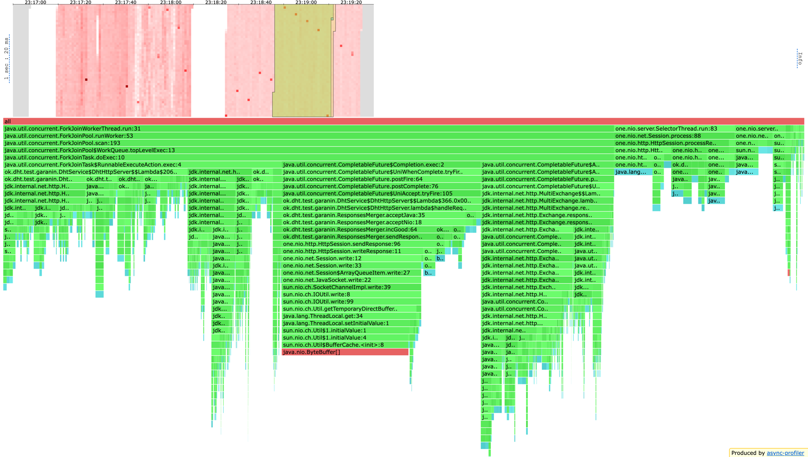
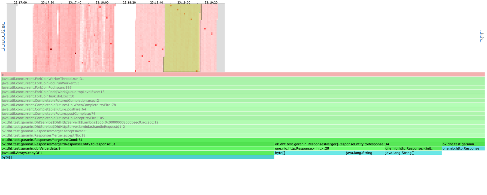
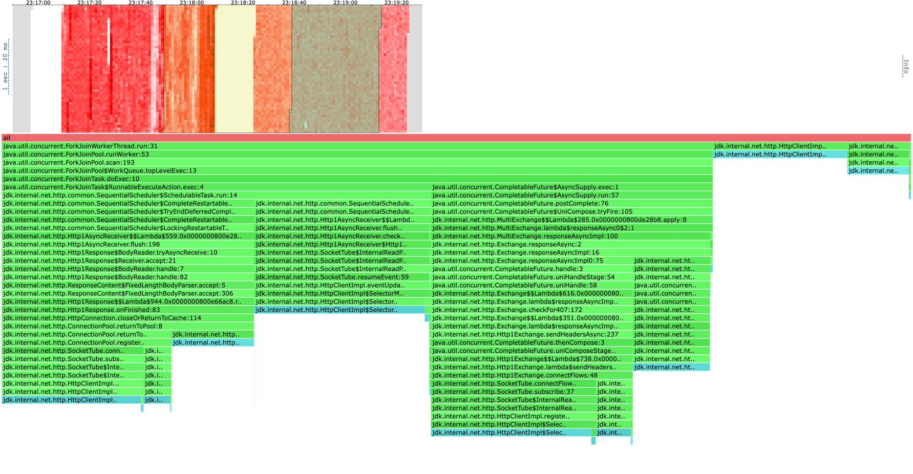

# Stage 5
Тестирование проводил c конфигурацией 3 ноды и запросы 2 из 3

База была заполнена на 30_000_000 ключей с репликацией 2 из 3

## WRK
На 6000 рпс сервер захлёбывался в секунды, так что тестировал на 5000

### GET
```
❯ wrk2 -c 64 -t 6 -d 60 -R 5000 -s get.lua -L "http://localhost:5001"
Running 1m test @ http://localhost:5001
  6 threads and 64 connections
  Thread calibration: mean lat.: 2.250ms, rate sampling interval: 10ms
  Thread calibration: mean lat.: 2.139ms, rate sampling interval: 10ms
  Thread calibration: mean lat.: 2.122ms, rate sampling interval: 10ms
  Thread calibration: mean lat.: 2.215ms, rate sampling interval: 10ms
  Thread calibration: mean lat.: 2.198ms, rate sampling interval: 10ms
  Thread calibration: mean lat.: 2.114ms, rate sampling interval: 10ms
  Thread Stats   Avg      Stdev     Max   +/- Stdev
    Latency     1.60ms    1.04ms  33.54ms   91.39%
    Req/Sec     0.88k    98.98     1.78k    66.33%
  Latency Distribution (HdrHistogram - Recorded Latency)
 50.000%    1.47ms
 75.000%    1.91ms
 90.000%    2.38ms
 99.000%    4.30ms
 99.900%   16.59ms
 99.990%   24.62ms
 99.999%   30.88ms
100.000%   33.57ms

----------------------------------------------------------
  299909 requests in 1.00m, 56.76MB read
Requests/sec:   4998.48
Transfer/sec:      0.95MB

```
### PUT

```
❯ wrk2 -c 64 -t 6 -d 60 -R 5000 -s put.lua -L "http://localhost:5001"
Running 1m test @ http://localhost:5001
  6 threads and 64 connections
  Thread calibration: mean lat.: 2.145ms, rate sampling interval: 10ms
  Thread calibration: mean lat.: 2.183ms, rate sampling interval: 10ms
  Thread calibration: mean lat.: 2.157ms, rate sampling interval: 10ms
  Thread calibration: mean lat.: 2.149ms, rate sampling interval: 10ms
  Thread calibration: mean lat.: 2.210ms, rate sampling interval: 10ms
  Thread calibration: mean lat.: 2.125ms, rate sampling interval: 10ms
  Thread Stats   Avg      Stdev     Max   +/- Stdev
    Latency     6.12ms   31.93ms 357.12ms   97.70%
    Req/Sec     0.88k   123.82     1.89k    89.45%
  Latency Distribution (HdrHistogram - Recorded Latency)
 50.000%    1.54ms
 75.000%    2.00ms
 90.000%    2.48ms
 99.000%  214.53ms
 99.900%  331.26ms
 99.990%  348.93ms
 99.999%  354.82ms
100.000%  357.38ms

----------------------------------------------------------
  299909 requests in 1.00m, 19.16MB read
Requests/sec:   4998.50
Transfer/sec:    327.05KB

```

## PROFILING

### GET CPU

Как можем видеть на скрине код обработки ответов от реплик занимает лишь 3% процента,

остальное (без скрина): handleRequest в сервере занимает лишь 0.5%, а в executor'е 5%

а поход в базу 3.5%


Всё остальное время сервер занять асинхронной обработкой соединений, сессий и ивентов фьюч


### PUT CPU

Как можем видеть на скрине код обработки ответов от реплик занимает лишь 2.7% процента,

остальное (без скрина): handleRequest в селекторе занимает лишь 1%, а в executor'е 4.7%

а поход в базу 6.3%



Всё остальное время сервер занять асинхронной обработкой соединений, сессий и ивентов фьюч


### GET ALLOC

В целом все аллокации заняты кодом асинхронной обработкой соединений, сессий и ивентов фьюч


Интерес привлекает вот это место, тут codeclimat заставил копировать byte[], хотя можно было бы этого не делать


### PUT ALLOC

Всё так же как в get

### GET LOCK



Все локи это SelectorManager и ConnectionPool

### PUT LOCK

Всё так же как в get


## Выводы

Наш код в среднем занимает 12% всё остальное, это HttpClient и one.nio, заниматься оптимизациями наших пары процентов
я особого смысла не вижу

