# Report

Скрипт Lua для put запросов:
```lua
raw_path = "/v0/entity?id="
count = -1
request = function()
    count = count + 1
    path = raw_path .. count
    return wrk.format("PUT", path, {"Content-Type: text/plain"}, string.rep("highload is a best subject!", 322))
end
```

Скрипт Lua для get запросов:
```lua
raw_path = "/v0/entity?id="
count = 0
request = function()
    path = raw_path .. count
    count = count + 1
    return wrk.format("GET", path)
end
```

Скрипт для запуска профайлинга и wrk2:
```shell
#!/bin/bash
#paths to scripts
lua_put_path="put.lua"
lua_get_path="get.lua"
path_to_async_profiler="/Users/michael/Desktop/async-profiler/async-profiler"

#server configuration
server_host="localhost"
server_port=25565
server_name="Server"

#wrk2 configuration
wrk2_duration=60
wrk2_threads=1
wrk2_connections=1

function wrk2_start() {
  local rate=$1
  local type=$2
  local type_request=$3
  local file_name="wrk2_${type_request}_rate_${rate}.txt"
  local file_path="$PWD/$file_name"
  wrk2 -d $wrk2_duration -t $wrk2_threads -c $wrk2_connections -R "$rate" -s "$type" -L "http://${server_host}:${server_port}" > "$file_path"
}

function async_profiler_start() {
  local file_name=$1
  local file_path="$PWD/$file_name"
  local path=$PWD
  cd $path_to_async_profiler || exit
  source "./profiler.sh" -e cpu,alloc --alloc 512 -f "$file_path" start Server
  echo "async-profiler started"
  cd "$path" || exit
}

function async_profiler_stop() {
  local file_name=$1
  local file_path="$PWD/$file_name"
  local path=$PWD
  cd $path_to_async_profiler || exit
  source "./profiler.sh" -f "$file_path" stop "$server_name"
  echo "async-profiler stopped"
  cd "$path" || exit
}

echo "      ___                       ___           ___                  "
echo "     /  /\          ___        /  /\         /  /\          ___    "
echo "    /  /:/_        /  /\      /  /::\       /  /::\        /  /\   "
echo "   /  /:/ /\      /  /:/     /  /:/\:\     /  /:/\:\      /  /:/   "
echo "  /  /:/ /::\    /  /:/     /  /:/~/::\   /  /:/~/:/     /  /:/    "
echo " /__/:/ /:/\:\  /  /::\    /__/:/ /:/\:\ /__/:/ /:/___  /  /::\    "
echo " \  \:\/:/~/:/ /__/:/\:\   \  \:\/:/__\/ \  \:\/:::::/ /__/:/\:\   "
echo "  \  \::/ /:/  \__\/  \:\   \  \::/       \  \::/~~~~  \__\/  \:\  "
echo "   \__\/ /:/        \  \:\   \  \:\        \  \:\           \  \:\ "
echo "     /__/:/          \__\/    \  \:\        \  \:\           \__\/ "
echo "     \__\/                     \__\/         \__\/                 "
echo "                                                                   "

rates=(1000 3000 5000 8000 12000 15000 20000)

for rate in "${rates[@]}"; do
  type_request="put"
  file_name="async-profiler_${type_request}_rate_${rate}.jfr"
  async_profiler_start "$file_name"
  wrk2_start "$rate" $lua_put_path $type_request
  async_profiler_stop "$file_name"
done

for rate in "${rates[@]}"; do
  type_request="get"
  file_name="async-profiler_${type_request}_rate_${rate}.jfr"
  async_profiler_start "$file_name"
  wrk2_start "$rate" $lua_get_path $type_request
  async_profiler_stop "$file_name"
done
```

Скрипт для конвертации jfr в HTML:
```shell
#!/bin/bash
path_to_async_profiler="/Users/michael/Desktop/async-profiler/async-profiler"

function run_jfr2flame_alloc() {
  local src_name=$1
  local dst_name=$2
  local src_path="$PWD/$src_name"
  local dst_path="$PWD/$dst_name"
  local path=$PWD
  cd $path_to_async_profiler || exit
  java -cp "$path_to_async_profiler/build/converter.jar" jfr2heat --alloc "$src_path" "$dst_path"
  cd "$path" || exit
}

function run_jfr2flame_cpu() {
  local src_name=$1
  local dst_name=$2
  local src_path="$PWD/$src_name"
  local dst_path="$PWD/$dst_name"
  local path=$PWD
  cd $path_to_async_profiler || exit
  java -cp "$path_to_async_profiler/build/converter.jar" jfr2heat "$src_path" "$dst_path"
  cd "$path" || exit
}

rates=(1000 3000 5000 8000 12000 15000 20000)

for rate in "${rates[@]}"; do
  type_request="put"
  file_name="async-profiler_${type_request}_rate_${rate}.jfr"
  run_jfr2flame_alloc "$file_name" "async-profiler_${type_request}_alloc_rate_${rate}.html"
  run_jfr2flame_cpu "$file_name" "async-profiler_${type_request}_cpu_rate_${rate}.html"
done

for rate in "${rates[@]}"; do
  type_request="get"
  file_name="async-profiler_${type_request}_rate_${rate}.jfr"
  run_jfr2flame_alloc "$file_name" "async-profiler_${type_request}_alloc_rate_${rate}.html"
  run_jfr2flame_cpu "$file_name" "async-profiler_${type_request}_cpu_rate_${rate}.html"
done
```

Перед профилированием заполнил хранилище 6GB данных.
Все результаты работы wrk лежат в файлах с расширением txt и имеют префикс "wrk2".
* Имя файла := "wrk2\_\<Запрос\>\_rate\_\<Number\>"
* Запрос    := put | get
* Number    := number

Все результаты работы профайлера лежат в файлах с расширением html и имеют префикс "async-profiler".
* Имя файла := "async-profiler\_\<Запрос\>\_rate\_\<Number\>"
* Запрос    := put | get
* Number    := number
---
Выводы: по выводам wrk2 можно понять, что до rate=8000 сервер чувствовал себя хорошо.
При rate=12000 заметно сильно увеличился Latency как у get, так и у put запросов.
В 99 процентиле у put Latency меньше чем у get, что логично, так как используем LSM.

Было замечено, что при пустой базе аллокаций происходит больше. Это связано с аллокациями MemorySegment'ов.
В отчете я отразил замеры только с наполненным хранилищем, так как это было оговорено на лекции.
---
Рассмотрим rate=1000:
# get alloc 1000 rate
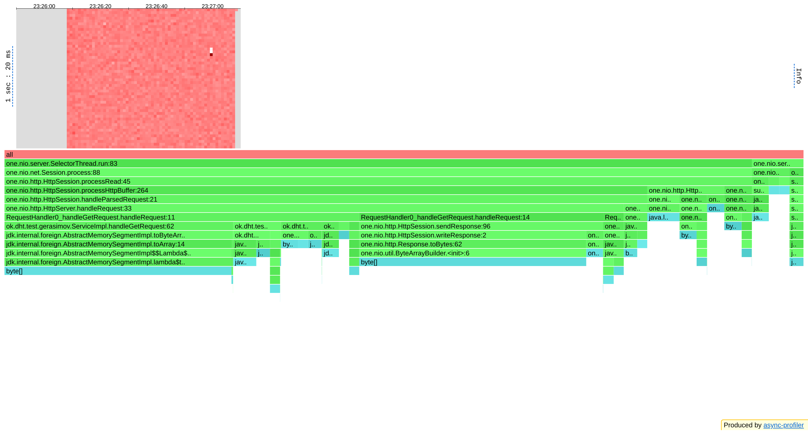
# get cpu 1000 rate

# put alloc 1000 rate

# put cpu 1000 rate
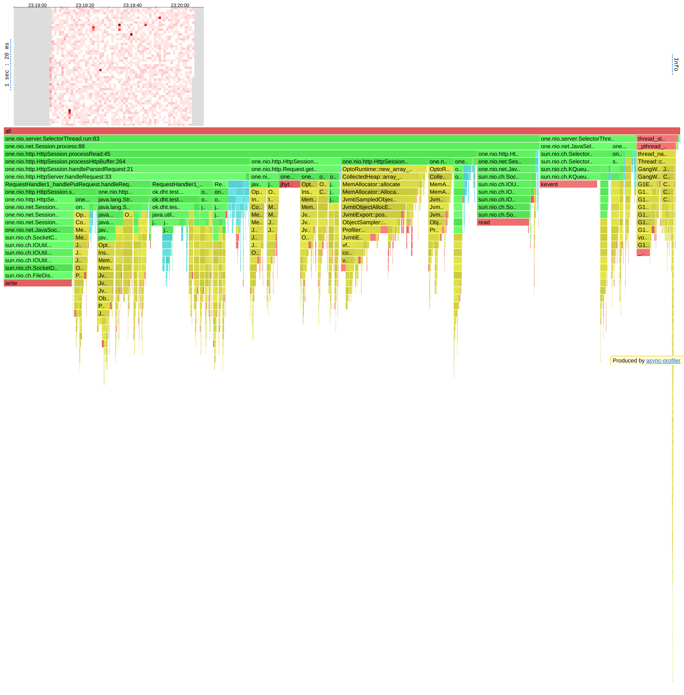

---
Рассмотрим rate=3000:
# get alloc 3000 rate
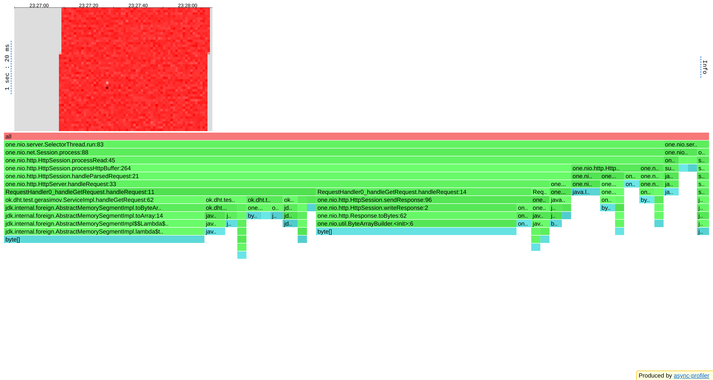
# get cpu 3000 rate
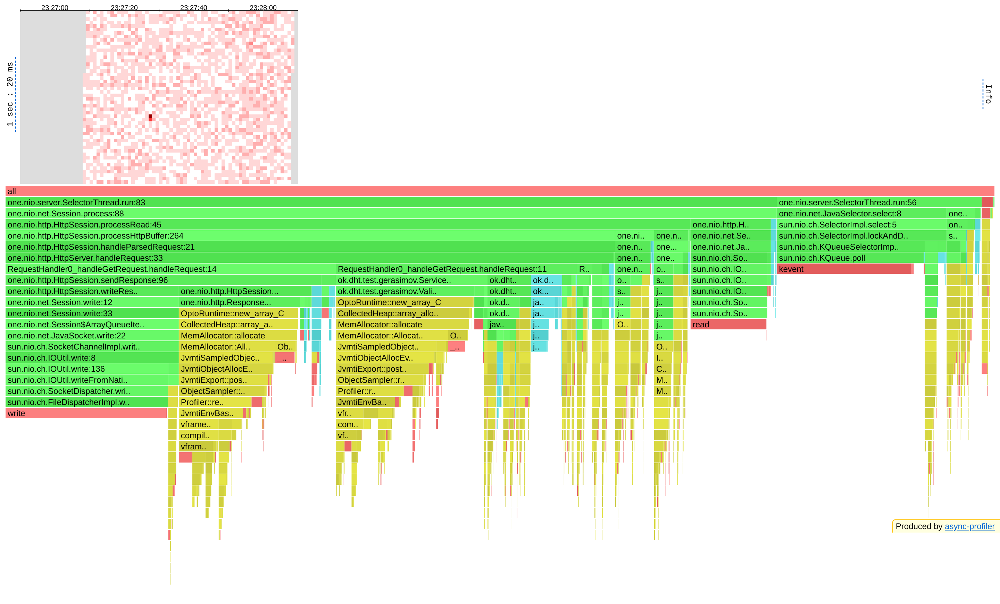
# put alloc 3000 rate
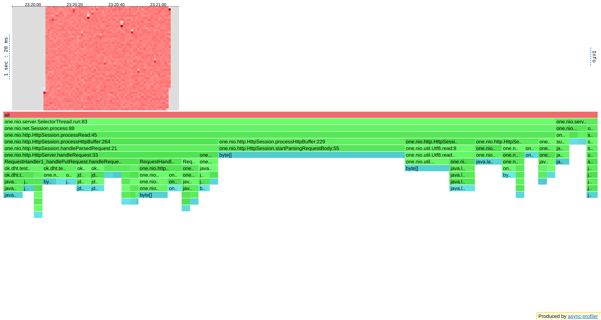
# put cpu 3000 rate


---
Рассмотрим rate=5000:
# get alloc 5000 rate
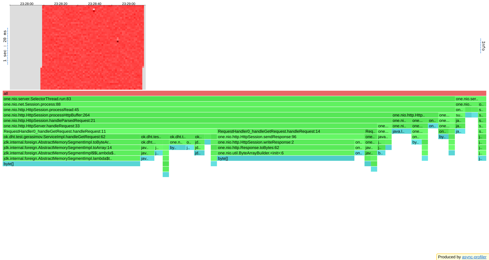
# get cpu 5000 rate
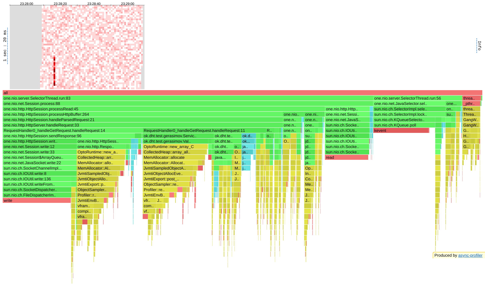
# put alloc 5000 rate
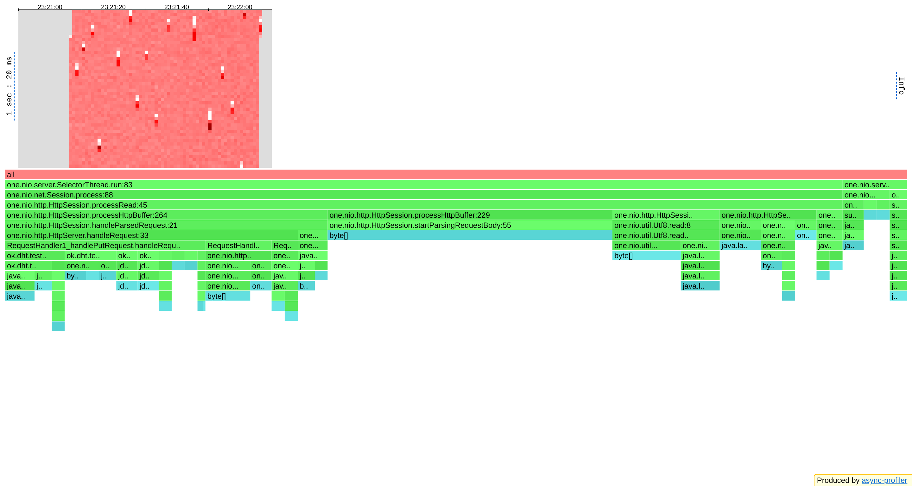
# put cpu 5000 rate


---
Рассмотрим rate=8000:
# get alloc 8000 rate
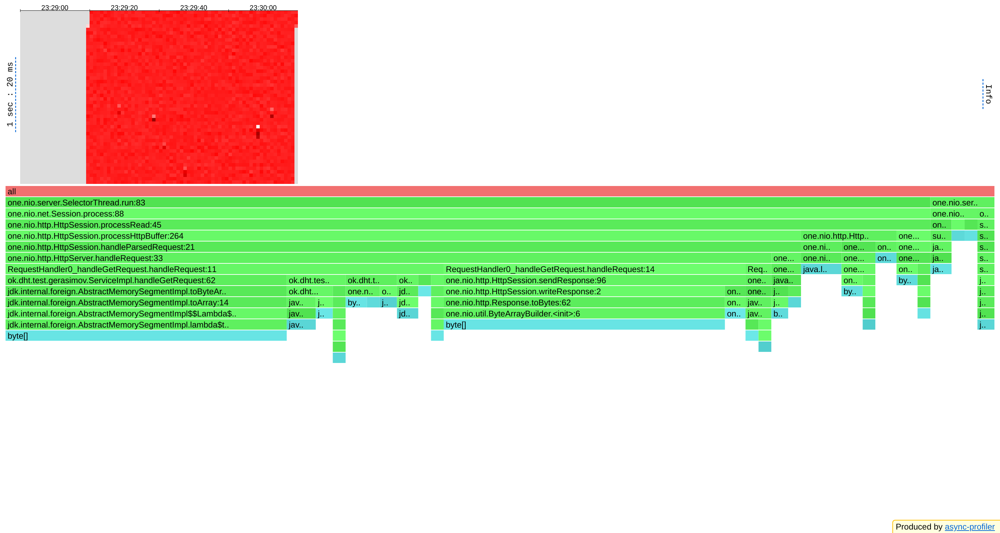
# get cpu 8000 rate

# put alloc 8000 rate
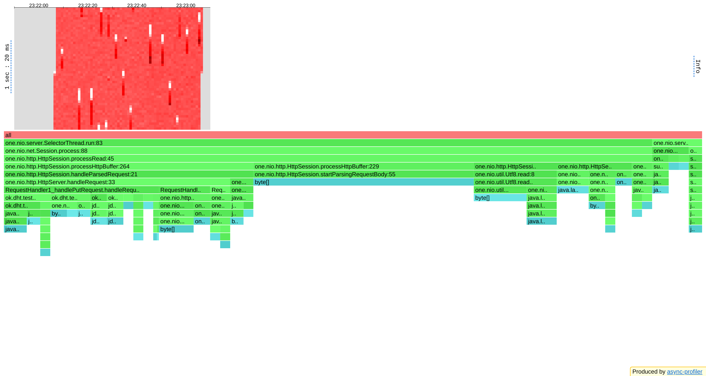
# put cpu 8000 rate
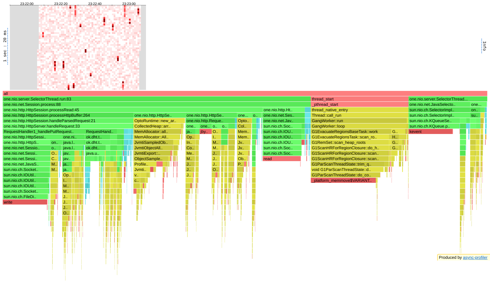

---
Рассмотрим rate=12000:
# get alloc 12000 rate
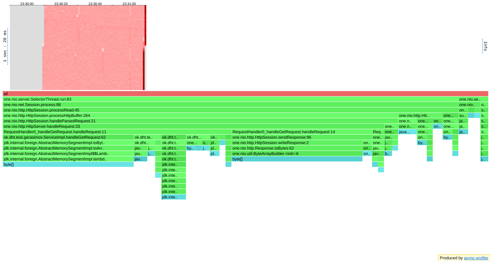
# get cpu 12000 rate

# put alloc 12000 rate
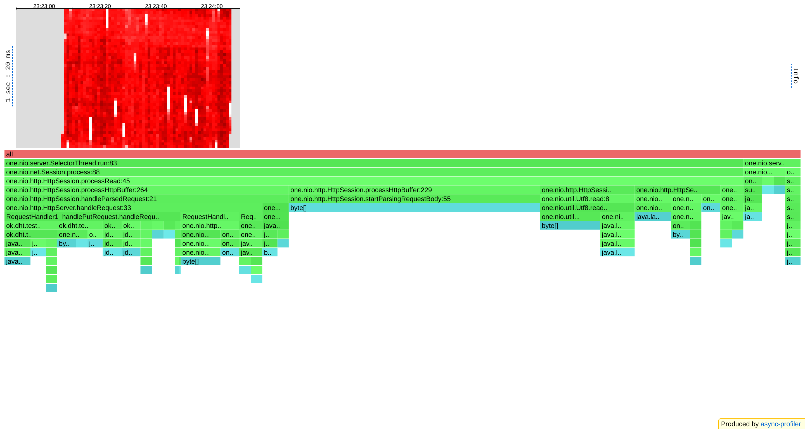
# put cpu 12000 rate


---
Рассмотрим rate=15000:
# get alloc 15000 rate
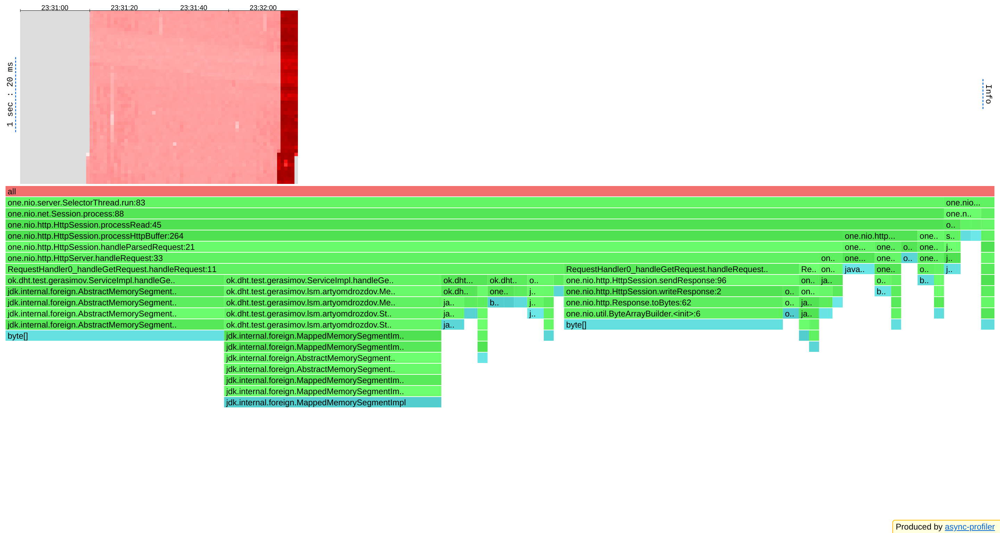
# get cpu 15000 rate

# put alloc 15000 rate

# put cpu 15000 rate


---
Рассмотрим rate=20000:
# get alloc 20000 rate

# get cpu 20000 rate
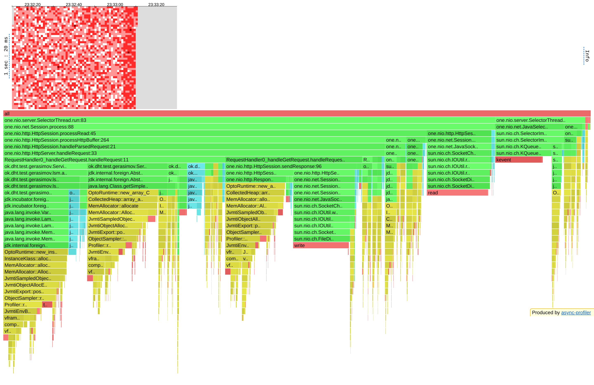
# put alloc 20000 rate

# put cpu 20000 rate
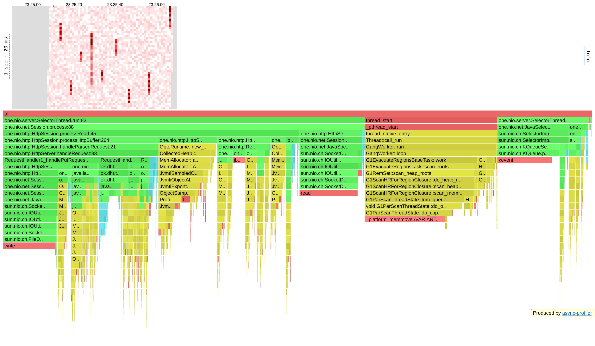

---

Большая часть памяти аллоцируется для сети. Так же в бд есть места, где можно сократить аллокацию памяти, но к сожалению
на png не видно сколько бд аллоцирует памяти. Для более детального изучения можно открыть html.
Я в основном изучал результаты для rate=8000. По CPU видно, что get тратит больше ресурсов (26%) чем put (7%).
Это логично, так как мы используем lsm дерево. По ALLOC видно, что для get запросов выделятся в два раза больше памяти (8 766 931 920 bytes),
а для put запросов выделяется (4 713 341 688 bytes). Это тоже ожидаемое поведение потому что мы ходим в bucket'ы и загружаем весь bucket.
По ALLOC видно, что для put запросов выделяется память в основном только для работы сервера (98%).
Как вариант улучшения latency это добавить многопоточность в код сервера.
На стороне сервера не нашел особых проблем с памятью: используются примитивные массивы и типы. Как вариант можно попробовать в некоторых местах
перейти с int на short или byte. Тогда незначительно возможно уменьшиться аллокация памяти для one.nio.http.HttpSession.startParsingRequestBody(String, byte[], int, int).
Сейчас она занимает 85% от всего. Так же наверное это связано с тем, что я передаю в одном put много bytes.
В LSM можно так же перейти на примитивы, это должно улучшить результаты профилирования CPU и ALLOC.

