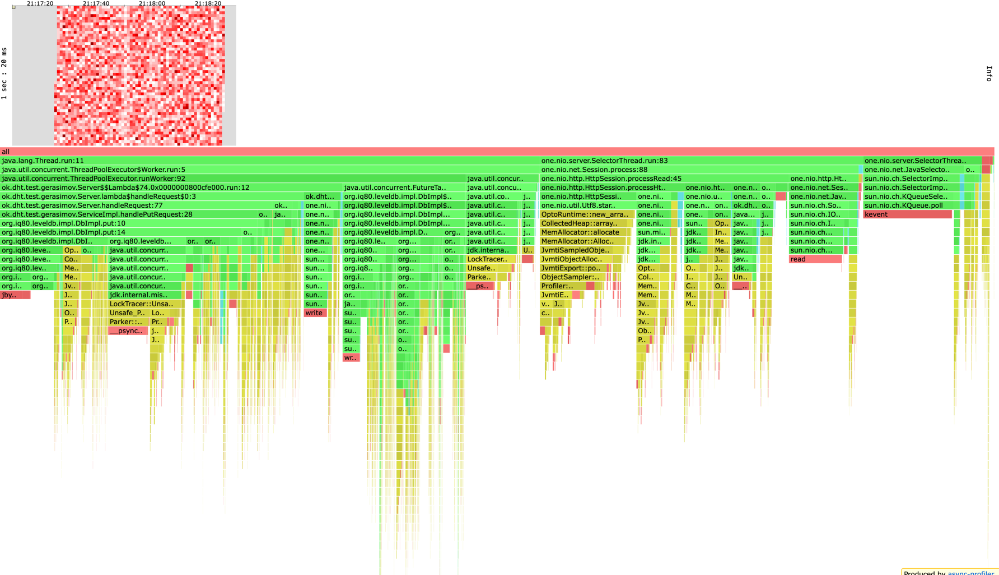
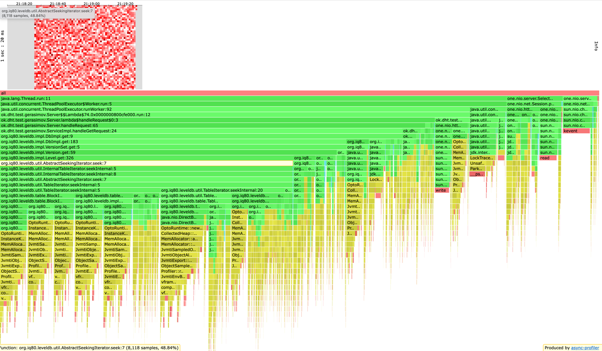
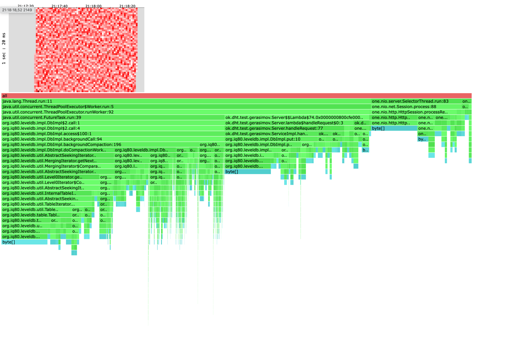
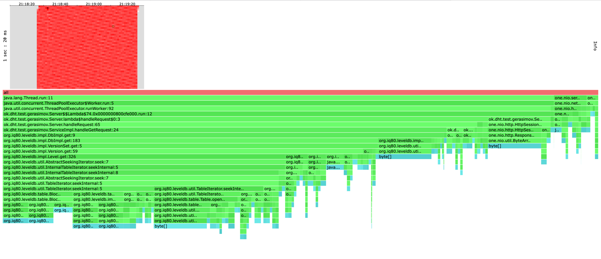
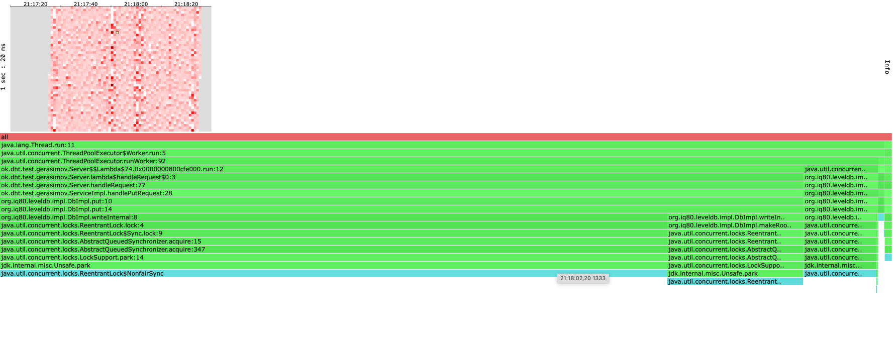
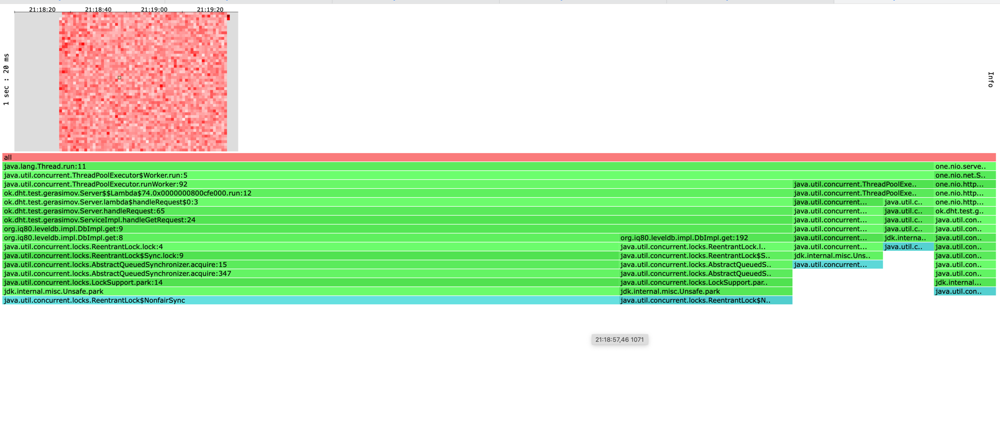

Сервер был протестирован на rate = 500, rate = 1000, rate = 2000, rate = 5000, rate = 10000 и rate = 50000.
Скрипт для запуска называется [run.sh](./../../scripts/run.sh)
Сервер стабильно выдерживает rate = 5000, поэтому будем рассматривать именно его.

Вывод wrk2 для PUT:
```text
  Thread Stats   Avg      Stdev     Max   +/- Stdev
    Latency     8.47ms   14.83ms 187.01ms   92.74%
    Req/Sec   158.13     51.98   447.00     71.95%
  Latency Distribution (HdrHistogram - Recorded Latency)
 50.000%    2.60ms
 75.000%   11.36ms
 90.000%   20.83ms
 99.000%   75.52ms
 99.900%  158.08ms
 99.990%  182.14ms
 99.999%  186.24ms
100.000%  187.13ms
```

Вывод wkr2 для GET:
```text
  Thread Stats   Avg      Stdev     Max   +/- Stdev
    Latency     1.49ms  661.84us   4.88ms   68.04%
    Req/Sec   164.79     51.00   333.00     46.84%
  Latency Distribution (HdrHistogram - Recorded Latency)
 50.000%    1.41ms
 75.000%    1.89ms
 90.000%    2.40ms
 99.000%    3.29ms
 99.900%    3.86ms
 99.990%    4.21ms
 99.999%    4.49ms
100.000%    4.89ms
```
# put_cpu
</img>
# get_cpu
</img>
# put_alloc
</img>
# get_alloc
</img>

Выводы:
ThreadPoolExecutor потребляет наибольшее количество памяти (78%). Работа базы занимает 47%, сеть же
потребляет 50% памяти. Наверное это успех, потому что в прошлом ДЗ почти весь ресурс забирала сеть.
Как видно из профайлинга ALLOC узкое место БД это доступ к ней. Как вариант решение проблемы можно
увеличить BUCKET_FLUSH_SIZE чтобы реже обращаться к БД. Сеть же по сравнению с прошлым ДЗ стала работать в разы быстрее.
Еще играет важную роль handleRequest написанный на switch. Теперь не нужно вызывать много методов для обработки запросов
и сервер стал более узконаправленным. Пропала кодогенерация, которая вызывала много аллокаций.
По поводу CPU можно сказать следующее: сеть все также достаточно много потребляет ресурсов процессора.
Так же было замечено, что присутствует JVM_SLEEP. Это конечно в любом случае наверное неизбежно, но
можно попробовать подогнать параметры, чтобы уменьшить простои процессора. 


# put_lock
</img>
# get_lock
</img>

Из профайлинга lock'ов видно, что основная часть приходится на БД. Как вариант улучшения 
можно написать lock-free очередь для селекторов.