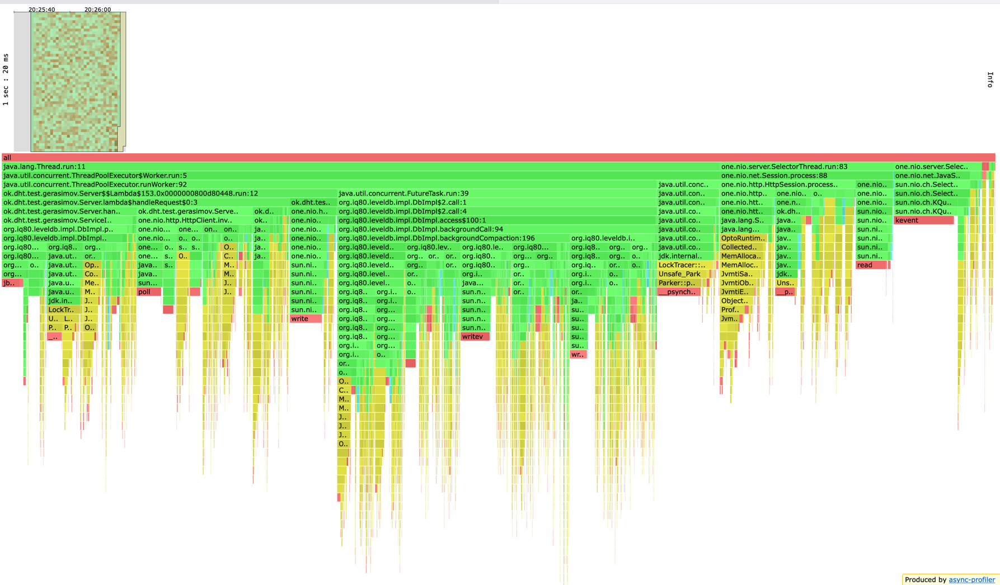

Первым делом я начал прогрев бд и решил посмотреть на распределение ключей если на каждый
шард приходится один виртуальный узел. Получил следующие результаты:

```text
Server name: http://localhost:25565. Count: 162372
Server name: http://localhost:47787. Count: 110174
Server name: http://localhost:36676. Count: 38199
Server name: http://localhost:14454. Count: 307357
---------------
VNode{shard=http://localhost47787, hashcode=-1583231325}
VNode{shard=http://localhost36676, hashcode=-1316290046}
VNode{shard=http://localhost25565, hashcode=-187207383}
VNode{shard=http://localhost14454, hashcode=1944568589}
```

Как видно, на узел "http://localhost:14454" приходится в 2-3 раза больше ключей, а на узел
"http://localhost:36676" приходится слишком мало ключей. Пробуем увеличить кол-во VNode до 3.

```text
Server name: http://localhost:25565. Count: 125441
Server name: http://localhost:14454. Count: 73853
Server name: http://localhost:36676. Count: 269603
Server name: http://localhost:47787. Count: 164135
---------------
VNode{shard=http://localhost47787, hashcode=-1987327445}
VNode{shard=http://localhost47787, hashcode=-1583231325}
VNode{shard=http://localhost36676, hashcode=-1316290046}
VNode{shard=http://localhost14454, hashcode=-964438132}
VNode{shard=http://localhost36676, hashcode=-963999877}
VNode{shard=http://localhost14454, hashcode=-939019036}
VNode{shard=http://localhost25565, hashcode=-398603574}
VNode{shard=http://localhost25565, hashcode=-187207383}
VNode{shard=http://localhost25565, hashcode=-87694614}
VNode{shard=http://localhost47787, hashcode=260077558}
VNode{shard=http://localhost36676, hashcode=1819894262}
VNode{shard=http://localhost14454, hashcode=1944568589}
```

Уже лучше, пробуем 10 виртуальных узлов.

```text
Server name: http://localhost:25565. Count: 222909
Server name: http://localhost:47787. Count: 147781
Server name: http://localhost:36676. Count: 190884
Server name: http://localhost:14454. Count: 187202
---------------
VNode{shard=http://localhost36676, hashcode=-1997765006}
VNode{shard=http://localhost47787, hashcode=-1987327445}
VNode{shard=http://localhost36676, hashcode=-1963451812}
VNode{shard=http://localhost47787, hashcode=-1946664008}
VNode{shard=http://localhost36676, hashcode=-1876825915}
VNode{shard=http://localhost47787, hashcode=-1583231325}
VNode{shard=http://localhost25565, hashcode=-1379712199}
VNode{shard=http://localhost36676, hashcode=-1316290046}
VNode{shard=http://localhost47787, hashcode=-1273491407}
VNode{shard=http://localhost14454, hashcode=-1238930350}
VNode{shard=http://localhost14454, hashcode=-1164440687}
VNode{shard=http://localhost14454, hashcode=-1117853030}
VNode{shard=http://localhost47787, hashcode=-1079969623}
VNode{shard=http://localhost14454, hashcode=-964438132}
VNode{shard=http://localhost36676, hashcode=-963999877}
VNode{shard=http://localhost14454, hashcode=-939019036}
VNode{shard=http://localhost25565, hashcode=-822695803}
VNode{shard=http://localhost25565, hashcode=-398603574}
VNode{shard=http://localhost47787, hashcode=-306350947}
VNode{shard=http://localhost25565, hashcode=-187207383}
VNode{shard=http://localhost25565, hashcode=-87694614}
VNode{shard=http://localhost25565, hashcode=-46306321}
VNode{shard=http://localhost14454, hashcode=11708926}
VNode{shard=http://localhost14454, hashcode=86611695}
VNode{shard=http://localhost47787, hashcode=151811651}
VNode{shard=http://localhost47787, hashcode=260077558}
VNode{shard=http://localhost14454, hashcode=763364961}
VNode{shard=http://localhost47787, hashcode=939286332}
VNode{shard=http://localhost25565, hashcode=1080576932}
VNode{shard=http://localhost47787, hashcode=1084746103}
VNode{shard=http://localhost36676, hashcode=1358670007}
VNode{shard=http://localhost36676, hashcode=1372082047}
VNode{shard=http://localhost36676, hashcode=1625588124}
VNode{shard=http://localhost25565, hashcode=1663269177}
VNode{shard=http://localhost14454, hashcode=1678715661}
VNode{shard=http://localhost25565, hashcode=1771534157}
VNode{shard=http://localhost36676, hashcode=1819894262}
VNode{shard=http://localhost14454, hashcode=1944568589}
VNode{shard=http://localhost25565, hashcode=1945425782}
VNode{shard=http://localhost36676, hashcode=2102483854}
```

Стандартное отклонение уменьшилось, но время выполнения одного запроса увеличилось.
Поэтому решил остановиться на 3 виртуальных нодах.


После 5 минутного прогрева получаем следующее распределение:
```text
Server name: http://localhost:25565. Count: 198652
Server name: http://localhost:14454. Count: 117346
Server name: http://localhost:47787. Count: 259748
Server name: http://localhost:36676. Count: 426275
---------------
VNode{shard=http://localhost47787, hashcode=-1987327445}
VNode{shard=http://localhost47787, hashcode=-1583231325}
VNode{shard=http://localhost36676, hashcode=-1316290046}
VNode{shard=http://localhost14454, hashcode=-964438132}
VNode{shard=http://localhost36676, hashcode=-963999877}
VNode{shard=http://localhost14454, hashcode=-939019036}
VNode{shard=http://localhost25565, hashcode=-398603574}
VNode{shard=http://localhost25565, hashcode=-187207383}
VNode{shard=http://localhost25565, hashcode=-87694614}
VNode{shard=http://localhost47787, hashcode=260077558}
VNode{shard=http://localhost36676, hashcode=1819894262}
VNode{shard=http://localhost14454, hashcode=1944568589}
```

Подбираем rate.
Я начал со 100 и получил вот такой вывод:
```text
  Thread calibration: mean lat.: 2.179ms, rate sampling interval: 10ms
  Thread Stats   Avg      Stdev     Max   +/- Stdev
    Latency     1.85ms    0.96ms  19.15ms   74.31%
    Req/Sec   105.32     46.04   222.00     80.72%
  Latency Distribution (HdrHistogram - Recorded Latency)
 50.000%    1.72ms
 75.000%    2.37ms
 90.000%    3.02ms
 99.000%    3.78ms
 99.900%   10.38ms
 99.990%   19.17ms
 99.999%   19.17ms
100.000%   19.17ms

  Detailed Percentile spectrum:
       Value   Percentile   TotalCount 1/(1-Percentile)

       0.250     0.000000            1         1.00
       0.857     0.100000          502         1.11
       1.093     0.200000         1003         1.25
       1.299     0.300000         1501         1.43
       1.502     0.400000         2000         1.67
       1.717     0.500000         2502         2.00
       1.819     0.550000         2750         2.22
       1.935     0.600000         3003         2.50
       2.085     0.650000         3255         2.86
       2.215     0.700000         3504         3.33
       2.373     0.750000         3752         4.00
       2.453     0.775000         3875         4.44
       2.559     0.800000         4002         5.00
       2.659     0.825000         4125         5.71
       2.779     0.850000         4251         6.67
       2.893     0.875000         4375         8.00
       2.965     0.887500         4439         8.89
       3.023     0.900000         4502        10.00
       3.073     0.912500         4564        11.43
       3.135     0.925000         4626        13.33
       3.191     0.937500         4687        16.00
       3.237     0.943750         4718        17.78
       3.283     0.950000         4750        20.00
       3.325     0.956250         4782        22.86
       3.369     0.962500         4814        26.67
       3.417     0.968750         4844        32.00
       3.437     0.971875         4859        35.56
       3.477     0.975000         4876        40.00
       3.517     0.978125         4891        45.71
       3.555     0.981250         4906        53.33
       3.603     0.984375         4921        64.00
       3.665     0.985938         4930        71.11
       3.715     0.987500         4937        80.00
       3.763     0.989062         4945        91.43
       3.809     0.990625         4953       106.67
       3.883     0.992188         4960       128.00
       3.929     0.992969         4964       142.22
       4.027     0.993750         4968       160.00
       4.203     0.994531         4972       182.86
       4.571     0.995313         4976       213.33
       5.795     0.996094         4980       256.00
       5.995     0.996484         4982       284.44
       6.847     0.996875         4984       320.00
       7.883     0.997266         4986       365.71
       8.055     0.997656         4988       426.67
       8.543     0.998047         4990       512.00
       8.759     0.998242         4991       568.89
       9.551     0.998437         4992       640.00
      10.295     0.998633         4993       731.43
      10.375     0.998828         4994       853.33
      10.487     0.999023         4995      1024.00
      10.487     0.999121         4995      1137.78
      11.391     0.999219         4996      1280.00
      11.391     0.999316         4996      1462.86
      14.311     0.999414         4997      1706.67
      14.311     0.999512         4997      2048.00
      14.311     0.999561         4997      2275.56
      17.647     0.999609         4998      2560.00
      17.647     0.999658         4998      2925.71
      17.647     0.999707         4998      3413.33
      17.647     0.999756         4998      4096.00
      17.647     0.999780         4998      4551.11
      19.167     0.999805         4999      5120.00
      19.167     1.000000         4999          inf
#[Mean    =        1.852, StdDeviation   =        0.955]
#[Max     =       19.152, Total count    =         4999]
#[Buckets =           27, SubBuckets     =         2048]
----------------------------------------------------------
  6001 requests in 1.00m, 505.26KB read
Requests/sec:    100.01
Transfer/sec:      8.42KB
michael@MacBook-Pro-3 scripts % wrk2 -d 60 -t 8 -c 64 -R 1000 -s put.lua -L http://localhost:25565
Running 1m test @ http://localhost:25565
  8 threads and 64 connections
  Thread calibration: mean lat.: 4.764ms, rate sampling interval: 11ms
  Thread calibration: mean lat.: 2.446ms, rate sampling interval: 10ms
  Thread calibration: mean lat.: 2.354ms, rate sampling interval: 10ms
  Thread calibration: mean lat.: 2.467ms, rate sampling interval: 10ms
  Thread calibration: mean 
```

Пробуем rate = 1000:
```text
Running 1m test @ http://localhost:25565
  8 threads and 64 connections
  Thread calibration: mean lat.: 4.764ms, rate sampling interval: 11ms
  Thread calibration: mean lat.: 2.446ms, rate sampling interval: 10ms
  Thread calibration: mean lat.: 2.354ms, rate sampling interval: 10ms
  Thread calibration: mean lat.: 2.467ms, rate sampling interval: 10ms
  Thread calibration: mean lat.: 2.443ms, rate sampling interval: 10ms
  Thread calibration: mean lat.: 2.436ms, rate sampling interval: 10ms
  Thread calibration: mean lat.: 2.440ms, rate sampling interval: 10ms
  Thread calibration: mean lat.: 2.517ms, rate sampling interval: 10ms
  Thread Stats   Avg      Stdev     Max   +/- Stdev
    Latency     1.73ms    2.38ms  39.65ms   97.20%
    Req/Sec   135.75    133.84   800.00     55.37%
  Latency Distribution (HdrHistogram - Recorded Latency)
 50.000%    1.36ms
 75.000%    1.85ms
 90.000%    2.41ms
 99.000%   13.81ms
 99.900%   31.04ms
 99.990%   38.14ms
 99.999%   39.68ms
100.000%   39.68ms

  Detailed Percentile spectrum:
       Value   Percentile   TotalCount 1/(1-Percentile)

       0.127     0.000000            1         1.00
       0.638     0.100000         5002         1.11
       0.857     0.200000        10005         1.25
       1.043     0.300000        14999         1.43
       1.204     0.400000        20002         1.67
       1.359     0.500000        24982         2.00
       1.435     0.550000        27480         2.22
       1.524     0.600000        29987         2.50
       1.621     0.650000        32477         2.86
       1.731     0.700000        34974         3.33
       1.853     0.750000        37475         4.00
       1.920     0.775000        38732         4.44
       1.996     0.800000        39983         5.00
       2.073     0.825000        41222         5.71
       2.165     0.850000        42484         6.67
       2.271     0.875000        43733         8.00
       2.333     0.887500        44360         8.89
       2.409     0.900000        44981        10.00
       2.501     0.912500        45594        11.43
       2.601     0.925000        46223        13.33
       2.737     0.937500        46843        16.00
       2.819     0.943750        47159        17.78
       2.921     0.950000        47465        20.00
       3.073     0.956250        47777        22.86
       3.271     0.962500        48090        26.67
       3.613     0.968750        48401        32.00
       4.085     0.971875        48557        35.56
       5.267     0.975000        48714        40.00
       6.603     0.978125        48872        45.71
       8.023     0.981250        49026        53.33
       9.471     0.984375        49182        64.00
      10.631     0.985938        49261        71.11
      11.535     0.987500        49338        80.00
      12.823     0.989062        49416        91.43
      14.495     0.990625        49494       106.67
      15.903     0.992188        49572       128.00
      16.799     0.992969        49611       142.22
      17.599     0.993750        49650       160.00
      18.575     0.994531        49689       182.86
      20.015     0.995313        49728       213.33
      21.167     0.996094        49767       256.00
      21.935     0.996484        49787       284.44
      23.135     0.996875        49806       320.00
      24.783     0.997266        49826       365.71
      25.551     0.997656        49845       426.67
      26.847     0.998047        49865       512.00
      27.919     0.998242        49875       568.89
      29.423     0.998437        49884       640.00
      29.935     0.998633        49894       731.43
      30.511     0.998828        49904       853.33
      31.503     0.999023        49914      1024.00
      31.935     0.999121        49919      1137.78
      33.055     0.999219        49923      1280.00
      33.663     0.999316        49928      1462.86
      34.367     0.999414        49933      1706.67
      35.487     0.999512        49938      2048.00
      35.871     0.999561        49943      2275.56
      35.871     0.999609        49943      2560.00
      35.935     0.999658        49945      2925.71
      36.383     0.999707        49948      3413.33
      37.023     0.999756        49950      4096.00
      37.407     0.999780        49952      4551.11
      37.471     0.999805        49953      5120.00
      38.079     0.999829        49954      5851.43
      38.143     0.999854        49957      6826.67
      38.143     0.999878        49957      8192.00
      38.143     0.999890        49957      9102.22
      38.175     0.999902        49958     10240.00
      38.175     0.999915        49958     11702.86
      39.135     0.999927        49959     13653.33
      39.135     0.999939        49959     16384.00
      39.391     0.999945        49960     18204.44
      39.391     0.999951        49960     20480.00
      39.391     0.999957        49960     23405.71
      39.615     0.999963        49961     27306.67
      39.615     0.999969        49961     32768.00
      39.615     0.999973        49961     36408.89
      39.615     0.999976        49961     40960.00
      39.615     0.999979        49961     46811.43
      39.679     0.999982        49962     54613.33
      39.679     1.000000        49962          inf
#[Mean    =        1.732, StdDeviation   =        2.378]
#[Max     =       39.648, Total count    =        49962]
#[Buckets =           27, SubBuckets     =         2048]
----------------------------------------------------------
  59899 requests in 1.00m, 4.92MB read
Requests/sec:    998.10
Transfer/sec:     84.00KB
```

Пробуем rate = 3000:
```text
michael@MacBook-Pro-3 scripts % wrk2 -d 60 -t 8 -c 64 -R 3000 -s put.lua -L http://localhost:25565
Running 1m test @ http://localhost:25565
  8 threads and 64 connections
  Thread calibration: mean lat.: 3.159ms, rate sampling interval: 14ms
  Thread calibration: mean lat.: 3.248ms, rate sampling interval: 15ms
  Thread calibration: mean lat.: 3.206ms, rate sampling interval: 15ms
  Thread calibration: mean lat.: 3.219ms, rate sampling interval: 15ms
  Thread calibration: mean lat.: 3.268ms, rate sampling interval: 16ms
  Thread calibration: mean lat.: 3.261ms, rate sampling interval: 16ms
  Thread calibration: mean lat.: 3.193ms, rate sampling interval: 16ms
  Thread calibration: mean lat.: 3.301ms, rate sampling interval: 16ms
  Thread Stats   Avg      Stdev     Max   +/- Stdev
    Latency     3.87ms    8.60ms 116.54ms   91.65%
    Req/Sec   388.33    173.11     3.07k    84.91%
  Latency Distribution (HdrHistogram - Recorded Latency)
 50.000%    1.30ms
 75.000%    1.91ms
 90.000%    9.77ms
 99.000%   42.88ms
 99.900%   84.10ms
 99.990%  107.65ms
 99.999%  116.61ms
100.000%  116.61ms

  Detailed Percentile spectrum:
       Value   Percentile   TotalCount 1/(1-Percentile)

       0.102     0.000000            1         1.00
       0.561     0.100000        15015         1.11
       0.783     0.200000        30050         1.25
       0.969     0.300000        44964         1.43
       1.135     0.400000        59992         1.67
       1.296     0.500000        74989         2.00
       1.381     0.550000        82455         2.22
       1.473     0.600000        89927         2.50
       1.584     0.650000        97421         2.86
       1.725     0.700000       104944         3.33
       1.911     0.750000       112410         4.00
       2.040     0.775000       116171         4.44
       2.225     0.800000       119908         5.00
       2.539     0.825000       123652         5.71
       3.883     0.850000       127393         6.67
       6.699     0.875000       131140         8.00
       8.175     0.887500       133017         8.89
       9.775     0.900000       134889        10.00
      11.807     0.912500       136761        11.43
      14.063     0.925000       138634        13.33
      16.799     0.937500       140507        16.00
      18.367     0.943750       141446        17.78
      20.127     0.950000       142396        20.00
      22.063     0.956250       143317        22.86
      24.447     0.962500       144253        26.67
      27.263     0.968750       145191        32.00
      29.023     0.971875       145658        35.56
      31.199     0.975000       146129        40.00
      32.863     0.978125       146601        45.71
      35.071     0.981250       147066        53.33
      37.279     0.984375       147538        64.00
      38.527     0.985938       147772        71.11
      40.063     0.987500       148002        80.00
      41.599     0.989062       148234        91.43
      43.967     0.990625       148472       106.67
      46.623     0.992188       148703       128.00
      48.127     0.992969       148820       142.22
      51.135     0.993750       148940       160.00
      53.215     0.994531       149056       182.86
      55.455     0.995313       149171       213.33
      59.263     0.996094       149289       256.00
      62.079     0.996484       149348       284.44
      64.511     0.996875       149405       320.00
      67.519     0.997266       149464       365.71
      69.887     0.997656       149525       426.67
      72.319     0.998047       149582       512.00
      74.815     0.998242       149610       568.89
      76.287     0.998437       149639       640.00
      78.655     0.998633       149669       731.43
      81.535     0.998828       149699       853.33
      84.607     0.999023       149728      1024.00
      86.207     0.999121       149742      1137.78
      88.959     0.999219       149756      1280.00
      91.071     0.999316       149771      1462.86
      94.975     0.999414       149786      1706.67
      96.319     0.999512       149801      2048.00
      97.343     0.999561       149808      2275.56
     100.543     0.999609       149815      2560.00
     101.247     0.999658       149822      2925.71
     102.015     0.999707       149830      3413.33
     102.911     0.999756       149837      4096.00
     103.423     0.999780       149841      4551.11
     104.255     0.999805       149845      5120.00
     104.639     0.999829       149848      5851.43
     106.751     0.999854       149852      6826.67
     107.263     0.999878       149855      8192.00
     107.583     0.999890       149857      9102.22
     108.799     0.999902       149859     10240.00
     109.183     0.999915       149861     11702.86
     110.079     0.999927       149863     13653.33
     110.271     0.999939       149864     16384.00
     111.039     0.999945       149865     18204.44
     111.103     0.999951       149866     20480.00
     111.423     0.999957       149867     23405.71
     111.615     0.999963       149868     27306.67
     111.679     0.999969       149869     32768.00
     111.679     0.999973       149869     36408.89
     112.063     0.999976       149870     40960.00
     112.063     0.999979       149870     46811.43
     112.703     0.999982       149871     54613.33
     112.703     0.999985       149871     65536.00
     112.703     0.999986       149871     72817.78
     116.607     0.999988       149873     81920.00
     116.607     1.000000       149873          inf
#[Mean    =        3.868, StdDeviation   =        8.602]
#[Max     =      116.544, Total count    =       149873]
#[Buckets =           27, SubBuckets     =         2048]
----------------------------------------------------------
  179977 requests in 1.00m, 14.80MB read
Requests/sec:   2999.62
Transfer/sec:    252.62KB
```

Пробуем rate = 5000:
```text
michael@MacBook-Pro-3 scripts % wrk2 -d 60 -t 8 -c 64 -R 5000 -s put.lua -L http://localhost:25565
Running 1m test @ http://localhost:25565
  8 threads and 64 connections
  Thread calibration: mean lat.: 112.708ms, rate sampling interval: 710ms
  Thread calibration: mean lat.: 107.984ms, rate sampling interval: 674ms
  Thread calibration: mean lat.: 118.607ms, rate sampling interval: 770ms
  Thread calibration: mean lat.: 115.054ms, rate sampling interval: 720ms
  Thread calibration: mean lat.: 117.213ms, rate sampling interval: 735ms
  Thread calibration: mean lat.: 118.400ms, rate sampling interval: 773ms
  Thread calibration: mean lat.: 111.386ms, rate sampling interval: 716ms
  Thread calibration: mean lat.: 112.637ms, rate sampling interval: 690ms
  Thread Stats   Avg      Stdev     Max   +/- Stdev
    Latency   887.36ms  828.08ms   2.81s    41.36%
    Req/Sec   625.13    185.36     1.19k    75.05%
  Latency Distribution (HdrHistogram - Recorded Latency)
 50.000%  962.56ms
 75.000%    1.61s 
 90.000%    2.01s 
 99.000%    2.45s 
 99.900%    2.63s 
 99.990%    2.74s 
 99.999%    2.81s 
100.000%    2.81s 

  Detailed Percentile spectrum:
       Value   Percentile   TotalCount 1/(1-Percentile)

       0.085     0.000000            1         1.00
       1.078     0.100000        24997         1.11
       2.091     0.200000        49955         1.25
      17.935     0.300000        74940         1.43
      94.527     0.400000        99907         1.67
     962.559     0.500000       124892         2.00
    1162.239     0.550000       137417         2.22
    1301.503     0.600000       149929         2.50
    1416.191     0.650000       162453         2.86
    1513.471     0.700000       174916         3.33
    1614.847     0.750000       187372         4.00
    1670.143     0.775000       193598         4.44
    1728.511     0.800000       199866         5.00
    1788.927     0.825000       206153         5.71
    1854.463     0.850000       212334         6.67
    1929.215     0.875000       218620         8.00
    1968.127     0.887500       221686         8.89
    2006.015     0.900000       224828        10.00
    2043.903     0.912500       227972        11.43
    2084.863     0.925000       231082        13.33
    2131.967     0.937500       234213        16.00
    2158.591     0.943750       235826        17.78
    2183.167     0.950000       237316        20.00
    2211.839     0.956250       238865        22.86
    2240.511     0.962500       240409        26.67
    2273.279     0.968750       241971        32.00
    2291.711     0.971875       242791        35.56
    2310.143     0.975000       243543        40.00
    2332.671     0.978125       244360        45.71
    2357.247     0.981250       245146        53.33
    2385.919     0.984375       245912        64.00
    2400.255     0.985938       246299        71.11
    2414.591     0.987500       246671        80.00
    2433.023     0.989062       247050        91.43
    2451.455     0.990625       247428       106.67
    2473.983     0.992188       247848       128.00
    2484.223     0.992969       248021       142.22
    2498.559     0.993750       248236       160.00
    2510.847     0.994531       248407       182.86
    2525.183     0.995313       248603       213.33
    2543.615     0.996094       248806       256.00
    2551.807     0.996484       248896       284.44
    2562.047     0.996875       248991       320.00
    2570.239     0.997266       249085       365.71
    2582.527     0.997656       249190       426.67
    2594.815     0.998047       249296       512.00
    2598.911     0.998242       249327       568.89
    2607.103     0.998437       249385       640.00
    2615.295     0.998633       249434       731.43
    2625.535     0.998828       249483       853.33
    2635.775     0.999023       249527      1024.00
    2643.967     0.999121       249551      1137.78
    2654.207     0.999219       249578      1280.00
    2662.399     0.999316       249599      1462.86
    2670.591     0.999414       249623      1706.67
    2682.879     0.999512       249654      2048.00
    2686.975     0.999561       249658      2275.56
    2693.119     0.999609       249675      2560.00
    2697.215     0.999658       249682      2925.71
    2703.359     0.999707       249697      3413.33
    2707.455     0.999756       249707      4096.00
    2713.599     0.999780       249716      4551.11
    2715.647     0.999805       249722      5120.00
    2719.743     0.999829       249726      5851.43
    2723.839     0.999854       249730      6826.67
    2729.983     0.999878       249736      8192.00
    2734.079     0.999890       249739      9102.22
    2738.175     0.999902       249742     10240.00
    2744.319     0.999915       249746     11702.86
    2750.463     0.999927       249748     13653.33
    2772.991     0.999939       249751     16384.00
    2777.087     0.999945       249754     18204.44
    2777.087     0.999951       249754     20480.00
    2783.231     0.999957       249757     23405.71
    2783.231     0.999963       249757     27306.67
    2789.375     0.999969       249759     32768.00
    2793.471     0.999973       249760     36408.89
    2793.471     0.999976       249760     40960.00
    2795.519     0.999979       249761     46811.43
    2797.567     0.999982       249762     54613.33
    2803.711     0.999985       249763     65536.00
    2803.711     0.999986       249763     72817.78
    2803.711     0.999988       249763     81920.00
    2805.759     0.999989       249764     93622.86
    2805.759     0.999991       249764    109226.67
    2807.807     0.999992       249766    131072.00
    2807.807     1.000000       249766          inf
#[Mean    =      887.356, StdDeviation   =      828.080]
#[Max     =     2805.760, Total count    =       249766]
#[Buckets =           27, SubBuckets     =         2048]
----------------------------------------------------------
  299864 requests in 1.00m, 24.67MB read
Requests/sec:   4997.84
Transfer/sec:    421.00KB
```

Видим что сервер захлебнулся, будем профилировать на rate = 3000.

wrk2 get
```text
Running 30s test @ http://localhost:25565
  8 threads and 64 connections
  Thread calibration: mean lat.: 3.156ms, rate sampling interval: 10ms
  Thread calibration: mean lat.: 3.214ms, rate sampling interval: 10ms
  Thread calibration: mean lat.: 3.042ms, rate sampling interval: 10ms
  Thread calibration: mean lat.: 3.094ms, rate sampling interval: 10ms
  Thread calibration: mean lat.: 3.083ms, rate sampling interval: 10ms
  Thread calibration: mean lat.: 2.998ms, rate sampling interval: 10ms
  Thread calibration: mean lat.: 3.079ms, rate sampling interval: 10ms
  Thread calibration: mean lat.: 3.100ms, rate sampling interval: 10ms
  Thread Stats   Avg      Stdev     Max   +/- Stdev
    Latency     1.76ms    1.72ms  33.15ms   96.58%
    Req/Sec   395.65     87.40     1.44k    69.77%
  Latency Distribution (HdrHistogram - Recorded Latency)
 50.000%    1.50ms
 75.000%    1.99ms
 90.000%    2.58ms
 99.000%    9.59ms
 99.900%   21.98ms
 99.990%   28.91ms
 99.999%   30.82ms
100.000%   33.18ms

  Detailed Percentile spectrum:
       Value   Percentile   TotalCount 1/(1-Percentile)

       0.190     0.000000            1         1.00
       0.779     0.100000         6007         1.11
       0.999     0.200000        12002         1.25
       1.182     0.300000        17982         1.43
       1.344     0.400000        23960         1.67
       1.501     0.500000        29958         2.00
       1.584     0.550000        32934         2.22
       1.668     0.600000        35931         2.50
       1.761     0.650000        38933         2.86
       1.868     0.700000        41922         3.33
       1.988     0.750000        44905         4.00
       2.057     0.775000        46443         4.44
       2.131     0.800000        47901         5.00
       2.217     0.825000        49404         5.71
       2.315     0.850000        50902         6.67
       2.433     0.875000        52406         8.00
       2.501     0.887500        53149         8.89
       2.579     0.900000        53891        10.00
       2.675     0.912500        54647        11.43
       2.785     0.925000        55384        13.33
       2.923     0.937500        56131        16.00
       3.009     0.943750        56512        17.78
       3.109     0.950000        56880        20.00
       3.237     0.956250        57256        22.86
       3.395     0.962500        57632        26.67
       3.573     0.968750        58003        32.00
       3.725     0.971875        58190        35.56
       3.911     0.975000        58377        40.00
       4.115     0.978125        58568        45.71
       4.491     0.981250        58752        53.33
       5.391     0.984375        58938        64.00
       6.347     0.985938        59032        71.11
       7.479     0.987500        59125        80.00
       8.759     0.989062        59219        91.43
      10.079     0.990625        59313       106.67
      11.559     0.992188        59406       128.00
      12.511     0.992969        59454       142.22
      13.511     0.993750        59499       160.00
      14.463     0.994531        59546       182.86
      15.935     0.995313        59593       213.33
      17.103     0.996094        59640       256.00
      17.679     0.996484        59663       284.44
      18.159     0.996875        59686       320.00
      18.799     0.997266        59710       365.71
      19.359     0.997656        59733       426.67
      19.967     0.998047        59757       512.00
      20.431     0.998242        59768       568.89
      20.911     0.998437        59780       640.00
      21.263     0.998633        59792       731.43
      21.775     0.998828        59803       853.33
      22.031     0.999023        59815      1024.00
      22.511     0.999121        59821      1137.78
      23.087     0.999219        59827      1280.00
      23.471     0.999316        59833      1462.86
      23.951     0.999414        59839      1706.67
      24.703     0.999512        59844      2048.00
      24.975     0.999561        59847      2275.56
      25.471     0.999609        59850      2560.00
      25.775     0.999658        59853      2925.71
      26.911     0.999707        59856      3413.33
      27.183     0.999756        59859      4096.00
      27.215     0.999780        59860      4551.11
      28.207     0.999805        59862      5120.00
      28.351     0.999829        59863      5851.43
      28.591     0.999854        59865      6826.67
      28.735     0.999878        59866      8192.00
      28.911     0.999890        59867      9102.22
      29.055     0.999902        59868     10240.00
      29.055     0.999915        59868     11702.86
      29.087     0.999927        59869     13653.33
      30.591     0.999939        59870     16384.00
      30.591     0.999945        59870     18204.44
      30.783     0.999951        59871     20480.00
      30.783     0.999957        59871     23405.71
      30.783     0.999963        59871     27306.67
      30.815     0.999969        59872     32768.00
      30.815     0.999973        59872     36408.89
      30.815     0.999976        59872     40960.00
      30.815     0.999979        59872     46811.43
      30.815     0.999982        59872     54613.33
      33.183     0.999985        59873     65536.00
      33.183     1.000000        59873          inf
#[Mean    =        1.763, StdDeviation   =        1.717]
#[Max     =       33.152, Total count    =        59873]
#[Buckets =           27, SubBuckets     =         2048]
----------------------------------------------------------
  89976 requests in 30.00s, 753.23MB read
Requests/sec:   2999.13
Transfer/sec:     25.11MB
```

wrk2 put
```text
Running 30s test @ http://localhost:25565
  8 threads and 64 connections
  Thread calibration: mean lat.: 20.961ms, rate sampling interval: 135ms
  Thread calibration: mean lat.: 21.216ms, rate sampling interval: 134ms
  Thread calibration: mean lat.: 21.491ms, rate sampling interval: 137ms
  Thread calibration: mean lat.: 21.579ms, rate sampling interval: 136ms
  Thread calibration: mean lat.: 21.233ms, rate sampling interval: 133ms
  Thread calibration: mean lat.: 21.727ms, rate sampling interval: 139ms
  Thread calibration: mean lat.: 21.428ms, rate sampling interval: 134ms
  Thread calibration: mean lat.: 21.521ms, rate sampling interval: 136ms
  Thread Stats   Avg      Stdev     Max   +/- Stdev
    Latency    16.88ms   29.43ms 241.66ms   87.17%
    Req/Sec   375.92     96.99     0.90k    77.05%
  Latency Distribution (HdrHistogram - Recorded Latency)
 50.000%    2.05ms
 75.000%   20.35ms
 90.000%   55.90ms
 99.000%  133.89ms
 99.900%  198.78ms
 99.990%  230.53ms
 99.999%  235.52ms
100.000%  241.79ms

  Detailed Percentile spectrum:
       Value   Percentile   TotalCount 1/(1-Percentile)

       0.151     0.000000            1         1.00
       0.807     0.100000         5987         1.11
       1.107     0.200000        11960         1.25
       1.371     0.300000        17934         1.43
       1.652     0.400000        23918         1.67
       2.051     0.500000        29908         2.00
       2.403     0.550000        32878         2.22
       3.285     0.600000        35866         2.50
       7.595     0.650000        38853         2.86
      13.703     0.700000        41842         3.33
      20.351     0.750000        44829         4.00
      24.239     0.775000        46331         4.44
      28.831     0.800000        47819         5.00
      34.303     0.825000        49316         5.71
      40.511     0.850000        50812         6.67
      47.295     0.875000        52302         8.00
      51.423     0.887500        53054         8.89
      55.903     0.900000        53796        10.00
      61.087     0.912500        54544        11.43
      66.303     0.925000        55290        13.33
      73.407     0.937500        56038        16.00
      77.375     0.943750        56416        17.78
      81.599     0.950000        56789        20.00
      86.335     0.956250        57161        22.86
      91.391     0.962500        57534        26.67
      97.343     0.968750        57906        32.00
     100.799     0.971875        58097        35.56
     104.959     0.975000        58278        40.00
     109.759     0.978125        58466        45.71
     114.303     0.981250        58652        53.33
     119.807     0.984375        58841        64.00
     123.199     0.985938        58932        71.11
     127.167     0.987500        59025        80.00
     130.559     0.989062        59120        91.43
     135.551     0.990625        59214       106.67
     143.999     0.992188        59307       128.00
     146.559     0.992969        59352       142.22
     150.015     0.993750        59399       160.00
     154.879     0.994531        59448       182.86
     160.767     0.995313        59492       213.33
     166.143     0.996094        59539       256.00
     168.959     0.996484        59562       284.44
     172.159     0.996875        59587       320.00
     176.511     0.997266        59609       365.71
     183.423     0.997656        59632       426.67
     186.623     0.998047        59656       512.00
     188.031     0.998242        59667       568.89
     190.591     0.998437        59679       640.00
     194.175     0.998633        59691       731.43
     196.223     0.998828        59703       853.33
     200.319     0.999023        59714      1024.00
     202.367     0.999121        59720      1137.78
     205.439     0.999219        59726      1280.00
     206.847     0.999316        59732      1462.86
     208.895     0.999414        59737      1706.67
     212.095     0.999512        59743      2048.00
     212.735     0.999561        59746      2275.56
     213.247     0.999609        59749      2560.00
     217.087     0.999658        59752      2925.71
     220.799     0.999707        59755      3413.33
     223.999     0.999756        59758      4096.00
     224.255     0.999780        59760      4551.11
     224.511     0.999805        59761      5120.00
     226.047     0.999829        59762      5851.43
     226.687     0.999854        59764      6826.67
     229.247     0.999878        59765      8192.00
     230.527     0.999890        59766      9102.22
     230.783     0.999902        59767     10240.00
     230.783     0.999915        59767     11702.86
     231.039     0.999927        59768     13653.33
     231.679     0.999939        59769     16384.00
     231.679     0.999945        59769     18204.44
     232.063     0.999951        59770     20480.00
     232.063     0.999957        59770     23405.71
     232.063     0.999963        59770     27306.67
     235.519     0.999969        59771     32768.00
     235.519     0.999973        59771     36408.89
     235.519     0.999976        59771     40960.00
     235.519     0.999979        59771     46811.43
     235.519     0.999982        59771     54613.33
     241.791     0.999985        59772     65536.00
     241.791     1.000000        59772          inf
#[Mean    =       16.879, StdDeviation   =       29.429]
#[Max     =      241.664, Total count    =        59772]
#[Buckets =           27, SubBuckets     =         2048]
----------------------------------------------------------
  89872 requests in 30.01s, 7.38MB read
Requests/sec:   2994.88
Transfer/sec:    251.99KB

```

Анализ put запросов:
44% CPU на работу с БД. Еще 33% ушло на работу хэндлера запросов. Причем 13% ушло на обработку
ключей, которые принадлежат координатору, а еще 11% ушло на запросы к другим шардам.
Поиск нужного шарда занимает 3%. Из этих 3% много потребляет Stream API. Как вариант улучшения
переписать все на примитивы и обычные for'ы. 

С аллокациями ситуации не особо поменялась: сеть забирает 25%, БД 37% и хэндлер запросов
37%. Компоненты отвечающие за шардирование потребляют всего 1%, поэтому переход на примитивы 
вряд ли сильно улучшит ситуацию. HTTP клиент забирает 22%. Как вариант улучшения поменять 
протокол общения между шардами. Http накладывает слишком большой оверхед.


Анализ get запросов:
Ситуация с CPU идентична put запросом. Что сразу заметно по сравнению со Stage2 это то, что
стало меньше тратиться CPU на get из БД. Возможно это связано с тем, что теперь в шарде лежит меньше
данных, следовательно, нужно меньше проводить работы по поиску этих данных.
С аллокациями дела обстоят так: 2/3 памяти сожрала работа с сетью, а именно сервер и Http клиент для общения
между шардами. Вариант улучшения связанный с этой проблемой я писал выше.

Locks:
Локи, как и предыдущем этапе, возникают из-за очереди, которая использутеся в тред-пуле и из-за БД.

На хитпамах CPU в обоих случаях видно много белых квадратиков, что означает что сервер простаивает.
Странно что они там есть потому что по wrk2 видно что на rate=3000 сервер работает стабильно, но все равно
ему не прям чтоб легко. Возможно эти простои связаны с ожиданием ответа от других шардов.

# get_alloc.png


# get_cpu.png


# get_lock.png


# put_alloc.png


# put_cpu.png


# put_lock.png
