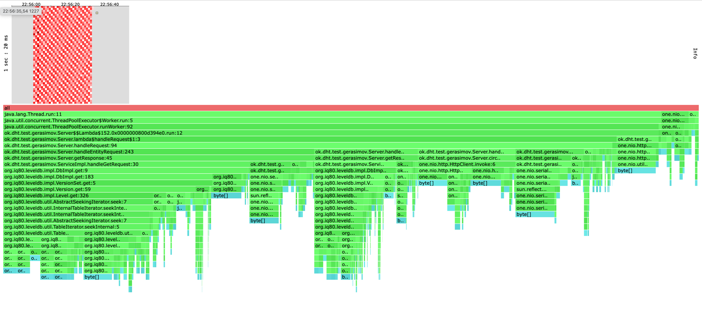
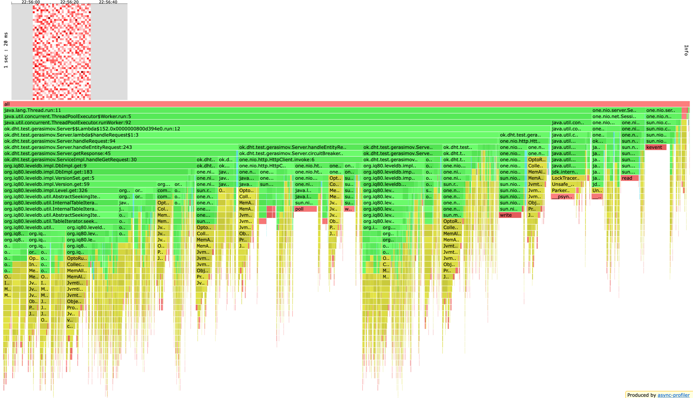
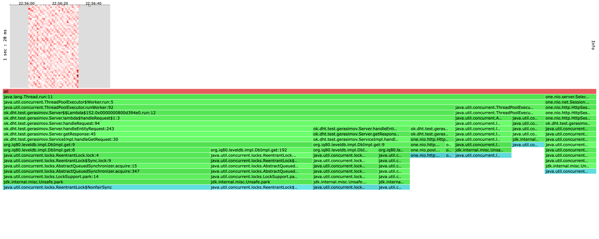
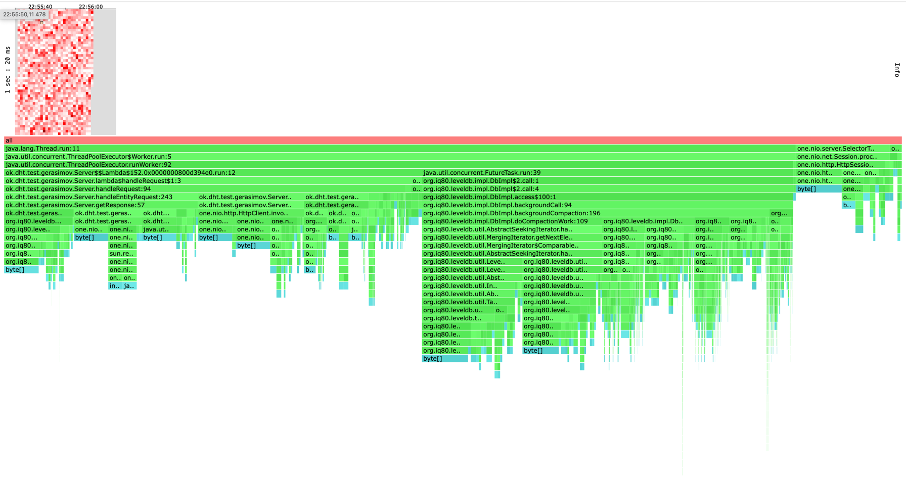
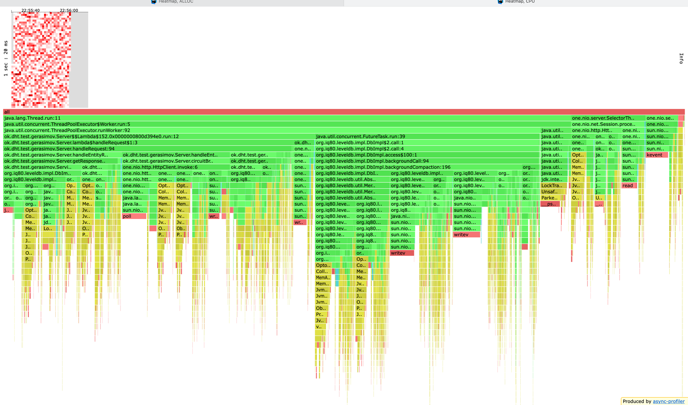

Перед профилированием я прогрел сервер и нагрузил базу.
Начал искать стабильный рейт с 3000. На этом рейте лэтенси для пут запросов был сликшом высокий (11 секунд), 
поэтому начал искать другой рейт. В конечном итоге я остановился на рейте 1000.
В отчете буду рассматривать только рейт 1000, все выводы wkr/profiler для других рейтов положу в папку reports/stage4/out


# Вывод wrk для get
```text
Running 30s test @ http://localhost:25565
  8 threads and 64 connections
  Thread calibration: mean lat.: 3.480ms, rate sampling interval: 11ms
  Thread calibration: mean lat.: 3.502ms, rate sampling interval: 11ms
  Thread calibration: mean lat.: 3.456ms, rate sampling interval: 11ms
  Thread calibration: mean lat.: 3.505ms, rate sampling interval: 10ms
  Thread calibration: mean lat.: 3.475ms, rate sampling interval: 11ms
  Thread calibration: mean lat.: 3.470ms, rate sampling interval: 11ms
  Thread calibration: mean lat.: 3.515ms, rate sampling interval: 10ms
  Thread calibration: mean lat.: 3.315ms, rate sampling interval: 12ms
  Thread Stats   Avg      Stdev     Max   +/- Stdev
    Latency     2.54ms    1.02ms  83.33ms   88.76%
    Req/Sec   134.57     98.10   444.00     59.21%
  Latency Distribution (HdrHistogram - Recorded Latency)
 50.000%    2.48ms
 75.000%    2.91ms
 90.000%    3.33ms
 99.000%    4.55ms
 99.900%   13.48ms
 99.990%   20.72ms
 99.999%   83.39ms
100.000%   83.39ms

  Detailed Percentile spectrum:
       Value   Percentile   TotalCount 1/(1-Percentile)

       0.578     0.000000            1         1.00
       1.699     0.100000         1999         1.11
       1.966     0.200000         3997         1.25
       2.153     0.300000         5992         1.43
       2.329     0.400000         8004         1.67
       2.483     0.500000        10000         2.00
       2.561     0.550000        11009         2.22
       2.637     0.600000        11989         2.50
       2.723     0.650000        12994         2.86
       2.811     0.700000        13995         3.33
       2.907     0.750000        14990         4.00
       2.961     0.775000        15476         4.44
       3.019     0.800000        15976         5.00
       3.079     0.825000        16484         5.71
       3.147     0.850000        16980         6.67
       3.229     0.875000        17479         8.00
       3.277     0.887500        17725         8.89
       3.325     0.900000        17977        10.00
       3.379     0.912500        18226        11.43
       3.439     0.925000        18473        13.33
       3.523     0.937500        18724        16.00
       3.569     0.943750        18851        17.78
       3.619     0.950000        18971        20.00
       3.677     0.956250        19096        22.86
       3.747     0.962500        19223        26.67
       3.843     0.968750        19346        32.00
       3.911     0.971875        19407        35.56
       3.957     0.975000        19471        40.00
       4.029     0.978125        19532        45.71
       4.123     0.981250        19596        53.33
       4.231     0.984375        19657        64.00
       4.299     0.985938        19690        71.11
       4.383     0.987500        19720        80.00
       4.483     0.989062        19750        91.43
       4.599     0.990625        19781       106.67
       4.763     0.992188        19812       128.00
       4.831     0.992969        19829       142.22
       4.931     0.993750        19844       160.00
       5.075     0.994531        19859       182.86
       5.347     0.995313        19875       213.33
       5.607     0.996094        19890       256.00
       5.723     0.996484        19898       284.44
       5.867     0.996875        19906       320.00
       6.339     0.997266        19914       365.71
       8.207     0.997656        19922       426.67
       9.175     0.998047        19929       512.00
       9.351     0.998242        19933       568.89
       9.679     0.998437        19937       640.00
      13.055     0.998633        19941       731.43
      13.207     0.998828        19945       853.33
      13.543     0.999023        19949      1024.00
      13.751     0.999121        19951      1137.78
      13.999     0.999219        19953      1280.00
      14.063     0.999316        19955      1462.86
      14.431     0.999414        19957      1706.67
      14.671     0.999512        19959      2048.00
      14.759     0.999561        19960      2275.56
      15.375     0.999609        19961      2560.00
      15.439     0.999658        19962      2925.71
      15.807     0.999707        19963      3413.33
      18.143     0.999756        19964      4096.00
      18.143     0.999780        19964      4551.11
      20.303     0.999805        19965      5120.00
      20.303     0.999829        19965      5851.43
      20.719     0.999854        19966      6826.67
      20.719     0.999878        19966      8192.00
      20.719     0.999890        19966      9102.22
      25.679     0.999902        19967     10240.00
      25.679     0.999915        19967     11702.86
      25.679     0.999927        19967     13653.33
      25.679     0.999939        19967     16384.00
      25.679     0.999945        19967     18204.44
      83.391     0.999951        19968     20480.00
      83.391     1.000000        19968          inf
#[Mean    =        2.538, StdDeviation   =        1.016]
#[Max     =       83.328, Total count    =        19968]
#[Buckets =           27, SubBuckets     =         2048]
----------------------------------------------------------
  30024 requests in 30.02s, 250.80MB read
Requests/sec:   1000.17
Transfer/sec:      8.35MB

```

# Вывод wrk для put
```text
Running 30s test @ http://localhost:25565
  8 threads and 64 connections
  Thread calibration: mean lat.: 27.224ms, rate sampling interval: 171ms
  Thread calibration: mean lat.: 27.399ms, rate sampling interval: 169ms
  Thread calibration: mean lat.: 27.737ms, rate sampling interval: 171ms
  Thread calibration: mean lat.: 27.871ms, rate sampling interval: 171ms
  Thread calibration: mean lat.: 28.103ms, rate sampling interval: 172ms
  Thread calibration: mean lat.: 27.822ms, rate sampling interval: 171ms
  Thread calibration: mean lat.: 27.737ms, rate sampling interval: 172ms
  Thread calibration: mean lat.: 27.900ms, rate sampling interval: 171ms
  Thread Stats   Avg      Stdev     Max   +/- Stdev
    Latency    30.74ms   39.06ms 240.26ms   83.99%
    Req/Sec   124.80     45.88   266.00     69.47%
  Latency Distribution (HdrHistogram - Recorded Latency)
 50.000%   11.41ms
 75.000%   47.87ms
 90.000%   86.59ms
 99.000%  170.37ms
 99.900%  225.02ms
 99.990%  240.26ms
 99.999%  240.38ms
100.000%  240.38ms

  Detailed Percentile spectrum:
       Value   Percentile   TotalCount 1/(1-Percentile)

       0.707     0.000000            1         1.00
       1.820     0.100000         2000         1.11
       2.307     0.200000         4002         1.25
       3.003     0.300000         5991         1.43
       5.295     0.400000         7988         1.67
      11.407     0.500000         9984         2.00
      16.895     0.550000        10986         2.22
      22.943     0.600000        11981         2.50
      29.855     0.650000        12982         2.86
      38.175     0.700000        13981         3.33
      47.871     0.750000        14977         4.00
      53.919     0.775000        15478         4.44
      59.967     0.800000        15975         5.00
      65.791     0.825000        16476         5.71
      72.255     0.850000        16974         6.67
      79.871     0.875000        17475         8.00
      83.071     0.887500        17724         8.89
      86.655     0.900000        17974        10.00
      91.839     0.912500        18223        11.43
      98.431     0.925000        18473        13.33
     106.111     0.937500        18720        16.00
     109.631     0.943750        18848        17.78
     113.535     0.950000        18972        20.00
     118.527     0.956250        19095        22.86
     124.095     0.962500        19220        26.67
     129.087     0.968750        19344        32.00
     131.967     0.971875        19407        35.56
     135.039     0.975000        19469        40.00
     137.855     0.978125        19532        45.71
     141.695     0.981250        19596        53.33
     144.895     0.984375        19657        64.00
     149.503     0.985938        19688        71.11
     157.695     0.987500        19719        80.00
     165.631     0.989062        19751        91.43
     171.391     0.990625        19781       106.67
     175.743     0.992188        19813       128.00
     177.023     0.992969        19828       142.22
     178.943     0.993750        19844       160.00
     180.991     0.994531        19859       182.86
     185.087     0.995313        19875       213.33
     188.031     0.996094        19890       256.00
     192.127     0.996484        19898       284.44
     193.663     0.996875        19906       320.00
     196.223     0.997266        19914       365.71
     204.287     0.997656        19922       426.67
     207.359     0.998047        19929       512.00
     209.151     0.998242        19933       568.89
     212.735     0.998437        19937       640.00
     219.647     0.998633        19941       731.43
     220.799     0.998828        19945       853.33
     225.919     0.999023        19949      1024.00
     226.175     0.999121        19951      1137.78
     229.631     0.999219        19954      1280.00
     229.759     0.999316        19955      1462.86
     230.015     0.999414        19957      1706.67
     230.399     0.999512        19959      2048.00
     230.655     0.999561        19960      2275.56
     231.295     0.999609        19961      2560.00
     231.935     0.999658        19962      2925.71
     232.447     0.999707        19963      3413.33
     232.831     0.999756        19964      4096.00
     232.831     0.999780        19964      4551.11
     239.871     0.999805        19965      5120.00
     239.871     0.999829        19965      5851.43
     240.255     0.999854        19966      6826.67
     240.255     0.999878        19966      8192.00
     240.255     0.999890        19966      9102.22
     240.383     0.999902        19968     10240.00
     240.383     1.000000        19968          inf
#[Mean    =       30.738, StdDeviation   =       39.057]
#[Max     =      240.256, Total count    =        19968]
#[Buckets =           27, SubBuckets     =         2048]
----------------------------------------------------------
  30024 requests in 30.02s, 1.92MB read
Requests/sec:   1000.07
Transfer/sec:     65.43KB
```

Сразу видна большая разница лэтенси между put и get. Пока что не могу понять из-за чего,
попробуем разобраться с помощью профилирования.

На профиле для put-cpu сразу видно во что мы уперлись: в бд(как и во всех прошлых стейджах) и в хэндл запросов.
Добавленный circuitBreaker потребляет слишком много ресурсов. Возможно это место можно как-то улучшить, но в голову ничего не приходит.
Жду ответы от реплик не асинхронно из-за чего проигрываем по скорости, а так же заметил что сериализация/десериализация объектов
стоит много, поэтому нужно уменьшать кол-во вызовов ObjectMapper'a или придумать другой способ хранения таймстампов.
На хитмапе много белых точек, что для меня странно потому что put была и так нелегко. Это говорит о том что у нас есть еще 
какой-то запас рпс или можно уменьшить кол-во ресурсов, выделяемые на сервер.

Из нового много памяти потребляет ObjectMapper (сериализация/десериализация) и DaoEntry (обертка для хранения таймстампа и надгробия).
Опять же надо уменьшать кол-во сериализаций или десериализаций если это возможно. Можно попробовать другой формат хранения таймстампов.
Еще мне кажется что можно обойтись как-то без флажка tombstone, но пока что не придумал как.

С локами ситуация следующая: хитмапа белая и большая часть локов это хэндер запросов. Мне кажется что put работает быстро,
а вот обработка результата медленно, из-за этого много простоев. 

Для get запросов cpu чуть лучше: хитмапа более красная, но простои все равно есть. А так все остальное анадогично put.
По аллокациям было очевидно что будет хуже, чем у put, так как нам требуется дополнительно маппить объекты. Рекомендации аналогичны put.
C локами у get я бы сказал что все лучше чем у put: мапа имеет равномерный цвет (то что она белая это нормально, так как рейт 1000 для get легкая нагрузка)

Общий вывод: на данном стейдже мы сильно проиграли с put запросами, следующим логичным шагом будет оптимизация хендлера, а именно получения кворума ответов асинхронно.
Исходя из профиля нужно сокращать системных обращений к кластерам. Например, можно использовать другой протокол общения между шардами или пробывать объединять сообщения (отправлять батчами).


# get_alloc.png


# get_cpu.png


# get_lock.png


# put_alloc.png


# put_cpu.png


# put_lock.png
