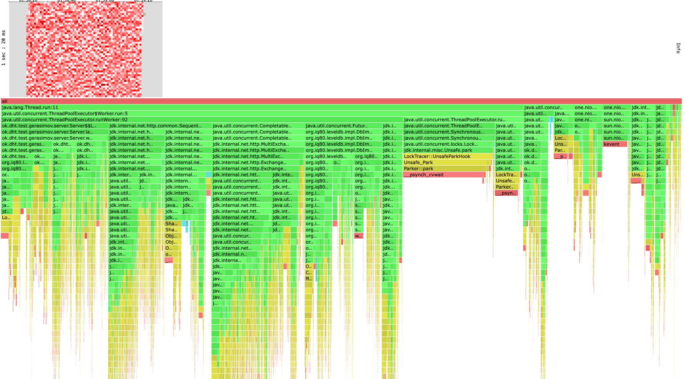

# Отчет

Сначала рассмотрю put.
Заметно быстрее стал работать сервер. Если в прошлом stage кое-как вырерживали рейт 500, то
сейчас легко держим рейт 1000. После 1000 латенси начинает ухудшаться, поэтому решил остановиться на этом числе.

По Lock'ам видно, что очень много сожрал CircuitBreakerClient хотя он у меня даже не до конца работает, что странно.
Не успел его переписать на HttpClient, потому что пришлось ввозиться с переписыванием OneNioClient. Очень сильно подводит
HttpClient, в этом плане OneNio был получше. Кажется тут можно улучшать только дефолтный джавовский клиент.

По Cpu больше всего опять тратит бд и HttpClient. Опять же логичный шаг что-то делать с HttpClient.
Хочется заметить что хитмапа стала более красная по сравнению со стейдж 4, значит меньше простоев и больше полезной нагрузки.

По alloc ситуации примерно такая же как с cpu. БД и HttpClient тратят больше всех.

```text
Running 1m test @ http://localhost:25565
  16 threads and 16 connections
  Thread calibration: mean lat.: 14.069ms, rate sampling interval: 62ms
  Thread calibration: mean lat.: 14.542ms, rate sampling interval: 67ms
  Thread calibration: mean lat.: 15.469ms, rate sampling interval: 72ms
  Thread calibration: mean lat.: 13.859ms, rate sampling interval: 63ms
  Thread calibration: mean lat.: 15.310ms, rate sampling interval: 71ms
  Thread calibration: mean lat.: 14.617ms, rate sampling interval: 66ms
  Thread calibration: mean lat.: 14.189ms, rate sampling interval: 66ms
  Thread calibration: mean lat.: 14.234ms, rate sampling interval: 65ms
  Thread calibration: mean lat.: 15.040ms, rate sampling interval: 69ms
  Thread calibration: mean lat.: 15.827ms, rate sampling interval: 73ms
  Thread calibration: mean lat.: 15.744ms, rate sampling interval: 72ms
  Thread calibration: mean lat.: 15.559ms, rate sampling interval: 72ms
  Thread calibration: mean lat.: 15.377ms, rate sampling interval: 70ms
  Thread calibration: mean lat.: 15.250ms, rate sampling interval: 70ms
  Thread calibration: mean lat.: 15.370ms, rate sampling interval: 70ms
  Thread calibration: mean lat.: 15.491ms, rate sampling interval: 71ms
  Thread Stats   Avg      Stdev     Max   +/- Stdev
    Latency    11.14ms    8.80ms  93.82ms   87.93%
    Req/Sec    62.48     11.66   136.00     80.50%
  Latency Distribution (HdrHistogram - Recorded Latency)
 50.000%    8.30ms
 75.000%   10.34ms
 90.000%   22.51ms
 99.000%   48.06ms
 99.900%   71.55ms
 99.990%   87.04ms
 99.999%   93.89ms
100.000%   93.89ms

  Detailed Percentile spectrum:
       Value   Percentile   TotalCount 1/(1-Percentile)

       1.211     0.000000            1         1.00
       5.851     0.100000         5015         1.11
       6.715     0.200000        10012         1.25
       7.295     0.300000        15028         1.43
       7.791     0.400000        20007         1.67
       8.303     0.500000        25000         2.00
       8.591     0.550000        27509         2.22
       8.903     0.600000        30019         2.50
       9.263     0.650000        32529         2.86
       9.711     0.700000        35004         3.33
      10.343     0.750000        37501         4.00
      10.815     0.775000        38761         4.44
      11.511     0.800000        40007         5.00
      12.711     0.825000        41253         5.71
      14.863     0.850000        42500         6.67
      18.655     0.875000        43750         8.00
      20.719     0.887500        44375         8.89
      22.511     0.900000        45003        10.00
      24.239     0.912500        45631        11.43
      26.207     0.925000        46254        13.33
      28.527     0.937500        46878        16.00
      29.647     0.943750        47190        17.78
      30.799     0.950000        47501        20.00
      31.999     0.956250        47816        22.86
      33.375     0.962500        48128        26.67
      35.231     0.968750        48441        32.00
      36.383     0.971875        48597        35.56
      37.887     0.975000        48751        40.00
      39.327     0.978125        48907        45.71
      40.991     0.981250        49064        53.33
      42.847     0.984375        49226        64.00
      43.839     0.985938        49298        71.11
      45.375     0.987500        49375        80.00
      47.167     0.989062        49454        91.43
      48.895     0.990625        49533       106.67
      51.583     0.992188        49610       128.00
      52.991     0.992969        49649       142.22
      53.919     0.993750        49688       160.00
      55.295     0.994531        49727       182.86
      57.119     0.995313        49766       213.33
      58.847     0.996094        49805       256.00
      59.647     0.996484        49826       284.44
      60.255     0.996875        49844       320.00
      62.015     0.997266        49864       365.71
      63.199     0.997656        49884       426.67
      64.863     0.998047        49903       512.00
      65.919     0.998242        49913       568.89
      67.519     0.998437        49922       640.00
      68.479     0.998633        49932       731.43
      70.271     0.998828        49942       853.33
      71.743     0.999023        49953      1024.00
      72.959     0.999121        49957      1137.78
      73.599     0.999219        49962      1280.00
      75.263     0.999316        49966      1462.86
      76.671     0.999414        49971      1706.67
      77.183     0.999512        49976      2048.00
      77.823     0.999561        49979      2275.56
      78.015     0.999609        49981      2560.00
      78.719     0.999658        49984      2925.71
      78.783     0.999707        49986      3413.33
      79.039     0.999756        49988      4096.00
      81.919     0.999780        49990      4551.11
      82.815     0.999805        49992      5120.00
      82.815     0.999829        49992      5851.43
      82.879     0.999854        49993      6826.67
      85.183     0.999878        49994      8192.00
      87.039     0.999890        49995      9102.22
      89.215     0.999902        49996     10240.00
      89.215     0.999915        49996     11702.86
      91.135     0.999927        49997     13653.33
      91.135     0.999939        49997     16384.00
      92.287     0.999945        49998     18204.44
      92.287     0.999951        49998     20480.00
      92.287     0.999957        49998     23405.71
      92.799     0.999963        49999     27306.67
      92.799     0.999969        49999     32768.00
      92.799     0.999973        49999     36408.89
      92.799     0.999976        49999     40960.00
      92.799     0.999979        49999     46811.43
      93.887     0.999982        50000     54613.33
      93.887     1.000000        50000          inf
#[Mean    =       11.143, StdDeviation   =        8.802]
#[Max     =       93.824, Total count    =        50000]
#[Buckets =           27, SubBuckets     =         2048]
----------------------------------------------------------
  60016 requests in 1.00m, 3.83MB read
Requests/sec:   1000.14
Transfer/sec:     65.44KB
```

# put_alloc.png


# put_cpu.png


# put_lock.png


# Get

На самом деле особой разницы я не заметил между get и put.
Претензии все такие же. 

```text
Running 1m test @ http://localhost:25565
  16 threads and 16 connections
  Thread calibration: mean lat.: 14.234ms, rate sampling interval: 41ms
  Thread calibration: mean lat.: 14.542ms, rate sampling interval: 58ms
  Thread calibration: mean lat.: 15.469ms, rate sampling interval: 72ms
  Thread calibration: mean lat.: 13.491ms, rate sampling interval: 63ms
  Thread calibration: mean lat.: 15.310ms, rate sampling interval: 36ms
  Thread calibration: mean lat.: 14.377ms, rate sampling interval: 62ms
  Thread calibration: mean lat.: 14.189ms, rate sampling interval: 66ms
  Thread calibration: mean lat.: 13.069ms, rate sampling interval: 65ms
  Thread calibration: mean lat.: 15.040ms, rate sampling interval: 45ms
  Thread calibration: mean lat.: 15.827ms, rate sampling interval: 73ms
  Thread calibration: mean lat.: 15.744ms, rate sampling interval: 42ms
  Thread calibration: mean lat.: 15.559ms, rate sampling interval: 52ms
  Thread calibration: mean lat.: 15.617ms, rate sampling interval: 70ms
  Thread calibration: mean lat.: 15.250ms, rate sampling interval: 70ms
  Thread calibration: mean lat.: 15.370ms, rate sampling interval: 70ms
  Thread calibration: mean lat.: 15.859ms, rate sampling interval: 71ms
  Thread Stats   Avg      Stdev     Max   +/- Stdev
    Latency   10.37ms    3.27ms  45.36ms    75.56%
    Req/Sec   116.76     14.13   178.00     70.85%
  Latency Distribution (HdrHistogram - Recorded Latency)
```

# put_alloc.png


# put_cpu.png


# put_lock.png
