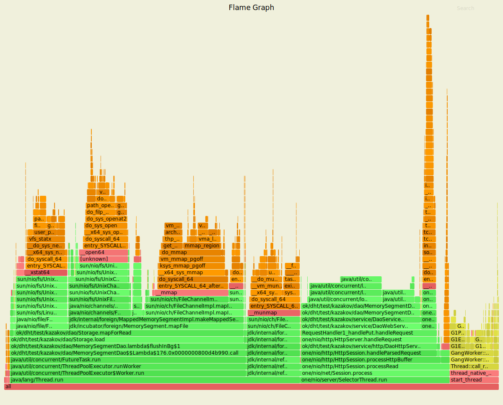
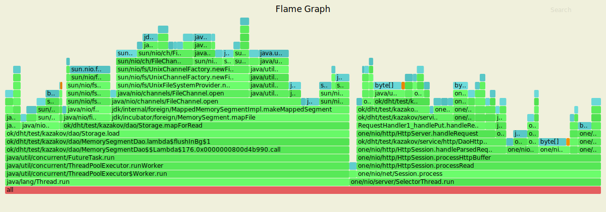
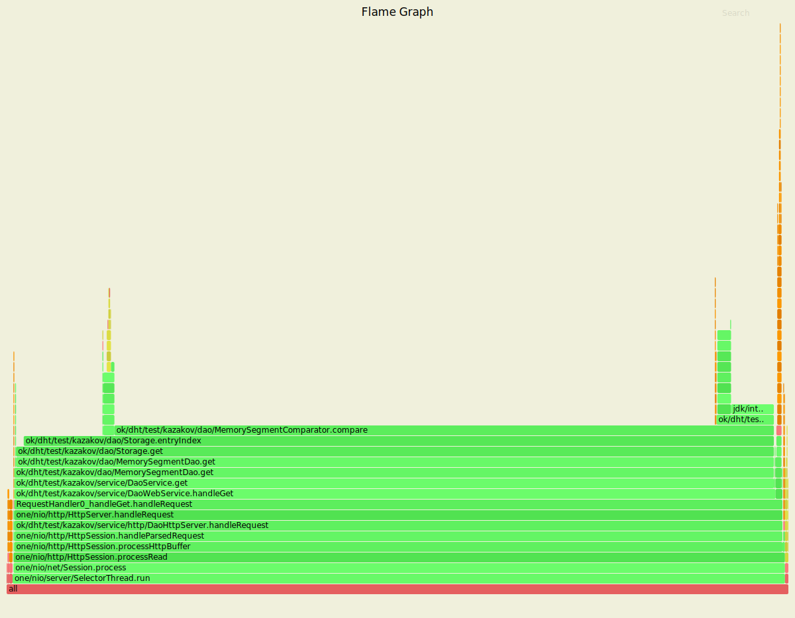
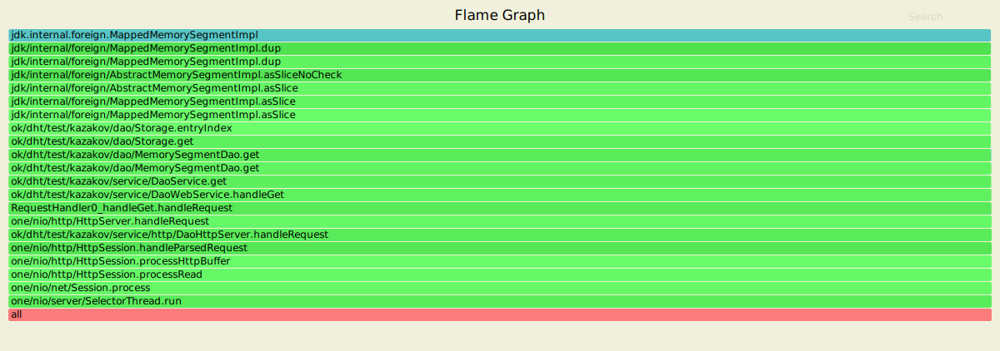

# Нагрузочное тестирование через wrk2
> Скрипты для wrk2 можно найти [здесь](./wrk2_scripts)
 
Все замеры проводились в 1 соединение и в 1 поток.

## PUT запросы

PUT запросы тестировал записью случайного идшника (длиной от 3 до 10 символов)
со случайным количеством байт (100-200 на запрос).
Сначала делал прогрев jvm на 1000 RPS, затем постепенно увеличивал и делал наблюдения.
Заметил, что на пустой базе получается хороший RPS, примерно 9-10к, CPU через top уходил в 90-100%
<details>
  <summary>Вывод wrk2 для пустой базы на 9к RPS</summary>
  <pre>
Running 10s test @ http://localhost:8080
  1 threads and 1 connections
  Thread Stats   Avg      Stdev     Max   +/- Stdev
    Latency     5.34ms    5.40ms  26.88ms   83.97%
    Req/Sec       -nan      -nan   0.00      0.00%
  Latency Distribution (HdrHistogram - Recorded Latency)
 50.000%    3.38ms
 75.000%    7.68ms
 90.000%   13.61ms
 99.000%   24.00ms
 99.900%   26.58ms
 99.990%   26.85ms
 99.999%   26.86ms
100.000%   26.90ms

  Detailed Percentile spectrum:
   Value   Percentile   TotalCount 1/(1-Percentile)
   0.065     0.000000            1         1.00
   0.635     0.100000         9017         1.11
   1.069     0.200000        18009         1.25
   1.600     0.300000        27008         1.43
   2.317     0.400000        36012         1.67
   3.385     0.500000        45012         2.00
   3.979     0.550000        49503         2.22
   4.635     0.600000        54012         2.50
   5.427     0.650000        58526         2.86
   6.403     0.700000        63002         3.33
   7.683     0.750000        67499         4.00
   8.343     0.775000        69755         4.44
   9.079     0.800000        71996         5.00
  10.079     0.825000        74262         5.71
  11.175     0.850000        76498         6.67
  12.319     0.875000        78747         8.00
  12.951     0.887500        79871         8.89
  13.607     0.900000        80999        10.00
  14.183     0.912500        82133        11.43
  14.783     0.925000        83252        13.33
  15.431     0.937500        84373        16.00
  15.815     0.943750        84939        17.78
  16.303     0.950000        85505        20.00
  16.927     0.956250        86059        22.86
  17.631     0.962500        86630        26.67
  18.783     0.968750        87184        32.00
  19.695     0.971875        87477        35.56
  20.511     0.975000        87747        40.00
  21.215     0.978125        88029        45.71
  21.807     0.981250        88313        53.33
  22.527     0.984375        88590        64.00
  23.055     0.985938        88730        71.11
  23.519     0.987500        88877        80.00
  23.775     0.989062        89014        91.43
  24.095     0.990625        89152       106.67
  24.351     0.992188        89291       128.00
  24.543     0.992969        89366       142.22
  24.703     0.993750        89437       160.00
  24.831     0.994531        89506       182.86
  25.055     0.995313        89573       213.33
  25.407     0.996094        89644       256.00
  25.599     0.996484        89681       284.44
  25.759     0.996875        89714       320.00
  25.935     0.997266        89749       365.71
  26.111     0.997656        89784       426.67
  26.239     0.998047        89821       512.00
  26.319     0.998242        89837       568.89
  26.399     0.998437        89859       640.00
  26.447     0.998633        89873       731.43
  26.527     0.998828        89890       853.33
  26.591     0.999023        89907      1024.00
  26.655     0.999121        89919      1137.78
  26.671     0.999219        89924      1280.00
  26.719     0.999316        89933      1462.86
  26.751     0.999414        89944      1706.67
  26.783     0.999512        89958      2048.00
  26.783     0.999561        89958      2275.56
  26.799     0.999609        89964      2560.00
  26.799     0.999658        89964      2925.71
  26.815     0.999707        89972      3413.33
  26.831     0.999756        89980      4096.00
  26.831     0.999780        89980      4551.11
  26.831     0.999805        89980      5120.00
  26.831     0.999829        89980      5851.43
  26.847     0.999854        89991      6826.67
  26.847     0.999878        89991      8192.00
  26.847     0.999890        89991      9102.22
  26.847     0.999902        89991     10240.00
  26.847     0.999915        89991     11702.86
  26.847     0.999927        89991     13653.33
  26.847     0.999939        89991     16384.00
  26.847     0.999945        89991     18204.44
  26.847     0.999951        89991     20480.00
  26.847     0.999957        89991     23405.71
  26.847     0.999963        89991     27306.67
  26.863     0.999969        89993     32768.00
  26.863     0.999973        89993     36408.89
  26.863     0.999976        89993     40960.00
  26.863     0.999979        89993     46811.43
  26.863     0.999982        89993     54613.33
  26.863     0.999985        89993     65536.00
  26.863     0.999986        89993     72817.78
  26.863     0.999988        89993     81920.00
  26.895     0.999989        89994     93622.86
  26.895     1.000000        89994          inf
#[Mean    =        5.343, StdDeviation   =        5.397]
#[Max     =       26.880, Total count    =        89994]
#[Buckets =           27, SubBuckets     =         2048]
----------------------------------------------------------
  89995 requests in 10.00s, 5.75MB read
Requests/sec:   8999.84
Transfer/sec:    588.86KB
</pre>
</details>

Далее попрофилировал и смотрел, как падает стабильный RPS с ростом базы.
Заметил, что при сильной нагрузке ```flush()``` падает с ```TooManyFlushesInBgException```.
Сначала решил увеличить размер SSTable, которая сбрасывается на диск, но большого прироста это не давало.
В итоге, решил поменять падение базы на долгий ответ, поэтому вместо ошибки делаю активное ожидание,
пока предыдущий ```flush()``` закончится.
Когда база начала занимать больше места, чем есть в памяти (128 МБ по инструкции -Xmx),
стабильно достигалось 3500-4000 RPS, CPU через top показывало 150-170%

<details>
<summary>Вывод wrk2 для заполненной базы на 4к RPS</summary>
<pre>
Running 10s test @ http://localhost:8080
  1 threads and 1 connections
  Thread Stats   Avg      Stdev     Max   +/- Stdev
    Latency    87.19ms  115.10ms 423.17ms   80.35%
    Req/Sec       -nan      -nan   0.00      0.00%
  Latency Distribution (HdrHistogram - Recorded Latency)
 50.000%   28.50ms
 75.000%  132.22ms
 90.000%  287.23ms
 99.000%  405.25ms
 99.900%  419.33ms
 99.990%  422.91ms
 99.999%  423.42ms
100.000%  423.42ms

 Detailed Percentile spectrum:
   Value   Percentile   TotalCount 1/(1-Percentile)
   0.082     0.000000            3         1.00
   0.490     0.100000         3924         1.11
   0.835     0.200000         7842         1.25
   1.130     0.300000        11761         1.43
   1.960     0.400000        15678         1.67
  28.495     0.500000        19597         2.00
  49.247     0.550000        21559         2.22
  65.503     0.600000        23516         2.50
  83.647     0.650000        25483         2.86
 102.591     0.700000        27441         3.33
 132.223     0.750000        29395         4.00
 168.703     0.775000        30377         4.44
 199.935     0.800000        31357         5.00
 219.647     0.825000        32337         5.71
 241.663     0.850000        33317         6.67
 265.215     0.875000        34299         8.00
 275.455     0.887500        34792         8.89
 287.231     0.900000        35276        10.00
 296.703     0.912500        35769        11.43
 304.639     0.925000        36257        13.33
 312.319     0.937500        36756        16.00
 316.159     0.943750        36989        17.78
 322.047     0.950000        37235        20.00
 339.967     0.956250        37479        22.86
 361.471     0.962500        37723        26.67
 373.247     0.968750        37969        32.00
 381.695     0.971875        38091        35.56
 386.303     0.975000        38221        40.00
 391.423     0.978125        38338        45.71
 395.007     0.981250        38459        53.33
 398.591     0.984375        38583        64.00
 400.383     0.985938        38647        71.11
 402.175     0.987500        38703        80.00
 404.223     0.989062        38772        91.43
 406.015     0.990625        38832       106.67
 407.807     0.992188        38890       128.00
 408.575     0.992969        38920       142.22
 409.343     0.993750        38948       160.00
 410.367     0.994531        38978       182.86
 411.647     0.995313        39011       213.33
 412.671     0.996094        39044       256.00
 413.183     0.996484        39058       284.44
 414.207     0.996875        39073       320.00
 414.975     0.997266        39087       365.71
 415.999     0.997656        39103       426.67
 416.767     0.998047        39116       512.00
 417.279     0.998242        39124       568.89
 417.791     0.998437        39132       640.00
 418.303     0.998633        39140       731.43
 418.815     0.998828        39147       853.33
 419.327     0.999023        39156      1024.00
 419.583     0.999121        39160      1137.78
 419.839     0.999219        39165      1280.00
 420.095     0.999316        39168      1462.86
 420.351     0.999414        39171      1706.67
 420.607     0.999512        39173      2048.00
 421.119     0.999561        39176      2275.56
 421.375     0.999609        39178      2560.00
 421.631     0.999658        39180      2925.71
 421.887     0.999707        39181      3413.33
 422.143     0.999756        39183      4096.00
 422.399     0.999780        39185      4551.11
 422.399     0.999805        39185      5120.00
 422.655     0.999829        39186      5851.43
 422.911     0.999854        39188      6826.67
 422.911     0.999878        39188      8192.00
 422.911     0.999890        39188      9102.22
 423.167     0.999902        39190     10240.00
 423.167     0.999915        39190     11702.86
 423.167     0.999927        39190     13653.33
 423.167     0.999939        39190     16384.00
 423.167     0.999945        39190     18204.44
 423.423     0.999951        39192     20480.00
 423.423     1.000000        39192          inf
#[Mean    =       87.190, StdDeviation   =      115.099]
#[Max     =      423.168, Total count    =        39192]
#[Buckets =           27, SubBuckets     =         2048]
----------------------------------------------------------
  39193 requests in 10.00s, 2.50MB read
Requests/sec:   3918.72
Transfer/sec:    256.40KB
</pre>
</details>

Заметим, что медиана по времени - 28.5мс, что довольно быстро.
Тем не менее, пользовательский опыт нужно измерять большими перцентилями (90-99),
так как пользователю неудобно ждать долго (хоть это и единственный пользователь).
Поэтому, 4000 RPS - уже предел, так как latency доходит до 400мс.

## GET запросы

GET запросы тоже прогревались перед тестированием.
База наполнялась случайными байтовыми строками длины от 100 до 200,
идшники представляли из себя число от 0 до 1'500'000.
Запросы держали значительно меньший RPS, чем PUT.
Стабильную работу сервер показывал на 200 RPS GET запросов.

<details>
<summary>Вывод wrk2 для GET запросов на 200 RPS</summary>
<pre>
Running 10s test @ http://localhost:8080
  1 threads and 1 connections
  Thread Stats   Avg      Stdev     Max   +/- Stdev
    Latency    16.53ms   10.58ms  54.56ms   72.22%
    Req/Sec       -nan      -nan   0.00      0.00%
  Latency Distribution (HdrHistogram - Recorded Latency)
 50.000%   14.07ms
 75.000%   21.76ms
 90.000%   31.97ms
 99.000%   47.74ms
 99.900%   53.28ms
 99.990%   54.59ms
 99.999%   54.59ms
100.000%   54.59ms

 Detailed Percentile spectrum:
   Value   Percentile   TotalCount 1/(1-Percentile)
   0.452     0.000000            1         1.00
   5.351     0.100000          200         1.11
   7.875     0.200000          400         1.25
   9.631     0.300000          600         1.43
  11.719     0.400000          800         1.67
  14.071     0.500000          999         2.00
  15.479     0.550000         1100         2.22
  17.023     0.600000         1199         2.50
  18.431     0.650000         1299         2.86
  20.127     0.700000         1399         3.33
  21.759     0.750000         1499         4.00
  23.039     0.775000         1550         4.44
  24.239     0.800000         1599         5.00
  25.711     0.825000         1650         5.71
  27.295     0.850000         1699         6.67
  29.503     0.875000         1749         8.00
  30.943     0.887500         1774         8.89
  31.983     0.900000         1799        10.00
  33.183     0.912500         1824        11.43
  34.495     0.925000         1849        13.33
  36.927     0.937500         1874        16.00
  37.823     0.943750         1886        17.78
  39.199     0.950000         1899        20.00
  40.095     0.956250         1911        22.86
  41.055     0.962500         1924        26.67
  42.207     0.968750         1936        32.00
  42.783     0.971875         1942        35.56
  43.391     0.975000         1949        40.00
  44.031     0.978125         1955        45.71
  45.119     0.981250         1961        53.33
  46.111     0.984375         1967        64.00
  46.335     0.985938         1970        71.11
  47.231     0.987500         1974        80.00
  47.583     0.989062         1977        91.43
  47.935     0.990625         1980       106.67
  49.375     0.992188         1983       128.00
  49.503     0.992969         1984       142.22
  49.759     0.993750         1986       160.00
  50.111     0.994531         1988       182.86
  50.143     0.995313         1989       213.33
  50.335     0.996094         1992       256.00
  50.335     0.996484         1992       284.44
  50.335     0.996875         1992       320.00
  51.263     0.997266         1993       365.71
  51.743     0.997656         1994       426.67
  51.903     0.998047         1995       512.00
  51.903     0.998242         1995       568.89
  51.903     0.998437         1995       640.00
  53.279     0.998633         1996       731.43
  53.279     0.998828         1996       853.33
  53.375     0.999023         1997      1024.00
  53.375     0.999121         1997      1137.78
  53.375     0.999219         1997      1280.00
  53.375     0.999316         1997      1462.86
  53.375     0.999414         1997      1706.67
  54.591     0.999512         1998      2048.00
  54.591     1.000000         1998          inf
#[Mean    =       16.531, StdDeviation   =       10.576]
#[Max     =       54.560, Total count    =         1998]
#[Buckets =           27, SubBuckets     =         2048]
----------------------------------------------------------
  1999 requests in 10.00s, 121.03KB read
Requests/sec:    199.81
Transfer/sec:     12.10KB
</pre>
</details>

Интересно, что некоторые запросы исполнялись меньше, чем за миллисекунду.
Скорее всего, это значит, что запрос попал в кэш операционной системы и не пошел на диск.

К сожалению, на 300 RPS, сервер уже задыхался.

<details>
<summary>Вывод wrk2 для GET запросов на 300 RPS</summary>
<pre>
Running 10s test @ http://localhost:8080
  1 threads and 1 connections
  Thread Stats   Avg      Stdev     Max   +/- Stdev
    Latency     1.43s   787.24ms   2.72s    57.71%
    Req/Sec       -nan      -nan   0.00      0.00%
  Latency Distribution (HdrHistogram - Recorded Latency)
 50.000%    1.35s 
 75.000%    2.12s 
 90.000%    2.55s 
 99.000%    2.71s 
 99.900%    2.72s 
 99.990%    2.72s 
 99.999%    2.72s 
100.000%    2.72s 

  Detailed Percentile spectrum:
   Value   Percentile   TotalCount 1/(1-Percentile)
   1.714     0.000000            1         1.00
 340.991     0.100000          219         1.11
 644.095     0.200000          437         1.25
 914.943     0.300000          657         1.43
1137.663     0.400000          874         1.67
1353.727     0.500000         1094         2.00
1524.735     0.550000         1203         2.22
1680.383     0.600000         1311         2.50
1832.959     0.650000         1421         2.86
1981.439     0.700000         1530         3.33
2117.631     0.750000         1639         4.00
2209.791     0.775000         1694         4.44
2283.519     0.800000         1749         5.00
2357.247     0.825000         1803         5.71
2430.975     0.850000         1858         6.67
2494.463     0.875000         1915         8.00
2529.279     0.887500         1940         8.89
2551.807     0.900000         1970        10.00
2574.335     0.912500         1994        11.43
2603.007     0.925000         2022        13.33
2625.535     0.937500         2050        16.00
2631.679     0.943750         2071        17.78
2633.727     0.950000         2079        20.00
2641.919     0.956250         2090        22.86
2662.399     0.962500         2104        26.67
2674.687     0.968750         2119        32.00
2678.783     0.971875         2124        35.56
2695.167     0.975000         2131        40.00
2701.311     0.978125         2139        45.71
2705.407     0.981250         2146        53.33
2707.455     0.984375         2154        64.00
2709.503     0.985938         2160        71.11
2709.503     0.987500         2160        80.00
2711.551     0.989062         2163        91.43
2713.599     0.990625         2167       106.67
2715.647     0.992188         2171       128.00
2715.647     0.992969         2171       142.22
2717.695     0.993750         2177       160.00
2717.695     0.994531         2177       182.86
2717.695     0.995313         2177       213.33
2717.695     0.996094         2177       256.00
2719.743     0.996484         2184       284.44
2719.743     0.996875         2184       320.00
2719.743     0.997266         2184       365.71
2719.743     0.997656         2184       426.67
2719.743     0.998047         2184       512.00
2719.743     0.998242         2184       568.89
2719.743     0.998437         2184       640.00
2719.743     0.998633         2184       731.43
2719.743     0.998828         2184       853.33
2719.743     0.999023         2184      1024.00
2719.743     0.999121         2184      1137.78
2719.743     0.999219         2184      1280.00
2719.743     0.999316         2184      1462.86
2719.743     0.999414         2184      1706.67
2719.743     0.999512         2184      2048.00
2721.791     0.999561         2185      2275.56
2721.791     1.000000         2185          inf
#[Mean    =     1429.381, StdDeviation   =      787.239]
#[Max     =     2719.744, Total count    =         2185]
#[Buckets =           27, SubBuckets     =         2048]
----------------------------------------------------------
  2186 requests in 10.00s, 132.36KB read
Requests/sec:    218.52
Transfer/sec:     13.23KB
</pre>
</details>

Полагаю, что запросы на чтение настолько хуже, чем на запись, потому что
запись часто идет в оперативную память и сбрасывается в фоне.
Чтение же идет на диск (так как идшник случайный, попадание в кэш очень редко).

# Профилирование через async-profiler
> HTML файлы, выведенные async-profiler'ом можно найти [здесь](./profiler_output)

Все тесты проводились при стабильной нагрузке с параметрами из прошлых результатов.

## PUT запросы

### CPU profiling

<details>
<summary>Flame graph</summary>

</details>

Видно, что очень тяжелым получился ```flush()```.
На FlameGraph'е видно, что bottleneck-ом является ```Storage.load()```.
Оптимизировать это понятно как: можно при перезагрузке смотреть на те данные,
которые уже загружены в память, а читать с диска только новые.

При upsert'е большая часть сэмплов попала на ```flushInBg```.
Там все упирается в лок.
Как можно оптимизировать: можно попробовать сделать параллельный flush нескольких SSTable, если получится.

### Alloc profiling

<details>
<summary>Flame graph</summary>

</details>

На Alloc видим все тот же ```Storage.load```. 
Для upsert видим, что довольно много сэмплов попало на ```Request.getPath()```
(пишется в логи) - можно поставить ```if log level is trace```, чтобы не замедляло прод.

В самом upsert видим ```DaoService.toMemorySegment()``` - можно аккуратнее брать ```MemorySegment```,
например, сразу ```MemorySegment.ofArray(Utf8.toBytes(string))```.
Это будет работать, так как ```Utf8.toBytes``` аллоцирует новый массив,
а не берет подкапотный массив строки.
Но, к сожалению, это поведение не задокументировано,
поэтому я принял решение проиграть по производительности в пользу надежности решения.

## GET запросы

### CPU profiling

<details>
<summary>Flame graph</summary>

</details>

На графе видно, что существенная часть семплов попала на ```MemorySegmentComparator.compare```.
Как его оптимизировать - непонятно, код там довольно прямолинейный.
Красным покрашен ```sendResponse``` - тоже вряд ли соптимизируем, верим, что ```one-nio``` хорошо написан

### Alloc profiling

<details>
<summary>Flame graph</summary>

</details>

На графе видно, что аллоцируется только ```MappedMemorySegment```.
Можно попробовать это соптимизировать, но это не bottleneck, как видно из профилирования по CPU.
Так что ради чистоты кода, это лучше оставить.
