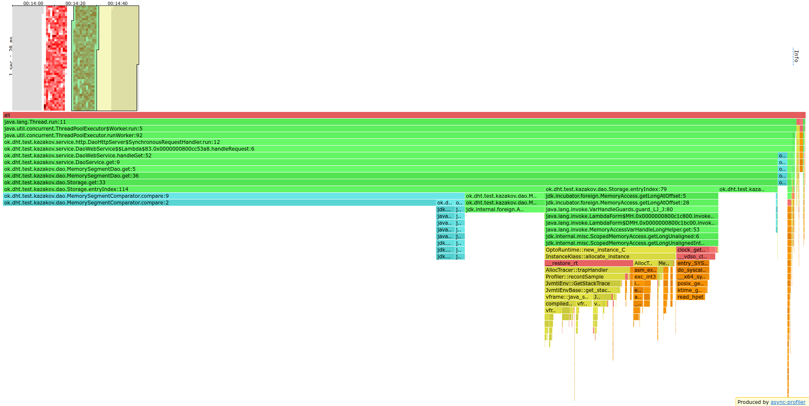
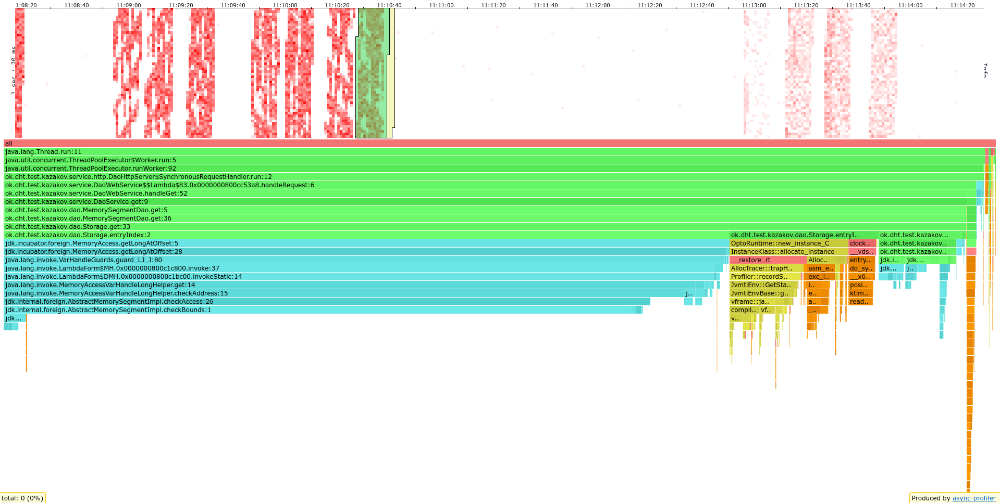
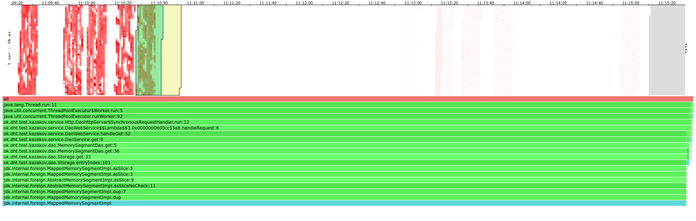
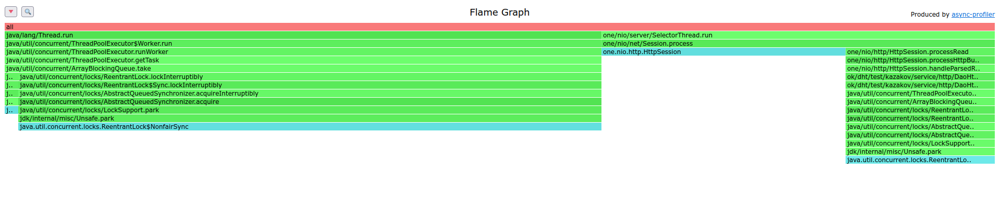
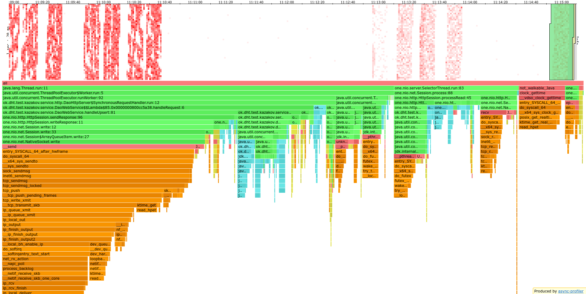
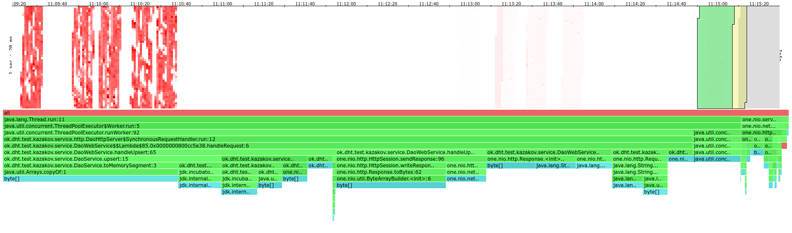
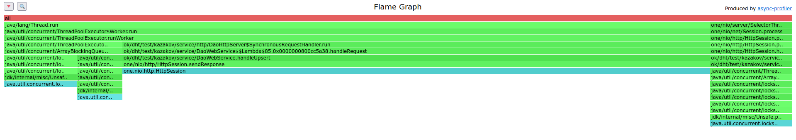

# Нагрузочное тестирование через wrk2
> Скрипты для wrk2 можно найти [здесь](../stage1/wrk2_scripts)

## Сравнение политик отбрасывания запросов при сильной нагрузке

Для сравнения поставил пул на 32 треда, capacity для очереди поставил равным 32.
Стреляю в 64 потока и 64 соединения пут запросами с рейтом 15'000 RPS.

Вывод wrk2 для <code>AbortPolicy</code>

<pre>
Running 10s test @ http://localhost:8080
  64 threads and 64 connections
  Thread Stats   Avg      Stdev     Max   +/- Stdev
    Latency     1.50ms    3.44ms  76.67ms   96.26%
    Req/Sec       -nan      -nan   0.00      0.00%
  Latency Distribution (HdrHistogram - Recorded Latency)
 50.000%    0.94ms
 75.000%    1.22ms
 90.000%    1.85ms
 99.000%   17.44ms
 99.900%   50.37ms
 99.990%   70.65ms
 99.999%   76.35ms
100.000%   76.74ms

  Detailed Percentile spectrum:
       Value   Percentile   TotalCount 1/(1-Percentile)

       0.106     0.000000            1         1.00
       0.423     0.100000        14984         1.11
       0.567     0.200000        30048         1.25
       0.695     0.300000        44979         1.43
       0.818     0.400000        59975         1.67
       0.935     0.500000        74885         2.00
       0.992     0.550000        82376         2.22
       1.048     0.600000        89915         2.50
       1.103     0.650000        97433         2.86
       1.156     0.700000       104812         3.33
       1.215     0.750000       112390         4.00
       1.250     0.775000       116067         4.44
       1.295     0.800000       119768         5.00
       1.356     0.825000       123510         5.71
       1.447     0.850000       127277         6.67
       1.593     0.875000       131026         8.00
       1.704     0.887500       132865         8.89
       1.851     0.900000       134737        10.00
       2.055     0.912500       136608        11.43
       2.351     0.925000       138486        13.33
       2.819     0.937500       140352        16.00
       3.139     0.943750       141288        17.78
       3.531     0.950000       142223        20.00
       4.131     0.956250       143158        22.86
       4.935     0.962500       144095        26.67
       5.915     0.968750       145031        32.00
       6.559     0.971875       145497        35.56
       7.495     0.975000       145964        40.00
       8.703     0.978125       146432        45.71
      10.295     0.981250       146900        53.33
      12.239     0.984375       147367        64.00
      13.511     0.985938       147601        71.11
      15.079     0.987500       147836        80.00
      16.559     0.989062       148072        91.43
      18.111     0.990625       148303       106.67
      19.663     0.992188       148537       128.00
      20.575     0.992969       148655       142.22
      21.551     0.993750       148771       160.00
      22.671     0.994531       148888       182.86
      24.239     0.995313       149005       213.33
      27.087     0.996094       149122       256.00
      28.847     0.996484       149180       284.44
      30.335     0.996875       149239       320.00
      31.871     0.997266       149297       365.71
      34.079     0.997656       149357       426.67
      38.303     0.998047       149414       512.00
      40.959     0.998242       149443       568.89
      43.871     0.998437       149473       640.00
      45.983     0.998633       149503       731.43
      48.063     0.998828       149531       853.33
      50.719     0.999023       149560      1024.00
      51.647     0.999121       149576      1137.78
      52.511     0.999219       149590      1280.00
      53.567     0.999316       149604      1462.86
      54.975     0.999414       149619      1706.67
      57.343     0.999512       149633      2048.00
      58.879     0.999561       149641      2275.56
      60.287     0.999609       149648      2560.00
      61.727     0.999658       149655      2925.71
      64.575     0.999707       149664      3413.33
      65.119     0.999756       149670      4096.00
      66.623     0.999780       149674      4551.11
      67.007     0.999805       149677      5120.00
      68.031     0.999829       149682      5851.43
      69.247     0.999854       149685      6826.67
      69.503     0.999878       149688      8192.00
      70.079     0.999890       149690      9102.22
      70.719     0.999902       149693     10240.00
      70.975     0.999915       149694     11702.86
      71.743     0.999927       149696     13653.33
      71.871     0.999939       149697     16384.00
      71.935     0.999945       149698     18204.44
      71.999     0.999951       149699     20480.00
      72.511     0.999957       149700     23405.71
      72.639     0.999963       149701     27306.67
      72.767     0.999969       149702     32768.00
      72.767     0.999973       149702     36408.89
      73.535     0.999976       149703     40960.00
      73.535     0.999979       149703     46811.43
      75.711     0.999982       149704     54613.33
      75.711     0.999985       149704     65536.00
      75.711     0.999986       149704     72817.78
      76.351     0.999988       149705     81920.00
      76.351     0.999989       149705     93622.86
      76.351     0.999991       149705    109226.67
      76.351     0.999992       149705    131072.00
      76.351     0.999993       149705    145635.56
      76.735     0.999994       149706    163840.00
      76.735     1.000000       149706          inf
#[Mean    =        1.504, StdDeviation   =        3.438]
#[Max     =       76.672, Total count    =       149706]
#[Buckets =           27, SubBuckets     =         2048]
----------------------------------------------------------
  149770 requests in 9.95s, 9.59MB read
  Non-2xx or 3xx responses: 465
Requests/sec:  15048.78
Transfer/sec:      0.96MB
</pre>

Вывод wrk2 для <code>DiscardOldestRejectionPolicy</code>

<pre>
Running 10s test @ http://localhost:8080
  64 threads and 64 connections
  Thread Stats   Avg      Stdev     Max   +/- Stdev
    Latency     1.56ms    2.73ms  64.99ms   94.74%
    Req/Sec       -nan      -nan   0.00      0.00%
  Latency Distribution (HdrHistogram - Recorded Latency)
 50.000%    0.99ms
 75.000%    1.31ms
 90.000%    2.29ms
 99.000%   16.20ms
 99.900%   29.68ms
 99.990%   47.78ms
 99.999%   63.71ms
100.000%   65.02ms

  Detailed Percentile spectrum:
       Value   Percentile   TotalCount 1/(1-Percentile)

       0.138     0.000000            1         1.00
       0.455     0.100000        15050         1.11
       0.604     0.200000        29925         1.25
       0.739     0.300000        44947         1.43
       0.866     0.400000        59896         1.67
       0.985     0.500000        74769         2.00
       1.045     0.550000        82338         2.22
       1.104     0.600000        89819         2.50
       1.162     0.650000        97294         2.86
       1.224     0.700000       104684         3.33
       1.312     0.750000       112173         4.00
       1.374     0.775000       115919         4.44
       1.451     0.800000       119645         5.00
       1.559     0.825000       123387         5.71
       1.708     0.850000       127112         6.67
       1.930     0.875000       130852         8.00
       2.087     0.887500       132731         8.89
       2.293     0.900000       134584        10.00
       2.573     0.912500       136452        11.43
       2.961     0.925000       138318        13.33
       3.571     0.937500       140192        16.00
       3.993     0.943750       141123        17.78
       4.511     0.950000       142057        20.00
       5.111     0.956250       142991        22.86
       5.923     0.962500       143925        26.67
       7.031     0.968750       144863        32.00
       7.711     0.971875       145330        35.56
       8.511     0.975000       145798        40.00
       9.463     0.978125       146261        45.71
      10.719     0.981250       146728        53.33
      12.271     0.984375       147195        64.00
      13.255     0.985938       147429        71.11
      14.367     0.987500       147662        80.00
      15.463     0.989062       147897        91.43
      16.767     0.990625       148132       106.67
      17.903     0.992188       148365       128.00
      18.495     0.992969       148480       142.22
      19.151     0.993750       148601       160.00
      19.903     0.994531       148717       182.86
      20.735     0.995313       148831       213.33
      21.615     0.996094       148949       256.00
      22.367     0.996484       149006       284.44
      22.991     0.996875       149066       320.00
      23.855     0.997266       149123       365.71
      24.783     0.997656       149183       426.67
      25.919     0.998047       149239       512.00
      26.527     0.998242       149269       568.89
      27.359     0.998437       149298       640.00
      28.127     0.998633       149327       731.43
      29.023     0.998828       149356       853.33
      29.759     0.999023       149385      1024.00
      30.383     0.999121       149400      1137.78
      30.927     0.999219       149415      1280.00
      31.567     0.999316       149429      1462.86
      32.607     0.999414       149444      1706.67
      33.055     0.999512       149459      2048.00
      33.663     0.999561       149466      2275.56
      34.271     0.999609       149475      2560.00
      34.527     0.999658       149480      2925.71
      35.071     0.999707       149488      3413.33
      36.351     0.999756       149495      4096.00
      38.047     0.999780       149499      4551.11
      39.455     0.999805       149502      5120.00
      41.663     0.999829       149506      5851.43
      44.255     0.999854       149510      6826.67
      46.527     0.999878       149513      8192.00
      46.975     0.999890       149515      9102.22
      48.031     0.999902       149517     10240.00
      50.655     0.999915       149519     11702.86
      52.767     0.999927       149521     13653.33
      53.375     0.999939       149522     16384.00
      55.071     0.999945       149524     18204.44
      55.071     0.999951       149524     20480.00
      57.471     0.999957       149525     23405.71
      59.103     0.999963       149526     27306.67
      61.119     0.999969       149527     32768.00
      61.119     0.999973       149527     36408.89
      62.687     0.999976       149528     40960.00
      62.687     0.999979       149528     46811.43
      63.583     0.999982       149529     54613.33
      63.583     0.999985       149529     65536.00
      63.583     0.999986       149529     72817.78
      63.711     0.999988       149530     81920.00
      63.711     0.999989       149530     93622.86
      63.711     0.999991       149530    109226.67
      63.711     0.999992       149530    131072.00
      63.711     0.999993       149530    145635.56
      65.023     0.999994       149531    163840.00
      65.023     1.000000       149531          inf
#[Mean    =        1.563, StdDeviation   =        2.729]
#[Max     =       64.992, Total count    =       149531]
#[Buckets =           27, SubBuckets     =         2048]
----------------------------------------------------------
  149595 requests in 9.96s, 9.58MB read
  Non-2xx or 3xx responses: 482
Requests/sec:  15012.81
Transfer/sec:      0.96MB
</pre>

Как видно, результаты почти не отличаются, поэтому был выбран <code>DiscardOldestRejectionPolicy</code>,
так как юзер скорее всего не будет ждать долго ответа и запрос уже проигнорирован.

## Оптимизация GET запросов путем увеличения порога сброса данных на диск

Подбором чиселок и анализом вывода wrk2, установил,
что хорошее количество тредов для моего компьютера равно 64.

При анализе GET запросов, заметил, что сильно лучше от распараллеливания ему не стало.

Вывод wrk2 с рейтом 300 в 64 потока на неоптимизированном GET'е

<pre>
Running 10s test @ http://localhost:8080
  64 threads and 64 connections
  Thread calibration: mean lat.: 39.056ms, rate sampling interval: 183ms
  Thread calibration: mean lat.: 34.039ms, rate sampling interval: 149ms
  Thread calibration: mean lat.: 38.213ms, rate sampling interval: 123ms
  Thread calibration: mean lat.: 53.666ms, rate sampling interval: 237ms
  Thread calibration: mean lat.: 39.806ms, rate sampling interval: 115ms
  Thread calibration: mean lat.: 47.127ms, rate sampling interval: 185ms
  Thread calibration: mean lat.: 47.093ms, rate sampling interval: 167ms
  Thread calibration: mean lat.: 55.250ms, rate sampling interval: 289ms
  Thread calibration: mean lat.: 44.553ms, rate sampling interval: 184ms
  Thread calibration: mean lat.: 51.441ms, rate sampling interval: 260ms
  Thread calibration: mean lat.: 47.314ms, rate sampling interval: 174ms
  Thread calibration: mean lat.: 56.926ms, rate sampling interval: 278ms
  Thread calibration: mean lat.: 53.333ms, rate sampling interval: 233ms
  Thread calibration: mean lat.: 51.438ms, rate sampling interval: 236ms
  Thread calibration: mean lat.: 57.606ms, rate sampling interval: 283ms
  Thread calibration: mean lat.: 60.639ms, rate sampling interval: 300ms
  Thread calibration: mean lat.: 52.685ms, rate sampling interval: 256ms
  Thread calibration: mean lat.: 54.598ms, rate sampling interval: 239ms
  Thread calibration: mean lat.: 45.915ms, rate sampling interval: 141ms
  Thread calibration: mean lat.: 45.834ms, rate sampling interval: 219ms
  Thread calibration: mean lat.: 51.388ms, rate sampling interval: 285ms
  Thread calibration: mean lat.: 38.997ms, rate sampling interval: 135ms
  Thread calibration: mean lat.: 55.125ms, rate sampling interval: 299ms
  Thread calibration: mean lat.: 49.870ms, rate sampling interval: 283ms
  Thread calibration: mean lat.: 52.933ms, rate sampling interval: 229ms
  Thread calibration: mean lat.: 50.783ms, rate sampling interval: 261ms
  Thread calibration: mean lat.: 52.735ms, rate sampling interval: 222ms
  Thread calibration: mean lat.: 55.618ms, rate sampling interval: 247ms
  Thread calibration: mean lat.: 58.621ms, rate sampling interval: 234ms
  Thread calibration: mean lat.: 61.559ms, rate sampling interval: 237ms
  Thread calibration: mean lat.: 56.368ms, rate sampling interval: 247ms
  Thread calibration: mean lat.: 61.874ms, rate sampling interval: 226ms
  Thread calibration: mean lat.: 58.354ms, rate sampling interval: 206ms
  Thread calibration: mean lat.: 54.084ms, rate sampling interval: 237ms
  Thread calibration: mean lat.: 62.102ms, rate sampling interval: 242ms
  Thread calibration: mean lat.: 60.880ms, rate sampling interval: 222ms
  Thread calibration: mean lat.: 64.373ms, rate sampling interval: 250ms
  Thread calibration: mean lat.: 65.961ms, rate sampling interval: 241ms
  Thread calibration: mean lat.: 53.293ms, rate sampling interval: 196ms
  Thread calibration: mean lat.: 53.847ms, rate sampling interval: 194ms
  Thread calibration: mean lat.: 50.133ms, rate sampling interval: 181ms
  Thread calibration: mean lat.: 52.069ms, rate sampling interval: 201ms
  Thread calibration: mean lat.: 48.796ms, rate sampling interval: 189ms
  Thread calibration: mean lat.: 54.370ms, rate sampling interval: 196ms
  Thread calibration: mean lat.: 54.311ms, rate sampling interval: 187ms
  Thread calibration: mean lat.: 50.954ms, rate sampling interval: 162ms
  Thread calibration: mean lat.: 56.333ms, rate sampling interval: 191ms
  Thread calibration: mean lat.: 51.205ms, rate sampling interval: 175ms
  Thread calibration: mean lat.: 49.469ms, rate sampling interval: 174ms
  Thread calibration: mean lat.: 46.183ms, rate sampling interval: 170ms
  Thread calibration: mean lat.: 52.338ms, rate sampling interval: 175ms
  Thread calibration: mean lat.: 55.495ms, rate sampling interval: 194ms
  Thread calibration: mean lat.: 25.815ms, rate sampling interval: 97ms
  Thread Stats   Avg      Stdev     Max   +/- Stdev
    Latency    49.69ms   45.78ms 299.78ms   83.99%
    Req/Sec       -nan      -nan   0.00      0.00%
  Latency Distribution (HdrHistogram - Recorded Latency)
 50.000%   33.06ms
 75.000%   75.52ms
 90.000%  112.57ms
 99.000%  197.38ms
 99.900%  248.06ms
 99.990%  300.03ms
 99.999%  300.03ms
100.000%  300.03ms

  Detailed Percentile spectrum:
       Value   Percentile   TotalCount 1/(1-Percentile)

       4.295     0.000000            1         1.00
       7.747     0.100000           51         1.11
      10.999     0.200000          102         1.25
      14.591     0.300000          152         1.43
      21.103     0.400000          203         1.67
      33.055     0.500000          253         2.00
      40.799     0.550000          279         2.22
      51.743     0.600000          304         2.50
      59.295     0.650000          329         2.86
      70.975     0.700000          356         3.33
      75.519     0.750000          380         4.00
      79.359     0.775000          393         4.44
      82.879     0.800000          405         5.00
      92.223     0.825000          418         5.71
      99.455     0.850000          431         6.67
     107.135     0.875000          443         8.00
     109.695     0.887500          450         8.89
     113.279     0.900000          456        10.00
     116.799     0.912500          462        11.43
     121.151     0.925000          469        13.33
     127.551     0.937500          475        16.00
     130.367     0.943750          479        17.78
     132.991     0.950000          481        20.00
     135.551     0.956250          484        22.86
     143.871     0.962500          488        26.67
     146.175     0.968750          491        32.00
     146.943     0.971875          492        35.56
     150.911     0.975000          494        40.00
     163.967     0.978125          495        45.71
     184.447     0.981250          497        53.33
     190.719     0.984375          499        64.00
     190.719     0.985938          499        71.11
     192.511     0.987500          500        80.00
     197.375     0.989062          501        91.43
     198.143     0.990625          502       106.67
     206.335     0.992188          503       128.00
     206.335     0.992969          503       142.22
     206.335     0.993750          503       160.00
     242.047     0.994531          504       182.86
     242.047     0.995313          504       213.33
     248.063     0.996094          505       256.00
     248.063     0.996484          505       284.44
     248.063     0.996875          505       320.00
     248.063     0.997266          505       365.71
     248.063     0.997656          505       426.67
     300.031     0.998047          506       512.00
     300.031     1.000000          506          inf
#[Mean    =       49.694, StdDeviation   =       45.781]
#[Max     =      299.776, Total count    =          506]
#[Buckets =           27, SubBuckets     =         2048]
----------------------------------------------------------
  3008 requests in 10.01s, 514.00KB read
Requests/sec:    300.43
Transfer/sec:     51.34KB
</pre>

Посмотрев на вывод `top`'а понял, что такое поведение было из-за перенагрузки CPU.
Немного попрофилировав, оказалось, что все упирается в entryIndex(),
который вызывается в цикле - слишком много итераций цикла.
Это произошло из-за маленького порога флаша табличек (64 КБ).

Flame graph по CPU для wrk2 с рейтом 300 в 64 потока на неоптимизированном GET'е

После увеличения порога до двух МБ, RPS поднялся до 4000 в один поток...

Вывод wrk2 для GET'а с рейтом 4'000 в 1 поток с большим порогом flush'а

<pre>
Running 10s test @ http://localhost:8080
  1 threads and 1 connections
  Thread Stats   Avg      Stdev     Max   +/- Stdev
    Latency    11.80ms   16.98ms  56.16ms   77.76%
    Req/Sec       -nan      -nan   0.00      0.00%
  Latency Distribution (HdrHistogram - Recorded Latency)
 50.000%    1.27ms
 75.000%   21.58ms
 90.000%   41.95ms
 99.000%   52.90ms
 99.900%   54.91ms
 99.990%   56.06ms
 99.999%   56.19ms
100.000%   56.19ms

  Detailed Percentile spectrum:
       Value   Percentile   TotalCount 1/(1-Percentile)

       0.118     0.000000            1         1.00
       0.467     0.100000         3994         1.11
       0.671     0.200000         7992         1.25
       0.872     0.300000        11975         1.43
       1.071     0.400000        15975         1.67
       1.267     0.500000        19961         2.00
       1.461     0.550000        21946         2.22
       2.333     0.600000        23943         2.50
       4.955     0.650000        25934         2.86
      10.471     0.700000        27929         3.33
      21.583     0.750000        29921         4.00
      28.335     0.775000        30921         4.44
      33.567     0.800000        31920         5.00
      37.599     0.825000        32917         5.71
      39.807     0.850000        33950         6.67
      40.895     0.875000        34918         8.00
      41.439     0.887500        35411         8.89
      41.951     0.900000        35925        10.00
      42.399     0.912500        36437        11.43
      42.911     0.925000        36905        13.33
      44.031     0.937500        37403        16.00
      45.055     0.943750        37650        17.78
      45.631     0.950000        37919        20.00
      46.015     0.956250        38153        22.86
      47.199     0.962500        38402        26.67
      48.351     0.968750        38650        32.00
      49.183     0.971875        38777        35.56
      49.823     0.975000        38900        40.00
      50.687     0.978125        39022        45.71
      51.487     0.981250        39150        53.33
      52.095     0.984375        39272        64.00
      52.383     0.985938        39337        71.11
      52.607     0.987500        39399        80.00
      52.799     0.989062        39469        91.43
      52.959     0.990625        39525       106.67
      53.311     0.992188        39587       128.00
      53.439     0.992969        39617       142.22
      53.599     0.993750        39646       160.00
      53.823     0.994531        39677       182.86
      53.983     0.995313        39709       213.33
      54.143     0.996094        39741       256.00
      54.207     0.996484        39755       284.44
      54.271     0.996875        39773       320.00
      54.367     0.997266        39789       365.71
      54.431     0.997656        39802       426.67
      54.591     0.998047        39820       512.00
      54.623     0.998242        39825       568.89
      54.687     0.998437        39835       640.00
      54.719     0.998633        39841       731.43
      54.815     0.998828        39848       853.33
      54.943     0.999023        39858      1024.00
      55.007     0.999121        39859      1137.78
      55.071     0.999219        39864      1280.00
      55.103     0.999316        39867      1462.86
      55.231     0.999414        39871      1706.67
      55.455     0.999512        39875      2048.00
      55.583     0.999561        39877      2275.56
      55.711     0.999609        39880      2560.00
      55.807     0.999658        39881      2925.71
      55.839     0.999707        39883      3413.33
      55.935     0.999756        39885      4096.00
      55.967     0.999780        39886      4551.11
      55.999     0.999805        39887      5120.00
      56.031     0.999829        39889      5851.43
      56.031     0.999854        39889      6826.67
      56.063     0.999878        39892      8192.00
      56.063     0.999890        39892      9102.22
      56.063     0.999902        39892     10240.00
      56.063     0.999915        39892     11702.86
      56.063     0.999927        39892     13653.33
      56.063     0.999939        39892     16384.00
      56.063     0.999945        39892     18204.44
      56.127     0.999951        39893     20480.00
      56.127     0.999957        39893     23405.71
      56.127     0.999963        39893     27306.67
      56.127     0.999969        39893     32768.00
      56.127     0.999973        39893     36408.89
      56.191     0.999976        39894     40960.00
      56.191     1.000000        39894          inf
#[Mean    =       11.802, StdDeviation   =       16.980]
#[Max     =       56.160, Total count    =        39894]
#[Buckets =           27, SubBuckets     =         2048]
----------------------------------------------------------
  39895 requests in 10.00s, 6.67MB read
Requests/sec:   3989.57
Transfer/sec:    682.87KB
</pre>

...и до 13000 RPS в 64 потока.

Вывод wrk2 для GET'а с рейтом 13'000 в 64 потока с большим порогом flush'а

<pre>
Running 10s test @ http://localhost:8080
  64 threads and 64 connections
  Thread Stats   Avg      Stdev     Max   +/- Stdev
    Latency     7.69ms    8.53ms  77.95ms   87.40%
    Req/Sec       -nan      -nan   0.00      0.00%
  Latency Distribution (HdrHistogram - Recorded Latency)
 50.000%    4.49ms
 75.000%    9.50ms
 90.000%   18.59ms
 99.000%   41.41ms
 99.900%   60.96ms
 99.990%   70.91ms
 99.999%   76.74ms
100.000%   78.01ms

  Detailed Percentile spectrum:
       Value   Percentile   TotalCount 1/(1-Percentile)

       0.206     0.000000            1         1.00
       1.431     0.100000        12967         1.11
       2.057     0.200000        25914         1.25
       2.717     0.300000        38872         1.43
       3.489     0.400000        51828         1.67
       4.487     0.500000        64813         2.00
       5.111     0.550000        71307         2.22
       5.867     0.600000        77741         2.50
       6.799     0.650000        84228         2.86
       8.003     0.700000        90694         3.33
       9.503     0.750000        97166         4.00
      10.463     0.775000       100422         4.44
      11.543     0.800000       103651         5.00
      12.839     0.825000       106894         5.71
      14.375     0.850000       110133         6.67
      16.319     0.875000       113372         8.00
      17.391     0.887500       115000         8.89
      18.591     0.900000       116616        10.00
      19.983     0.912500       118231        11.43
      21.471     0.925000       119857        13.33
      23.391     0.937500       121467        16.00
      24.447     0.943750       122270        17.78
      25.615     0.950000       123079        20.00
      26.895     0.956250       123893        22.86
      28.415     0.962500       124705        26.67
      30.255     0.968750       125510        32.00
      31.311     0.971875       125914        35.56
      32.447     0.975000       126317        40.00
      33.823     0.978125       126725        45.71
      35.359     0.981250       127133        53.33
      36.991     0.984375       127538        64.00
      38.047     0.985938       127733        71.11
      39.263     0.987500       127937        80.00
      40.639     0.989062       128139        91.43
      42.079     0.990625       128341       106.67
      43.935     0.992188       128543       128.00
      45.023     0.992969       128644       142.22
      46.079     0.993750       128747       160.00
      47.359     0.994531       128846       182.86
      48.671     0.995313       128947       213.33
      50.207     0.996094       129052       256.00
      51.103     0.996484       129102       284.44
      52.063     0.996875       129150       320.00
      53.183     0.997266       129204       365.71
      54.335     0.997656       129251       426.67
      56.031     0.998047       129302       512.00
      56.831     0.998242       129328       568.89
      57.535     0.998437       129352       640.00
      58.751     0.998633       129378       731.43
      59.839     0.998828       129403       853.33
      61.087     0.999023       129428      1024.00
      62.111     0.999121       129442      1137.78
      63.071     0.999219       129453      1280.00
      63.871     0.999316       129467      1462.86
      65.023     0.999414       129479      1706.67
      65.855     0.999512       129492      2048.00
      66.303     0.999561       129498      2275.56
      66.943     0.999609       129504      2560.00
      67.455     0.999658       129510      2925.71
      67.839     0.999707       129518      3413.33
      68.543     0.999756       129523      4096.00
      68.799     0.999780       129526      4551.11
      69.503     0.999805       129530      5120.00
      69.695     0.999829       129532      5851.43
      70.655     0.999854       129536      6826.67
      70.783     0.999878       129539      8192.00
      70.911     0.999890       129541      9102.22
      71.039     0.999902       129542     10240.00
      71.103     0.999915       129543     11702.86
      71.935     0.999927       129545     13653.33
      73.215     0.999939       129547     16384.00
      73.215     0.999945       129547     18204.44
      73.343     0.999951       129548     20480.00
      73.471     0.999957       129549     23405.71
      75.007     0.999963       129550     27306.67
      75.199     0.999969       129551     32768.00
      75.199     0.999973       129551     36408.89
      75.199     0.999976       129551     40960.00
      76.095     0.999979       129552     46811.43
      76.095     0.999982       129552     54613.33
      76.735     0.999985       129553     65536.00
      76.735     0.999986       129553     72817.78
      76.735     0.999988       129553     81920.00
      76.735     0.999989       129553     93622.86
      76.735     0.999991       129553    109226.67
      78.015     0.999992       129554    131072.00
      78.015     1.000000       129554          inf
#[Mean    =        7.688, StdDeviation   =        8.526]
#[Max     =       77.952, Total count    =       129554]
#[Buckets =           27, SubBuckets     =         2048]
----------------------------------------------------------
  129618 requests in 9.99s, 21.67MB read
Requests/sec:  12981.15
Transfer/sec:      2.17MB
</pre>

Правда, при тестировании базы размером 10ГБ (на порядок больше, чем раньше) результат сильно ухудщился.
Я смог выжать 250 RPS с относительно большими задержками.
Полагаю, высокая задержка связана с тем, что нужный ключ хранится в "последней" sstable.
Возможно, тут поможет log compaction.

Вывод wrk2 для GET'а с рейтом 250 в 64 потока с большим порогом flush'а и большой базой

<pre>
Running 10s test @ http://localhost:8080
  64 threads and 64 connections
  Thread calibration: mean lat.: 121.071ms, rate sampling interval: 565ms
  Thread calibration: mean lat.: 217.838ms, rate sampling interval: 996ms
  Thread calibration: mean lat.: 150.020ms, rate sampling interval: 669ms
  Thread calibration: mean lat.: 211.375ms, rate sampling interval: 893ms
  Thread calibration: mean lat.: 269.042ms, rate sampling interval: 1166ms
  Thread calibration: mean lat.: 192.581ms, rate sampling interval: 785ms
  Thread calibration: mean lat.: 208.072ms, rate sampling interval: 910ms
  Thread Stats   Avg      Stdev     Max   +/- Stdev
    Latency   206.00ms  178.06ms 871.94ms   63.59%
    Req/Sec       -nan      -nan   0.00      0.00%
  Latency Distribution (HdrHistogram - Recorded Latency)
 50.000%  166.91ms
 75.000%  316.93ms
 90.000%  470.53ms
 99.000%  688.13ms
 99.900%  849.41ms
 99.990%  872.45ms
 99.999%  872.45ms
100.000%  872.45ms

  Detailed Percentile spectrum:
       Value   Percentile   TotalCount 1/(1-Percentile)

       0.528     0.000000            1         1.00
       5.719     0.100000          222         1.11
      32.335     0.200000          444         1.25
      74.047     0.300000          666         1.43
     117.695     0.400000          888         1.67
     166.911     0.500000         1110         2.00
     195.967     0.550000         1221         2.22
     227.455     0.600000         1334         2.50
     251.775     0.650000         1444         2.86
     283.135     0.700000         1554         3.33
     316.927     0.750000         1665         4.00
     334.335     0.775000         1721         4.44
     361.471     0.800000         1776         5.00
     383.487     0.825000         1831         5.71
     410.111     0.850000         1887         6.67
     438.015     0.875000         1942         8.00
     452.351     0.887500         1970         8.89
     470.783     0.900000         1998        10.00
     488.703     0.912500         2025        11.43
     506.879     0.925000         2053        13.33
     525.311     0.937500         2081        16.00
     539.135     0.943750         2095        17.78
     550.399     0.950000         2110        20.00
     557.055     0.956250         2122        22.86
     571.391     0.962500         2136        26.67
     587.775     0.968750         2150        32.00
     597.503     0.971875         2157        35.56
     607.231     0.975000         2164        40.00
     621.567     0.978125         2172        45.71
     635.903     0.981250         2178        53.33
     655.359     0.984375         2187        64.00
     657.407     0.985938         2188        71.11
     669.183     0.987500         2192        80.00
     685.055     0.989062         2195        91.43
     701.439     0.990625         2199       106.67
     720.383     0.992188         2202       128.00
     735.231     0.992969         2204       142.22
     743.423     0.993750         2206       160.00
     747.519     0.994531         2207       182.86
     765.439     0.995313         2209       213.33
     777.215     0.996094         2211       256.00
     787.967     0.996484         2212       284.44
     802.815     0.996875         2213       320.00
     802.815     0.997266         2213       365.71
     807.423     0.997656         2214       426.67
     821.247     0.998047         2215       512.00
     826.879     0.998242         2216       568.89
     826.879     0.998437         2216       640.00
     826.879     0.998633         2216       731.43
     849.407     0.998828         2217       853.33
     849.407     0.999023         2217      1024.00
     859.135     0.999121         2218      1137.78
     859.135     0.999219         2218      1280.00
     859.135     0.999316         2218      1462.86
     859.135     0.999414         2218      1706.67
     859.135     0.999512         2218      2048.00
     872.447     0.999561         2219      2275.56
     872.447     1.000000         2219          inf
#[Mean    =      205.999, StdDeviation   =      178.065]
#[Max     =      871.936, Total count    =         2219]
#[Buckets =           27, SubBuckets     =         2048]
----------------------------------------------------------
  2552 requests in 10.03s, 439.60KB read
Requests/sec:    254.48
Transfer/sec:     43.84KB
</pre>

## Тестирование PUT запросов

К счастью, PUT запросы сильно не пострадали от увеличения базы. Получил 13к стабильных RPS.

Вывод wrk2 для PUT'а с рейтом 13'000 в 96 потоков с большим порогом flush'а и большой базой

<pre>
Running 10s test @ http://localhost:8080
  96 threads and 96 connections
  Thread calibration: mean lat.: 1.073ms, rate sampling interval: 10ms
  Thread Stats   Avg      Stdev     Max   +/- Stdev
    Latency     1.17ms    1.61ms  41.44ms   97.28%
    Req/Sec       -nan      -nan   0.00      0.00%
  Latency Distribution (HdrHistogram - Recorded Latency)
 50.000%    0.98ms
 75.000%    1.26ms
 90.000%    1.66ms
 99.000%    5.83ms
 99.900%   25.57ms
 99.990%   36.80ms
 99.999%   41.15ms
100.000%   41.47ms

  Detailed Percentile spectrum:
       Value   Percentile   TotalCount 1/(1-Percentile)

       0.157     0.000000            1         1.00
       0.472     0.100000        12844         1.11
       0.620     0.200000        25628         1.25
       0.749     0.300000        38514         1.43
       0.865     0.400000        51312         1.67
       0.977     0.500000        64127         2.00
       1.032     0.550000        70534         2.22
       1.087     0.600000        76884         2.50
       1.142     0.650000        83280         2.86
       1.199     0.700000        89731         3.33
       1.262     0.750000        96090         4.00
       1.301     0.775000        99280         4.44
       1.345     0.800000       102497         5.00
       1.397     0.825000       105697         5.71
       1.459     0.850000       108863         6.67
       1.543     0.875000       112056         8.00
       1.594     0.887500       113672         8.89
       1.658     0.900000       115266        10.00
       1.734     0.912500       116876        11.43
       1.829     0.925000       118472        13.33
       1.949     0.937500       120073        16.00
       2.025     0.943750       120868        17.78
       2.113     0.950000       121665        20.00
       2.227     0.956250       122469        22.86
       2.373     0.962500       123267        26.67
       2.593     0.968750       124067        32.00
       2.737     0.971875       124463        35.56
       2.917     0.975000       124864        40.00
       3.149     0.978125       125269        45.71
       3.471     0.981250       125664        53.33
       4.041     0.984375       126063        64.00
       4.379     0.985938       126265        71.11
       4.835     0.987500       126464        80.00
       5.467     0.989062       126664        91.43
       6.167     0.990625       126864       106.67
       7.227     0.992188       127064       128.00
       7.767     0.992969       127164       142.22
       8.383     0.993750       127264       160.00
       9.399     0.994531       127365       182.86
      11.031     0.995313       127464       213.33
      13.695     0.996094       127564       256.00
      15.135     0.996484       127614       284.44
      16.623     0.996875       127665       320.00
      18.143     0.997266       127714       365.71
      19.775     0.997656       127764       426.67
      21.311     0.998047       127815       512.00
      22.223     0.998242       127840       568.89
      22.895     0.998437       127864       640.00
      23.903     0.998633       127889       731.43
      24.655     0.998828       127916       853.33
      25.743     0.999023       127939      1024.00
      26.191     0.999121       127952      1137.78
      26.799     0.999219       127964      1280.00
      28.159     0.999316       127977      1462.86
      29.167     0.999414       127989      1706.67
      30.319     0.999512       128002      2048.00
      31.023     0.999561       128008      2275.56
      32.111     0.999609       128014      2560.00
      32.511     0.999658       128021      2925.71
      33.055     0.999707       128027      3413.33
      33.919     0.999756       128033      4096.00
      34.175     0.999780       128037      4551.11
      34.431     0.999805       128039      5120.00
      35.359     0.999829       128043      5851.43
      36.127     0.999854       128046      6826.67
      36.447     0.999878       128050      8192.00
      36.447     0.999890       128050      9102.22
      36.895     0.999902       128052     10240.00
      37.087     0.999915       128055     11702.86
      37.087     0.999927       128055     13653.33
      37.407     0.999939       128057     16384.00
      37.407     0.999945       128057     18204.44
      38.111     0.999951       128058     20480.00
      38.463     0.999957       128059     23405.71
      39.263     0.999963       128060     27306.67
      39.455     0.999969       128061     32768.00
      39.455     0.999973       128061     36408.89
      39.455     0.999976       128061     40960.00
      39.839     0.999979       128062     46811.43
      39.839     0.999982       128062     54613.33
      41.151     0.999985       128063     65536.00
      41.151     0.999986       128063     72817.78
      41.151     0.999988       128063     81920.00
      41.151     0.999989       128063     93622.86
      41.151     0.999991       128063    109226.67
      41.471     0.999992       128064    131072.00
      41.471     1.000000       128064          inf
#[Mean    =        1.174, StdDeviation   =        1.605]
#[Max     =       41.440, Total count    =       128064]
#[Buckets =           27, SubBuckets     =         2048]
----------------------------------------------------------
  129514 requests in 9.93s, 8.28MB read
  Non-2xx or 3xx responses: 60
Requests/sec:  13043.26
Transfer/sec:    853.66KB
</pre>

Заметим, что RPS вырос в 3 раза, по сравнению с синхронной однопоточной версией.

# Профилирование через async-profiler
> HTML файлы, выведенные async-profiler'ом можно найти [здесь](./profiler_output)

Все тесты проводились при стабильной нагрузке с параметрами из прошлых результатов.

## Профилирование GET запросов

### Профилирование CPU

По CPU заметно, что GET упирается в `MemoryAccess.getLongAtOffset`.
Как уже было сказано ранее, оптимизировать это предлагается компактификацией,
либо увеличением порога сброса табличек на диск.
Помимо сисколлов, на графе есть еще и `ThreadLocal.get` из валидатора.
Это предлагается оптимизировать инлайнингом валидации.

Flame graph по CPU для GET запросов

### Профилирование аллокаций

По аллокациям GET все еще упирается в `MappedMemorySegmentImpl`
(по сравнению с однопоточным тестированием).
Это можно оптимизировать так же, как `MemoryAccess.getLongAtOffset`
из прошлого раздела.
Вряд ли получится это оптимизировать по-другому, так как это кишки джавы.
Но можно сделать свой `MemorySegment.asSlice()` с пулом объектов `MappedMemorySegmentImpl`.

Что имеется в виду под пулом объектов: хэш мапа с объектами одного типа, которые никто не использует.
Объект можно взять из пула, изменять, потом почистить поля и вернуть в пул.

Flame graph по аллокациям для GET запросов

### Профилирование локов

Заметно, что добавление запросов в очередь меньше лочится, чем получение.
Скорее всего, это связано с тем, что некоторые треды простаивали и ждали задачи.
Возможно, количество тредов надо сделать поменьше, либо тестировать с большим количеством тредов.
Еще заметим, что RPS по GET'ам получался довольно маленький,
поэтому есть смысл разделить пул воркеров на пул читателей базы и пул писателей в базу. 
Также, возможно, все просто упирается в лок на чтении,
поэтому можно переделать лок в очереди на `ReadWriteLock`, либо сделать lock-free очередь. 

Flame graph по локам для GET запросов

## Профилирование PUT запросов

### Профилирование CPU

На графе заметно, что треды селекторов все еще занимаются парсингом запросов,
на что тратят довольно много времени.
Это можно оптимизировать переносом парсинга в отдельный тред пул.
Так же видно, что довольно много времени потрачено на лок,
то есть предложение перехода на lock-free очередь содержательно.

Заметим, что довольно много времени занял `<init>` `Response`'а,
возможно пул таких объектов тоже стоит хранить (с освобождением объектов в кишках one-nio).

Много сэмплов попало на `SkipList.put()`.
Возможно, вместо `SkipList`'а стоит использовать lock-free хеш-мапу с массивом ограниченного размера под ней.

Flame graph по CPU для PUT запросов

### Профилирование аллокаций

Все еще можно оптимизировать `DaoService.toMemorySegment()` с копированием массива.
Для `BaseEntry`, `Response` можно сделать пул объектов.
Для `Request.getParameter()` можно сделать view для подстроки вместо `String.substring()`.

Flame graph по аллокациям для PUT запросов

### Профилирование локов

В отличие от GET запросов, локов и на чтение и на запись в очередь берется одинаково.
Тем не менее, все еще есть смысл перейти на lock-free очередь, чтобы простой на локах пропал.

Flame graph по локам для PUT запросов

