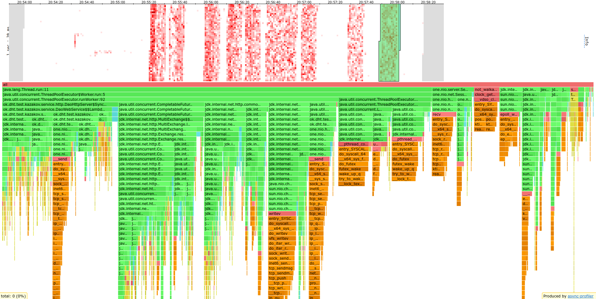

# Оптимизация конфигурации сервера
> Скрипты для wrk2 можно найти [здесь](../stage1/wrk2_scripts)

> HTML файлы, выведенные async-profiler'ом можно найти [здесь](./profiler_output)

Профилирование проводилось только на "мастер" сервере, на который стрелялись запросы.
Остальные сервера играли такую же роль как и в прошлом дз - сервер с данными и апишкой.

## Ускорение кода

Стреляю путом, как в прошлых стейджах (случайные строки случайной длины 100-200, либо число от 1 до 75'000'000).
В отличие от GET запросов PUT запросы сильнее нагружают сервер по RPS, значит, лучше утилизируют треды.
Для анализа скорости кода выставил 64 треда на воркеров и столько же на внутренние запросы между шардами.

Стрельба wrk2 PUT'ом на 4000 RPS

<pre>
Running 10s test @ http://localhost:8080
  64 threads and 64 connections
  Thread calibration: mean lat.: 1.784ms, rate sampling interval: 10ms
  Thread calibration: mean lat.: 1.777ms, rate sampling interval: 10ms
  Thread calibration: mean lat.: 2.087ms, rate sampling interval: 10ms
  Thread calibration: mean lat.: 2.036ms, rate sampling interval: 10ms
  Thread calibration: mean lat.: 2.157ms, rate sampling interval: 10ms
  Thread calibration: mean lat.: 2.063ms, rate sampling interval: 10ms
  Thread calibration: mean lat.: 1.982ms, rate sampling interval: 10ms
  Thread calibration: mean lat.: 2.136ms, rate sampling interval: 10ms
  Thread calibration: mean lat.: 1.946ms, rate sampling interval: 10ms
  Thread calibration: mean lat.: 1.986ms, rate sampling interval: 10ms
  Thread calibration: mean lat.: 1.902ms, rate sampling interval: 10ms
  Thread calibration: mean lat.: 1.981ms, rate sampling interval: 10ms
  Thread calibration: mean lat.: 1.902ms, rate sampling interval: 10ms
  Thread calibration: mean lat.: 1.782ms, rate sampling interval: 10ms
  Thread calibration: mean lat.: 1.853ms, rate sampling interval: 10ms
  Thread calibration: mean lat.: 1.871ms, rate sampling interval: 10ms
  Thread calibration: mean lat.: 1.817ms, rate sampling interval: 10ms
  Thread calibration: mean lat.: 2.032ms, rate sampling interval: 10ms
  Thread calibration: mean lat.: 2.040ms, rate sampling interval: 10ms
  Thread calibration: mean lat.: 2.026ms, rate sampling interval: 10ms
  Thread Stats   Avg      Stdev     Max   +/- Stdev
    Latency     1.83ms    1.65ms  23.36ms   90.46%
    Req/Sec       -nan      -nan   0.00      0.00%
  Latency Distribution (HdrHistogram - Recorded Latency)
 50.000%    1.32ms
 75.000%    2.20ms
 90.000%    3.41ms
 99.000%    9.09ms
 99.900%   14.53ms
 99.990%   18.82ms
 99.999%   23.38ms
100.000%   23.38ms

  Detailed Percentile spectrum:
       Value   Percentile   TotalCount 1/(1-Percentile)

       0.276     0.000000            2         1.00
       0.594     0.100000         2747         1.11
       0.802     0.200000         5493         1.25
       0.985     0.300000         8225         1.43
       1.158     0.400000        10969         1.67
       1.315     0.500000        13717         2.00
       1.432     0.550000        15081         2.22
       1.608     0.600000        16453         2.50
       1.794     0.650000        17825         2.86
       1.983     0.700000        19192         3.33
       2.205     0.750000        20568         4.00
       2.325     0.775000        21247         4.44
       2.481     0.800000        21938         5.00
       2.647     0.825000        22620         5.71
       2.847     0.850000        23304         6.67
       3.091     0.875000        23988         8.00
       3.247     0.887500        24333         8.89
       3.413     0.900000        24676        10.00
       3.605     0.912500        25018        11.43
       3.863     0.925000        25358        13.33
       4.191     0.937500        25702        16.00
       4.387     0.943750        25873        17.78
       4.627     0.950000        26045        20.00
       4.899     0.956250        26215        22.86
       5.263     0.962500        26392        26.67
       5.699     0.968750        26558        32.00
       5.947     0.971875        26643        35.56
       6.355     0.975000        26729        40.00
       6.779     0.978125        26815        45.71
       7.235     0.981250        26900        53.33
       7.935     0.984375        26986        64.00
       8.239     0.985938        27031        71.11
       8.631     0.987500        27076        80.00
       8.919     0.989062        27115        91.43
       9.199     0.990625        27157       106.67
       9.815     0.992188        27200       128.00
      10.111     0.992969        27222       142.22
      10.471     0.993750        27243       160.00
      10.807     0.994531        27265       182.86
      11.295     0.995313        27286       213.33
      11.759     0.996094        27307       256.00
      12.055     0.996484        27318       284.44
      12.319     0.996875        27330       320.00
      12.751     0.997266        27340       365.71
      13.063     0.997656        27350       426.67
      13.519     0.998047        27362       512.00
      13.543     0.998242        27367       568.89
      13.911     0.998437        27372       640.00
      14.223     0.998633        27377       731.43
      14.439     0.998828        27383       853.33
      14.567     0.999023        27388      1024.00
      14.847     0.999121        27390      1137.78
      14.943     0.999219        27393      1280.00
      15.159     0.999316        27396      1462.86
      15.807     0.999414        27398      1706.67
      16.119     0.999512        27401      2048.00
      16.415     0.999561        27402      2275.56
      16.815     0.999609        27404      2560.00
      17.103     0.999658        27405      2925.71
      17.231     0.999707        27406      3413.33
      17.631     0.999756        27408      4096.00
      17.631     0.999780        27408      4551.11
      18.319     0.999805        27409      5120.00
      18.703     0.999829        27410      5851.43
      18.703     0.999854        27410      6826.67
      18.815     0.999878        27411      8192.00
      18.815     0.999890        27411      9102.22
      20.047     0.999902        27412     10240.00
      20.047     0.999915        27412     11702.86
      20.047     0.999927        27412     13653.33
      21.839     0.999939        27413     16384.00
      21.839     0.999945        27413     18204.44
      21.839     0.999951        27413     20480.00
      21.839     0.999957        27413     23405.71
      21.839     0.999963        27413     27306.67
      23.375     0.999969        27414     32768.00
      23.375     1.000000        27414          inf
#[Mean    =        1.830, StdDeviation   =        1.648]
#[Max     =       23.360, Total count    =        27414]
#[Buckets =           27, SubBuckets     =         2048]
----------------------------------------------------------
  35265 requests in 10.00s, 2.13MB read
  Socket errors: connect 0, read 0, write 0, timeout 32
Requests/sec:   3524.87
Transfer/sec:    218.23KB
</pre>

Стрельба wrk2 PUT'ом на 3000 RPS

<pre>
Running 10s test @ http://localhost:8080
  64 threads and 64 connections
  Thread calibration: mean lat.: 1.510ms, rate sampling interval: 10ms
  Thread calibration: mean lat.: 1.615ms, rate sampling interval: 10ms
  Thread calibration: mean lat.: 1.773ms, rate sampling interval: 10ms
  Thread calibration: mean lat.: 1.882ms, rate sampling interval: 10ms
  Thread calibration: mean lat.: 1.922ms, rate sampling interval: 10ms
  Thread calibration: mean lat.: 1.720ms, rate sampling interval: 10ms
  Thread calibration: mean lat.: 1.570ms, rate sampling interval: 10ms
  Thread calibration: mean lat.: 1.632ms, rate sampling interval: 10ms
  Thread calibration: mean lat.: 1.646ms, rate sampling interval: 10ms
  Thread calibration: mean lat.: 1.600ms, rate sampling interval: 10ms
  Thread Stats   Avg      Stdev     Max   +/- Stdev
    Latency     1.57ms    1.26ms  21.23ms   92.10%
    Req/Sec       -nan      -nan   0.00      0.00%
  Latency Distribution (HdrHistogram - Recorded Latency)
 50.000%    1.28ms
 75.000%    1.90ms
 90.000%    2.59ms
 99.000%    6.85ms
 99.900%   14.65ms
 99.990%   18.58ms
 99.999%   21.25ms
100.000%   21.25ms

  Detailed Percentile spectrum:
       Value   Percentile   TotalCount 1/(1-Percentile)

       0.226     0.000000            1         1.00
       0.589     0.100000         2526         1.11
       0.785     0.200000         5044         1.25
       0.967     0.300000         7570         1.43
       1.135     0.400000        10083         1.67
       1.285     0.500000        12617         2.00
       1.366     0.550000        13861         2.22
       1.482     0.600000        15116         2.50
       1.621     0.650000        16376         2.86
       1.756     0.700000        17638         3.33
       1.897     0.750000        18897         4.00
       1.973     0.775000        19520         4.44
       2.067     0.800000        20153         5.00
       2.161     0.825000        20794         5.71
       2.273     0.850000        21416         6.67
       2.411     0.875000        22040         8.00
       2.493     0.887500        22352         8.89
       2.593     0.900000        22668        10.00
       2.715     0.912500        22984        11.43
       2.865     0.925000        23297        13.33
       3.061     0.937500        23613        16.00
       3.181     0.943750        23769        17.78
       3.321     0.950000        23927        20.00
       3.517     0.956250        24084        22.86
       3.737     0.962500        24243        26.67
       4.027     0.968750        24398        32.00
       4.199     0.971875        24478        35.56
       4.435     0.975000        24561        40.00
       4.695     0.978125        24635        45.71
       5.019     0.981250        24713        53.33
       5.559     0.984375        24792        64.00
       5.859     0.985938        24831        71.11
       6.219     0.987500        24871        80.00
       6.595     0.989062        24910        91.43
       7.027     0.990625        24949       106.67
       7.539     0.992188        24989       128.00
       7.915     0.992969        25008       142.22
       8.223     0.993750        25028       160.00
       8.663     0.994531        25048       182.86
       9.047     0.995313        25067       213.33
       9.615     0.996094        25088       256.00
      10.135     0.996484        25097       284.44
      10.567     0.996875        25107       320.00
      11.047     0.997266        25118       365.71
      11.511     0.997656        25126       426.67
      12.071     0.998047        25136       512.00
      12.655     0.998242        25141       568.89
      13.159     0.998437        25146       640.00
      13.367     0.998633        25151       731.43
      14.071     0.998828        25156       853.33
      14.663     0.999023        25161      1024.00
      14.743     0.999121        25163      1137.78
      15.311     0.999219        25166      1280.00
      15.695     0.999316        25168      1462.86
      16.247     0.999414        25171      1706.67
      16.311     0.999512        25173      2048.00
      16.351     0.999561        25174      2275.56
      17.391     0.999609        25177      2560.00
      17.391     0.999658        25177      2925.71
      17.471     0.999707        25178      3413.33
      17.503     0.999756        25179      4096.00
      17.983     0.999780        25180      4551.11
      18.287     0.999805        25181      5120.00
      18.287     0.999829        25181      5851.43
      18.575     0.999854        25182      6826.67
      18.575     0.999878        25182      8192.00
      19.199     0.999890        25183      9102.22
      19.199     0.999902        25183     10240.00
      19.199     0.999915        25183     11702.86
      19.279     0.999927        25184     13653.33
      19.279     0.999939        25184     16384.00
      19.279     0.999945        25184     18204.44
      19.279     0.999951        25184     20480.00
      19.279     0.999957        25184     23405.71
      21.247     0.999963        25185     27306.67
      21.247     1.000000        25185          inf
#[Mean    =        1.568, StdDeviation   =        1.260]
#[Max     =       21.232, Total count    =        25185]
#[Buckets =           27, SubBuckets     =         2048]
----------------------------------------------------------
  29929 requests in 9.95s, 1.81MB read
Requests/sec:   3007.19
Transfer/sec:    185.91KB
</pre>

RPS значительно упал в сравнении с 1-шардовой версией.
На 4000 RPS задыхается, на 3000 RPS стабильно.
Иду профилировать.

Flame graph по CPU для PUT запросов

Flame graph по CPU для PUT запросов для консистентного хеширования

Flame graph по Alloc для построения запросов между шардами

В итоге некоторые участки кода были соптимизированы.

Аллокации в билдере http запросов немного оптимизировал.

Активное ожидание в `flushInBg()` поменял на пассивное,
так как `flush` делает I/O операции,
то есть оверхед на `await()` не будет заметен.

В консистентном хешировании оптимизировал поиск шарда:
раньше бинарный поиск шел по списку объектов `Point{Shard, int}`,
что приводило к касту `int -> Integer` и кастомному компаратору.
Переписал хранение данных, теперь бинарный поиск идет по `int[]`.

Flame graph по CPU для PUT запросов для консистентного хеширования (синяя точка - был семпл в этот момент времени)

## Настройка равномерности шардирования

Также заметил, что для ключей со структурой (например, ключи вида 1, 2, ..., 10'000) шардирование неравномерно.
Понял, что это из-за того, что `hashCode()` таких ключей примерно равен.
Решил домножить его на большое простое число 1234567891, что равномерно распределило данные.

Распределение на списке ключей вида 1, 2, 3, ..., 75'000'000 до улучшения

<pre>
{
    shard1 hits: 11438290,
    shard2 hits: 24493500,
    shard3 hits: 39068210
}
</pre>

Распределение на списке длины 10'000'000 случайных ключей случайной длины (100-200 символов) до улучшения

<pre>
{
    shard1 hits: 3334052,
    shard2 hits: 3332132,
    shard3 hits: 3333816
}
</pre>

Распределение на списке ключей вида 1, 2, 3, ..., 75'000'000 после улучшения

<pre>
{
    shard1 hits: 24999945,
    shard2 hits: 25000031,
    shard3 hits: 25000024
}
</pre>

Распределение на списке длины 75'000'000 случайных ключей случайной длины (100-200 символов) после улучшения

<pre>
{
    shard1 hits: 24999043,
    shard2 hits: 24992065,
    shard3 hits: 25008892
}
</pre>

Заметим, что трюк действительно помог.

## Настройка констант

### Настройка консистентного хеширования

При консистентном хешировании появляется константа "сколько vnode выделять на каждый шард".
Чем больше это число, тем дороже определение шарда - дольше бинпоиск.
Чем оно меньше, тем более вероятно, что данные будут распределены неравномерно при добавлении/удалении шарда.
Так как кластер в задании статичен, можно поставить это число равным единице,
но было поставлено 3 ради имитации продового окружения.
(Протестировать равномерность все равно нет возможности без реализации добавления/удаления шарда)

### Настройка пулов потоков

Протестируем пулы тредов на PUT запросах.
Они лучше утилизируют треды, так как держат больше RPS.

Обозначим `Runtime.getRuntime().availableProcessors()` как P,
количество тредов в пуле обработки запросов как W
и в пуле запросов к другим шардам как I.
Также пусть IC - размер очереди запросов к остальным шардам.
WC - размер очереди для воркеров.
Если не оговорено, считается W = WC, I = IC.

Все ошибки (`Non-2xx or 3xx responses` у wrk) - ответы `Too Many Requests` от сервера.
Таймауты скорее всего происходят из-за таймаута запросов до других шардов.

Стрельба wrk2 PUT'ом на 1000 RPS при W = 4P, I = 4P

<pre>
Running 10s test @ http://localhost:8080
  64 threads and 64 connections
  Thread calibration: mean lat.: 1.153ms, rate sampling interval: 10ms
  Thread calibration: mean lat.: 1.299ms, rate sampling interval: 10ms
  Thread calibration: mean lat.: 1.382ms, rate sampling interval: 10ms
  Thread calibration: mean lat.: 1.220ms, rate sampling interval: 10ms
  Thread calibration: mean lat.: 1.235ms, rate sampling interval: 10ms
  Thread calibration: mean lat.: 1.242ms, rate sampling interval: 10ms
  Thread calibration: mean lat.: 1.228ms, rate sampling interval: 10ms
  Thread calibration: mean lat.: 1.232ms, rate sampling interval: 10ms
  Thread calibration: mean lat.: 1.297ms, rate sampling interval: 10ms
  Thread calibration: mean lat.: 1.266ms, rate sampling interval: 10ms
  Thread calibration: mean lat.: 1.155ms, rate sampling interval: 10ms
  Thread calibration: mean lat.: 1.165ms, rate sampling interval: 10ms
  Thread calibration: mean lat.: 1.202ms, rate sampling interval: 10ms
  Thread calibration: mean lat.: 1.226ms, rate sampling interval: 10ms
  Thread calibration: mean lat.: 1.201ms, rate sampling interval: 10ms
  Thread calibration: mean lat.: 1.192ms, rate sampling interval: 10ms
  Thread calibration: mean lat.: 1.213ms, rate sampling interval: 10ms
  Thread calibration: mean lat.: 1.157ms, rate sampling interval: 10ms
  Thread calibration: mean lat.: 1.182ms, rate sampling interval: 10ms
  Thread calibration: mean lat.: 1.213ms, rate sampling interval: 10ms
  Thread calibration: mean lat.: 1.208ms, rate sampling interval: 10ms
  Thread calibration: mean lat.: 1.196ms, rate sampling interval: 10ms
  Thread calibration: mean lat.: 1.108ms, rate sampling interval: 10ms
  Thread calibration: mean lat.: 1.123ms, rate sampling interval: 10ms
  Thread calibration: mean lat.: 1.193ms, rate sampling interval: 10ms
  Thread calibration: mean lat.: 1.128ms, rate sampling interval: 10ms
  Thread calibration: mean lat.: 208.400ms, rate sampling interval: 1972ms
  Thread calibration: mean lat.: 1.209ms, rate sampling interval: 10ms
  Thread calibration: mean lat.: 1.213ms, rate sampling interval: 10ms
  Thread calibration: mean lat.: 1.113ms, rate sampling interval: 10ms
  Thread calibration: mean lat.: 1.078ms, rate sampling interval: 10ms
  Thread Stats   Avg      Stdev     Max   +/- Stdev
    Latency     7.45ms   92.27ms   2.00s    99.42%
    Req/Sec       -nan      -nan   0.00      0.00%
  Latency Distribution (HdrHistogram - Recorded Latency)
 50.000%    1.11ms
 75.000%    1.41ms
 90.000%    1.66ms
 99.000%    3.93ms
 99.900%    1.69s 
 99.990%    1.94s 
 99.999%    2.00s 
100.000%    2.00s 

  Detailed Percentile spectrum:
       Value   Percentile   TotalCount 1/(1-Percentile)

       0.271     0.000000            1         1.00
       0.601     0.100000          515         1.11
       0.773     0.200000         1036         1.25
       0.897     0.300000         1549         1.43
       1.009     0.400000         2062         1.67
       1.109     0.500000         2575         2.00
       1.163     0.550000         2834         2.22
       1.220     0.600000         3091         2.50
       1.274     0.650000         3350         2.86
       1.334     0.700000         3604         3.33
       1.411     0.750000         3862         4.00
       1.454     0.775000         3991         4.44
       1.493     0.800000         4119         5.00
       1.534     0.825000         4248         5.71
       1.574     0.850000         4380         6.67
       1.616     0.875000         4505         8.00
       1.638     0.887500         4569         8.89
       1.663     0.900000         4634        10.00
       1.688     0.912500         4699        11.43
       1.713     0.925000         4762        13.33
       1.750     0.937500         4828        16.00
       1.776     0.943750         4859        17.78
       1.804     0.950000         4891        20.00
       1.844     0.956250         4924        22.86
       1.878     0.962500         4955        26.67
       1.922     0.968750         4988        32.00
       1.962     0.971875         5004        35.56
       2.019     0.975000         5020        40.00
       2.093     0.978125         5036        45.71
       2.209     0.981250         5052        53.33
       2.365     0.984375         5068        64.00
       2.673     0.985938         5076        71.11
       2.929     0.987500         5084        80.00
       3.527     0.989062         5092        91.43
       4.159     0.990625         5100       106.67
       5.011     0.992188         5108       128.00
       5.411     0.992969         5112       142.22
       6.083     0.993750         5116       160.00
     222.335     0.994531         5120       182.86
     476.671     0.995313         5124       213.33
     730.623     0.996094         5128       256.00
     857.087     0.996484         5130       284.44
     984.575     0.996875         5132       320.00
    1112.063     0.997266         5134       365.71
    1239.039     0.997656         5136       426.67
    1367.039     0.998047         5138       512.00
    1430.527     0.998242         5139       568.89
    1494.015     0.998437         5140       640.00
    1557.503     0.998633         5141       731.43
    1620.991     0.998828         5142       853.33
    1685.503     0.999023         5143      1024.00
    1748.991     0.999121         5144      1137.78
    1748.991     0.999219         5144      1280.00
    1812.479     0.999316         5145      1462.86
    1812.479     0.999414         5145      1706.67
    1875.967     0.999512         5146      2048.00
    1875.967     0.999561         5146      2275.56
    1875.967     0.999609         5146      2560.00
    1939.455     0.999658         5147      2925.71
    1939.455     0.999707         5147      3413.33
    1939.455     0.999756         5147      4096.00
    1939.455     0.999780         5147      4551.11
    1939.455     0.999805         5147      5120.00
    2002.943     0.999829         5148      5851.43
    2002.943     1.000000         5148          inf
#[Mean    =        7.452, StdDeviation   =       92.269]
#[Max     =     2001.920, Total count    =         5148]
#[Buckets =           27, SubBuckets     =         2048]
----------------------------------------------------------
  10048 requests in 9.99s, 606.98KB read
  Non-2xx or 3xx responses: 2
Requests/sec:   1006.00
Transfer/sec:     60.77KB
</pre>

Стрельба wrk2 PUT'ом на 3000 RPS при W = 8P, I = 8P

<pre>
Running 10s test @ http://localhost:8080
  64 threads and 64 connections
  Thread calibration: mean lat.: 1.210ms, rate sampling interval: 10ms
  Thread calibration: mean lat.: 1.397ms, rate sampling interval: 10ms
  Thread calibration: mean lat.: 1.557ms, rate sampling interval: 10ms
  Thread calibration: mean lat.: 1.378ms, rate sampling interval: 10ms
  Thread calibration: mean lat.: 1.294ms, rate sampling interval: 10ms
  Thread calibration: mean lat.: 1.264ms, rate sampling interval: 10ms
  Thread calibration: mean lat.: 1.189ms, rate sampling interval: 10ms
  Thread calibration: mean lat.: 1.207ms, rate sampling interval: 10ms
  Thread calibration: mean lat.: 1.113ms, rate sampling interval: 10ms
  Thread calibration: mean lat.: 1.166ms, rate sampling interval: 10ms
  Thread calibration: mean lat.: 1.124ms, rate sampling interval: 10ms
  Thread calibration: mean lat.: 1.155ms, rate sampling interval: 10ms
  Thread calibration: mean lat.: 1.189ms, rate sampling interval: 10ms
  Thread calibration: mean lat.: 1.301ms, rate sampling interval: 10ms
  Thread calibration: mean lat.: 1.229ms, rate sampling interval: 10ms
  Thread calibration: mean lat.: 1.320ms, rate sampling interval: 10ms
  Thread calibration: mean lat.: 1.406ms, rate sampling interval: 10ms
  Thread calibration: mean lat.: 1.373ms, rate sampling interval: 10ms
  Thread calibration: mean lat.: 1.428ms, rate sampling interval: 10ms
  Thread calibration: mean lat.: 1.092ms, rate sampling interval: 10ms
  Thread calibration: mean lat.: 1.245ms, rate sampling interval: 10ms
  Thread calibration: mean lat.: 1.354ms, rate sampling interval: 10ms
  Thread calibration: mean lat.: 1.317ms, rate sampling interval: 10ms
  Thread calibration: mean lat.: 1.326ms, rate sampling interval: 10ms
  Thread calibration: mean lat.: 1.310ms, rate sampling interval: 10ms
  Thread calibration: mean lat.: 1.088ms, rate sampling interval: 10ms
  Thread calibration: mean lat.: 1.309ms, rate sampling interval: 10ms
  Thread Stats   Avg      Stdev     Max   +/- Stdev
    Latency     6.88ms   86.55ms   2.00s    99.47%
    Req/Sec       -nan      -nan   0.00      0.00%
  Latency Distribution (HdrHistogram - Recorded Latency)
 50.000%    1.19ms
 75.000%    1.59ms
 90.000%    2.06ms
 99.000%    3.97ms
 99.900%    1.65s 
 99.990%    1.96s 
 99.999%    2.00s 
100.000%    2.00s 

  Detailed Percentile spectrum:
       Value   Percentile   TotalCount 1/(1-Percentile)

       0.194     0.000000            1         1.00
       0.588     0.100000         1735         1.11
       0.773     0.200000         3465         1.25
       0.920     0.300000         5204         1.43
       1.063     0.400000         6933         1.67
       1.192     0.500000         8663         2.00
       1.253     0.550000         9527         2.22
       1.323     0.600000        10392         2.50
       1.407     0.650000        11265         2.86
       1.490     0.700000        12122         3.33
       1.587     0.750000        12992         4.00
       1.644     0.775000        13421         4.44
       1.705     0.800000        13857         5.00
       1.780     0.825000        14291         5.71
       1.859     0.850000        14720         6.67
       1.952     0.875000        15154         8.00
       2.007     0.887500        15368         8.89
       2.063     0.900000        15593        10.00
       2.125     0.912500        15805        11.43
       2.191     0.925000        16027        13.33
       2.269     0.937500        16234        16.00
       2.315     0.943750        16345        17.78
       2.369     0.950000        16453        20.00
       2.437     0.956250        16560        22.86
       2.517     0.962500        16668        26.67
       2.613     0.968750        16776        32.00
       2.681     0.971875        16830        35.56
       2.759     0.975000        16884        40.00
       2.865     0.978125        16938        45.71
       2.991     0.981250        16992        53.33
       3.241     0.984375        17046        64.00
       3.333     0.985938        17073        71.11
       3.501     0.987500        17101        80.00
       3.813     0.989062        17128        91.43
       4.199     0.990625        17154       106.67
       5.091     0.992188        17181       128.00
       6.803     0.992969        17195       142.22
       8.703     0.993750        17208       160.00
      41.279     0.994531        17222       182.86
     310.783     0.995313        17235       213.33
     603.135     0.996094        17249       256.00
     749.055     0.996484        17256       284.44
     875.519     0.996875        17262       320.00
    1021.951     0.997266        17269       365.71
    1168.383     0.997656        17276       426.67
    1315.839     0.998047        17283       512.00
    1379.327     0.998242        17286       568.89
    1441.791     0.998437        17289       640.00
    1525.759     0.998633        17293       731.43
    1589.247     0.998828        17296       853.33
    1673.215     0.999023        17300      1024.00
    1693.695     0.999121        17301      1137.78
    1734.655     0.999219        17303      1280.00
    1776.639     0.999316        17305      1462.86
    1797.119     0.999414        17306      1706.67
    1839.103     0.999512        17308      2048.00
    1859.583     0.999561        17309      2275.56
    1880.063     0.999609        17310      2560.00
    1899.519     0.999658        17311      2925.71
    1899.519     0.999707        17311      3413.33
    1919.999     0.999756        17312      4096.00
    1941.503     0.999780        17313      4551.11
    1941.503     0.999805        17313      5120.00
    1959.935     0.999829        17314      5851.43
    1959.935     0.999854        17314      6826.67
    1959.935     0.999878        17314      8192.00
    1980.415     0.999890        17315      9102.22
    1980.415     0.999902        17315     10240.00
    1980.415     0.999915        17315     11702.86
    1980.415     0.999927        17315     13653.33
    1980.415     0.999939        17315     16384.00
    2001.919     0.999945        17316     18204.44
    2001.919     1.000000        17316          inf
#[Mean    =        6.880, StdDeviation   =       86.552]
#[Max     =     2000.896, Total count    =        17316]
#[Buckets =           27, SubBuckets     =         2048]
----------------------------------------------------------
  30017 requests in 9.99s, 1.76MB read
  Non-2xx or 3xx responses: 1
Requests/sec:   3005.43
Transfer/sec:    180.63KB
</pre>

Стрельба wrk2 PUT'ом на 3000 RPS при W = 16P, I = 8P

<pre>
Running 10s test @ http://localhost:8080
  64 threads and 64 connections
  Thread calibration: mean lat.: 1.284ms, rate sampling interval: 10ms
  Thread calibration: mean lat.: 1.349ms, rate sampling interval: 10ms
  Thread calibration: mean lat.: 1.179ms, rate sampling interval: 10ms
  Thread calibration: mean lat.: 1.068ms, rate sampling interval: 10ms
  Thread calibration: mean lat.: 1.038ms, rate sampling interval: 10ms
  Thread calibration: mean lat.: 1.119ms, rate sampling interval: 10ms
  Thread calibration: mean lat.: 1.173ms, rate sampling interval: 10ms
  Thread calibration: mean lat.: 1.043ms, rate sampling interval: 10ms
  Thread calibration: mean lat.: 1.053ms, rate sampling interval: 10ms
  Thread calibration: mean lat.: 1.019ms, rate sampling interval: 10ms
  Thread calibration: mean lat.: 1.050ms, rate sampling interval: 10ms
  Thread calibration: mean lat.: 1.050ms, rate sampling interval: 10ms
  Thread calibration: mean lat.: 1.111ms, rate sampling interval: 10ms
  Thread calibration: mean lat.: 1.138ms, rate sampling interval: 10ms
  Thread calibration: mean lat.: 1.119ms, rate sampling interval: 10ms
  Thread calibration: mean lat.: 1.155ms, rate sampling interval: 10ms
  Thread calibration: mean lat.: 1.173ms, rate sampling interval: 10ms
  Thread calibration: mean lat.: 1.222ms, rate sampling interval: 10ms
  Thread calibration: mean lat.: 1.150ms, rate sampling interval: 10ms
  Thread calibration: mean lat.: 1.107ms, rate sampling interval: 10ms
  Thread calibration: mean lat.: 1.277ms, rate sampling interval: 10ms
  Thread Stats   Avg      Stdev     Max   +/- Stdev
    Latency    15.85ms  139.18ms   2.01s    98.67%
    Req/Sec       -nan      -nan   0.00      0.00%
  Latency Distribution (HdrHistogram - Recorded Latency)
 50.000%    1.22ms
 75.000%    1.59ms
 90.000%    2.00ms
 99.000%  625.15ms
 99.900%    1.88s 
 99.990%    2.00s 
 99.999%    2.01s 
100.000%    2.01s 

  Detailed Percentile spectrum:
       Value   Percentile   TotalCount 1/(1-Percentile)

       0.198     0.000000            1         1.00
       0.610     0.100000         2003         1.11
       0.815     0.200000         4009         1.25
       0.964     0.300000         6014         1.43
       1.097     0.400000         8019         1.67
       1.216     0.500000        10014         2.00
       1.274     0.550000        11023         2.22
       1.345     0.600000        12017         2.50
       1.421     0.650000        13023         2.86
       1.507     0.700000        14023         3.33
       1.590     0.750000        15015         4.00
       1.635     0.775000        15522         4.44
       1.688     0.800000        16021         5.00
       1.744     0.825000        16517         5.71
       1.808     0.850000        17022         6.67
       1.891     0.875000        17518         8.00
       1.943     0.887500        17768         8.89
       2.002     0.900000        18018        10.00
       2.067     0.912500        18276        11.43
       2.163     0.925000        18518        13.33
       2.279     0.937500        18770        16.00
       2.361     0.943750        18894        17.78
       2.437     0.950000        19022        20.00
       2.549     0.956250        19144        22.86
       2.677     0.962500        19272        26.67
       2.939     0.968750        19395        32.00
       3.115     0.971875        19456        35.56
       3.499     0.975000        19519        40.00
       4.081     0.978125        19582        45.71
       4.711     0.981250        19644        53.33
       6.695     0.984375        19707        64.00
      56.959     0.985938        19738        71.11
     272.383     0.987500        19769        80.00
     498.687     0.989062        19801        91.43
     713.215     0.990625        19833       106.67
     921.087     0.992188        19863       128.00
    1043.967     0.992969        19879       142.22
    1146.879     0.993750        19894       160.00
    1255.423     0.994531        19910       182.86
    1360.895     0.995313        19926       213.33
    1464.319     0.996094        19941       256.00
    1526.783     0.996484        19950       284.44
    1586.175     0.996875        19957       320.00
    1632.255     0.997266        19965       365.71
    1695.743     0.997656        19974       426.67
    1737.727     0.998047        19980       512.00
    1775.615     0.998242        19984       568.89
    1801.215     0.998437        19989       640.00
    1821.695     0.998633        19992       731.43
    1859.583     0.998828        19996       853.33
    1885.183     0.999023        20001      1024.00
    1901.567     0.999121        20002      1137.78
    1906.687     0.999219        20004      1280.00
    1927.167     0.999316        20007      1462.86
    1943.551     0.999414        20008      1706.67
    1947.647     0.999512        20010      2048.00
    1964.031     0.999561        20011      2275.56
    1968.127     0.999609        20012      2560.00
    1969.151     0.999658        20013      2925.71
    1984.511     0.999707        20014      3413.33
    1988.607     0.999756        20016      4096.00
    1988.607     0.999780        20016      4551.11
    1988.607     0.999805        20016      5120.00
    1988.607     0.999829        20016      5851.43
    2004.991     0.999854        20017      6826.67
    2004.991     0.999878        20017      8192.00
    2004.991     0.999890        20017      9102.22
    2006.015     0.999902        20018     10240.00
    2006.015     0.999915        20018     11702.86
    2006.015     0.999927        20018     13653.33
    2006.015     0.999939        20018     16384.00
    2006.015     0.999945        20018     18204.44
    2009.087     0.999951        20019     20480.00
    2009.087     1.000000        20019          inf
#[Mean    =       15.852, StdDeviation   =      139.178]
#[Max     =     2008.064, Total count    =        20019]
#[Buckets =           27, SubBuckets     =         2048]
----------------------------------------------------------
  28793 requests in 10.01s, 1.70MB read
  Socket errors: connect 0, read 0, write 0, timeout 10
  Non-2xx or 3xx responses: 3
Requests/sec:   2875.96
Transfer/sec:    173.49KB
</pre>

При увеличении W RPS не увеличился, попробуем увеличить только I.

Стрельба wrk2 PUT'ом на 6000 RPS при W = 8P, I = 16P

<pre>
Running 10s test @ http://localhost:8080
  64 threads and 64 connections
  Thread calibration: mean lat.: 1.178ms, rate sampling interval: 10ms
  Thread calibration: mean lat.: 1.911ms, rate sampling interval: 10ms
  Thread calibration: mean lat.: 1.325ms, rate sampling interval: 10ms
  Thread calibration: mean lat.: 1.927ms, rate sampling interval: 10ms
  Thread calibration: mean lat.: 1.341ms, rate sampling interval: 10ms
  Thread calibration: mean lat.: 1.326ms, rate sampling interval: 10ms
  Thread calibration: mean lat.: 1.309ms, rate sampling interval: 10ms
  Thread calibration: mean lat.: 1.326ms, rate sampling interval: 10ms
  Thread calibration: mean lat.: 1.356ms, rate sampling interval: 10ms
  Thread calibration: mean lat.: 1.361ms, rate sampling interval: 10ms
  Thread calibration: mean lat.: 10.349ms, rate sampling interval: 10ms
  Thread calibration: mean lat.: 10.269ms, rate sampling interval: 10ms
  Thread calibration: mean lat.: 10.268ms, rate sampling interval: 10ms
  Thread calibration: mean lat.: 1.147ms, rate sampling interval: 10ms
  Thread calibration: mean lat.: 1.119ms, rate sampling interval: 10ms
  Thread calibration: mean lat.: 1.182ms, rate sampling interval: 10ms
  Thread calibration: mean lat.: 1.437ms, rate sampling interval: 10ms
  Thread calibration: mean lat.: 1.314ms, rate sampling interval: 10ms
  Thread calibration: mean lat.: 1.281ms, rate sampling interval: 10ms
  Thread calibration: mean lat.: 1.291ms, rate sampling interval: 10ms
  Thread calibration: mean lat.: 1.309ms, rate sampling interval: 10ms
  Thread calibration: mean lat.: 1.122ms, rate sampling interval: 10ms
  Thread calibration: mean lat.: 1.041ms, rate sampling interval: 10ms
  Thread calibration: mean lat.: 1.074ms, rate sampling interval: 10ms
  Thread calibration: mean lat.: 1.104ms, rate sampling interval: 10ms
  Thread calibration: mean lat.: 1.246ms, rate sampling interval: 10ms
  Thread calibration: mean lat.: 1.067ms, rate sampling interval: 10ms
  Thread calibration: mean lat.: 1.219ms, rate sampling interval: 10ms
  Thread calibration: mean lat.: 1.298ms, rate sampling interval: 10ms
  Thread calibration: mean lat.: 1.303ms, rate sampling interval: 10ms
  Thread calibration: mean lat.: 1.319ms, rate sampling interval: 10ms
  Thread calibration: mean lat.: 1.330ms, rate sampling interval: 10ms
  Thread calibration: mean lat.: 10.380ms, rate sampling interval: 10ms
  Thread Stats   Avg      Stdev     Max   +/- Stdev
    Latency    27.94ms  189.20ms   2.03s    97.78%
    Req/Sec       -nan      -nan   0.00      0.00%
  Latency Distribution (HdrHistogram - Recorded Latency)
 50.000%    1.27ms
 75.000%    1.73ms
 90.000%    2.69ms
 99.000%    1.30s 
 99.900%    2.00s 
 99.990%    2.02s 
 99.999%    2.03s 
100.000%    2.03s 

  Detailed Percentile spectrum:
       Value   Percentile   TotalCount 1/(1-Percentile)

       0.156     0.000000            1         1.00
       0.642     0.100000         2905         1.11
       0.847     0.200000         5811         1.25
       1.002     0.300000         8714         1.43
       1.136     0.400000        11617         1.67
       1.269     0.500000        14522         2.00
       1.347     0.550000        15977         2.22
       1.431     0.600000        17422         2.50
       1.517     0.650000        18869         2.86
       1.616     0.700000        20329         3.33
       1.733     0.750000        21765         4.00
       1.801     0.775000        22499         4.44
       1.887     0.800000        23218         5.00
       1.993     0.825000        23947         5.71
       2.133     0.850000        24675         6.67
       2.337     0.875000        25396         8.00
       2.487     0.887500        25761         8.89
       2.693     0.900000        26119        10.00
       2.993     0.912500        26483        11.43
       3.451     0.925000        26844        13.33
       4.139     0.937500        27207        16.00
       4.663     0.943750        27388        17.78
       5.515     0.950000        27569        20.00
       7.155     0.956250        27751        22.86
      13.015     0.962500        27932        26.67
      27.167     0.968750        28114        32.00
      32.991     0.971875        28204        35.56
      40.415     0.975000        28295        40.00
     242.815     0.978125        28386        45.71
     528.383     0.981250        28476        53.33
     790.015     0.984375        28567        64.00
     939.519     0.985938        28612        71.11
    1089.535     0.987500        28658        80.00
    1225.727     0.989062        28704        91.43
    1348.607     0.990625        28748       106.67
    1459.199     0.992188        28794       128.00
    1506.303     0.992969        28816       142.22
    1539.071     0.993750        28839       160.00
    1605.631     0.994531        28862       182.86
    1676.287     0.995313        28884       213.33
    1739.775     0.996094        28907       256.00
    1774.591     0.996484        28918       284.44
    1816.575     0.996875        28930       320.00
    1849.343     0.997266        28941       365.71
    1886.207     0.997656        28952       426.67
    1921.023     0.998047        28965       512.00
    1932.287     0.998242        28969       568.89
    1951.743     0.998437        28975       640.00
    1966.079     0.998633        28981       731.43
    1982.463     0.998828        28987       853.33
    1997.823     0.999023        28992      1024.00
    2003.967     0.999121        28996      1137.78
    2006.015     0.999219        28998      1280.00
    2013.183     0.999316        29002      1462.86
    2014.207     0.999414        29003      1706.67
    2016.255     0.999512        29008      2048.00
    2016.255     0.999561        29008      2275.56
    2017.279     0.999609        29009      2560.00
    2019.327     0.999658        29011      2925.71
    2020.351     0.999707        29016      3413.33
    2020.351     0.999756        29016      4096.00
    2020.351     0.999780        29016      4551.11
    2020.351     0.999805        29016      5120.00
    2020.351     0.999829        29016      5851.43
    2020.351     0.999854        29016      6826.67
    2021.375     0.999878        29017      8192.00
    2021.375     0.999890        29017      9102.22
    2025.471     0.999902        29018     10240.00
    2025.471     0.999915        29018     11702.86
    2025.471     0.999927        29018     13653.33
    2030.591     0.999939        29019     16384.00
    2030.591     0.999945        29019     18204.44
    2030.591     0.999951        29019     20480.00
    2030.591     0.999957        29019     23405.71
    2030.591     0.999963        29019     27306.67
    2031.615     0.999969        29020     32768.00
    2031.615     1.000000        29020          inf
#[Mean    =       27.936, StdDeviation   =      189.196]
#[Max     =     2030.592, Total count    =        29020]
#[Buckets =           27, SubBuckets     =         2048]
----------------------------------------------------------
  56197 requests in 10.01s, 3.30MB read
  Socket errors: connect 0, read 0, write 0, timeout 1
  Non-2xx or 3xx responses: 7
Requests/sec:   5615.84
Transfer/sec:    337.80KB
</pre>

Попробуем еще уменьшить очередь запросов к другим шардам.

Стрельба wrk2 PUT'ом на 3000 RPS при W = 8P, I = 16P, IC = 16, WC = W

<pre>
Running 10s test @ http://localhost:8080
  64 threads and 64 connections
  Thread calibration: mean lat.: 1.281ms, rate sampling interval: 10ms
  Thread calibration: mean lat.: 208.104ms, rate sampling interval: 2042ms
  Thread calibration: mean lat.: 1.139ms, rate sampling interval: 10ms
  Thread calibration: mean lat.: 418.032ms, rate sampling interval: 3055ms
  Thread calibration: mean lat.: 418.049ms, rate sampling interval: 3053ms
  Thread calibration: mean lat.: 1.210ms, rate sampling interval: 10ms
  Thread calibration: mean lat.: 1.069ms, rate sampling interval: 10ms
  Thread calibration: mean lat.: 1.234ms, rate sampling interval: 10ms
  Thread calibration: mean lat.: 1.476ms, rate sampling interval: 10ms
  Thread calibration: mean lat.: 1.152ms, rate sampling interval: 10ms
  Thread calibration: mean lat.: 1.170ms, rate sampling interval: 10ms
  Thread calibration: mean lat.: 1.341ms, rate sampling interval: 10ms
  Thread calibration: mean lat.: 1.180ms, rate sampling interval: 10ms
  Thread calibration: mean lat.: 1.239ms, rate sampling interval: 10ms
  Thread calibration: mean lat.: 1.274ms, rate sampling interval: 10ms
  Thread calibration: mean lat.: 1.233ms, rate sampling interval: 10ms
  Thread calibration: mean lat.: 1.239ms, rate sampling interval: 10ms
  Thread calibration: mean lat.: 1.169ms, rate sampling interval: 10ms
  Thread calibration: mean lat.: 652.339ms, rate sampling interval: 4337ms
  Thread calibration: mean lat.: 1.154ms, rate sampling interval: 10ms
  Thread calibration: mean lat.: 210.545ms, rate sampling interval: 2070ms
  Thread calibration: mean lat.: 246.281ms, rate sampling interval: 2359ms
  Thread calibration: mean lat.: 1.151ms, rate sampling interval: 10ms
  Thread calibration: mean lat.: 1.177ms, rate sampling interval: 10ms
  Thread calibration: mean lat.: 1.214ms, rate sampling interval: 10ms
  Thread calibration: mean lat.: 211.064ms, rate sampling interval: 2069ms
  Thread calibration: mean lat.: 1.199ms, rate sampling interval: 10ms
  Thread calibration: mean lat.: 1.241ms, rate sampling interval: 10ms
  Thread calibration: mean lat.: 1.247ms, rate sampling interval: 10ms
  Thread calibration: mean lat.: 1.221ms, rate sampling interval: 10ms
  Thread calibration: mean lat.: 1.116ms, rate sampling interval: 10ms
  Thread calibration: mean lat.: 1.143ms, rate sampling interval: 10ms
  Thread calibration: mean lat.: 1.109ms, rate sampling interval: 10ms
  Thread calibration: mean lat.: 585.192ms, rate sampling interval: 3862ms
  Thread calibration: mean lat.: 1.383ms, rate sampling interval: 10ms
  Thread calibration: mean lat.: 1.292ms, rate sampling interval: 10ms
  Thread calibration: mean lat.: 1.118ms, rate sampling interval: 10ms
  Thread calibration: mean lat.: 1.206ms, rate sampling interval: 10ms
  Thread calibration: mean lat.: 1.271ms, rate sampling interval: 10ms
  Thread calibration: mean lat.: 1.233ms, rate sampling interval: 10ms
  Thread calibration: mean lat.: 1.891ms, rate sampling interval: 10ms
  Thread calibration: mean lat.: 690.052ms, rate sampling interval: 4464ms
  Thread calibration: mean lat.: 754.405ms, rate sampling interval: 4542ms
  Thread calibration: mean lat.: 1279.487ms, rate sampling interval: 3758ms
  Thread Stats   Avg      Stdev     Max   +/- Stdev
    Latency    74.06ms  331.06ms   2.99s    94.82%
    Req/Sec       -nan      -nan   0.00      0.00%
  Latency Distribution (HdrHistogram - Recorded Latency)
 50.000%    1.17ms
 75.000%    1.54ms
 90.000%    1.96ms
 99.000%    1.86s 
 99.900%    2.81s 
 99.990%    2.97s 
 99.999%    2.99s 
100.000%    2.99s 

  Detailed Percentile spectrum:
       Value   Percentile   TotalCount 1/(1-Percentile)

       0.233     0.000000            1         1.00
       0.588     0.100000          936         1.11
       0.788     0.200000         1879         1.25
       0.922     0.300000         2811         1.43
       1.053     0.400000         3744         1.67
       1.171     0.500000         4680         2.00
       1.231     0.550000         5150         2.22
       1.294     0.600000         5626         2.50
       1.366     0.650000         6089         2.86
       1.450     0.700000         6556         3.33
       1.537     0.750000         7023         4.00
       1.577     0.775000         7254         4.44
       1.621     0.800000         7492         5.00
       1.671     0.825000         7729         5.71
       1.724     0.850000         7956         6.67
       1.822     0.875000         8192         8.00
       1.880     0.887500         8307         8.89
       1.961     0.900000         8424        10.00
       2.085     0.912500         8542        11.43
       2.413     0.925000         8658        13.33
       6.379     0.937500         8775        16.00
     227.327     0.943750         8834        17.78
     473.087     0.950000         8892        20.00
     718.335     0.956250         8951        22.86
     954.367     0.962500         9009        26.67
    1175.551     0.968750         9069        32.00
    1266.687     0.971875         9097        35.56
    1368.063     0.975000         9126        40.00
    1472.511     0.978125         9156        45.71
    1575.935     0.981250         9186        53.33
    1675.263     0.984375         9214        64.00
    1722.367     0.985938         9229        71.11
    1777.663     0.987500         9243        80.00
    1825.791     0.989062         9259        91.43
    1880.063     0.990625         9274       106.67
    1926.143     0.992188         9288       128.00
    1951.743     0.992969         9295       142.22
    1981.439     0.993750         9302       160.00
    2004.991     0.994531         9311       182.86
    2099.199     0.995313         9317       213.33
    2244.607     0.996094         9324       256.00
    2326.527     0.996484         9328       284.44
    2387.967     0.996875         9331       320.00
    2473.983     0.997266         9335       365.71
    2555.903     0.997656         9339       426.67
    2619.391     0.998047         9342       512.00
    2660.351     0.998242         9344       568.89
    2703.359     0.998437         9346       640.00
    2744.319     0.998633         9348       731.43
    2785.279     0.998828         9350       853.33
    2805.759     0.999023         9351      1024.00
    2828.287     0.999121         9352      1137.78
    2846.719     0.999219         9353      1280.00
    2867.199     0.999316         9354      1462.86
    2887.679     0.999414         9355      1706.67
    2908.159     0.999512         9356      2048.00
    2908.159     0.999561         9356      2275.56
    2930.687     0.999609         9357      2560.00
    2930.687     0.999658         9357      2925.71
    2951.167     0.999707         9358      3413.33
    2951.167     0.999756         9358      4096.00
    2951.167     0.999780         9358      4551.11
    2971.647     0.999805         9359      5120.00
    2971.647     0.999829         9359      5851.43
    2971.647     0.999854         9359      6826.67
    2971.647     0.999878         9359      8192.00
    2971.647     0.999890         9359      9102.22
    2992.127     0.999902         9360     10240.00
    2992.127     1.000000         9360          inf
#[Mean    =       74.064, StdDeviation   =      331.060]
#[Max     =     2990.080, Total count    =         9360]
#[Buckets =           27, SubBuckets     =         2048]
----------------------------------------------------------
  25518 requests in 10.01s, 1.50MB read
  Socket errors: connect 0, read 0, write 0, timeout 39
  Non-2xx or 3xx responses: 23
Requests/sec:   2549.81
Transfer/sec:    153.53KB
</pre>

Только ухудщило RPS, попробуем еще увеличить I.

Стрельба wrk2 PUT'ом на 6000 RPS при W = 8P, I = 24P

<pre>
Running 10s test @ http://localhost:8080
  64 threads and 64 connections
  Thread calibration: mean lat.: 1.817ms, rate sampling interval: 10ms
  Thread calibration: mean lat.: 1.721ms, rate sampling interval: 10ms
  Thread calibration: mean lat.: 1.868ms, rate sampling interval: 10ms
  Thread calibration: mean lat.: 1.699ms, rate sampling interval: 10ms
  Thread calibration: mean lat.: 1.684ms, rate sampling interval: 10ms
  Thread calibration: mean lat.: 1.712ms, rate sampling interval: 10ms
  Thread calibration: mean lat.: 1.655ms, rate sampling interval: 10ms
  Thread calibration: mean lat.: 1.582ms, rate sampling interval: 10ms
  Thread calibration: mean lat.: 1.380ms, rate sampling interval: 10ms
  Thread calibration: mean lat.: 1.639ms, rate sampling interval: 10ms
  Thread calibration: mean lat.: 1.711ms, rate sampling interval: 10ms
  Thread calibration: mean lat.: 1.864ms, rate sampling interval: 10ms
  Thread calibration: mean lat.: 1.971ms, rate sampling interval: 10ms
  Thread calibration: mean lat.: 1.588ms, rate sampling interval: 10ms
  Thread calibration: mean lat.: 1.671ms, rate sampling interval: 10ms
  Thread calibration: mean lat.: 1.547ms, rate sampling interval: 10ms
  Thread Stats   Avg      Stdev     Max   +/- Stdev
    Latency    44.04ms  236.09ms   2.01s    96.42%
    Req/Sec       -nan      -nan   0.00      0.00%
  Latency Distribution (HdrHistogram - Recorded Latency)
 50.000%    1.41ms
 75.000%    2.16ms
 90.000%    3.61ms
 99.000%    1.55s 
 99.900%    1.97s 
 99.990%    2.01s 
 99.999%    2.01s 
100.000%    2.01s 

  Detailed Percentile spectrum:
       Value   Percentile   TotalCount 1/(1-Percentile)

       0.206     0.000000            1         1.00
       0.654     0.100000         4488         1.11
       0.882     0.200000         8966         1.25
       1.060     0.300000        13431         1.43
       1.219     0.400000        17906         1.67
       1.415     0.500000        22387         2.00
       1.524     0.550000        24629         2.22
       1.640     0.600000        26854         2.50
       1.783     0.650000        29096         2.86
       1.952     0.700000        31344         3.33
       2.167     0.750000        33588         4.00
       2.289     0.775000        34696         4.44
       2.445     0.800000        35819         5.00
       2.635     0.825000        36924         5.71
       2.861     0.850000        38047         6.67
       3.169     0.875000        39163         8.00
       3.367     0.887500        39725         8.89
       3.605     0.900000        40282        10.00
       3.939     0.912500        40842        11.43
       4.383     0.925000        41402        13.33
       5.039     0.937500        41959        16.00
       5.635     0.943750        42238        17.78
       6.795     0.950000        42519        20.00
      10.119     0.956250        42797        22.86
     194.047     0.962500        43077        26.67
     513.023     0.968750        43358        32.00
     655.359     0.971875        43497        35.56
     812.543     0.975000        43637        40.00
     971.775     0.978125        43776        45.71
    1132.543     0.981250        43916        53.33
    1293.311     0.984375        44056        64.00
    1366.015     0.985938        44126        71.11
    1437.695     0.987500        44196        80.00
    1511.423     0.989062        44266        91.43
    1583.103     0.990625        44336       106.67
    1655.807     0.992188        44407       128.00
    1691.647     0.992969        44441       142.22
    1729.535     0.993750        44476       160.00
    1764.351     0.994531        44511       182.86
    1797.119     0.995313        44547       213.33
    1832.959     0.996094        44581       256.00
    1849.343     0.996484        44598       284.44
    1870.847     0.996875        44616       320.00
    1890.303     0.997266        44634       365.71
    1908.735     0.997656        44651       426.67
    1927.167     0.998047        44668       512.00
    1936.383     0.998242        44677       568.89
    1946.623     0.998437        44688       640.00
    1952.767     0.998633        44694       731.43
    1963.007     0.998828        44704       853.33
    1972.223     0.999023        44713      1024.00
    1977.343     0.999121        44717      1137.78
    1980.415     0.999219        44721      1280.00
    1985.535     0.999316        44725      1462.86
    1988.607     0.999414        44729      1706.67
    1993.727     0.999512        44735      2048.00
    1995.775     0.999561        44736      2275.56
    1996.799     0.999609        44739      2560.00
    1997.823     0.999658        44740      2925.71
    2000.895     0.999707        44742      3413.33
    2002.943     0.999756        44746      4096.00
    2002.943     0.999780        44746      4551.11
    2003.967     0.999805        44748      5120.00
    2003.967     0.999829        44748      5851.43
    2004.991     0.999854        44750      6826.67
    2004.991     0.999878        44750      8192.00
    2006.015     0.999890        44752      9102.22
    2006.015     0.999902        44752     10240.00
    2006.015     0.999915        44752     11702.86
    2006.015     0.999927        44752     13653.33
    2007.039     0.999939        44754     16384.00
    2007.039     0.999945        44754     18204.44
    2007.039     0.999951        44754     20480.00
    2007.039     0.999957        44754     23405.71
    2007.039     0.999963        44754     27306.67
    2007.039     0.999969        44754     32768.00
    2007.039     0.999973        44754     36408.89
    2007.039     0.999976        44754     40960.00
    2009.087     0.999979        44755     46811.43
    2009.087     1.000000        44755          inf
#[Mean    =       44.036, StdDeviation   =      236.089]
#[Max     =     2008.064, Total count    =        44755]
#[Buckets =           27, SubBuckets     =         2048]
----------------------------------------------------------
  56870 requests in 10.00s, 3.34MB read
  Socket errors: connect 0, read 0, write 0, timeout 14
  Non-2xx or 3xx responses: 8
Requests/sec:   5687.01
Transfer/sec:    342.07KB
</pre>

Сильного прироста не видно, возьмем W = WC = 8P, I = IC = 16P.

# Финальный анализ через профилирование

## Нахождение стабильного RPS

### GET запросы

Тестирую как и в прошлом стейдже на базе с ключами 1 ... 75'000'000,
на этот раз равномерно расшардированными.
GET умирает на 400RPS, стабильно работает на 200-300RPS

Стрельба wrk2 GET'ом на 400 RPS

<pre>
Running 20s test @ http://localhost:8080
  64 threads and 64 connections
  Thread calibration: mean lat.: 17.284ms, rate sampling interval: 49ms
  Thread calibration: mean lat.: 10.300ms, rate sampling interval: 41ms
  Thread calibration: mean lat.: 9.700ms, rate sampling interval: 33ms
  Thread calibration: mean lat.: 11.377ms, rate sampling interval: 38ms
  Thread calibration: mean lat.: 14.654ms, rate sampling interval: 41ms
  Thread calibration: mean lat.: 13.658ms, rate sampling interval: 54ms
  Thread calibration: mean lat.: 13.315ms, rate sampling interval: 60ms
  Thread calibration: mean lat.: 11.576ms, rate sampling interval: 52ms
  Thread calibration: mean lat.: 12.529ms, rate sampling interval: 60ms
  Thread calibration: mean lat.: 14.142ms, rate sampling interval: 61ms
  Thread calibration: mean lat.: 15.280ms, rate sampling interval: 64ms
  Thread calibration: mean lat.: 14.433ms, rate sampling interval: 62ms
  Thread calibration: mean lat.: 15.839ms, rate sampling interval: 66ms
  Thread calibration: mean lat.: 17.061ms, rate sampling interval: 60ms
  Thread calibration: mean lat.: 19.339ms, rate sampling interval: 63ms
  Thread calibration: mean lat.: 17.745ms, rate sampling interval: 78ms
  Thread calibration: mean lat.: 16.509ms, rate sampling interval: 74ms
  Thread calibration: mean lat.: 17.623ms, rate sampling interval: 75ms
  Thread calibration: mean lat.: 17.450ms, rate sampling interval: 72ms
  Thread calibration: mean lat.: 19.165ms, rate sampling interval: 74ms
  Thread calibration: mean lat.: 20.630ms, rate sampling interval: 85ms
  Thread calibration: mean lat.: 19.813ms, rate sampling interval: 96ms
  Thread calibration: mean lat.: 20.367ms, rate sampling interval: 92ms
  Thread calibration: mean lat.: 19.604ms, rate sampling interval: 112ms
  Thread calibration: mean lat.: 13.975ms, rate sampling interval: 69ms
  Thread calibration: mean lat.: 14.481ms, rate sampling interval: 65ms
  Thread calibration: mean lat.: 14.749ms, rate sampling interval: 76ms
  Thread calibration: mean lat.: 12.632ms, rate sampling interval: 61ms
  Thread calibration: mean lat.: 16.981ms, rate sampling interval: 103ms
  Thread calibration: mean lat.: 16.173ms, rate sampling interval: 90ms
  Thread calibration: mean lat.: 21.283ms, rate sampling interval: 123ms
  Thread calibration: mean lat.: 18.153ms, rate sampling interval: 97ms
  Thread calibration: mean lat.: 17.910ms, rate sampling interval: 108ms
  Thread calibration: mean lat.: 18.527ms, rate sampling interval: 92ms
  Thread calibration: mean lat.: 21.353ms, rate sampling interval: 115ms
  Thread calibration: mean lat.: 25.544ms, rate sampling interval: 120ms
  Thread calibration: mean lat.: 22.150ms, rate sampling interval: 92ms
  Thread calibration: mean lat.: 23.473ms, rate sampling interval: 113ms
  Thread calibration: mean lat.: 19.858ms, rate sampling interval: 101ms
  Thread calibration: mean lat.: 25.625ms, rate sampling interval: 118ms
  Thread calibration: mean lat.: 22.441ms, rate sampling interval: 102ms
  Thread calibration: mean lat.: 26.985ms, rate sampling interval: 119ms
  Thread calibration: mean lat.: 24.703ms, rate sampling interval: 114ms
  Thread calibration: mean lat.: 21.146ms, rate sampling interval: 102ms
  Thread calibration: mean lat.: 24.388ms, rate sampling interval: 108ms
  Thread calibration: mean lat.: 23.155ms, rate sampling interval: 94ms
  Thread calibration: mean lat.: 24.802ms, rate sampling interval: 113ms
  Thread calibration: mean lat.: 25.129ms, rate sampling interval: 106ms
  Thread calibration: mean lat.: 24.798ms, rate sampling interval: 107ms
  Thread calibration: mean lat.: 26.210ms, rate sampling interval: 112ms
  Thread calibration: mean lat.: 23.408ms, rate sampling interval: 98ms
  Thread calibration: mean lat.: 23.985ms, rate sampling interval: 100ms
  Thread calibration: mean lat.: 24.485ms, rate sampling interval: 94ms
  Thread calibration: mean lat.: 23.326ms, rate sampling interval: 93ms
  Thread calibration: mean lat.: 24.664ms, rate sampling interval: 109ms
  Thread calibration: mean lat.: 22.823ms, rate sampling interval: 116ms
  Thread calibration: mean lat.: 17.444ms, rate sampling interval: 96ms
  Thread calibration: mean lat.: 14.405ms, rate sampling interval: 76ms
  Thread calibration: mean lat.: 14.752ms, rate sampling interval: 75ms
  Thread calibration: mean lat.: 14.890ms, rate sampling interval: 67ms
  Thread calibration: mean lat.: 14.442ms, rate sampling interval: 76ms
  Thread calibration: mean lat.: 14.873ms, rate sampling interval: 63ms
  Thread calibration: mean lat.: 15.346ms, rate sampling interval: 63ms
  Thread calibration: mean lat.: 14.180ms, rate sampling interval: 61ms
  Thread Stats   Avg      Stdev     Max   +/- Stdev
    Latency    28.68ms  106.19ms   2.01s    99.25%
    Req/Sec     5.63      7.20    72.00     84.57%
  Latency Distribution (HdrHistogram - Recorded Latency)
 50.000%   12.20ms
 75.000%   28.03ms
 90.000%   56.80ms
 99.000%  108.29ms
 99.900%    1.70s 
 99.990%    2.01s 
 99.999%    2.01s 
100.000%    2.01s 

  Detailed Percentile spectrum:
       Value   Percentile   TotalCount 1/(1-Percentile)

       0.477     0.000000            1         1.00
       2.545     0.100000          373         1.11
       4.005     0.200000          744         1.25
       5.999     0.300000         1116         1.43
       8.887     0.400000         1488         1.67
      12.199     0.500000         1861         2.00
      14.423     0.550000         2046         2.22
      16.895     0.600000         2232         2.50
      19.647     0.650000         2418         2.86
      23.391     0.700000         2604         3.33
      28.031     0.750000         2790         4.00
      31.071     0.775000         2883         4.44
      35.231     0.800000         2980         5.00
      39.295     0.825000         3070         5.71
      44.735     0.850000         3163         6.67
      50.463     0.875000         3255         8.00
      53.055     0.887500         3302         8.89
      56.799     0.900000         3348        10.00
      60.959     0.912500         3395        11.43
      65.599     0.925000         3441        13.33
      69.503     0.937500         3490        16.00
      71.423     0.943750         3512        17.78
      75.263     0.950000         3534        20.00
      78.911     0.956250         3558        22.86
      81.535     0.962500         3581        26.67
      84.863     0.968750         3605        32.00
      86.655     0.971875         3616        35.56
      89.535     0.975000         3628        40.00
      92.095     0.978125         3639        45.71
      95.359     0.981250         3651        53.33
      99.199     0.984375         3662        64.00
     100.607     0.985938         3668        71.11
     103.103     0.987500         3674        80.00
     106.239     0.989062         3680        91.43
     110.847     0.990625         3686       106.67
     117.311     0.992188         3691       128.00
     137.215     0.992969         3694       142.22
     443.647     0.993750         3697       160.00
     594.431     0.994531         3700       182.86
     827.391     0.995313         3703       213.33
    1055.743     0.996094         3706       256.00
    1089.535     0.996484         3707       284.44
    1245.183     0.996875         3709       320.00
    1335.295     0.997266         3710       365.71
    1491.967     0.997656         3712       426.67
    1549.311     0.998047         3713       512.00
    1558.527     0.998242         3714       568.89
    1697.791     0.998437         3715       640.00
    1697.791     0.998633         3715       731.43
    1701.887     0.998828         3716       853.33
    1855.487     0.999023         3717      1024.00
    1855.487     0.999121         3717      1137.78
    1859.583     0.999219         3718      1280.00
    1859.583     0.999316         3718      1462.86
    1859.583     0.999414         3718      1706.67
    2011.135     0.999512         3719      2048.00
    2011.135     0.999561         3719      2275.56
    2011.135     0.999609         3719      2560.00
    2011.135     0.999658         3719      2925.71
    2011.135     0.999707         3719      3413.33
    2014.207     0.999756         3720      4096.00
    2014.207     1.000000         3720          inf
#[Mean    =       28.681, StdDeviation   =      106.192]
#[Max     =     2013.184, Total count    =         3720]
#[Buckets =           27, SubBuckets     =         2048]
----------------------------------------------------------
  7755 requests in 20.03s, 1.58MB read
  Socket errors: connect 0, read 0, write 0, timeout 16
  Non-2xx or 3xx responses: 2
Requests/sec:    387.09
Transfer/sec:     80.84KB
</pre>

Стрельба wrk2 GET'ом на 300 RPS

<pre>
Running 20s test @ http://localhost:8080
  64 threads and 64 connections
  Thread calibration: mean lat.: 13.606ms, rate sampling interval: 44ms
  Thread calibration: mean lat.: 9.139ms, rate sampling interval: 31ms
  Thread calibration: mean lat.: 18.443ms, rate sampling interval: 67ms
  Thread calibration: mean lat.: 16.937ms, rate sampling interval: 68ms
  Thread calibration: mean lat.: 18.044ms, rate sampling interval: 75ms
  Thread calibration: mean lat.: 16.053ms, rate sampling interval: 62ms
  Thread calibration: mean lat.: 18.563ms, rate sampling interval: 83ms
  Thread calibration: mean lat.: 20.859ms, rate sampling interval: 90ms
  Thread calibration: mean lat.: 21.616ms, rate sampling interval: 112ms
  Thread calibration: mean lat.: 18.164ms, rate sampling interval: 67ms
  Thread calibration: mean lat.: 18.600ms, rate sampling interval: 62ms
  Thread calibration: mean lat.: 15.751ms, rate sampling interval: 77ms
  Thread calibration: mean lat.: 16.460ms, rate sampling interval: 58ms
  Thread calibration: mean lat.: 19.400ms, rate sampling interval: 111ms
  Thread calibration: mean lat.: 18.975ms, rate sampling interval: 89ms
  Thread calibration: mean lat.: 19.751ms, rate sampling interval: 107ms
  Thread calibration: mean lat.: 18.504ms, rate sampling interval: 77ms
  Thread calibration: mean lat.: 16.840ms, rate sampling interval: 73ms
  Thread calibration: mean lat.: 15.789ms, rate sampling interval: 82ms
  Thread calibration: mean lat.: 18.231ms, rate sampling interval: 69ms
  Thread calibration: mean lat.: 19.835ms, rate sampling interval: 99ms
  Thread calibration: mean lat.: 18.927ms, rate sampling interval: 98ms
  Thread calibration: mean lat.: 20.151ms, rate sampling interval: 80ms
  Thread calibration: mean lat.: 19.186ms, rate sampling interval: 101ms
  Thread calibration: mean lat.: 25.019ms, rate sampling interval: 136ms
  Thread calibration: mean lat.: 19.301ms, rate sampling interval: 118ms
  Thread calibration: mean lat.: 20.742ms, rate sampling interval: 114ms
  Thread calibration: mean lat.: 18.457ms, rate sampling interval: 83ms
  Thread calibration: mean lat.: 20.689ms, rate sampling interval: 104ms
  Thread calibration: mean lat.: 18.773ms, rate sampling interval: 108ms
  Thread calibration: mean lat.: 23.071ms, rate sampling interval: 121ms
  Thread calibration: mean lat.: 22.684ms, rate sampling interval: 129ms
  Thread calibration: mean lat.: 19.707ms, rate sampling interval: 113ms
  Thread calibration: mean lat.: 18.256ms, rate sampling interval: 84ms
  Thread calibration: mean lat.: 19.963ms, rate sampling interval: 102ms
  Thread calibration: mean lat.: 20.664ms, rate sampling interval: 119ms
  Thread calibration: mean lat.: 19.998ms, rate sampling interval: 108ms
  Thread calibration: mean lat.: 21.332ms, rate sampling interval: 125ms
  Thread calibration: mean lat.: 6.344ms, rate sampling interval: 23ms
  Thread calibration: mean lat.: 23.342ms, rate sampling interval: 152ms
  Thread calibration: mean lat.: 23.426ms, rate sampling interval: 135ms
  Thread calibration: mean lat.: 23.966ms, rate sampling interval: 131ms
  Thread calibration: mean lat.: 22.692ms, rate sampling interval: 121ms
  Thread calibration: mean lat.: 22.363ms, rate sampling interval: 126ms
  Thread calibration: mean lat.: 23.673ms, rate sampling interval: 152ms
  Thread calibration: mean lat.: 19.516ms, rate sampling interval: 105ms
  Thread calibration: mean lat.: 21.466ms, rate sampling interval: 113ms
  Thread calibration: mean lat.: 21.527ms, rate sampling interval: 117ms
  Thread calibration: mean lat.: 21.848ms, rate sampling interval: 103ms
  Thread calibration: mean lat.: 22.613ms, rate sampling interval: 110ms
  Thread calibration: mean lat.: 22.788ms, rate sampling interval: 122ms
  Thread calibration: mean lat.: 21.565ms, rate sampling interval: 93ms
  Thread calibration: mean lat.: 20.815ms, rate sampling interval: 90ms
  Thread calibration: mean lat.: 20.022ms, rate sampling interval: 89ms
  Thread calibration: mean lat.: 22.907ms, rate sampling interval: 110ms
  Thread calibration: mean lat.: 21.300ms, rate sampling interval: 103ms
  Thread calibration: mean lat.: 23.243ms, rate sampling interval: 132ms
  Thread calibration: mean lat.: 21.167ms, rate sampling interval: 87ms
  Thread calibration: mean lat.: 22.703ms, rate sampling interval: 113ms
  Thread calibration: mean lat.: 23.796ms, rate sampling interval: 122ms
  Thread calibration: mean lat.: 22.373ms, rate sampling interval: 112ms
  Thread calibration: mean lat.: 23.137ms, rate sampling interval: 96ms
  Thread calibration: mean lat.: 22.574ms, rate sampling interval: 108ms
  Thread calibration: mean lat.: 22.531ms, rate sampling interval: 121ms
  Thread Stats   Avg      Stdev     Max   +/- Stdev
    Latency    22.36ms   23.56ms 106.56ms   83.94%
    Req/Sec     4.56      6.52    45.00     91.71%
  Latency Distribution (HdrHistogram - Recorded Latency)
 50.000%   12.49ms
 75.000%   30.53ms
 90.000%   61.79ms
 99.000%   94.65ms
 99.900%  104.06ms
 99.990%  106.62ms
 99.999%  106.62ms
100.000%  106.62ms

  Detailed Percentile spectrum:
       Value   Percentile   TotalCount 1/(1-Percentile)

       0.492     0.000000            1         1.00
       2.991     0.100000          301         1.11
       4.499     0.200000          603         1.25
       6.475     0.300000          903         1.43
       9.143     0.400000         1203         1.67
      12.495     0.500000         1505         2.00
      14.487     0.550000         1654         2.22
      17.103     0.600000         1805         2.50
      20.591     0.650000         1955         2.86
      24.815     0.700000         2105         3.33
      30.655     0.750000         2256         4.00
      34.655     0.775000         2331         4.44
      38.687     0.800000         2406         5.00
      43.615     0.825000         2482         5.71
      48.639     0.850000         2556         6.67
      54.623     0.875000         2632         8.00
      57.407     0.887500         2669         8.89
      62.047     0.900000         2707        10.00
      65.599     0.912500         2744        11.43
      69.567     0.925000         2782        13.33
      73.471     0.937500         2820        16.00
      75.199     0.943750         2838        17.78
      77.503     0.950000         2857        20.00
      79.039     0.956250         2876        22.86
      80.383     0.962500         2896        26.67
      82.751     0.968750         2914        32.00
      84.031     0.971875         2923        35.56
      85.375     0.975000         2932        40.00
      86.975     0.978125         2942        45.71
      88.767     0.981250         2951        53.33
      89.919     0.984375         2961        64.00
      90.303     0.985938         2965        71.11
      91.327     0.987500         2970        80.00
      92.863     0.989062         2975        91.43
      95.231     0.990625         2979       106.67
      95.999     0.992188         2984       128.00
      97.471     0.992969         2986       142.22
      97.983     0.993750         2989       160.00
      98.239     0.994531         2991       182.86
      98.559     0.995313         2993       213.33
      99.199     0.996094         2996       256.00
      99.583     0.996484         2997       284.44
      99.711     0.996875         2998       320.00
     100.415     0.997266         2999       365.71
     100.927     0.997656         3000       426.67
     103.423     0.998047         3002       512.00
     103.423     0.998242         3002       568.89
     103.615     0.998437         3003       640.00
     103.615     0.998633         3003       731.43
     104.063     0.998828         3004       853.33
     104.767     0.999023         3005      1024.00
     104.767     0.999121         3005      1137.78
     104.767     0.999219         3005      1280.00
     104.767     0.999316         3005      1462.86
     106.495     0.999414         3006      1706.67
     106.495     0.999512         3006      2048.00
     106.495     0.999561         3006      2275.56
     106.495     0.999609         3006      2560.00
     106.495     0.999658         3006      2925.71
     106.623     0.999707         3007      3413.33
     106.623     1.000000         3007          inf
#[Mean    =       22.357, StdDeviation   =       23.565]
#[Max     =      106.560, Total count    =         3007]
#[Buckets =           27, SubBuckets     =         2048]
----------------------------------------------------------
  6012 requests in 20.03s, 1.22MB read
  Non-2xx or 3xx responses: 2
Requests/sec:    300.20
Transfer/sec:     62.48KB
</pre>

### PUT запросы

PUT задыхается на 6000RPS, стабилен на 5000RPS

Стрельба wrk2 PUT'ом на 6000 RPS

<pre>
  64 threads and 64 connections
  Thread calibration: mean lat.: 236.729ms, rate sampling interval: 2297ms
  Thread calibration: mean lat.: 233.251ms, rate sampling interval: 2269ms
  Thread calibration: mean lat.: 1.417ms, rate sampling interval: 10ms
  Thread calibration: mean lat.: 233.137ms, rate sampling interval: 2254ms
  Thread calibration: mean lat.: 243.473ms, rate sampling interval: 2353ms
  Thread calibration: mean lat.: 1.531ms, rate sampling interval: 10ms
  Thread calibration: mean lat.: 1.576ms, rate sampling interval: 10ms
  Thread calibration: mean lat.: 1.561ms, rate sampling interval: 10ms
  Thread calibration: mean lat.: 2.057ms, rate sampling interval: 10ms
  Thread calibration: mean lat.: 1.744ms, rate sampling interval: 10ms
  Thread calibration: mean lat.: 1.610ms, rate sampling interval: 10ms
  Thread calibration: mean lat.: 1.403ms, rate sampling interval: 10ms
  Thread calibration: mean lat.: 1.950ms, rate sampling interval: 10ms
  Thread calibration: mean lat.: 253.477ms, rate sampling interval: 2406ms
  Thread Stats   Avg      Stdev     Max   +/- Stdev
    Latency    91.18ms  357.08ms   3.57s    93.48%
    Req/Sec       -nan      -nan   0.00      0.00%
  Latency Distribution (HdrHistogram - Recorded Latency)
 50.000%    1.25ms
 75.000%    1.83ms
 90.000%    5.16ms
 99.000%    1.85s 
 99.900%    3.10s 
 99.990%    3.52s 
 99.999%    3.57s 
100.000%    3.57s 

  Detailed Percentile spectrum:
       Value   Percentile   TotalCount 1/(1-Percentile)

       0.175     0.000000            1         1.00
       0.624     0.100000         4685         1.11
       0.817     0.200000         9350         1.25
       0.974     0.300000        14031         1.43
       1.117     0.400000        18703         1.67
       1.255     0.500000        23378         2.00
       1.336     0.550000        25711         2.22
       1.426     0.600000        28051         2.50
       1.529     0.650000        30378         2.86
       1.657     0.700000        32709         3.33
       1.830     0.750000        35031         4.00
       1.960     0.775000        36198         4.44
       2.137     0.800000        37370         5.00
       2.405     0.825000        38534         5.71
       2.813     0.850000        39702         6.67
       3.495     0.875000        40871         8.00
       4.093     0.887500        41453         8.89
       5.159     0.900000        42038        10.00
       7.835     0.912500        42621        11.43
     179.583     0.925000        43204        13.33
     517.375     0.937500        43788        16.00
     683.519     0.943750        44081        17.78
     848.895     0.950000        44372        20.00
    1010.687     0.956250        44664        22.86
    1166.335     0.962500        44958        26.67
    1320.959     0.968750        45248        32.00
    1400.831     0.971875        45396        35.56
    1483.775     0.975000        45542        40.00
    1565.695     0.978125        45688        45.71
    1640.447     0.981250        45834        53.33
    1716.223     0.984375        45979        64.00
    1754.111     0.985938        46053        71.11
    1794.047     0.987500        46125        80.00
    1832.959     0.989062        46197        91.43
    1869.823     0.990625        46272       106.67
    1903.615     0.992188        46343       128.00
    1922.047     0.992969        46379       142.22
    1940.479     0.993750        46416       160.00
    1956.863     0.994531        46452       182.86
    1978.367     0.995313        46490       213.33
    1994.751     0.996094        46526       256.00
    2003.967     0.996484        46546       284.44
    2097.151     0.996875        46562       320.00
    2281.471     0.997266        46580       365.71
    2461.695     0.997656        46598       426.67
    2648.063     0.998047        46616       512.00
    2738.175     0.998242        46625       568.89
    2842.623     0.998437        46635       640.00
    2932.735     0.998633        46644       731.43
    3024.895     0.998828        46653       853.33
    3117.055     0.999023        46662      1024.00
    3155.967     0.999121        46666      1137.78
    3207.167     0.999219        46671      1280.00
    3256.319     0.999316        46676      1462.86
    3299.327     0.999414        46680      1706.67
    3348.479     0.999512        46685      2048.00
    3368.959     0.999561        46687      2275.56
    3389.439     0.999609        46689      2560.00
    3422.207     0.999658        46692      2925.71
    3440.639     0.999707        46694      3413.33
    3461.119     0.999756        46696      4096.00
    3471.359     0.999780        46697      4551.11
    3481.599     0.999805        46698      5120.00
    3500.031     0.999829        46700      5851.43
    3510.271     0.999854        46701      6826.67
    3520.511     0.999878        46702      8192.00
    3520.511     0.999890        46702      9102.22
    3530.751     0.999902        46703     10240.00
    3540.991     0.999915        46704     11702.86
    3540.991     0.999927        46704     13653.33
    3551.231     0.999939        46705     16384.00
    3551.231     0.999945        46705     18204.44
    3551.231     0.999951        46705     20480.00
    3561.471     0.999957        46706     23405.71
    3561.471     0.999963        46706     27306.67
    3561.471     0.999969        46706     32768.00
    3561.471     0.999973        46706     36408.89
    3561.471     0.999976        46706     40960.00
    3571.711     0.999979        46707     46811.43
    3571.711     1.000000        46707          inf
#[Mean    =       91.177, StdDeviation   =      357.078]
#[Max     =     3569.664, Total count    =        46707]
#[Buckets =           27, SubBuckets     =         2048]
----------------------------------------------------------
  57484 requests in 10.00s, 3.39MB read
  Socket errors: connect 0, read 0, write 0, timeout 11
  Non-2xx or 3xx responses: 46
Requests/sec:   5745.78
Transfer/sec:    347.35KB
</pre>

Стрельба wrk2 PUT'ом на 5000 RPS

<pre>
Running 10s test @ http://localhost:8080
  64 threads and 64 connections
  Thread calibration: mean lat.: 1.154ms, rate sampling interval: 10ms
  Thread calibration: mean lat.: 1.095ms, rate sampling interval: 10ms
  Thread calibration: mean lat.: 1.380ms, rate sampling interval: 10ms
  Thread Stats   Avg      Stdev     Max   +/- Stdev
    Latency     1.21ms  612.62us   9.89ms   78.51%
    Req/Sec       -nan      -nan   0.00      0.00%
  Latency Distribution (HdrHistogram - Recorded Latency)
 50.000%    1.14ms
 75.000%    1.47ms
 90.000%    1.86ms
 99.000%    3.26ms
 99.900%    6.26ms
 99.990%    9.54ms
 99.999%    9.90ms
100.000%    9.90ms

  Detailed Percentile spectrum:
       Value   Percentile   TotalCount 1/(1-Percentile)

       0.122     0.000000            1         1.00
       0.586     0.100000         4786         1.11
       0.758     0.200000         9538         1.25
       0.896     0.300000        14283         1.43
       1.019     0.400000        19042         1.67
       1.139     0.500000        23834         2.00
       1.197     0.550000        26196         2.22
       1.255     0.600000        28576         2.50
       1.321     0.650000        30951         2.86
       1.393     0.700000        33344         3.33
       1.471     0.750000        35699         4.00
       1.517     0.775000        36888         4.44
       1.563     0.800000        38076         5.00
       1.620     0.825000        39265         5.71
       1.686     0.850000        40448         6.67
       1.766     0.875000        41645         8.00
       1.807     0.887500        42235         8.89
       1.861     0.900000        42828        10.00
       1.923     0.912500        43425        11.43
       1.998     0.925000        44023        13.33
       2.091     0.937500        44615        16.00
       2.145     0.943750        44909        17.78
       2.207     0.950000        45208        20.00
       2.277     0.956250        45506        22.86
       2.355     0.962500        45805        26.67
       2.451     0.968750        46102        32.00
       2.509     0.971875        46248        35.56
       2.585     0.975000        46395        40.00
       2.667     0.978125        46545        45.71
       2.765     0.981250        46693        53.33
       2.895     0.984375        46842        64.00
       2.969     0.985938        46916        71.11
       3.079     0.987500        46991        80.00
       3.175     0.989062        47065        91.43
       3.323     0.990625        47138       106.67
       3.481     0.992188        47213       128.00
       3.561     0.992969        47250       142.22
       3.673     0.993750        47287       160.00
       3.833     0.994531        47324       182.86
       4.021     0.995313        47361       213.33
       4.347     0.996094        47399       256.00
       4.487     0.996484        47417       284.44
       4.667     0.996875        47436       320.00
       4.791     0.997266        47454       365.71
       4.987     0.997656        47473       426.67
       5.375     0.998047        47492       512.00
       5.563     0.998242        47501       568.89
       5.687     0.998437        47510       640.00
       5.823     0.998633        47519       731.43
       6.015     0.998828        47529       853.33
       6.319     0.999023        47538      1024.00
       6.459     0.999121        47543      1137.78
       6.559     0.999219        47547      1280.00
       6.847     0.999316        47552      1462.86
       7.315     0.999414        47557      1706.67
       7.435     0.999512        47561      2048.00
       7.523     0.999561        47564      2275.56
       7.671     0.999609        47567      2560.00
       7.835     0.999658        47568      2925.71
       8.271     0.999707        47571      3413.33
       8.447     0.999756        47573      4096.00
       8.735     0.999780        47574      4551.11
       8.999     0.999805        47575      5120.00
       9.071     0.999829        47576      5851.43
       9.479     0.999854        47578      6826.67
       9.543     0.999878        47579      8192.00
       9.543     0.999890        47579      9102.22
       9.711     0.999902        47580     10240.00
       9.711     0.999915        47580     11702.86
       9.743     0.999927        47581     13653.33
       9.759     0.999939        47582     16384.00
       9.759     0.999945        47582     18204.44
       9.759     0.999951        47582     20480.00
       9.759     0.999957        47582     23405.71
       9.863     0.999963        47583     27306.67
       9.863     0.999969        47583     32768.00
       9.863     0.999973        47583     36408.89
       9.863     0.999976        47583     40960.00
       9.863     0.999979        47583     46811.43
       9.895     0.999982        47584     54613.33
       9.895     1.000000        47584          inf
#[Mean    =        1.215, StdDeviation   =        0.613]
#[Max     =        9.888, Total count    =        47584]
#[Buckets =           27, SubBuckets     =         2048]
----------------------------------------------------------
  49991 requests in 9.97s, 2.94MB read
Requests/sec:   5013.76
Transfer/sec:    302.23KB
</pre>

## Анализ профилей

Некоторые оптимизации уже были проведены выше.
Заметим, что http клиент для общения между шардами очень сильно нагрузил сервер
(на графах почти все, что не под фиолетовым - http клиент).
Соптимизировать это понятно, как - нужно использовать какой-то другой протокол,
например, gRPC или чистый TCP.

Flame graph по CPU для PUT запросов, фиолетовые семплы искал по regex = kazakov

Flame graph по Alloc для PUT запросов, фиолетовые семплы искал по regex = kazakov

Заметим, что производительность GET'ов немного улучшилась,
по сравнению с прошлой версией.
Полагаю, это произошло из-за того, что чтение с диска оказалось тяжелее похода в другой шард.

Flame graph по CPU для GET запросов, фиолетовые семплы искал по regex = kazakov

Flame graph по Alloc для GET запросов, фиолетовые семплы искал по regex = kazakov

По локам http клиент занял 86% семплов.

Flame graph по локам для PUT запросов, фиолетовые - http клиент для общения между шардами

Для GET запросов локи аналогичны
