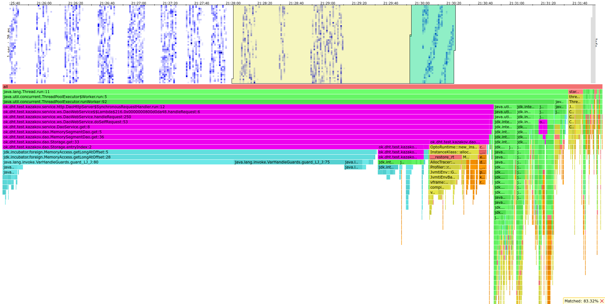
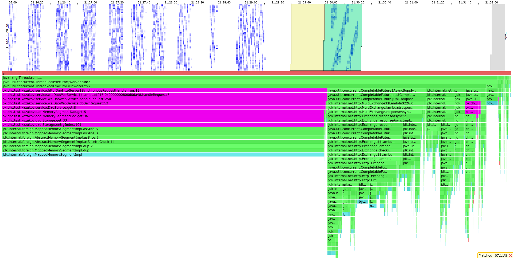
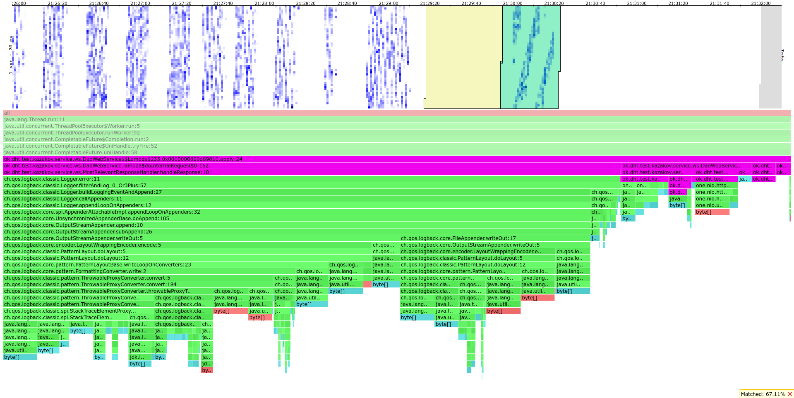
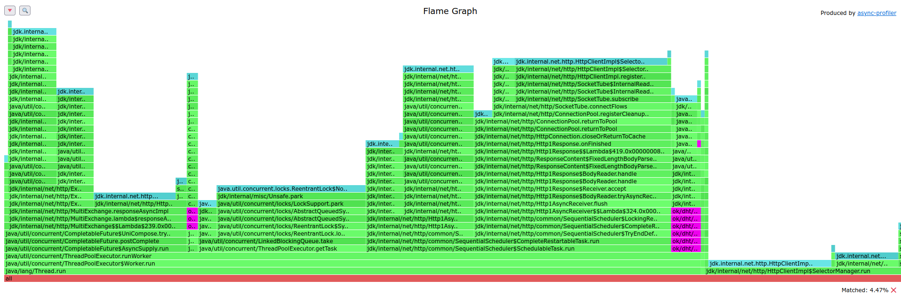
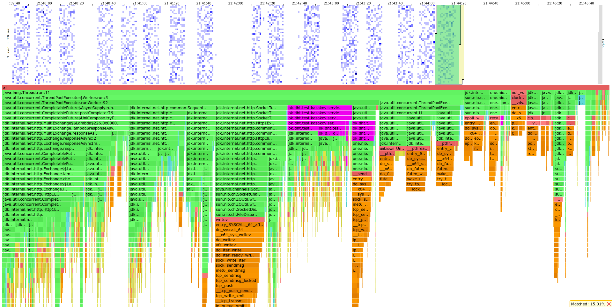
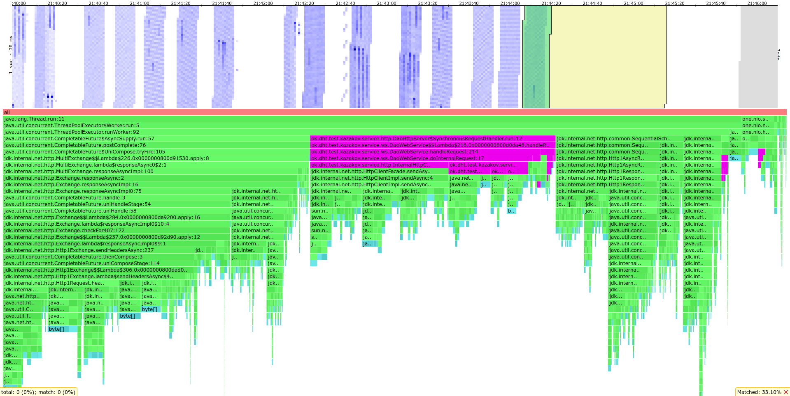
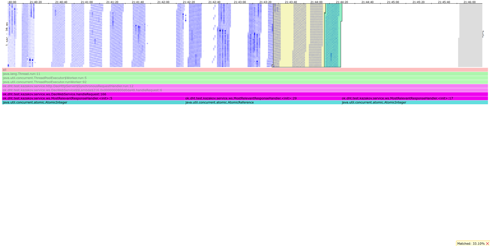
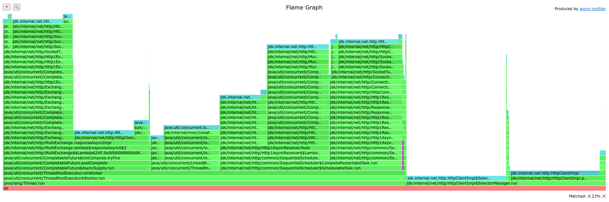

# \>\> Stage 4
> Скрипты для wrk2 можно найти [здесь](../stage4/wrk2_scripts)

> HTML файлы, выведенные async-profiler'ом можно найти [здесь](./profiler_output)

Профилирование проводилось только на "мастер" сервере, на который стрелялись запросы.
Остальные сервера играли такую же роль как и во втором дз - сервер с данными и апишкой.

Тестирование проводилось на заполненной базе и сервере из трех реплик.
На каждой реплике сохранено 4ГБ данных на диске (RAM = 6ГБ, при тестах в дисковом кеше было 3-3,5 ГБ).
У процессора 4 ядра.

## Нагрузочное тестирование

> Скрипты для wrk2 можно найти [здесь](../stage4/wrk2_scripts)

Нагрузочное тестирование проводилось в 64 соединения и 64 потока.
В качестве `from` и `ack` бралось дефолтное значение (кворум).

### Тестирование GET запросами

Найдем стабильный RPS для GET.

Стрельба wrk2 GET'ом на 200 RPS (10 секунд)

<pre>
Running 10s test @ http://localhost:8080
  64 threads and 64 connections
  Thread calibration: mean lat.: 120.256ms, rate sampling interval: 377ms
  Thread calibration: mean lat.: 98.602ms, rate sampling interval: 391ms
  Thread calibration: mean lat.: 80.927ms, rate sampling interval: 291ms
  Thread calibration: mean lat.: 111.765ms, rate sampling interval: 476ms
  Thread calibration: mean lat.: 291.988ms, rate sampling interval: 1090ms
  Thread calibration: mean lat.: 98.988ms, rate sampling interval: 352ms
  Thread calibration: mean lat.: 104.825ms, rate sampling interval: 399ms
  Thread calibration: mean lat.: 106.615ms, rate sampling interval: 455ms
  Thread calibration: mean lat.: 115.585ms, rate sampling interval: 384ms
  Thread calibration: mean lat.: 132.667ms, rate sampling interval: 572ms
  Thread calibration: mean lat.: 124.374ms, rate sampling interval: 403ms
  Thread calibration: mean lat.: 123.082ms, rate sampling interval: 453ms
  Thread calibration: mean lat.: 210.744ms, rate sampling interval: 685ms
  Thread calibration: mean lat.: 114.673ms, rate sampling interval: 391ms
  Thread calibration: mean lat.: 112.145ms, rate sampling interval: 334ms
  Thread calibration: mean lat.: 111.590ms, rate sampling interval: 404ms
  Thread calibration: mean lat.: 127.504ms, rate sampling interval: 453ms
  Thread calibration: mean lat.: 128.485ms, rate sampling interval: 573ms
  Thread calibration: mean lat.: 113.873ms, rate sampling interval: 455ms
  Thread calibration: mean lat.: 91.890ms, rate sampling interval: 349ms
  Thread calibration: mean lat.: 251.584ms, rate sampling interval: 690ms
  Thread calibration: mean lat.: 115.239ms, rate sampling interval: 392ms
  Thread calibration: mean lat.: 118.717ms, rate sampling interval: 415ms
  Thread calibration: mean lat.: 249.392ms, rate sampling interval: 856ms
  Thread calibration: mean lat.: 131.277ms, rate sampling interval: 527ms
  Thread calibration: mean lat.: 130.629ms, rate sampling interval: 484ms
  Thread calibration: mean lat.: 400.959ms, rate sampling interval: 2633ms
  Thread calibration: mean lat.: 222.520ms, rate sampling interval: 654ms
  Thread calibration: mean lat.: 221.552ms, rate sampling interval: 711ms
  Thread calibration: mean lat.: 174.000ms, rate sampling interval: 657ms
  Thread calibration: mean lat.: 108.946ms, rate sampling interval: 384ms
  Thread calibration: mean lat.: 269.984ms, rate sampling interval: 934ms
  Thread calibration: mean lat.: 1138.336ms, rate sampling interval: 4194ms
  Thread calibration: mean lat.: 206.144ms, rate sampling interval: 412ms
  Thread calibration: mean lat.: 284.288ms, rate sampling interval: 568ms
  Thread Stats   Avg      Stdev     Max   +/- Stdev
    Latency   235.92ms  450.49ms   2.22s    90.06%
    Req/Sec       -nan      -nan   0.00      0.00%
  Latency Distribution (HdrHistogram - Recorded Latency)
 50.000%   63.33ms
 75.000%  173.70ms
 90.000%  681.47ms
 99.000%    2.10s 
 99.900%    2.16s 
 99.990%    2.22s 
 99.999%    2.22s 
100.000%    2.22s 

  Detailed Percentile spectrum:
       Value   Percentile   TotalCount 1/(1-Percentile)

       2.823     0.000000            1         1.00
      11.783     0.100000           90         1.11
      18.751     0.200000          179         1.25
      32.991     0.300000          269         1.43
      43.903     0.400000          358         1.67
      63.327     0.500000          448         2.00
      73.663     0.550000          493         2.22
      99.199     0.600000          537         2.50
     121.855     0.650000          582         2.86
     147.967     0.700000          627         3.33
     174.591     0.750000          672         4.00
     207.103     0.775000          694         4.44
     233.727     0.800000          716         5.00
     266.239     0.825000          739         5.71
     342.271     0.850000          761         6.67
     428.799     0.875000          784         8.00
     485.887     0.887500          795         8.89
     681.471     0.900000          806        10.00
     867.839     0.912500          817        11.43
    1080.319     0.925000          828        13.33
    1291.263     0.937500          840        16.00
    1375.231     0.943750          845        17.78
    1479.679     0.950000          851        20.00
    1620.991     0.956250          856        22.86
    1679.359     0.962500          862        26.67
    1795.071     0.968750          868        32.00
    1801.215     0.971875          870        35.56
    1908.735     0.975000          873        40.00
    1918.975     0.978125          876        45.71
    1939.455     0.981250          880        53.33
    1950.719     0.984375          882        64.00
    2056.191     0.985938          883        71.11
    2073.599     0.987500          884        80.00
    2099.199     0.989062          886        91.43
    2103.295     0.990625          887       106.67
    2131.967     0.992188          889       128.00
    2131.967     0.992969          889       142.22
    2146.303     0.993750          890       160.00
    2150.399     0.994531          892       182.86
    2150.399     0.995313          892       213.33
    2150.399     0.996094          892       256.00
    2150.399     0.996484          892       284.44
    2156.543     0.996875          893       320.00
    2156.543     0.997266          893       365.71
    2156.543     0.997656          893       426.67
    2162.687     0.998047          894       512.00
    2162.687     0.998242          894       568.89
    2162.687     0.998437          894       640.00
    2162.687     0.998633          894       731.43
    2162.687     0.998828          894       853.33
    2217.983     0.999023          895      1024.00
    2217.983     1.000000          895          inf
#[Mean    =      235.921, StdDeviation   =      450.488]
#[Max     =     2215.936, Total count    =          895]
#[Buckets =           27, SubBuckets     =         2048]
----------------------------------------------------------
  1722 requests in 9.98s, 363.43KB read
  Socket errors: connect 0, read 0, write 0, timeout 43
  Non-2xx or 3xx responses: 17
Requests/sec:    172.61
Transfer/sec:     36.43KB
</pre>

Видно, что, в 90-м перцентиле ответ дается за 700мс, то есть сервер задыхается на таком RPS.
Таймаут происходит при долгом ответе от реплик или выкидывании из очереди `ExecutorService`'а хттп клиента.
Non-2xx or 3xx responses - может быть либо `Bad Gateway`, либо `Too Many Requests` - опять же перенагрузка на сервер.
Характерные 2000мс в больших перцентилях связаны с таймаутом в хттп клиенте (он ровно такой).
Если запрос задерживается дольше, чем на 2000мс, возвращается `Bad Gateway`.

В выводе `top` вижу 150% CPU у "мастера", и по 110% у остальных (из 400% максимальных).
Также вижу, что всю свободную RAM съел дисковый кеш.

Стрельба wrk2 GET'ом на 100 RPS (20 секунд)

<pre>
Running 20s test @ http://localhost:8080
  64 threads and 64 connections
  Thread calibration: mean lat.: 25.769ms, rate sampling interval: 71ms
  Thread calibration: mean lat.: 39.796ms, rate sampling interval: 87ms
  Thread calibration: mean lat.: 26.096ms, rate sampling interval: 70ms
  Thread calibration: mean lat.: 38.195ms, rate sampling interval: 86ms
  Thread calibration: mean lat.: 43.032ms, rate sampling interval: 191ms
  Thread calibration: mean lat.: 38.903ms, rate sampling interval: 87ms
  Thread calibration: mean lat.: 33.653ms, rate sampling interval: 98ms
  Thread calibration: mean lat.: 80.689ms, rate sampling interval: 274ms
  Thread calibration: mean lat.: 647.637ms, rate sampling interval: 3053ms
  Thread calibration: mean lat.: 400.423ms, rate sampling interval: 1985ms
  Thread calibration: mean lat.: 661.905ms, rate sampling interval: 3086ms
  Thread calibration: mean lat.: 681.141ms, rate sampling interval: 3090ms
  Thread calibration: mean lat.: 529.192ms, rate sampling interval: 3149ms
  Thread calibration: mean lat.: 412.008ms, rate sampling interval: 1986ms
  Thread calibration: mean lat.: 1294.752ms, rate sampling interval: 4112ms
  Thread calibration: mean lat.: 117.770ms, rate sampling interval: 373ms
  Thread calibration: mean lat.: 389.238ms, rate sampling interval: 1862ms
  Thread calibration: mean lat.: 435.778ms, rate sampling interval: 1981ms
  Thread calibration: mean lat.: 154.466ms, rate sampling interval: 469ms
  Thread calibration: mean lat.: 160.200ms, rate sampling interval: 478ms
  Thread calibration: mean lat.: 487.473ms, rate sampling interval: 3260ms
  Thread calibration: mean lat.: 458.704ms, rate sampling interval: 3260ms
  Thread calibration: mean lat.: 565.965ms, rate sampling interval: 3264ms
  Thread calibration: mean lat.: 514.350ms, rate sampling interval: 3098ms
  Thread calibration: mean lat.: 535.270ms, rate sampling interval: 3133ms
  Thread calibration: mean lat.: 107.070ms, rate sampling interval: 325ms
  Thread calibration: mean lat.: 146.618ms, rate sampling interval: 390ms
  Thread calibration: mean lat.: 166.317ms, rate sampling interval: 526ms
  Thread calibration: mean lat.: 117.936ms, rate sampling interval: 355ms
  Thread calibration: mean lat.: 515.414ms, rate sampling interval: 3137ms
  Thread calibration: mean lat.: 162.394ms, rate sampling interval: 526ms
  Thread calibration: mean lat.: 521.609ms, rate sampling interval: 3139ms
  Thread calibration: mean lat.: 398.353ms, rate sampling interval: 1695ms
  Thread calibration: mean lat.: 480.204ms, rate sampling interval: 3125ms
  Thread calibration: mean lat.: 9223372036854776.000ms, rate sampling interval: 10ms
  Thread calibration: mean lat.: 172.488ms, rate sampling interval: 607ms
  Thread calibration: mean lat.: 178.826ms, rate sampling interval: 593ms
  Thread calibration: mean lat.: 192.063ms, rate sampling interval: 579ms
  Thread calibration: mean lat.: 180.274ms, rate sampling interval: 548ms
  Thread calibration: mean lat.: 166.209ms, rate sampling interval: 561ms
  Thread calibration: mean lat.: 9223372036854776.000ms, rate sampling interval: 10ms
  Thread calibration: mean lat.: 9223372036854776.000ms, rate sampling interval: 10ms
  Thread calibration: mean lat.: 183.830ms, rate sampling interval: 574ms
  Thread calibration: mean lat.: 152.418ms, rate sampling interval: 532ms
  Thread calibration: mean lat.: 120.352ms, rate sampling interval: 325ms
  Thread calibration: mean lat.: 201.232ms, rate sampling interval: 664ms
  Thread calibration: mean lat.: 180.839ms, rate sampling interval: 467ms
  Thread calibration: mean lat.: 184.032ms, rate sampling interval: 586ms
  Thread calibration: mean lat.: 197.047ms, rate sampling interval: 642ms
  Thread calibration: mean lat.: 192.186ms, rate sampling interval: 620ms
  Thread calibration: mean lat.: 186.404ms, rate sampling interval: 624ms
  Thread calibration: mean lat.: 195.575ms, rate sampling interval: 585ms
  Thread calibration: mean lat.: 182.271ms, rate sampling interval: 493ms
  Thread calibration: mean lat.: 188.529ms, rate sampling interval: 500ms
  Thread calibration: mean lat.: 208.708ms, rate sampling interval: 622ms
  Thread calibration: mean lat.: 186.076ms, rate sampling interval: 530ms
  Thread calibration: mean lat.: 190.549ms, rate sampling interval: 616ms
  Thread calibration: mean lat.: 224.997ms, rate sampling interval: 636ms
  Thread calibration: mean lat.: 171.969ms, rate sampling interval: 574ms
  Thread calibration: mean lat.: 172.742ms, rate sampling interval: 547ms
  Thread calibration: mean lat.: 170.592ms, rate sampling interval: 482ms
  Thread calibration: mean lat.: 167.894ms, rate sampling interval: 546ms
  Thread calibration: mean lat.: 179.764ms, rate sampling interval: 573ms
  Thread calibration: mean lat.: 196.725ms, rate sampling interval: 567ms
  Thread Stats   Avg      Stdev     Max   +/- Stdev
    Latency   174.71ms  323.50ms   2.16s    95.37%
    Req/Sec     0.42      1.80    14.00     97.24%
  Latency Distribution (HdrHistogram - Recorded Latency)
 50.000%   97.47ms
 75.000%  188.93ms
 90.000%  238.08ms
 99.000%    2.06s 
 99.900%    2.15s 
 99.990%    2.16s 
 99.999%    2.16s 
100.000%    2.16s 

Detailed Percentile spectrum:
Value   Percentile   TotalCount 1/(1-Percentile)

       2.259     0.000000            1         1.00
      15.999     0.100000           72         1.11
      29.471     0.200000          143         1.25
      44.607     0.300000          214         1.43
      65.599     0.400000          285         1.67
      97.471     0.500000          356         2.00
     120.383     0.550000          392         2.22
     145.535     0.600000          428         2.50
     161.407     0.650000          465         2.86
     174.335     0.700000          499         3.33
     188.927     0.750000          536         4.00
     196.095     0.775000          552         4.44
     200.191     0.800000          570         5.00
     209.279     0.825000          588         5.71
     212.735     0.850000          606         6.67
     225.919     0.875000          623         8.00
     228.735     0.887500          634         8.89
     238.079     0.900000          641        10.00
     248.447     0.912500          650        11.43
     266.751     0.925000          659        13.33
     301.567     0.937500          668        16.00
     335.615     0.943750          672        17.78
     357.887     0.950000          677        20.00
     901.119     0.956250          681        22.86
     940.031     0.962500          686        26.67
     969.215     0.968750          690        32.00
    1528.831     0.971875          692        35.56
    1537.023     0.975000          695        40.00
    1542.143     0.978125          697        45.71
    1556.479     0.981250          699        53.33
    1562.623     0.984375          701        64.00
    2019.327     0.985938          702        71.11
    2052.095     0.987500          704        80.00
    2058.239     0.989062          705        91.43
    2065.407     0.990625          706       106.67
    2069.503     0.992188          707       128.00
    2069.503     0.992969          707       142.22
    2070.527     0.993750          708       160.00
    2074.623     0.994531          709       182.86
    2074.623     0.995313          709       213.33
    2144.255     0.996094          710       256.00
    2144.255     0.996484          710       284.44
    2144.255     0.996875          710       320.00
    2150.399     0.997266          711       365.71
    2150.399     0.997656          711       426.67
    2150.399     0.998047          711       512.00
    2150.399     0.998242          711       568.89
    2150.399     0.998437          711       640.00
    2158.591     0.998633          712       731.43
    2158.591     1.000000          712          inf
#[Mean    =      174.712, StdDeviation   =      323.500]
#[Max     =     2156.544, Total count    =          712]
#[Buckets =           27, SubBuckets     =         2048]
----------------------------------------------------------
1607 requests in 20.06s, 345.22KB read
Socket errors: connect 0, read 0, write 0, timeout 145
Non-2xx or 3xx responses: 46
Requests/sec:     80.11
Transfer/sec:     17.21KB
</pre>

Видно, что, в 90-м перцентиле ответ дается уже за 240мс, но таймауты все еще заметны.

Стрельба wrk2 GET'ом на 70 RPS (20 секунд)

<pre>
Running 20s test @ http://localhost:8080
  64 threads and 64 connections
  Thread calibration: mean lat.: 70.544ms, rate sampling interval: 265ms
  Thread calibration: mean lat.: 118.546ms, rate sampling interval: 434ms
  Thread calibration: mean lat.: 82.411ms, rate sampling interval: 294ms
  Thread calibration: mean lat.: 103.411ms, rate sampling interval: 502ms
  Thread calibration: mean lat.: 127.306ms, rate sampling interval: 488ms
  Thread calibration: mean lat.: 109.670ms, rate sampling interval: 430ms
  Thread calibration: mean lat.: 109.816ms, rate sampling interval: 290ms
  Thread calibration: mean lat.: 120.749ms, rate sampling interval: 492ms
  Thread calibration: mean lat.: 396.416ms, rate sampling interval: 2461ms
  Thread calibration: mean lat.: 113.365ms, rate sampling interval: 488ms
  Thread calibration: mean lat.: 123.951ms, rate sampling interval: 482ms
  Thread calibration: mean lat.: 423.700ms, rate sampling interval: 2531ms
  Thread calibration: mean lat.: 431.915ms, rate sampling interval: 2488ms
  Thread calibration: mean lat.: 140.330ms, rate sampling interval: 419ms
  Thread calibration: mean lat.: 129.300ms, rate sampling interval: 474ms
  Thread calibration: mean lat.: 421.200ms, rate sampling interval: 2437ms
  Thread calibration: mean lat.: 130.766ms, rate sampling interval: 405ms
  Thread calibration: mean lat.: 431.159ms, rate sampling interval: 2316ms
  Thread calibration: mean lat.: 148.565ms, rate sampling interval: 519ms
  Thread calibration: mean lat.: 192.302ms, rate sampling interval: 783ms
  Thread calibration: mean lat.: 431.223ms, rate sampling interval: 2312ms
  Thread calibration: mean lat.: 168.164ms, rate sampling interval: 508ms
  Thread calibration: mean lat.: 176.455ms, rate sampling interval: 540ms
  Thread calibration: mean lat.: 491.937ms, rate sampling interval: 2578ms
  Thread calibration: mean lat.: 157.229ms, rate sampling interval: 485ms
  Thread calibration: mean lat.: 117.870ms, rate sampling interval: 379ms
  Thread calibration: mean lat.: 242.430ms, rate sampling interval: 690ms
  Thread calibration: mean lat.: 180.149ms, rate sampling interval: 596ms
  Thread calibration: mean lat.: 447.613ms, rate sampling interval: 2322ms
  Thread calibration: mean lat.: 215.936ms, rate sampling interval: 603ms
  Thread calibration: mean lat.: 173.530ms, rate sampling interval: 456ms
  Thread calibration: mean lat.: 593.236ms, rate sampling interval: 2615ms
  Thread calibration: mean lat.: 146.075ms, rate sampling interval: 452ms
  Thread calibration: mean lat.: 184.854ms, rate sampling interval: 582ms
  Thread calibration: mean lat.: 434.116ms, rate sampling interval: 2527ms
  Thread calibration: mean lat.: 457.442ms, rate sampling interval: 2551ms
  Thread calibration: mean lat.: 147.446ms, rate sampling interval: 537ms
  Thread calibration: mean lat.: 158.424ms, rate sampling interval: 395ms
  Thread calibration: mean lat.: 441.410ms, rate sampling interval: 2492ms
  Thread calibration: mean lat.: 178.959ms, rate sampling interval: 689ms
  Thread calibration: mean lat.: 172.026ms, rate sampling interval: 568ms
  Thread calibration: mean lat.: 489.646ms, rate sampling interval: 2512ms
  Thread calibration: mean lat.: 474.097ms, rate sampling interval: 2508ms
  Thread calibration: mean lat.: 160.742ms, rate sampling interval: 443ms
  Thread calibration: mean lat.: 486.062ms, rate sampling interval: 2439ms
  Thread calibration: mean lat.: 491.412ms, rate sampling interval: 2437ms
  Thread calibration: mean lat.: 494.222ms, rate sampling interval: 2482ms
  Thread calibration: mean lat.: 206.999ms, rate sampling interval: 617ms
  Thread calibration: mean lat.: 191.501ms, rate sampling interval: 663ms
  Thread calibration: mean lat.: 193.255ms, rate sampling interval: 631ms
  Thread calibration: mean lat.: 161.202ms, rate sampling interval: 666ms
  Thread calibration: mean lat.: 501.466ms, rate sampling interval: 2435ms
  Thread calibration: mean lat.: 201.795ms, rate sampling interval: 651ms
  Thread calibration: mean lat.: 209.141ms, rate sampling interval: 678ms
  Thread calibration: mean lat.: 196.743ms, rate sampling interval: 668ms
  Thread calibration: mean lat.: 202.596ms, rate sampling interval: 659ms
  Thread calibration: mean lat.: 216.064ms, rate sampling interval: 706ms
  Thread calibration: mean lat.: 209.747ms, rate sampling interval: 675ms
  Thread calibration: mean lat.: 212.507ms, rate sampling interval: 686ms
  Thread calibration: mean lat.: 503.042ms, rate sampling interval: 2473ms
  Thread calibration: mean lat.: 211.422ms, rate sampling interval: 707ms
  Thread calibration: mean lat.: 189.941ms, rate sampling interval: 677ms
  Thread calibration: mean lat.: 189.031ms, rate sampling interval: 644ms
  Thread calibration: mean lat.: 172.966ms, rate sampling interval: 684ms
  Thread Stats   Avg      Stdev     Max   +/- Stdev
    Latency   151.86ms  265.05ms   2.07s    97.24%
    Req/Sec     0.72      0.93     6.00     95.75%
  Latency Distribution (HdrHistogram - Recorded Latency)
 50.000%   93.31ms
 75.000%  163.46ms
 90.000%  216.45ms
 99.000%    2.02s 
 99.900%    2.03s 
 99.990%    2.07s 
 99.999%    2.07s 
100.000%    2.07s 

Detailed Percentile spectrum:
Value   Percentile   TotalCount 1/(1-Percentile)

      12.383     0.000000            1         1.00
      35.775     0.100000           58         1.11
      46.527     0.200000          116         1.25
      56.575     0.300000          174         1.43
      73.855     0.400000          232         1.67
      93.311     0.500000          290         2.00
     107.199     0.550000          319         2.22
     125.375     0.600000          348         2.50
     140.927     0.650000          377         2.86
     155.007     0.700000          406         3.33
     163.711     0.750000          435         4.00
     171.391     0.775000          449         4.44
     177.535     0.800000          466         5.00
     181.119     0.825000          478         5.71
     189.951     0.850000          493         6.67
     200.063     0.875000          507         8.00
     206.079     0.887500          514         8.89
     217.343     0.900000          522        10.00
     223.999     0.912500          529        11.43
     233.599     0.925000          536        13.33
     260.351     0.937500          543        16.00
     314.111     0.943750          547        17.78
     318.975     0.950000          552        20.00
     323.071     0.956250          554        22.86
     328.703     0.962500          558        26.67
     334.847     0.968750          561        32.00
     391.679     0.971875          563        35.56
    1145.855     0.975000          565        40.00
    1186.815     0.978125          567        45.71
    1213.439     0.981250          569        53.33
    1231.871     0.984375          570        64.00
    1245.183     0.985938          571        71.11
    2008.063     0.987500          572        80.00
    2015.231     0.989062          573        91.43
    2023.423     0.990625          574       106.67
    2025.471     0.992188          576       128.00
    2025.471     0.992969          576       142.22
    2025.471     0.993750          576       160.00
    2025.471     0.994531          576       182.86
    2030.591     0.995313          578       213.33
    2030.591     0.996094          578       256.00
    2030.591     0.996484          578       284.44
    2030.591     0.996875          578       320.00
    2030.591     0.997266          578       365.71
    2030.591     0.997656          578       426.67
    2030.591     0.998047          578       512.00
    2030.591     0.998242          578       568.89
    2066.431     0.998437          579       640.00
    2066.431     1.000000          579          inf
#[Mean    =      151.855, StdDeviation   =      265.046]
#[Max     =     2065.408, Total count    =          579]
#[Buckets =           27, SubBuckets     =         2048]
----------------------------------------------------------
1265 requests in 20.11s, 248.08KB read
Socket errors: connect 0, read 0, write 0, timeout 61
Non-2xx or 3xx responses: 42
Requests/sec:     62.90
Transfer/sec:     12.34KB
</pre>

Теперь, в 90-м перцентиле ответ дается за 210мс.
Таймауты так же остались.
Я решил, что таймаут происходит из-за cache-miss'а в дисковый кеш.
Произойти он может часто, так как файлов много (компактификация не настроена).
Поэтому считаю, что 100 RPS - стабильная нагрузка на сервер.

В продакшене пришлось бы настраивать компактификацию для ускорения GET запросов.

### Тестирование PUT запросами

Найдем стабильный RPS для PUT.

Стрельба wrk2 PUT'ом на 3000 RPS

<pre>
Running 10s test @ http://localhost:8080
  64 threads and 64 connections
  Thread calibration: mean lat.: 1.718ms, rate sampling interval: 10ms
  Thread calibration: mean lat.: 304.965ms, rate sampling interval: 27ms
  Thread calibration: mean lat.: 1.726ms, rate sampling interval: 10ms
  Thread calibration: mean lat.: 1.674ms, rate sampling interval: 10ms
  Thread calibration: mean lat.: 2.381ms, rate sampling interval: 10ms
  Thread calibration: mean lat.: 2.024ms, rate sampling interval: 10ms
  Thread calibration: mean lat.: 230.430ms, rate sampling interval: 2256ms
  Thread calibration: mean lat.: 1.771ms, rate sampling interval: 10ms
  Thread calibration: mean lat.: 1.787ms, rate sampling interval: 10ms
  Thread calibration: mean lat.: 186.790ms, rate sampling interval: 2963ms
  Thread calibration: mean lat.: 221.625ms, rate sampling interval: 2166ms
  Thread calibration: mean lat.: 1.879ms, rate sampling interval: 10ms
  Thread calibration: mean lat.: 246.707ms, rate sampling interval: 2828ms
  Thread calibration: mean lat.: 232.087ms, rate sampling interval: 2306ms
  Thread calibration: mean lat.: 2.014ms, rate sampling interval: 10ms
  Thread calibration: mean lat.: 1.909ms, rate sampling interval: 10ms
  Thread calibration: mean lat.: 258.402ms, rate sampling interval: 2461ms
  Thread calibration: mean lat.: 1.995ms, rate sampling interval: 10ms
  Thread calibration: mean lat.: 1.882ms, rate sampling interval: 10ms
  Thread calibration: mean lat.: 214.764ms, rate sampling interval: 2109ms
  Thread calibration: mean lat.: 1.607ms, rate sampling interval: 10ms
  Thread calibration: mean lat.: 1.747ms, rate sampling interval: 10ms
  Thread calibration: mean lat.: 911.607ms, rate sampling interval: 6250ms
  Thread calibration: mean lat.: 905.525ms, rate sampling interval: 6242ms
  Thread calibration: mean lat.: 308.554ms, rate sampling interval: 2713ms
  Thread calibration: mean lat.: 110.970ms, rate sampling interval: 10ms
  Thread calibration: mean lat.: 904.274ms, rate sampling interval: 6221ms
  Thread calibration: mean lat.: 1521.760ms, rate sampling interval: 10747ms
  Thread calibration: mean lat.: 1.866ms, rate sampling interval: 10ms
  Thread calibration: mean lat.: 401.154ms, rate sampling interval: 3033ms
  Thread calibration: mean lat.: 57.754ms, rate sampling interval: 10ms
  Thread calibration: mean lat.: 2.354ms, rate sampling interval: 10ms
  Thread calibration: mean lat.: 14.278ms, rate sampling interval: 10ms
  Thread calibration: mean lat.: 2.170ms, rate sampling interval: 10ms
  Thread calibration: mean lat.: 2.293ms, rate sampling interval: 10ms
  Thread calibration: mean lat.: 2.053ms, rate sampling interval: 10ms
  Thread calibration: mean lat.: 2.487ms, rate sampling interval: 10ms
  Thread calibration: mean lat.: 2.704ms, rate sampling interval: 10ms
  Thread calibration: mean lat.: 1644.802ms, rate sampling interval: 7045ms
  Thread calibration: mean lat.: 217.862ms, rate sampling interval: 2865ms
  Thread calibration: mean lat.: 191.039ms, rate sampling interval: 2920ms
  Thread calibration: mean lat.: 1.840ms, rate sampling interval: 10ms
  Thread calibration: mean lat.: 1.716ms, rate sampling interval: 10ms
  Thread Stats   Avg      Stdev     Max   +/- Stdev
    Latency   302.51ms  834.06ms   5.73s    89.19%
    Req/Sec       -nan      -nan   0.00      0.00%
  Latency Distribution (HdrHistogram - Recorded Latency)
 50.000%    1.70ms
 75.000%    2.96ms
 90.000%    1.27s 
 99.000%    3.93s 
 99.900%    5.53s 
 99.990%    5.71s 
 99.999%    5.73s 
100.000%    5.73s 

  Detailed Percentile spectrum:
       Value   Percentile   TotalCount 1/(1-Percentile)

       0.459     0.000000            1         1.00
       0.942     0.100000          978         1.11
       1.157     0.200000         1957         1.25
       1.343     0.300000         2938         1.43
       1.506     0.400000         3913         1.67
       1.696     0.500000         4889         2.00
       1.805     0.550000         5380         2.22
       1.944     0.600000         5866         2.50
       2.139     0.650000         6355         2.86
       2.415     0.700000         6848         3.33
       2.963     0.750000         7332         4.00
       3.579     0.775000         7576         4.44
       4.883     0.800000         7820         5.00
      54.847     0.825000         8065         5.71
     463.103     0.850000         8309         6.67
     863.743     0.875000         8554         8.00
    1071.103     0.887500         8676         8.89
    1269.759     0.900000         8798        10.00
    1471.487     0.912500         8920        11.43
    1668.095     0.925000         9042        13.33
    1868.799     0.937500         9167        16.00
    1952.767     0.943750         9226        17.78
    2063.359     0.950000         9287        20.00
    2359.295     0.956250         9348        22.86
    2658.303     0.962500         9409        26.67
    2953.215     0.968750         9470        32.00
    3110.911     0.971875         9502        35.56
    3254.271     0.975000         9531        40.00
    3401.727     0.978125         9563        45.71
    3543.039     0.981250         9592        53.33
    3686.399     0.984375         9623        64.00
    3753.983     0.985938         9638        71.11
    3825.663     0.987500         9654        80.00
    3897.343     0.989062         9669        91.43
    3969.023     0.990625         9685       106.67
    4194.303     0.992188         9699       128.00
    4358.143     0.992969         9707       142.22
    4501.503     0.993750         9714       160.00
    4665.343     0.994531         9722       182.86
    4825.087     0.995313         9730       213.33
    4956.159     0.996094         9737       256.00
    5038.079     0.996484         9741       284.44
    5119.999     0.996875         9745       320.00
    5201.919     0.997266         9749       365.71
    5283.839     0.997656         9753       426.67
    5345.279     0.998047         9756       512.00
    5390.335     0.998242         9758       568.89
    5431.295     0.998437         9760       640.00
    5472.255     0.998633         9762       731.43
    5513.215     0.998828         9764       853.33
    5554.175     0.999023         9766      1024.00
    5574.655     0.999121         9767      1137.78
    5595.135     0.999219         9768      1280.00
    5615.615     0.999316         9769      1462.86
    5636.095     0.999414         9770      1706.67
    5656.575     0.999512         9771      2048.00
    5656.575     0.999561         9771      2275.56
    5677.055     0.999609         9772      2560.00
    5677.055     0.999658         9772      2925.71
    5697.535     0.999707         9773      3413.33
    5697.535     0.999756         9773      4096.00
    5697.535     0.999780         9773      4551.11
    5713.919     0.999805         9774      5120.00
    5713.919     0.999829         9774      5851.43
    5713.919     0.999854         9774      6826.67
    5713.919     0.999878         9774      8192.00
    5713.919     0.999890         9774      9102.22
    5734.399     0.999902         9775     10240.00
    5734.399     1.000000         9775          inf
#[Mean    =      302.512, StdDeviation   =      834.058]
#[Max     =     5730.304, Total count    =         9775]
#[Buckets =           27, SubBuckets     =         2048]
----------------------------------------------------------
  23018 requests in 10.00s, 1.47MB read
  Socket errors: connect 0, read 0, write 0, timeout 57
  Non-2xx or 3xx responses: 45
Requests/sec:   2300.82
Transfer/sec:    150.58KB
</pre>

Сервер задыхается.
В выводе `top` наблюдаю по CPU 250% у "мастера", по 30% у остальных (остальное съел wrk).
Отсюда становится понятно, что основную нагрузку на CPU дает общение по сети.
Таймауты скорее всего произошли из-за высокой нагрузки на CPU
и невозможности отправки некоторых запросов на другие реплики.
Много таймаутов, посмотрим дальше.

Стрельба wrk2 PUT'ом на 2200 RPS

<pre>
Running 10s test @ http://localhost:8080
  64 threads and 64 connections
  Thread calibration: mean lat.: 1.396ms, rate sampling interval: 10ms
  Thread calibration: mean lat.: 1.535ms, rate sampling interval: 10ms
  Thread calibration: mean lat.: 1.789ms, rate sampling interval: 10ms
  Thread calibration: mean lat.: 1.673ms, rate sampling interval: 10ms
  Thread calibration: mean lat.: 213.716ms, rate sampling interval: 2121ms
  Thread calibration: mean lat.: 1.542ms, rate sampling interval: 10ms
  Thread calibration: mean lat.: 1.386ms, rate sampling interval: 10ms
  Thread calibration: mean lat.: 1.496ms, rate sampling interval: 10ms
  Thread calibration: mean lat.: 1.384ms, rate sampling interval: 10ms
  Thread calibration: mean lat.: 1.301ms, rate sampling interval: 10ms
  Thread calibration: mean lat.: 1.283ms, rate sampling interval: 10ms
  Thread calibration: mean lat.: 1.288ms, rate sampling interval: 10ms
  Thread calibration: mean lat.: 1.210ms, rate sampling interval: 10ms
  Thread calibration: mean lat.: 1.245ms, rate sampling interval: 10ms
  Thread calibration: mean lat.: 1.253ms, rate sampling interval: 10ms
  Thread calibration: mean lat.: 1.150ms, rate sampling interval: 10ms
  Thread calibration: mean lat.: 1.167ms, rate sampling interval: 10ms
  Thread calibration: mean lat.: 1.131ms, rate sampling interval: 10ms
  Thread calibration: mean lat.: 1.178ms, rate sampling interval: 10ms
  Thread calibration: mean lat.: 1.148ms, rate sampling interval: 10ms
  Thread calibration: mean lat.: 1.212ms, rate sampling interval: 10ms
  Thread calibration: mean lat.: 1.256ms, rate sampling interval: 10ms
  Thread calibration: mean lat.: 1.241ms, rate sampling interval: 10ms
  Thread calibration: mean lat.: 1.307ms, rate sampling interval: 10ms
  Thread calibration: mean lat.: 1.242ms, rate sampling interval: 10ms
  Thread calibration: mean lat.: 1.207ms, rate sampling interval: 10ms
  Thread calibration: mean lat.: 1.185ms, rate sampling interval: 10ms
  Thread calibration: mean lat.: 1.473ms, rate sampling interval: 10ms
  Thread calibration: mean lat.: 1.635ms, rate sampling interval: 10ms
  Thread calibration: mean lat.: 1.182ms, rate sampling interval: 10ms
  Thread calibration: mean lat.: 1.644ms, rate sampling interval: 10ms
  Thread calibration: mean lat.: 1.701ms, rate sampling interval: 10ms
  Thread calibration: mean lat.: 1.681ms, rate sampling interval: 10ms
  Thread calibration: mean lat.: 1.686ms, rate sampling interval: 10ms
  Thread calibration: mean lat.: 1.448ms, rate sampling interval: 10ms
  Thread calibration: mean lat.: 1.522ms, rate sampling interval: 10ms
  Thread Stats   Avg      Stdev     Max   +/- Stdev
    Latency    16.58ms  141.67ms   2.00s    98.62%
    Req/Sec       -nan      -nan   0.00      0.00%
  Latency Distribution (HdrHistogram - Recorded Latency)
 50.000%    1.44ms
 75.000%    1.79ms
 90.000%    2.19ms
 99.000%  649.22ms
 99.900%    1.87s 
 99.990%    2.00s 
 99.999%    2.00s 
100.000%    2.00s 

  Detailed Percentile spectrum:
       Value   Percentile   TotalCount 1/(1-Percentile)

       0.463     0.000000            1         1.00
       0.887     0.100000          957         1.11
       1.055     0.200000         1917         1.25
       1.188     0.300000         2877         1.43
       1.319     0.400000         3836         1.67
       1.441     0.500000         4789         2.00
       1.503     0.550000         5275         2.22
       1.564     0.600000         5746         2.50
       1.631     0.650000         6221         2.86
       1.711     0.700000         6703         3.33
       1.793     0.750000         7178         4.00
       1.840     0.775000         7420         4.44
       1.896     0.800000         7659         5.00
       1.951     0.825000         7896         5.71
       2.019     0.850000         8135         6.67
       2.097     0.875000         8380         8.00
       2.139     0.887500         8496         8.89
       2.189     0.900000         8618        10.00
       2.259     0.912500         8734        11.43
       2.347     0.925000         8853        13.33
       2.471     0.937500         8972        16.00
       2.547     0.943750         9033        17.78
       2.645     0.950000         9092        20.00
       2.773     0.956250         9152        22.86
       2.969     0.962500         9212        26.67
       3.273     0.968750         9271        32.00
       3.517     0.971875         9301        35.56
       4.043     0.975000         9331        40.00
       4.683     0.978125         9361        45.71
       5.875     0.981250         9391        53.33
       9.663     0.984375         9421        64.00
     112.063     0.985938         9436        71.11
     333.567     0.987500         9451        80.00
     536.063     0.989062         9466        91.43
     758.783     0.990625         9481       106.67
     961.535     0.992188         9496       128.00
    1071.103     0.992969         9503       142.22
    1184.767     0.993750         9511       160.00
    1274.879     0.994531         9518       182.86
    1388.543     0.995313         9526       213.33
    1497.087     0.996094         9533       256.00
    1554.431     0.996484         9537       284.44
    1610.751     0.996875         9541       320.00
    1645.567     0.997266         9544       365.71
    1700.863     0.997656         9548       426.67
    1758.207     0.998047         9552       512.00
    1785.855     0.998242         9554       568.89
    1813.503     0.998437         9556       640.00
    1837.055     0.998633         9557       731.43
    1865.727     0.998828         9559       853.33
    1894.399     0.999023         9561      1024.00
    1898.495     0.999121         9562      1137.78
    1922.047     0.999219         9563      1280.00
    1926.143     0.999316         9564      1462.86
    1950.719     0.999414         9565      1706.67
    1953.791     0.999512         9566      2048.00
    1953.791     0.999561         9566      2275.56
    1978.367     0.999609         9567      2560.00
    1978.367     0.999658         9567      2925.71
    1981.439     0.999707         9568      3413.33
    1981.439     0.999756         9568      4096.00
    1981.439     0.999780         9568      4551.11
    2001.919     0.999805         9569      5120.00
    2001.919     0.999829         9569      5851.43
    2001.919     0.999854         9569      6826.67
    2001.919     0.999878         9569      8192.00
    2001.919     0.999890         9569      9102.22
    2004.991     0.999902         9570     10240.00
    2004.991     1.000000         9570          inf
#[Mean    =       16.584, StdDeviation   =      141.668]
#[Max     =     2003.968, Total count    =         9570]
#[Buckets =           27, SubBuckets     =         2048]
----------------------------------------------------------
  21789 requests in 9.99s, 1.39MB read
  Socket errors: connect 0, read 0, write 0, timeout 2
  Non-2xx or 3xx responses: 3
Requests/sec:   2181.71
Transfer/sec:    142.75KB
</pre>

Все еще задыхается. Но таймаутов уже поменьше. Может получится без них? 🥺

Стрельба wrk2 PUT'ом на 2000 RPS

<pre>
Running 10s test @ http://localhost:8080
  64 threads and 64 connections
  Thread calibration: mean lat.: 1.487ms, rate sampling interval: 10ms
  Thread calibration: mean lat.: 1.346ms, rate sampling interval: 10ms
  Thread calibration: mean lat.: 1.457ms, rate sampling interval: 10ms
  Thread calibration: mean lat.: 1.628ms, rate sampling interval: 10ms
  Thread calibration: mean lat.: 1.868ms, rate sampling interval: 10ms
  Thread calibration: mean lat.: 1.883ms, rate sampling interval: 10ms
  Thread calibration: mean lat.: 1.755ms, rate sampling interval: 10ms
  Thread calibration: mean lat.: 1.343ms, rate sampling interval: 10ms
  Thread calibration: mean lat.: 1.349ms, rate sampling interval: 10ms
  Thread calibration: mean lat.: 1.449ms, rate sampling interval: 10ms
  Thread calibration: mean lat.: 1.220ms, rate sampling interval: 10ms
  Thread calibration: mean lat.: 1.288ms, rate sampling interval: 10ms
  Thread calibration: mean lat.: 1.314ms, rate sampling interval: 10ms
  Thread calibration: mean lat.: 1.213ms, rate sampling interval: 10ms
  Thread calibration: mean lat.: 1.116ms, rate sampling interval: 10ms
  Thread calibration: mean lat.: 1.093ms, rate sampling interval: 10ms
  Thread calibration: mean lat.: 1.110ms, rate sampling interval: 10ms
  Thread calibration: mean lat.: 1.464ms, rate sampling interval: 10ms
  Thread calibration: mean lat.: 1.499ms, rate sampling interval: 10ms
  Thread calibration: mean lat.: 1.361ms, rate sampling interval: 10ms
  Thread calibration: mean lat.: 1.409ms, rate sampling interval: 10ms
  Thread calibration: mean lat.: 1.489ms, rate sampling interval: 10ms
  Thread calibration: mean lat.: 1.257ms, rate sampling interval: 10ms
  Thread calibration: mean lat.: 1.285ms, rate sampling interval: 10ms
  Thread Stats   Avg      Stdev     Max   +/- Stdev
    Latency     1.41ms  554.10us   7.96ms   79.63%
    Req/Sec       -nan      -nan   0.00      0.00%
  Latency Distribution (HdrHistogram - Recorded Latency)
 50.000%    1.35ms
 75.000%    1.63ms
 90.000%    1.97ms
 99.000%    3.40ms
 99.900%    5.98ms
 99.990%    7.78ms
 99.999%    7.97ms
100.000%    7.97ms

  Detailed Percentile spectrum:
       Value   Percentile   TotalCount 1/(1-Percentile)

       0.460     0.000000            1         1.00
       0.844     0.100000         1249         1.11
       0.995     0.200000         2498         1.25
       1.116     0.300000         3738         1.43
       1.235     0.400000         4982         1.67
       1.346     0.500000         6233         2.00
       1.398     0.550000         6854         2.22
       1.453     0.600000         7481         2.50
       1.507     0.650000         8101         2.86
       1.567     0.700000         8719         3.33
       1.635     0.750000         9343         4.00
       1.675     0.775000         9653         4.44
       1.716     0.800000         9962         5.00
       1.763     0.825000        10271         5.71
       1.813     0.850000        10583         6.67
       1.886     0.875000        10900         8.00
       1.924     0.887500        11052         8.89
       1.966     0.900000        11210        10.00
       2.016     0.912500        11363        11.43
       2.067     0.925000        11516        13.33
       2.135     0.937500        11671        16.00
       2.177     0.943750        11750        17.78
       2.239     0.950000        11833        20.00
       2.289     0.956250        11905        22.86
       2.375     0.962500        11983        26.67
       2.467     0.968750        12060        32.00
       2.533     0.971875        12099        35.56
       2.605     0.975000        12138        40.00
       2.693     0.978125        12177        45.71
       2.809     0.981250        12216        53.33
       2.921     0.984375        12256        64.00
       3.059     0.985938        12274        71.11
       3.195     0.987500        12294        80.00
       3.331     0.989062        12313        91.43
       3.457     0.990625        12333       106.67
       3.637     0.992188        12352       128.00
       3.825     0.992969        12362       142.22
       4.015     0.993750        12372       160.00
       4.159     0.994531        12381       182.86
       4.395     0.995313        12391       213.33
       4.603     0.996094        12401       256.00
       4.719     0.996484        12406       284.44
       4.815     0.996875        12411       320.00
       4.911     0.997266        12415       365.71
       5.123     0.997656        12420       426.67
       5.327     0.998047        12425       512.00
       5.503     0.998242        12428       568.89
       5.715     0.998437        12430       640.00
       5.859     0.998633        12432       731.43
       5.943     0.998828        12435       853.33
       5.979     0.999023        12437      1024.00
       6.411     0.999121        12439      1137.78
       6.419     0.999219        12440      1280.00
       6.459     0.999316        12441      1462.86
       6.627     0.999414        12442      1706.67
       6.643     0.999512        12443      2048.00
       6.679     0.999561        12444      2275.56
       6.747     0.999609        12445      2560.00
       6.747     0.999658        12445      2925.71
       6.871     0.999707        12446      3413.33
       6.871     0.999756        12446      4096.00
       7.111     0.999780        12447      4551.11
       7.111     0.999805        12447      5120.00
       7.111     0.999829        12447      5851.43
       7.779     0.999854        12448      6826.67
       7.779     0.999878        12448      8192.00
       7.779     0.999890        12448      9102.22
       7.779     0.999902        12448     10240.00
       7.779     0.999915        12448     11702.86
       7.967     0.999927        12449     13653.33
       7.967     1.000000        12449          inf
#[Mean    =        1.406, StdDeviation   =        0.554]
#[Max     =        7.964, Total count    =        12449]
#[Buckets =           27, SubBuckets     =         2048]
----------------------------------------------------------
  20001 requests in 9.99s, 1.28MB read
Requests/sec:   2002.53
Transfer/sec:    131.02KB
</pre>

На таком RPS таймаутов не появилось, но вероятность такого все еще есть.
Тем не менее latency получилось довольно низким, оно не превзошло 10мс.
Будем считать, это стабильным RPS.

## Профилирование и оптимизации

> HTML файлы, выведенные async-profiler'ом можно найти [здесь](./profiler_output)

В flame graph'ах семплы помеченные фиолетовым цветом содержат в себе подстроку `kazakov`,
то есть это код, который написал я (либо это референсная DAO).

### Профилирование GET запросов

Flame graph по CPU для GET запросов

По сравнению с прошлым этапом увеличилась нагрузка на DAO "мастера".
Это происходит из-за того, что теперь на мастере исполняются все запросы.
Оптимизировать это можно на клиенте: посылать запросы `ack = 2`, `from = 2`.
В таком случае, при недоступности какой-то ноды запросы могут начать фейлиться.
Можно на мастере использовать circuit breaker и посылать запросы только на живые ноды -
можно посылать ровно `ack` запросов, а если нужная нода "умрет", посылать на остальные.
Также можно перестать отправлять запросы на другие реплики, если ответ клиенту уже отправлен
(что и было сделано в рамках небольшой оптимизации).

Желтый отрезок чуть првее центра связан с профилированием аллокаций.
Как я понимаю, это из-за того, что `Storage.get` очень активно аллоцирует `MappedMemorySegmentImpl`.
Поэтому сбор семпла в этом месте очень част.
Почему не что-то глубже?
Ведь аллокация происходит не прямо в этом методе.
Заметим, что почти все под `Storage.get` покрашено в голубой цвет - заинлайнено.
Поэтому и аллокация заинлайнена.

Также видно, что поход в DAO сильно дольше, чем поход в соседние ноды.

Flame graph по Alloc для GET запросов

По аллокациям запросы в соседние ноды все же приближаются к походу в DAO.
Посмотрим на правый фиолетовый отрезок поближе.

Flame graph по Alloc для GET запросов (правый фиолетовый отрезок)

Довольно много времени заняла запись в лог таймаута при общении между нодами.
Как уже было сказано, таймауты происходят скорее всего из-за кеш мисса в дисковый кеш.

* Такое можно починить более быстрым доступом к диску (быстрее работаешь - меньше ошибок таймаута),
но такое решение обычно слишком дорогое.
* Можно подкрутить таймаут под прод (больше таймаут - меньше ошибок таймаута),
но при постоянном повышении таймаута можно оказаться в ситуации, когда сервер отвечает минуту.
* Можно писать ошибки таймаута в дебаг логи, тогда прод не пострадает.
* Можно писать как и раньше, но без стектрейса.

Комбинация последних двух предложений и была добавлена как оптимизация в код.
Семплов стало поменьше, но в целом RPS не изменился.

Flame graph по lock для GET запросов

По сравнению с прошлым этапом больше семплов стало попадать на межсерверный клиент.
И понятно почему - вместо 0.66 межсерверных запросов в среднем,
стало 2 межсерверных запроса на клиентский запрос.

### Профилирование PUT запросов

Flame graph по CPU для PUT запросов

Также ожидаемо выросли затраты на хттп общение.
На сам `DaoMemory.put` попало лишь `0.33%` семплов, из-за чего RPS и стал таким низким.

Flame graph по Alloc для PUT запросов

На аллокациях также видно, что хттп клиент все съел.
При анализе этого профиля было найдено следующее.

Аллокации при создании <code>MostRelevantResponseHandler</code>

`0.19%` семплов попало на аллокацию атомиков в `MostRelevantResponseHandler`'е.
Можно попробовать брать их из пула объектов, вдруг поможет.

Flame graph по lock для PUT запросов

По сравнению с прошлым этапом не особо заметны изменения,
так как хттп клиент как занимал 99% семплов, так и занимает
(на самом деле стало примерно в два раза больше, но в процентном соотношении это незаметно).

----

Еще у меня есть чувство, что я где-то видел `LamportClock` в семплах, но те семплы уже утеряны.
Ускорить его можно попробовать через `System.currentTimeMillis()`, что, возможно, будет быстрее чем CAS.
Тем не менее из `happens-before` не следует, что `System.currentTimeMillis()` будет меньше у того, кто раньше,
так как время на разных хостах может быть настроено по-разному и отставать по-разному.
