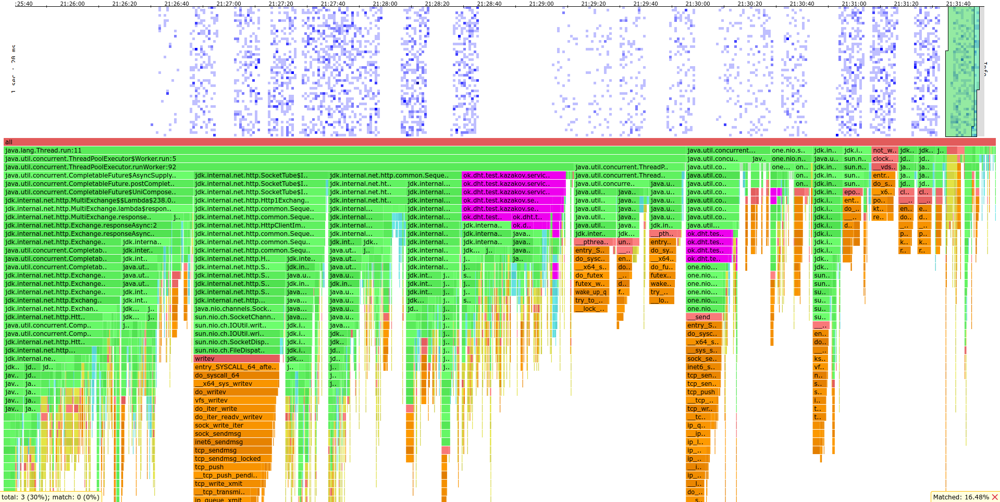
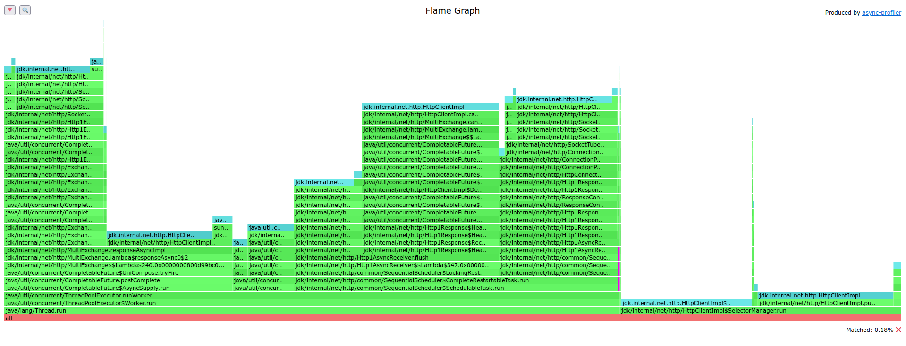
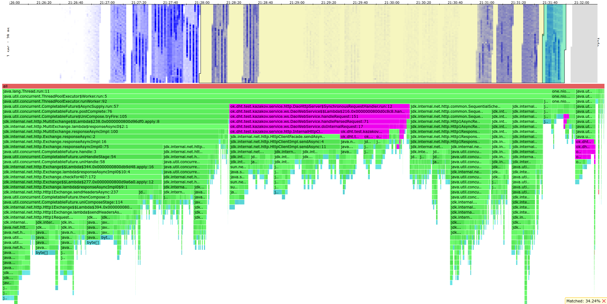

# \>\> Stage 5
> Результаты стресс тестирования с помощью jcstress и сам тест можно найти [здесь](./jcstress)

> Скрипты для wrk2 можно найти [здесь](../stage4/wrk2_scripts)

> HTML файлы, выведенные async-profiler'ом можно найти [здесь](./profiler_output)

Так получилось, что на прошлом этапе я уже реализовал асинхронный клиент,
поэтому в этом отчете будут отражены попытки получше его оптимизировать.

Конфигурация сервера аналогична той, что была в прошлом этапе.

Профилирование проводилось только на "мастер" сервере, на который стрелялись запросы.
Остальные сервера играли такую же роль как и во втором дз - сервер с данными и апишкой.

Тестирование проводилось на заполненной базе и сервере из трех реплик.
На каждой реплике сохранено 4ГБ данных на диске (RAM = 6ГБ, при тестах в дисковом кеше было 3-3,5 ГБ).
У процессора 4 ядра.

## Попытки оптимизации

Посмотрев [доклад Сергея Куксенко](https://www.youtube.com/watch?v=W7iK74YA5NM) про CompletableFuture,
я решил переместить исполнение обработку ответа в тот тред, который ближе (то есть без handle без async).
Такое решение было принято, так как в большинстве случаев обработка запроса - инкремент нескольких переменных,
что довольно дешево.
В некоторых случаях же обработка становится довольно долгой - в момент,
когда ack ответов уже набрано и пора отвечать клиенту, пойдет блокирующий запрос в сеть.
В таком случае возвращение ответа клиенту можно переместить на другой пул,
чтобы `common fork join pool` не зависал и быстро исполнил callback.

Так же была такая идея оптимизация GET запросов: так как мы "бедные" и не имеем CurcuitBreaker,
то можно опираться на идею того, что сервера обычно редко падают.
Давайте сделаем `ack` запросов и подождем ответа (например, 50-100мс).
Если ответы получены - передаем ответ клиенту.
Иначе запрашиваем остальные запросы
(если `2 * ack < from`, то можно запросить еще `ack` ответов по такой же схеме и т.д.).
Таким образом мы снизим общую нагрузку на кластер, но в худшем случае заставим клиента дольше ждать.

Замечание по поводу редкости падения серверов.
Да, для больших кластеров это может быть довольно частое явление.
Тем не менее данные обычно реплицируются на небольшое количество реплик,
а в таком кластере уже можно считать, что падения довольно редки.

Идея не была реализована, так как она непроста в реализации.
Если вызвать `Thread.sleep()` после `ack` итераций, то тред будет заблокирован,
так что продолжать исполнение придется через `ScheduledThreadPoolExecutor`, там придется продолжать цикл.
Причем код станет еще сложнее, если запрашивать по `ack` ответов каждый раз, а не только на первой попытке.

## Стресс-тестирование
> Результаты стресс тестирования с помощью jcstress и сам тест можно найти [здесь](./jcstress)

Так как обработка запросов от реплик была реализована без локов, на атомиках,
было принято решение провести стресс-тестирование предложенного решения.
Был написан [тест](./jcstress/MostRelevantResponseHandlerStressTest.java.md) с использованием jcstress,
все написанные тесты были успешно пройдены.

Внутри теста заинлайнена логика обработки запроса,
но можно замокать часть логики хендлера и тестить уже на написанном коде
(надеюсь, что это правда, не проверял).

## Нагрузочное тестирование

> Скрипты для wrk2 можно найти [здесь](../stage4/wrk2_scripts)

Нагрузочное тестирование проводилось в 64 соединения и 64 потока.
В качестве `from` и `ack` бралось дефолтное значение (кворум).

### Тестирование GET запросами

Исследуем, повлияли ли как-то оптимизации на эффективность кода.

Стрельба wrk2 GET'ом на 200 RPS (20 секунд)

<pre>
Running 20s test @ http://localhost:8080
  64 threads and 64 connections
  Thread calibration: mean lat.: 112.864ms, rate sampling interval: 694ms
  Thread calibration: mean lat.: 131.167ms, rate sampling interval: 870ms
  Thread calibration: mean lat.: 97.849ms, rate sampling interval: 541ms
  Thread calibration: mean lat.: 98.860ms, rate sampling interval: 514ms
  Thread calibration: mean lat.: 108.371ms, rate sampling interval: 666ms
  Thread calibration: mean lat.: 112.015ms, rate sampling interval: 547ms
  Thread calibration: mean lat.: 91.737ms, rate sampling interval: 531ms
  Thread calibration: mean lat.: 96.707ms, rate sampling interval: 512ms
  Thread calibration: mean lat.: 103.724ms, rate sampling interval: 523ms
  Thread calibration: mean lat.: 108.805ms, rate sampling interval: 537ms
  Thread calibration: mean lat.: 100.421ms, rate sampling interval: 476ms
  Thread calibration: mean lat.: 110.115ms, rate sampling interval: 589ms
  Thread calibration: mean lat.: 91.384ms, rate sampling interval: 508ms
  Thread calibration: mean lat.: 113.405ms, rate sampling interval: 505ms
  Thread calibration: mean lat.: 149.769ms, rate sampling interval: 821ms
  Thread calibration: mean lat.: 767.438ms, rate sampling interval: 3745ms
  Thread calibration: mean lat.: 115.471ms, rate sampling interval: 576ms
  Thread calibration: mean lat.: 96.968ms, rate sampling interval: 418ms
  Thread calibration: mean lat.: 127.520ms, rate sampling interval: 627ms
  Thread calibration: mean lat.: 113.649ms, rate sampling interval: 559ms
  Thread calibration: mean lat.: 101.636ms, rate sampling interval: 444ms
  Thread calibration: mean lat.: 112.522ms, rate sampling interval: 412ms
  Thread calibration: mean lat.: 111.831ms, rate sampling interval: 546ms
  Thread calibration: mean lat.: 114.678ms, rate sampling interval: 534ms
  Thread calibration: mean lat.: 182.222ms, rate sampling interval: 1116ms
  Thread calibration: mean lat.: 136.078ms, rate sampling interval: 592ms
  Thread calibration: mean lat.: 117.803ms, rate sampling interval: 493ms
  Thread calibration: mean lat.: 442.330ms, rate sampling interval: 2945ms
  Thread calibration: mean lat.: 129.631ms, rate sampling interval: 546ms
  Thread calibration: mean lat.: 149.473ms, rate sampling interval: 641ms
  Thread calibration: mean lat.: 661.948ms, rate sampling interval: 3708ms
  Thread calibration: mean lat.: 1024.095ms, rate sampling interval: 4188ms
  Thread calibration: mean lat.: 186.215ms, rate sampling interval: 948ms
  Thread calibration: mean lat.: 200.622ms, rate sampling interval: 839ms
  Thread calibration: mean lat.: 423.915ms, rate sampling interval: 2322ms
  Thread calibration: mean lat.: 181.464ms, rate sampling interval: 708ms
  Thread calibration: mean lat.: 170.386ms, rate sampling interval: 655ms
  Thread calibration: mean lat.: 649.026ms, rate sampling interval: 3174ms
  Thread calibration: mean lat.: 124.473ms, rate sampling interval: 453ms
  Thread calibration: mean lat.: 180.061ms, rate sampling interval: 730ms
  Thread calibration: mean lat.: 472.285ms, rate sampling interval: 2430ms
  Thread calibration: mean lat.: 208.819ms, rate sampling interval: 1027ms
  Thread calibration: mean lat.: 430.851ms, rate sampling interval: 2320ms
  Thread calibration: mean lat.: 424.646ms, rate sampling interval: 2316ms
  Thread calibration: mean lat.: 143.643ms, rate sampling interval: 555ms
  Thread calibration: mean lat.: 776.879ms, rate sampling interval: 3794ms
  Thread calibration: mean lat.: 890.059ms, rate sampling interval: 4141ms
  Thread calibration: mean lat.: 182.883ms, rate sampling interval: 625ms
  Thread calibration: mean lat.: 174.072ms, rate sampling interval: 680ms
  Thread calibration: mean lat.: 193.524ms, rate sampling interval: 717ms
  Thread calibration: mean lat.: 453.781ms, rate sampling interval: 2756ms
  Thread calibration: mean lat.: 154.688ms, rate sampling interval: 626ms
  Thread calibration: mean lat.: 220.869ms, rate sampling interval: 940ms
  Thread calibration: mean lat.: 497.141ms, rate sampling interval: 2914ms
  Thread calibration: mean lat.: 148.035ms, rate sampling interval: 586ms
  Thread calibration: mean lat.: 126.612ms, rate sampling interval: 387ms
  Thread calibration: mean lat.: 114.873ms, rate sampling interval: 373ms
  Thread calibration: mean lat.: 429.562ms, rate sampling interval: 2433ms
  Thread calibration: mean lat.: 208.839ms, rate sampling interval: 977ms
  Thread calibration: mean lat.: 206.308ms, rate sampling interval: 940ms
  Thread calibration: mean lat.: 542.503ms, rate sampling interval: 2994ms
  Thread calibration: mean lat.: 449.921ms, rate sampling interval: 2557ms
  Thread calibration: mean lat.: 201.289ms, rate sampling interval: 977ms
  Thread calibration: mean lat.: 172.685ms, rate sampling interval: 667ms
  Thread Stats   Avg      Stdev     Max   +/- Stdev
    Latency   461.90ms  664.68ms   3.79s    84.20%
    Req/Sec     2.12      1.94    17.00     96.48%
  Latency Distribution (HdrHistogram - Recorded Latency)
 50.000%  184.96ms
 75.000%  420.61ms
 90.000%    1.63s 
 99.000%    2.77s 
 99.900%    3.74s 
 99.990%    3.79s 
 99.999%    3.79s 
100.000%    3.79s 

Detailed Percentile spectrum:
Value   Percentile   TotalCount 1/(1-Percentile)

       2.959     0.000000            1         1.00
      26.015     0.100000          169         1.11
      53.951     0.200000          338         1.25
      91.455     0.300000          507         1.43
     136.063     0.400000          677         1.67
     184.959     0.500000          845         2.00
     210.303     0.550000          930         2.22
     226.175     0.600000         1014         2.50
     263.167     0.650000         1100         2.86
     320.511     0.700000         1183         3.33
     420.607     0.750000         1268         4.00
     477.695     0.775000         1311         4.44
     634.879     0.800000         1352         5.00
     982.015     0.825000         1395         5.71
    1234.943     0.850000         1437         6.67
    1480.703     0.875000         1479         8.00
    1546.239     0.887500         1500         8.89
    1627.135     0.900000         1521        10.00
    1730.559     0.912500         1543        11.43
    1800.191     0.925000         1565        13.33
    1889.279     0.937500         1585        16.00
    1906.687     0.943750         1595        17.78
    1984.511     0.950000         1606        20.00
    2024.447     0.956250         1617        22.86
    2099.199     0.962500         1627        26.67
    2150.399     0.968750         1641        32.00
    2152.447     0.971875         1644        35.56
    2158.591     0.975000         1648        40.00
    2185.215     0.978125         1654        45.71
    2199.551     0.981250         1660        53.33
    2408.447     0.984375         1664        64.00
    2457.599     0.985938         1667        71.11
    2504.703     0.987500         1669        80.00
    2709.503     0.989062         1672        91.43
    2828.287     0.990625         1675       106.67
    3041.279     0.992188         1677       128.00
    3080.191     0.992969         1679       142.22
    3264.511     0.993750         1680       160.00
    3287.039     0.994531         1681       182.86
    3377.151     0.995313         1683       213.33
    3452.927     0.996094         1684       256.00
    3485.695     0.996484         1685       284.44
    3485.695     0.996875         1685       320.00
    3643.391     0.997266         1686       365.71
    3657.727     0.997656         1687       426.67
    3657.727     0.998047         1687       512.00
    3739.647     0.998242         1688       568.89
    3739.647     0.998437         1688       640.00
    3739.647     0.998633         1688       731.43
    3747.839     0.998828         1689       853.33
    3747.839     0.999023         1689      1024.00
    3747.839     0.999121         1689      1137.78
    3747.839     0.999219         1689      1280.00
    3747.839     0.999316         1689      1462.86
    3788.799     0.999414         1690      1706.67
    3788.799     1.000000         1690          inf
#[Mean    =      461.902, StdDeviation   =      664.677]
#[Max     =     3786.752, Total count    =         1690]
#[Buckets =           27, SubBuckets     =         2048]
----------------------------------------------------------
3578 requests in 20.03s, 728.30KB read
Socket errors: connect 0, read 0, write 0, timeout 62
Non-2xx or 3xx responses: 135
Requests/sec:    178.60
Transfer/sec:     36.35KB
</pre>

GET по-прежнему задыхается на 200 RPS.

Стрельба wrk2 GET'ом на 100 RPS (20 секунд)

<pre>
Running 20s test @ http://localhost:8080
  64 threads and 64 connections
  Thread calibration: mean lat.: 44.948ms, rate sampling interval: 105ms
  Thread calibration: mean lat.: 28.017ms, rate sampling interval: 104ms
  Thread calibration: mean lat.: 74.802ms, rate sampling interval: 345ms
  Thread calibration: mean lat.: 51.312ms, rate sampling interval: 184ms
  Thread calibration: mean lat.: 37.809ms, rate sampling interval: 158ms
  Thread calibration: mean lat.: 52.745ms, rate sampling interval: 165ms
  Thread calibration: mean lat.: 43.331ms, rate sampling interval: 185ms
  Thread calibration: mean lat.: 68.304ms, rate sampling interval: 328ms
  Thread calibration: mean lat.: 69.429ms, rate sampling interval: 300ms
  Thread calibration: mean lat.: 61.487ms, rate sampling interval: 285ms
  Thread calibration: mean lat.: 56.459ms, rate sampling interval: 227ms
  Thread calibration: mean lat.: 60.859ms, rate sampling interval: 232ms
  Thread calibration: mean lat.: 63.397ms, rate sampling interval: 276ms
  Thread calibration: mean lat.: 81.288ms, rate sampling interval: 321ms
  Thread calibration: mean lat.: 100.039ms, rate sampling interval: 353ms
  Thread calibration: mean lat.: 75.527ms, rate sampling interval: 312ms
  Thread calibration: mean lat.: 80.021ms, rate sampling interval: 324ms
  Thread calibration: mean lat.: 87.803ms, rate sampling interval: 342ms
  Thread calibration: mean lat.: 85.398ms, rate sampling interval: 303ms
  Thread calibration: mean lat.: 86.151ms, rate sampling interval: 340ms
  Thread calibration: mean lat.: 72.844ms, rate sampling interval: 326ms
  Thread calibration: mean lat.: 82.913ms, rate sampling interval: 327ms
  Thread calibration: mean lat.: 84.763ms, rate sampling interval: 346ms
  Thread calibration: mean lat.: 95.127ms, rate sampling interval: 364ms
  Thread calibration: mean lat.: 83.132ms, rate sampling interval: 270ms
  Thread calibration: mean lat.: 67.332ms, rate sampling interval: 232ms
  Thread calibration: mean lat.: 84.569ms, rate sampling interval: 296ms
  Thread calibration: mean lat.: 105.053ms, rate sampling interval: 488ms
  Thread calibration: mean lat.: 84.975ms, rate sampling interval: 452ms
  Thread calibration: mean lat.: 371.873ms, rate sampling interval: 1846ms
  Thread calibration: mean lat.: 106.498ms, rate sampling interval: 471ms
  Thread calibration: mean lat.: 114.647ms, rate sampling interval: 499ms
  Thread calibration: mean lat.: 109.302ms, rate sampling interval: 406ms
  Thread calibration: mean lat.: 112.830ms, rate sampling interval: 428ms
  Thread calibration: mean lat.: 82.735ms, rate sampling interval: 307ms
  Thread calibration: mean lat.: 120.814ms, rate sampling interval: 481ms
  Thread calibration: mean lat.: 368.761ms, rate sampling interval: 1841ms
  Thread calibration: mean lat.: 102.779ms, rate sampling interval: 430ms
  Thread calibration: mean lat.: 115.024ms, rate sampling interval: 446ms
  Thread calibration: mean lat.: 102.979ms, rate sampling interval: 472ms
  Thread calibration: mean lat.: 434.572ms, rate sampling interval: 2969ms
  Thread calibration: mean lat.: 94.736ms, rate sampling interval: 300ms
  Thread calibration: mean lat.: 107.294ms, rate sampling interval: 443ms
  Thread calibration: mean lat.: 103.480ms, rate sampling interval: 440ms
  Thread calibration: mean lat.: 108.050ms, rate sampling interval: 424ms
  Thread calibration: mean lat.: 100.665ms, rate sampling interval: 480ms
  Thread calibration: mean lat.: 94.920ms, rate sampling interval: 405ms
  Thread calibration: mean lat.: 117.678ms, rate sampling interval: 484ms
  Thread calibration: mean lat.: 95.490ms, rate sampling interval: 364ms
  Thread calibration: mean lat.: 119.304ms, rate sampling interval: 536ms
  Thread calibration: mean lat.: 111.984ms, rate sampling interval: 463ms
  Thread calibration: mean lat.: 117.965ms, rate sampling interval: 456ms
  Thread calibration: mean lat.: 98.361ms, rate sampling interval: 399ms
  Thread calibration: mean lat.: 119.075ms, rate sampling interval: 483ms
  Thread calibration: mean lat.: 120.629ms, rate sampling interval: 476ms
  Thread calibration: mean lat.: 102.257ms, rate sampling interval: 448ms
  Thread calibration: mean lat.: 108.988ms, rate sampling interval: 445ms
  Thread calibration: mean lat.: 9223372036854776.000ms, rate sampling interval: 10ms
  Thread calibration: mean lat.: 9223372036854776.000ms, rate sampling interval: 10ms
  Thread calibration: mean lat.: 9223372036854776.000ms, rate sampling interval: 10ms
  Thread calibration: mean lat.: 9223372036854776.000ms, rate sampling interval: 10ms
  Thread calibration: mean lat.: 103.274ms, rate sampling interval: 442ms
  Thread calibration: mean lat.: 9223372036854776.000ms, rate sampling interval: 10ms
  Thread calibration: mean lat.: 9223372036854776.000ms, rate sampling interval: 10ms
  Thread Stats   Avg      Stdev     Max   +/- Stdev
    Latency   185.80ms  359.93ms   2.10s    93.67%
    Req/Sec     0.28      1.08    14.00     95.41%
  Latency Distribution (HdrHistogram - Recorded Latency)
 50.000%  103.49ms
 75.000%  161.15ms
 90.000%  220.41ms
 99.000%    2.07s 
 99.900%    2.10s 
 99.990%    2.10s 
 99.999%    2.10s 
100.000%    2.10s 

Detailed Percentile spectrum:
Value   Percentile   TotalCount 1/(1-Percentile)

       2.119     0.000000            1         1.00
      22.991     0.100000           72         1.11
      32.991     0.200000          143         1.25
      51.007     0.300000          214         1.43
      81.087     0.400000          285         1.67
     103.487     0.500000          356         2.00
     112.255     0.550000          392         2.22
     123.839     0.600000          427         2.50
     139.647     0.650000          463         2.86
     152.703     0.700000          498         3.33
     161.535     0.750000          534         4.00
     166.399     0.775000          552         4.44
     171.775     0.800000          569         5.00
     182.527     0.825000          587         5.71
     193.663     0.850000          605         6.67
     198.399     0.875000          623         8.00
     205.823     0.887500          632         8.89
     220.415     0.900000          640        10.00
     230.655     0.912500          649        11.43
     257.535     0.925000          658        13.33
     744.447     0.937500          667        16.00
     840.703     0.943750          672        17.78
     874.495     0.950000          676        20.00
     910.335     0.956250          680        22.86
    1412.095     0.962500          685        26.67
    1496.063     0.968750          689        32.00
    1506.303     0.971875          692        35.56
    1519.615     0.975000          694        40.00
    1541.119     0.978125          696        45.71
    2015.231     0.981250          698        53.33
    2033.663     0.984375          700        64.00
    2063.359     0.985938          702        71.11
    2069.503     0.987500          704        80.00
    2069.503     0.989062          704        91.43
    2070.527     0.990625          707       106.67
    2070.527     0.992188          707       128.00
    2070.527     0.992969          707       142.22
    2070.527     0.993750          707       160.00
    2093.055     0.994531          708       182.86
    2093.055     0.995313          708       213.33
    2096.127     0.996094          709       256.00
    2096.127     0.996484          709       284.44
    2096.127     0.996875          709       320.00
    2101.247     0.997266          710       365.71
    2101.247     0.997656          710       426.67
    2101.247     0.998047          710       512.00
    2101.247     0.998242          710       568.89
    2101.247     0.998437          710       640.00
    2103.295     0.998633          711       731.43
    2103.295     1.000000          711          inf
#[Mean    =      185.803, StdDeviation   =      359.927]
#[Max     =     2101.248, Total count    =          711]
#[Buckets =           27, SubBuckets     =         2048]
----------------------------------------------------------
1598 requests in 20.05s, 330.00KB read
Socket errors: connect 0, read 0, write 0, timeout 121
Non-2xx or 3xx responses: 18
Requests/sec:     79.71
Transfer/sec:     16.46KB
</pre>

На 100 RPS результаты примерно такие же, как и в прошлом.
Считаю, что оптимизации особо не повлияли.

### Тестирование PUT запросами

Интереснее посмотреть на PUT запросы, так как они позволяют отправить больший RPS,
из-за чего оптимизация будет лучше видна.

Стрельба wrk2 PUT'ом на 3000 RPS (10 секунд)

<pre>
Running 10s test @ http://localhost:8080
  64 threads and 64 connections
  Thread calibration: mean lat.: 1.517ms, rate sampling interval: 10ms
  Thread calibration: mean lat.: 1.412ms, rate sampling interval: 10ms
  Thread calibration: mean lat.: 1.721ms, rate sampling interval: 10ms
  Thread calibration: mean lat.: 1.874ms, rate sampling interval: 10ms
  Thread calibration: mean lat.: 1.609ms, rate sampling interval: 10ms
  Thread calibration: mean lat.: 1.770ms, rate sampling interval: 10ms
  Thread calibration: mean lat.: 1.835ms, rate sampling interval: 10ms
  Thread calibration: mean lat.: 1.200ms, rate sampling interval: 10ms
  Thread calibration: mean lat.: 1.257ms, rate sampling interval: 10ms
  Thread calibration: mean lat.: 1.275ms, rate sampling interval: 10ms
  Thread calibration: mean lat.: 1.217ms, rate sampling interval: 10ms
  Thread calibration: mean lat.: 1.335ms, rate sampling interval: 10ms
  Thread calibration: mean lat.: 1.305ms, rate sampling interval: 10ms
  Thread calibration: mean lat.: 1.246ms, rate sampling interval: 10ms
  Thread calibration: mean lat.: 1.224ms, rate sampling interval: 10ms
  Thread calibration: mean lat.: 1.254ms, rate sampling interval: 10ms
  Thread calibration: mean lat.: 1.347ms, rate sampling interval: 10ms
  Thread calibration: mean lat.: 1.301ms, rate sampling interval: 10ms
  Thread calibration: mean lat.: 1.622ms, rate sampling interval: 10ms
  Thread calibration: mean lat.: 1.655ms, rate sampling interval: 10ms
  Thread calibration: mean lat.: 1.636ms, rate sampling interval: 10ms
  Thread calibration: mean lat.: 1.532ms, rate sampling interval: 10ms
  Thread calibration: mean lat.: 1.575ms, rate sampling interval: 10ms
  Thread calibration: mean lat.: 1.382ms, rate sampling interval: 10ms
  Thread calibration: mean lat.: 1.224ms, rate sampling interval: 10ms
  Thread Stats   Avg      Stdev     Max   +/- Stdev
    Latency    24.82ms  193.53ms   2.00s    98.54%
    Req/Sec       -nan      -nan   0.00      0.00%
  Latency Distribution (HdrHistogram - Recorded Latency)
 50.000%    1.38ms
 75.000%    1.76ms
 90.000%    2.42ms
 99.000%    1.45s 
 99.900%    1.94s 
 99.990%    2.00s 
 99.999%    2.00s 
100.000%    2.00s 

  Detailed Percentile spectrum:
       Value   Percentile   TotalCount 1/(1-Percentile)

       0.368     0.000000            1         1.00
       0.805     0.100000         1784         1.11
       0.976     0.200000         3568         1.25
       1.121     0.300000         5348         1.43
       1.254     0.400000         7127         1.67
       1.380     0.500000         8911         2.00
       1.437     0.550000         9809         2.22
       1.499     0.600000        10690         2.50
       1.575     0.650000        11584         2.86
       1.657     0.700000        12472         3.33
       1.758     0.750000        13359         4.00
       1.821     0.775000        13808         4.44
       1.898     0.800000        14251         5.00
       1.985     0.825000        14695         5.71
       2.091     0.850000        15141         6.67
       2.229     0.875000        15585         8.00
       2.317     0.887500        15808         8.89
       2.417     0.900000        16031        10.00
       2.533     0.912500        16252        11.43
       2.681     0.925000        16478        13.33
       2.871     0.937500        16697        16.00
       3.017     0.943750        16811        17.78
       3.183     0.950000        16920        20.00
       3.393     0.956250        17031        22.86
       3.665     0.962500        17143        26.67
       4.025     0.968750        17254        32.00
       4.275     0.971875        17310        35.56
       4.571     0.975000        17365        40.00
       5.127     0.978125        17422        45.71
       6.087     0.981250        17477        53.33
       8.151     0.984375        17532        64.00
    1225.727     0.985938        17560        71.11
    1312.767     0.987500        17588        80.00
    1395.711     0.989062        17616        91.43
    1481.727     0.990625        17644       106.67
    1559.551     0.992188        17671       128.00
    1610.751     0.992969        17685       142.22
    1651.711     0.993750        17699       160.00
    1694.719     0.994531        17713       182.86
    1747.967     0.995313        17727       213.33
    1788.927     0.996094        17742       256.00
    1808.383     0.996484        17749       284.44
    1826.815     0.996875        17755       320.00
    1849.343     0.997266        17762       365.71
    1884.159     0.997656        17769       426.67
    1903.615     0.998047        17776       512.00
    1905.663     0.998242        17779       568.89
    1924.095     0.998437        17784       640.00
    1926.143     0.998633        17786       731.43
    1944.575     0.998828        17792       853.33
    1961.983     0.999023        17793      1024.00
    1964.031     0.999121        17797      1137.78
    1964.031     0.999219        17797      1280.00
    1965.055     0.999316        17798      1462.86
    1983.487     0.999414        17803      1706.67
    1983.487     0.999512        17803      2048.00
    1983.487     0.999561        17803      2275.56
    1984.511     0.999609        17804      2560.00
    1984.511     0.999658        17804      2925.71
    2001.919     0.999707        17806      3413.33
    2001.919     0.999756        17806      4096.00
    2002.943     0.999780        17810      4551.11
    2002.943     1.000000        17810          inf
#[Mean    =       24.816, StdDeviation   =      193.531]
#[Max     =     2001.920, Total count    =        17810]
#[Buckets =           27, SubBuckets     =         2048]
----------------------------------------------------------
  29405 requests in 10.01s, 1.88MB read
  Non-2xx or 3xx responses: 6
Requests/sec:   2938.99
Transfer/sec:    192.30KB
</pre>

На 3000 RPS результаты уже лучше, чем в прошлый раз.
Попробуем найти более стабильный RPS.

Стрельба wrk2 PUT'ом на 2500 RPS (10 секунд)

<pre>
Running 10s test @ http://localhost:8080
  64 threads and 64 connections
  Thread calibration: mean lat.: 2.950ms, rate sampling interval: 10ms
  Thread calibration: mean lat.: 3.095ms, rate sampling interval: 10ms
  Thread calibration: mean lat.: 2.886ms, rate sampling interval: 10ms
  Thread calibration: mean lat.: 1.760ms, rate sampling interval: 10ms
  Thread calibration: mean lat.: 1.773ms, rate sampling interval: 10ms
  Thread calibration: mean lat.: 2.039ms, rate sampling interval: 10ms
  Thread calibration: mean lat.: 1.409ms, rate sampling interval: 10ms
  Thread calibration: mean lat.: 1.459ms, rate sampling interval: 10ms
  Thread calibration: mean lat.: 1.335ms, rate sampling interval: 10ms
  Thread calibration: mean lat.: 1.413ms, rate sampling interval: 10ms
  Thread calibration: mean lat.: 1.171ms, rate sampling interval: 10ms
  Thread calibration: mean lat.: 1.253ms, rate sampling interval: 10ms
  Thread calibration: mean lat.: 1.227ms, rate sampling interval: 10ms
  Thread calibration: mean lat.: 1.235ms, rate sampling interval: 10ms
  Thread calibration: mean lat.: 1.261ms, rate sampling interval: 10ms
  Thread calibration: mean lat.: 1.262ms, rate sampling interval: 10ms
  Thread calibration: mean lat.: 1.006ms, rate sampling interval: 10ms
  Thread calibration: mean lat.: 1.127ms, rate sampling interval: 10ms
  Thread calibration: mean lat.: 1.081ms, rate sampling interval: 10ms
  Thread calibration: mean lat.: 1.109ms, rate sampling interval: 10ms
  Thread calibration: mean lat.: 1.232ms, rate sampling interval: 10ms
  Thread calibration: mean lat.: 1.166ms, rate sampling interval: 10ms
  Thread calibration: mean lat.: 1.128ms, rate sampling interval: 10ms
  Thread calibration: mean lat.: 1.242ms, rate sampling interval: 10ms
  Thread Stats   Avg      Stdev     Max   +/- Stdev
    Latency     1.66ms    0.96ms  15.55ms   78.04%
    Req/Sec       -nan      -nan   0.00      0.00%
  Latency Distribution (HdrHistogram - Recorded Latency)
 50.000%    1.36ms
 75.000%    1.97ms
 90.000%    3.06ms
 99.000%    4.69ms
 99.900%    7.71ms
 99.990%   11.05ms
 99.999%   15.56ms
100.000%   15.56ms

  Detailed Percentile spectrum:
       Value   Percentile   TotalCount 1/(1-Percentile)

       0.424     0.000000            1         1.00
       0.780     0.100000         1563         1.11
       0.953     0.200000         3129         1.25
       1.103     0.300000         4690         1.43
       1.233     0.400000         6244         1.67
       1.364     0.500000         7813         2.00
       1.435     0.550000         8589         2.22
       1.509     0.600000         9364         2.50
       1.612     0.650000        10145         2.86
       1.749     0.700000        10924         3.33
       1.969     0.750000        11700         4.00
       2.129     0.775000        12090         4.44
       2.297     0.800000        12481         5.00
       2.495     0.825000        12870         5.71
       2.681     0.850000        13264         6.67
       2.857     0.875000        13650         8.00
       2.959     0.887500        13846         8.89
       3.061     0.900000        14041        10.00
       3.171     0.912500        14236        11.43
       3.299     0.925000        14431        13.33
       3.447     0.937500        14626        16.00
       3.517     0.943750        14727        17.78
       3.593     0.950000        14822        20.00
       3.695     0.956250        14921        22.86
       3.811     0.962500        15015        26.67
       3.959     0.968750        15113        32.00
       4.019     0.971875        15162        35.56
       4.099     0.975000        15213        40.00
       4.179     0.978125        15260        45.71
       4.271     0.981250        15309        53.33
       4.399     0.984375        15361        64.00
       4.455     0.985938        15383        71.11
       4.527     0.987500        15405        80.00
       4.655     0.989062        15431        91.43
       4.743     0.990625        15455       106.67
       4.915     0.992188        15480       128.00
       5.015     0.992969        15491       142.22
       5.091     0.993750        15503       160.00
       5.167     0.994531        15515       182.86
       5.247     0.995313        15527       213.33
       5.499     0.996094        15540       256.00
       5.631     0.996484        15547       284.44
       5.767     0.996875        15552       320.00
       5.955     0.997266        15558       365.71
       6.159     0.997656        15564       426.67
       6.559     0.998047        15570       512.00
       6.799     0.998242        15574       568.89
       6.991     0.998437        15576       640.00
       7.271     0.998633        15579       731.43
       7.527     0.998828        15582       853.33
       7.719     0.999023        15585      1024.00
       7.963     0.999121        15587      1137.78
       8.027     0.999219        15588      1280.00
       8.383     0.999316        15590      1462.86
       8.391     0.999414        15591      1706.67
       8.591     0.999512        15593      2048.00
       8.607     0.999561        15594      2275.56
       8.607     0.999609        15594      2560.00
       8.703     0.999658        15595      2925.71
       8.855     0.999707        15596      3413.33
       9.367     0.999756        15597      4096.00
       9.367     0.999780        15597      4551.11
       9.367     0.999805        15597      5120.00
      11.047     0.999829        15598      5851.43
      11.047     0.999854        15598      6826.67
      13.431     0.999878        15599      8192.00
      13.431     0.999890        15599      9102.22
      13.431     0.999902        15599     10240.00
      13.431     0.999915        15599     11702.86
      13.431     0.999927        15599     13653.33
      15.559     0.999939        15600     16384.00
      15.559     1.000000        15600          inf
#[Mean    =        1.657, StdDeviation   =        0.965]
#[Max     =       15.552, Total count    =        15600]
#[Buckets =           27, SubBuckets     =         2048]
----------------------------------------------------------
  25024 requests in 9.99s, 1.60MB read
Requests/sec:   2505.62
Transfer/sec:    163.94KB
</pre>

Результаты хорошие, latency довольно низкй.
Будем считать 2500 RPS стабильным. 

## Профилирование и оптимизации

> HTML файлы, выведенные async-profiler'ом можно найти [здесь](./profiler_output)

В flame graph'ах семплы помеченные фиолетовым цветом содержат в себе подстроку `kazakov`,
то есть это код, который написал я (либо это референсная DAO).

Для GET запросов профиль такой же, как и в прошлом этапе.
Да и на нагрузочном тестировании результаты не поменялись.

### Профилирование PUT запросов

Flame graph по CPU для PUT запросов

Flame graph по lock для PUT запросов

В целом CPU и lock остались такими же, как и в прошлом этапе.
В flame graph'е CPU видно, что ответ клиенту переместился на `fork join pool`.

Flame graph по Alloc для PUT запросов

На профиле аллокаций видно, что ответ клиенту переместился на `fork join pool`,
причем на него попало довольно много семплов (самый правый фиолетовый прямоугольник).
Как это оптимизировать уже обсуждалось.
В остальном же профиль такой же, как и в прошлом этапе.
