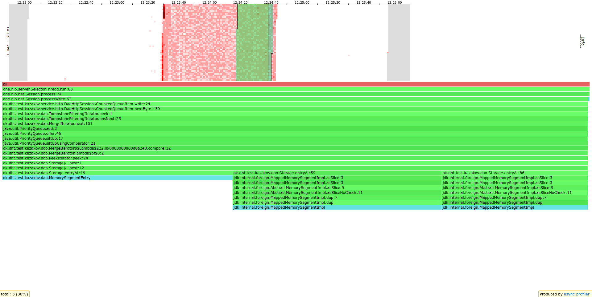
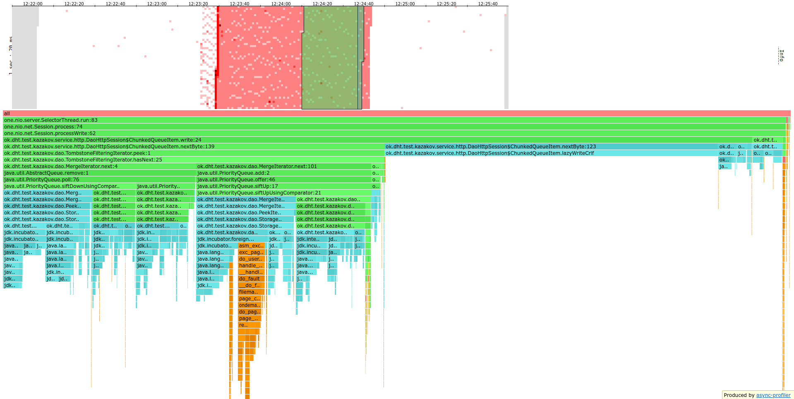

# \>\> Stage 6

> HTML файлы, выведенные async-profiler'ом можно найти [здесь](./profiler_output)

## Профилирование

Для профилирования использовалась база, наполненная в прошлом этапе
(4ГБ данных на каждой реплике).
Нагрузка на сервер подавалась одним запросом на всю получение всего содержимого базы
(`start = '0', end = null`).
Ответ отправлялся в `/dev/null`.

При первой попытке тестирования вся база легла в дисковый кэш
(объем оперативки 6ГБ).
Было решено параллельно запустить второй такой же запрос на реплике,
чтобы не ждать заполнения базы на больший объем.

Flame graph по Alloc для Range запроса

По аллокациям видно, что большая часть семплов попала на извлечение entry из sstable.
Для огромного range-запроса это можно соптимизировать:
скорее всего вся sstable будет отправлена по сети,
поэтому можно прямо при формировании http ответа смотреть на sstable
и руками извлекать нужные байтики без вызова `sstable::asSlice` и `MemorySegmentEntry::new`.

(но, возможно, код станет страшным)

Flame graph по CPU для Range запроса

На картинке видно, что больше всего заняло получение очередного entry (сравнение с другими, чтение диска).
Куча работает за логарифм количества sstable на диске,
поэтому компактификация ускорит работу кучи в несколько раз
(у меня на диске количество sstable равно 2423).

Также оптимизация, описанная выше при анализе аллокаций, может убрать из профиля Storage.entryAt
(занимает 50% от `TombstoneFilteringIterator::peek`)

Неожиданно для меня, из добавлений в `ChunkedQueueItem::remainderQueue`
на профиле появилась только `ChunkedQueueItem::lazyWriteCrlf`.
Эта функция вызывается лишь в два раза чаще, чем `ChunkedQueueItem::lazyWriteLf`,
но этой функции в профилях нет.
Возможно, компилятор странно заинлайнил `ChunkedQueueItem::lazyWriteLf`, что она пропала из профиля.

Тем не менее, я ожидал появление какого-то замедления при взаимодействии с `remainderQueue`.
Во-первых, эта очередь использует `Byte` вместо `byte`, то есть требует аллокации.
Но аллокациях `Byte`'а в профилях нет, возможно, компилятор соптимизировал это
(или профилировщик не поймал).
Во-вторых, это какой-то дополнительный буффер, за которым еще нужно идти в память.
Возможно, это можно ускорить путем использования флагов вида `hasWrittenEntrySize`
и записывания CRLF (и прочих) сразу в `buffer`.
