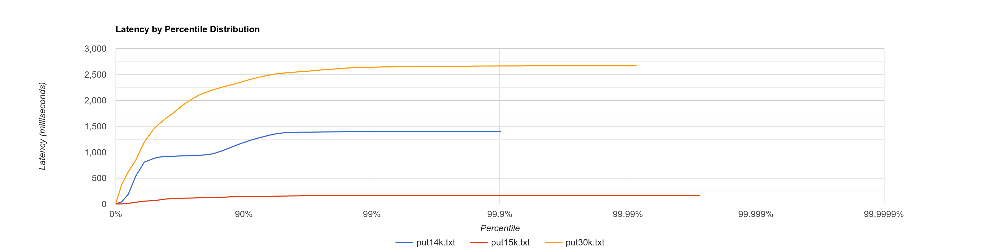
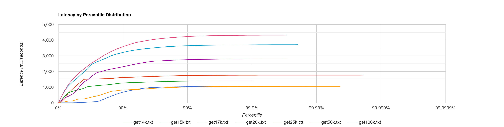

# Подготовка

## Установка `wrk`

Debian-based distro (e.g. Ubuntu).

```shell
sudo apt update && sudo apt install -y build-essential libssl-dev git zlib1g-dev dos2unix
git clone --single-branch https://github.com/giltene/wrk2.git && cd wrk2

# fixes line endings issue, https://github.com/giltene/wrk2/issues/70
find . -type f -print0 | xargs -0 dos2unix
make
mv wrk ~/.local/bin/ # or add to $PATH
```

## Установка `async-profiler`

```shell
git clone https://github.com/Artyomcool/async-profiler.git --branch=single-page-heatmap && cd async-profiler
export JAVA_HOME="$HOME/.jdks/liberica-17.0.4.1" # need to install jdk for Java 17 with debug symbols
make
chmod u+x ./profiler.sh
ln ./profiler.sh ~/.local/bin/async-profiler
```

# Определение стабильной нагрузки

В одной консоли запускаем сервис:

```shell
URL=http://localhost:19234
# application.mainClass should be 'ok.dht.test.kondraev.Service' in build.gradle
./gradlew clean run --args=$URL
```

В другой -- `async-profiler` и `wrk` ([test-01.sh](01/test-01.sh)) 

```shell
sudo sysctl kernel.kptr_restrict=0
sudo sysctl kernel.perf_event_paranoid=1
bash -x ./test-01.sh 2>&1 | tee test-01.out
```

Графики распределения latency, построенный по выводу `wrk2` (сырые данные см. в [test-01.out](01/test-01.out), [put-01.jfr](01/put-01.jfr), [get-01.jfr](01/get-01.jfr)):





По этим графикам видно, что на данном этапе стабильной является частота запросов $\approx 15k/s$ как для `PUT`, так и для `GET`.

Heatmap'ы, полученные во время запуска [test-01.sh](01/test-01.sh):

- [put-01-alloc.html](01/put-01-alloc.html)
- [put-01-cpu.html](01/put-01-cpu.html)
- [get-01-alloc.html](01/get-01-alloc.html)
- [get-01-cpu.html](01/get-01-cpu.html)

```shell
java -cp ~/dev/async-profiler/build/converter.jar jfr2heat --alloc 01/put-01.jfr 01/put-01-alloc.html
java -cp ~/dev/async-profiler/build/converter.jar jfr2heat 01/put-01.jfr 01/put-01-cpu.html
java -cp ~/dev/async-profiler/build/converter.jar jfr2heat --alloc 01/get-01.jfr 01/get-01-alloc.html
java -cp ~/dev/async-profiler/build/converter.jar jfr2heat 01/get-01.jfr 01/get-01-cpu.html
```

Вывод, который можно сделать сейчас, это,

- большая часть времени -- как в PUT, так и в GET --- тратится на syscalls: `send`, `recv`, `epoll_wait`, оптимизация которых практически невозможна
- хранилище недостаточно наполнено (всего 3 таблицы = 6 файлов)
- интервал профилирования стоит уменьшить (сейчас это `10ms`).
- размеры ключей (2-6 символов) и значений (2-11 символов) можно сделать больше.

# Тестирование на стабильной нагрузке

Сервер:

```shell
./gradlew clean run --args=http://localhost:19234
```

`async-profiler` и `wrk` ([test-02.sh](01/test-02.sh), [put-02.lua](01/put-02.lua), [get-02.lua](01/get-02.lua)):

```shell
sudo sysctl kernel.kptr_restrict=0
sudo sysctl kernel.perf_event_paranoid=1
bash -x ./test-02.sh 2>&1 | tee test-02.out
```

## Результат

Heatmap'ы, полученные во время запуска [test-02.sh](01/test-02.sh):

- [put-02-alloc.html](01/put-02-alloc.html)
- [put-02-cpu.html](01/put-02-cpu.html)
- [get-02-alloc.html](01/get-02-alloc.html)
- [get-02-cpu.html](01/get-02-cpu.html)

```shell
java -cp ~/dev/async-profiler/build/converter.jar jfr2heat --alloc 01/put-02.jfr 01/put-02-alloc.html
java -cp ~/dev/async-profiler/build/converter.jar jfr2heat 01/put-02.jfr 01/put-02-cpu.html
java -cp ~/dev/async-profiler/build/converter.jar jfr2heat --alloc 01/get-02.jfr 01/get-02-alloc.html
java -cp ~/dev/async-profiler/build/converter.jar jfr2heat 01/get-02.jfr 01/get-02-cpu.html
```

Выводы

- вывод про syscalls сохраняется.
- при увеличении размера ключей и значений (в 2 раза) стабильная частота запросов сильно снизилась (до 8.5k, в 2 раза).
- реальные размеры таблиц не соответствуют заданному `FLUSH_THRESHOLD_BYTES = 1 << 20`, что говорит о баге в определении
  необходимости автоматического flush.

Сырые данные: [put-02.jfr](01/put-02.jfr), [get-02.jfr](01/get-02.jfr),
[test-02.out](01/test-02.out).