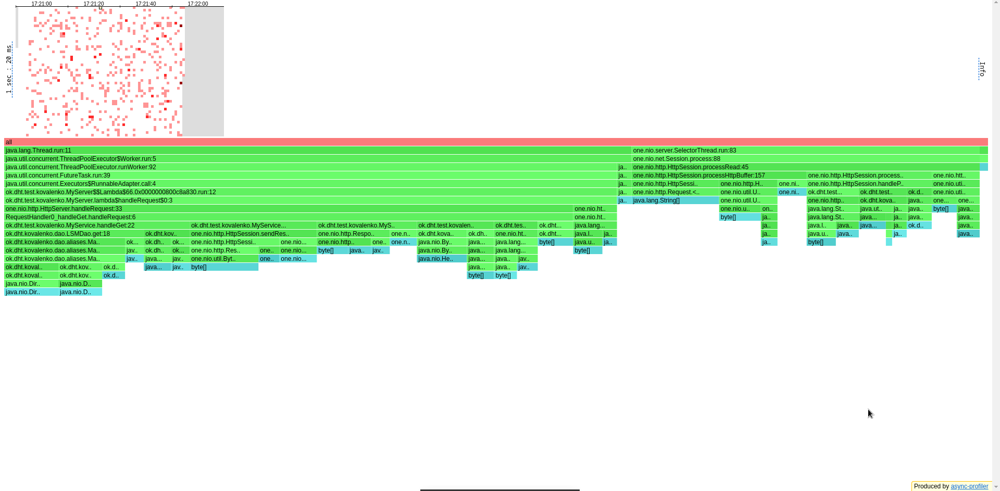
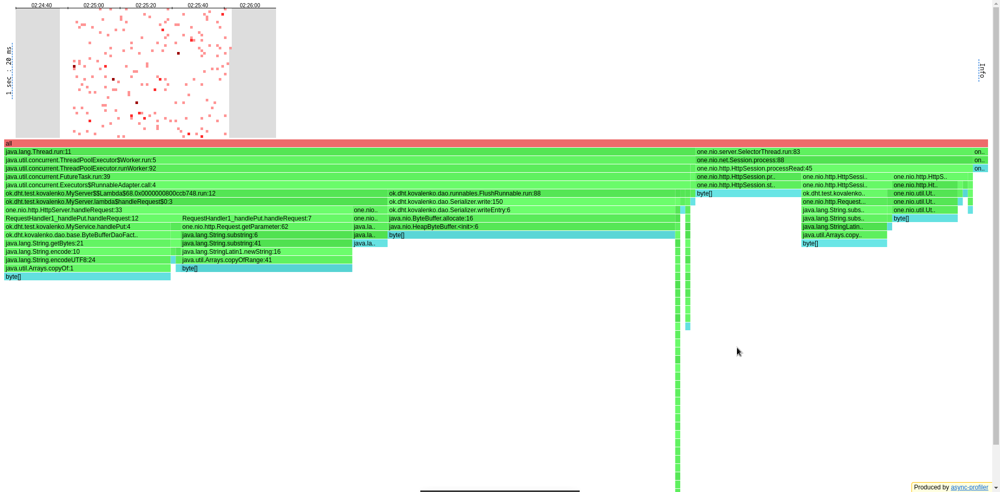

# Отчёт по профилированию NoSQL-базы данных (Асинхронный сервер)

## Общая часть

### Изменения

В отчёте больше нет промежуточных пристрелок - только стрельба на перегрузку
и стрельба на предел возможностей БД. Была произведена попытка изменения
chunktime у async-profiler'а с 1s на хотя бы 500ms, однако она обернулась
неудачей по неизвестным причинам (в хитмапе как были белые точки, так и остались).

### Поиск параметров

Поиск подходящих параметров N_WORKERS & QUEUE_CAPACITY происходил
относительно самой трудоёмкой операции - поиск случайного существующего ключа.
В результате установлено значение 10 для N_WORKERS и значение 100 для QUEUE_CAPACITY.
Для пристрелки по перегруженной системе бралось изначально большое значение Rps - 100K.
После находилась точка разладки и происходило профилирование базы для этой точки.
Количество соединений и потоков у wrk было выбрано 64 и 4 соответственно как одно
из оптимальных сочетаний данных параметров при многопоточной работе. При повышении
значений данных параметров улучшений в системе наблюдается, хотя кажется, что они и могли
бы произойти. Вероятно, мы упёрлись в возможности самого Dao обрабатывать больше
запросов в секунду, а это зависит как от оптимизаций (некоторые из них были реализованы
в ходе stage1), так и от аппаратных возможностей.

### Выбор очереди

Теоретически нам подходят все очереди, реализующие интерфейс BlockingQueue.
Практически под наши критерии подходят ArrayBlockingQueue, LinkedBlockingDeque и
LinkedBlockingQueue. LinkedBlockingQueue стала фаворитом, поскольку показала себя
по перформансу лучше ArrayBlockingQueue (на 20%) и LinkedBlockingDeque (на 10%).

### Выбор политики при заполнении очереди

Всего имеем 4 политики: AbortPolicy, DiscardPolicy, DiscardOldestPolicy и
CallerRunsPolicy. AbortPolicy кидает исключение в случае переполнения очереди,
что нас устраивает, так как мы хотим контролировать, что получает пользователь
в случае возникновения такой ситуации (а получает он таймаут); DiscardPolicies предлагают
нам выбор, какие заявки риджекнуть - новые или старые, в целом обе политики равноправны,
и их использование зависит от выбранных приоритетов; CallerRunsPolicy имеет
особенность, что при заполнении очереди выполнение куска кода остаётся за коллером,
а не экзекьютером, что нас, конечно же, не устраивает, так как мы хотим по
максимуму разгрузить селекторы. Таким образом, была выбрана AbortPolicy.

## GET

### Бьём по одному и тому же существующему ключу

Начинаем со 100Krps (заведомо большое число, приводящее систему к перегрузке):

```
../wrk2/wrk -c64 -d60s -t4 -R100000 http://localhost:19234 -s ../scripts/get/get-existing-fixed.lua
Running 1m test @ http://localhost:19234
  4 threads and 64 connections
  Thread calibration: mean lat.: 4161.088ms, rate sampling interval: 11796ms
  Thread calibration: mean lat.: 4411.987ms, rate sampling interval: 13148ms
  Thread calibration: mean lat.: 4270.816ms, rate sampling interval: 12541ms
  Thread calibration: mean lat.: 3415.477ms, rate sampling interval: 10526ms
  Thread Stats   Avg      Stdev     Max   +/- Stdev
    Latency    21.39s     9.44s   38.99s    55.12%
    Req/Sec     9.21k     1.51k   10.73k    71.43%
  2186089 requests in 1.00m, 148.02MB read
Requests/sec:  36435.05
Transfer/sec:      2.47MB
```

Проверим 35Krps:

```
../wrk2/wrk -c64 -d60s -t4 -R35000 -L http://localhost:19234 -s ../scripts/get/get-existing-fixed.lua
Running 1m test @ http://localhost:19234
  4 threads and 64 connections
  Thread calibration: mean lat.: 138.290ms, rate sampling interval: 1341ms
  Thread calibration: mean lat.: 136.174ms, rate sampling interval: 1497ms
  Thread calibration: mean lat.: 101.628ms, rate sampling interval: 786ms
  Thread calibration: mean lat.: 156.460ms, rate sampling interval: 1292ms
  Thread Stats   Avg      Stdev     Max   +/- Stdev
    Latency   256.16ms  400.33ms   2.00s    83.92%
    Req/Sec     8.96k     1.53k   14.75k    78.24%
      2098628 requests in 1.00m, 142.10MB read
Requests/sec:  34977.34
Transfer/sec:      2.37MB
```

База втащила 35Krps, однако латенси очень большое, отклонение - в 8 раз.

По CPU

видим, что 46% времени мы крутимся в своих пост-селекторных потоках и отправляем
ответы, порядка 14% тратится на паркинг потоков, а всё остальное время работают
селекторы и принимают запросы. Хочется уже тут отметить, что 14% на паркинг потоков -
это неприлично много, тем не менее лишь при такой конфигурации система показывает
оптимальное время отклика.

По ALLOC

видим, что 65% ресурсов уходит нашу обработку запросов и 35% уходит на работу
селектор тредов.

По LOCK

видим, что, на самом деле, в реализованной нами серверной асинхронности
10% времени блокируется по делу и 90% времени - без дела (потоки "паркуются",
то есть отдыхают, ожидая задач). Кажется, будто бы у нас много (10) потоков для
35K get/s, тем не менее при таком значении на заданном rps система оптимально
справляется с обработкой запросов.

По латенси

видим, что порядка 80% запросов не укладываются в 5мс, что на первом этапе было для
нас ориентиром. Ответ стоит искать в блокировках - все потоки "присасываются" к очереди
в самом начале (вызывают блокирующий метод take()), а при начале работы wrk все
дружно начинают выполнять гет-запросы, из-за чего последующим после N_WORKERS
запросам приходится ждать, пока освободится кто-нибудь из N_WORKERS. Таким образом,
минимальное латенси встречают первые N_WORKERS запросов (ибо не блокируются), а
дальше как пойдёт.

### Бьём по существующим ключам рандомно

Начинаем со 100Krps:

```
../wrk2/wrk -c64 -d60s -t4 -R100000 -L http://localhost:19234 -s ../scripts/get/get-existing-random.lua
Running 1m test @ http://localhost:19234
  4 threads and 64 connections
  Thread calibration: mean lat.: 8113.266ms, rate sampling interval: 18874ms
  Thread calibration: mean lat.: 8104.019ms, rate sampling interval: 18857ms
  Thread calibration: mean lat.: 8103.544ms, rate sampling interval: 18857ms
  Thread calibration: mean lat.: 8100.114ms, rate sampling interval: 18857ms
  Thread Stats   Avg      Stdev     Max   +/- Stdev
    Latency    29.65s    10.86s   49.51s    59.79%
    Req/Sec     5.24k   411.57     5.65k    50.00%
  1079105 requests in 1.00m, 72.95MB read
Requests/sec:  17984.96
Transfer/sec:      1.22MB
```

Проверим 17Krps:

```
../wrk2/wrk -c64 -d60s -t4 -R17000 -L http://localhost:19234 -s ../scripts/get/get-existing-random.lua
Running 1m test @ http://localhost:19234
  4 threads and 64 connections
  Thread calibration: mean lat.: 4035.384ms, rate sampling interval: 10297ms
  Thread calibration: mean lat.: 5088.998ms, rate sampling interval: 12214ms
  Thread calibration: mean lat.: 4865.763ms, rate sampling interval: 12271ms
  Thread calibration: mean lat.: 4934.197ms, rate sampling interval: 12230ms
  Thread Stats   Avg      Stdev     Max   +/- Stdev
    Latency   188.40ms  610.41ms   3.79s    91.25%
    Req/Sec     4.53k   494.37     5.51k    75.00%
      1015256 requests in 1.00m, 68.63MB read
Requests/sec:  16921.03
Transfer/sec:      1.14MB
```

База смогла в 17Krps, время отклика всё ещё большое (но захлёба нет), отклонение
по max латенси составляет 20 раз.

По CPU

видим, что уже 59% времени уходит на нашу обработку запросов (стало лучше в сравнении
с гетами по фиксированному ключу, 9% времени с NativeSelector::read убыло в
пользу хендлинга реквестов), порядка 17% тратится на паркинг потоков,
15% времени работают селекторы и ещё на некоторую незначительную долю выпала
компиляция потоков.

По ALLOC

видим, что уже 85% ресурсов уходит на создание наш хендлинг запросов (на 20%
больше, чем на фиксированных гетах; замечаем, что на случайных гетах аллокаций
в принципе больше, вероятно, на фиксированных гетах лучше работает page cache ОС)
и 35% уходит на работу селектор тредов.

По LOCK

ситуация в целом та же, что и на фиксированных гетах.

По латенси

видим, что примерно 15% запросов не укладываются в 5мс. Сравнивая LOCK хитмапы
для текущего случая и предыдущего замечаем, что на первой блокировок было заметно
больше, чем на второй, так как было больше обращений (в 2 раза) в секунду к серверу.

### Бьём по несуществующим ключам

Начинаем со 100Krps:

```
../wrk2/wrk -c64 -d60s -t4 -R100000 http://localhost:19234 -s ../scripts/get/get-non-existing.lua
Running 1m test @ http://localhost:19234
  4 threads and 64 connections
  Thread calibration: mean lat.: 2966.648ms, rate sampling interval: 11665ms
  Thread calibration: mean lat.: 2979.336ms, rate sampling interval: 11681ms
  Thread calibration: mean lat.: 3406.773ms, rate sampling interval: 11313ms
  Thread calibration: mean lat.: 3475.067ms, rate sampling interval: 11395ms
  Thread Stats   Avg      Stdev     Max   +/- Stdev
    Latency    25.55s     9.40s   40.89s    57.96%
    Req/Sec     7.93k     1.22k    9.35k    50.00%
  1905927 requests in 1.00m, 125.42MB read
  Non-2xx or 3xx responses: 1905927
Requests/sec:  31765.72
Transfer/sec:      2.09MB
```

Проверим 30Krps:

```
../wrk2/wrk -c64 -d60s -t4 -R30000 -L  http://localhost:19234 -s ../scripts/get/get-non-existing.lua
Running 1m test @ http://localhost:19234
  4 threads and 64 connections
  Thread calibration: mean lat.: 1.870ms, rate sampling interval: 10ms
  Thread calibration: mean lat.: 1.880ms, rate sampling interval: 10ms
  Thread calibration: mean lat.: 1.876ms, rate sampling interval: 10ms
  Thread calibration: mean lat.: 1.871ms, rate sampling interval: 10ms
  Thread Stats   Avg      Stdev     Max   +/- Stdev
    Latency    15.41ms   94.62ms   1.01s    97.64%
    Req/Sec     8.00k     1.24k   22.11k    79.45%
      1791645 requests in 1.00m, 117.90MB read
  Non-2xx or 3xx responses: 1791645
Requests/sec:  29860.42
Transfer/sec:      1.96MB
```

База не захлебнулась, среднее латенси достаточно маленькое, совсем недалеко ушло
от оптимального значения (5мс). Всё потому, что в stage1 была реализована
оптимизация key-range, которая позволяет не обращаясь к файлу узнать диапазон
его ключей и в зависимости от этого принять решение, стоит ли искать нужный ключ
в данном файле или нет. Однако отклонение составляет 70 раз. (Чуть ниже объяснены
причины отклонения в принципе, а в такое большое количество раз - скорее всего,
из-за того, что раз на раз не приходится в нагрузочном тестировании нашего сервера,
возникнет какой-нибудь периодический процесс или ещё что, и отклонение будет уже не
в 7 раз, а в 70).

По CPU

видим, что 58% времени уходит на нашу обработку запросов, порядка 8% тратится
на паркинг потоков, 33% времени работают селекторы (стало значительно лучше,
чем на случайных гетах; сравнивая обе хитмапы, замечаем, что в данном случае
нагрузка на базу стабильная, он быстро принимает запросы и быстро возвращает на
них ответ, поскольку поиск несуществующего ключа - самая легковесная операция
после пута в Dao).

По ALLOC

видим, на наш хендлинг приходится порядка 92% аллокаций (их стало больше, но они,
скажем так, "лёгкие" в том плане, что у нас из Dao возвращается пустой
MergeIterator, а поскольку выдача несуществующего ключа - почти самая быстрая
операция, то, соответстенно, мы быстрее посылаем ответ, за счёт чего удаётся
обработать больше операций).

По LOCK

ситуация в целом та же, что и на случайных гетах.

По латенси

видим, что примерно 5% запросов не умещаются в 5мс, что, в сравнении с предыдущими
результатами, является очень достойным показателем. Локов больше, чем на случайных
гетах, но они блокируют систему на значительно меньшее время, чем при том же Krps
делают случайные геты.

### Бьём смешанно (существующие + несуществующие)

Начинаем со 100Krps:

```
../wrk2/wrk -c64 -d60s -t4 -R100000 http://localhost:19234 -s ../scripts/get/get-mixed.lua
Running 1m test @ http://localhost:19234
  4 threads and 64 connections
  Thread calibration: mean lat.: 3797.225ms, rate sampling interval: 12451ms
  Thread calibration: mean lat.: 3789.272ms, rate sampling interval: 12296ms
  Thread calibration: mean lat.: 3569.612ms, rate sampling interval: 11354ms
  Thread calibration: mean lat.: 3427.734ms, rate sampling interval: 11026ms
  Thread Stats   Avg      Stdev     Max   +/- Stdev
    Latency    22.22s     9.12s   38.47s    57.46%
    Req/Sec     9.22k   197.26     9.50k    75.00%
  2158204 requests in 1.00m, 143.98MB read
  Non-2xx or 3xx responses: 1070472
Requests/sec:  35970.11
Transfer/sec:      2.40MB
```

Проверим 34Krps:

```
../wrk2/wrk -c64 -d60s -t4 -R34000 -L http://localhost:19234 -s ../scripts/get/get-mixed.lua
Running 1m test @ http://localhost:19234
  4 threads and 64 connections
  Thread calibration: mean lat.: 485.606ms, rate sampling interval: 1570ms
  Thread calibration: mean lat.: 240.019ms, rate sampling interval: 876ms
  Thread calibration: mean lat.: 346.415ms, rate sampling interval: 1165ms
  Thread calibration: mean lat.: 567.244ms, rate sampling interval: 1672ms
  Thread Stats   Avg      Stdev     Max   +/- Stdev
    Latency   190.30ms  280.43ms   1.23s    83.22%
    Req/Sec     8.57k   491.87    11.29k    82.91%
      2030032 requests in 1.00m, 135.43MB read
  Non-2xx or 3xx responses: 1006917
Requests/sec:  33834.26
Transfer/sec:      2.26MB
```

База втащила 34Krps. Поскольку мы совмещаем поиск существующих и несуществующих
ключей, то среднее латенси, судя по предыдущим тестам, будет не меньше 100мс,
в данном случае 190мс в целом нормально. Отклонение относительно max latency тут
составляет 7 раз, что в статистической сводке ниже будет признано эталонным.

По CPU

видим, система действительно работает на пределе своих возможностей,
61% времени уходит на нашу обработку запросов (чуть лучше, чем в случае со
случайными гетами; стоит упомянуть, что случайные геты - самая тяжёлая операция
для текущей реализации Dao), порядка 3% тратится на паркинг потоков
(лучший результат!) и 33% занимают селектор треды (в целом, это очень хороший
результат, поскольку мы по минимуму простаиваем и по максимуму работаем).

По ALLOC

ситуация почти такая же, что и не несуществующих ключах.

По LOCK

ситуация почти такая же, что и не несуществующих ключах.

По латенси

видим, однако, что почти все запросы не умещаются в 5мс. В сравнении с двумя
предыдущими хитмапами (гет по случайным и несуществующим ключам) наблюдаем, что
количество сисколов осталось на уровне гета по несуществующим ключам. Стоит полагать,
раз у нас среднее латенси выше даже чем у гета по несуществующим ключам, то
появился некий системный процесс, который "сбил" нам показатели.

### GET-статистика

В целом видим, что благодаря разгрузке SelectorThread'ов удалось увеличить количество
принимаемых запросов в сравнении с реализацией на stage1 в среднем в 4 раза,
однако выросло среднее время ожидания ответа, а отклонение по max latency
составляет уже порядка 7 раз.

## PUT

### Квази-фиксированной длины (берём число из диапазона [1, 97'000'000])

Начинаем со 100Krps:

```
../wrk2/wrk -c64 -d60s -t4 -R100000 http://localhost:19234 -s ../scripts/put/put-fixed.lua
Running 1m test @ http://localhost:19234
  4 threads and 64 connections
  Thread calibration: mean lat.: 4300.615ms, rate sampling interval: 13524ms
  Thread calibration: mean lat.: 3934.460ms, rate sampling interval: 12075ms
  Thread calibration: mean lat.: 4728.467ms, rate sampling interval: 13926ms
  Thread calibration: mean lat.: 4387.041ms, rate sampling interval: 13721ms
  Thread Stats   Avg      Stdev     Max   +/- Stdev
    Latency    25.33s    11.56s   47.58s    57.90%
    Req/Sec     5.46k   514.35     6.51k    69.23%
  1324553 requests in 1.00m, 85.55MB read
  Non-2xx or 3xx responses: 24015
Requests/sec:  22075.99
Transfer/sec:      1.43MB
```

Проверим 22Krps:

```
../wrk2/wrk -c64 -d60s -t4 -R22000 -L http://localhost:19234 -s ../scripts/put.lua
Running 1m test @ http://localhost:19234
  4 threads and 64 connections
  Thread calibration: mean lat.: 25.124ms, rate sampling interval: 193ms
  Thread calibration: mean lat.: 162.986ms, rate sampling interval: 1097ms
  Thread calibration: mean lat.: 52.282ms, rate sampling interval: 363ms
  Thread calibration: mean lat.: 110.739ms, rate sampling interval: 859ms
  Thread Stats   Avg      Stdev     Max   +/- Stdev
    Latency    59.62ms  151.42ms   1.14s    93.71%
    Req/Sec     5.57k     1.05k   14.80k    81.47%
      1316853 requests in 1.01m, 84.43MB read
  Non-2xx or 3xx responses: 7472
Requests/sec:  21735.20
Transfer/sec:      1.39MB
```

Всё ОК, ошибки появляются из-за слишком большой частоты апсертов в Дао (количество
апсертов ограничено количеством хранимых в памяти SSTables; можно уменьшить число
ошибок, увеличив количество и размер хранимых SSTables, но в данном случае мы
ничего не можем с ними сделать, так как имитируем высокую нагрузку).

По CPU

видим, что в отличие от однопоточного исполнения уже невозможно определить, в каких
срезах хитмапы будут видны флаши и последующие сборки мусора. По компиляции видны
спинлоки, GC, обработка исключений (неизбежно), парсинг запросов, но в общем на наш
хендлинг процессор выделяет 40% своего времени, на парковку потоков 23% и порядка
30% на получение запросов.

По ALLOC

видим, что аллокации разделились на те, что растут от put, те, что растут от flush,
и те, что растут от обработки исключений. На "реальные" (которые не закончились
выбрасыванием исключения) путы пришлось 37% аллокаций, на остальные - 7%, а на
обработку самого HTTP - 45%.

По LOCK

видим, что полезную работу мы совершаем только после 25% блокировок.

По латенси

видим, что лишь 40% нагрузки пришлось на 5мс. Объяснить это можно тем, то у нас пуще
прежнего работает GC и флашатся потоки.

### Переменной длины (берём строку длиной из диапазона [1, 10'000])

Начинаем со 100Krps:

```
../wrk2/wrk -c64 -d60s -t4 -R100000 http://localhost:19234 -s ../scripts/put/put_random.lua
Running 1m test @ http://localhost:19234
  4 threads and 64 connections
  Thread calibration: mean lat.: 4672.042ms, rate sampling interval: 16662ms
  Thread calibration: mean lat.: 4939.724ms, rate sampling interval: 16719ms
  Thread calibration: mean lat.: 4868.590ms, rate sampling interval: 16678ms
  Thread calibration: mean lat.: 5102.437ms, rate sampling interval: 18546ms
  Thread Stats   Avg      Stdev     Max   +/- Stdev
    Latency    33.69s    14.19s    1.00m    59.39%
    Req/Sec    44.75      1.39    47.00    100.00%
  10270 requests in 1.00m, 673.06KB read
  Non-2xx or 3xx responses: 28
Requests/sec:    170.46
Transfer/sec:     11.17KB
```

Неожиданно база нам сообщила, что смогла втащить лишь 170rps. Попробуем эти 170rps:

```
../wrk2/wrk -c64 -d60s -t4 -R170 -L http://localhost:19234 -s ../scripts/put/put_random.lua
Running 1m test @ http://localhost:19234
  4 threads and 64 connections
  Thread calibration: mean lat.: 541.148ms, rate sampling interval: 2117ms
  Thread calibration: mean lat.: 444.218ms, rate sampling interval: 1267ms
  Thread calibration: mean lat.: 744.359ms, rate sampling interval: 2433ms
  Thread calibration: mean lat.: 518.179ms, rate sampling interval: 1771ms
  Thread Stats   Avg      Stdev     Max   +/- Stdev
    Latency   339.93ms  252.14ms   2.95s    80.50%
    Req/Sec    42.30      4.52    53.00     79.61%
      10136 requests in 1.00m, 664.60KB read
  Non-2xx or 3xx responses: 36
Requests/sec:    168.48
Transfer/sec:     11.05KB
```

Не самые лучшие 170rps, но база не захлебнулась. В поиске ответов обратимся к хитмапам.

По CPU

видим, что почти половину процессорного времени отнимает компиляция, а если быть
точнее - парсинг HTTP запросов (поскольку к нам может прилететь строка на 10к символов,
, а это порядка нескольких КБ, то её нужно должным образом обработать). На отправку
ответов остаётся порядка 14% времени, на флаши - 8%, на паркинг - 5%.

По ALLOC

видим, что 40% аллокаций приходится на простые путы, 30% - на флаши, и порядка 29% -
на чтение сокетов. Примечательно, что на хитмапе выделяются по времени Request::getParameter
и ByteBuffer::allocate. Не мудрено, что они вдвоём аллоцируют сравнительно много
(47% от общего числа аллокаций).

По LOCK

видим, что блокировок как таковых мы особо не наблюдаем, их почти нет, так как всё
время уходит не на гонку потоков (ожидание Queue::take), а на компиляцию HTTP-парсеров
и обработку огромных ключей и значений внутри Dao.

По латенси

видим, что 100% нагрузки приходится на латенси, большее, чем 5мс.
