# Отчёт по профилированию NoSQL-базы данных (Шардирование)

## Общая часть

Для тестирования была выбрана БД на 9ГБ, разбитая на 3 шарда в соотношении
1/3:1/4:1/2 в соответствие с мурмур-хешированием.

## GET

### Бьём по одному и тому же существующему ключу

Начинаем со 100Krps (заведомо большое число, приводящее систему к перегрузке):

```
../wrk2/wrk -c64 -d60s -t4 -R100000 http://localhost:19234 -s ../scripts/get/get-existing-fixed.lua
Running 1m test @ http://localhost:19234
  4 threads and 64 connections
  Thread calibration: mean lat.: 5086.152ms, rate sampling interval: 17629ms
  Thread calibration: mean lat.: 5087.506ms, rate sampling interval: 17629ms
  Thread calibration: mean lat.: 5087.990ms, rate sampling interval: 17645ms
  Thread calibration: mean lat.: 5090.227ms, rate sampling interval: 17645ms
  Thread Stats   Avg      Stdev     Max   +/- Stdev
    Latency    34.20s    14.03s    0.97m    57.48%
    Req/Sec   682.00     10.00   692.00    100.00%
  163299 requests in 1.00m, 11.37MB read
Requests/sec:   2721.63
Transfer/sec:    194.02KB
```

Проверим 2Krps:

```
../wrk2/wrk -c64 -d60s -t4 -R2000 -L http://localhost:19234 -s ../scripts/get/get-existing-fixed.lua
Running 1m test @ http://localhost:19234
  4 threads and 64 connections
  Thread calibration: mean lat.: 2.123ms, rate sampling interval: 10ms
  Thread calibration: mean lat.: 2.192ms, rate sampling interval: 10ms
  Thread calibration: mean lat.: 2.171ms, rate sampling interval: 10ms
  Thread calibration: mean lat.: 2.242ms, rate sampling interval: 10ms
  Thread Stats   Avg      Stdev     Max   +/- Stdev
    Latency     4.78ms   16.84ms 161.02ms   97.29%
    Req/Sec   527.07    103.68     0.89k    65.72%
  119954 requests in 1.00m, 8.35MB read
Requests/sec:   1999.17
Transfer/sec:    142.52KB
```

База смогла втащить лишь 2Krps, что несколько огорчает, ведь на предыдущем этапе
она могла во все 35K (**падение** производительности **в 17 раз**). Посмотрим на профили.

По CPU
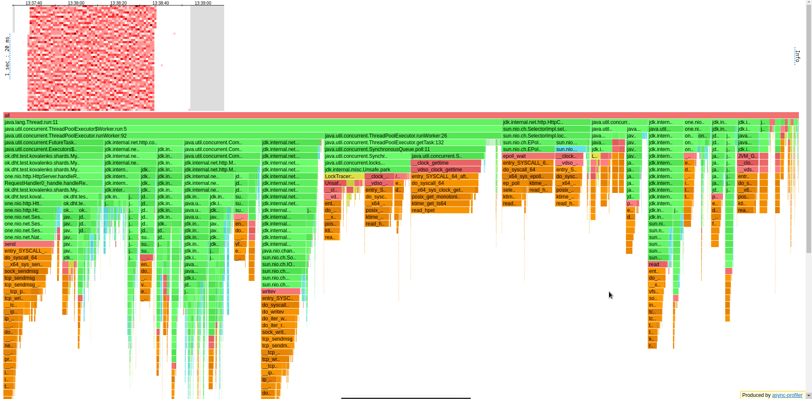
видим, что 78% уходит на чтение запросов и отправку ответов (из них 12% происходит
работа непосредственно с нашими шардами - балансировка, а остальные 66% идут на
работу HTTP), порядка 11% тратится на паркинг потоков, ещё 11% времени мы лочимся на
селектор тредах (метод SelectorImpl::lockAndDoSelect). Суммарно мы простаиваем 22%
времени, что говорит нам о том, что наша база работает неоптимально и в ней есть
что улучшать. Например, можно было бы попробовать как изменить клиент, который
взаимодействует с базой (вместо JavaNet взять OneNio), так и сменить сам протокол
взаимодействия (не HTTP, а, например, FTP, если мы говорим об уменьшении аллокаций
на преобразования потока байт в строку и обратно).

По ALLOC
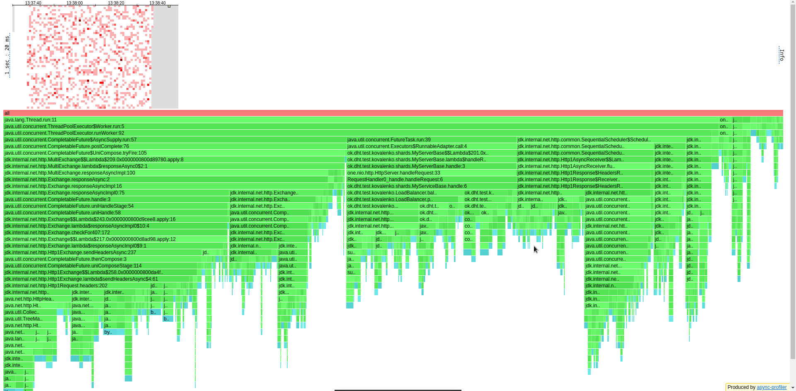
видим, лишь 22% аллокаций потребляет наш асинхронный сервер, тогда как оставшиеся
78% аллокаций приходятся на работу HTTP (из них 44% на работу MultiExchanger -
управляет сетевыми фильтрами и ошибками - и 22% на таски по расписанию - Http1AsyncReceiver,
который помещает входные запросы в очередь до тех пор, пока аксепторы не примут их
в обработку).

По LOCK
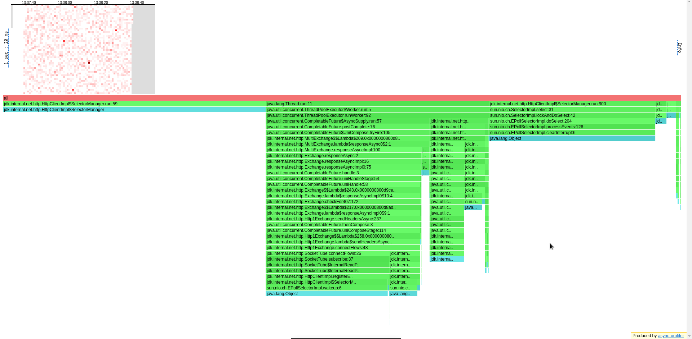
видим, что 64% локов приходится на работу SelectorManager, который забирает
из сокетов запросы, 24% на обмены асинхронными ответами и 9% на таски по расписанию.

По латенси
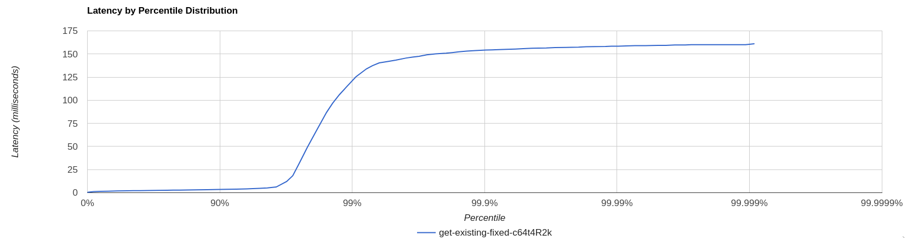
видим, что только 6% запросов не укладываются в 5мс, что, казалось бы, должно даже
впечатлить, если бы этих запросов было не 2Krps. Чуть выше мы дополнительно могли
наблюдать отклонение по max latency в 40 раз. Это объясняется периодической
работой GC, поскольку мы наалоцировали очень много MergeIterator'ов.

### Бьём по существующим ключам рандомно

Начинаем со 100Krps:

```
../wrk2/wrk -c64 -d60s -t4 -R100000 http://localhost:19234 -s ../scripts/get/get-existing-random.lua
Running 1m test @ http://localhost:19234
  4 threads and 64 connections
  Thread calibration: mean lat.: 4941.188ms, rate sampling interval: 17793ms
  Thread calibration: mean lat.: 4947.249ms, rate sampling interval: 17809ms
  Thread calibration: mean lat.: 4949.397ms, rate sampling interval: 17760ms
  Thread calibration: mean lat.: 4950.990ms, rate sampling interval: 17842ms
  Thread Stats   Avg      Stdev     Max   +/- Stdev
    Latency    34.80s    14.28s    1.00m    57.95%
    Req/Sec    50.38      0.48    51.00    100.00%
  12162 requests in 1.00m, 856.94KB read
  Non-2xx or 3xx responses: 388
Requests/sec:    202.55
Transfer/sec:     14.27KB
```

База смогла втащить лишь порядка 200Rps. Ошибки появляются, скорее всего,
как из-за таймаутов, так и из-за того, что очередь запросов забивается из-за
длительного ожидания ответов, и новые запросы приходится риджектить. Без ошибок
не получается работать даже на 1rps. Результаты врк для 190rps:

```
../wrk2/wrk -c64 -d60s -t4 -R190 -L http://localhost:19234 -s ../scripts/get/get-existing-random.lua
Running 1m test @ http://localhost:19234
  4 threads and 64 connections
  Thread calibration: mean lat.: 428.011ms, rate sampling interval: 1216ms
  Thread calibration: mean lat.: 416.608ms, rate sampling interval: 1191ms
  Thread calibration: mean lat.: 425.060ms, rate sampling interval: 1207ms
  Thread calibration: mean lat.: 422.517ms, rate sampling interval: 1205ms
  Thread Stats   Avg      Stdev     Max   +/- Stdev
    Latency   589.09ms  320.29ms   1.37s    62.36%
    Req/Sec    47.30      4.56    61.00     81.10%
  11389 requests in 1.00m, 802.51KB read
  Non-2xx or 3xx responses: 356
Requests/sec:    189.72
Transfer/sec:     13.37KB
```

Судя по ошибкам, база не втащила эти 190rps, равно как не втащила и 1rps.
Посмотрим на профили (что в общем-то неправильно). Если брать за точку опоры
эти 190rps, то текущие показатели **хуже** тех, что были на stage2,
**в 90 раз**.

По CPU
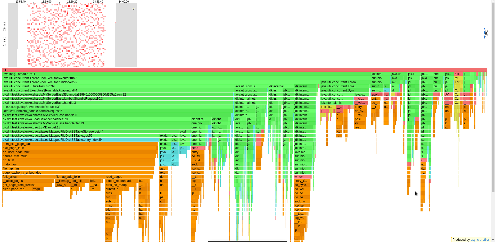
видим, что высокой нагрузки как таковой нет (мало семплов), 47% времени мы читаем
ключи из базы, 9% времени мы простаиваем (уже лучше в сравнении с фиксированными
гетами), а оставшаяся часть тратится на HTTP-взаимодействие. Стоит учитывать,
что тут геты были случайными, и в 66% случаев нам нужно было проксировать запрос
на другую ноду, что сказалось на проценте времени, отведённом на работу с нашей базой.
Вместе с этим предсказуемо сильно возросло число пейдж фолтов (на них приходится
32% процессорного времени). Поскольку страничек на диске очень много, а кэш
ОС не такой уж большой (в сумме не больше двух десятков МБ на моей машине),
то она чаще тратит время на подгрузку новых страниц из памяти.

По ALLOC
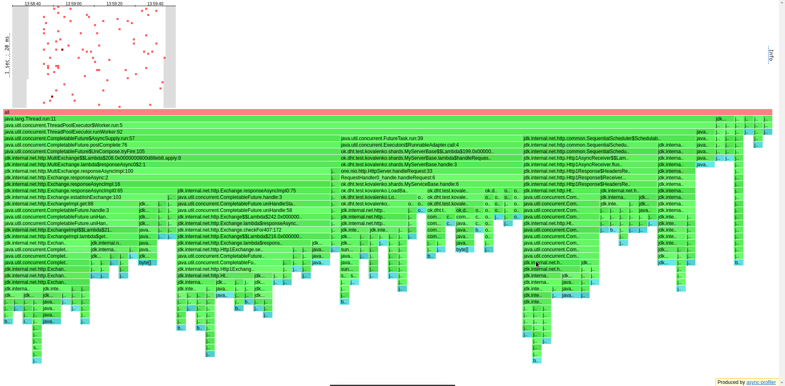
видим, что аллокаций было достаточно мало (профилировщик сумел захватить лишь
80 семплов), что вытекает из того, что мы много времени тратим на обработку
одного конкретного запроса, а не многих нескольких.

По LOCK
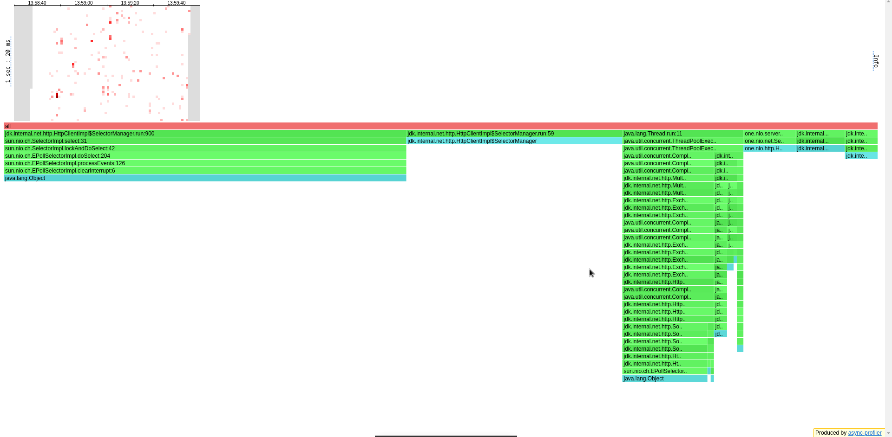
ожидаемо видим, что половину всех блокировок занимают селекты от селектор тредов,
поскольку сами селекторы готовы принимать запросов гораздо больше, чем 190rps,
однако, по всей видимости, проксирование теми способами, какие применяются
в настоящий момент, портит всю малину.

По латенси
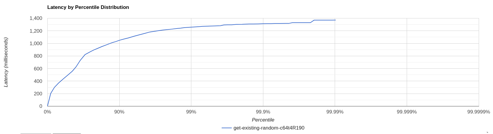
видим, что время отклика всех запросов не укладывается в 5мс. Причины тому
излагаются выше.

### Бьём по несуществующим ключам

Начинаем со 100Krps:

```
../wrk2/wrk -c64 -d60s -t4 -R100000 http://localhost:19234 -s ../scripts/get/get-non-existing.lua
Running 1m test @ http://localhost:19234
  4 threads and 64 connections
  Thread calibration: mean lat.: 4946.284ms, rate sampling interval: 17711ms
  Thread calibration: mean lat.: 4947.250ms, rate sampling interval: 17727ms
  Thread calibration: mean lat.: 4948.275ms, rate sampling interval: 17727ms
  Thread calibration: mean lat.: 4947.372ms, rate sampling interval: 17711ms
  Thread Stats   Avg      Stdev     Max   +/- Stdev
    Latency    34.28s    14.05s    0.98m    57.77%
    Req/Sec   596.50      5.50   602.00    100.00%
  143088 requests in 1.00m, 9.42MB read
  Non-2xx or 3xx responses: 143088
Requests/sec:   2384.69
Transfer/sec:    160.69KB
```

Проверим 2Krps:

```
../wrk2/wrk -c64 -d60s -t4 -R2000 -L http://localhost:19234 -s ../scripts/get/get-non-existing.lua
Running 1m test @ http://localhost:19234
  4 threads and 64 connections
  Thread calibration: mean lat.: 6.742ms, rate sampling interval: 28ms
  Thread calibration: mean lat.: 9.186ms, rate sampling interval: 29ms
  Thread calibration: mean lat.: 6.728ms, rate sampling interval: 28ms
  Thread calibration: mean lat.: 9.176ms, rate sampling interval: 29ms
  Thread Stats   Avg      Stdev     Max   +/- Stdev
    Latency    12.40ms   14.54ms  83.65ms   91.35%
    Req/Sec   508.04     91.26     0.93k    77.37%
  118879 requests in 1.00m, 7.82MB read
  Non-2xx or 3xx responses: 118879
Requests/sec:   1981.02
Transfer/sec:    133.49KB
```

С первого взгляда база втащила эти 2Krps, но поскольку мы били по несуществующим
гетам, не понять, были ли у нас ошибки кроме NOT_FOUND или нет. Можно было бы
мониторить логи, куда пишутся ошибки, но за десятки wrk-испытаний там накопилось
информации на гигабайты, и хотя в них указано время логгирования, зато в врк - нет.
Кстати, тут результаты **в 15 раз хуже**, чем было на предыдущем этапе.

По CPU
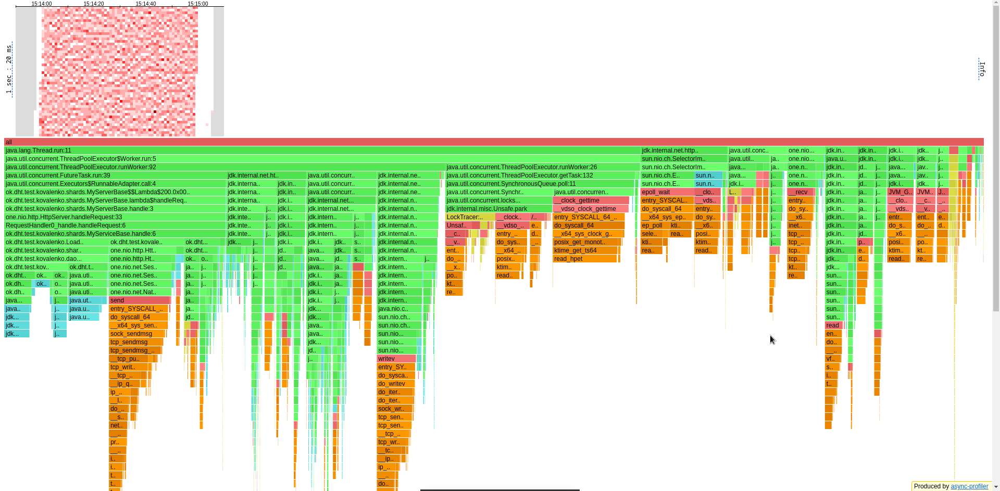
видим, что 22% времени идёт на непосредственную обработку нами запросов,
примерно столько же - на "отдых" потоков и селектор тредов, остаток (56%)
идёт разного рода обработка HTTP. Судя по процентному количеству паркинга
потоков можно судить о том, что система работает точно не на пределе своих
возможностей.

По ALLOC
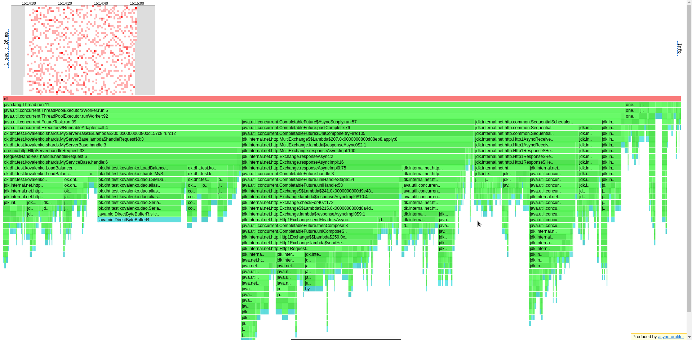
видим, на наш хендлинг приходится порядка 35% аллокаций (их стало больше, но они,
скажем так, "лёгкие" в том плане, что у нас из Dao возвращается пустой
MergeIterator, а поскольку выдача несуществующего ключа - почти самая быстрая
операция, то, соответстенно, мы быстрее посылаем ответ, за счёт чего удаётся
обработать больше операций).

По LOCK
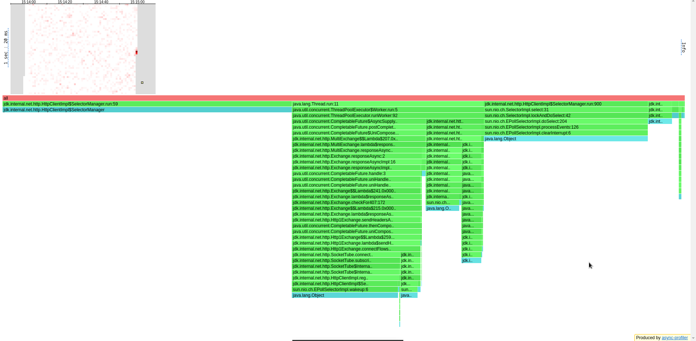
видим, что блокировок у нас хотя и много, но они недолгие, в сравнении с
фиксированными гетами у нас стало на 4% больше блокировок на уровне селектов,
то есть мы словно недостаём в rps (могли бы тут обработать больше).

По латенси
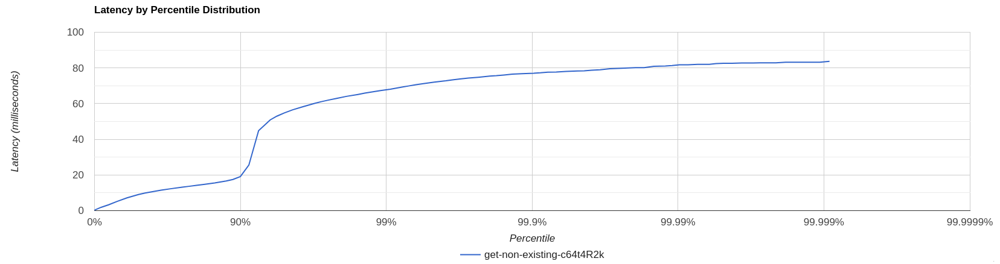
видим, что только 20% запросов вмещаются в диапазон до 5мс. На 90 перцентиле
замечаем скачок - вероятно, он связан с тем, что из-за большой (но не высокой!)
нагрузки нашей базы система часто уходила в EPollWait, ожидая появления
свободных файловых дескрипторов, а это вызвано конкуренцией потоков на стороне
сервера.

### Бьём смешанно (существующие + несуществующие)

Начинаем со 100Krps:

```
../wrk2/wrk -c64 -d60s -t4 -R100000 http://localhost:19234 -s ../scripts/get/get-mixed.lua
Running 1m test @ http://localhost:19234
  4 threads and 64 connections
  Thread calibration: mean lat.: 5160.604ms, rate sampling interval: 18120ms
  Thread calibration: mean lat.: 5163.096ms, rate sampling interval: 18120ms
  Thread calibration: mean lat.: 5167.222ms, rate sampling interval: 18120ms
  Thread calibration: mean lat.: 5166.101ms, rate sampling interval: 18120ms
  Thread Stats   Avg      Stdev     Max   +/- Stdev
    Latency    35.67s    14.47s    1.00m    57.53%
    Req/Sec    62.50      2.50    65.00    100.00%
  16154 requests in 1.00m, 1.09MB read
  Non-2xx or 3xx responses: 8171
Requests/sec:    268.85
Transfer/sec:     18.54KB
```

Проверим 250rps:

```
../wrk2/wrk -c64 -d60s -t4 -R250 -L http://localhost:19234 -s ../scripts/get/get-mixed.lua
Running 1m test @ http://localhost:19234
  4 threads and 64 connections
  Thread calibration: mean lat.: 255.228ms, rate sampling interval: 1113ms
  Thread calibration: mean lat.: 259.837ms, rate sampling interval: 1117ms
  Thread calibration: mean lat.: 261.680ms, rate sampling interval: 1121ms
  Thread calibration: mean lat.: 196.040ms, rate sampling interval: 1000ms
  Thread Stats   Avg      Stdev     Max   +/- Stdev
    Latency   713.14ms  620.07ms   2.15s    59.28%
    Req/Sec    62.18     10.62    96.00     73.48%
  14956 requests in 1.00m, 1.01MB read
  Non-2xx or 3xx responses: 7543
Requests/sec:    248.90
Transfer/sec:     17.17KB
```

База справилась лишь с 250rps (это **хуже в 136 раз** в сравнении со stage2).
Посмотрим на хитмапы.

По CPU
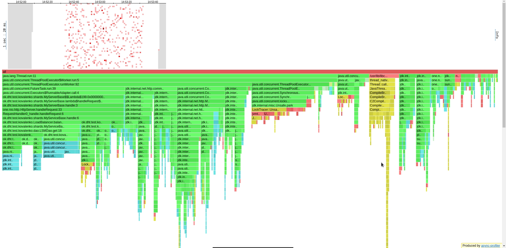
видим достаточно необычную картину - база словно отдыхает, а не работает.
Внятного объяснения этому не найдено, но мы точно что-то делаем не так.

По ALLOC
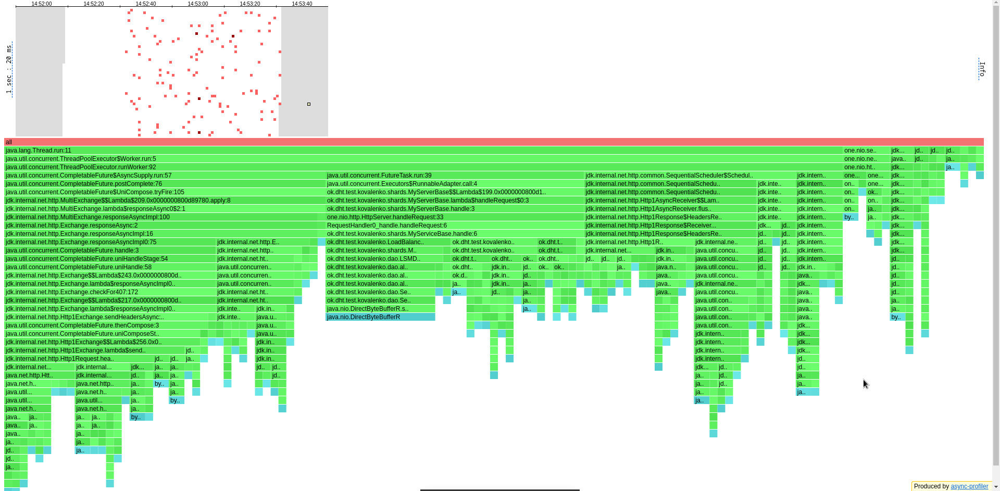
ситуация почти такая же, что и на существующих случайных ключах.

По LOCK
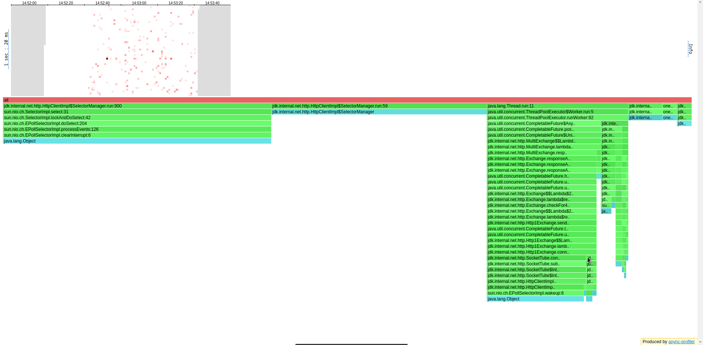
ситуация почти такая же, что и на существующих случайных ключах.

По латенси
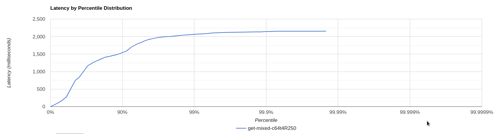
ситуация почти такая же, что и на существующих случайных ключах.

## PUT

### Квази-фиксированной длины (берём число из диапазона [1, 300'000'000])

Начинаем со 100Krps:

```
../wrk2/wrk -c64 -d60s -t4 -R100000 http://localhost:19234 -s ../scripts/put/put-fixed.lua
Running 1m test @ http://localhost:19234
  4 threads and 64 connections
  Thread calibration: mean lat.: 6010.342ms, rate sampling interval: 18382ms
  Thread calibration: mean lat.: 6007.510ms, rate sampling interval: 18366ms
  Thread calibration: mean lat.: 5250.399ms, rate sampling interval: 16498ms
  Thread calibration: mean lat.: 6007.706ms, rate sampling interval: 18366ms
  Thread Stats   Avg      Stdev     Max   +/- Stdev
    Latency    35.16s    13.32s    0.96m    60.04%
    Req/Sec     0.96k   106.56     1.06k    55.56%
  210126 requests in 1.00m, 13.43MB read
Requests/sec:   3502.09
Transfer/sec:    229.14KB
```

Проверим 3Krps:

```
../wrk2/wrk -c64 -d60s -t4 -R3000 -L http://localhost:19234 -s ../scripts/put/put-fixed.lua
Running 1m test @ http://localhost:19234
  4 threads and 64 connections
  Thread calibration: mean lat.: 4245.726ms, rate sampling interval: 11182ms
  Thread calibration: mean lat.: 4247.914ms, rate sampling interval: 11182ms
  Thread calibration: mean lat.: 4250.036ms, rate sampling interval: 11190ms
  Thread calibration: mean lat.: 4244.523ms, rate sampling interval: 11173ms
  Thread Stats   Avg      Stdev     Max   +/- Stdev
    Latency     3.66s     2.07s    6.83s    55.98%
    Req/Sec   835.19     53.31     0.88k    75.00%
  179914 requests in 1.00m, 11.50MB read
Requests/sec:   2998.52
Transfer/sec:    196.19KB
```

Всё хорошо, ошибок нет, справляемся с нагрузкой. Она между тем **ниже в 20 раз**,
чем была на предыдущем этапе.

По CPU
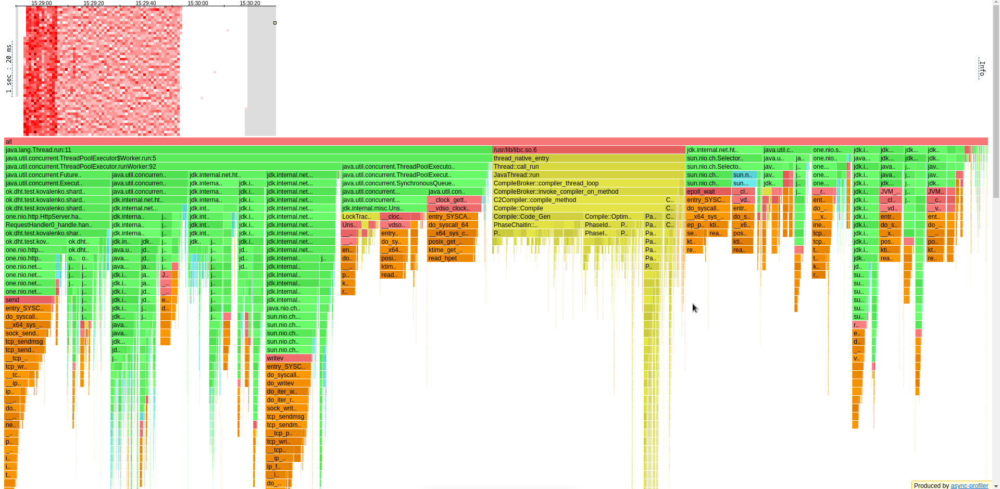
видим, что на старте происходит компиляция, занимающая там 56% cpu - база
разогревается, лишь 11% итогового времени уходит на хендлинг запросов, тогда
как 17% мы простаиваем, а оставшуюся долю - подписываемся на освобождение
FD. После прогрева компилятор продолжает оптимизировать участки кода,
и время от времени появляется GC.

По ALLOC
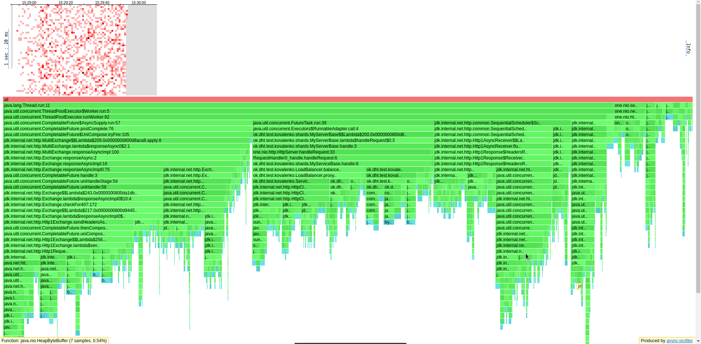
видим, что аллокаций много, 25% уходит на наш хендлинг, 35% - на ожидание
асинхронного ответа от CompletableFuture, остальное на другие операции по
HTTP.

По LOCK
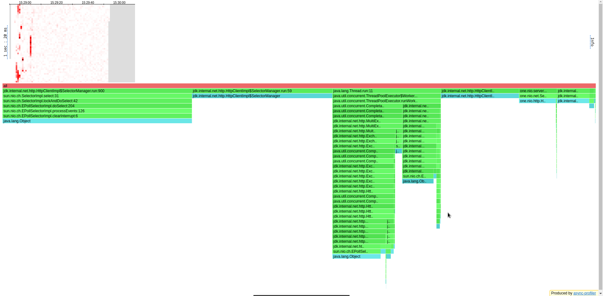
видим, что на старте у нас есть прогрев нашей системы (в пуле потоков
на старте есть лишь 1 поток, принимающий запросы, и по мере увеличения нагрузки
пул добавляет новые потоки, чтобы выдерживать нагрузку), а после видим,
что блокировки появляются не часто, что позволяет судить об эффективности
выбранной очереди и параметров к ней.

По латенси
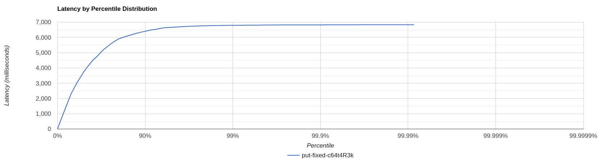
видим, что 100% запросов не вмещаются в 5мс. Объяснить это можно тем, то у нас
активно работает GC и флашатся потоки.

### Переменной длины (берём строку длиной из диапазона [1, 10'000])

Начинаем со 100Krps:

```
../wrk2/wrk -c64 -d60s -t4 -R100000 http://localhost:19234 -s ../scripts/put/put-random.lua
Running 1m test @ http://localhost:19234
  4 threads and 64 connections
  Thread calibration: mean lat.: 5211.569ms, rate sampling interval: 18513ms
  Thread calibration: mean lat.: 5089.313ms, rate sampling interval: 17563ms
  Thread calibration: mean lat.: 5303.325ms, rate sampling interval: 18006ms
  Thread calibration: mean lat.: 4902.843ms, rate sampling interval: 16334ms
  Thread Stats   Avg      Stdev     Max   +/- Stdev
    Latency    34.91s    14.16s    1.00m    58.43%
    Req/Sec    39.56      1.50    41.00     88.89%
  9326 requests in 1.00m, 610.20KB read
Requests/sec:    155.31
Transfer/sec:     10.16KB
```

Ожидаемо мы можем обработать лишь сотню с копейкой rps. Попробуем 150rps:

```
../wrk2/wrk -c64 -d60s -t4 -R150 -L http://localhost:19234 -s ../scripts/put/put-random.lua
Running 1m test @ http://localhost:19234
  4 threads and 64 connections
  Thread calibration: mean lat.: 1739.020ms, rate sampling interval: 5869ms
  Thread calibration: mean lat.: 2037.735ms, rate sampling interval: 6008ms
  Thread calibration: mean lat.: 1399.991ms, rate sampling interval: 4743ms
  Thread calibration: mean lat.: 1914.086ms, rate sampling interval: 5668ms
  Thread Stats   Avg      Stdev     Max   +/- Stdev
    Latency     1.61s     1.94s   10.90s    86.39%
    Req/Sec    39.03      2.55    45.00     82.
  8973 requests in 1.00m, 587.10KB read
Requests/sec:    148.93
Transfer/sec:      9.74KB
```

От среднего латенси в полторы секунды по коже мурашки бегут. Но база живёт,
не захлебнулась. Посмотрим на профили.

По CPU
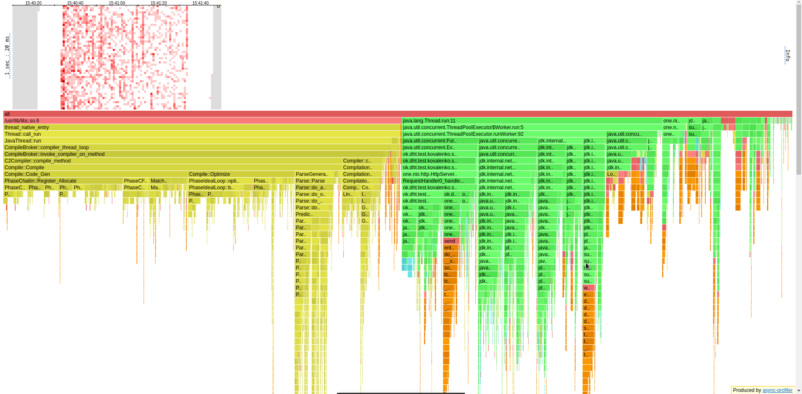
видим, что снова 50% времени занимает компиляция приходящих ответов.
Сравнительно со stage2 изменился только характер оставшейся половинки -
она стала более пёстрой в том смысле, что мы выполняем гораздо больше действий
(помимо работы с Dao нужно ещё обеспечивать асинхронность запросов и ответов,
так как мы проксируем запросы через sendAsync).

По ALLOC
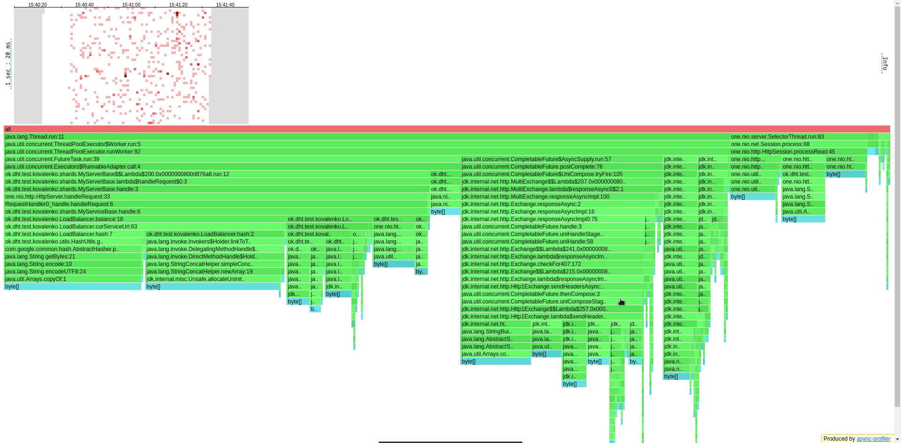
видим, что 32% аллокаций приходится на получение хэша по входящему ключу,
10% при создании прокси-запроса, 5% при получении ключа из реквеста (метод
getParameter), CompletableFuture потребляет 23% из общей доли, а всё остальное
уходил на иную HTTP-обработку. Кажется, что по аллокациям всё в пределе нормы.

По LOCK
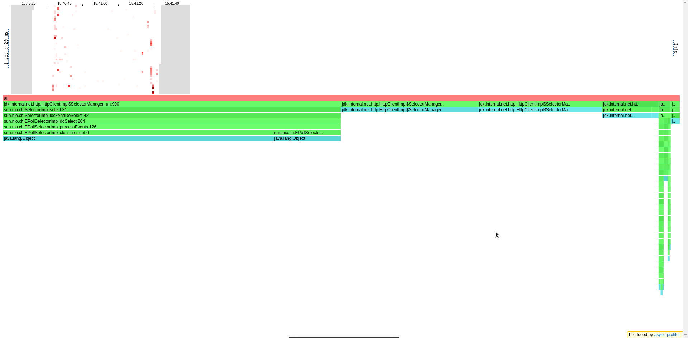
видим, что блокировок как таковых мы особо не наблюдаем, их почти нет, так как всё
время уходит не на гонку потоков, а на компиляцию HTTP-парсеров
и обработку огромных ключей и значений внутри Dao. Примечательно, что в начале
и в конце мы видим одни и те же блокировки с одной и той же "весовой долей" -
на старте у нас блокировки при разогреве базы, ибо запросов
ещё не поступает, а в конце - при окончании работы врк мы лочимся на
селектор тредах, ибо запросов больше не поступает.

По латенси
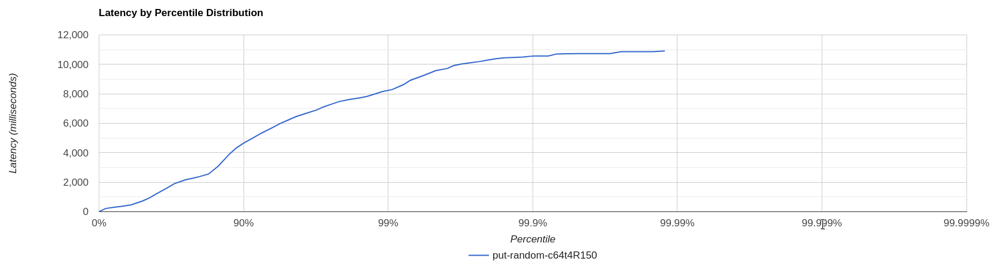
видим, что 100% нагрузки приходится на латенси, большее, чем 5мс.

## Выводы

Наблюдаем, что в сравнении со stage2 перформанс упал в десятки-сотни раз,
однако было сделано большое дело - данные были разбиты на шарды, благодаря
чему мы теперь спокойно можем выходить за рамки одной машины.
