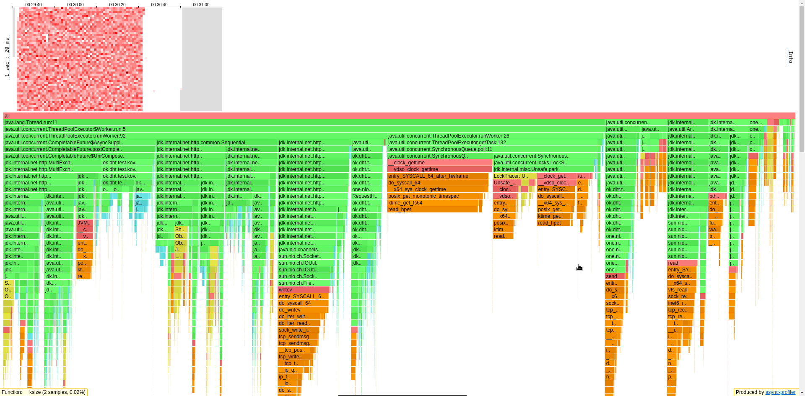
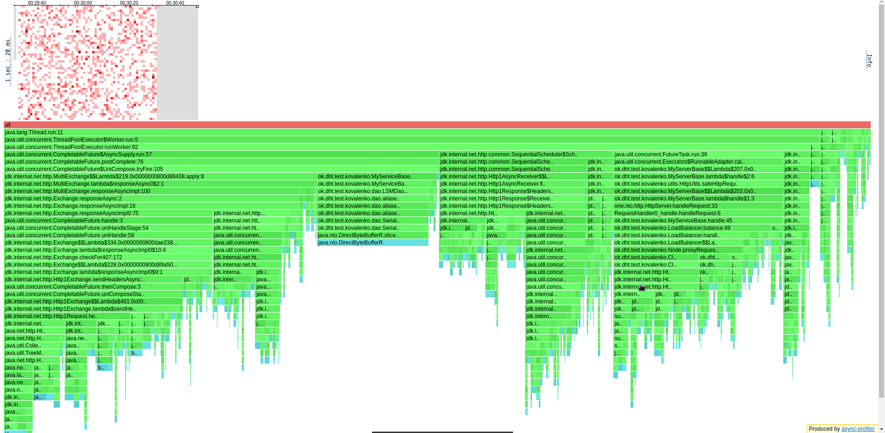
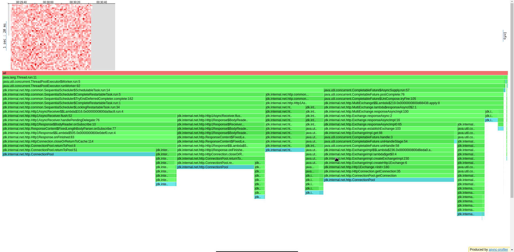
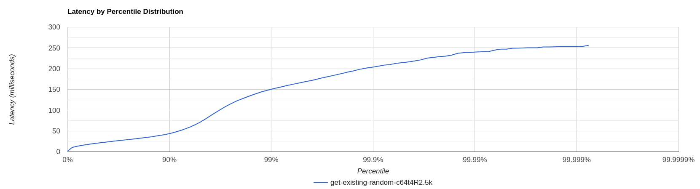
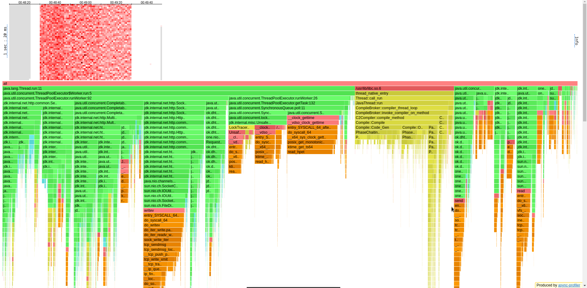
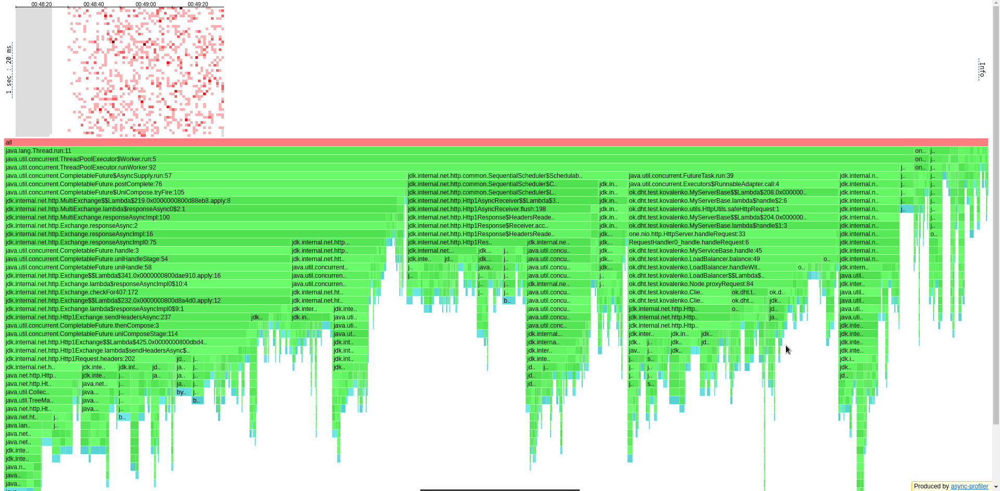
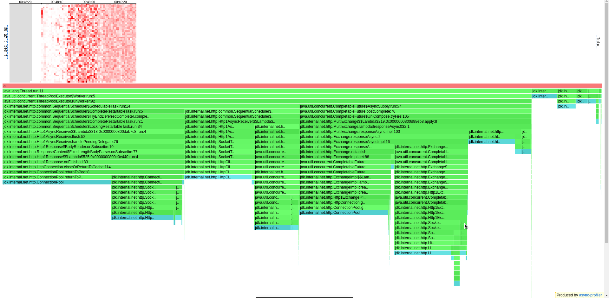
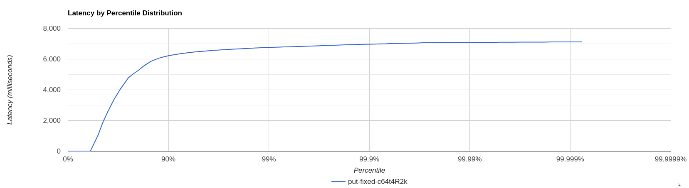

# Отчёт по профилированию NoSQL-базы данных (Репликация)

## Общая часть
Изначально Stage 5 делался без тюнинга CompletableFuture из доклада Сергея Куксенко,
перформанс на гетах был на уровне 3.5Krps без профилирования и 2.5Krps с профилированием
(странно, кажется, что сискол на взятие стектрейсов от async-profiler замедляет
нашу базу) и примерно на том же уровне были put'ы. После тюнинга перформанс поднялся
до уровня 5.5Krps на гетах без профилей. Однако эта точка, на которой была получена
такая производительность, не была закоммичена, и после нескольких неатомарных изменений
онное было утеряно, хоть я и пытался как-то восстановить то состояние.

## GET

### Бьём по случайному ключу

Начинаем со 10Krps (заведомо большое число, приводящее систему к перегрузке):

```
../wrk2/wrk -c64 -d60s -t4 -R10000 http://localhost:19234 -s ../scripts/get/get-existing-random.lua
Running 1m test @ http://localhost:19234
  4 threads and 64 connections
  Thread calibration: mean lat.: 2914.339ms, rate sampling interval: 10534ms
  Thread calibration: mean lat.: 3063.340ms, rate sampling interval: 11411ms
  Thread calibration: mean lat.: 3050.412ms, rate sampling interval: 11386ms
  Thread calibration: mean lat.: 3058.123ms, rate sampling interval: 11436ms
  Thread Stats   Avg      Stdev     Max   +/- Stdev
    Latency    22.11s     9.16s   38.67s    57.81%
    Req/Sec     0.90k     4.25     0.91k    81.25%
  214557 requests in 1.00m, 17.52MB read
  Non-2xx or 3xx responses: 71102
Requests/sec:   3575.96
Transfer/sec:    298.98KB
```

Ошибки появляются из-за того, что теперь мы забираем два самых быстрых ответа (кворум по умолчанию),
а поскольку мы поднимаем кластер из 3 нод, то не NOT_FOUND значение найдётся в
двух случаях из трёх - это и видим по соотношению (Non-2xx or 3xx responses) / (total requests).
Пристрелимся на 2.5Krps:

```
../wrk2/wrk -c64 -d60s -t4 -R2500 -L http://localhost:19234 -s ../scripts/get/get-existing-random.lua
Running 1m test @ http://localhost:19234
  4 threads and 64 connections
  Thread calibration: mean lat.: 15.654ms, rate sampling interval: 53ms
  Thread calibration: mean lat.: 15.725ms, rate sampling interval: 54ms
  Thread calibration: mean lat.: 15.967ms, rate sampling interval: 54ms
  Thread calibration: mean lat.: 17.369ms, rate sampling interval: 55ms
  Thread Stats   Avg      Stdev     Max   +/- Stdev
    Latency    27.28ms   25.19ms 256.00ms   92.51%
    Req/Sec   630.72     89.93     0.96k    71.21%
  149297 requests in 1.00m, 12.19MB read
  Non-2xx or 3xx responses: 49305
Requests/sec:   2488.30
Transfer/sec:    208.08KB
```

База смогла втащить уже 2.5Krps, что **почти в 2 раза лучше**, чем было на предыдущем
этапе. К уровню stage3, как предполагалось ранее, мы, однако, не вернулись.
Посмотрим на профили.

По CPU

видим, что наши манипуляции занимают всего лишь 15% процессорного времени, 12%
уходит на completion у CompletableFuture (метод *UniCompose::tryFire*), 15% мы 
выполняем SchedulableTasks (*Http1AsyncReceiver::flush*, который очищает очередь
запросов, и *TryEndDeferredCompleter::complete*, отвечающий за выгрузку данных
в функции *runOrSchedule*), 9% на запись в сокет, 26% времени мы перемещаем таски
экзекьютера между потоками (причём из них лишь половина уходит на реально полезную работу,
оставшееся время мы "отдыхаем", то есть либо у нас жирная очередь задач, либо
просто на каком-то этапе всё тормозится и таски дольше доходят до очереди), всё
оставшееся время работают селекторы.

По ALLOC

видим, ровно треть всех аллокаций идут от дао и клиента, 20% - от *Http1Exchange::sendHeadersAsync*,
9% идёт на построение *HttpExchange* (обменник между запросом и ответом),
17% на *Http1AsyncReceiver::flush*, о котором говорилось выше, по 3% на 
*TryEndDeferredCompleter* и *SocketTube::WriteSubscription*, небольшой остаток уходит
на работу селекторов.

По LOCK

неожиданно видим очень много блокировок. 52% из них уходит на коллбеки *HttpResponse*, 
которые пытаются закрыть соединение после каждого ответа (установлен параметр
*Http1Response::return2Cache* в true, почему - понять по исходникам не удалось, но
по косвенным признакам - *Http1Response::ignoreBody* - можно заметить, что в true
параметр установлен тогда, когда общение происходит не по *WebSocket*), 12% происходит
при флашинге *AsyncReceiver'а*, 26% при получении соединения и ещё 6% получаем в
*Http1Exchange::sendHeadersAsync* (в *EPollSelectorImpl::wakeup* после регистрации
события).

По латенси

видим, что все запросы не укладываются в 5мс, что объясняется как обилием блокировок,
так и тем, что после каждого *ConnectionPool::getConnection* происходит компиляция 
SharedRuntime и сискол *jvmti_GetStackTrace*.

## PUT

### Фиксированной длины

Начинаем со 10Krps:

```
../wrk2/wrk -c64 -d60s -t4 -R10000 http://localhost:19234 -s ../scripts/put/put-fixed.lua
Running 1m test @ http://localhost:19234
  4 threads and 64 connections
  Thread calibration: mean lat.: 5503.307ms, rate sampling interval: 16498ms
  Thread calibration: mean lat.: 4730.085ms, rate sampling interval: 14680ms
  Thread calibration: mean lat.: 5517.064ms, rate sampling interval: 16482ms
  Thread calibration: mean lat.: 5506.629ms, rate sampling interval: 16498ms
  Thread Stats   Avg      Stdev     Max   +/- Stdev
    Latency    24.85s     8.46s   39.68s    58.69%
    Req/Sec     0.96k    59.93     1.01k    66.67%
  204811 requests in 1.00m, 14.65MB read
Requests/sec:   3413.31
Transfer/sec:    250.00KB
```

Проверим 2Krps:
```
../wrk2/wrk -c64 -d60s -t4 -R2000 -L http://localhost:19234 -s ../scripts/put/put-fixed.lua
Running 1m test @ http://localhost:19234
  4 threads and 64 connections
  Thread calibration: mean lat.: 4000.195ms, rate sampling interval: 11190ms
  Thread calibration: mean lat.: 4001.143ms, rate sampling interval: 11231ms
  Thread calibration: mean lat.: 4002.382ms, rate sampling interval: 11149ms
  Thread calibration: mean lat.: 3997.679ms, rate sampling interval: 11198ms
  Thread Stats   Avg      Stdev     Max   +/- Stdev
    Latency     2.26s     2.51s    7.12s    74.81%
    Req/Sec   564.81     61.42   668.00     50.00%
  119952 requests in 1.00m, 8.58MB read
Requests/sec:   1999.19
Transfer/sec:    146.43KB
```

По времени отклика не очень похоже, что мы справляемся с нагрузкой, и тем не менее
wrk утверждает, что мы втащили нагрузку. Перформанс системы почти никак не изменился с предыдущего этапа.
Посмотрим на профили.

По CPU

видим, что на старте жирный кусок фреймов занимает компиляция (из 14 секунд
почти 44% времени) - разогрев базы. Этим объясняется то, что наше латенси на старте
измеряется не в миллисекундах, а в секундах. В целом видим, что на наши методы приходится
всего лишь 6% процессорного времени, что крайне мало, 12% времени уходит на
SchedulableTasks, 12% - на postCompletion собственныъ задач ThreadPoolExecutor'а,
11% - на запись в сокет, 10% времени система простаивает (причины те же, что и у гетов),
остальное время занимают селектор треды.

По ALLOC

ситуация в общем та же, что и на гетах.

По LOCK

ситуация в общем та же, что и на гетах.

По латенси

видим, что 40% запросов не умещается в 5мс. На старте (17% времени) это может
быть связано с компиляцией потоков, а в целом с тем, что мыпостоянно (25% времени)
дёргаем системные часы (*syscall __clock_gettime*).

## Выводы

Заключаем, что производительность приложения удалось повысить благодаря устранению
ожидания ответов от реплик с помощью CompletableFuture, но не сильно
(на гетах - в 2 раза, на путах почти в нисколько). Однако появились блокировки
в методах самого CF, в которые в конечном счёте и упёрся перформанс.
