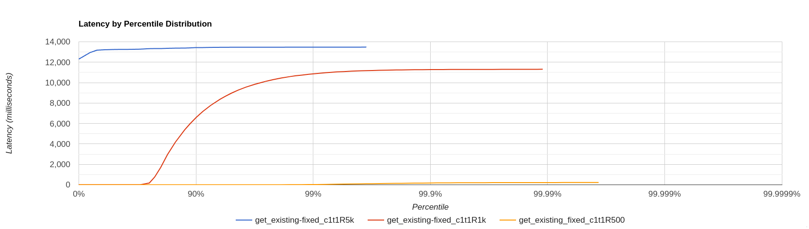
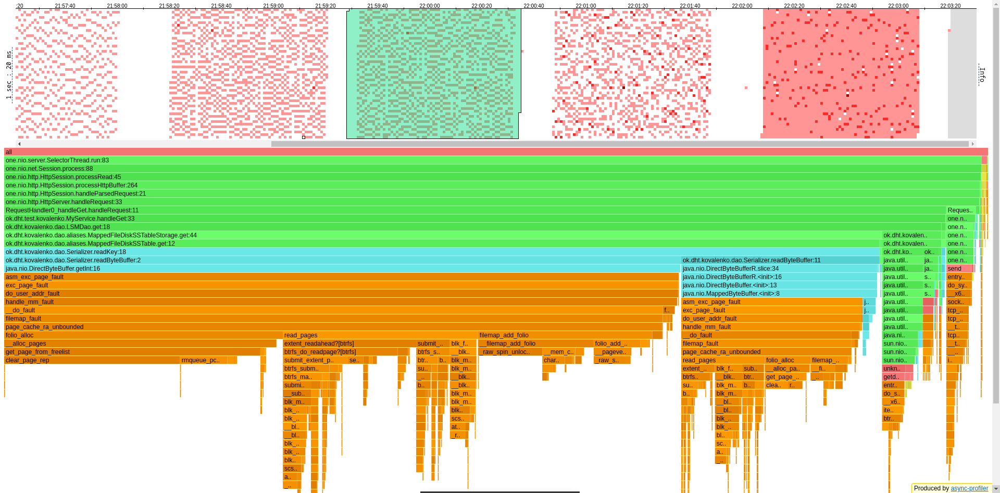
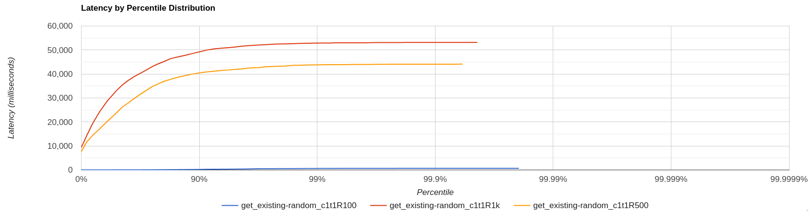
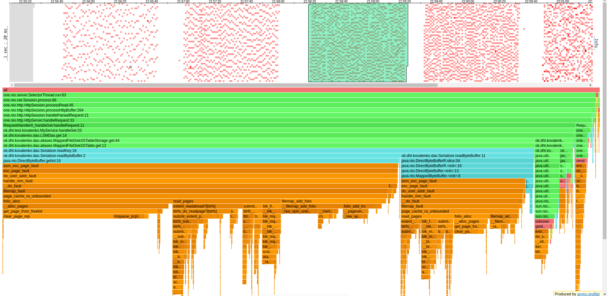
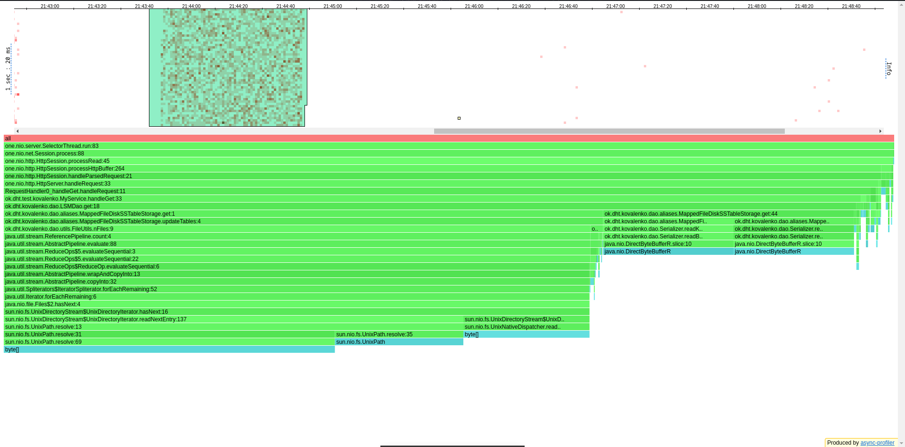
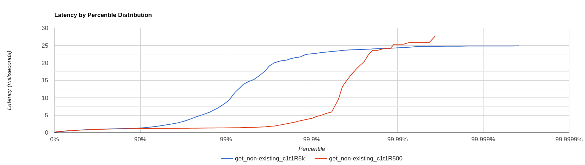
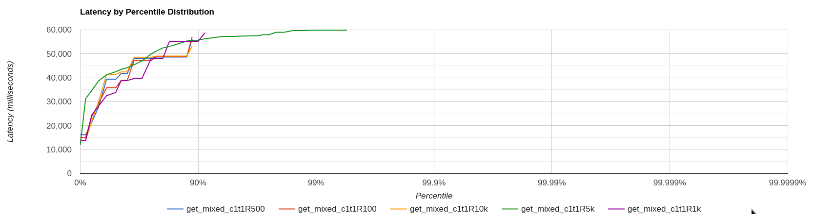

# Отчёт по профилированию NoSQL-базы данных

## Общая часть

На табличках по 1МБ система показывала себя не лучшим образом
(скорость чтения дисковой головки была одинаковой, но пробег по тысяче файлов занимал львиную долю времени),
так что было решено увеличить размер хранимых и записываемых таблиц до 64МБ, сохраняя
имитацию высокой нагрузки. Дополнительно в качестве оптимизации был добавлен алгоритм key-range,
позволяющий по чтению первого и последнего ключа в файле (а они отсортированы) определять,
стоит ли вообще смотреть в данных файл или можно его пропустить, не заставляя бинарный поиск
выполнять десятки сисколов. Это значительным образом повысило производительность, но слабые места
всё равно остались. Профилирование проводилось на данных размером 3ГБ, что явно
не вмещается в КЭШ современных компьютеров, а значит сие исследование представляет определённый
интерес с точки зрения анализа перформанса БД.

## GET

Ввиду того, что бить по одному и тому же ключу непоказательно с точки зрения анализа
перформанса БД (процессор закэширует нужную страницу и будет обращаться к ней, а не искать
каждый раз её по-новой), было решено выставлять ключи рандомно.

### Бьём по одному и тому же существующему ключу

```
../wrk2/wrk -c 1 -d 60s -t 1 -R 500 http://localhost:19234/v0/entity\?id\=k0010000000 
Running 1m test @ http://localhost:19234/v0/entity?id=k0010000000
  1 threads and 1 connections
  Thread calibration: mean lat.: 241.004ms, rate sampling interval: 2379ms
  Thread Stats   Avg      Stdev     Max   +/- Stdev
    Latency     0.87ms  473.47us  15.33ms   88.64%
    Req/Sec   499.76      0.43   500.00    100.00%
  30001 requests in 1.00m, 2.12MB read
Requests/sec:    500.01
Transfer/sec:     36.13KB
```

```
../wrk2/wrk -c 1 -d 60s -t 1 -R 1000 http://localhost:19234/v0/entity\?id\=k0010000000
Running 1m test @ http://localhost:19234/v0/entity?id=k0010000000
  1 threads and 1 connections
  Thread calibration: mean lat.: 1.175ms, rate sampling interval: 10ms
  Thread Stats   Avg      Stdev     Max   +/- Stdev
    Latency     1.32ms    1.24ms  33.15ms   95.69%
    Req/Sec     1.06k   157.18     3.44k    84.11%
  60000 requests in 1.00m, 4.23MB read
Requests/sec:    999.99
Transfer/sec:     72.27KB
```

На 10к рейте наблюдаем захлёб:

```
../wrk2/wrk -c 1 -d 60s -t 1 -R 10000 http://localhost:19234/v0/entity\?id\=k0010000000
Running 1m test @ http://localhost:19234/v0/entity?id=k0010000000
  1 threads and 1 connections
  Thread calibration: mean lat.: 3641.648ms, rate sampling interval: 11001ms
  Thread Stats   Avg      Stdev     Max   +/- Stdev
    Latency    17.77s     6.94s   29.21s    55.14%
    Req/Sec     5.31k   369.64     5.77k    50.00%
  307805 requests in 1.00m, 21.72MB read
Requests/sec:   5130.12
Transfer/sec:    370.73KB
```

Хотя страничка, в которую мы бьём, останется в кэше процессора, но на поиск самого ключа
бинарным поиском будет всё равно уходить какое-то время. На малом рейте это почти незаметно,
когда как повышая нагрузку на систему, становится очевидным, что головка на диске не успевает так
шустро бегать по файлу и просто уходит в отказ. Чуть подробней эта проблема рассмотрится в следующих
пунктах вариаций GET-запросов. На данном моменте замечаем, что по одному и тому же ключу наша база
способна переварить 5к запросов в секунду.

На гистограмме ниже видно, что разрыв между рейтом 500 и 1к невероятный,
в десятки раз. Для рейта 500 наибольшее латенси после 99 перцентилей,
для рейта 1к - после 70 перцентилей, а для рейта 5к латенси на всём промежукте
константно велико.


### Бьём по существующим ключам рандомно

Разогрев на рейте 1к:

```
../wrk2/wrk -c 1 -d 60s -t 1 -R 1000 -L http://localhost:19234/v0/entity -s get-existing-random.lua
Running 1m test @ http://localhost:19234/v0/entity
  1 threads and 1 connections
  Thread calibration: mean lat.: 5568.258ms, rate sampling interval: 17498ms
  Thread Stats   Avg      Stdev     Max   +/- Stdev
    Latency    32.44s    12.53s    0.89m    58.44%
    Req/Sec   120.00     10.00   130.00    100.00%
6813 requests in 1.00m, 491.79KB read
  Non-2xx or 3xx responses: 113
Requests/sec:    113.55
Transfer/sec:      8.20KB
```

Разогрев не удался. База утонула. Попробуем снизить нагрузку:

```
../wrk2/wrk -c 1 -d 60s -t 1 -R 500 -L http://localhost:19234/v0/entity -s get-existing-random.lua
Running 1m test @ http://localhost:19234/v0/entity
  1 threads and 1 connections
  Thread calibration: mean lat.: 4315.189ms, rate sampling interval: 14221ms
  Thread Stats   Avg      Stdev     Max   +/- Stdev
    Latency    25.08s    10.60s   44.11s    57.22%
    Req/Sec   134.00     12.68   149.00     33.33%
7931 requests in 1.00m, 572.51KB read
  Non-2xx or 3xx responses: 129
Requests/sec:    132.17
Transfer/sec:      9.54KB
```

```
./wrk2/wrk -c 1 -d 60s -t 1 -R 100 -L http://localhost:19234/v0/entity -s get-existing-random.lua
Running 1m test @ http://localhost:19234/v0/entity
  1 threads and 1 connections
  Thread calibration: mean lat.: 63.569ms, rate sampling interval: 336ms
  Thread Stats   Avg      Stdev     Max   +/- Stdev
    Latency    69.38ms  129.55ms 679.42ms   89.50%
    Req/Sec    99.84     19.17   182.00     81.08%
6000 requests in 1.00m, 433.11KB read
  Non-2xx or 3xx responses: 100
Requests/sec:     99.99
Transfer/sec:      7.22KB
```

Только на рейте 100 удалось добиться какой-то адекватной (хотя не до конца) латенси.
Анализируя причины этого,

на рейте 1к видим, что много времени тратится
на пейдж-фолты (напомню, что мы имеем дело с относительно большими таблицами в памяти по 64МБ,
а порог пейдж фолта наступает уже на 4КБ; поскольку наш бинарный поиск бегает по разным регионам
памяти, то 4КБ-странички не хватает и процессор, что ему свойственно, подгружает каждый раз
новую страничку, а поскольку в каждом файле порядка ~2млн энтрей, то на бинарный поиск уйдёт
log2(2млн) ~ 21 итерация). Стоит также отметить, что профилирование проводилось на стареньком
AMD Ryzen 3, что способствует понижению требований от компьютера.

На гистограмме ниже видно, что разрыв по латенси между рейтом 100 и 500 огромен,
высокая производительность наблюдается лишь на низком рейте. Вместе с тем последующий
после 500 рейт становится примерно одного порядка с остальными, а огромные задержки у них
наблюдаются уже на 0 перцентилях.


### Бьём по несуществующим ключам

Попытки дойти до захлёба по поиску несуществующих ключей (сделана оптимизация key-range,
благодаря которой по всем файлам мы бегаем очень быстро):

```
../wrk2/wrk -c 1 -d 60s -t 1 -R 500 -L http://localhost:19234/v0/entity\?id\=k-1       
Running 1m test @ http://localhost:19234/v0/entity
  1 threads and 1 connections
  Thread calibration: mean lat.: 1.535ms, rate sampling interval: 10ms
  Thread Stats   Avg      Stdev     Max   +/- Stdev
    Latency   760.62us  559.65us  27.60ms   97.24%
    Req/Sec   517.62     51.31     1.80k    78.56%
30001 requests in 1.00m, 1.97MB read
  Non-2xx or 3xx responses: 30001
Requests/sec:    500.01
Transfer/sec:     33.69KB
```

```
../wrk2/wrk -c 1 -d 60s -t 1 -R 10000 -L http://localhost:19234/v0/entity\?id\=k-1 
Running 1m test @ http://localhost:19234/v0/entity?id=k-1
  1 threads and 1 connections
  Thread calibration: mean lat.: 30.376ms, rate sampling interval: 199ms
  Thread Stats   Avg      Stdev     Max   +/- Stdev
    Latency     1.49ms    4.76ms  96.26ms   98.55%
    Req/Sec    10.04k   412.80    13.63k    96.80%
599997 requests in 1.00m, 39.48MB read
  Non-2xx or 3xx responses: 599997
Requests/sec:   9999.81
Transfer/sec:    673.82KB
```

На рейте 50к получаем захлёб:

```
../wrk2/wrk -c 1 -d 60s -t 1 -R 50000 http://localhost:19234/v0/entity\?id\=-1  
Running 1m test @ http://localhost:19234/v0/entity?id=-1
  1 threads and 1 connections
  Thread calibration: mean lat.: 2458.656ms, rate sampling interval: 8544ms
  Thread Stats   Avg      Stdev     Max   +/- Stdev
    Latency    14.95s     5.91s   25.17s    57.25%
    Req/Sec    29.44k     0.99k   30.63k    60.00%
  1741299 requests in 1.00m, 114.58MB read
  Non-2xx or 3xx responses: 1741299
Requests/sec:  29021.73
Transfer/sec:      1.91MB

```

Судя по всему, наша база способна выдерживать до 29к запросов в секунду по несуществующим ключам.
Проверим это на 26к:

```
../wrk2/wrk -c 1 -d 60s -t 1 -R 26000 http://localhost:19234/v0/entity\?id\=-1
Running 1m test @ http://localhost:19234/v0/entity?id=-1
  1 threads and 1 connections
  Thread calibration: mean lat.: 77.601ms, rate sampling interval: 374ms
  Thread Stats   Avg      Stdev     Max   +/- Stdev
    Latency   150.89ms  181.20ms 708.10ms   86.04%
    Req/Sec    26.08k     4.29k   32.73k    86.47%
  1559837 requests in 1.00m, 102.64MB read
  Non-2xx or 3xx responses: 1559837
Requests/sec:  25997.35
Transfer/sec:      1.71MB
```

Действительно, хотя 150мс - не самое лучшее латенси, но наша база ещё не захлёбывается.
И всё же, что тормозит наш процесс, когда, казалось бы, придумана такая оптимизация
key-range, позволяющая по двум чтениям из файла понять, находится ли в нём искомая
информация или нет? Обращаясь к трате времени процессора при рейти 50к,

видим, что и тут нас не обделили пейдж фолты. Немного неочевидно, но случаются они как раз
из-за того, что в каждом файле мы читаем 2 энтри в разных регионах (начале и конце файла),
и на малой нагрузке этих пейдж фолтов мы не замечаем, там больше выделяются обработка
http-запросов, однако перешагивая определённый порог в запросах, мы сталкиваемся с реальной проблемой.
Одним из решений этой проблемы является перенос самого по себе диапазона ключей в мета-информацию
файла в самом начале потока бит, однако проблема состоит в том, что мы заранее не знаем размера
первого и последнего ключей, а значит, не может зарезервировать для них места в этом потоке бит.
Мы можем взять про запас, но в общем случае это будет неэффективно, ибо банально входящие ключи
всегда могут быть меньше тех, что мы зарезервировали, и сколько-то байт в каждом файле будет тратиться
впустую, что в перспективе на сотни и тысячи этих файлов грозит нам своеобразной "утечкой памяти"
на КБ и даже МБ (но если смотреть на это относительно хранилища на Террабайты, то проблема кажется
сущим пустяком). Другим выходом является задание строгого правила касательно формата входящих ключей -
если мы будем наверняка знать их размер (и он будет одинаков у всех ключей, например, мы храним по айдишке дату),
то тогда мы сможем зарезервировать как раз места в мета-информации, и пейдж фолтов при поиске нужного файла не будет.
Но если всё же мы как-то сможем уйти от пейдж фолтов, мы не сможем бесконечно уходить от большого
количества хранимых файлов (что-то да конечно в этом мире, например, хип jvm). В качестве общей
оптимизации предлагается фильтр Блума, который вероятносто сможет нам сказать, есть ли данные
по такому ключу или нет в принципе во всей базе данных. Вместе с тем контрастирует также количество
аллокаций на 50к запросах - их неимоверно много:

Отчасти поэтому и снижается перформанс. 25% всех сэмплов - это встроенные http-методы обращения,
создания сессии и тд., ещё 15% - это так или иначе методы реализации взаимодействия с Dao,
а порядка 50% - огромный скомпилированный пласт внутренних операций Java. Возможно, во внутренней
реализации Dao ещё остались те слепые зоны, где тайком происходят аллокации, а может, именно
из-за них и появился этот огромный Jit-пласт.

На гистограмме ниже иллюстративно показаны два графика зависимости латенси от текущей нагрузки
при двух рейтах - 500 и 5к. На рейте 500 видна "отсрочка" увеличения времени ответа
до примерно 99,5 перцентилей, когда как на рейте 5к "взрыв" латенси происходит уже
на 90 нагрузочных перцентилях.


### Бьём смешанно (существующие + несуществующие)

```
../wrk2/wrk -c 1 -d 60s -t 1 -R 100 http://localhost:19234 -s get-mixed.lua
Running 1m test @ http://localhost:19234
  1 threads and 1 connections
  Thread calibration: mean lat.: 4622.199ms, rate sampling interval: 12419ms
  Thread Stats   Avg      Stdev     Max   +/- Stdev
    Latency    18.83s     7.40s   32.39s    54.58%
    Req/Sec    49.25      3.27    53.00     75.00%
  2761 requests in 1.00m, 192.56KB read
  Socket errors: connect 0, read 0, write 0, timeout 1
  Non-2xx or 3xx responses: 1427
Requests/sec:     46.02
Transfer/sec:      3.21KB
```

```
../wrk2/wrk -c 1 -d 60s -t 1 -R 500 http://localhost:19234 -s get-mixed.lua
Running 1m test @ http://localhost:19234
  1 threads and 1 connections
  Thread calibration: mean lat.: 5422.833ms, rate sampling interval: 17481ms
  Thread Stats   Avg      Stdev     Max   +/- Stdev
    Latency    31.71s    12.59s    0.88m    57.25%
    Req/Sec    59.00      0.00    59.00    100.00%
  3453 requests in 1.00m, 240.87KB read
  Non-2xx or 3xx responses: 1774
Requests/sec:     57.54
Transfer/sec:      4.01KB
```

Поскольку вероятность появления существующего и несуществующего ключей одна и та же (50/50),
то на примере этих запросов мы наблюдаем "усреднение" по латенси, скорость нахождения несуществующих
ключей (низкая) компенсирует скорость нахождения существующих ключей (высокая). И тем не менее
наблюдаем захлёб нашей БД.

На гистограмме ниже можно наглядно видеть, что ожидаемого "усреднения" по латенси не случилось -
уже на райте 100 видим "взрыв" времени ответа нашей БД на 0 перцентилях.


### GET-статистика

В целом наблюдаем, что на низком рейте аллокаций мало, на высоком - много, что весьма закономерно,
поскольку в NoSQL-БД реализован механизм "ленивой аллокации" двух главных итераторов -
по памяти и по диску, а вот на CPU нагрузка идёт всегда, где-то разреженная, где-то учащённая
но главная проблема осталась с нами - низкая производительность самого процессора на нагрузках,
которые считаются нормальными в современном мире.

## PUT (DELETE)

Здесь вариант всего один - просто кладём по ключу заданное значение, будь то null или not null.

Поначалу всё идёт хорошо:

```
../wrk2/wrk -c 1 -d 60s -t 1 -R 500 -L http://localhost:19234/v0/entity -s put.lua 
Running 1m test @ http://localhost:19234/v0/entity
  1 threads and 1 connections
  Thread calibration: mean lat.: 1.153ms, rate sampling interval: 10ms
  Thread Stats   Avg      Stdev     Max   +/- Stdev
    Latency   817.73us    3.00ms 107.78ms   99.60%
    Req/Sec   533.73     74.51     3.30k    92.02%
30001 requests in 1.00m, 1.92MB read
Requests/sec:    500.01
Transfer/sec:     32.72KB
```

```
../wrk2/wrk -c 1 -d 60s -t 1 -R 1000 -L http://localhost:19234/v0/entity -s put.lua
Running 1m test @ http://localhost:19234/v0/entity
  1 threads and 1 connections
  Thread calibration: mean lat.: 1.088ms, rate sampling interval: 10ms
  Thread Stats   Avg      Stdev     Max   +/- Stdev
    Latency     0.86ms    1.68ms  49.09ms   99.41%
    Req/Sec     1.05k   156.19     6.22k    95.65%
60001 requests in 1.00m, 3.83MB read
Requests/sec:   1000.00
Transfer/sec:     65.43KB
```

На 10к уже наблюдем "подзахлёб", когда среднее латенси становится больше 1мс:

```
../wrk2/wrk -c 1 -d 60s -t 1 -R 10000 -L http://localhost:19234/v0/entity -s put.lua
Running 1m test @ http://localhost:19234/v0/entity
  1 threads and 1 connections
  Thread calibration: mean lat.: 3.748ms, rate sampling interval: 10ms
  Thread Stats   Avg      Stdev     Max   +/- Stdev
    Latency     1.68ms    7.03ms 112.51ms   98.35%
    Req/Sec    10.56k     1.62k   26.78k    89.19%
599968 requests in 1.00m, 38.34MB read
Requests/sec:   9999.40
Transfer/sec:    654.26KB
```

И на 50к уже получаем захлёб:

```
V../wrk2/wrk -c 1 -d 60s -t 1 -R 50000 -L http://localhost:19234 -s put.lua
Running 1m test @ http://localhost:19234
  1 threads and 1 connections
  Thread calibration: mean lat.: 3344.485ms, rate sampling interval: 11608ms
  Thread Stats   Avg      Stdev     Max   +/- Stdev
    Latency    23.37s     9.17s   38.37s    58.68%
    Req/Sec    17.96k     1.14k   19.49k    50.00%
1081103 requests in 1.00m, 69.08MB read
Requests/sec:  18018.46
Transfer/sec:      1.15MB
```

Судя по расходам CPU:

а также по аллокациям:

невооружённым глазом видно, что все ресурсы компьютера уходят именно на саму обработку
HTTP-запросов. Таким образом, сверху мы ограничены нашим процессором (который, стоит напомнить,
не самый сильный).

Напоследок приведём гистограмму путов на низких рейтах:

Видно, что при заданных путах повышение латенси наблюдается в районе 95 перцентилей.
