# Отчёт по профилированию NoSQL-базы данных

## Общая часть

На табличках по 1МБ система показывала себя не лучшим образом
(скорость чтения дисковой головки была одинаковой, но пробег по тысяче файлов занимал львиную долю времени),
так что было решено увеличить размер хранимых и записываемых таблиц до 64МБ, сохраняя
имитацию высокой нагрузки. Дополнительно в качестве оптимизации был добавлен алгоритм key-range,
позволяющий по чтению первого и последнего ключа в файле (а они отсортированы) определять,
стоит ли вообще смотреть в данных файл или можно его пропустить, не заставляя бинарный поиск
выполнять десятки сисколов. Это значительным образом повысило производительность, но слабые места
всё равно остались. Профилирование проводилось на данных размером 3ГБ, что явно
не вмещается в КЭШ современных компьютеров, а значит сие исследование представляет определённый
интерес с точки зрения анализа перформанса БД.

## GET

### Бьём по одному и тому же существующему ключу

На разогреве (500rps) видим, что латенси измеряется в микросекундах, что очень здорово.

```
../wrk2/wrk -c 1 -d 60s -t 1 -R 500 -L http://localhost:19234 -s ../stage1_report/get/scripts/get-existing-fixed.lua
Running 1m test @ http://localhost:19234
  1 threads and 1 connections
  Thread calibration: mean lat.: 5.928ms, rate sampling interval: 10ms
  Thread Stats   Avg      Stdev     Max   +/- Stdev
    Latency   844.30us  402.55us   9.96ms   78.00%
    Req/Sec   535.20     59.60     1.00k    74.06%
    30001 requests in 1.00m, 2.03MB read
Requests/sec:    500.01
Transfer/sec:     34.67KB
```

Вместе с тем имеется отклонение, максимальное время отклика достигло 10мс.
На хитмапе замечаем выделяющуюся красную точку, в которой происходит компиляция
JVMTI, занимающая 50% процессорного времени. Вероятно, на неё попал один или
несколько гетов.
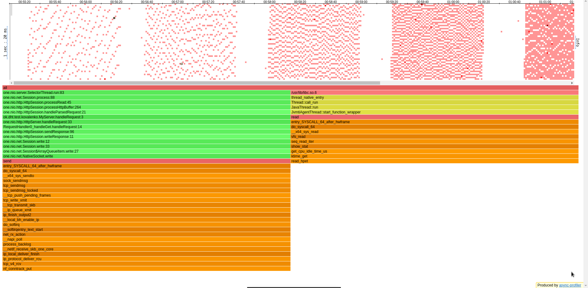

На 1Krps наблюдаем всё ещё хорошее время отклика, максимальное латенси превысило
среднее в 5 раз.

```
../wrk2/wrk -c 1 -d 60s -t 1 -R 1000 -L http://localhost:19234 -s ../stage1_report/get/scripts/get-existing-fixed.lua
Running 1m test @ http://localhost:19234
  1 threads and 1 connections
  Thread calibration: mean lat.: 1.015ms, rate sampling interval: 10ms
  Thread Stats   Avg      Stdev     Max   +/- Stdev
    Latency     1.01ms  348.40us   5.64ms   59.82%
    Req/Sec     1.06k    66.04     1.44k    93.87%
    60000 requests in 1.00m, 4.06MB read
Requests/sec:    999.99
Transfer/sec:     69.34KB
```

На хитмапе особо заметных красных точек не наблюдаем, чего-то сверхестественного
тоже. Предполагаем, что какой-то запросв попал на компиляцию.

На 2.5Krps ситуация точно такая же, что и на 1Krps.

```
../wrk2/wrk -c 1 -d 60s -t 1 -R 2500 -L http://localhost:19234 -s ../stage1_report/get/scripts/get-existing-fixed.lua
Running 1m test @ http://localhost:19234
  1 threads and 1 connections
  Thread calibration: mean lat.: 1.118ms, rate sampling interval: 10ms
  Thread Stats   Avg      Stdev     Max   +/- Stdev
    Latency     1.12ms  540.05us   5.14ms   60.36%
    Req/Sec     2.62k   198.19     3.33k    72.30%
    149995 requests in 1.00m, 10.16MB read
Requests/sec:   2499.93
Transfer/sec:    173.34KB
```

На 5Krps мы даже ускорились.

```
../wrk2/wrk -c 1 -d 60s -t 1 -R 5000 -L http://localhost:19234 -s ../stage1_report/get/scripts/get-existing-fixed.lua
Running 1m test @ http://localhost:19234
  1 threads and 1 connections
  Thread calibration: mean lat.: 0.714ms, rate sampling interval: 10ms
  Thread Stats   Avg      Stdev     Max   +/- Stdev
    Latency   703.31us  378.51us   8.09ms   64.82%
    Req/Sec     5.29k   352.81     7.67k    65.15%
    299999 requests in 1.00m, 20.31MB read
Requests/sec:   4999.91
Transfer/sec:    346.67KB
```

На хитмапе замечаем сектор, где появился GC. Он сделал stop the world, и время
отклика на какой-то запрос стало больше.
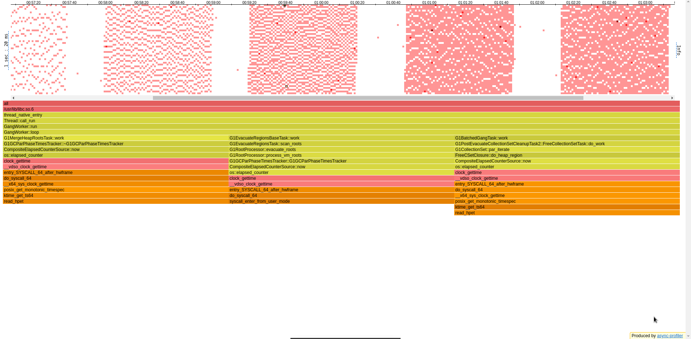

На 10Krps видим захлёб. Отклонение латенси относительно небольшое. По rps
ориентируемся на 8.5к.

```
../wrk2/wrk -c 1 -d 60s -t 1 -R 10000 -L http://localhost:19234 -s ../stage1_report/get/scripts/get-existing-fixed.lua
Running 1m test @ http://localhost:19234
  1 threads and 1 connections
  Thread calibration: mean lat.: 839.699ms, rate sampling interval: 2969ms
  Thread Stats   Avg      Stdev     Max   +/- Stdev
    Latency     5.17s     1.92s    8.50s    59.39%
    Req/Sec     8.63k   148.06     8.92k    81.25%
    515030 requests in 1.00m, 34.87MB read
Requests/sec:   8583.89
Transfer/sec:    595.17KB
```

На 8.5Krps латенси не самое лучшее, но заметно также, что база работает на
пределе своих возможностей. Отклонение по латенси в 3 раза.

```
../wrk2/wrk -c 1 -d 60s -t 1 -R 8500 -L http://localhost:19234 -s ../stage1_report/get/scripts/get-existing-fixed.lua
Running 1m test @ http://localhost:19234
  1 threads and 1 connections
  Thread calibration: mean lat.: 203.347ms, rate sampling interval: 574ms
  Thread Stats   Avg      Stdev     Max   +/- Stdev
    Latency   124.90ms  104.64ms 357.89ms   62.54%
    Req/Sec     8.53k   256.71     8.94k    81.61%
    508446 requests in 1.00m, 34.43MB read
Requests/sec:   8474.15
Transfer/sec:    587.56KB
```

Видим, что снова сработал GC.
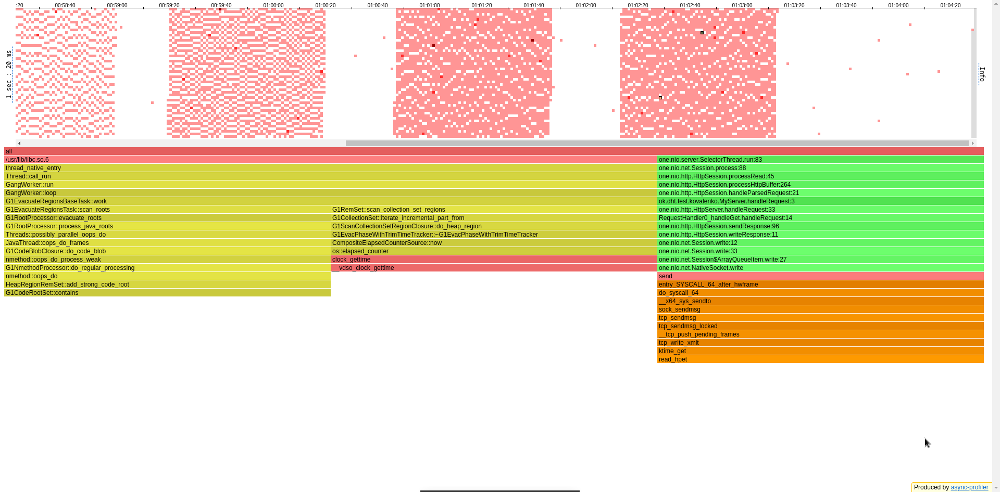

Сравнивая латенси на разных Krps,
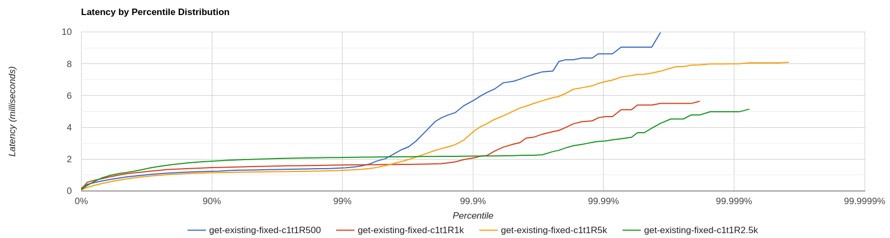
видим, что 0.8% запросов на 500rps не укладываются в 2 мс, более того,
на этих 0.8% запросах латенси заметно выше всех остальных. Смотря на хитмапу
для 500rps более внимательно, обнаруживаем, что некоторое время наша база была
залочена futex'ом.
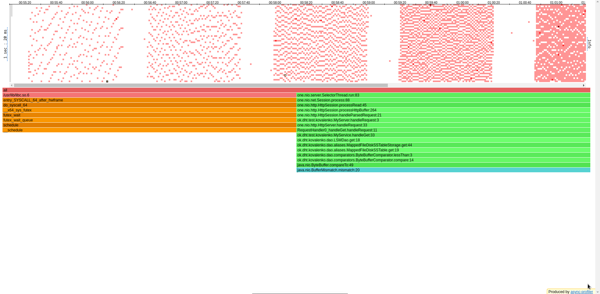

### Бьём по существующим ключам рандомно

На 500rps видим относительно хорошее время отклика (латенси), но вместе с тем
есть большой разброс между средним и максимальным показателями (в 25 раз).

```
../wrk2/wrk -c 1 -d 60s -t 1 -R 500 -L http://localhost:19234 -s ../stage1_report/get/scripts/get-existing-random.lua
Running 1m test @ http://localhost:19234
  1 threads and 1 connections
  Thread calibration: mean lat.: 5.563ms, rate sampling interval: 25ms
  Thread Stats   Avg      Stdev     Max   +/- Stdev
    Latency     1.78ms    3.03ms  40.10ms   93.84%
    Req/Sec   510.21     58.02     1.00k    88.25%
    30001 requests in 1.00m, 2.03MB read
Requests/sec:    500.01
Transfer/sec:     34.61KB
```

Смотрим на хитмапу и понимаем, что нагрузка неравномерна. Сравнивая начальный и
конечный регионы, видим, что по мере "пробивания" нашей базы гетов становится
в 3 раза меньше, чем было в самом начале. По хитмапе нельзя однозначно сказать,
почему так произошло. Есть предположение, что по какой-то причине снизилась
пропускная способность селекторов в принципе, то есть либо геты давали долгие ответы,
либо в принципе приходило меньше запросов (что противоречит принципам работы wrk).
Гет может давать долгий ответ только в случае, если происходит подмапливание
недостающих файликов на диске. Но оно происходит при первом гете, и дальше не
отражается на перформансе нашей БД. С прошлой версии отчёта изменился именно гет
(больше не ходим на диск, вместо этого используем атомик, а также вместе с
подмапленными файлами храним их key-range), но это не объясняет неравномерную
нагрузку. Можно было бы предположить, что дело в page cache нашей ОС, но это объяснило
бы лишь уменьшение пейдж фолтов, а на картинке видно уменьшение всего.
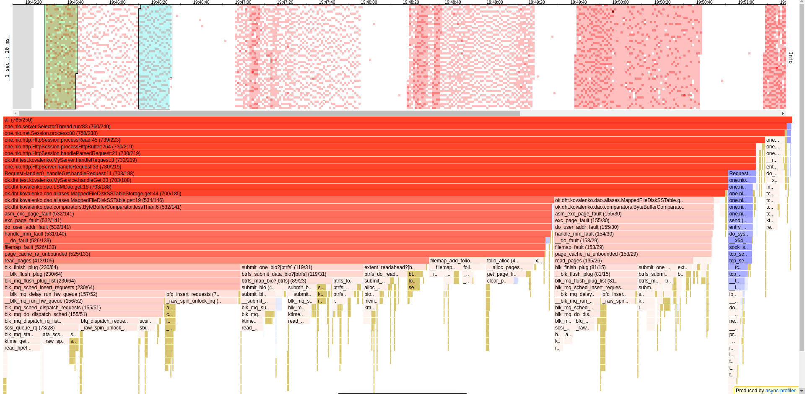

На 1Krps видим всё ещё хорошее латенси, база не захлёбывается, обрабатывает все запросы.
Нагрузка также неравномерная, догадки были высказаны выше.

```
../wrk2/wrk -c 1 -d 60s -t 1 -R 1000 -L http://localhost:19234 -s ../stage1_report/get/scripts/get-existing-random.lua
Running 1m test @ http://localhost:19234
  1 threads and 1 connections
  Thread calibration: mean lat.: 6.882ms, rate sampling interval: 21ms
  Thread Stats   Avg      Stdev     Max   +/- Stdev
    Latency     1.95ms    4.37ms  68.16ms   96.93%
    Req/Sec     1.02k   111.28     2.29k    88.88%
    60000 requests in 1.00m, 4.06MB read
Requests/sec:    999.99
Transfer/sec:     69.22KB
```

На хитмапе замечаем одну выделяющуюся красную точку - вызывается WatcherThread,
выполняющий периодические задачи JVM, но мы его видим лишь пару семплов,
так что нет причин сваливать всю вину за такое большое max латенси на него.
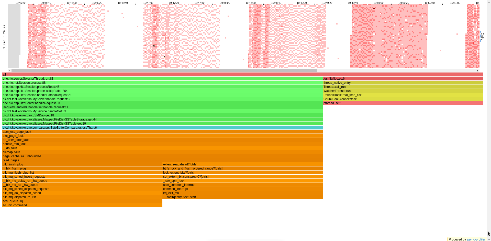

На 2.5Krps видим уже заметное увеличение среднего латенси, но ещё не критическое,
тем более что база не захлёбывается судя по Requests/sec.

```
../wrk2/wrk -c 1 -d 60s -t 1 -R 2500 -L http://localhost:19234 -s ../stage1_report/get/scripts/get-existing-random.lua
Running 1m test @ http://localhost:19234
  1 threads and 1 connections
  Thread calibration: mean lat.: 305.413ms, rate sampling interval: 1633ms
  Thread Stats   Avg      Stdev     Max   +/- Stdev
    Latency    28.94ms  110.07ms 617.98ms   93.89%
    Req/Sec     2.50k   186.18     3.26k    93.33%
    149998 requests in 1.00m, 10.14MB read
Requests/sec:   2499.94
Transfer/sec:    173.05KB
```

Нагрузка всё так же неравномерная. Хотя удаётся обработать все запросы, что нам
поступают, факт того, что они обрабатываются неравномерно, не даёт покоя.
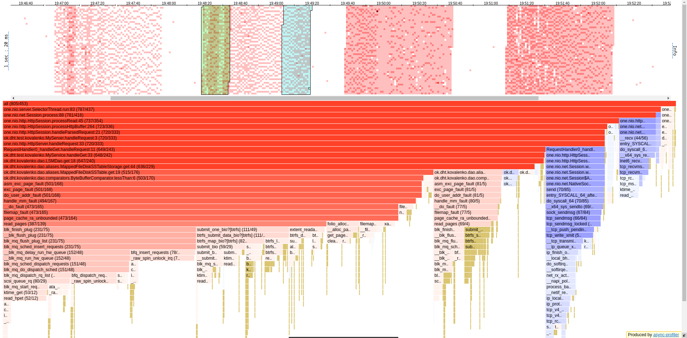

На 5Krps база начала захлёбываться. Отклонение среднего значения от максимального
сравнительно мало, что в принципе хорошо, ибо компиляция (если она есть) оказывает
минимальное воздействие на время отклика. Предлагается снизить нагрузку до 4.5Krps.

```
../wrk2/wrk -c 1 -d 60s -t 1 -R 5000 -L http://localhost:19234 -s ../stage1_report/get/scripts/get-existing-random.lua
Running 1m test @ http://localhost:19234
  1 threads and 1 connections
  Thread calibration: mean lat.: 1635.704ms, rate sampling interval: 6217ms
  Thread Stats   Avg      Stdev     Max   +/- Stdev
    Latency     6.34s   478.03ms   6.89s    83.01%
    Req/Sec     4.81k   756.05     5.60k    75.00%
    271995 requests in 1.00m, 18.39MB read
Requests/sec:   4533.27
Transfer/sec:    313.81KB
```

На хитмапе наконец-то видим почти равномерную нагрузку. Замечаем несколько
десятков семплов GC, ещё в паре семплов - компиляцию JVMTI.
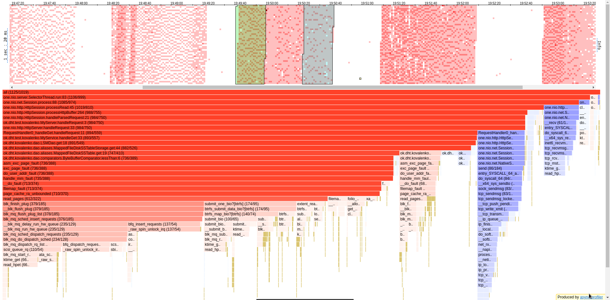

На 4.5Krps ожидаемо видим приемлемое среднее латенси.

```
../wrk2/wrk -c 1 -d 60s -t 1 -R 4500 -L http://localhost:19234 -s ../stage1_report/get/scripts/get-existing-random.lua
Running 1m test @ http://localhost:19234
  1 threads and 1 connections
  Thread calibration: mean lat.: 9.791ms, rate sampling interval: 63ms
  Thread Stats   Avg      Stdev     Max   +/- Stdev
    Latency     1.13ms    1.65ms  26.14ms   93.22%
    Req/Sec     4.54k   170.63     5.79k    89.16%
    269985 requests in 1.00m, 18.25MB read
Requests/sec:   4499.77
Transfer/sec:    311.49KB
```

Но нагрузка снова контрастирует. Тем не менее видим, что на наше чтение
приходится порядка 60% процессорного времени, остальное время уходит на
чтение/запись через сокет. Не так уж и плохо.
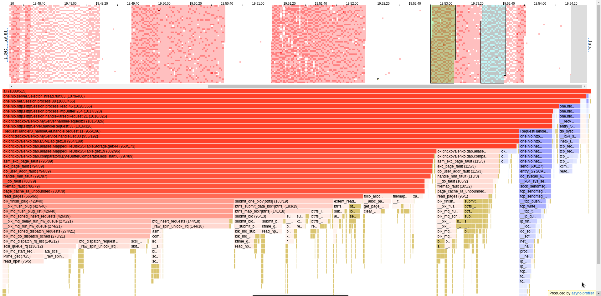

По перцентилям ситуация следующая:
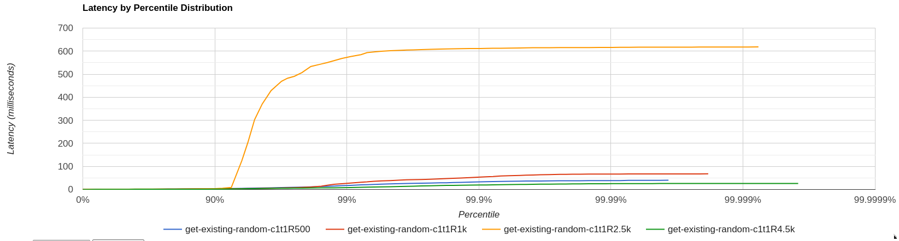
Заметно, что на 2.5Krps 8% запросов не укладывается в 8мс. Сопоставляя хитмапу
для 2.5Krps и хитмапу для 4.5Krps, видим, что в первой было чуть больше запросов
на irq (прерывание, 7 сэмпл против 2 сэмплов) и на tcp_ack
(обращение к реестру HTTP, определяющая количество подтверждений; 31 против 25).
Стоит также отметить, что проведённые оптимизации (key-range + подсчёт файлов на диске
с помощью атомика) ускорили нашу базу примерно в 10-12 раз, поэтому испытания
второго круга прошли лучше (в первый раз база не втащила даже 100rps).

### Бьём по несуществующим ключам

На 500rps видим хорошее среднее латенси. Вместе с тем разрыв среднего и максимального
составляет 15 раз.

```
../wrk2/wrk -c 1 -d 60s -t 1 -R 500 -L http://localhost:19234 -s ../stage1_report/get/scripts/get-non-existing.lua
Running 1m test @ http://localhost:19234
  1 threads and 1 connections
  Thread calibration: mean lat.: 1.117ms, rate sampling interval: 10ms
  Thread Stats   Avg      Stdev     Max   +/- Stdev
    Latency     0.91ms  524.10us  13.48ms   93.21%
    Req/Sec   529.61     46.65     1.10k    95.22%
    30001 requests in 1.00m, 1.97MB read
  Non-2xx or 3xx responses: 30001
Requests/sec:    500.01
Transfer/sec:     33.69KB
```

На хитмапе видим, что значительный промежуток времени в начале работы wrk
выполнялась компиляция потоков.
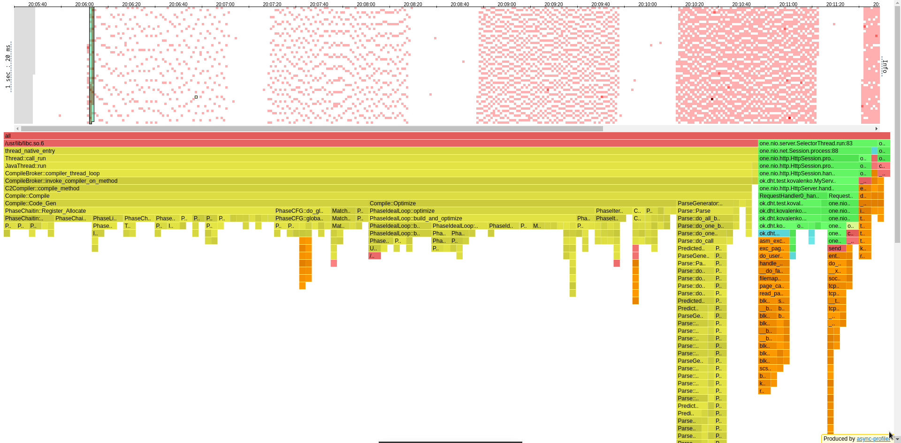

На 1Krps латенси всё ещё хорошее. Тут наблюдаем отклонение в 10 раз.

```
../wrk2/wrk -c 1 -d 60s -t 1 -R 1000 -L http://localhost:19234 -s ../stage1_report/get/scripts/get-non-existing.lua
Running 1m test @ http://localhost:19234
  1 threads and 1 connections
  Thread calibration: mean lat.: 1.092ms, rate sampling interval: 10ms
  Thread Stats   Avg      Stdev     Max   +/- Stdev
    Latency     1.10ms  396.85us  10.03ms   68.44%
    Req/Sec     1.05k    70.48     1.78k    93.19%
    60000 requests in 1.00m, 3.95MB read
  Non-2xx or 3xx responses: 60000
Requests/sec:    999.99
Transfer/sec:     67.38KB
```

На хитмапе ничего необычного не видим, разве что на наши геты уходит лишь
25% процессорного времени. Возможно, HTTP-вызовы send и __recv вытесняют с
процессора наши геты, получая от него больше квантов времени на выполнение.
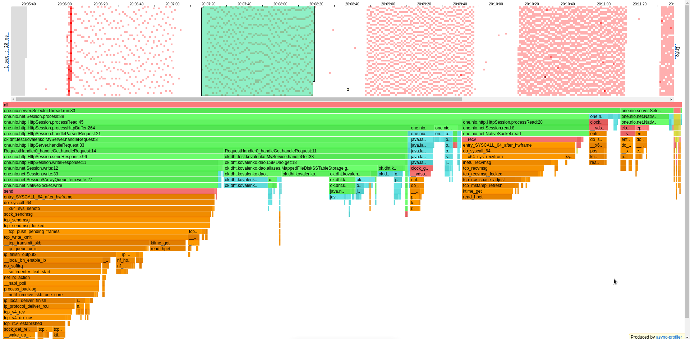

На 2.5Krps ситуация в общем и целом повторяет предыдущую, только ещё вклинивается
GC.

```
../wrk2/wrk -c 1 -d 60s -t 1 -R 2500 -L http://localhost:19234 -s ../stage1_report/get/scripts/get-non-existing.lua
Running 1m test @ http://localhost:19234
  1 threads and 1 connections
  Thread calibration: mean lat.: 1.084ms, rate sampling interval: 10ms
  Thread Stats   Avg      Stdev     Max   +/- Stdev
    Latency     1.08ms  547.90us   8.05ms   63.89%
    Req/Sec     2.64k   251.03     4.67k    66.24%
    149999 requests in 1.00m, 9.87MB read
  Non-2xx or 3xx responses: 149999
Requests/sec:   2499.99
Transfer/sec:    168.46KB
```

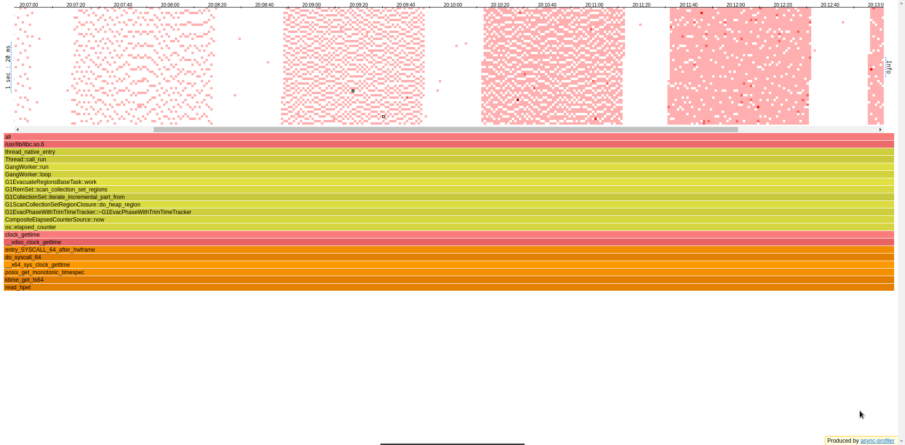

Аналогично для 5Krps.

```
../wrk2/wrk -c 1 -d 60s -t 1 -R 5000 -L http://localhost:19234 -s ../stage1_report/get/scripts/get-non-existing.lua
Running 1m test @ http://localhost:19234
  1 threads and 1 connections
  Thread calibration: mean lat.: 0.800ms, rate sampling interval: 10ms
  Thread Stats   Avg      Stdev     Max   +/- Stdev
    Latency     0.85ms    1.01ms  19.58ms   98.45%
    Req/Sec     5.29k   404.56     9.00k    76.98%
    299996 requests in 1.00m, 19.74MB read
  Non-2xx or 3xx responses: 299996
Requests/sec:   4999.94
Transfer/sec:    336.91KB
```

Большой разрыв между avg и max латенси происходит из-за того, что GC вызывается 4
раза, а WatcherThread - 2 раза.

На 10Krps наконец-то получаем захлёб.

```
../wrk2/wrk -c 1 -d 60s -t 1 -R 10000 -L http://localhost:19234 -s ../stage1_report/get/scripts/get-non-existing.lua
Running 1m test @ http://localhost:19234
  1 threads and 1 connections
  Thread calibration: mean lat.: 1528.199ms, rate sampling interval: 5484ms
  Thread Stats   Avg      Stdev     Max   +/- Stdev
    Latency     9.96s     3.93s   16.79s    58.14%
    Req/Sec     7.25k    63.58     7.34k    77.78%
    431955 requests in 1.00m, 28.42MB read
  Non-2xx or 3xx responses: 431955
Requests/sec:   7199.29
Transfer/sec:    485.11KB
```

Отклонение по латенси относительно небольшое, объясняется также GC.

С ориентиром на 7Krps видим, что база не захлёбывается, хотя 17мс - приличное
время отклика. Причины разрыва между avg и max latency те же, что и выше.

```
../wrk2/wrk -c 1 -d 60s -t 1 -R 7000 -L http://localhost:19234 -s ../stage1_report/get/scripts/get-non-existing.lua
Running 1m test @ http://localhost:19234
  1 threads and 1 connections
  Thread calibration: mean lat.: 90.814ms, rate sampling interval: 286ms
  Thread Stats   Avg      Stdev     Max   +/- Stdev
    Latency    17.72ms   27.31ms 118.91ms   83.56%
    Req/Sec     7.03k   208.86     7.62k    75.29%
    419927 requests in 1.00m, 27.63MB read
  Non-2xx or 3xx responses: 419927
Requests/sec:   6998.80
Transfer/sec:    471.60KB
```

По гистограмме
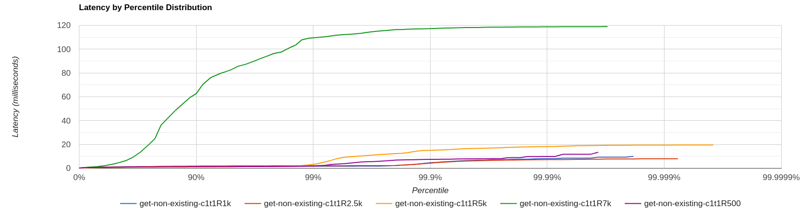
видим, что на рейте 7K порядка 85% запросов не укладываются в 5мс. Очевидных
причин этому не наблюдается.

### Бьём смешанно (существующие + несуществующие)

На разогреве уже очень большая разница между avg и max latency.

```
../wrk2/wrk -c 1 -d 60s -t 1 -R 500 -L http://localhost:19234 -s ../stage1_report/get/scripts/get-mixed.lua
Running 1m test @ http://localhost:19234
  1 threads and 1 connections
  Thread calibration: mean lat.: 2395.939ms, rate sampling interval: 8085ms
  Thread Stats   Avg      Stdev     Max   +/- Stdev
    Latency     1.34ms    1.75ms  36.35ms   92.50%
    Req/Sec   499.67      0.47   500.00    100.00%
    30001 requests in 1.00m, 2.00MB read
  Non-2xx or 3xx responses: 14942
Requests/sec:    500.01
Transfer/sec:     34.15KB
```

По хитмапе видно, что нагрузка неравномерная. Вернулась старая проблема.
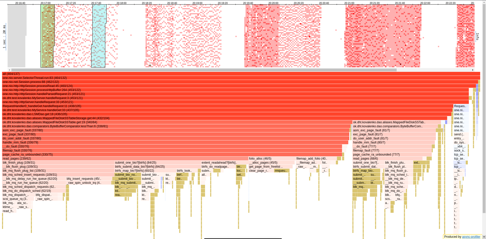

На 1Krps время отклика нормальное, однако отклонение - в 35 раз.

```
../wrk2/wrk -c 1 -d 60s -t 1 -R 1000 -L http://localhost:19234 -s ../stage1_report/get/scripts/get-mixed.lua
Running 1m test @ http://localhost:19234
  1 threads and 1 connections
  Thread calibration: mean lat.: 2.839ms, rate sampling interval: 13ms
  Thread Stats   Avg      Stdev     Max   +/- Stdev
    Latency     1.59ms    2.26ms  50.82ms   93.95%
    Req/Sec     1.04k   171.90     3.25k    86.12%
    60000 requests in 1.00m, 4.00MB read
  Non-2xx or 3xx responses: 29855
Requests/sec:    999.99
Transfer/sec:     68.31KB
```

Вначале немного покомпилировался WatcherThread, но нагрузка всё равно нестабильная.
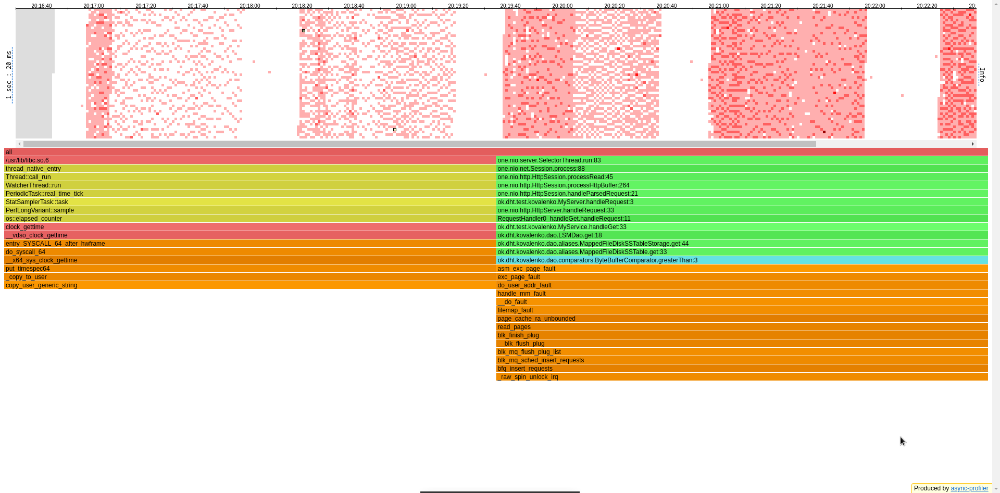

На 2.5Krps латенси оставляет желать лучшего, но база ещё не захлебнулась!

```
../wrk2/wrk -c 1 -d 60s -t 1 -R 2500 -L http://localhost:19234 -s ../stage1_report/get/scripts/get-mixed.lua
Running 1m test @ http://localhost:19234
  1 threads and 1 connections
  Thread calibration: mean lat.: 4044.165ms, rate sampling interval: 12287ms
  Thread Stats   Avg      Stdev     Max   +/- Stdev
    Latency     1.99s     2.73s    7.26s    75.58%
    Req/Sec     2.86k   378.64     3.38k    75.00%
    149991 requests in 1.00m, 10.01MB read
  Non-2xx or 3xx responses: 74355
Requests/sec:   2499.80
Transfer/sec:    170.77KB
```

На 5Krps база-таки захлебнулась.

```
../wrk2/wrk -c 1 -d 60s -t 1 -R 5000 -L http://localhost:19234 -s ../stage1_report/get/scripts/get-mixed.lua
Running 1m test @ http://localhost:19234
  1 threads and 1 connections
  Thread calibration: mean lat.: 3286.473ms, rate sampling interval: 10584ms
  Thread Stats   Avg      Stdev     Max   +/- Stdev
    Latency     9.73s   890.11ms  11.37s    72.51%
    Req/Sec     4.64k     0.93k    5.85k    50.00%
    247543 requests in 1.00m, 16.51MB read
  Non-2xx or 3xx responses: 122799
Requests/sec:   4125.72
Transfer/sec:    281.84KB
```

Попробуем на 4Krps:

```
../wrk2/wrk -c 1 -d 60s -t 1 -R 4000 -L http://localhost:19234 -s ../stage1_report/get/scripts/get-mixed.lua
Running 1m test @ http://localhost:19234
  1 threads and 1 connections
  Thread calibration: mean lat.: 2973.301ms, rate sampling interval: 10772ms
  Thread Stats   Avg      Stdev     Max   +/- Stdev
    Latency     4.10s     3.64s    8.95s    36.58%
    Req/Sec     4.58k     1.28k    6.51k    50.00%
    239998 requests in 1.00m, 16.01MB read
  Non-2xx or 3xx responses: 119022
Requests/sec:   3999.92
Transfer/sec:    273.24KB
```

Система справляется, хоть и с совершенно неприемлемым временем отклика.

Поскольку вероятность появления существующего и несуществующего ключей одна и та же (50/50),
то на примере этих запросов нам хотелось бы наблюдать "усреднение" по латенси,
ведь скорость нахождения несуществующих ключей (низкая) должна бы компенсировать
скорость нахождения существующих ключей (высокая). Однако наши мечты разбиваются о
суровую реальность, в которой GC встревает со своим stop the world, компилируются
различные потоки, а также появляются периодические задачи, необходимые для
должного функционирования JVM.

### GET-статистика

В целом наблюдаем, что на низком рейте аллокаций мало, на высоком - много, что весьма закономерно.
Дополнительно хочется отметить, что два итератора (по памяти и по диску) выделяются
последовательно, сначала проверяется память, и лишь потом аллоцируется итератор на диск
(если по ключу ничего не найдено), за счёт чего проихсодит небольшая оптимизация
аллокаций.

## PUT (DELETE)

Здесь вариант всего один - просто кладём по ключу заданное значение, будь то null или not null.

Поначалу всё идёт хорошо:

```
../wrk2/wrk -c 1 -d 60s -t 1 -R 500 -L http://localhost:19234/v0/entity -s put.lua 
Running 1m test @ http://localhost:19234/v0/entity
  1 threads and 1 connections
  Thread calibration: mean lat.: 1.153ms, rate sampling interval: 10ms
  Thread Stats   Avg      Stdev     Max   +/- Stdev
    Latency   817.73us    3.00ms 107.78ms   99.60%
    Req/Sec   533.73     74.51     3.30k    92.02%
30001 requests in 1.00m, 1.92MB read
Requests/sec:    500.01
Transfer/sec:     32.72KB
```

```
../wrk2/wrk -c 1 -d 60s -t 1 -R 1000 -L http://localhost:19234/v0/entity -s put.lua
Running 1m test @ http://localhost:19234/v0/entity
  1 threads and 1 connections
  Thread calibration: mean lat.: 1.088ms, rate sampling interval: 10ms
  Thread Stats   Avg      Stdev     Max   +/- Stdev
    Latency     0.86ms    1.68ms  49.09ms   99.41%
    Req/Sec     1.05k   156.19     6.22k    95.65%
60001 requests in 1.00m, 3.83MB read
Requests/sec:   1000.00
Transfer/sec:     65.43KB
```

На 10к уже наблюдем "подзахлёб", когда среднее латенси становится больше 1мс:

```
../wrk2/wrk -c 1 -d 60s -t 1 -R 10000 -L http://localhost:19234/v0/entity -s put.lua
Running 1m test @ http://localhost:19234/v0/entity
  1 threads and 1 connections
  Thread calibration: mean lat.: 3.748ms, rate sampling interval: 10ms
  Thread Stats   Avg      Stdev     Max   +/- Stdev
    Latency     1.68ms    7.03ms 112.51ms   98.35%
    Req/Sec    10.56k     1.62k   26.78k    89.19%
599968 requests in 1.00m, 38.34MB read
Requests/sec:   9999.40
Transfer/sec:    654.26KB
```

И на 50к уже получаем захлёб:

```
V../wrk2/wrk -c 1 -d 60s -t 1 -R 50000 -L http://localhost:19234 -s put.lua
Running 1m test @ http://localhost:19234
  1 threads and 1 connections
  Thread calibration: mean lat.: 3344.485ms, rate sampling interval: 11608ms
  Thread Stats   Avg      Stdev     Max   +/- Stdev
    Latency    23.37s     9.17s   38.37s    58.68%
    Req/Sec    17.96k     1.14k   19.49k    50.00%
1081103 requests in 1.00m, 69.08MB read
Requests/sec:  18018.46
Transfer/sec:      1.15MB
```

Судя по расходам CPU:
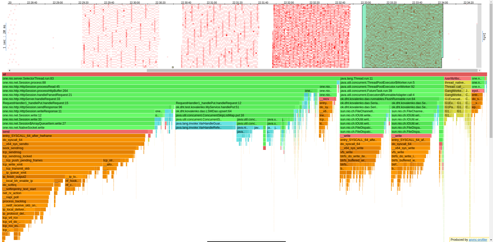
а также по аллокациям:
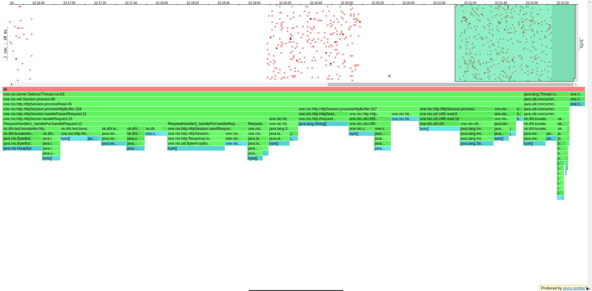
видно, что На GC тратится 5% ресурсов, кажется, что не так уж и много,
хотя можем попробовать вместо G1 использовать Z1, время отклика будет меньше,
но пропускать через систему сможем так же меньше запросов. Помимо трети CPU на NativeSocket.write()
можно отследить закономерность, что при увеличении Krps увеличивается частота флашей,
и на 50Krps (перегрузка) мы наблюдаем флашинг буквально каждую секунду,
а если поставить chunktime меньше, чем 1с, то есть вероятность увидеть флаши ещё чаще, чем раз в секунду.
Итого на флаши приходится 20% ресурсов CPU, на путы - 25% (хотя это то, чего хотелось бы видеть по максимуму).
По аллокациям - 10% тратится на преобразования энтрей String -> ByteBuffer, ещё порядка 8% - на флаши,
вся оставшаяся память в полном распоряжении у one-nio.

Напоследок приведём гистограмму путов на низких рейтах:
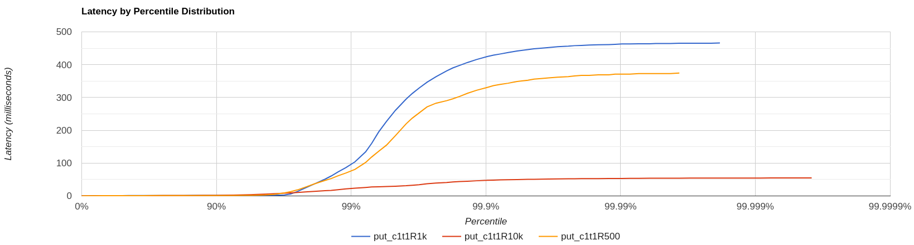
Видно, что при заданных путах примерно 5% нагрузки не укладывается в допустимый диапазон
латенси - 5мс.
