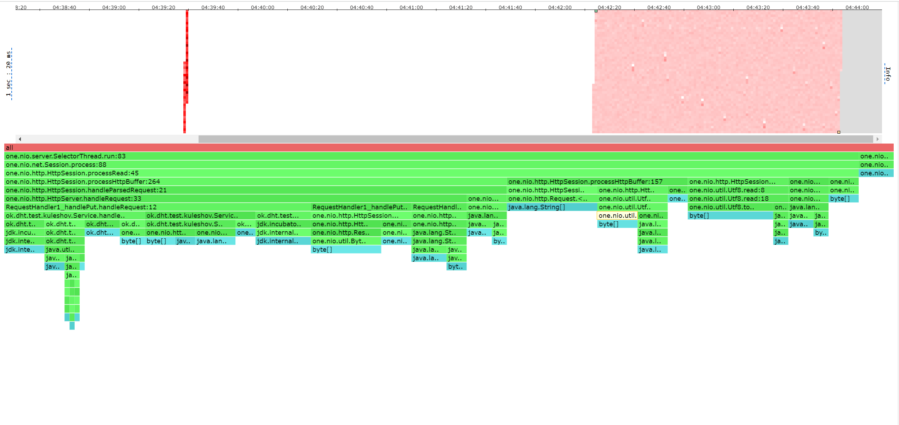
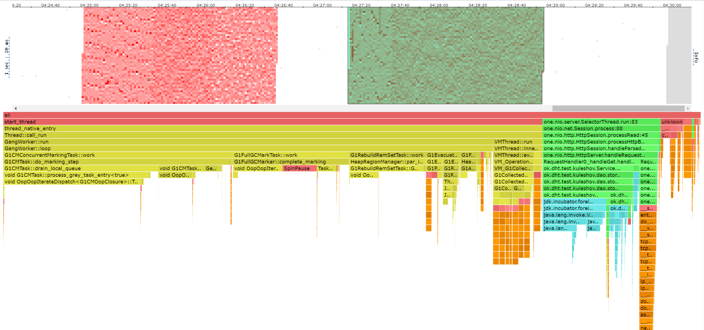

#Отчет
## Нагрузочное тестирование PUT
Для эксперемента генерировались случайные id и случайные числа в качестве значений.

В хоже замеров был выведен максимальный rps 5000 при времени в 100 секунд, при увеличении сильно возрастает latency и начинают теряться запросы.

```
 wrk -d 100 -t 1 -c 1 -R 5000 -s src/main/java/ok/dht/test/kuleshov/put.lua http://localhost:19234
Running 2m test @ http://localhost:19234
  1 threads and 1 connections
  Thread calibration: mean lat.: 1.179ms, rate sampling interval: 10ms
  Thread Stats   Avg      Stdev     Max   +/- Stdev
    Latency     1.96ms   12.04ms 272.64ms   99.39%
    Req/Sec     5.28k   755.58    12.89k    85.27%
  499948 requests in 1.67m, 31.94MB read
Requests/sec:   4999.92
Transfer/sec:    327.14KB
```


### alloc



## Нагрузочное тестирование GET

Для эксперемента база была наполнена, а для запросов генерировались случайные id.

Из-за алгоритмического устройства внутренней базы данных и состояния моего ноутбука rps упал до 1000, по сравнению с PUT 
запросами.

```
 wrk -d 100 -t 1 -c 1 -R 1000 -s src/main/java/ok/dht/test/kuleshov/get.lua http://localhost:19234
Running 2m test @ http://localhost:19234
  1 threads and 1 connections
  Thread calibration: mean lat.: 3711.202ms, rate sampling interval: 14917ms
  Thread Stats   Avg      Stdev     Max   +/- Stdev
    Latency    10.45s    10.36s   31.31s    44.34%
    Req/Sec     1.09k   651.17     1.99k    50.00%
  99993 requests in 1.67m, 6.62MB read
  Non-2xx or 3xx responses: 49763
Requests/sec:   1000.00
Transfer/sec:     67.82KB

```



## Выводы

Главным выводом является использование в будущем другой реаолизации хранилища, либо доработка и оптимизация,
в особенности взятие данных, уже имеющегося решения.