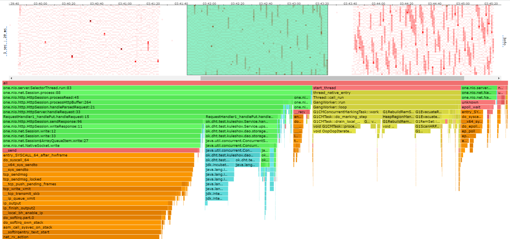
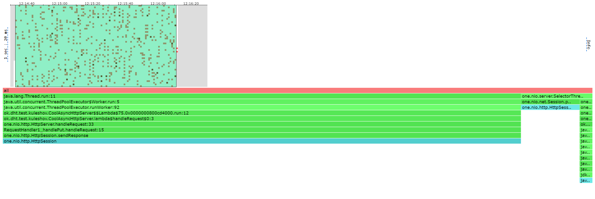
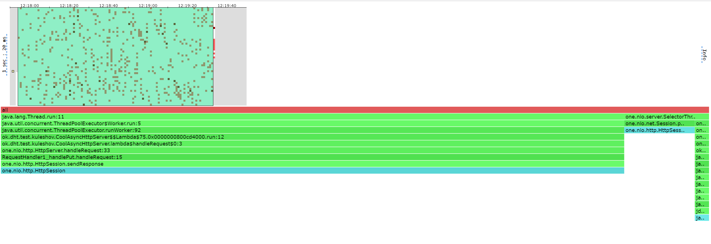
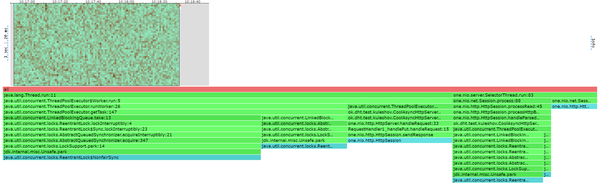
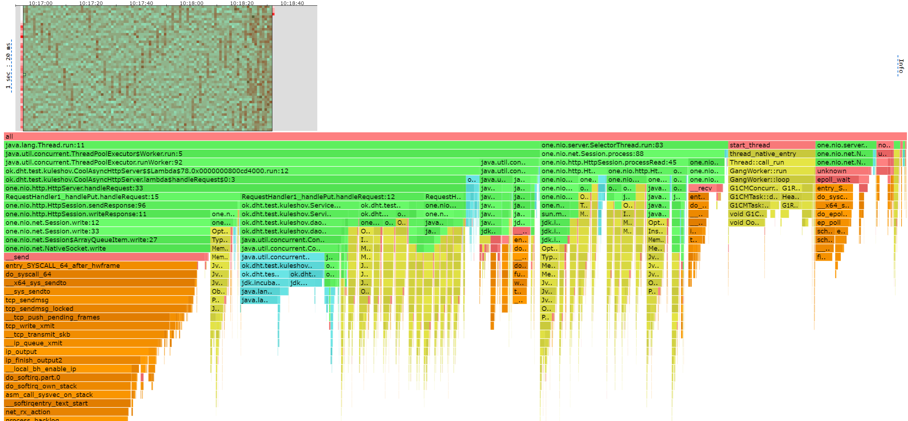
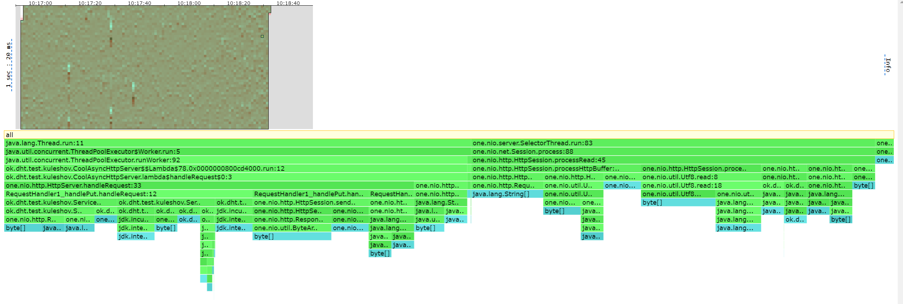
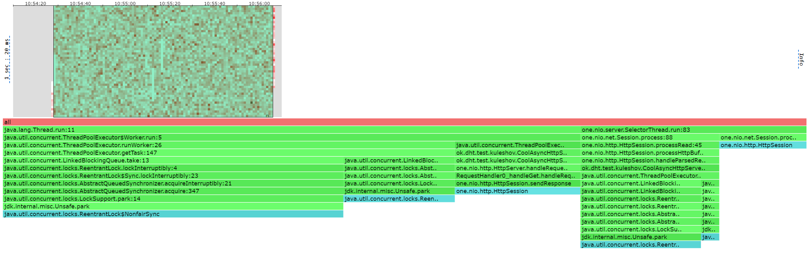
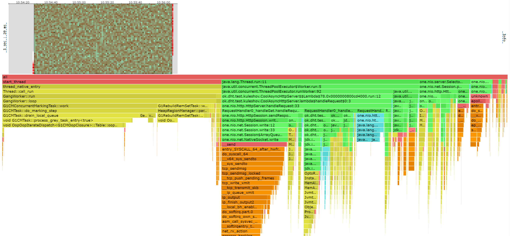
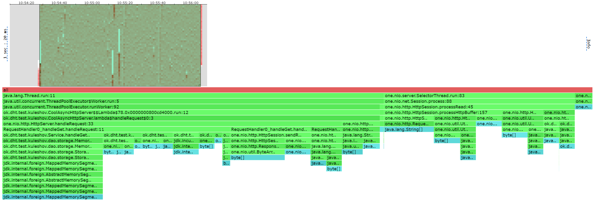

# Нагрузочое тестирование
## Однопоточное исполнение
Для сравнение сначала посмотрим как происходит исполнение в одном потоке.

На Stage 1 выяснили, что сервер выдерживает нагрузку в 5000 rps на put и 1000 на get.
При увелечении нагрузки сервер захлебывается.

### put
```
 wrk -d 100 -t 1 -c 1 -R 5000 -s src/main/java/ok/dht/test/kuleshov/put.lua http://localhost:19234
Running 2m test @ http://localhost:19234
  1 threads and 1 connections
  Thread calibration: mean lat.: 1.179ms, rate sampling interval: 10ms
  Thread Stats   Avg      Stdev     Max   +/- Stdev
    Latency     1.96ms   12.04ms 272.64ms   99.39%
    Req/Sec     5.28k   755.58    12.89k    85.27%
  499948 requests in 1.67m, 31.94MB read
Requests/sec:   4999.92
Transfer/sec:    327.14KB
```



### get

```
 wrk -d 100 -t 1 -c 1 -R 1000 -s src/main/java/ok/dht/test/kuleshov/get.lua http://localhost:19234
Running 2m test @ http://localhost:19234
  1 threads and 1 connections
  Thread calibration: mean lat.: 3711.202ms, rate sampling interval: 14917ms
  Thread Stats   Avg      Stdev     Max   +/- Stdev
    Latency    10.45s    10.36s   31.31s    44.34%
    Req/Sec     1.09k   651.17     1.99k    50.00%
  99993 requests in 1.67m, 6.62MB read
  Non-2xx or 3xx responses: 49763
Requests/sec:   1000.00
Transfer/sec:     67.82KB

```

Также можно заметить, что мы практически не ожидаем локов, кроме локов
на сессии,что логично, мы же в одном потоке запускаем workerы.



## Многопоточное исполнение

Для своего железа я выбрал количество тредов от 4 до 8.
И использовал LinkedBlockingQueue в качестве очереди заданий в пуле воркеров,
так как эта очередь имеет неблокирующие методы.

### put

Путем замеров был найден потолок rps без захлебов на put в 35000 запросов.

```
Running 2m test @ http://localhost:19234
8 threads and 64 connections
Thread calibration: mean lat.: 3.102ms, rate sampling interval: 13ms
Thread calibration: mean lat.: 3.139ms, rate sampling interval: 13ms
Thread calibration: mean lat.: 3.189ms, rate sampling interval: 13ms
Thread calibration: mean lat.: 2.984ms, rate sampling interval: 12ms
Thread calibration: mean lat.: 3.071ms, rate sampling interval: 12ms
Thread calibration: mean lat.: 3.194ms, rate sampling interval: 13ms
Thread calibration: mean lat.: 3.366ms, rate sampling interval: 14ms
Thread calibration: mean lat.: 3.211ms, rate sampling interval: 13ms
Thread Stats   Avg      Stdev     Max   +/- Stdev
Latency     3.67ms    5.17ms  99.71ms   92.17%
Req/Sec     4.59k     1.13k   17.58k    78.64%
3498183 requests in 1.67m, 223.52MB read
Requests/sec:  34996.00
Transfer/sec:      2.24MB
```

Легко заметить что на put максимальный rps возрос практически в 7 раз,
что логично ведь максимальное количество потоков 8, но увеличения в 8 раз нет
из-за накладных расходов на ожидание локов и тд.

Что мы как раз можем увидеть при профилировании на локи. Теперь околок
половины семплов это ожидание взятия блокировки на задачи.

#### LOCK



#### CPU

По cpu можно увидеть, что также 20% семплов это send - отправка в сокет, около 20%
на обработку запроса, 16% это чтение запросов, и уже видна работа сборщика мусора.




#### ALLOC

В аллокации мы можем увидеть также, что половина аллокаций приходится на обработку запросов и создание ответов.
И половина это работа селекторов.



### get

В get максимальная нагрузка выросла до 25000 запросов в секунду.

```
Running 2m test @ http://localhost:19234
8 threads and 64 connections
Thread calibration: mean lat.: 11.217ms, rate sampling interval: 19ms
Thread calibration: mean lat.: 10.848ms, rate sampling interval: 17ms
Thread calibration: mean lat.: 11.229ms, rate sampling interval: 20ms
Thread calibration: mean lat.: 10.570ms, rate sampling interval: 20ms
Thread calibration: mean lat.: 10.045ms, rate sampling interval: 19ms
Thread calibration: mean lat.: 11.029ms, rate sampling interval: 17ms
Thread calibration: mean lat.: 11.040ms, rate sampling interval: 19ms
Thread calibration: mean lat.: 12.610ms, rate sampling interval: 20ms
Thread Stats   Avg      Stdev     Max   +/- Stdev
Latency     8.43ms   47.80ms   1.00s    97.86%
Req/Sec     3.24k   807.00    13.65k    83.57%
2498872 requests in 1.67m, 165.50MB read
Non-2xx or 3xx responses: 1243697
Requests/sec:  25001.62
Transfer/sec:      1.66MB
```

#### LOCK

В ситуация аналогична put, так как очередь задач такая же, остальное это selector.



#### CPU

В cpu около половины семплов это работа сборщика мусора, значит близки к потолку.
Остальное это обработка запроса и немного работа selectora.



#### ALLOC

В аллокации можно увидеть, что 17% в обработке запросов - это работа с MemorySegment. Остальное это в обработке запросов
это работа с Response. Все остальное это работа Selector, чтение и запись.



## Выводы

По результатам можно увидеть, что использование нескольких потоков дает преимущества, но необходимо
оптимизировать создание новых объектов, также стоит задуматься о использовании, других различных очередей для заданий,
чтобы снизить накладные расходы на работу нескольких потоков. Также можно поэксперементировать, с количесвом потоков, также 
для сокращения накладных расходов.