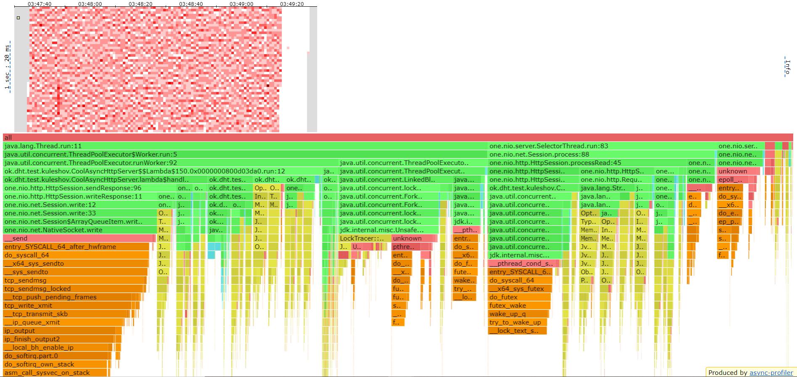

# Отчет
В данном этапе реализовывалось шардирование данных с запуском
на нескольких нодах. Для этого каждая нода при старте делит поровну
отрезок от 0 до Integer.MAX_VALUE распределяя индексы между всеми нодами.
Для дальнейшего добавления изменения конфигурации кластера используется
констистентное кэширование. Для получения индекса используется хэшфункция
Hash.murmur3().

На компьютере 4 физических ядра 8 логических.

### Кластер из одной ноды

Конфигурация: 1 нода 4 потока на исполнение запросов.

Проведем замеры в 8 потоков 64 подключения

PUT


```
Running 2m test @ http://localhost:19235
8 threads and 64 connections
Thread Stats   Avg      Stdev     Max   +/- Stdev
Latency    15.82ms   20.73ms 239.23ms   90.15%
Req/Sec     3.13k    72.81     3.54k    81.50%
2497751 requests in 1.66m, 159.60MB read
Requests/sec:  25003.23
Transfer/sec:      1.60MB
```

GET

```
Running 2m test @ http://localhost:19235
8 threads and 64 connections
Thread Stats   Avg      Stdev     Max   +/- Stdev
Latency     1.29ms    1.81ms  77.95ms   98.24%
Req/Sec   659.45    100.32     4.00k    69.52%
499772 requests in 1.67m, 33.82MB read
Non-2xx or 3xx responses: 34408
Requests/sec:   5001.08
Transfer/sec:    346.58KB
```

Запустим после всех измений кластер из одной ноды, для более верного сравнения.

Получим результаты в районе 25000 запросов/сек на put и 5000 запросов/сек на get.

Упираемся в запись на диск.

### Кластер из двух нод
Конфигурация: 2 ноды на каждой по 2 потока на исполнение заданий и 2 потока на пересылку запросов.


Проведем замеры в 8 потоков 64 подключения

PUT

```
Running 2m test @ http://localhost:19234
8 threads and 64 connections
Thread Stats   Avg      Stdev     Max   +/- Stdev
Latency    84.59ms  129.21ms 837.63ms   83.90%
Req/Sec     2.51k   133.61     2.88k    74.39%
1994458 requests in 1.67m, 139.01MB read
Requests/sec:  19964.19
Transfer/sec:      1.39MB
```
Профайлинг 19234


Профайлинг 19666



```
Running 2m test @ http://localhost:19666
  8 threads and 64 connections
  Thread Stats   Avg      Stdev     Max   +/- Stdev
    Latency    13.02ms   26.86ms 241.41ms   91.31%
    Req/Sec     1.01k   113.56     1.55k    78.82%
  799658 requests in 1.67m, 64.78MB read
Requests/sec:   8003.08
Transfer/sec:    663.91KB
```

Профайлинг 19234


Профайлинг 19666


GET
```
Running 2m test @ http://localhost:19666
  8 threads and 64 connections
  Thread Stats   Avg      Stdev     Max   +/- Stdev
    Latency     7.92s     4.11s   17.78s    60.65%
    Req/Sec   209.49     18.45   265.00     69.93%
  168638 requests in 1.67m, 14.26MB read
  Non-2xx or 3xx responses: 6976
Requests/sec:   1687.75
Transfer/sec:    146.11KB
```

Профайлинг 19234


Профайлинг 19666


```
Running 2m test @ http://localhost:19666
  8 threads and 64 connections
  Thread Stats   Avg      Stdev     Max   +/- Stdev
    Latency   108.71ms  163.07ms   1.11s    87.94%
    Req/Sec   187.42     51.77   392.00     72.31%
  149600 requests in 1.67m, 12.64MB read
  Non-2xx or 3xx responses: 6144
Requests/sec:   1497.22
Transfer/sec:    129.58KB
```

Профайлинг 19234


Профайлинг 19666


Получили результаты в районе 20000 запросов/сек на put и 1500 запросов/сек на get.

Прежде всего так как эти две ноды находятся на одной физической машине,
то выигрыша нет, есть только лишние расходы на переотправку запросов на ту же
физическую машину, но на другой порт.

Также данные распределились не совсем равномерно а примерно в отношении 1 к 2. 1 на сервере на порту 19234 и 2 на 19666.

И соответственно можно увидеть, что и распределение рпс тоже не равномерное, так как
если посылать запросы на 19234 он 2/3 из них просто переотправляет 
на 19666, который их просто записывает. А если посылать запросы на 19666 то 2/3 из них, на нем
же и записываются, и 1/3 отправляются, из-за чего потери меньше, рпс выше.

### Кластер из более двух нод

Не имеет особого смысла так как также все будет расположено на одной физической машине.
И запуск увеличит лишь расходы на переотправку и также так как количество ядер небольшое,
получим большую борьбу потоков за ресурсы.

### Вывод

Необходимо разворачивать кластер на нескольких физических машинах.