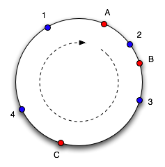

# Отчет Stage 7 Bonus
Консистентное хэширование с добавлением и удалением узлов и переносом ключей без перезапуска кластера.
Реализация весьма простая и предполагает изменение кластера по одной ноде.
## Консистентное хеширование



Метод распределения ключей по узлам кластера, где каждому узлу соответсвтует отрезок на окружности, сама окружность
от ```Integer.MIN_VALUE``` до ```Integer.MAX_VALUE```. А расположение ключа на окружности определяется по хешу ключа,
в моей реализации используется Hash.murmur3. Распределение отрезков между узлами определяется с учетом виртуальных нод
считается ```Hash.murmur3(<url узла> + "|" + i)```, где i - номер виртуальной ноды и далее этому узлу достается отрезок 
от минимального хэша других нод до высчитанного хэша.
## Добавление узла
Реализованно путем запуска сервера с параматером и текущей конфигурацией кластера.
Запущенный узел добавляет узел в свою конфигурацию, затем отправляет всем остальным узлам сообщение о добавлении
нового узла, когда новый узел получает такое сообщение, он добавляет в свою конфигурацию и по необходимости передает 
ключи новому узлу, блокируя (отвечая 504) все операции по передаваемому отрезку до конца передачи, после конца передачи,
отправляется сообщение о конце, после чего новый узел может отвечать на запросы по этому отрезку.

По дефолту создается 4 виртуальных узла для одного реального по алгоритму из пункта выше. Но есть и возможность ручного 
выбора хэшей для вставки узла, то есть выбора места на окружности для вставки узла, что позволит вручную распределять
нагрузку между узлами. И например можно таким образом снять нагрузку с более слабых или более нагруженных узлов, добавив
новый узел или просто добавив виртуальную ноду.
## Удаление узла
Удаление происходит аналогично добавлению, но удаление происходит по определенному запросу к удаляемому узлу, далее
он отправляет запросы удаления себя остальным узлам класстера. После этого запускается перенос ключей, после которого
можно отключать узел.
## Перенос ключей
Перенос ключей осуществляется с помощью двух сервисов ```TransferSenderService``` и ```TransferReceiverService``` 
для отправки и приема ключей соответсвенно. Во время переноса блокируется весь переносимый отрезок,
во избежания создания различий в данных. Перенос происходит последовательно. Так как распределние по нодам использует 
хэш, то необходимо прочтение всех ключей ноды отправителя. Можно было бы оптимизировать это добавлением поля хэша
и некоторого индекса по этому полю, тогда можно было бы сразу перебирать только ключи, входящие в переносимый отрезок.
## Вывод
Модификация позволяет добавлять и удалять узлы, более точно рапределяя нагрузку по узлам кластера, однако стоит
доработать перенос, блокируя меньшее количество ключей используя блокировки на конкретные ключи
и использовать Chunked transfer encoding для более быстрой отправки.