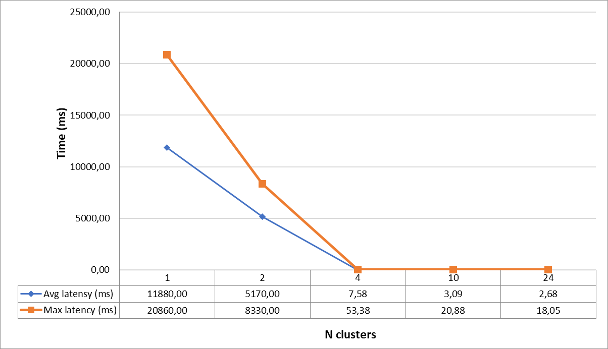
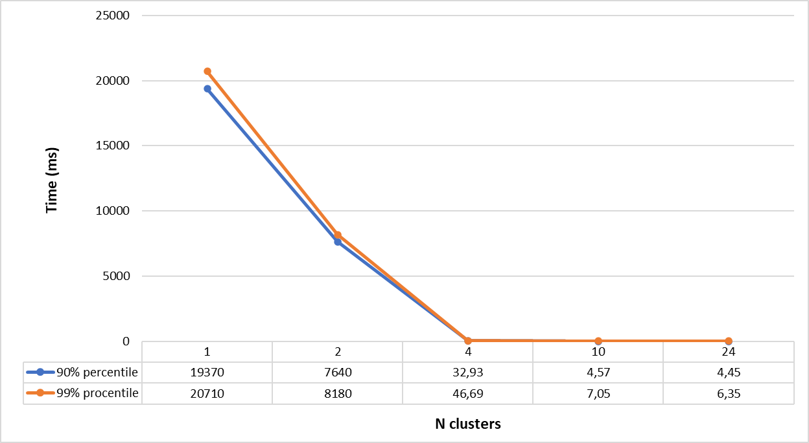

Сервер, wrk и async-profiler запускались через wsl
------------------------------------------------------------------------------------------------------------------------
**Параметр flushThresholdBytes в dao равен 1 МБ.
Размер очереди в Executor для обработки запросов равен 100.
Алгоритмов распределения данных между узлами - consistent hashing (hash space = 3600, virtual nodes number = 100).
Число узлов в кластере = 5**

Общие параметры для нагрузочного тестирования:
    - Длительность 60 секунд;
    - Число потоков 64;
    - Число соединений 64;

Сравним результаты с предыдущей версией при from = 1 и ack = 1.

Для PUT запросов Requests/sec составляет 2840.41 при rate 5000, для GET запросов выдерживает, но время запроса 
вырастает в разы относительно реализации с 1 узлом, которая выдерживает спокойно 10000 PUT запросов в секунду и
18236 PUT запросов максимально (при rate = 20000). Связано это с тем, что для выполнения некоторых запросов,
не относящихся к текущему узлу требуется дополнительный поход по сети на другой узел кластера отвечающий за
определенный ключ, что увеличивает трафик внутри сети и негативно сказывается на максимально допустимом числе запросов
в секунду от клиента. Таким образом при шардировании даже с 2 узлами в кластере сервис не выдерживает нагрузку в более
чем 2800 Requests/sec (при rate = 4000), а при большем числе узлов данный показатель будет еще ниже 
так как будет больше запросов по сети в другие узлы из-за того, что меньше ключей будут попадать на обработку 
непосредственно в рамках опрашиваемого узла. Также возрастает latency для PUT запросов и GET запросов при небольшой
заполненности базы данных, так как поход по сети занимает больше времени чем выполнение, например чем upsert 
непосредственно в рамках одного узла. Значит ли это, что шардирование снизило производительность?
Для "легких" запросов, например PUT или GET при небольшом размере базы данных - да, так как время для похода 
по сети в нужный узел туда/обратно перевешивает время для выполнения бизнес-логики запроса. Но если время для 
выполнения бизнес-логики запроса сопоставимо с временем похода по сети или больше его, то шардирование 
уменьшит время ответа на запрос. В то же время при шардировании снизиться максимально доступное количество Requests/sec.
Для того чтобы это доказать вставим 1_000_000 записей, PUT запросами на 1 узел вида: ключ ("k" + 0..1000000) 
и значение ("v".repeat(100) + 0..1000000), общим размером 161МБ, чтобы логика GET запроса требовала большего времени
выполнения и будем отправлять GET запросы на 1 узел в 64 потока и 64 соединения с rate 1000 в течение 1 минуты.
Проведем данный эксперимент для числа узлов 1, 2, 4, 10, 24.
Результаты представлены в виде графиков зависимости среднего и максимального времени запроса в зависимости от числа
узлов в кластере  и 90% и 99% процентилей 
в зависимости от числа узлов в кластере .
Как видно из графиков, при 1 единственном узле показатели как на первом, так и на втором графике наихудшие и составляют
несколько десятков тысяч миллисекунд, что конечно, неприемлемо. При 2 узлах показатели уже лучше в 2-2.5 раза, 
но все еще тысячи миллисекунд. Зато при 4 узлах все показатели улучшились в сотни раз и время запроса уже измеряется
в десятках миллисекунд, что в первую очередь связано с тем, что при 1 и 2 узлах данные читаются честно из диска, так как
суммарный размер ключей в dao на одном узле превышает размер page cache - моем случае 72МБ, а при 4, 10 и 24 узлах
данные в него помещаются и идет чтение условно из памяти. Поэтому и происходит такой прирост в скорости. Если отбросить
тот факт, что данные могут читаться из памяти, то с ростом числа узлов в 2 раза уменьшается в примерно 2 раза время
необходимое на выполнение метода get в dao, что и логично так как обработать придется в примерно 2 раза меньше данных. 
При 10 и 24 узлах в кластере показатели как по среднему и максимальному времени, так и по персентилям 
можно считать нормальными - несколько миллисекунд. Отличий по времени на кластере из 10 и 24 узлов 
практически нет, что свидетельствует о том, что дальнейшее увеличение числа узлов в кластере при данной конфигурации
нецелесообразно. Также на профилях видно, что при 1 узле метод get в dao занимает 92%, а при 24 узлах только 22%.
Соответственно, чем больше у нас данных, тем больше узлов желательно иметь, чтобы время для выполнения
логики запроса было меньше путем уменьшения количества записей на 1 узле, и с ростом числа узлов процент метода get 
в dao в профилях CPU будет меньше. Хотелось бы отметить, что даже при 24 узлах все данные читались с диска. 
Таким образом, шардирование позволяет нашему сервису работать с большим количеством данных, чем если бы у нас был 
только 1 узел в сервисе, однако если запрос "легковесный", то время, необходимое для похода по сети в другой узел 
будет замедлять его обработку относительно того, если все происходило в рамках только 1 узла.
Также было найдено значение объема данных при котором время обработки GET запроса при кластере из 2-х узлов будет
приблизительно равным времени обработки такого же запроса на 1 узле: методом дихотомии перебираем число вставляемых
записей вида ключ ("k" + 0..1000000) и значение ("v".repeat(100) + 0..1000000) и каждый раз нагружаем оба случая
сервисов(с 1 и 2 узлами). Таким образом было найдено значение в 325000 записей указанного вида, что соответствует 52Мб.
При 1 узле среднее время составило 2.42ms, 90.000% - 3.64ms, 99.000% - 5.58ms.
При 2 узлах среднее время составило 2.48ms, 90.000% - 4.09ms, 99.000% - 6.83ms.
Видно, что при 2-х узлах показатели почти сопоставимы с 1 узлом. При большем числе узлов данные показатели будут еще
лучше. Таким образом, в моем случае, при объеме данных более 50-60МБ сервис с 1 узлом начинает проигрывать кластеру даже
на 2 узлах по времени для GET запросов.

**Результаты профилирования.**
Будем профилировать кластер на 24 узлах c заполненной базой в 1_000_000 записей (будет влиять только на GET запросы)
вида ключ ("k" + 0..1000000) и значение ("v".repeat(100) + 0..1000000), для того чтобы рассмотреть случай, 
когда доля запросов по сети больше, так как профилирование того, что происходит при 1 узле было представлено 
в предыдущем этапе.

CPU:
    PUT запросы:
      7.78% - запись ответа клиенту в сокет
      6.97% - выполнение метода proceed(), то есть обработка запроса из них 3.25% асинхронная отправка запроса на
        другой узел, 2.98% - получение ответа от другого узла (CompletableFuture.get()), 
        0.19% - upsert в dao, 0.55% - создание итогового Response. 
      7.39% - обработка в HttpClient ожидающих подписок делегатов, которые асинхронно получают данные из 
        входящего потока, в нашем случае ожидание получение ответов от проксируемого узла.
        (jdk.internal.net.http.Http1AsyncReceiver.handlePendingDelegate)
      2.89% - проверка на то, следует ли запрашивать дополнительные данные из Http1TubeSubscriber
        (jdk.internal.net.http.Http1AsyncReceiver.checkRequestMore), то есть от проксируемого узла. 
      2.59% - попытка получение ответа от проксируемого узла
        (jdk.internal.net.http.Http1Response$HeadersReader.tryAsyncReceive)
      8.56% - проверка на то, следует ли запрашивать дополнительные данные от опрашиваемого узла
        (jdk.internal.net.http.SocketTube$InternalWriteSubscriber.requestMore)
      7.69% - ассинхронная отправка ответа из проксируемого узла
        (jdk.internal.net.http.MultiExchange.lambda$responseAsync) 
      14.51% - ожидание взятия задачи из очереди в requestExecutor 
        (java.util.concurrent.ThreadPoolExecutor.getTask)
      8.61% - чтение из клиентского сокета
      3.32% - обработка соединений, готовых к работе в рамках сервиса (one.nio.net.NativeSelector.select)
      6.46% - обработка соединений, готовых к работе в рамках HttpClient, который проксирует запросы на другие узлы
        (sun.nio.ch.SelectorImpl.select) 
      5.24% - ожидание задач в Executor-е HttpClient
        (java.util.concurrent.ForkJoinPool.scan) и (java.util.concurrent.ForkJoinPool.awaitWork)
      5.04% - accept в HttpClient
        (jdk.internal.net.http.HttpClientImpl$SelectorManager$$Lambda$258.0x0000000800d71aa0.accept)
      Остальное - запуск потоков в Executor-ах и JIT
    GET запросы:
      7.9% - запись ответа клиенту в сокет
      20.13% - выполнение метода proceed(), то есть обработка запроса из них 3.44% асинхронная отправка запроса на
          другой узел, 2.35% - получение ответа от другого узла (CompletableFuture.get()),
          13.62% - get в dao.
      1.69% - проверка на то, следует ли запрашивать дополнительные данные из Http1TubeSubscriber
          (jdk.internal.net.http.Http1AsyncReceiver.checkRequestMore), то есть от проксируемого узла.
      7.63% - попытка получение ответа от проксируемого узла
          (jdk.internal.net.http.Http1Response$HeadersReader.tryAsyncReceive)
      4.82% - проверка на то, следует ли запрашивать дополнительные данные от опрашиваемого узла
          (jdk.internal.net.http.SocketTube$InternalWriteSubscriber.requestMore)
      7.59% - ассинхронная отправка ответа из проксируемого узла
          (jdk.internal.net.http.MultiExchange.lambda$responseAsync)
      15.19% - ожидание взятия задачи из очереди в requestExecutor
          (java.util.concurrent.ThreadPoolExecutor.getTask)
      6.57% - чтение из клиентского сокета
      2.71% - обработка соединений, готовых к работе в рамках сервиса (one.nio.net.NativeSelector.select)
      4.82% - обработка соединений, готовых к работе в рамках HttpClient, который проксирует запросы на другие узлы
          (sun.nio.ch.SelectorImpl.select)
      4.52% - ожидание задач в Executor-е HttpClient
          (java.util.concurrent.ForkJoinPool.scan) и (java.util.concurrent.ForkJoinPool.awaitWork)
      3.86% - accept в HttpClient
          (jdk.internal.net.http.HttpClientImpl$SelectorManager$$Lambda$258.0x0000000800d71aa0.accept)
      Остальное - запуск потоков в Executor-ах и JIT
Alloc:
    PUT запросы:
      55% - one.nio.http.HttpSession.processRead, это - парсинг самого запроса: параметры, тело, path, header; чтение
      и парсинг HttpBuffer в строковое представление с помощью one.nio.util.Utf8.toAsciiString.
      4% - перевод ответа Response в массив байт для его отправки
      5% - аллокация массива байт и строки при one.nio.http.Response.<init> и самой переменной типа Response в handlePut
      1.7% - аллокации при отправке запроса проксируемому узлу в HttpClient
      6% на перевод вставляемого value в строку в методе handlePut из DemoService
      2% - создание BaseEntry для вставки в dao
      1.5% - создание переменной Response
      1.5% - создание лока в при взятии задачи из Executor
      1.5% - получение еntry c url узла из мапы с virtualNodes 
      13.86% - для отправки ответа клиенту внутри requestExecutor 
        (ok.dht.test.lutsenko.service.ServiceUtils.sendResponse)
      1.7% - для отправки запроса проксируемому узлу
      2% -для получения запроса из проксируемого узлу
      4.64% - для отправки ответа из проксируемого узла
      Остальное - аллокации в Executor-ах
    GET запросы:
      36% - one.nio.http.HttpSession.processRead, это - парсинг самого запроса: параметры, тело, path, header; чтение
        и парсинг HttpBuffer в строковое представление с помощью one.nio.util.Utf8.toAsciiString.
      50% - get в dao (поробнее в отчете к stage 1)
      1.69% - для отправки запроса проксируемому узлу
      4.64% - для отправки ответа из проксируемого узла
      0.68% - для получения запроса из проксируемого узлу
      0.68% - ok.dht.test.lutsenko.service.ServiceUtils.sendResponse для отправки ответа клиенту
      0.48% - java.util.concurrent.LinkedBlockingQueue.take из очереди в requestExecutor
      Остальное - аллокации в Executor-ах
Lock:
    PUT запросы:
      23.47% - лок во время получения запроса в проксируемом узле
        (jdk.internal.net.http.Http1AsyncReceiver.checkRequestMore и 
        jdk.internal.net.http.Http1AsyncReceiver.handlePendingDelegate)
      15.5% - лок в ComletableFuture для ответа из проксируемого узла
        (jdk.internal.net.http.Exchange.responseAsync)
      23.55% и 9.78% - локи для jdk.internal.net.http.HttpClientImpl$SelectorManager (больше в профиле ничего нет, но
        судя по имплементации SelectorManager - это synchronize блоки внутри него).
      23.08% - select в HttpClientImpl$SelectorManager
        (sun.nio.ch.SelectorImpl.select)
      1.69% - one.nio.net.Session.process
      1% - java.util.concurrent.LinkedBlockingQueue.take:13 из очереди в requestExecutor
      0.48% - java.util.concurrent.ArrayBlockingQueue.offer во время one.nio.http.HttpSession.processHttpBuffer
    GET запросы:
      30.55% - лок во время получения запроса в проксируемом узле
        (jdk.internal.net.http.Http1AsyncReceiver.checkRequestMore и
        jdk.internal.net.http.Http1Response$BodyReader.tryAsyncReceive:10)
      19.22% - лок в ComletableFuture для ответа из проксируемого узла
        (jdk.internal.net.http.Exchange.responseAsync)
      26.79% и 4.40% - локи для jdk.internal.net.http.HttpClientImpl$SelectorManager (больше в профиле ничего нет, но
        судя по имплементации SelectorManager - это synchronize блоки внутри него).
      14.38% - select в HttpClientImpl$SelectorManager
        (sun.nio.ch.SelectorImpl.select)
      4.4% - one.nio.net.Session.process
      1.54% - ok.dht.test.lutsenko.service.ServiceUtils.sendResponse для отправки ответа клиенту
      1% - java.util.concurrent.LinkedBlockingQueue.take из очереди в requestExecutor
      0.5% - java.util.concurrent.ArrayBlockingQueue.offer во время one.nio.http.HttpSession.processHttpBuffer

from = 5, ack = 1, PUT
```
./wrk -d 60 -t 64 -c 64 -R 10000 -L -s ./wrk-scripts/stage4_PUT_from5_ack1.lua http://localhost:200
01
Running 1m test @ http://localhost:20001
  64 threads and 64 connections
  Thread calibration: mean lat.: 3267.578ms, rate sampling interval: 12304ms
  Thread calibration: mean lat.: 3279.177ms, rate sampling interval: 12304ms
  Thread calibration: mean lat.: 3281.251ms, rate sampling interval: 12320ms
  Thread calibration: mean lat.: 3280.384ms, rate sampling interval: 12328ms
  Thread calibration: mean lat.: 3277.771ms, rate sampling interval: 12328ms
  Thread calibration: mean lat.: 3261.296ms, rate sampling interval: 12296ms
  Thread calibration: mean lat.: 3283.597ms, rate sampling interval: 12312ms
  Thread calibration: mean lat.: 3256.016ms, rate sampling interval: 12296ms
  Thread calibration: mean lat.: 3309.935ms, rate sampling interval: 12328ms
  Thread calibration: mean lat.: 3286.494ms, rate sampling interval: 12304ms
  Thread calibration: mean lat.: 3306.224ms, rate sampling interval: 12328ms
  Thread calibration: mean lat.: 3308.782ms, rate sampling interval: 12353ms
  Thread calibration: mean lat.: 3311.260ms, rate sampling interval: 12361ms
  Thread calibration: mean lat.: 3313.730ms, rate sampling interval: 12328ms
  Thread calibration: mean lat.: 3317.213ms, rate sampling interval: 12345ms
  Thread calibration: mean lat.: 3320.052ms, rate sampling interval: 12369ms
  Thread calibration: mean lat.: 3314.668ms, rate sampling interval: 12337ms
  Thread calibration: mean lat.: 3311.626ms, rate sampling interval: 12328ms
  Thread calibration: mean lat.: 3312.579ms, rate sampling interval: 12337ms
  Thread calibration: mean lat.: 3318.119ms, rate sampling interval: 12361ms
  Thread calibration: mean lat.: 3317.513ms, rate sampling interval: 12353ms
  Thread calibration: mean lat.: 3313.416ms, rate sampling interval: 12345ms
  Thread calibration: mean lat.: 3313.089ms, rate sampling interval: 12353ms
  Thread calibration: mean lat.: 3307.421ms, rate sampling interval: 12337ms
  Thread calibration: mean lat.: 3307.909ms, rate sampling interval: 12328ms
  Thread calibration: mean lat.: 3311.638ms, rate sampling interval: 12345ms
  Thread calibration: mean lat.: 3310.688ms, rate sampling interval: 12345ms
  Thread calibration: mean lat.: 3301.342ms, rate sampling interval: 12320ms
  Thread calibration: mean lat.: 3309.264ms, rate sampling interval: 12345ms
  Thread calibration: mean lat.: 3313.276ms, rate sampling interval: 12337ms
  Thread calibration: mean lat.: 3311.323ms, rate sampling interval: 12328ms
  Thread calibration: mean lat.: 3313.336ms, rate sampling interval: 12328ms
  Thread calibration: mean lat.: 3315.581ms, rate sampling interval: 12337ms
  Thread calibration: mean lat.: 3316.370ms, rate sampling interval: 12337ms
  Thread calibration: mean lat.: 3313.223ms, rate sampling interval: 12320ms
  Thread calibration: mean lat.: 3318.265ms, rate sampling interval: 12345ms
  Thread calibration: mean lat.: 3314.162ms, rate sampling interval: 12345ms
  Thread calibration: mean lat.: 3310.560ms, rate sampling interval: 12320ms
  Thread calibration: mean lat.: 3315.034ms, rate sampling interval: 12345ms
  Thread calibration: mean lat.: 3308.035ms, rate sampling interval: 12312ms
  Thread calibration: mean lat.: 3305.886ms, rate sampling interval: 12320ms
  Thread calibration: mean lat.: 3308.198ms, rate sampling interval: 12312ms
  Thread calibration: mean lat.: 3309.946ms, rate sampling interval: 12320ms
  Thread calibration: mean lat.: 3309.813ms, rate sampling interval: 12320ms
  Thread calibration: mean lat.: 3307.251ms, rate sampling interval: 12312ms
  Thread calibration: mean lat.: 3306.481ms, rate sampling interval: 12304ms
  Thread calibration: mean lat.: 3311.671ms, rate sampling interval: 12328ms
  Thread calibration: mean lat.: 3309.271ms, rate sampling interval: 12320ms
  Thread calibration: mean lat.: 3311.413ms, rate sampling interval: 12328ms
  Thread calibration: mean lat.: 3309.643ms, rate sampling interval: 12320ms
  Thread calibration: mean lat.: 3306.432ms, rate sampling interval: 12312ms
  Thread calibration: mean lat.: 3307.349ms, rate sampling interval: 12304ms
  Thread calibration: mean lat.: 3309.277ms, rate sampling interval: 12320ms
  Thread calibration: mean lat.: 3311.494ms, rate sampling interval: 12320ms
  Thread calibration: mean lat.: 3307.379ms, rate sampling interval: 12312ms
  Thread calibration: mean lat.: 3310.565ms, rate sampling interval: 12320ms
  Thread calibration: mean lat.: 3309.073ms, rate sampling interval: 12320ms
  Thread calibration: mean lat.: 3316.346ms, rate sampling interval: 12345ms
  Thread calibration: mean lat.: 3308.362ms, rate sampling interval: 12320ms
  Thread calibration: mean lat.: 3308.555ms, rate sampling interval: 12320ms
  Thread calibration: mean lat.: 3313.850ms, rate sampling interval: 12337ms
  Thread calibration: mean lat.: 3308.030ms, rate sampling interval: 12312ms
  Thread calibration: mean lat.: 3302.411ms, rate sampling interval: 12304ms
  Thread calibration: mean lat.: 3304.334ms, rate sampling interval: 12304ms
^[[A^[[A  Thread Stats   Avg      Stdev     Max   +/- Stdev
    Latency    24.79s    10.40s   43.78s    58.66%
    Req/Sec    40.81      1.67    43.00     75.00%
  Latency Distribution (HdrHistogram - Recorded Latency)
 50.000%   24.63s
 75.000%   33.62s
 90.000%   39.49s
 99.000%   43.25s
 99.900%   43.71s
 99.990%   43.78s
 99.999%   43.81s
100.000%   43.81s

  Detailed Percentile spectrum:
       Value   Percentile   TotalCount 1/(1-Percentile)

    6983.679     0.000000            1         1.00
   10559.487     0.100000        13179         1.11
   14000.127     0.200000        26357         1.25
   17743.871     0.300000        39559         1.43
   21184.511     0.400000        52726         1.67
   24625.151     0.500000        65863         2.00
   26312.703     0.550000        72490         2.22
   28033.023     0.600000        79030         2.50
   29736.959     0.650000        85649         2.86
   31735.807     0.700000        92223         3.33
   33619.967     0.750000        98865         4.00
   34471.935     0.775000       102099         4.44
   35291.135     0.800000       105421         5.00
   36143.103     0.825000       108685         5.71
   37191.679     0.850000       112019         6.67
   38404.095     0.875000       115237         8.00
   38961.151     0.887500       116933         8.89
   39485.439     0.900000       118539        10.00
   40206.335     0.912500       120199        11.43
   40730.623     0.925000       121895        13.33
   41320.447     0.937500       123522        16.00
   41549.823     0.943750       124379        17.78
   41779.199     0.950000       125191        20.00
   42008.575     0.956250       126052        22.86
   42237.951     0.962500       126863        26.67
   42434.559     0.968750       127599        32.00
   42565.631     0.971875       128096        35.56
   42663.935     0.975000       128470        40.00
   42762.239     0.978125       128821        45.71
   42893.311     0.981250       129283        53.33
   42991.615     0.984375       129645        64.00
   43057.151     0.985938       129883        71.11
   43155.455     0.987500       130114        80.00
   43220.991     0.989062       130307        91.43
   43286.527     0.990625       130537       106.67
   43352.063     0.992188       130703       128.00
   43384.831     0.992969       130815       142.22
   43417.599     0.993750       130941       160.00
   43450.367     0.994531       131043       182.86
   43483.135     0.995313       131096       213.33
   43548.671     0.996094       131207       256.00
   43581.439     0.996484       131308       284.44
   43581.439     0.996875       131308       320.00
   43614.207     0.997266       131378       365.71
   43646.975     0.997656       131437       426.67
   43646.975     0.998047       131437       512.00
   43679.743     0.998242       131501       568.89
   43679.743     0.998437       131501       640.00
   43712.511     0.998633       131567       731.43
   43712.511     0.998828       131567       853.33
   43712.511     0.999023       131567      1024.00
   43745.279     0.999121       131631      1137.78
   43745.279     0.999219       131631      1280.00
   43745.279     0.999316       131631      1462.86
   43745.279     0.999414       131631      1706.67
   43745.279     0.999512       131631      2048.00
   43778.047     0.999561       131682      2275.56
   43778.047     0.999609       131682      2560.00
   43778.047     0.999658       131682      2925.71
   43778.047     0.999707       131682      3413.33
   43778.047     0.999756       131682      4096.00
   43778.047     0.999780       131682      4551.11
   43778.047     0.999805       131682      5120.00
   43778.047     0.999829       131682      5851.43
   43778.047     0.999854       131682      6826.67
   43778.047     0.999878       131682      8192.00
   43778.047     0.999890       131682      9102.22
   43778.047     0.999902       131682     10240.00
   43778.047     0.999915       131682     11702.86
   43778.047     0.999927       131682     13653.33
   43810.815     0.999939       131691     16384.00
   43810.815     1.000000       131691          inf
#[Mean    =    24788.732, StdDeviation   =    10397.052]
#[Max     =    43778.048, Total count    =       131691]
#[Buckets =           27, SubBuckets     =         2048]
----------------------------------------------------------
  161726 requests in 1.00m, 10.33MB read
Requests/sec:   2697.84
Transfer/sec:    176.52KB
```

from = 4, ack = 1, PUT
```
./wrk -d 60 -t 64 -c 64 -R 10000 -L -s ./wrk-scripts/stage4_PUT_from4_ack1.lua http://localhost:200
01
Running 1m test @ http://localhost:20001
  64 threads and 64 connections
  Thread calibration: mean lat.: 3255.411ms, rate sampling interval: 11698ms
  Thread calibration: mean lat.: 3256.708ms, rate sampling interval: 11722ms
  Thread calibration: mean lat.: 3252.280ms, rate sampling interval: 11698ms
  Thread calibration: mean lat.: 3254.539ms, rate sampling interval: 11698ms
  Thread calibration: mean lat.: 3250.872ms, rate sampling interval: 11698ms
  Thread calibration: mean lat.: 3254.602ms, rate sampling interval: 11698ms
  Thread calibration: mean lat.: 3256.534ms, rate sampling interval: 11706ms
  Thread calibration: mean lat.: 3262.154ms, rate sampling interval: 11722ms
  Thread calibration: mean lat.: 3256.962ms, rate sampling interval: 11714ms
  Thread calibration: mean lat.: 3259.863ms, rate sampling interval: 11689ms
  Thread calibration: mean lat.: 3261.991ms, rate sampling interval: 11714ms
  Thread calibration: mean lat.: 3262.607ms, rate sampling interval: 11714ms
  Thread calibration: mean lat.: 3258.862ms, rate sampling interval: 11730ms
  Thread calibration: mean lat.: 3265.472ms, rate sampling interval: 11771ms
  Thread calibration: mean lat.: 3266.324ms, rate sampling interval: 11747ms
  Thread calibration: mean lat.: 3254.382ms, rate sampling interval: 11714ms
  Thread calibration: mean lat.: 3258.022ms, rate sampling interval: 11698ms
  Thread calibration: mean lat.: 3268.734ms, rate sampling interval: 11714ms
  Thread calibration: mean lat.: 3248.888ms, rate sampling interval: 11673ms
  Thread calibration: mean lat.: 3265.758ms, rate sampling interval: 11714ms
  Thread calibration: mean lat.: 3261.953ms, rate sampling interval: 11698ms
  Thread calibration: mean lat.: 3268.979ms, rate sampling interval: 11739ms
  Thread calibration: mean lat.: 3281.686ms, rate sampling interval: 11755ms
  Thread calibration: mean lat.: 3325.813ms, rate sampling interval: 11804ms
  Thread calibration: mean lat.: 3270.753ms, rate sampling interval: 11763ms
  Thread calibration: mean lat.: 3280.949ms, rate sampling interval: 11755ms
  Thread calibration: mean lat.: 3274.985ms, rate sampling interval: 11722ms
  Thread calibration: mean lat.: 3273.318ms, rate sampling interval: 11747ms
  Thread calibration: mean lat.: 3280.228ms, rate sampling interval: 11747ms
  Thread calibration: mean lat.: 3269.145ms, rate sampling interval: 11714ms
  Thread calibration: mean lat.: 3279.118ms, rate sampling interval: 11763ms
  Thread calibration: mean lat.: 3283.489ms, rate sampling interval: 11747ms
  Thread calibration: mean lat.: 3280.654ms, rate sampling interval: 11730ms
  Thread calibration: mean lat.: 3283.379ms, rate sampling interval: 11739ms
  Thread calibration: mean lat.: 3276.342ms, rate sampling interval: 11739ms
  Thread calibration: mean lat.: 3306.884ms, rate sampling interval: 11780ms
  Thread calibration: mean lat.: 3295.100ms, rate sampling interval: 11763ms
  Thread calibration: mean lat.: 3297.092ms, rate sampling interval: 11755ms
  Thread calibration: mean lat.: 3294.930ms, rate sampling interval: 11763ms
  Thread calibration: mean lat.: 3303.114ms, rate sampling interval: 11739ms
  Thread calibration: mean lat.: 3301.156ms, rate sampling interval: 11730ms
  Thread calibration: mean lat.: 3312.591ms, rate sampling interval: 11780ms
  Thread calibration: mean lat.: 3308.117ms, rate sampling interval: 11755ms
  Thread calibration: mean lat.: 3302.071ms, rate sampling interval: 11722ms
  Thread calibration: mean lat.: 3303.221ms, rate sampling interval: 11747ms
  Thread calibration: mean lat.: 3333.302ms, rate sampling interval: 11788ms
  Thread calibration: mean lat.: 3304.929ms, rate sampling interval: 11739ms
  Thread calibration: mean lat.: 3309.467ms, rate sampling interval: 11755ms
  Thread calibration: mean lat.: 3308.062ms, rate sampling interval: 11755ms
  Thread calibration: mean lat.: 3307.180ms, rate sampling interval: 11755ms
  Thread calibration: mean lat.: 3304.473ms, rate sampling interval: 11747ms
  Thread calibration: mean lat.: 3307.427ms, rate sampling interval: 11747ms
  Thread calibration: mean lat.: 3300.990ms, rate sampling interval: 11739ms
  Thread calibration: mean lat.: 3336.754ms, rate sampling interval: 11804ms
  Thread calibration: mean lat.: 3310.847ms, rate sampling interval: 11771ms
  Thread calibration: mean lat.: 3312.081ms, rate sampling interval: 11763ms
  Thread calibration: mean lat.: 3307.498ms, rate sampling interval: 11730ms
  Thread calibration: mean lat.: 3317.234ms, rate sampling interval: 11747ms
  Thread calibration: mean lat.: 3313.864ms, rate sampling interval: 11771ms
  Thread calibration: mean lat.: 3312.050ms, rate sampling interval: 11763ms
  Thread calibration: mean lat.: 3307.782ms, rate sampling interval: 11730ms
  Thread calibration: mean lat.: 3354.372ms, rate sampling interval: 11886ms
  Thread calibration: mean lat.: 3307.661ms, rate sampling interval: 11747ms
  Thread calibration: mean lat.: 3306.555ms, rate sampling interval: 11739ms
  Thread Stats   Avg      Stdev     Max   +/- Stdev
    Latency    25.76s    11.23s   45.81s    58.56%
    Req/Sec    33.98      1.17    36.00    100.00%
  Latency Distribution (HdrHistogram - Recorded Latency)
 50.000%   25.53s
 75.000%   35.62s
 90.000%   41.58s
 99.000%   45.38s
 99.900%   45.74s
 99.990%   45.81s
 99.999%   45.84s
100.000%   45.84s

  Detailed Percentile spectrum:
       Value   Percentile   TotalCount 1/(1-Percentile)

    6840.319     0.000000            1         1.00
   10280.959     0.100000        11028         1.11
   14352.383     0.200000        22085         1.25
   17727.487     0.300000        33119         1.43
   21479.423     0.400000        44132         1.67
   25526.271     0.500000        55149         2.00
   27394.047     0.550000        60668         2.22
   29245.439     0.600000        66176         2.50
   31424.511     0.650000        71694         2.86
   33652.735     0.700000        77195         3.33
   35618.815     0.750000        82782         4.00
   36405.247     0.775000        85540         4.44
   37289.983     0.800000        88217         5.00
   38338.559     0.825000        91025         5.71
   39354.367     0.850000        93735         6.67
   40435.711     0.875000        96559         8.00
   41025.535     0.887500        97932         8.89
   41582.591     0.900000        99244        10.00
   42172.415     0.912500       100608        11.43
   42663.935     0.925000       102024        13.33
   43220.991     0.937500       103430        16.00
   43614.207     0.943750       104070        17.78
   44007.423     0.950000       104810        20.00
   44204.031     0.956250       105572        22.86
   44335.103     0.962500       106267        26.67
   44498.943     0.968750       106871        32.00
   44597.247     0.971875       107224        35.56
   44695.551     0.975000       107565        40.00
   44826.623     0.978125       107880        45.71
   44990.463     0.981250       108195        53.33
   45154.303     0.984375       108567        64.00
   45219.839     0.985938       108726        71.11
   45285.375     0.987500       108926        80.00
   45350.911     0.989062       109093        91.43
   45416.447     0.990625       109320       106.67
   45449.215     0.992188       109424       128.00
   45481.983     0.992969       109504       142.22
   45514.751     0.993750       109587       160.00
   45547.519     0.994531       109667       182.86
   45580.287     0.995313       109744       213.33
   45613.055     0.996094       109825       256.00
   45645.823     0.996484       109918       284.44
   45645.823     0.996875       109918       320.00
   45678.591     0.997266       110001       365.71
   45678.591     0.997656       110001       426.67
   45711.359     0.998047       110073       512.00
   45711.359     0.998242       110073       568.89
   45744.127     0.998437       110147       640.00
   45744.127     0.998633       110147       731.43
   45744.127     0.998828       110147       853.33
   45776.895     0.999023       110208      1024.00
   45776.895     0.999121       110208      1137.78
   45776.895     0.999219       110208      1280.00
   45776.895     0.999316       110208      1462.86
   45776.895     0.999414       110208      1706.67
   45776.895     0.999512       110208      2048.00
   45776.895     0.999561       110208      2275.56
   45809.663     0.999609       110252      2560.00
   45809.663     0.999658       110252      2925.71
   45809.663     0.999707       110252      3413.33
   45809.663     0.999756       110252      4096.00
   45809.663     0.999780       110252      4551.11
   45809.663     0.999805       110252      5120.00
   45809.663     0.999829       110252      5851.43
   45809.663     0.999854       110252      6826.67
   45809.663     0.999878       110252      8192.00
   45809.663     0.999890       110252      9102.22
   45809.663     0.999902       110252     10240.00
   45809.663     0.999915       110252     11702.86
   45809.663     0.999927       110252     13653.33
   45809.663     0.999939       110252     16384.00
   45809.663     0.999945       110252     18204.44
   45809.663     0.999951       110252     20480.00
   45809.663     0.999957       110252     23405.71
   45809.663     0.999963       110252     27306.67
   45809.663     0.999969       110252     32768.00
   45809.663     0.999973       110252     36408.89
   45842.431     0.999976       110255     40960.00
   45842.431     1.000000       110255          inf
#[Mean    =    25762.098, StdDeviation   =    11228.320]
#[Max     =    45809.664, Total count    =       110255]
#[Buckets =           27, SubBuckets     =         2048]
----------------------------------------------------------
  141828 requests in 1.00m, 9.06MB read
Requests/sec:   2364.96
Transfer/sec:    154.74KB
```

from = 3, ack = 1, PUT
```
./wrk -d 60 -t 64 -c 64 -R 10000 -L -s ./wrk-scripts/stage4_PUT_from3_ack1.lua http://localhost:200
01
Running 1m test @ http://localhost:20001
  64 threads and 64 connections
  Thread calibration: mean lat.: 3306.292ms, rate sampling interval: 13385ms
  Thread calibration: mean lat.: 3303.968ms, rate sampling interval: 13369ms
  Thread calibration: mean lat.: 3303.249ms, rate sampling interval: 13361ms
  Thread calibration: mean lat.: 3298.811ms, rate sampling interval: 13361ms
  Thread calibration: mean lat.: 3310.375ms, rate sampling interval: 13385ms
  Thread calibration: mean lat.: 3301.250ms, rate sampling interval: 13361ms
  Thread calibration: mean lat.: 3314.780ms, rate sampling interval: 13393ms
  Thread calibration: mean lat.: 3306.194ms, rate sampling interval: 13369ms
  Thread calibration: mean lat.: 3314.266ms, rate sampling interval: 13369ms
  Thread calibration: mean lat.: 3316.896ms, rate sampling interval: 13385ms
  Thread calibration: mean lat.: 3317.004ms, rate sampling interval: 13377ms
  Thread calibration: mean lat.: 3321.439ms, rate sampling interval: 13377ms
  Thread calibration: mean lat.: 3322.224ms, rate sampling interval: 13393ms
  Thread calibration: mean lat.: 3321.429ms, rate sampling interval: 13369ms
  Thread calibration: mean lat.: 3328.377ms, rate sampling interval: 13385ms
  Thread calibration: mean lat.: 3314.065ms, rate sampling interval: 13369ms
  Thread calibration: mean lat.: 3333.762ms, rate sampling interval: 13393ms
  Thread calibration: mean lat.: 3334.501ms, rate sampling interval: 13402ms
  Thread calibration: mean lat.: 3340.372ms, rate sampling interval: 13402ms
  Thread calibration: mean lat.: 3334.195ms, rate sampling interval: 13385ms
  Thread calibration: mean lat.: 3324.310ms, rate sampling interval: 13369ms
  Thread calibration: mean lat.: 3333.915ms, rate sampling interval: 13361ms
  Thread calibration: mean lat.: 3347.083ms, rate sampling interval: 13393ms
  Thread calibration: mean lat.: 3343.746ms, rate sampling interval: 13385ms
  Thread calibration: mean lat.: 3352.205ms, rate sampling interval: 13385ms
  Thread calibration: mean lat.: 3359.111ms, rate sampling interval: 13402ms
  Thread calibration: mean lat.: 3370.678ms, rate sampling interval: 13426ms
  Thread calibration: mean lat.: 3384.146ms, rate sampling interval: 13426ms
  Thread calibration: mean lat.: 3387.772ms, rate sampling interval: 13418ms
  Thread calibration: mean lat.: 3384.656ms, rate sampling interval: 13418ms
  Thread calibration: mean lat.: 3396.065ms, rate sampling interval: 13459ms
  Thread calibration: mean lat.: 3395.729ms, rate sampling interval: 13434ms
  Thread calibration: mean lat.: 3407.997ms, rate sampling interval: 13451ms
  Thread calibration: mean lat.: 3410.649ms, rate sampling interval: 13451ms
  Thread calibration: mean lat.: 3415.695ms, rate sampling interval: 13451ms
  Thread calibration: mean lat.: 3406.654ms, rate sampling interval: 13426ms
  Thread calibration: mean lat.: 3403.770ms, rate sampling interval: 13426ms
  Thread calibration: mean lat.: 3410.956ms, rate sampling interval: 13426ms
  Thread calibration: mean lat.: 3426.122ms, rate sampling interval: 13443ms
  Thread calibration: mean lat.: 3419.848ms, rate sampling interval: 13426ms
  Thread calibration: mean lat.: 3422.536ms, rate sampling interval: 13451ms
  Thread calibration: mean lat.: 3419.756ms, rate sampling interval: 13443ms
  Thread calibration: mean lat.: 3419.170ms, rate sampling interval: 13418ms
  Thread calibration: mean lat.: 3415.644ms, rate sampling interval: 13410ms
  Thread calibration: mean lat.: 3426.271ms, rate sampling interval: 13418ms
  Thread calibration: mean lat.: 3419.252ms, rate sampling interval: 13410ms
  Thread calibration: mean lat.: 3419.819ms, rate sampling interval: 13418ms
  Thread calibration: mean lat.: 3427.041ms, rate sampling interval: 13426ms
  Thread calibration: mean lat.: 3430.693ms, rate sampling interval: 13451ms
  Thread calibration: mean lat.: 3427.757ms, rate sampling interval: 13418ms
  Thread calibration: mean lat.: 3419.302ms, rate sampling interval: 13410ms
  Thread calibration: mean lat.: 3426.194ms, rate sampling interval: 13418ms
  Thread calibration: mean lat.: 3422.563ms, rate sampling interval: 13402ms
  Thread calibration: mean lat.: 3423.908ms, rate sampling interval: 13402ms
  Thread calibration: mean lat.: 3422.609ms, rate sampling interval: 13410ms
  Thread calibration: mean lat.: 3433.133ms, rate sampling interval: 13418ms
  Thread calibration: mean lat.: 3423.674ms, rate sampling interval: 13393ms
  Thread calibration: mean lat.: 3427.496ms, rate sampling interval: 13393ms
  Thread calibration: mean lat.: 3424.700ms, rate sampling interval: 13410ms
  Thread calibration: mean lat.: 3431.423ms, rate sampling interval: 13410ms
  Thread calibration: mean lat.: 3425.969ms, rate sampling interval: 13393ms
  Thread calibration: mean lat.: 3434.858ms, rate sampling interval: 13418ms
  Thread calibration: mean lat.: 3425.736ms, rate sampling interval: 13402ms
  Thread calibration: mean lat.: 3435.612ms, rate sampling interval: 13410ms
  Thread Stats   Avg      Stdev     Max   +/- Stdev
    Latency    27.18s    11.35s   47.09s    57.80%
    Req/Sec    32.24      0.43    33.00    100.00%
  Latency Distribution (HdrHistogram - Recorded Latency)
 50.000%   26.95s
 75.000%   37.03s
 90.000%   43.09s
 99.000%   46.69s
 99.900%   47.05s
 99.990%   47.09s
 99.999%   47.12s
100.000%   47.12s

  Detailed Percentile spectrum:
       Value   Percentile   TotalCount 1/(1-Percentile)

    7565.311     0.000000            1         1.00
   11558.911     0.100000        10475         1.11
   15507.455     0.200000        20928         1.25
   19398.655     0.300000        31391         1.43
   23019.519     0.400000        41822         1.67
   26951.679     0.500000        52298         2.00
   29114.367     0.550000        57517         2.22
   30982.143     0.600000        62760         2.50
   32931.839     0.650000        67981         2.86
   34832.383     0.700000        73223         3.33
   37027.839     0.750000        78421         4.00
   38076.415     0.775000        81080         4.44
   39092.223     0.800000        83649         5.00
   40206.335     0.825000        86315         5.71
   41222.143     0.850000        88924         6.67
   42172.415     0.875000        91517         8.00
   42631.167     0.887500        92811         8.89
   43089.919     0.900000        94150        10.00
   43548.671     0.912500        95463        11.43
   44040.191     0.925000        96769        13.33
   44531.711     0.937500        98063        16.00
   44761.087     0.943750        98749        17.78
   45023.231     0.950000        99367        20.00
   45285.375     0.956250       100030        22.86
   45547.519     0.962500       100649        26.67
   45809.663     0.968750       101299        32.00
   45907.967     0.971875       101627        35.56
   46039.039     0.975000       101996        40.00
   46170.111     0.978125       102339        45.71
   46301.183     0.981250       102627        53.33
   46432.255     0.984375       102921        64.00
   46530.559     0.985938       103156        71.11
   46596.095     0.987500       103303        80.00
   46661.631     0.989062       103467        91.43
   46727.167     0.990625       103653       106.67
   46792.703     0.992188       103812       128.00
   46825.471     0.992969       103893       142.22
   46858.239     0.993750       103976       160.00
   46891.007     0.994531       104056       182.86
   46923.775     0.995313       104136       213.33
   46956.543     0.996094       104221       256.00
   46956.543     0.996484       104221       284.44
   46989.311     0.996875       104309       320.00
   46989.311     0.997266       104309       365.71
   46989.311     0.997656       104309       426.67
   47022.079     0.998047       104392       512.00
   47022.079     0.998242       104392       568.89
   47022.079     0.998437       104392       640.00
   47054.847     0.998633       104471       731.43
   47054.847     0.998828       104471       853.33
   47054.847     0.999023       104471      1024.00
   47054.847     0.999121       104471      1137.78
   47054.847     0.999219       104471      1280.00
   47087.615     0.999316       104539      1462.86
   47087.615     0.999414       104539      1706.67
   47087.615     0.999512       104539      2048.00
   47087.615     0.999561       104539      2275.56
   47087.615     0.999609       104539      2560.00
   47087.615     0.999658       104539      2925.71
   47087.615     0.999707       104539      3413.33
   47087.615     0.999756       104539      4096.00
   47087.615     0.999780       104539      4551.11
   47087.615     0.999805       104539      5120.00
   47087.615     0.999829       104539      5851.43
   47087.615     0.999854       104539      6826.67
   47087.615     0.999878       104539      8192.00
   47087.615     0.999890       104539      9102.22
   47087.615     0.999902       104539     10240.00
   47120.383     0.999915       104548     11702.86
   47120.383     1.000000       104548          inf
#[Mean    =    27184.095, StdDeviation   =    11354.948]
#[Max     =    47087.616, Total count    =       104548]
#[Buckets =           27, SubBuckets     =         2048]
----------------------------------------------------------
  128624 requests in 1.00m, 8.22MB read
Requests/sec:   2147.68
Transfer/sec:    140.52KB
```

from = 2, ack = 1, PUT
```
./wrk -d 60 -t 64 -c 64 -R 10000 -L -s ./wrk-scripts/stage4_PUT_from2_ack1.lua http://localhost:200
01
Running 1m test @ http://localhost:20001
  64 threads and 64 connections
  Thread calibration: mean lat.: 2762.090ms, rate sampling interval: 12115ms
  Thread calibration: mean lat.: 2748.333ms, rate sampling interval: 12099ms
  Thread calibration: mean lat.: 2747.956ms, rate sampling interval: 12066ms
  Thread calibration: mean lat.: 2766.400ms, rate sampling interval: 12115ms
  Thread calibration: mean lat.: 2760.727ms, rate sampling interval: 12107ms
  Thread calibration: mean lat.: 2762.097ms, rate sampling interval: 12124ms
  Thread calibration: mean lat.: 2771.792ms, rate sampling interval: 12132ms
  Thread calibration: mean lat.: 2739.863ms, rate sampling interval: 12034ms
  Thread calibration: mean lat.: 2773.622ms, rate sampling interval: 12099ms
  Thread calibration: mean lat.: 2749.777ms, rate sampling interval: 12058ms
  Thread calibration: mean lat.: 2741.488ms, rate sampling interval: 12034ms
  Thread calibration: mean lat.: 2761.273ms, rate sampling interval: 12091ms
  Thread calibration: mean lat.: 2766.609ms, rate sampling interval: 12107ms
  Thread calibration: mean lat.: 2765.303ms, rate sampling interval: 12115ms
  Thread calibration: mean lat.: 2760.419ms, rate sampling interval: 12107ms
  Thread calibration: mean lat.: 2765.873ms, rate sampling interval: 12099ms
  Thread calibration: mean lat.: 2765.241ms, rate sampling interval: 12115ms
  Thread calibration: mean lat.: 2761.854ms, rate sampling interval: 12099ms
  Thread calibration: mean lat.: 2768.776ms, rate sampling interval: 12115ms
  Thread calibration: mean lat.: 2762.639ms, rate sampling interval: 12091ms
  Thread calibration: mean lat.: 2765.989ms, rate sampling interval: 12107ms
  Thread calibration: mean lat.: 2759.009ms, rate sampling interval: 12091ms
  Thread calibration: mean lat.: 2749.745ms, rate sampling interval: 12083ms
  Thread calibration: mean lat.: 2771.134ms, rate sampling interval: 12115ms
  Thread calibration: mean lat.: 2768.572ms, rate sampling interval: 12107ms
  Thread calibration: mean lat.: 2770.582ms, rate sampling interval: 12099ms
  Thread calibration: mean lat.: 2746.658ms, rate sampling interval: 12066ms
  Thread calibration: mean lat.: 2764.849ms, rate sampling interval: 12124ms
  Thread calibration: mean lat.: 2761.640ms, rate sampling interval: 12091ms
  Thread calibration: mean lat.: 2752.091ms, rate sampling interval: 12075ms
  Thread calibration: mean lat.: 2776.668ms, rate sampling interval: 12132ms
  Thread calibration: mean lat.: 2796.868ms, rate sampling interval: 12132ms
  Thread calibration: mean lat.: 2774.055ms, rate sampling interval: 12115ms
  Thread calibration: mean lat.: 2758.789ms, rate sampling interval: 12083ms
  Thread calibration: mean lat.: 2769.161ms, rate sampling interval: 12115ms
  Thread calibration: mean lat.: 2756.980ms, rate sampling interval: 12099ms
  Thread calibration: mean lat.: 2773.400ms, rate sampling interval: 12115ms
  Thread calibration: mean lat.: 2766.437ms, rate sampling interval: 12091ms
  Thread calibration: mean lat.: 2776.940ms, rate sampling interval: 12124ms
  Thread calibration: mean lat.: 2789.473ms, rate sampling interval: 12124ms
  Thread calibration: mean lat.: 2782.955ms, rate sampling interval: 12115ms
  Thread calibration: mean lat.: 2775.620ms, rate sampling interval: 12099ms
  Thread calibration: mean lat.: 2776.133ms, rate sampling interval: 12099ms
  Thread calibration: mean lat.: 2787.956ms, rate sampling interval: 12115ms
  Thread calibration: mean lat.: 2805.961ms, rate sampling interval: 12156ms
  Thread calibration: mean lat.: 2801.358ms, rate sampling interval: 12140ms
  Thread calibration: mean lat.: 2782.432ms, rate sampling interval: 12107ms
  Thread calibration: mean lat.: 2788.394ms, rate sampling interval: 12132ms
  Thread calibration: mean lat.: 2776.903ms, rate sampling interval: 12107ms
  Thread calibration: mean lat.: 2773.390ms, rate sampling interval: 12091ms
  Thread calibration: mean lat.: 2786.556ms, rate sampling interval: 12124ms
  Thread calibration: mean lat.: 2793.773ms, rate sampling interval: 12132ms
  Thread calibration: mean lat.: 2783.389ms, rate sampling interval: 12115ms
  Thread calibration: mean lat.: 2789.545ms, rate sampling interval: 12124ms
  Thread calibration: mean lat.: 2791.197ms, rate sampling interval: 12115ms
  Thread calibration: mean lat.: 2781.638ms, rate sampling interval: 12107ms
  Thread calibration: mean lat.: 2784.126ms, rate sampling interval: 12099ms
  Thread calibration: mean lat.: 2815.874ms, rate sampling interval: 12148ms
  Thread calibration: mean lat.: 2787.784ms, rate sampling interval: 12115ms
  Thread calibration: mean lat.: 2799.844ms, rate sampling interval: 12148ms
  Thread calibration: mean lat.: 2813.773ms, rate sampling interval: 12156ms
  Thread calibration: mean lat.: 2802.711ms, rate sampling interval: 12132ms
  Thread calibration: mean lat.: 2798.418ms, rate sampling interval: 12156ms
  Thread calibration: mean lat.: 2792.424ms, rate sampling interval: 12124ms
  Thread Stats   Avg      Stdev     Max   +/- Stdev
    Latency    25.23s    10.62s   43.38s    57.15%
    Req/Sec    41.60      0.93    43.00    100.00%
  Latency Distribution (HdrHistogram - Recorded Latency)
 50.000%   24.99s
 75.000%   34.73s
 90.000%   39.91s
 99.000%   43.02s
 99.900%   43.32s
 99.990%   43.38s
 99.999%   43.42s
100.000%   43.42s

  Detailed Percentile spectrum:
       Value   Percentile   TotalCount 1/(1-Percentile)

    6914.047     0.000000            3         1.00
   10608.639     0.100000        13551         1.11
   14270.463     0.200000        27100         1.25
   17629.183     0.300000        40643         1.43
   21430.271     0.400000        54223         1.67
   24985.599     0.500000        67743         2.00
   26984.447     0.550000        74541         2.22
   28950.527     0.600000        81327         2.50
   30834.687     0.650000        88084         2.86
   32735.231     0.700000        94882         3.33
   34734.079     0.750000       101728         4.00
   35651.583     0.775000       105100         4.44
   36470.783     0.800000       108467         5.00
   37486.591     0.825000       111851         5.71
   38338.559     0.850000       115196         6.67
   39124.991     0.875000       118636         8.00
   39485.439     0.887500       120289         8.89
   39911.423     0.900000       121993        10.00
   40304.639     0.912500       123634        11.43
   40697.855     0.925000       125337        13.33
   41123.839     0.937500       127094        16.00
   41385.983     0.943750       127936        17.78
   41648.127     0.950000       128713        20.00
   41877.503     0.956250       129614        22.86
   42139.647     0.962500       130497        26.67
   42401.791     0.968750       131339        32.00
   42500.095     0.971875       131694        35.56
   42631.167     0.975000       132230        40.00
   42696.703     0.978125       132603        45.71
   42762.239     0.981250       132944        53.33
   42860.543     0.984375       133379        64.00
   42926.079     0.985938       133677        71.11
   42958.847     0.987500       133827        80.00
   42991.615     0.989062       134000        91.43
   43057.151     0.990625       134331       106.67
   43089.919     0.992188       134491       128.00
   43122.687     0.992969       134647       142.22
   43122.687     0.993750       134647       160.00
   43155.455     0.994531       134783       182.86
   43188.223     0.995313       134918       213.33
   43220.991     0.996094       135044       256.00
   43220.991     0.996484       135044       284.44
   43253.759     0.996875       135162       320.00
   43253.759     0.997266       135162       365.71
   43253.759     0.997656       135162       426.67
   43286.527     0.998047       135279       512.00
   43286.527     0.998242       135279       568.89
   43286.527     0.998437       135279       640.00
   43319.295     0.998633       135389       731.43
   43319.295     0.998828       135389       853.33
   43319.295     0.999023       135389      1024.00
   43319.295     0.999121       135389      1137.78
   43319.295     0.999219       135389      1280.00
   43319.295     0.999316       135389      1462.86
   43352.063     0.999414       135437      1706.67
   43352.063     0.999512       135437      2048.00
   43352.063     0.999561       135437      2275.56
   43352.063     0.999609       135437      2560.00
   43352.063     0.999658       135437      2925.71
   43352.063     0.999707       135437      3413.33
   43384.831     0.999756       135465      4096.00
   43384.831     0.999780       135465      4551.11
   43384.831     0.999805       135465      5120.00
   43384.831     0.999829       135465      5851.43
   43384.831     0.999854       135465      6826.67
   43384.831     0.999878       135465      8192.00
   43384.831     0.999890       135465      9102.22
   43384.831     0.999902       135465     10240.00
   43384.831     0.999915       135465     11702.86
   43384.831     0.999927       135465     13653.33
   43384.831     0.999939       135465     16384.00
   43417.599     0.999945       135473     18204.44
   43417.599     1.000000       135473          inf
#[Mean    =    25231.511, StdDeviation   =    10623.071]
#[Max     =    43384.832, Total count    =       135473]
#[Buckets =           27, SubBuckets     =         2048]
----------------------------------------------------------
  166389 requests in 1.00m, 10.63MB read
Requests/sec:   2774.63
Transfer/sec:    181.54KB
```

from = 1, ack = 1, PUT
```
./wrk -d 60 -t 64 -c 64 -R 10000 -L -s ./wrk-scripts/stage4_PUT_from1_ack1.lua http://localhost:200
01
Running 1m test @ http://localhost:20001
  64 threads and 64 connections
  Thread calibration: mean lat.: 1830.926ms, rate sampling interval: 6623ms
  Thread calibration: mean lat.: 1841.327ms, rate sampling interval: 6672ms
  Thread calibration: mean lat.: 1825.974ms, rate sampling interval: 6610ms
  Thread calibration: mean lat.: 1828.732ms, rate sampling interval: 6627ms
  Thread calibration: mean lat.: 1839.227ms, rate sampling interval: 6664ms
  Thread calibration: mean lat.: 1846.029ms, rate sampling interval: 6684ms
  Thread calibration: mean lat.: 1842.962ms, rate sampling interval: 6680ms
  Thread calibration: mean lat.: 1828.904ms, rate sampling interval: 6627ms
  Thread calibration: mean lat.: 1831.825ms, rate sampling interval: 6668ms
  Thread calibration: mean lat.: 1838.997ms, rate sampling interval: 6660ms
  Thread calibration: mean lat.: 1836.845ms, rate sampling interval: 6664ms
  Thread calibration: mean lat.: 1829.804ms, rate sampling interval: 6619ms
  Thread calibration: mean lat.: 1837.695ms, rate sampling interval: 6655ms
  Thread calibration: mean lat.: 1849.162ms, rate sampling interval: 6688ms
  Thread calibration: mean lat.: 1835.376ms, rate sampling interval: 6660ms
  Thread calibration: mean lat.: 1841.328ms, rate sampling interval: 6676ms
  Thread calibration: mean lat.: 1822.711ms, rate sampling interval: 6586ms
  Thread calibration: mean lat.: 1832.706ms, rate sampling interval: 6647ms
  Thread calibration: mean lat.: 1830.846ms, rate sampling interval: 6615ms
  Thread calibration: mean lat.: 1843.149ms, rate sampling interval: 6676ms
  Thread calibration: mean lat.: 1823.295ms, rate sampling interval: 6619ms
  Thread calibration: mean lat.: 1823.313ms, rate sampling interval: 6619ms
  Thread calibration: mean lat.: 1832.649ms, rate sampling interval: 6668ms
  Thread calibration: mean lat.: 1842.355ms, rate sampling interval: 6680ms
  Thread calibration: mean lat.: 1823.554ms, rate sampling interval: 6635ms
  Thread calibration: mean lat.: 1831.512ms, rate sampling interval: 6619ms
  Thread calibration: mean lat.: 1816.310ms, rate sampling interval: 6574ms
  Thread calibration: mean lat.: 1817.346ms, rate sampling interval: 6578ms
  Thread calibration: mean lat.: 1841.988ms, rate sampling interval: 6668ms
  Thread calibration: mean lat.: 1854.046ms, rate sampling interval: 6705ms
  Thread calibration: mean lat.: 1858.907ms, rate sampling interval: 6709ms
  Thread calibration: mean lat.: 1838.178ms, rate sampling interval: 6660ms
  Thread calibration: mean lat.: 1824.059ms, rate sampling interval: 6598ms
  Thread calibration: mean lat.: 1833.317ms, rate sampling interval: 6643ms
  Thread calibration: mean lat.: 1853.623ms, rate sampling interval: 6672ms
  Thread calibration: mean lat.: 1846.441ms, rate sampling interval: 6647ms
  Thread calibration: mean lat.: 1815.674ms, rate sampling interval: 6594ms
  Thread calibration: mean lat.: 1832.791ms, rate sampling interval: 6651ms
  Thread calibration: mean lat.: 1828.311ms, rate sampling interval: 6598ms
  Thread calibration: mean lat.: 1838.793ms, rate sampling interval: 6655ms
  Thread calibration: mean lat.: 1866.132ms, rate sampling interval: 6729ms
  Thread calibration: mean lat.: 1856.832ms, rate sampling interval: 6684ms
  Thread calibration: mean lat.: 1843.680ms, rate sampling interval: 6680ms
  Thread calibration: mean lat.: 1813.162ms, rate sampling interval: 6541ms
  Thread calibration: mean lat.: 1808.115ms, rate sampling interval: 6541ms
  Thread calibration: mean lat.: 1837.165ms, rate sampling interval: 6664ms
  Thread calibration: mean lat.: 1850.475ms, rate sampling interval: 6672ms
  Thread calibration: mean lat.: 1858.871ms, rate sampling interval: 6696ms
  Thread calibration: mean lat.: 1843.126ms, rate sampling interval: 6655ms
  Thread calibration: mean lat.: 1850.426ms, rate sampling interval: 6701ms
  Thread calibration: mean lat.: 1836.266ms, rate sampling interval: 6647ms
  Thread calibration: mean lat.: 1839.014ms, rate sampling interval: 6590ms
  Thread calibration: mean lat.: 1829.239ms, rate sampling interval: 6610ms
  Thread calibration: mean lat.: 1840.344ms, rate sampling interval: 6647ms
  Thread calibration: mean lat.: 1847.916ms, rate sampling interval: 6684ms
  Thread calibration: mean lat.: 1858.384ms, rate sampling interval: 6705ms
  Thread calibration: mean lat.: 1860.958ms, rate sampling interval: 6705ms
  Thread calibration: mean lat.: 1855.313ms, rate sampling interval: 6696ms
  Thread calibration: mean lat.: 1841.902ms, rate sampling interval: 6590ms
  Thread calibration: mean lat.: 1858.940ms, rate sampling interval: 6709ms
  Thread calibration: mean lat.: 1855.834ms, rate sampling interval: 6684ms
  Thread calibration: mean lat.: 1850.154ms, rate sampling interval: 6680ms
  Thread calibration: mean lat.: 1861.341ms, rate sampling interval: 6701ms
  Thread calibration: mean lat.: 1861.841ms, rate sampling interval: 6696ms
  Thread Stats   Avg      Stdev     Max   +/- Stdev
    Latency    18.73s     8.53s   33.46s    57.06%
    Req/Sec    63.20      1.89    67.00     84.60%
  Latency Distribution (HdrHistogram - Recorded Latency)
 50.000%   18.74s
 75.000%   26.23s
 90.000%   30.43s
 99.000%   33.05s
 99.900%   33.36s
 99.990%   33.42s
 99.999%   33.46s
100.000%   33.47s

  Detailed Percentile spectrum:
       Value   Percentile   TotalCount 1/(1-Percentile)

    3706.879     0.000000            1         1.00
    6778.879     0.100000        20416         1.11
    9666.559     0.200000        40843         1.25
   13115.391     0.300000        61233         1.43
   16031.743     0.400000        81635         1.67
   18743.295     0.500000       102108         2.00
   20267.007     0.550000       112286         2.22
   21708.799     0.600000       122479         2.50
   23183.359     0.650000       132670         2.86
   24788.991     0.700000       142829         3.33
   26230.783     0.750000       153061         4.00
   26902.527     0.775000       158243         4.44
   27590.655     0.800000       163269         5.00
   28311.551     0.825000       168359         5.71
   29016.063     0.850000       173462         6.67
   29687.807     0.875000       178638         8.00
   30048.255     0.887500       181144         8.89
   30425.087     0.900000       183726        10.00
   30801.919     0.912500       186252        11.43
   31162.367     0.925000       188770        13.33
   31539.199     0.937500       191298        16.00
   31735.807     0.943750       192640        17.78
   31899.647     0.950000       193864        20.00
   32063.487     0.956250       195167        22.86
   32243.711     0.962500       196477        26.67
   32407.551     0.968750       197701        32.00
   32505.855     0.971875       198403        35.56
   32587.775     0.975000       198977        40.00
   32686.079     0.978125       199640        45.71
   32784.383     0.981250       200279        53.33
   32882.687     0.984375       200933        64.00
   32931.839     0.985938       201273        71.11
   32964.607     0.987500       201502        80.00
   33013.759     0.989062       201851        91.43
   33062.911     0.990625       202217       106.67
   33095.679     0.992188       202456       128.00
   33128.447     0.992969       202681       142.22
   33144.831     0.993750       202789       160.00
   33177.599     0.994531       202994       182.86
   33193.983     0.995313       203090       213.33
   33226.751     0.996094       203277       256.00
   33243.135     0.996484       203365       284.44
   33259.519     0.996875       203454       320.00
   33275.903     0.997266       203542       365.71
   33292.287     0.997656       203623       426.67
   33308.671     0.998047       203697       512.00
   33308.671     0.998242       203697       568.89
   33325.055     0.998437       203764       640.00
   33325.055     0.998633       203764       731.43
   33341.439     0.998828       203824       853.33
   33357.823     0.999023       203876      1024.00
   33357.823     0.999121       203876      1137.78
   33357.823     0.999219       203876      1280.00
   33374.207     0.999316       203929      1462.86
   33374.207     0.999414       203929      1706.67
   33390.591     0.999512       203970      2048.00
   33390.591     0.999561       203970      2275.56
   33390.591     0.999609       203970      2560.00
   33390.591     0.999658       203970      2925.71
   33406.975     0.999707       204000      3413.33
   33406.975     0.999756       204000      4096.00
   33406.975     0.999780       204000      4551.11
   33406.975     0.999805       204000      5120.00
   33406.975     0.999829       204000      5851.43
   33423.359     0.999854       204023      6826.67
   33423.359     0.999878       204023      8192.00
   33423.359     0.999890       204023      9102.22
   33423.359     0.999902       204023     10240.00
   33423.359     0.999915       204023     11702.86
   33423.359     0.999927       204023     13653.33
   33423.359     0.999939       204023     16384.00
   33423.359     0.999945       204023     18204.44
   33439.743     0.999951       204031     20480.00
   33439.743     0.999957       204031     23405.71
   33439.743     0.999963       204031     27306.67
   33439.743     0.999969       204031     32768.00
   33439.743     0.999973       204031     36408.89
   33439.743     0.999976       204031     40960.00
   33439.743     0.999979       204031     46811.43
   33439.743     0.999982       204031     54613.33
   33439.743     0.999985       204031     65536.00
   33456.127     0.999986       204033     72817.78
   33456.127     0.999988       204033     81920.00
   33456.127     0.999989       204033     93622.86
   33456.127     0.999991       204033    109226.67
   33456.127     0.999992       204033    131072.00
   33456.127     0.999993       204033    145635.56
   33456.127     0.999994       204033    163840.00
   33456.127     0.999995       204033    187245.71
   33472.511     0.999995       204034    218453.33
   33472.511     1.000000       204034          inf
#[Mean    =    18733.046, StdDeviation   =     8528.759]
#[Max     =    33456.128, Total count    =       204034]
#[Buckets =           27, SubBuckets     =         2048]
----------------------------------------------------------
  266674 requests in 1.00m, 17.04MB read
Requests/sec:   4447.97
Transfer/sec:    291.03KB
```


from = 5, ack = 1, GET
```
./wrk -d 60 -t 64 -c 64 -R 10000 -L -s ./wrk-scripts/stage4_GET_from5_ack1.lua http://localhost:200
01
Running 1m test @ http://localhost:20001
  64 threads and 64 connections
  Thread calibration: mean lat.: 5348.034ms, rate sampling interval: 16441ms
  Thread calibration: mean lat.: 5359.902ms, rate sampling interval: 16449ms
  Thread calibration: mean lat.: 5360.630ms, rate sampling interval: 16449ms
  Thread calibration: mean lat.: 5379.939ms, rate sampling interval: 16433ms
  Thread calibration: mean lat.: 5382.531ms, rate sampling interval: 16441ms
  Thread calibration: mean lat.: 5379.289ms, rate sampling interval: 16424ms
  Thread calibration: mean lat.: 5368.392ms, rate sampling interval: 16408ms
  Thread calibration: mean lat.: 5365.453ms, rate sampling interval: 16392ms
  Thread calibration: mean lat.: 5366.095ms, rate sampling interval: 16392ms
  Thread calibration: mean lat.: 5372.416ms, rate sampling interval: 16424ms
  Thread calibration: mean lat.: 5368.203ms, rate sampling interval: 16408ms
  Thread calibration: mean lat.: 5365.461ms, rate sampling interval: 16400ms
  Thread calibration: mean lat.: 5373.402ms, rate sampling interval: 16416ms
  Thread calibration: mean lat.: 5375.881ms, rate sampling interval: 16416ms
  Thread calibration: mean lat.: 5372.969ms, rate sampling interval: 16416ms
  Thread calibration: mean lat.: 5376.341ms, rate sampling interval: 16408ms
  Thread calibration: mean lat.: 5377.573ms, rate sampling interval: 16408ms
  Thread calibration: mean lat.: 5369.034ms, rate sampling interval: 16408ms
  Thread calibration: mean lat.: 5366.171ms, rate sampling interval: 16383ms
  Thread calibration: mean lat.: 5370.853ms, rate sampling interval: 16416ms
  Thread calibration: mean lat.: 5383.576ms, rate sampling interval: 16490ms
  Thread calibration: mean lat.: 5375.253ms, rate sampling interval: 16416ms
  Thread calibration: mean lat.: 5368.096ms, rate sampling interval: 16408ms
  Thread calibration: mean lat.: 5374.663ms, rate sampling interval: 16416ms
  Thread calibration: mean lat.: 5371.054ms, rate sampling interval: 16416ms
  Thread calibration: mean lat.: 5348.361ms, rate sampling interval: 16351ms
  Thread calibration: mean lat.: 5389.252ms, rate sampling interval: 16449ms
  Thread calibration: mean lat.: 5366.405ms, rate sampling interval: 16400ms
  Thread calibration: mean lat.: 5369.149ms, rate sampling interval: 16408ms
  Thread calibration: mean lat.: 5366.281ms, rate sampling interval: 16351ms
  Thread calibration: mean lat.: 5360.783ms, rate sampling interval: 16334ms
  Thread calibration: mean lat.: 5366.090ms, rate sampling interval: 16392ms
  Thread calibration: mean lat.: 5379.626ms, rate sampling interval: 16424ms
  Thread calibration: mean lat.: 5368.797ms, rate sampling interval: 16408ms
  Thread calibration: mean lat.: 5372.010ms, rate sampling interval: 16408ms
  Thread calibration: mean lat.: 5366.432ms, rate sampling interval: 16408ms
  Thread calibration: mean lat.: 5379.744ms, rate sampling interval: 16449ms
  Thread calibration: mean lat.: 5360.721ms, rate sampling interval: 16359ms
  Thread calibration: mean lat.: 5371.072ms, rate sampling interval: 16400ms
  Thread calibration: mean lat.: 5370.626ms, rate sampling interval: 16408ms
  Thread calibration: mean lat.: 5358.604ms, rate sampling interval: 16400ms
  Thread calibration: mean lat.: 5383.310ms, rate sampling interval: 16465ms
  Thread calibration: mean lat.: 5381.893ms, rate sampling interval: 16441ms
  Thread calibration: mean lat.: 5350.456ms, rate sampling interval: 16359ms
  Thread calibration: mean lat.: 5365.225ms, rate sampling interval: 16400ms
  Thread calibration: mean lat.: 5373.706ms, rate sampling interval: 16433ms
  Thread calibration: mean lat.: 5383.013ms, rate sampling interval: 16424ms
  Thread calibration: mean lat.: 5387.007ms, rate sampling interval: 16441ms
  Thread calibration: mean lat.: 5376.657ms, rate sampling interval: 16424ms
  Thread calibration: mean lat.: 5360.501ms, rate sampling interval: 16326ms
  Thread calibration: mean lat.: 5370.666ms, rate sampling interval: 16416ms
  Thread calibration: mean lat.: 5352.108ms, rate sampling interval: 16326ms
  Thread calibration: mean lat.: 5378.133ms, rate sampling interval: 16441ms
  Thread calibration: mean lat.: 5379.989ms, rate sampling interval: 16433ms
  Thread calibration: mean lat.: 5365.437ms, rate sampling interval: 16400ms
  Thread calibration: mean lat.: 5370.935ms, rate sampling interval: 16359ms
  Thread calibration: mean lat.: 5375.722ms, rate sampling interval: 16433ms
  Thread calibration: mean lat.: 5374.352ms, rate sampling interval: 16433ms
  Thread calibration: mean lat.: 5360.470ms, rate sampling interval: 16400ms
  Thread calibration: mean lat.: 5361.412ms, rate sampling interval: 16326ms
  Thread calibration: mean lat.: 5365.038ms, rate sampling interval: 16392ms
  Thread calibration: mean lat.: 5353.828ms, rate sampling interval: 16383ms
  Thread calibration: mean lat.: 5378.062ms, rate sampling interval: 16416ms
  Thread calibration: mean lat.: 5363.642ms, rate sampling interval: 16383ms
  Thread Stats   Avg      Stdev     Max   +/- Stdev
    Latency    32.46s    11.32s   50.59s    60.44%
    Req/Sec    26.00      4.97    30.00     66.67%
  Latency Distribution (HdrHistogram - Recorded Latency)
 50.000%   33.05s
 75.000%   42.40s
 90.000%   47.38s
 99.000%   50.27s
 99.900%   50.56s
 99.990%   50.59s
 99.999%   50.63s
100.000%   50.63s

  Detailed Percentile spectrum:
       Value   Percentile   TotalCount 1/(1-Percentile)

    9068.543     0.000000            1         1.00
   16056.319     0.100000         8425         1.11
   21594.111     0.200000        16864         1.25
   26017.791     0.300000        25289         1.43
   29556.735     0.400000        33670         1.67
   33046.527     0.500000        42104         2.00
   34701.311     0.550000        46358         2.22
   36569.087     0.600000        50586         2.50
   38469.631     0.650000        54732         2.86
   40534.015     0.700000        58926         3.33
   42401.791     0.750000        63184         4.00
   43220.991     0.775000        65280         4.44
   44040.191     0.800000        67332         5.00
   44957.695     0.825000        69489         5.71
   45842.431     0.850000        71605         6.67
   46596.095     0.875000        73651         8.00
   46989.311     0.887500        74754         8.89
   47382.527     0.900000        75774        10.00
   47775.743     0.912500        76809        11.43
   48168.959     0.925000        77862        13.33
   48562.175     0.937500        78902        16.00
   48758.783     0.943750        79439        17.78
   48988.159     0.950000        79992        20.00
   49184.767     0.956250        80534        22.86
   49348.607     0.962500        81023        26.67
   49545.215     0.968750        81574        32.00
   49643.519     0.971875        81834        35.56
   49741.823     0.975000        82074        40.00
   49840.127     0.978125        82319        45.71
   49971.199     0.981250        82666        53.33
   50069.503     0.984375        82877        64.00
   50135.039     0.985938        83025        71.11
   50167.807     0.987500        83111        80.00
   50233.343     0.989062        83291        91.43
   50266.111     0.990625        83373       106.67
   50331.647     0.992188        83556       128.00
   50364.415     0.992969        83637       142.22
   50364.415     0.993750        83637       160.00
   50397.183     0.994531        83727       182.86
   50429.951     0.995313        83816       213.33
   50462.719     0.996094        83900       256.00
   50462.719     0.996484        83900       284.44
   50462.719     0.996875        83900       320.00
   50495.487     0.997266        83983       365.71
   50495.487     0.997656        83983       426.67
   50528.255     0.998047        84059       512.00
   50528.255     0.998242        84059       568.89
   50528.255     0.998437        84059       640.00
   50528.255     0.998633        84059       731.43
   50561.023     0.998828        84132       853.33
   50561.023     0.999023        84132      1024.00
   50561.023     0.999121        84132      1137.78
   50561.023     0.999219        84132      1280.00
   50561.023     0.999316        84132      1462.86
   50561.023     0.999414        84132      1706.67
   50561.023     0.999512        84132      2048.00
   50561.023     0.999561        84132      2275.56
   50561.023     0.999609        84132      2560.00
   50561.023     0.999658        84132      2925.71
   50593.791     0.999707        84157      3413.33
   50593.791     0.999756        84157      4096.00
   50593.791     0.999780        84157      4551.11
   50593.791     0.999805        84157      5120.00
   50593.791     0.999829        84157      5851.43
   50593.791     0.999854        84157      6826.67
   50593.791     0.999878        84157      8192.00
   50593.791     0.999890        84157      9102.22
   50593.791     0.999902        84157     10240.00
   50593.791     0.999915        84157     11702.86
   50593.791     0.999927        84157     13653.33
   50593.791     0.999939        84157     16384.00
   50593.791     0.999945        84157     18204.44
   50593.791     0.999951        84157     20480.00
   50593.791     0.999957        84157     23405.71
   50593.791     0.999963        84157     27306.67
   50593.791     0.999969        84157     32768.00
   50593.791     0.999973        84157     36408.89
   50593.791     0.999976        84157     40960.00
   50626.559     0.999979        84159     46811.43
   50626.559     1.000000        84159          inf
#[Mean    =    32457.534, StdDeviation   =    11321.650]
#[Max     =    50593.792, Total count    =        84159]
#[Buckets =           27, SubBuckets     =         2048]
----------------------------------------------------------
  93946 requests in 1.00m, 8.53MB read
Requests/sec:   1566.59
Transfer/sec:    145.71KB
```

from = 4, ack = 1, GET
```
./wrk -d 60 -t 64 -c 64 -R 10000 -L -s ./wrk-scripts/stage4_GET_from4_ack1.lua http://localhost:200
01
Running 1m test @ http://localhost:20001
  64 threads and 64 connections
  Thread calibration: mean lat.: 3537.844ms, rate sampling interval: 13623ms
  Thread calibration: mean lat.: 3567.069ms, rate sampling interval: 13664ms
  Thread calibration: mean lat.: 3544.987ms, rate sampling interval: 13606ms
  Thread calibration: mean lat.: 3555.271ms, rate sampling interval: 13623ms
  Thread calibration: mean lat.: 3540.007ms, rate sampling interval: 13598ms
  Thread calibration: mean lat.: 3547.833ms, rate sampling interval: 13606ms
  Thread calibration: mean lat.: 3575.628ms, rate sampling interval: 13656ms
  Thread calibration: mean lat.: 3526.082ms, rate sampling interval: 13615ms
  Thread calibration: mean lat.: 3548.726ms, rate sampling interval: 13606ms
  Thread calibration: mean lat.: 3597.978ms, rate sampling interval: 13656ms
  Thread calibration: mean lat.: 3571.487ms, rate sampling interval: 13639ms
  Thread calibration: mean lat.: 3584.992ms, rate sampling interval: 13672ms
  Thread calibration: mean lat.: 3586.907ms, rate sampling interval: 13647ms
  Thread calibration: mean lat.: 3581.540ms, rate sampling interval: 13631ms
  Thread calibration: mean lat.: 3581.208ms, rate sampling interval: 13639ms
  Thread calibration: mean lat.: 3572.256ms, rate sampling interval: 13615ms
  Thread calibration: mean lat.: 3577.239ms, rate sampling interval: 13615ms
  Thread calibration: mean lat.: 3592.427ms, rate sampling interval: 13639ms
  Thread calibration: mean lat.: 3585.176ms, rate sampling interval: 13664ms
  Thread calibration: mean lat.: 3546.353ms, rate sampling interval: 13631ms
  Thread calibration: mean lat.: 3583.514ms, rate sampling interval: 13631ms
  Thread calibration: mean lat.: 3571.660ms, rate sampling interval: 13615ms
  Thread calibration: mean lat.: 3570.873ms, rate sampling interval: 13615ms
  Thread calibration: mean lat.: 3581.313ms, rate sampling interval: 13623ms
  Thread calibration: mean lat.: 3590.292ms, rate sampling interval: 13664ms
  Thread calibration: mean lat.: 3584.549ms, rate sampling interval: 13639ms
  Thread calibration: mean lat.: 3590.945ms, rate sampling interval: 13664ms
  Thread calibration: mean lat.: 3564.845ms, rate sampling interval: 13598ms
  Thread calibration: mean lat.: 3589.063ms, rate sampling interval: 13623ms
  Thread calibration: mean lat.: 3577.956ms, rate sampling interval: 13615ms
  Thread calibration: mean lat.: 3582.433ms, rate sampling interval: 13623ms
  Thread calibration: mean lat.: 3557.818ms, rate sampling interval: 13623ms
  Thread calibration: mean lat.: 3575.605ms, rate sampling interval: 13606ms
  Thread calibration: mean lat.: 3589.891ms, rate sampling interval: 13631ms
  Thread calibration: mean lat.: 3599.928ms, rate sampling interval: 13656ms
  Thread calibration: mean lat.: 3591.517ms, rate sampling interval: 13623ms
  Thread calibration: mean lat.: 3581.114ms, rate sampling interval: 13647ms
  Thread calibration: mean lat.: 3579.418ms, rate sampling interval: 13631ms
  Thread calibration: mean lat.: 3588.758ms, rate sampling interval: 13631ms
  Thread calibration: mean lat.: 3599.922ms, rate sampling interval: 13656ms
  Thread calibration: mean lat.: 3607.480ms, rate sampling interval: 13631ms
  Thread calibration: mean lat.: 3602.992ms, rate sampling interval: 13639ms
  Thread calibration: mean lat.: 3618.537ms, rate sampling interval: 13680ms
  Thread calibration: mean lat.: 3603.660ms, rate sampling interval: 13623ms
  Thread calibration: mean lat.: 3611.914ms, rate sampling interval: 13647ms
  Thread calibration: mean lat.: 3624.007ms, rate sampling interval: 13664ms
  Thread calibration: mean lat.: 3602.428ms, rate sampling interval: 13598ms
  Thread calibration: mean lat.: 3604.915ms, rate sampling interval: 13631ms
  Thread calibration: mean lat.: 3602.410ms, rate sampling interval: 13590ms
  Thread calibration: mean lat.: 3602.720ms, rate sampling interval: 13631ms
  Thread calibration: mean lat.: 3595.924ms, rate sampling interval: 13598ms
  Thread calibration: mean lat.: 3604.497ms, rate sampling interval: 13606ms
  Thread calibration: mean lat.: 3612.563ms, rate sampling interval: 13672ms
  Thread calibration: mean lat.: 3606.570ms, rate sampling interval: 13656ms
  Thread calibration: mean lat.: 3613.285ms, rate sampling interval: 13631ms
  Thread calibration: mean lat.: 3610.730ms, rate sampling interval: 13615ms
  Thread calibration: mean lat.: 3615.434ms, rate sampling interval: 13615ms
  Thread calibration: mean lat.: 3611.689ms, rate sampling interval: 13631ms
  Thread calibration: mean lat.: 3613.019ms, rate sampling interval: 13656ms
  Thread calibration: mean lat.: 3610.256ms, rate sampling interval: 13664ms
  Thread calibration: mean lat.: 3611.675ms, rate sampling interval: 13656ms
  Thread calibration: mean lat.: 3602.501ms, rate sampling interval: 13631ms
  Thread calibration: mean lat.: 3603.467ms, rate sampling interval: 13656ms
  Thread calibration: mean lat.: 3612.466ms, rate sampling interval: 13664ms
  Thread Stats   Avg      Stdev     Max   +/- Stdev
    Latency    27.61s    11.67s   48.46s    58.32%
    Req/Sec    28.67      0.47    29.00    100.00%
  Latency Distribution (HdrHistogram - Recorded Latency)
 50.000%   27.18s
 75.000%   37.45s
 90.000%   44.14s
 99.000%   48.10s
 99.900%   48.43s
 99.990%   48.50s
 99.999%   48.50s
100.000%   48.50s

  Detailed Percentile spectrum:
       Value   Percentile   TotalCount 1/(1-Percentile)

    7659.519     0.000000            3         1.00
   11640.831     0.100000         9155         1.11
   15376.383     0.200000        18318         1.25
   19496.959     0.300000        27453         1.43
   23527.423     0.400000        36597         1.67
   27181.055     0.500000        45745         2.00
   29212.671     0.550000        50327         2.22
   31440.895     0.600000        54878         2.50
   33439.743     0.650000        59475         2.86
   35586.047     0.700000        64045         3.33
   37453.823     0.750000        68627         4.00
   38600.703     0.775000        70919         4.44
   39452.671     0.800000        73199         5.00
   40501.247     0.825000        75484         5.71
   41680.895     0.850000        77781         6.67
   42958.847     0.875000        80107         8.00
   43581.439     0.887500        81194         8.89
   44138.495     0.900000        82351        10.00
   44859.391     0.912500        83530        11.43
   45350.911     0.925000        84643        13.33
   45907.967     0.937500        85788        16.00
   46170.111     0.943750        86368        17.78
   46465.023     0.950000        86891        20.00
   46759.935     0.956250        87542        22.86
   46989.311     0.962500        88054        26.67
   47251.455     0.968750        88625        32.00
   47415.295     0.971875        88914        35.56
   47546.367     0.975000        89228        40.00
   47677.439     0.978125        89556        45.71
   47775.743     0.981250        89812        53.33
   47874.047     0.984375        90056        64.00
   47939.583     0.985938        90213        71.11
   48005.119     0.987500        90377        80.00
   48070.655     0.989062        90534        91.43
   48136.191     0.990625        90666       106.67
   48201.727     0.992188        90809       128.00
   48234.495     0.992969        90900       142.22
   48234.495     0.993750        90900       160.00
   48267.263     0.994531        90995       182.86
   48300.031     0.995313        91081       213.33
   48332.799     0.996094        91148       256.00
   48332.799     0.996484        91148       284.44
   48365.567     0.996875        91224       320.00
   48365.567     0.997266        91224       365.71
   48398.335     0.997656        91298       426.67
   48398.335     0.998047        91298       512.00
   48431.103     0.998242        91383       568.89
   48431.103     0.998437        91383       640.00
   48431.103     0.998633        91383       731.43
   48431.103     0.998828        91383       853.33
   48431.103     0.999023        91383      1024.00
   48431.103     0.999121        91383      1137.78
   48463.871     0.999219        91448      1280.00
   48463.871     0.999316        91448      1462.86
   48463.871     0.999414        91448      1706.67
   48463.871     0.999512        91448      2048.00
   48463.871     0.999561        91448      2275.56
   48463.871     0.999609        91448      2560.00
   48463.871     0.999658        91448      2925.71
   48463.871     0.999707        91448      3413.33
   48463.871     0.999756        91448      4096.00
   48463.871     0.999780        91448      4551.11
   48463.871     0.999805        91448      5120.00
   48463.871     0.999829        91448      5851.43
   48496.639     0.999854        91462      6826.67
   48496.639     1.000000        91462          inf
#[Mean    =    27609.876, StdDeviation   =    11669.920]
#[Max     =    48463.872, Total count    =        91462]
#[Buckets =           27, SubBuckets     =         2048]
----------------------------------------------------------
  115085 requests in 1.00m, 10.47MB read
  Non-2xx or 3xx responses: 5
Requests/sec:   1919.54
Transfer/sec:    178.80KB
```

from = 3, ack = 1, GET
```
 ./wrk -d 60 -t 64 -c 64 -R 10000 -L -s ./wrk-scripts/stage4_GET_from3_ack1.lua http://localhost:200
01
Running 1m test @ http://localhost:20001
  64 threads and 64 connections
  Thread calibration: mean lat.: 3441.262ms, rate sampling interval: 12378ms
  Thread calibration: mean lat.: 3432.728ms, rate sampling interval: 12337ms
  Thread calibration: mean lat.: 3426.610ms, rate sampling interval: 12320ms
  Thread calibration: mean lat.: 3441.754ms, rate sampling interval: 12369ms
  Thread calibration: mean lat.: 3435.810ms, rate sampling interval: 12345ms
  Thread calibration: mean lat.: 3441.176ms, rate sampling interval: 12353ms
  Thread calibration: mean lat.: 3435.206ms, rate sampling interval: 12328ms
  Thread calibration: mean lat.: 3441.615ms, rate sampling interval: 12345ms
  Thread calibration: mean lat.: 3441.658ms, rate sampling interval: 12345ms
  Thread calibration: mean lat.: 3434.079ms, rate sampling interval: 12312ms
  Thread calibration: mean lat.: 3447.349ms, rate sampling interval: 12353ms
  Thread calibration: mean lat.: 3444.323ms, rate sampling interval: 12345ms
  Thread calibration: mean lat.: 3462.843ms, rate sampling interval: 12361ms
  Thread calibration: mean lat.: 3443.483ms, rate sampling interval: 12337ms
  Thread calibration: mean lat.: 3438.175ms, rate sampling interval: 12304ms
  Thread calibration: mean lat.: 3452.310ms, rate sampling interval: 12337ms
  Thread calibration: mean lat.: 3450.204ms, rate sampling interval: 12337ms
  Thread calibration: mean lat.: 3456.013ms, rate sampling interval: 12337ms
  Thread calibration: mean lat.: 3447.030ms, rate sampling interval: 12320ms
  Thread calibration: mean lat.: 3458.262ms, rate sampling interval: 12361ms
  Thread calibration: mean lat.: 3452.214ms, rate sampling interval: 12378ms
  Thread calibration: mean lat.: 3461.699ms, rate sampling interval: 12353ms
  Thread calibration: mean lat.: 3442.408ms, rate sampling interval: 12328ms
  Thread calibration: mean lat.: 3474.921ms, rate sampling interval: 12394ms
  Thread calibration: mean lat.: 3453.697ms, rate sampling interval: 12369ms
  Thread calibration: mean lat.: 3458.026ms, rate sampling interval: 12337ms
  Thread calibration: mean lat.: 3458.266ms, rate sampling interval: 12328ms
  Thread calibration: mean lat.: 3446.923ms, rate sampling interval: 12353ms
  Thread calibration: mean lat.: 3454.492ms, rate sampling interval: 12328ms
  Thread calibration: mean lat.: 3458.586ms, rate sampling interval: 12345ms
  Thread calibration: mean lat.: 3459.669ms, rate sampling interval: 12345ms
  Thread calibration: mean lat.: 3460.391ms, rate sampling interval: 12337ms
  Thread calibration: mean lat.: 3460.757ms, rate sampling interval: 12345ms
  Thread calibration: mean lat.: 3459.994ms, rate sampling interval: 12337ms
  Thread calibration: mean lat.: 3456.996ms, rate sampling interval: 12312ms
  Thread calibration: mean lat.: 3460.648ms, rate sampling interval: 12337ms
  Thread calibration: mean lat.: 3459.993ms, rate sampling interval: 12328ms
  Thread calibration: mean lat.: 3455.902ms, rate sampling interval: 12320ms
  Thread calibration: mean lat.: 3459.997ms, rate sampling interval: 12337ms
  Thread calibration: mean lat.: 3460.414ms, rate sampling interval: 12337ms
  Thread calibration: mean lat.: 3464.919ms, rate sampling interval: 12369ms
  Thread calibration: mean lat.: 3452.431ms, rate sampling interval: 12312ms
  Thread calibration: mean lat.: 3459.777ms, rate sampling interval: 12345ms
  Thread calibration: mean lat.: 3453.546ms, rate sampling interval: 12296ms
  Thread calibration: mean lat.: 3462.959ms, rate sampling interval: 12353ms
  Thread calibration: mean lat.: 3457.185ms, rate sampling interval: 12304ms
  Thread calibration: mean lat.: 3462.230ms, rate sampling interval: 12361ms
  Thread calibration: mean lat.: 3459.607ms, rate sampling interval: 12345ms
  Thread calibration: mean lat.: 3455.496ms, rate sampling interval: 12320ms
  Thread calibration: mean lat.: 3459.546ms, rate sampling interval: 12345ms
  Thread calibration: mean lat.: 3467.150ms, rate sampling interval: 12361ms
  Thread calibration: mean lat.: 3450.803ms, rate sampling interval: 12287ms
  Thread calibration: mean lat.: 3460.434ms, rate sampling interval: 12328ms
  Thread calibration: mean lat.: 3462.458ms, rate sampling interval: 12320ms
  Thread calibration: mean lat.: 3456.981ms, rate sampling interval: 12328ms
  Thread calibration: mean lat.: 3467.344ms, rate sampling interval: 12369ms
  Thread calibration: mean lat.: 3454.580ms, rate sampling interval: 12320ms
  Thread calibration: mean lat.: 3467.263ms, rate sampling interval: 12345ms
  Thread calibration: mean lat.: 3463.738ms, rate sampling interval: 12369ms
  Thread calibration: mean lat.: 3460.892ms, rate sampling interval: 12345ms
  Thread calibration: mean lat.: 3457.532ms, rate sampling interval: 12337ms
  Thread calibration: mean lat.: 3459.409ms, rate sampling interval: 12337ms
  Thread calibration: mean lat.: 3459.651ms, rate sampling interval: 12312ms
  Thread calibration: mean lat.: 3458.571ms, rate sampling interval: 12337ms
  Thread Stats   Avg      Stdev     Max   +/- Stdev
    Latency    27.62s    11.72s   48.30s    58.35%
    Req/Sec    28.00      0.71    29.00    100.00%
  Latency Distribution (HdrHistogram - Recorded Latency)
 50.000%   27.31s
 75.000%   37.65s
 90.000%   44.11s
 99.000%   47.91s
 99.900%   48.27s
 99.990%   48.33s
 99.999%   48.33s
100.000%   48.33s

  Detailed Percentile spectrum:
       Value   Percentile   TotalCount 1/(1-Percentile)

    7421.951     0.000000            1         1.00
   11509.759     0.100000         9098         1.11
   15572.991     0.200000        18188         1.25
   19578.879     0.300000        27275         1.43
   23560.191     0.400000        36400         1.67
   27312.127     0.500000        45470         2.00
   29442.047     0.550000        50004         2.22
   31670.271     0.600000        54558         2.50
   33587.199     0.650000        59111         2.86
   35586.047     0.700000        63722         3.33
   37650.431     0.750000        68199         4.00
   38633.471     0.775000        70503         4.44
   39682.047     0.800000        72760         5.00
   40796.159     0.825000        75057         5.71
   41975.807     0.850000        77289         6.67
   42991.615     0.875000        79578         8.00
   43581.439     0.887500        80742         8.89
   44105.727     0.900000        81840        10.00
   44597.247     0.912500        82964        11.43
   45154.303     0.925000        84108        13.33
   45744.127     0.937500        85259        16.00
   46235.647     0.950000        86422        20.00
   46465.023     0.956250        86971        22.86
   46694.399     0.962500        87508        26.67
   46989.311     0.968750        88090        32.00
   47120.383     0.971875        88378        35.56
   47284.223     0.975000        88693        40.00
   47382.527     0.978125        88924        45.71
   47513.599     0.981250        89222        53.33
   47644.671     0.984375        89488        64.00
   47742.975     0.985938        89683        71.11
   47808.511     0.987500        89823        80.00
   47874.047     0.989062        89977        91.43
   47906.815     0.990625        90057       106.67
   47972.351     0.992188        90228       128.00
   48005.119     0.992969        90298       142.22
   48037.887     0.993750        90371       160.00
   48070.655     0.994531        90444       182.86
   48103.423     0.995313        90521       213.33
   48136.191     0.996094        90587       256.00
   48136.191     0.996484        90587       284.44
   48168.959     0.996875        90649       320.00
   48201.727     0.997266        90710       365.71
   48201.727     0.997656        90710       426.67
   48234.495     0.998047        90762       512.00
   48234.495     0.998242        90762       568.89
   48234.495     0.998437        90762       640.00
   48267.263     0.998633        90824       731.43
   48267.263     0.998828        90824       853.33
   48267.263     0.999023        90824      1024.00
   48300.031     0.999121        90881      1137.78
   48300.031     0.999219        90881      1280.00
   48300.031     0.999316        90881      1462.86
   48300.031     0.999414        90881      1706.67
   48300.031     0.999512        90881      2048.00
   48300.031     0.999561        90881      2275.56
   48300.031     0.999609        90881      2560.00
   48300.031     0.999658        90881      2925.71
   48300.031     0.999707        90881      3413.33
   48332.799     0.999756        90904      4096.00
   48332.799     1.000000        90904          inf
#[Mean    =    27624.939, StdDeviation   =    11716.716]
#[Max     =    48300.032, Total count    =        90904]
#[Buckets =           27, SubBuckets     =         2048]
----------------------------------------------------------
  116736 requests in 1.00m, 10.62MB read
  Non-2xx or 3xx responses: 7
Requests/sec:   1945.56
Transfer/sec:    181.24KB
```

from = 2, ack = 1, GET
```
./wrk -d 60 -t 64 -c 64 -R 10000 -L -s ./wrk-scripts/stage4_GET_from2_ack1.lua http://localhost:200
01
Running 1m test @ http://localhost:20001
  64 threads and 64 connections
  Thread calibration: mean lat.: 3167.951ms, rate sampling interval: 11649ms
  Thread calibration: mean lat.: 3184.686ms, rate sampling interval: 11681ms
  Thread calibration: mean lat.: 3185.474ms, rate sampling interval: 11681ms
  Thread calibration: mean lat.: 3185.388ms, rate sampling interval: 11657ms
  Thread calibration: mean lat.: 3175.214ms, rate sampling interval: 11657ms
  Thread calibration: mean lat.: 3188.074ms, rate sampling interval: 11673ms
  Thread calibration: mean lat.: 3191.802ms, rate sampling interval: 11681ms
  Thread calibration: mean lat.: 3188.323ms, rate sampling interval: 11665ms
  Thread calibration: mean lat.: 3195.279ms, rate sampling interval: 11665ms
  Thread calibration: mean lat.: 3181.805ms, rate sampling interval: 11657ms
  Thread calibration: mean lat.: 3183.742ms, rate sampling interval: 11657ms
  Thread calibration: mean lat.: 3183.579ms, rate sampling interval: 11657ms
  Thread calibration: mean lat.: 3202.365ms, rate sampling interval: 11681ms
  Thread calibration: mean lat.: 3192.549ms, rate sampling interval: 11681ms
  Thread calibration: mean lat.: 3197.474ms, rate sampling interval: 11673ms
  Thread calibration: mean lat.: 3188.329ms, rate sampling interval: 11665ms
  Thread calibration: mean lat.: 3181.608ms, rate sampling interval: 11649ms
  Thread calibration: mean lat.: 3196.250ms, rate sampling interval: 11665ms
  Thread calibration: mean lat.: 3190.208ms, rate sampling interval: 11665ms
  Thread calibration: mean lat.: 3209.544ms, rate sampling interval: 11689ms
  Thread calibration: mean lat.: 3206.019ms, rate sampling interval: 11665ms
  Thread calibration: mean lat.: 3201.785ms, rate sampling interval: 11681ms
  Thread calibration: mean lat.: 3193.583ms, rate sampling interval: 11665ms
  Thread calibration: mean lat.: 3201.834ms, rate sampling interval: 11673ms
  Thread calibration: mean lat.: 2963.305ms, rate sampling interval: 10584ms
  Thread calibration: mean lat.: 3211.635ms, rate sampling interval: 11673ms
  Thread calibration: mean lat.: 3219.704ms, rate sampling interval: 11689ms
  Thread calibration: mean lat.: 3239.377ms, rate sampling interval: 11706ms
  Thread calibration: mean lat.: 3201.846ms, rate sampling interval: 11665ms
  Thread calibration: mean lat.: 3242.964ms, rate sampling interval: 11714ms
  Thread calibration: mean lat.: 3244.875ms, rate sampling interval: 11714ms
  Thread calibration: mean lat.: 3240.998ms, rate sampling interval: 11698ms
  Thread calibration: mean lat.: 3221.407ms, rate sampling interval: 11673ms
  Thread calibration: mean lat.: 3243.240ms, rate sampling interval: 11689ms
  Thread calibration: mean lat.: 3264.200ms, rate sampling interval: 11714ms
  Thread calibration: mean lat.: 3255.392ms, rate sampling interval: 11722ms
  Thread calibration: mean lat.: 3259.695ms, rate sampling interval: 11722ms
  Thread calibration: mean lat.: 3252.122ms, rate sampling interval: 11698ms
  Thread calibration: mean lat.: 3240.153ms, rate sampling interval: 11689ms
  Thread calibration: mean lat.: 3256.063ms, rate sampling interval: 11689ms
  Thread calibration: mean lat.: 3251.277ms, rate sampling interval: 11689ms
  Thread calibration: mean lat.: 3251.037ms, rate sampling interval: 11681ms
  Thread calibration: mean lat.: 3248.708ms, rate sampling interval: 11681ms
  Thread calibration: mean lat.: 3246.177ms, rate sampling interval: 11673ms
  Thread calibration: mean lat.: 3246.556ms, rate sampling interval: 11665ms
  Thread calibration: mean lat.: 3242.648ms, rate sampling interval: 11665ms
  Thread calibration: mean lat.: 3246.062ms, rate sampling interval: 11665ms
  Thread calibration: mean lat.: 3239.238ms, rate sampling interval: 11665ms
  Thread calibration: mean lat.: 3241.558ms, rate sampling interval: 11665ms
  Thread calibration: mean lat.: 3253.110ms, rate sampling interval: 11706ms
  Thread calibration: mean lat.: 3244.149ms, rate sampling interval: 11665ms
  Thread calibration: mean lat.: 3235.639ms, rate sampling interval: 11649ms
  Thread calibration: mean lat.: 3247.174ms, rate sampling interval: 11689ms
  Thread calibration: mean lat.: 3252.787ms, rate sampling interval: 11673ms
  Thread calibration: mean lat.: 3241.420ms, rate sampling interval: 11657ms
  Thread calibration: mean lat.: 3250.045ms, rate sampling interval: 11681ms
  Thread calibration: mean lat.: 3254.268ms, rate sampling interval: 11714ms
  Thread calibration: mean lat.: 3249.969ms, rate sampling interval: 11689ms
  Thread calibration: mean lat.: 3255.610ms, rate sampling interval: 11706ms
  Thread calibration: mean lat.: 3252.996ms, rate sampling interval: 11714ms
  Thread calibration: mean lat.: 3247.734ms, rate sampling interval: 11698ms
  Thread calibration: mean lat.: 3261.010ms, rate sampling interval: 11706ms
  Thread calibration: mean lat.: 3255.625ms, rate sampling interval: 11698ms
  Thread calibration: mean lat.: 3252.865ms, rate sampling interval: 11698ms
  Thread Stats   Avg      Stdev     Max   +/- Stdev
    Latency    24.38s    11.35s   44.20s    56.84%
    Req/Sec    37.75      3.12    44.00     75.00%
  Latency Distribution (HdrHistogram - Recorded Latency)
 50.000%   23.97s
 75.000%   34.11s
 90.000%   40.67s
 99.000%   43.84s
 99.900%   44.17s
 99.990%   44.24s
 99.999%   44.24s
100.000%   44.24s

  Detailed Percentile spectrum:
       Value   Percentile   TotalCount 1/(1-Percentile)

    5890.047     0.000000            1         1.00
    8708.095     0.100000        12267         1.11
   12492.799     0.200000        24477         1.25
   16064.511     0.300000        36686         1.43
   20135.935     0.400000        48953         1.67
   23969.791     0.500000        61165         2.00
   25919.487     0.550000        67297         2.22
   28049.407     0.600000        73380         2.50
   30130.175     0.650000        79499         2.86
   32079.871     0.700000        85596         3.33
   34111.487     0.750000        91753         4.00
   35225.599     0.775000        94784         4.44
   36601.855     0.800000        97878         5.00
   37617.663     0.825000       100884         5.71
   38535.167     0.850000       104002         6.67
   39649.279     0.875000       107025         8.00
   40173.567     0.887500       108550         8.89
   40665.087     0.900000       110158        10.00
   41091.071     0.912500       111605        11.43
   41517.055     0.925000       113208        13.33
   41943.039     0.937500       114694        16.00
   42139.647     0.943750       115406        17.78
   42369.023     0.950000       116223        20.00
   42631.167     0.956250       117030        22.86
   42827.775     0.962500       117713        26.67
   43057.151     0.968750       118529        32.00
   43155.455     0.971875       118850        35.56
   43286.527     0.975000       119256        40.00
   43417.599     0.978125       119689        45.71
   43515.903     0.981250       120061        53.33
   43614.207     0.984375       120409        64.00
   43679.743     0.985938       120616        71.11
   43745.279     0.987500       120841        80.00
   43778.047     0.989062       120955        91.43
   43843.583     0.990625       121150       106.67
   43909.119     0.992188       121341       128.00
   43941.887     0.992969       121440       142.22
   43974.655     0.993750       121535       160.00
   44007.423     0.994531       121634       182.86
   44040.191     0.995313       121729       213.33
   44072.959     0.996094       121850       256.00
   44105.727     0.996484       121971       284.44
   44105.727     0.996875       121971       320.00
   44105.727     0.997266       121971       365.71
   44138.495     0.997656       122082       426.67
   44138.495     0.998047       122082       512.00
   44138.495     0.998242       122082       568.89
   44171.263     0.998437       122190       640.00
   44171.263     0.998633       122190       731.43
   44171.263     0.998828       122190       853.33
   44171.263     0.999023       122190      1024.00
   44171.263     0.999121       122190      1137.78
   44171.263     0.999219       122190      1280.00
   44204.031     0.999316       122265      1462.86
   44204.031     0.999414       122265      1706.67
   44204.031     0.999512       122265      2048.00
   44204.031     0.999561       122265      2275.56
   44204.031     0.999609       122265      2560.00
   44204.031     0.999658       122265      2925.71
   44204.031     0.999707       122265      3413.33
   44204.031     0.999756       122265      4096.00
   44204.031     0.999780       122265      4551.11
   44204.031     0.999805       122265      5120.00
   44204.031     0.999829       122265      5851.43
   44204.031     0.999854       122265      6826.67
   44236.799     0.999878       122280      8192.00
   44236.799     1.000000       122280          inf
#[Mean    =    24384.514, StdDeviation   =    11353.655]
#[Max     =    44204.032, Total count    =       122280]
#[Buckets =           27, SubBuckets     =         2048]
----------------------------------------------------------
  157431 requests in 1.00m, 14.34MB read
  Non-2xx or 3xx responses: 65
Requests/sec:   2628.27
Transfer/sec:    245.21KB
```

from = 1, ack = 1, GET
```
./wrk -d 60 -t 64 -c 64 -R 10000 -L -s ./wrk-scripts/stage4_GET_from1_ack1.lua http://localhost:200
01
Running 1m test @ http://localhost:20001
  64 threads and 64 connections
  Thread calibration: mean lat.: 2091.511ms, rate sampling interval: 7766ms
  Thread calibration: mean lat.: 2087.368ms, rate sampling interval: 7720ms
  Thread calibration: mean lat.: 2088.354ms, rate sampling interval: 7733ms
  Thread calibration: mean lat.: 2086.073ms, rate sampling interval: 7708ms
  Thread calibration: mean lat.: 2085.304ms, rate sampling interval: 7700ms
  Thread calibration: mean lat.: 2084.242ms, rate sampling interval: 7708ms
  Thread calibration: mean lat.: 2100.225ms, rate sampling interval: 7753ms
  Thread calibration: mean lat.: 2090.142ms, rate sampling interval: 7741ms
  Thread calibration: mean lat.: 2097.250ms, rate sampling interval: 7737ms
  Thread calibration: mean lat.: 2090.728ms, rate sampling interval: 7716ms
  Thread calibration: mean lat.: 2087.171ms, rate sampling interval: 7720ms
  Thread calibration: mean lat.: 2086.782ms, rate sampling interval: 7745ms
  Thread calibration: mean lat.: 2074.683ms, rate sampling interval: 7679ms
  Thread calibration: mean lat.: 2096.458ms, rate sampling interval: 7749ms
  Thread calibration: mean lat.: 2081.752ms, rate sampling interval: 7696ms
  Thread calibration: mean lat.: 2101.485ms, rate sampling interval: 7733ms
  Thread calibration: mean lat.: 2103.553ms, rate sampling interval: 7790ms
  Thread calibration: mean lat.: 2093.974ms, rate sampling interval: 7737ms
  Thread calibration: mean lat.: 2098.720ms, rate sampling interval: 7716ms
  Thread calibration: mean lat.: 2098.165ms, rate sampling interval: 7716ms
  Thread calibration: mean lat.: 2109.047ms, rate sampling interval: 7745ms
  Thread calibration: mean lat.: 2094.532ms, rate sampling interval: 7688ms
  Thread calibration: mean lat.: 2092.046ms, rate sampling interval: 7766ms
  Thread calibration: mean lat.: 2093.276ms, rate sampling interval: 7761ms
  Thread calibration: mean lat.: 2105.310ms, rate sampling interval: 7725ms
  Thread calibration: mean lat.: 2094.145ms, rate sampling interval: 7692ms
  Thread calibration: mean lat.: 2096.770ms, rate sampling interval: 7708ms
  Thread calibration: mean lat.: 2095.475ms, rate sampling interval: 7725ms
  Thread calibration: mean lat.: 2086.718ms, rate sampling interval: 7655ms
  Thread calibration: mean lat.: 2085.103ms, rate sampling interval: 7671ms
  Thread calibration: mean lat.: 2104.427ms, rate sampling interval: 7708ms
  Thread calibration: mean lat.: 2108.088ms, rate sampling interval: 7745ms
  Thread calibration: mean lat.: 2091.925ms, rate sampling interval: 7782ms
  Thread calibration: mean lat.: 2087.636ms, rate sampling interval: 7659ms
  Thread calibration: mean lat.: 2107.716ms, rate sampling interval: 7737ms
  Thread calibration: mean lat.: 2125.053ms, rate sampling interval: 7766ms
  Thread calibration: mean lat.: 2107.926ms, rate sampling interval: 7753ms
  Thread calibration: mean lat.: 2111.266ms, rate sampling interval: 7819ms
  Thread calibration: mean lat.: 2112.121ms, rate sampling interval: 7737ms
  Thread calibration: mean lat.: 2114.214ms, rate sampling interval: 7741ms
  Thread calibration: mean lat.: 2134.633ms, rate sampling interval: 7864ms
  Thread calibration: mean lat.: 2139.554ms, rate sampling interval: 7823ms
  Thread calibration: mean lat.: 2114.917ms, rate sampling interval: 7745ms
  Thread calibration: mean lat.: 2106.816ms, rate sampling interval: 7770ms
  Thread calibration: mean lat.: 2115.046ms, rate sampling interval: 7729ms
  Thread calibration: mean lat.: 2114.800ms, rate sampling interval: 7745ms
  Thread calibration: mean lat.: 2115.663ms, rate sampling interval: 7815ms
  Thread calibration: mean lat.: 2126.284ms, rate sampling interval: 7749ms
  Thread calibration: mean lat.: 2130.982ms, rate sampling interval: 7770ms
  Thread calibration: mean lat.: 2116.731ms, rate sampling interval: 7782ms
  Thread calibration: mean lat.: 2121.383ms, rate sampling interval: 7790ms
  Thread calibration: mean lat.: 2125.119ms, rate sampling interval: 7745ms
  Thread calibration: mean lat.: 2123.702ms, rate sampling interval: 7782ms
  Thread calibration: mean lat.: 2107.593ms, rate sampling interval: 7794ms
  Thread calibration: mean lat.: 2103.281ms, rate sampling interval: 7712ms
  Thread calibration: mean lat.: 2130.701ms, rate sampling interval: 7831ms
  Thread calibration: mean lat.: 2142.796ms, rate sampling interval: 7823ms
  Thread calibration: mean lat.: 2129.244ms, rate sampling interval: 7782ms
  Thread calibration: mean lat.: 2144.614ms, rate sampling interval: 7827ms
  Thread calibration: mean lat.: 2137.271ms, rate sampling interval: 7782ms
  Thread calibration: mean lat.: 2147.834ms, rate sampling interval: 7868ms
  Thread calibration: mean lat.: 2125.164ms, rate sampling interval: 7815ms
  Thread calibration: mean lat.: 2116.517ms, rate sampling interval: 7798ms
  Thread calibration: mean lat.: 2102.690ms, rate sampling interval: 7712ms
  Thread Stats   Avg      Stdev     Max   +/- Stdev
    Latency    20.32s     8.93s   35.78s    57.66%
    Req/Sec    58.89      0.60    60.00    100.00%
  Latency Distribution (HdrHistogram - Recorded Latency)
 50.000%   20.32s
 75.000%   28.07s
 90.000%   32.69s
 99.000%   35.39s
 99.900%   35.72s
 99.990%   35.78s
 99.999%   35.82s
100.000%   35.82s

  Detailed Percentile spectrum:
       Value   Percentile   TotalCount 1/(1-Percentile)

    4759.551     0.000000            1         1.00
    7905.279     0.100000        19025         1.11
   11075.583     0.200000        38024         1.25
   14114.815     0.300000        57057         1.43
   17268.735     0.400000        76034         1.67
   20316.159     0.500000        95085         2.00
   21757.951     0.550000       104553         2.22
   23330.815     0.600000       114109         2.50
   24969.215     0.650000       123565         2.86
   26509.311     0.700000       133123         3.33
   28065.791     0.750000       142557         4.00
   28868.607     0.775000       147354         4.44
   29720.575     0.800000       152121         5.00
   30556.159     0.825000       156818         5.71
   31277.055     0.850000       161582         6.67
   32014.335     0.875000       166401         8.00
   32342.015     0.887500       168707         8.89
   32686.079     0.900000       171123        10.00
   33062.911     0.912500       173455        11.43
   33456.127     0.925000       175878        13.33
   33849.343     0.937500       178317        16.00
   33980.415     0.943750       179415        17.78
   34177.023     0.950000       180730        20.00
   34340.863     0.956250       181838        22.86
   34537.471     0.962500       182957        26.67
   34766.847     0.968750       184145        32.00
   34897.919     0.971875       184891        35.56
   34963.455     0.975000       185363        40.00
   35028.991     0.978125       185910        45.71
   35127.295     0.981250       186658        53.33
   35225.599     0.984375       187288        64.00
   35258.367     0.985938       187492        71.11
   35291.135     0.987500       187704        80.00
   35356.671     0.989062       188114        91.43
   35389.439     0.990625       188328       106.67
   35454.975     0.992188       188710       128.00
   35487.743     0.992969       188889       142.22
   35487.743     0.993750       188889       160.00
   35520.511     0.994531       189048       182.86
   35553.279     0.995313       189223       213.33
   35586.047     0.996094       189392       256.00
   35618.815     0.996484       189555       284.44
   35618.815     0.996875       189555       320.00
   35618.815     0.997266       189555       365.71
   35651.583     0.997656       189706       426.67
   35651.583     0.998047       189706       512.00
   35684.351     0.998242       189847       568.89
   35684.351     0.998437       189847       640.00
   35684.351     0.998633       189847       731.43
   35684.351     0.998828       189847       853.33
   35717.119     0.999023       189976      1024.00
   35717.119     0.999121       189976      1137.78
   35717.119     0.999219       189976      1280.00
   35717.119     0.999316       189976      1462.86
   35717.119     0.999414       189976      1706.67
   35717.119     0.999512       189976      2048.00
   35749.887     0.999561       190046      2275.56
   35749.887     0.999609       190046      2560.00
   35749.887     0.999658       190046      2925.71
   35749.887     0.999707       190046      3413.33
   35749.887     0.999756       190046      4096.00
   35749.887     0.999780       190046      4551.11
   35749.887     0.999805       190046      5120.00
   35749.887     0.999829       190046      5851.43
   35749.887     0.999854       190046      6826.67
   35749.887     0.999878       190046      8192.00
   35782.655     0.999890       190064      9102.22
   35782.655     0.999902       190064     10240.00
   35782.655     0.999915       190064     11702.86
   35782.655     0.999927       190064     13653.33
   35782.655     0.999939       190064     16384.00
   35782.655     0.999945       190064     18204.44
   35782.655     0.999951       190064     20480.00
   35782.655     0.999957       190064     23405.71
   35782.655     0.999963       190064     27306.67
   35782.655     0.999969       190064     32768.00
   35782.655     0.999973       190064     36408.89
   35782.655     0.999976       190064     40960.00
   35782.655     0.999979       190064     46811.43
   35782.655     0.999982       190064     54613.33
   35815.423     0.999985       190067     65536.00
   35815.423     1.000000       190067          inf
#[Mean    =    20320.192, StdDeviation   =     8933.931]
#[Max     =    35782.656, Total count    =       190067]
#[Buckets =           27, SubBuckets     =         2048]
----------------------------------------------------------
  242305 requests in 1.00m, 22.12MB read
Requests/sec:   4043.06
Transfer/sec:    377.88KB
```


from = 5, ack = 5, GET
```
./wrk -d 60 -t 64 -c 64 -R 10000 -L -s ./wrk-scripts/stage4_GET_from5_ack5.lua http://localhost:200
01
Running 1m test @ http://localhost:20001
  64 threads and 64 connections
  Thread calibration: mean lat.: 4160.526ms, rate sampling interval: 14999ms
  Thread calibration: mean lat.: 4156.042ms, rate sampling interval: 14983ms
  Thread calibration: mean lat.: 4165.685ms, rate sampling interval: 14999ms
  Thread calibration: mean lat.: 4178.342ms, rate sampling interval: 15048ms
  Thread calibration: mean lat.: 4178.706ms, rate sampling interval: 14991ms
  Thread calibration: mean lat.: 4181.455ms, rate sampling interval: 14991ms
  Thread calibration: mean lat.: 4174.375ms, rate sampling interval: 14974ms
  Thread calibration: mean lat.: 4193.661ms, rate sampling interval: 15024ms
  Thread calibration: mean lat.: 4188.041ms, rate sampling interval: 14950ms
  Thread calibration: mean lat.: 4196.287ms, rate sampling interval: 15024ms
  Thread calibration: mean lat.: 4209.205ms, rate sampling interval: 15065ms
  Thread calibration: mean lat.: 4186.373ms, rate sampling interval: 14942ms
  Thread calibration: mean lat.: 4225.025ms, rate sampling interval: 15040ms
  Thread calibration: mean lat.: 4172.375ms, rate sampling interval: 14966ms
  Thread calibration: mean lat.: 4201.771ms, rate sampling interval: 14991ms
  Thread calibration: mean lat.: 4207.907ms, rate sampling interval: 14991ms
  Thread calibration: mean lat.: 4202.037ms, rate sampling interval: 14974ms
  Thread calibration: mean lat.: 4213.213ms, rate sampling interval: 15015ms
  Thread calibration: mean lat.: 4216.028ms, rate sampling interval: 15007ms
  Thread calibration: mean lat.: 4225.359ms, rate sampling interval: 15048ms
  Thread calibration: mean lat.: 4217.770ms, rate sampling interval: 15024ms
  Thread calibration: mean lat.: 4224.591ms, rate sampling interval: 15048ms
  Thread calibration: mean lat.: 4211.311ms, rate sampling interval: 14950ms
  Thread calibration: mean lat.: 4205.487ms, rate sampling interval: 14934ms
  Thread calibration: mean lat.: 4211.508ms, rate sampling interval: 14958ms
  Thread calibration: mean lat.: 4212.939ms, rate sampling interval: 14942ms
  Thread calibration: mean lat.: 4216.735ms, rate sampling interval: 14958ms
  Thread calibration: mean lat.: 4217.624ms, rate sampling interval: 14966ms
  Thread calibration: mean lat.: 4220.422ms, rate sampling interval: 14966ms
  Thread calibration: mean lat.: 4212.915ms, rate sampling interval: 14950ms
  Thread calibration: mean lat.: 4213.134ms, rate sampling interval: 14950ms
  Thread calibration: mean lat.: 4223.464ms, rate sampling interval: 14983ms
  Thread calibration: mean lat.: 4219.116ms, rate sampling interval: 14974ms
  Thread calibration: mean lat.: 4218.576ms, rate sampling interval: 14974ms
  Thread calibration: mean lat.: 4216.187ms, rate sampling interval: 14966ms
  Thread calibration: mean lat.: 4224.686ms, rate sampling interval: 14991ms
  Thread calibration: mean lat.: 4217.877ms, rate sampling interval: 14966ms
  Thread calibration: mean lat.: 4223.609ms, rate sampling interval: 14974ms
  Thread calibration: mean lat.: 4240.192ms, rate sampling interval: 15032ms
  Thread calibration: mean lat.: 4225.428ms, rate sampling interval: 14999ms
  Thread calibration: mean lat.: 4222.301ms, rate sampling interval: 14983ms
  Thread calibration: mean lat.: 4222.013ms, rate sampling interval: 14983ms
  Thread calibration: mean lat.: 4227.680ms, rate sampling interval: 14991ms
  Thread calibration: mean lat.: 4223.167ms, rate sampling interval: 14983ms
  Thread calibration: mean lat.: 4225.584ms, rate sampling interval: 14991ms
  Thread calibration: mean lat.: 4231.103ms, rate sampling interval: 15015ms
  Thread calibration: mean lat.: 4216.275ms, rate sampling interval: 14966ms
  Thread calibration: mean lat.: 4223.578ms, rate sampling interval: 14983ms
  Thread calibration: mean lat.: 4231.965ms, rate sampling interval: 15032ms
  Thread calibration: mean lat.: 4226.197ms, rate sampling interval: 14999ms
  Thread calibration: mean lat.: 4207.579ms, rate sampling interval: 15024ms
  Thread calibration: mean lat.: 4225.096ms, rate sampling interval: 14983ms
  Thread calibration: mean lat.: 4235.249ms, rate sampling interval: 15024ms
  Thread calibration: mean lat.: 4230.808ms, rate sampling interval: 15015ms
  Thread calibration: mean lat.: 4213.385ms, rate sampling interval: 15040ms
  Thread calibration: mean lat.: 4227.261ms, rate sampling interval: 14999ms
  Thread calibration: mean lat.: 4211.338ms, rate sampling interval: 15032ms
  Thread calibration: mean lat.: 4211.447ms, rate sampling interval: 15032ms
  Thread calibration: mean lat.: 4225.078ms, rate sampling interval: 14991ms
  Thread calibration: mean lat.: 4208.755ms, rate sampling interval: 15024ms
  Thread calibration: mean lat.: 4232.116ms, rate sampling interval: 15015ms
  Thread calibration: mean lat.: 4232.709ms, rate sampling interval: 15015ms
  Thread calibration: mean lat.: 4222.819ms, rate sampling interval: 14974ms
  Thread calibration: mean lat.: 4211.235ms, rate sampling interval: 15032ms
  Thread Stats   Avg      Stdev     Max   +/- Stdev
    Latency    31.80s    13.21s    0.91m    57.78%
    Req/Sec    12.65      0.48    13.00    100.00%
  Latency Distribution (HdrHistogram - Recorded Latency)
 50.000%   31.78s
 75.000%   43.29s
 90.000%   50.10s
 99.000%    0.90m
 99.900%    0.91m
 99.990%    0.91m
 99.999%    0.91m
100.000%    0.91m

  Detailed Percentile spectrum:
       Value   Percentile   TotalCount 1/(1-Percentile)

    8888.319     0.000000            2         1.00
   13492.223     0.100000         4161         1.11
   18104.319     0.200000         8322         1.25
   22609.919     0.300000        12483         1.43
   27197.439     0.400000        16651         1.67
   31784.959     0.500000        20803         2.00
   34111.487     0.550000        22889         2.22
   36405.247     0.600000        24968         2.50
   38699.007     0.650000        27062         2.86
   40959.999     0.700000        29132         3.33
   43286.527     0.750000        31234         4.00
   44400.639     0.775000        32271         4.44
   45514.751     0.800000        33289         5.00
   46661.631     0.825000        34333         5.71
   47841.279     0.850000        35397         6.67
   48955.391     0.875000        36423         8.00
   49512.447     0.887500        36927         8.89
   50102.271     0.900000        37447        10.00
   50692.095     0.912500        37973        11.43
   51281.919     0.925000        38504        13.33
   51838.975     0.937500        39009        16.00
   52133.887     0.943750        39266        17.78
   52428.799     0.950000        39530        20.00
   52723.711     0.956250        39813        22.86
   52985.855     0.962500        40052        26.67
   53280.767     0.968750        40312        32.00
   53444.607     0.971875        40458        35.56
   53575.679     0.975000        40581        40.00
   53706.751     0.978125        40704        45.71
   53837.823     0.981250        40831        53.33
   53968.895     0.984375        40959        64.00
   54034.431     0.985938        41022        71.11
   54132.735     0.987500        41106        80.00
   54198.271     0.989062        41167        91.43
   54263.807     0.990625        41227       106.67
   54329.343     0.992188        41291       128.00
   54362.111     0.992969        41324       142.22
   54394.879     0.993750        41353       160.00
   54427.647     0.994531        41380       182.86
   54460.415     0.995313        41414       213.33
   54525.951     0.996094        41469       256.00
   54525.951     0.996484        41469       284.44
   54558.719     0.996875        41490       320.00
   54591.487     0.997266        41525       365.71
   54591.487     0.997656        41525       426.67
   54591.487     0.998047        41525       512.00
   54624.255     0.998242        41550       568.89
   54624.255     0.998437        41550       640.00
   54624.255     0.998633        41550       731.43
   54657.023     0.998828        41585       853.33
   54657.023     0.999023        41585      1024.00
   54657.023     0.999121        41585      1137.78
   54657.023     0.999219        41585      1280.00
   54657.023     0.999316        41585      1462.86
   54657.023     0.999414        41585      1706.67
   54689.791     0.999512        41606      2048.00
   54689.791     1.000000        41606          inf
#[Mean    =    31796.269, StdDeviation   =    13210.705]
#[Max     =    54657.024, Total count    =        41606]
#[Buckets =           27, SubBuckets     =         2048]
----------------------------------------------------------
  52939 requests in 1.00m, 4.79MB read
Requests/sec:    882.13
Transfer/sec:     81.72KB
```

from = 5, ack = 4, GET
```
./wrk -d 60 -t 64 -c 64 -R 10000 -L -s ./wrk-scripts/stage4_GET_from5_ack4.lua http://localhost:200
01
Running 1m test @ http://localhost:20001
  64 threads and 64 connections
  Thread calibration: mean lat.: 3989.082ms, rate sampling interval: 15736ms
  Thread calibration: mean lat.: 3955.254ms, rate sampling interval: 15736ms
  Thread calibration: mean lat.: 3958.151ms, rate sampling interval: 15745ms
  Thread calibration: mean lat.: 3957.258ms, rate sampling interval: 15736ms
  Thread calibration: mean lat.: 3965.095ms, rate sampling interval: 15761ms
  Thread calibration: mean lat.: 3960.036ms, rate sampling interval: 15745ms
  Thread calibration: mean lat.: 3990.138ms, rate sampling interval: 15818ms
  Thread calibration: mean lat.: 3991.357ms, rate sampling interval: 15761ms
  Thread calibration: mean lat.: 3985.225ms, rate sampling interval: 15753ms
  Thread calibration: mean lat.: 4005.064ms, rate sampling interval: 15859ms
  Thread calibration: mean lat.: 4024.250ms, rate sampling interval: 15851ms
  Thread calibration: mean lat.: 4008.833ms, rate sampling interval: 15810ms
  Thread calibration: mean lat.: 3999.843ms, rate sampling interval: 15777ms
  Thread calibration: mean lat.: 3982.101ms, rate sampling interval: 15736ms
  Thread calibration: mean lat.: 4015.524ms, rate sampling interval: 15761ms
  Thread calibration: mean lat.: 4011.847ms, rate sampling interval: 15745ms
  Thread calibration: mean lat.: 4023.879ms, rate sampling interval: 15777ms
  Thread calibration: mean lat.: 4027.694ms, rate sampling interval: 15794ms
  Thread calibration: mean lat.: 4050.088ms, rate sampling interval: 15851ms
  Thread calibration: mean lat.: 4045.927ms, rate sampling interval: 15835ms
  Thread calibration: mean lat.: 4036.692ms, rate sampling interval: 15818ms
  Thread calibration: mean lat.: 4057.166ms, rate sampling interval: 15859ms
  Thread calibration: mean lat.: 4029.152ms, rate sampling interval: 15728ms
  Thread calibration: mean lat.: 4032.958ms, rate sampling interval: 15745ms
  Thread calibration: mean lat.: 4030.654ms, rate sampling interval: 15728ms
  Thread calibration: mean lat.: 4032.602ms, rate sampling interval: 15736ms
  Thread calibration: mean lat.: 4026.679ms, rate sampling interval: 15728ms
  Thread calibration: mean lat.: 4034.718ms, rate sampling interval: 15745ms
  Thread calibration: mean lat.: 4033.470ms, rate sampling interval: 15745ms
  Thread calibration: mean lat.: 4032.455ms, rate sampling interval: 15745ms
  Thread calibration: mean lat.: 4042.517ms, rate sampling interval: 15777ms
  Thread calibration: mean lat.: 4038.151ms, rate sampling interval: 15753ms
  Thread calibration: mean lat.: 4038.621ms, rate sampling interval: 15761ms
  Thread calibration: mean lat.: 4040.702ms, rate sampling interval: 15769ms
  Thread calibration: mean lat.: 4033.449ms, rate sampling interval: 15736ms
  Thread calibration: mean lat.: 4046.201ms, rate sampling interval: 15785ms
  Thread calibration: mean lat.: 4037.416ms, rate sampling interval: 15761ms
  Thread calibration: mean lat.: 4038.854ms, rate sampling interval: 15761ms
  Thread calibration: mean lat.: 4041.926ms, rate sampling interval: 15769ms
  Thread calibration: mean lat.: 4043.231ms, rate sampling interval: 15769ms
  Thread calibration: mean lat.: 4056.551ms, rate sampling interval: 15810ms
  Thread calibration: mean lat.: 4043.631ms, rate sampling interval: 15769ms
  Thread calibration: mean lat.: 4048.809ms, rate sampling interval: 15794ms
  Thread calibration: mean lat.: 4062.913ms, rate sampling interval: 15818ms
  Thread calibration: mean lat.: 4048.572ms, rate sampling interval: 15785ms
  Thread calibration: mean lat.: 4052.420ms, rate sampling interval: 15794ms
  Thread calibration: mean lat.: 4053.840ms, rate sampling interval: 15802ms
  Thread calibration: mean lat.: 4053.811ms, rate sampling interval: 15802ms
  Thread calibration: mean lat.: 4050.256ms, rate sampling interval: 15794ms
  Thread calibration: mean lat.: 4048.871ms, rate sampling interval: 15785ms
  Thread calibration: mean lat.: 4057.381ms, rate sampling interval: 15810ms
  Thread calibration: mean lat.: 4059.850ms, rate sampling interval: 15818ms
  Thread calibration: mean lat.: 4044.193ms, rate sampling interval: 15777ms
  Thread calibration: mean lat.: 4050.742ms, rate sampling interval: 15794ms
  Thread calibration: mean lat.: 4066.890ms, rate sampling interval: 15843ms
  Thread calibration: mean lat.: 4061.764ms, rate sampling interval: 15826ms
  Thread calibration: mean lat.: 4049.396ms, rate sampling interval: 15785ms
  Thread calibration: mean lat.: 4035.805ms, rate sampling interval: 15753ms
  Thread calibration: mean lat.: 4062.048ms, rate sampling interval: 15818ms
  Thread calibration: mean lat.: 4067.194ms, rate sampling interval: 15835ms
  Thread calibration: mean lat.: 4063.291ms, rate sampling interval: 15818ms
  Thread calibration: mean lat.: 4036.679ms, rate sampling interval: 15745ms
  Thread calibration: mean lat.: 4054.897ms, rate sampling interval: 15802ms
  Thread calibration: mean lat.: 4064.542ms, rate sampling interval: 15826ms
  Thread Stats   Avg      Stdev     Max   +/- Stdev
    Latency    31.99s    13.21s    0.91m    57.70%
    Req/Sec    12.93      0.25    13.00    100.00%
  Latency Distribution (HdrHistogram - Recorded Latency)
 50.000%   32.05s
 75.000%   43.48s
 90.000%   50.27s
 99.000%    0.91m
 99.900%    0.91m
 99.990%    0.91m
 99.999%    0.91m
100.000%    0.91m

  Detailed Percentile spectrum:
       Value   Percentile   TotalCount 1/(1-Percentile)

    9027.583     0.000000            1         1.00
   13639.679     0.100000         4196         1.11
   18235.391     0.200000         8379         1.25
   22888.447     0.300000        12574         1.43
   27394.047     0.400000        16757         1.67
   32047.103     0.500000        20957         2.00
   34308.095     0.550000        23042         2.22
   36601.855     0.600000        25139         2.50
   38895.615     0.650000        27234         2.86
   41189.375     0.700000        29353         3.33
   43483.135     0.750000        31424         4.00
   44597.247     0.775000        32486         4.44
   45744.127     0.800000        33519         5.00
   46891.007     0.825000        34559         5.71
   48037.887     0.850000        35635         6.67
   49151.999     0.875000        36666         8.00
   49709.055     0.887500        37189         8.89
   50266.111     0.900000        37701        10.00
   50855.935     0.912500        38260        11.43
   51412.991     0.925000        38774        13.33
   51970.047     0.937500        39293        16.00
   52232.191     0.943750        39544        17.78
   52527.103     0.950000        39804        20.00
   52822.015     0.956250        40071        22.86
   53084.159     0.962500        40317        26.67
   53379.071     0.968750        40582        32.00
   53542.911     0.971875        40742        35.56
   53673.983     0.975000        40846        40.00
   53837.823     0.978125        41003        45.71
   53968.895     0.981250        41111        53.33
   54132.735     0.984375        41257        64.00
   54198.271     0.985938        41321        71.11
   54263.807     0.987500        41387        80.00
   54329.343     0.989062        41450        91.43
   54394.879     0.990625        41508       106.67
   54460.415     0.992188        41570       128.00
   54493.183     0.992969        41597       142.22
   54558.719     0.993750        41661       160.00
   54558.719     0.994531        41661       182.86
   54624.255     0.995313        41723       213.33
   54657.023     0.996094        41751       256.00
   54657.023     0.996484        41751       284.44
   54689.791     0.996875        41784       320.00
   54689.791     0.997266        41784       365.71
   54722.559     0.997656        41807       426.67
   54722.559     0.998047        41807       512.00
   54755.327     0.998242        41845       568.89
   54755.327     0.998437        41845       640.00
   54755.327     0.998633        41845       731.43
   54755.327     0.998828        41845       853.33
   54788.095     0.999023        41869      1024.00
   54788.095     0.999121        41869      1137.78
   54788.095     0.999219        41869      1280.00
   54788.095     0.999316        41869      1462.86
   54788.095     0.999414        41869      1706.67
   54788.095     0.999512        41869      2048.00
   54788.095     0.999561        41869      2275.56
   54820.863     0.999609        41887      2560.00
   54820.863     1.000000        41887          inf
#[Mean    =    31987.123, StdDeviation   =    13213.813]
#[Max     =    54788.096, Total count    =        41887]
#[Buckets =           27, SubBuckets     =         2048]
----------------------------------------------------------
  51695 requests in 1.00m, 4.68MB read
Requests/sec:    861.47
Transfer/sec:     79.81KB
```

from = 5, ack = 3, GET
```
./wrk -d 60 -t 64 -c 64 -R 10000 -L -s ./wrk-scripts/stage4_GET_from5_ack3.lua http://localhost:200
01
Running 1m test @ http://localhost:20001
  64 threads and 64 connections
  Thread calibration: mean lat.: 3921.387ms, rate sampling interval: 15663ms
  Thread calibration: mean lat.: 3929.716ms, rate sampling interval: 15679ms
  Thread calibration: mean lat.: 3918.169ms, rate sampling interval: 15654ms
  Thread calibration: mean lat.: 3945.681ms, rate sampling interval: 15720ms
  Thread calibration: mean lat.: 3942.693ms, rate sampling interval: 15712ms
  Thread calibration: mean lat.: 3951.503ms, rate sampling interval: 15736ms
  Thread calibration: mean lat.: 3942.197ms, rate sampling interval: 15654ms
  Thread calibration: mean lat.: 3953.425ms, rate sampling interval: 15745ms
  Thread calibration: mean lat.: 3931.360ms, rate sampling interval: 15622ms
  Thread calibration: mean lat.: 3950.816ms, rate sampling interval: 15671ms
  Thread calibration: mean lat.: 3995.506ms, rate sampling interval: 15663ms
  Thread calibration: mean lat.: 4001.410ms, rate sampling interval: 15679ms
  Thread calibration: mean lat.: 4007.866ms, rate sampling interval: 15695ms
  Thread calibration: mean lat.: 4009.918ms, rate sampling interval: 15695ms
  Thread calibration: mean lat.: 4025.043ms, rate sampling interval: 15728ms
  Thread calibration: mean lat.: 4002.105ms, rate sampling interval: 15671ms
  Thread calibration: mean lat.: 4040.350ms, rate sampling interval: 15769ms
  Thread calibration: mean lat.: 4030.066ms, rate sampling interval: 15745ms
  Thread calibration: mean lat.: 4051.959ms, rate sampling interval: 15867ms
  Thread calibration: mean lat.: 4024.563ms, rate sampling interval: 15802ms
  Thread calibration: mean lat.: 4039.247ms, rate sampling interval: 15843ms
  Thread calibration: mean lat.: 4041.270ms, rate sampling interval: 15859ms
  Thread calibration: mean lat.: 4046.307ms, rate sampling interval: 15867ms
  Thread calibration: mean lat.: 4053.528ms, rate sampling interval: 15884ms
  Thread calibration: mean lat.: 4059.025ms, rate sampling interval: 15900ms
  Thread calibration: mean lat.: 4048.959ms, rate sampling interval: 15867ms
  Thread calibration: mean lat.: 4036.128ms, rate sampling interval: 15785ms
  Thread calibration: mean lat.: 4034.841ms, rate sampling interval: 15777ms
  Thread calibration: mean lat.: 4041.933ms, rate sampling interval: 15794ms
  Thread calibration: mean lat.: 4053.025ms, rate sampling interval: 15818ms
  Thread calibration: mean lat.: 4041.787ms, rate sampling interval: 15794ms
  Thread calibration: mean lat.: 4048.142ms, rate sampling interval: 15810ms
  Thread calibration: mean lat.: 4041.686ms, rate sampling interval: 15785ms
  Thread calibration: mean lat.: 4059.501ms, rate sampling interval: 15843ms
  Thread calibration: mean lat.: 4057.538ms, rate sampling interval: 15835ms
  Thread calibration: mean lat.: 4064.448ms, rate sampling interval: 15851ms
  Thread calibration: mean lat.: 4069.025ms, rate sampling interval: 15859ms
  Thread calibration: mean lat.: 4073.478ms, rate sampling interval: 15876ms
  Thread calibration: mean lat.: 4072.211ms, rate sampling interval: 15876ms
  Thread calibration: mean lat.: 4075.914ms, rate sampling interval: 15884ms
  Thread calibration: mean lat.: 4077.886ms, rate sampling interval: 15884ms
  Thread calibration: mean lat.: 4048.705ms, rate sampling interval: 15753ms
  Thread calibration: mean lat.: 4045.273ms, rate sampling interval: 15736ms
  Thread calibration: mean lat.: 4048.076ms, rate sampling interval: 15753ms
  Thread calibration: mean lat.: 4054.033ms, rate sampling interval: 15769ms
  Thread calibration: mean lat.: 4052.900ms, rate sampling interval: 15761ms
  Thread calibration: mean lat.: 4052.635ms, rate sampling interval: 15769ms
  Thread calibration: mean lat.: 4054.441ms, rate sampling interval: 15769ms
  Thread calibration: mean lat.: 4054.753ms, rate sampling interval: 15777ms
  Thread calibration: mean lat.: 4047.472ms, rate sampling interval: 15745ms
  Thread calibration: mean lat.: 4051.315ms, rate sampling interval: 15761ms
  Thread calibration: mean lat.: 4057.078ms, rate sampling interval: 15777ms
  Thread calibration: mean lat.: 4056.834ms, rate sampling interval: 15777ms
  Thread calibration: mean lat.: 4056.806ms, rate sampling interval: 15777ms
  Thread calibration: mean lat.: 4059.719ms, rate sampling interval: 15785ms
  Thread calibration: mean lat.: 4063.172ms, rate sampling interval: 15802ms
  Thread calibration: mean lat.: 4066.242ms, rate sampling interval: 15802ms
  Thread calibration: mean lat.: 4065.927ms, rate sampling interval: 15810ms
  Thread calibration: mean lat.: 4062.821ms, rate sampling interval: 15794ms
  Thread calibration: mean lat.: 4061.821ms, rate sampling interval: 15794ms
  Thread calibration: mean lat.: 4066.422ms, rate sampling interval: 15810ms
  Thread calibration: mean lat.: 4067.530ms, rate sampling interval: 15810ms
  Thread calibration: mean lat.: 4069.994ms, rate sampling interval: 15810ms
  Thread calibration: mean lat.: 4068.707ms, rate sampling interval: 15810ms
  Thread Stats   Avg      Stdev     Max   +/- Stdev
    Latency    31.83s    13.18s    0.91m    58.06%
    Req/Sec    12.67      0.47    13.00    100.00%
  Latency Distribution (HdrHistogram - Recorded Latency)
 50.000%   31.77s
 75.000%   43.22s
 90.000%   50.27s
 99.000%    0.91m
 99.900%    0.91m
 99.990%    0.91m
 99.999%    0.91m
100.000%    0.91m

  Detailed Percentile spectrum:
       Value   Percentile   TotalCount 1/(1-Percentile)

    9011.199     0.000000            1         1.00
   13623.295     0.100000         4180         1.11
   18186.239     0.200000         8364         1.25
   22708.223     0.300000        12550         1.43
   27213.823     0.400000        16727         1.67
   31768.575     0.500000        20908         2.00
   34045.951     0.550000        23010         2.22
   36306.943     0.600000        25080         2.50
   38633.471     0.650000        27190         2.86
   40927.231     0.700000        29265         3.33
   43220.991     0.750000        31376         4.00
   44367.871     0.775000        32421         4.44
   45449.215     0.800000        33441         5.00
   46628.863     0.825000        34496         5.71
   47874.047     0.850000        35536         6.67
   49086.463     0.875000        36587         8.00
   49676.287     0.887500        37098         8.89
   50266.111     0.900000        37617        10.00
   50855.935     0.912500        38152        11.43
   51412.991     0.925000        38664        13.33
   52002.815     0.937500        39213        16.00
   52264.959     0.943750        39460        17.78
   52559.871     0.950000        39729        20.00
   52822.015     0.956250        39972        22.86
   53116.927     0.962500        40253        26.67
   53379.071     0.968750        40493        32.00
   53542.911     0.971875        40642        35.56
   53673.983     0.975000        40760        40.00
   53805.055     0.978125        40881        45.71
   53968.895     0.981250        41039        53.33
   54099.967     0.984375        41156        64.00
   54165.503     0.985938        41221        71.11
   54231.039     0.987500        41278        80.00
   54296.575     0.989062        41341        91.43
   54394.879     0.990625        41437       106.67
   54460.415     0.992188        41501       128.00
   54493.183     0.992969        41526       142.22
   54525.951     0.993750        41567       160.00
   54525.951     0.994531        41567       182.86
   54591.487     0.995313        41624       213.33
   54624.255     0.996094        41651       256.00
   54624.255     0.996484        41651       284.44
   54657.023     0.996875        41686       320.00
   54657.023     0.997266        41686       365.71
   54689.791     0.997656        41713       426.67
   54722.559     0.998047        41741       512.00
   54722.559     0.998242        41741       568.89
   54722.559     0.998437        41741       640.00
   54722.559     0.998633        41741       731.43
   54755.327     0.998828        41774       853.33
   54755.327     0.999023        41774      1024.00
   54755.327     0.999121        41774      1137.78
   54755.327     0.999219        41774      1280.00
   54755.327     0.999316        41774      1462.86
   54755.327     0.999414        41774      1706.67
   54788.095     0.999512        41790      2048.00
   54788.095     0.999561        41790      2275.56
   54788.095     0.999609        41790      2560.00
   54788.095     0.999658        41790      2925.71
   54788.095     0.999707        41790      3413.33
   54788.095     0.999756        41790      4096.00
   54788.095     0.999780        41790      4551.11
   54788.095     0.999805        41790      5120.00
   54788.095     0.999829        41790      5851.43
   54788.095     0.999854        41790      6826.67
   54788.095     0.999878        41790      8192.00
   54820.863     0.999890        41795      9102.22
   54820.863     1.000000        41795          inf
#[Mean    =    31827.806, StdDeviation   =    13184.585]
#[Max     =    54788.096, Total count    =        41795]
#[Buckets =           27, SubBuckets     =         2048]
----------------------------------------------------------
  51751 requests in 1.00m, 4.68MB read
Requests/sec:    863.02
Transfer/sec:     79.95KB
```

from = 5, ack = 2, GET
```
./wrk -d 60 -t 64 -c 64 -R 10000 -L -s ./wrk-scripts/stage4_GET_from5_ack2.lua http://localhost:200
01
Running 1m test @ http://localhost:20001
  64 threads and 64 connections
  Thread calibration: mean lat.: 4342.434ms, rate sampling interval: 15736ms
  Thread calibration: mean lat.: 4341.791ms, rate sampling interval: 15785ms
  Thread calibration: mean lat.: 4306.906ms, rate sampling interval: 15712ms
  Thread calibration: mean lat.: 4331.424ms, rate sampling interval: 15720ms
  Thread calibration: mean lat.: 4335.027ms, rate sampling interval: 15769ms
  Thread calibration: mean lat.: 4365.780ms, rate sampling interval: 15785ms
  Thread calibration: mean lat.: 4397.655ms, rate sampling interval: 15769ms
  Thread calibration: mean lat.: 4390.375ms, rate sampling interval: 15745ms
  Thread calibration: mean lat.: 4396.463ms, rate sampling interval: 15753ms
  Thread calibration: mean lat.: 4407.534ms, rate sampling interval: 15777ms
  Thread calibration: mean lat.: 4367.343ms, rate sampling interval: 15794ms
  Thread calibration: mean lat.: 4414.619ms, rate sampling interval: 15794ms
  Thread calibration: mean lat.: 4422.031ms, rate sampling interval: 15810ms
  Thread calibration: mean lat.: 4418.973ms, rate sampling interval: 15761ms
  Thread calibration: mean lat.: 4398.570ms, rate sampling interval: 15802ms
  Thread calibration: mean lat.: 4462.868ms, rate sampling interval: 15826ms
  Thread calibration: mean lat.: 4447.041ms, rate sampling interval: 15761ms
  Thread calibration: mean lat.: 4450.401ms, rate sampling interval: 15769ms
  Thread calibration: mean lat.: 4465.534ms, rate sampling interval: 15794ms
  Thread calibration: mean lat.: 4484.760ms, rate sampling interval: 15826ms
  Thread calibration: mean lat.: 4472.127ms, rate sampling interval: 15769ms
  Thread calibration: mean lat.: 4464.362ms, rate sampling interval: 15761ms
  Thread calibration: mean lat.: 4475.093ms, rate sampling interval: 15769ms
  Thread calibration: mean lat.: 4477.219ms, rate sampling interval: 15777ms
  Thread calibration: mean lat.: 4482.141ms, rate sampling interval: 15785ms
  Thread calibration: mean lat.: 4508.017ms, rate sampling interval: 15826ms
  Thread calibration: mean lat.: 4470.831ms, rate sampling interval: 15761ms
  Thread calibration: mean lat.: 4500.908ms, rate sampling interval: 15810ms
  Thread calibration: mean lat.: 4495.346ms, rate sampling interval: 15810ms
  Thread calibration: mean lat.: 4496.665ms, rate sampling interval: 15810ms
  Thread calibration: mean lat.: 4490.645ms, rate sampling interval: 15802ms
  Thread calibration: mean lat.: 4502.301ms, rate sampling interval: 15818ms
  Thread calibration: mean lat.: 4498.909ms, rate sampling interval: 15810ms
  Thread calibration: mean lat.: 4501.392ms, rate sampling interval: 15810ms
  Thread calibration: mean lat.: 4491.597ms, rate sampling interval: 15761ms
  Thread calibration: mean lat.: 4496.418ms, rate sampling interval: 15761ms
  Thread calibration: mean lat.: 4493.210ms, rate sampling interval: 15753ms
  Thread calibration: mean lat.: 4489.361ms, rate sampling interval: 15745ms
  Thread calibration: mean lat.: 4493.479ms, rate sampling interval: 15753ms
  Thread calibration: mean lat.: 4492.470ms, rate sampling interval: 15753ms
  Thread calibration: mean lat.: 4510.488ms, rate sampling interval: 15826ms
  Thread calibration: mean lat.: 4493.822ms, rate sampling interval: 15753ms
  Thread calibration: mean lat.: 4495.618ms, rate sampling interval: 15753ms
  Thread calibration: mean lat.: 4505.965ms, rate sampling interval: 15777ms
  Thread calibration: mean lat.: 4507.049ms, rate sampling interval: 15785ms
  Thread calibration: mean lat.: 4499.887ms, rate sampling interval: 15769ms
  Thread calibration: mean lat.: 4503.107ms, rate sampling interval: 15769ms
  Thread calibration: mean lat.: 4498.440ms, rate sampling interval: 15761ms
  Thread calibration: mean lat.: 4499.174ms, rate sampling interval: 15753ms
  Thread calibration: mean lat.: 4505.915ms, rate sampling interval: 15777ms
  Thread calibration: mean lat.: 4504.626ms, rate sampling interval: 15769ms
  Thread calibration: mean lat.: 4501.337ms, rate sampling interval: 15761ms
  Thread calibration: mean lat.: 4511.506ms, rate sampling interval: 15777ms
  Thread calibration: mean lat.: 4501.826ms, rate sampling interval: 15761ms
  Thread calibration: mean lat.: 4506.959ms, rate sampling interval: 15769ms
  Thread calibration: mean lat.: 4505.526ms, rate sampling interval: 15777ms
  Thread calibration: mean lat.: 4504.756ms, rate sampling interval: 15761ms
  Thread calibration: mean lat.: 4508.513ms, rate sampling interval: 15777ms
  Thread calibration: mean lat.: 4503.354ms, rate sampling interval: 15761ms
  Thread calibration: mean lat.: 4506.509ms, rate sampling interval: 15777ms
  Thread calibration: mean lat.: 4507.415ms, rate sampling interval: 15777ms
  Thread calibration: mean lat.: 4504.965ms, rate sampling interval: 15769ms
  Thread calibration: mean lat.: 4512.054ms, rate sampling interval: 15794ms
  Thread calibration: mean lat.: 4508.311ms, rate sampling interval: 15785ms
  Thread Stats   Avg      Stdev     Max   +/- Stdev
    Latency    31.08s    13.40s    0.91m    57.52%
    Req/Sec    13.33      0.47    14.00    100.00%
  Latency Distribution (HdrHistogram - Recorded Latency)
 50.000%   31.00s
 75.000%   42.73s
 90.000%   49.74s
 99.000%    0.90m
 99.900%    0.91m
 99.990%    0.91m
 99.999%    0.91m
100.000%    0.91m

  Detailed Percentile spectrum:
       Value   Percentile   TotalCount 1/(1-Percentile)

    8781.823     0.000000            2         1.00
   12369.919     0.100000         4298         1.11
   17072.127     0.200000         8598         1.25
   21741.567     0.300000        12899         1.43
   26394.623     0.400000        17196         1.67
   30998.527     0.500000        21483         2.00
   33357.823     0.550000        23642         2.22
   35684.351     0.600000        25804         2.50
   38010.879     0.650000        27948         2.86
   40337.407     0.700000        30082         3.33
   42729.471     0.750000        32245         4.00
   43909.119     0.775000        33323         4.44
   45055.999     0.800000        34389         5.00
   46202.879     0.825000        35458         5.71
   47382.527     0.850000        36524         6.67
   48594.943     0.875000        37610         8.00
   49151.999     0.887500        38135         8.89
   49741.823     0.900000        38667        10.00
   50331.647     0.912500        39220        11.43
   50888.703     0.925000        39741        13.33
   51478.527     0.937500        40278        16.00
   51773.439     0.943750        40558        17.78
   52068.351     0.950000        40814        20.00
   52396.031     0.956250        41102        22.86
   52690.943     0.962500        41364        26.67
   52985.855     0.968750        41630        32.00
   53149.695     0.971875        41787        35.56
   53280.767     0.975000        41910        40.00
   53411.839     0.978125        42037        45.71
   53575.679     0.981250        42184        53.33
   53706.751     0.984375        42302        64.00
   53772.287     0.985938        42362        71.11
   53837.823     0.987500        42425        80.00
   53936.127     0.989062        42515        91.43
   54001.663     0.990625        42575       106.67
   54067.199     0.992188        42635       128.00
   54099.967     0.992969        42668       142.22
   54132.735     0.993750        42695       160.00
   54165.503     0.994531        42731       182.86
   54231.039     0.995313        42791       213.33
   54263.807     0.996094        42816       256.00
   54263.807     0.996484        42816       284.44
   54296.575     0.996875        42849       320.00
   54296.575     0.997266        42849       365.71
   54329.343     0.997656        42877       426.67
   54362.111     0.998047        42905       512.00
   54362.111     0.998242        42905       568.89
   54362.111     0.998437        42905       640.00
   54362.111     0.998633        42905       731.43
   54394.879     0.998828        42931       853.33
   54394.879     0.999023        42931      1024.00
   54394.879     0.999121        42931      1137.78
   54394.879     0.999219        42931      1280.00
   54427.647     0.999316        42950      1462.86
   54427.647     0.999414        42950      1706.67
   54427.647     0.999512        42950      2048.00
   54427.647     0.999561        42950      2275.56
   54427.647     0.999609        42950      2560.00
   54427.647     0.999658        42950      2925.71
   54427.647     0.999707        42950      3413.33
   54460.415     0.999756        42961      4096.00
   54460.415     0.999780        42961      4551.11
   54460.415     0.999805        42961      5120.00
   54460.415     0.999829        42961      5851.43
   54460.415     0.999854        42961      6826.67
   54460.415     0.999878        42961      8192.00
   54460.415     0.999890        42961      9102.22
   54460.415     0.999902        42961     10240.00
   54460.415     0.999915        42961     11702.86
   54460.415     0.999927        42961     13653.33
   54460.415     0.999939        42961     16384.00
   54460.415     0.999945        42961     18204.44
   54460.415     0.999951        42961     20480.00
   54460.415     0.999957        42961     23405.71
   54460.415     0.999963        42961     27306.67
   54460.415     0.999969        42961     32768.00
   54460.415     0.999973        42961     36408.89
   54460.415     0.999976        42961     40960.00
   54493.183     0.999979        42962     46811.43
   54493.183     1.000000        42962          inf
#[Mean    =    31082.526, StdDeviation   =    13397.301]
#[Max     =    54460.416, Total count    =        42962]
#[Buckets =           27, SubBuckets     =         2048]
----------------------------------------------------------
  55019 requests in 1.00m, 4.98MB read
Requests/sec:    917.86
Transfer/sec:     85.04KB
```

