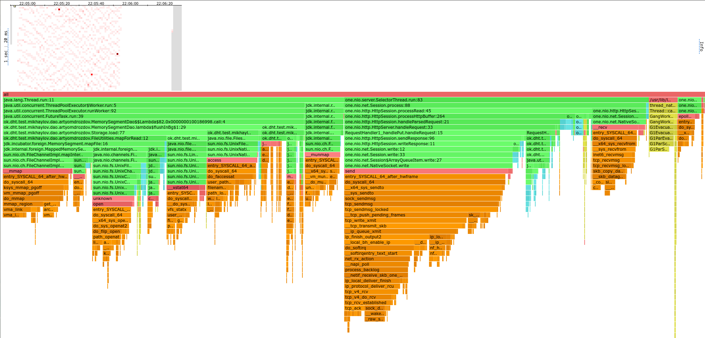
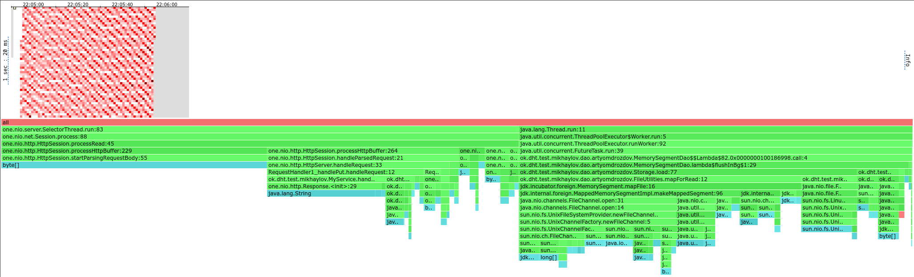
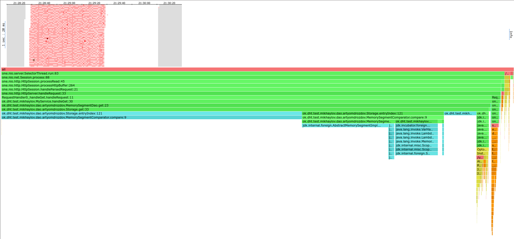

# Отчет по первой задаче

Используемая БД - LSM дерево, референсная реализация.

## Нагрузочное тестирование

### PUT

Тестирование производилось на пустой БД, с помощью скрипта [put.lua](scripts/put.lua).

#### Меньший объем значений

Подбором было установлено, что при 30000 запросах в секунду нагрузка на БД
является стабильной (все запросы успевают выполняться), а при 40000 запросах
в секунду нагрузка на БД становится нестабильной (выполняется только 2168 запросов).

Результат выполнения:

```
❯ wrk2 -d 60 -t 1 -c 1 -R 30000 -L -s scripts/put.lua "http://localhost:19234/"
Running 1m test @ http://localhost:19234/
  1 threads and 1 connections
  Thread calibration: mean lat.: 0.953ms, rate sampling interval: 10ms
  Thread Stats   Avg      Stdev     Max   +/- Stdev
    Latency   775.64us  482.24us   3.47ms   65.62%
    Req/Sec    31.67k     2.79k   39.67k    63.10%
  Latency Distribution (HdrHistogram - Recorded Latency)
 50.000%  741.00us
 75.000%    1.04ms
 90.000%    1.50ms
 99.000%    1.96ms
 99.900%    2.08ms
 99.990%    2.18ms
 99.999%    3.24ms
100.000%    3.47ms

  Detailed Percentile spectrum:
       Value   Percentile   TotalCount 1/(1-Percentile)

       0.014     0.000000           22         1.00
       0.168     0.100000       150896         1.11
       0.316     0.200000       300330         1.25
       0.462     0.300000       450833         1.43
       0.604     0.400000       600792         1.67
       0.741     0.500000       750109         2.00
       0.808     0.550000       826070         2.22
       0.871     0.600000       900107         2.50
       0.932     0.650000       974999         2.86
       0.990     0.700000      1050752         3.33
       1.044     0.750000      1125130         4.00
       1.071     0.775000      1162983         4.44
       1.125     0.800000      1200344         5.00
       1.199     0.825000      1237560         5.71
       1.296     0.850000      1274931         6.67
       1.397     0.875000      1312689         8.00
       1.448     0.887500      1331297         8.89
       1.500     0.900000      1349930        10.00
       1.554     0.912500      1368855        11.43
       1.609     0.925000      1387547        13.33
       1.666     0.937500      1406274        16.00
       1.696     0.943750      1415801        17.78
       1.726     0.950000      1425142        20.00
       1.757     0.956250      1434494        22.86
       1.789     0.962500      1443808        26.67
       1.823     0.968750      1453284        32.00
       1.840     0.971875      1457831        35.56
       1.858     0.975000      1462437        40.00
       1.877     0.978125      1467233        45.71
       1.897     0.981250      1471958        53.33
       1.918     0.984375      1476596        64.00
       1.929     0.985938      1478984        71.11
       1.940     0.987500      1481179        80.00
       1.953     0.989062      1483673        91.43
       1.965     0.990625      1485895       106.67
       1.978     0.992188      1488192       128.00
       1.986     0.992969      1489491       142.22
       1.993     0.993750      1490535       160.00
       2.002     0.994531      1491761       182.86
       2.011     0.995313      1492970       213.33
       2.020     0.996094      1494125       256.00
       2.025     0.996484      1494707       284.44
       2.031     0.996875      1495286       320.00
       2.037     0.997266      1495898       365.71
       2.044     0.997656      1496444       426.67
       2.053     0.998047      1497058       512.00
       2.057     0.998242      1497335       568.89
       2.063     0.998437      1497669       640.00
       2.067     0.998633      1497882       731.43
       2.073     0.998828      1498214       853.33
       2.081     0.999023      1498482      1024.00
       2.085     0.999121      1498595      1137.78
       2.091     0.999219      1498770      1280.00
       2.097     0.999316      1498907      1462.86
       2.103     0.999414      1499033      1706.67
       2.111     0.999512      1499198      2048.00
       2.115     0.999561      1499267      2275.56
       2.119     0.999609      1499330      2560.00
       2.123     0.999658      1499395      2925.71
       2.129     0.999707      1499486      3413.33
       2.137     0.999756      1499547      4096.00
       2.141     0.999780      1499586      4551.11
       2.145     0.999805      1499626      5120.00
       2.151     0.999829      1499654      5851.43
       2.159     0.999854      1499695      6826.67
       2.167     0.999878      1499723      8192.00
       2.175     0.999890      1499740      9102.22
       2.187     0.999902      1499760     10240.00
       2.213     0.999915      1499779     11702.86
       2.247     0.999927      1499798     13653.33
       2.311     0.999939      1499813     16384.00
       2.343     0.999945      1499822     18204.44
       2.385     0.999951      1499832     20480.00
       2.469     0.999957      1499840     23405.71
       2.625     0.999963      1499850     27306.67
       2.775     0.999969      1499859     32768.00
       2.843     0.999973      1499863     36408.89
       2.921     0.999976      1499868     40960.00
       2.959     0.999979      1499872     46811.43
       3.041     0.999982      1499877     54613.33
       3.127     0.999985      1499882     65536.00
       3.161     0.999986      1499884     72817.78
       3.195     0.999988      1499886     81920.00
       3.229     0.999989      1499888     93622.86
       3.279     0.999991      1499891    109226.67
       3.311     0.999992      1499893    131072.00
       3.327     0.999993      1499894    145635.56
       3.345     0.999994      1499895    163840.00
       3.359     0.999995      1499896    187245.71
       3.389     0.999995      1499898    218453.33
       3.407     0.999996      1499899    262144.00
       3.407     0.999997      1499899    291271.11
       3.423     0.999997      1499900    327680.00
       3.423     0.999997      1499900    374491.43
       3.439     0.999998      1499901    436906.67
       3.455     0.999998      1499902    524288.00
       3.455     0.999998      1499902    582542.22
       3.455     0.999998      1499902    655360.00
       3.455     0.999999      1499902    748982.86
       3.471     0.999999      1499903    873813.33
       3.471     0.999999      1499903   1048576.00
       3.471     0.999999      1499903   1165084.44
       3.471     0.999999      1499903   1310720.00
       3.471     0.999999      1499903   1497965.71
       3.475     0.999999      1499904   1747626.67
       3.475     1.000000      1499904          inf
#[Mean    =        0.776, StdDeviation   =        0.482]
#[Max     =        3.474, Total count    =      1499904]
#[Buckets =           27, SubBuckets     =         2048]
----------------------------------------------------------
  1799996 requests in 1.00m, 115.01MB read
Requests/sec:  29999.95
Transfer/sec:      1.92MB
```

#### Больший размер значений

Если повысить размер значений до приблизительно 1Кб
(`wrk.body = "value#" .. index` было заменено на `wrk.body = string.rep("value#" .. index, 100)`)
, то 30000 запросов/сек перестало быть стабильной нагрузкой.
Максимальной стабильной нагрузкой стало 10000 запросов/сек.

Результат выполнения `wrk2` для значений размера 1Кб (без Detailed Percentile spectrum для краткости)

```
❯ wrk2 -d 60 -t 1 -c 1 -R 10000 -L -s scripts/put.lua "http://localhost:19234/"
Running 1m test @ http://localhost:19234/
  1 threads and 1 connections
  Thread calibration: mean lat.: 1.040ms, rate sampling interval: 10ms
  Thread Stats   Avg      Stdev     Max   +/- Stdev
    Latency     1.04ms  576.40us   3.98ms   58.87%
    Req/Sec    10.55k     0.98k   13.33k    56.96%
  Latency Distribution (HdrHistogram - Recorded Latency)
 50.000%    1.04ms
 75.000%    1.52ms
 90.000%    1.85ms
 99.000%    2.05ms
 99.900%    2.16ms
 99.990%    3.14ms
 99.999%    3.96ms
100.000%    3.98ms

#[Mean    =        1.041, StdDeviation   =        0.576]
#[Max     =        3.976, Total count    =       499944]
#[Buckets =           27, SubBuckets     =         2048]
----------------------------------------------------------
  599984 requests in 1.00m, 38.34MB read
Requests/sec:   9999.67
Transfer/sec:    654.28KB
```

#### Выводы

- При стабильной нагрузке (30000 запросов/сек) (для небольшого размера значений) на сервер нет "длинного хвоста" в
  распределении latency, максимальное значение не превышает 3.5 мс.
- При более высокой нагрузке (40000 запросов/сек) наблюдается "длинный хвост" в распределении latency,
  90-й перцентиль превышает 100мс, что уже неприемлемо:
  ```
    50.000%  738.00us
    75.000%    1.11ms
    90.000%  116.35ms
    99.000%  292.10ms
    99.900%  322.56ms
    99.990%  327.42ms
    99.999%  327.68ms
    100.000%  327.68ms
  ```
  Хвост образуется из-за того, что сервер не успевает обработать запросы, поступающие слишком быстро.
  Тогда новые запросы начинают откладываться в очередь, и они начинают обрабатываться с большой задержкой.
- При бóльших объемах данных стабильная нагрузка понижается, сервер способен обработать только 10000 запросов/сек.

### GET

БД заполнялась с помощью той же команды `wrk2` и того же скрипта [put.lua](scripts/put.lua) со значением размера 1Кб.
Всего в БД 1.5 млн записей _(на самом деле чуть-чуть меньше, т.к. несколько запросов не прошли)_ и 1.804 Гб данных.
Этого достаточно, чтобы данные не помещались в оперативную память.

Использовался скрипт [get.lua](scripts/get.lua). Аналогично PUT была найдена стабильная нагрузка - 2000 запросов/сек.

```
❯ wrk2 -d 60 -t 1 -c 1 -R 2000 -L -s scripts/get.lua "http://localhost:19234/"
Running 1m test @ http://localhost:19234/
  1 threads and 1 connections
  Thread calibration: mean lat.: 8.367ms, rate sampling interval: 10ms
  Thread Stats   Avg      Stdev     Max   +/- Stdev
    Latency     2.36ms    8.75ms  89.34ms   97.04%
    Req/Sec     2.11k   197.43     3.33k    80.16%
  Latency Distribution (HdrHistogram - Recorded Latency)
 50.000%    0.96ms
 75.000%    1.25ms
 90.000%    1.42ms
 99.000%   62.21ms
 99.900%   81.47ms
 99.990%   88.70ms
 99.999%   89.41ms
100.000%   89.41ms

  Detailed Percentile spectrum:
       Value   Percentile   TotalCount 1/(1-Percentile)

       0.321     0.000000            1         1.00
       0.498     0.100000        10028         1.11
       0.615     0.200000        20036         1.25
       0.731     0.300000        30003         1.43
       0.847     0.400000        40051         1.67
       0.963     0.500000        50054         2.00
       1.021     0.550000        55024         2.22
       1.078     0.600000        60017         2.50
       1.136     0.650000        65038         2.86
       1.193     0.700000        70038         3.33
       1.250     0.750000        75003         4.00
       1.279     0.775000        77565         4.44
       1.307     0.800000        80027         5.00
       1.335     0.825000        82514         5.71
       1.363     0.850000        85029         6.67
       1.391     0.875000        87519         8.00
       1.406     0.887500        88763         8.89
       1.423     0.900000        90051        10.00
       1.441     0.912500        91297        11.43
       1.468     0.925000        92502        13.33
       1.508     0.937500        93754        16.00
       1.538     0.943750        94371        17.78
       1.595     0.950000        95007        20.00
       1.715     0.956250        95620        22.86
       2.463     0.962500        96241        26.67
       7.955     0.968750        96867        32.00
      13.535     0.971875        97178        35.56
      19.103     0.975000        97491        40.00
      26.287     0.978125        97803        45.71
      37.823     0.981250        98117        53.33
      47.999     0.984375        98428        64.00
      52.575     0.985938        98584        71.11
      57.887     0.987500        98741        80.00
      61.119     0.989062        98900        91.43
      63.071     0.990625        99054       106.67
      65.183     0.992188        99210       128.00
      66.431     0.992969        99288       142.22
      67.775     0.993750        99370       160.00
      69.119     0.994531        99444       182.86
      70.847     0.995313        99524       213.33
      72.319     0.996094        99605       256.00
      72.959     0.996484        99639       284.44
      73.727     0.996875        99682       320.00
      75.199     0.997266        99717       365.71
      77.119     0.997656        99757       426.67
      78.207     0.998047        99800       512.00
      78.399     0.998242        99815       568.89
      78.783     0.998437        99837       640.00
      79.807     0.998633        99854       731.43
      81.023     0.998828        99873       853.33
      81.535     0.999023        99895      1024.00
      81.855     0.999121        99903      1137.78
      82.367     0.999219        99914      1280.00
      83.007     0.999316        99922      1462.86
      84.287     0.999414        99932      1706.67
      85.247     0.999512        99942      2048.00
      85.695     0.999561        99947      2275.56
      86.079     0.999609        99951      2560.00
      86.399     0.999658        99956      2925.71
      86.911     0.999707        99961      3413.33
      87.487     0.999756        99966      4096.00
      87.807     0.999780        99970      4551.11
      87.935     0.999805        99971      5120.00
      88.127     0.999829        99973      5851.43
      88.447     0.999854        99976      6826.67
      88.575     0.999878        99978      8192.00
      88.703     0.999890        99981      9102.22
      88.703     0.999902        99981     10240.00
      88.831     0.999915        99982     11702.86
      88.959     0.999927        99984     13653.33
      88.959     0.999939        99984     16384.00
      89.023     0.999945        99985     18204.44
      89.151     0.999951        99986     20480.00
      89.151     0.999957        99986     23405.71
      89.279     0.999963        99988     27306.67
      89.279     0.999969        99988     32768.00
      89.279     0.999973        99988     36408.89
      89.279     0.999976        99988     40960.00
      89.279     0.999979        99988     46811.43
      89.407     0.999982        99990     54613.33
      89.407     1.000000        99990          inf
#[Mean    =        2.355, StdDeviation   =        8.753]
#[Max     =       89.344, Total count    =        99990]
#[Buckets =           27, SubBuckets     =         2048]
----------------------------------------------------------
  119999 requests in 1.00m, 134.17MB read
Requests/sec:   1999.98
Transfer/sec:      2.24MB
```

Можем заметить, что GET запросы выполняются существенно медленнее, чем PUT запросы.
Это связано с тем, что LSM оптимизировано под запись - чтение требует ходить в диск, а запись может откладывать запись в
диск и писать в память.
При этом у latency GET запросов "длинный хвост" - высокие значения последних перцентилей (90%, 99%) и т.д.
Причина его появления аналогична запросам PUT - запросов слишком много и они встают в очередь.

## Профилирование

Все профилирование производилось на прогретой JVM, поэтому JIT в профилях нет.

### PUT

#### CPU 



- 42% CPU используется для записи на диск в `MemorySegmentDao.flushInBg`.
  Это можно улучшить, записывая на диск реже - у меня поставлена запись по 1 Мб.
  Но тогда мы платим надежностью, т.к. если сервер упадет, то мы потеряем больше данных.
- `upsert` в DAO занимает только 3.46% CPU.
  Следовательно, основная цена в DAO - это запись на диск и оптимизировать надо именно ее.
- Ещё 32% CPU уходит на отправку ответа клиенту и чтение запроса. Это кажется не улучшаемым.

#### Аллокации



- 42% аллокаций происходят в `MemorySegmentDao.flushInBg`.
  Я не вижу способов улучшить это, т.к. данные в любом случае придется записывать на диск.
- 56% аллокаций происходят при чтении запроса. Опять же, не улучшаемо.

### GET

#### CPU



Большая часть CPU (86%) используется в `Storage.entryIndex` - в одном call-site он заинлайнен, в другом - нет,
поэтому в flamegraph'е он выглядит как две полоски.
В `Storage.entryIndex` происходит поиск по диску, CPU тратится на сравнение сегментов памяти.
Это можно снизить, если добавить в `Storage` кэш блоков.
Также предполагаю, что можно держать в памяти хеши от блоков, тогда можно будет изначально сравнивать хеши, а не сами
блоки.

Немного CPU (1.7%) используется при записи ответа в сокет, но это кажется неизбежным.

#### Аллокации


Практически все аллокации (99%) происходят тоже в `Storage.entryIndex`, когда данные переносятся с диска в оперативную память.
Возможные улучшения те же самые, что указаны выше - если нужно будет меньше ходить в диск, то и аллокаций будет меньше.